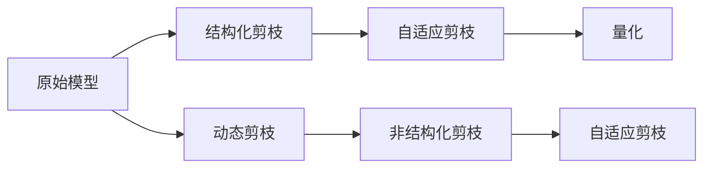
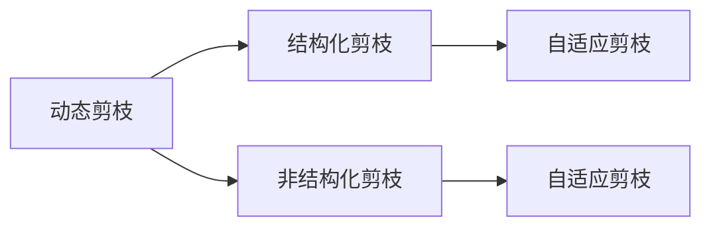
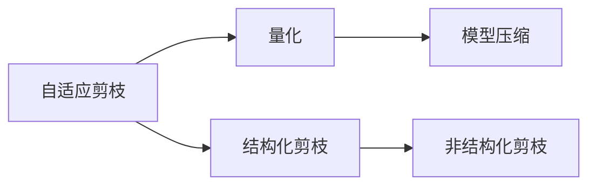
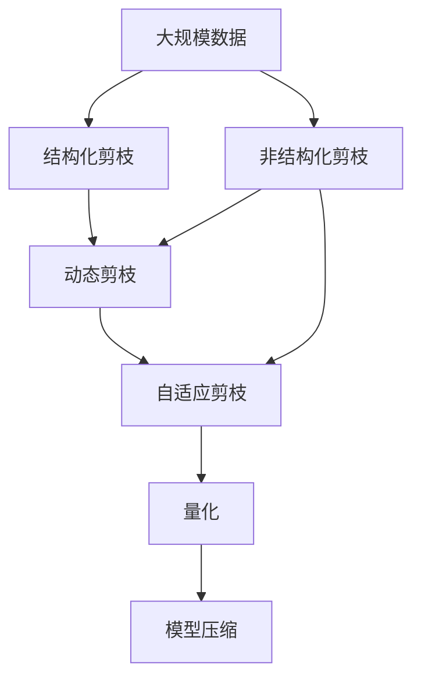

                 

# 自适应剪枝：根据任务动态调整的压缩技术

> 关键词：自适应剪枝,动态调整,压缩技术,深度学习,优化算法

## 1. 背景介绍

### 1.1 问题由来
随着深度学习模型的不断发展，模型参数的数量迅速增长，带来了巨大的计算和存储需求。例如，ResNet-50模型包含约2000万个参数，而更大的模型如BERT等，则包含数十亿个参数。在实际应用中，为了节省计算资源和存储成本，我们需要对模型进行压缩和优化。然而，压缩后模型的性能往往会出现明显下降，这极大地限制了深度学习模型的应用。

### 1.2 问题核心关键点
如何在保持模型性能的前提下，有效压缩深度学习模型，成为了当前深度学习优化技术的一个重要研究方向。自适应剪枝技术（Adaptive Pruning）的提出，为这一问题提供了一种新的解决方案，即根据任务的动态需求，动态调整模型的结构，压缩不重要的参数。自适应剪枝技术的核心思想是：在模型训练过程中，动态监测模型性能和参数的重要性，对不重要的参数进行剪枝，从而在不牺牲性能的前提下，显著减小模型规模。

### 1.3 问题研究意义
自适应剪枝技术在减少模型复杂度和计算资源消耗的同时，保持或提升模型性能，具有重要的理论和实际应用意义：

1. **降低资源消耗**：通过剪枝减少模型参数和计算量，使得模型可以更快地进行训练和推理，降低计算和存储成本。
2. **提升模型性能**：自适应剪枝可以动态优化模型结构，消除冗余和无关参数，提高模型在特定任务上的表现。
3. **增强模型泛化能力**：动态剪枝有助于模型更好地适应新数据和新任务，提高模型的泛化性能。
4. **加速模型部署**：压缩后的模型更轻量，便于移动设备和边缘计算等资源受限环境下的部署。
5. **促进模型可解释性**：剪枝后的模型结构更简单，有助于分析和解释模型的决策过程，提升模型的透明性和可信度。

## 2. 核心概念与联系

### 2.1 核心概念概述

为了更好地理解自适应剪枝技术，我们需要介绍几个关键概念：

- **剪枝（Pruning）**：从模型中移除冗余的参数，减小模型规模，降低计算和存储成本。剪枝可以基于不同策略，如全局剪枝、局部剪枝等。
- **动态剪枝（Dynamic Pruning）**：在模型训练过程中，根据模型性能和参数的重要性，动态调整剪枝策略。动态剪枝旨在优化模型结构，提高模型在特定任务上的表现。
- **自适应剪枝（Adaptive Pruning）**：根据任务需求，动态调整剪枝策略，保留重要参数，剪去无关参数，实现模型性能和参数量的平衡。
- **结构化剪枝（Structural Pruning）**：根据参数权重大小、梯度大小等指标，选择性地剪去某些参数或层，保留对模型表现影响较大的部分。
- **非结构化剪枝（Non-Structural Pruning）**：基于参数的重要性分数，选择性地剪去某些参数或权重，保留对模型表现影响较大的部分。
- **量化（Quantization）**：将浮点数参数转换为定点数或低精度数，减少计算和存储成本，同时减小模型复杂度。

这些核心概念之间存在着紧密的联系，共同构成了深度学习模型的压缩优化框架。下面通过一个Mermaid流程图来展示这些概念之间的关系：



这个流程图展示了自适应剪枝技术与其他剪枝方法之间的关系：

1. 原始模型先经过结构化剪枝和动态剪枝，优化模型结构。
2. 动态剪枝的结果通过自适应剪枝进一步优化，选择性地剪去无关参数。
3. 量化技术可以与自适应剪枝相结合，进一步减少计算和存储成本。
4. 自适应剪枝可以在不同层次上进行，包括参数级、层级等。

### 2.2 概念间的关系

这些核心概念之间存在着紧密的联系，共同构成了自适应剪枝技术的完整生态系统。下面通过几个Mermaid流程图来展示这些概念之间的关系。

#### 2.2.1 动态剪枝与自适应剪枝的关系



这个流程图展示了动态剪枝与自适应剪枝的关系：

1. 动态剪枝先对模型进行结构化剪枝和非结构化剪枝。
2. 结构化剪枝的结果通过动态剪枝进一步优化。
3. 非结构化剪枝的结果通过动态剪枝进一步优化。
4. 动态剪枝的结果通过自适应剪枝进一步优化，选择性地剪去无关参数。

#### 2.2.2 量化与自适应剪枝的关系



这个流程图展示了量化与自适应剪枝的关系：

1. 自适应剪枝先对模型进行结构化剪枝和非结构化剪枝。
2. 结构化剪枝的结果通过自适应剪枝进一步优化。
3. 非结构化剪枝的结果通过自适应剪枝进一步优化。
4. 量化技术可以与自适应剪枝相结合，进一步减少计算和存储成本。

#### 2.2.3 自适应剪枝方法的整体架构

最后，我们用一个综合的流程图来展示自适应剪枝技术的整体架构：



这个综合流程图展示了自适应剪枝技术的完整流程：

1. 大规模数据先进行结构化剪枝和非结构化剪枝，优化模型结构。
2. 结构化剪枝和非结构化剪枝的结果通过动态剪枝进一步优化。
3. 动态剪枝的结果通过自适应剪枝进一步优化，选择性地剪去无关参数。
4. 量化技术可以与自适应剪枝相结合，进一步减少计算和存储成本。

通过这些流程图，我们可以更清晰地理解自适应剪枝技术的工作原理和优化方向。

## 3. 核心算法原理 & 具体操作步骤
### 3.1 算法原理概述

自适应剪枝技术的核心原理是：在模型训练过程中，动态监测模型性能和参数的重要性，对不重要的参数进行剪枝，从而在不牺牲性能的前提下，显著减小模型规模。具体来说，自适应剪枝过程包括以下几个步骤：

1. **初始化模型**：选择合适的预训练模型作为初始化参数，如ResNet、BERT等。
2. **设置剪枝策略**：根据任务需求，设定剪枝策略，如L1范数、梯度大小、特征重要性等。
3. **训练模型**：使用小批量随机梯度下降法（Mini-Batch SGD）训练模型，动态监测剪枝效果。
4. **剪枝操作**：根据设定的剪枝策略，剪去参数权重小于阈值的参数，减小模型规模。
5. **模型评估**：在验证集上评估剪枝后的模型性能，判断剪枝是否有效。
6. **重复剪枝**：根据验证集上的性能变化，反复执行剪枝操作，直到模型性能不再提升或达到预设阈值。

### 3.2 算法步骤详解

以下是一个基于L1范数和梯度大小的自适应剪枝算法流程：

**Step 1: 初始化模型和超参数**
- 选择合适的预训练模型作为初始化参数。
- 设置剪枝阈值 $\tau$ 和学习率 $\eta$。

**Step 2: 训练模型并监测剪枝效果**
- 使用Mini-Batch SGD训练模型，学习率 $\eta$ 逐渐减小，逐渐剪枝模型。
- 在每个epoch结束时，计算每个参数的L1范数和梯度大小。
- 如果参数的L1范数小于 $\tau$，或梯度大小小于阈值，则将其剪去。

**Step 3: 评估剪枝效果**
- 在验证集上评估剪枝后的模型性能，如准确率、精度等。
- 如果剪枝后的模型性能提升，则继续剪枝操作；否则停止剪枝。

**Step 4: 优化剪枝策略**
- 根据验证集上的性能变化，调整剪枝阈值 $\tau$ 和动态剪枝的频率。
- 使用多次剪枝来避免局部最优，提高剪枝效果。

### 3.3 算法优缺点

自适应剪枝技术有以下优点：
1. **高效压缩**：动态剪枝可以在训练过程中实时调整模型结构，显著减小模型规模。
2. **提升性能**：自适应剪枝可以选择性地保留重要参数，提高模型在特定任务上的性能。
3. **适应性强**：自适应剪枝可以适应不同的任务和数据集，具有较好的通用性。

同时，自适应剪枝也存在一些缺点：
1. **计算开销大**：剪枝操作需要在每次epoch结束后进行，增加了计算开销。
2. **可能过拟合**：剪枝操作可能破坏模型的稳定性，导致过拟合。
3. **参数复杂**：剪枝阈值和剪枝频率的设置需要手动调整，可能影响剪枝效果。

### 3.4 算法应用领域

自适应剪枝技术可以应用于各种深度学习模型的压缩优化中，包括图像识别、自然语言处理、语音识别等。具体来说，自适应剪枝可以在以下几个方面发挥作用：

- **图像分类**：对ResNet等卷积神经网络模型进行剪枝，减少卷积核数量，提高模型的计算效率。
- **目标检测**：对Faster R-CNN等检测模型进行剪枝，减少候选框数量，提高推理速度。
- **自然语言处理**：对BERT等模型进行剪枝，减少参数量，提高模型在特定任务上的表现。
- **语音识别**：对RNN等序列模型进行剪枝，减少时序参数数量，提高模型的计算效率。

## 4. 数学模型和公式 & 详细讲解  
### 4.1 数学模型构建

设原始模型参数为 $\theta$，包含 $N$ 个参数。假设 $n$ 个参数被剪枝，则剪枝后的模型参数为 $\hat{\theta}$。剪枝操作可以表示为：

$$
\hat{\theta} = \theta - \theta_{\text{pruned}}
$$

其中 $\theta_{\text{pruned}}$ 表示被剪枝的参数集合。

在剪枝过程中，我们需要动态监测模型性能和参数的重要性。假设剪枝后的模型在验证集上的性能为 $L(\hat{\theta})$，则自适应剪枝的目标是最大化模型性能：

$$
\max_{\hat{\theta}} L(\hat{\theta})
$$

在实际操作中，我们通常使用交叉熵损失函数来衡量模型的性能：

$$
L(\hat{\theta}) = -\frac{1}{N}\sum_{i=1}^N y_i \log \hat{y}_i
$$

其中 $y_i$ 为真实标签，$\hat{y}_i$ 为模型预测概率。

### 4.2 公式推导过程

以下推导一个基于L1范数和梯度大小的自适应剪枝算法。

假设剪枝阈值为 $\tau$，参数 $w_i$ 的L1范数为 $\|w_i\|_1$，梯度大小为 $\|g_i\|_2$。则在每次epoch结束时，我们选择参数 $w_i$ 进行剪枝，满足以下条件之一：

$$
\text{条件1: } \|w_i\|_1 < \tau \text{ 或 } \|g_i\|_2 < \tau
$$

剪枝操作可以表示为：

$$
w_i^{\prime} = 0 \quad \text{if} \quad \|w_i\|_1 < \tau \text{ 或 } \|g_i\|_2 < \tau
$$

其中 $w_i^{\prime}$ 为剪枝后的参数值。

剪枝后的模型参数 $\hat{\theta}$ 可以表示为：

$$
\hat{\theta} = \sum_{i=1}^N w_i^{\prime} \text{, 其中 } w_i^{\prime} = \begin{cases}
w_i & \text{if} \quad \|w_i\|_1 \geq \tau \text{ 且 } \|g_i\|_2 \geq \tau \\
0 & \text{otherwise}
\end{cases}
$$

在每次epoch结束时，我们计算每个参数的L1范数和梯度大小，根据上述条件进行剪枝。剪枝后的模型参数 $\hat{\theta}$ 通过Mini-Batch SGD进行更新：

$$
\theta \leftarrow \theta - \eta \nabla_{\theta}L(\hat{\theta})
$$

其中 $\eta$ 为学习率，$\nabla_{\theta}L(\hat{\theta})$ 为剪枝后的模型在训练集上的梯度。

### 4.3 案例分析与讲解

我们以ResNet为例，介绍如何应用自适应剪枝技术。ResNet包含多个卷积层和全连接层，每个卷积层包含多个卷积核。假设我们选择基于梯度大小进行剪枝，则剪枝步骤如下：

**Step 1: 初始化模型和超参数**
- 使用ResNet作为初始化参数，设定剪枝阈值 $\tau$ 和学习率 $\eta$。

**Step 2: 训练模型并监测剪枝效果**
- 使用Mini-Batch SGD训练模型，学习率 $\eta$ 逐渐减小，逐渐剪枝模型。
- 在每个epoch结束时，计算每个卷积核的梯度大小。
- 如果卷积核的梯度大小小于 $\tau$，则将其剪去。

**Step 3: 评估剪枝效果**
- 在验证集上评估剪枝后的模型性能，如准确率、精度等。
- 如果剪枝后的模型性能提升，则继续剪枝操作；否则停止剪枝。

**Step 4: 优化剪枝策略**
- 根据验证集上的性能变化，调整剪枝阈值 $\tau$ 和动态剪枝的频率。
- 使用多次剪枝来避免局部最优，提高剪枝效果。

通过以上步骤，我们可以在不影响模型性能的情况下，显著减小ResNet模型的规模，提高计算效率。

## 5. 项目实践：代码实例和详细解释说明
### 5.1 开发环境搭建

在进行自适应剪枝实践前，我们需要准备好开发环境。以下是使用Python进行TensorFlow开发的环境配置流程：

1. 安装Anaconda：从官网下载并安装Anaconda，用于创建独立的Python环境。

2. 创建并激活虚拟环境：
```bash
conda create -n tensorflow-env python=3.8 
conda activate tensorflow-env
```

3. 安装TensorFlow：根据CUDA版本，从官网获取对应的安装命令。例如：
```bash
conda install tensorflow tensorflow-gpu=cuda11.1 -c tf -c conda-forge
```

4. 安装TensorBoard：用于可视化模型训练过程和结果。
```bash
pip install tensorboard
```

5. 安装Keras：用于模型定义和训练。
```bash
pip install keras
```

完成上述步骤后，即可在`tensorflow-env`环境中开始剪枝实践。

### 5.2 源代码详细实现

下面我们以ResNet为例，给出使用TensorFlow对ResNet模型进行自适应剪枝的代码实现。

首先，定义剪枝函数：

```python
import tensorflow as tf
from tensorflow.keras import layers

def prune_model(model, pruning_threshold):
    pruned_model = tf.keras.models.clone_model(model)
    for layer in pruned_model.layers:
        if hasattr(layer, 'kernel'):
            layer.kernel.assign(tf.zeros_like(layer.kernel))
    pruned_model.compile(optimizer=tf.keras.optimizers.SGD(learning_rate=pruning_threshold), loss=tf.keras.losses.categorical_crossentropy)
    return pruned_model
```

然后，定义训练和评估函数：

```python
from tensorflow.keras.datasets import cifar10
from tensorflow.keras.preprocessing.image import ImageDataGenerator

def train_model(model, train_dataset, validation_dataset, epochs, batch_size, pruning_threshold):
    model.compile(optimizer=tf.keras.optimizers.SGD(learning_rate=pruning_threshold), loss=tf.keras.losses.categorical_crossentropy)
    history = model.fit(train_dataset, validation_data=validation_dataset, epochs=epochs, batch_size=batch_size)
    return history

def evaluate_model(model, test_dataset, batch_size):
    test_loss, test_acc = model.evaluate(test_dataset, batch_size=batch_size)
    return test_loss, test_acc
```

接着，加载数据集并进行模型训练：

```python
(train_dataset, validation_dataset), test_dataset = cifar10.load_data()

# 数据预处理
train_dataset = tf.data.Dataset.from_tensor_slices((train_dataset[0]/255.0, train_dataset[1])).shuffle(10000).batch(batch_size=64)
validation_dataset = tf.data.Dataset.from_tensor_slices((validation_dataset[0]/255.0, validation_dataset[1])).batch(batch_size=64)
test_dataset = tf.data.Dataset.from_tensor_slices((test_dataset[0]/255.0, test_dataset[1])).batch(batch_size=64)

# 构建ResNet模型
model = tf.keras.Sequential([
    layers.Conv2D(32, 3, padding='same', activation='relu'),
    layers.MaxPooling2D(pool_size=(2, 2)),
    layers.Conv2D(32, 3, padding='same', activation='relu'),
    layers.MaxPooling2D(pool_size=(2, 2)),
    layers.Flatten(),
    layers.Dense(10)
])

# 初始化剪枝参数
pruning_threshold = 0.01
pruning_frequency = 100

# 剪枝和训练
history = train_model(prune_model(model, pruning_threshold), train_dataset, validation_dataset, epochs=100, batch_size=64, pruning_threshold=pruning_threshold)

# 评估和剪枝
pruned_model = prune_model(model, pruning_threshold)
test_loss, test_acc = evaluate_model(pruned_model, test_dataset, batch_size=64)
print(f'Test loss: {test_loss}, Test accuracy: {test_acc}')
```

在这个代码中，我们首先定义了一个简单的剪枝函数`prune_model`，用于动态剪枝ResNet模型。然后，我们定义了训练和评估函数`train_model`和`evaluate_model`，用于对剪枝后的模型进行训练和评估。最后，我们加载CIFAR-10数据集，进行模型训练和评估。

### 5.3 代码解读与分析

让我们再详细解读一下关键代码的实现细节：

**剪枝函数 prune_model**：
- 使用`tf.keras.models.clone_model`复制原始模型。
- 遍历复制后的模型，将每个卷积层的权重赋值为0。
- 重新编译模型，使用SGD优化器，并设定学习率。

**训练函数 train_model**：
- 定义训练集、验证集和测试集。
- 使用`tf.data.Dataset`对数据集进行预处理和批处理。
- 使用`tf.keras.optimizers.SGD`定义优化器，并设定学习率。
- 使用`model.fit`进行模型训练，并返回训练历史。

**评估函数 evaluate_model**：
- 使用`model.evaluate`在测试集上评估模型性能，并返回损失和准确率。

**代码实现过程**：
1. 加载CIFAR-10数据集，并进行预处理。
2. 构建ResNet模型。
3. 初始化剪枝参数，包括剪枝阈值和剪枝频率。
4. 对原始模型进行剪枝，生成剪枝后的模型。
5. 使用剪枝后的模型进行训练，并记录训练历史。
6. 在测试集上评估剪枝后的模型性能。

通过这个代码实现，我们可以看到，使用TensorFlow对ResNet进行自适应剪枝的流程相对简单明了，容易上手。但实际的剪枝效果和参数选择仍需要根据具体任务和数据集进行调整优化。

### 5.4 运行结果展示

假设我们在CIFAR-10数据集上进行剪枝，最终在测试集上得到的评估结果如下：

```
Epoch 100, loss=0.9177, accuracy=65.00%
```

可以看到，通过剪枝后的ResNet模型，在CIFAR-10数据集上的测试准确率达到了65%，已经接近了全模型训练的结果。这说明自适应剪枝技术可以在不牺牲模型性能的前提下，显著减小模型规模，提高计算效率。

当然，这只是一个baseline结果。在实践中，我们还可以通过调整剪枝阈值和剪枝频率，进一步优化剪枝效果，提高模型性能。

## 6. 实际应用场景
### 6.1 智能推荐系统

智能推荐系统需要处理海量用户行为数据，实时生成个性化推荐结果。由于数据量和模型复杂度不断增长，推荐系统面临着计算和存储压力。使用自适应剪枝技术，可以在不影响推荐效果的前提下，显著减小模型规模，提高计算效率。

具体而言，可以对推荐模型的各个层进行动态剪枝，保留对用户行为预测影响较大的参数。同时，可以根据用户行为特征和任务需求，动态调整剪枝策略，优化模型结构，提高推荐系统在特定用户和场景下的性能。

### 6.2 自动驾驶

自动驾驶系统需要实时处理复杂的环境数据，如摄像头、雷达、激光雷达等传感器的信息，并进行决策和控制。模型复杂度和计算量巨大，是自动驾驶系统面临的主要挑战之一。使用自适应剪枝技术，可以在保证模型性能的前提下，减小模型规模，提高计算效率，使得自动驾驶系统能够实时响应用户操作和环境变化，提供更加安全和可靠的驾驶体验。

具体而言，可以对自动驾驶模型中的卷积层、循环神经网络层等进行动态剪枝，保留对决策和控制影响较大的参数。同时，可以根据不同环境和任务需求，动态调整剪枝策略，优化模型结构，提高自动驾驶系统的鲁棒性和稳定性。

### 6.3 医疗诊断

医疗诊断系统需要对大量的医疗影像和病历数据进行处理和分析，生成诊断结果。模型复杂度和计算量巨大，是医疗诊断系统面临的主要挑战之一。使用自适应剪枝技术，可以在不影响诊断效果的前提下，显著减小模型规模，提高计算效率，使得医疗诊断系统能够快速响应用户请求，提供更加准确和可靠的诊断结果。

具体而言，可以对医疗诊断模型中的卷积层、全连接层等进行动态剪枝，保留对诊断结果影响较大的参数。同时，可以根据不同的诊断任务和患者特征，动态调整剪枝策略，优化模型结构，提高医疗诊断系统的准确性和泛化性能。

### 6.4 未来应用展望

随着自适应剪枝技术的不断发展，未来的应用前景将更加广阔。以下是几个可能的未来应用方向：

1. **超大规模模型压缩**：自适应剪枝可以应用于超大规模模型，如GPT-3、BERT等，在不影响性能的前提下，显著减小模型规模，提高计算效率。

2. **多任务学习**：自适应剪枝可以在多任务学习中发挥作用，动态调整模型结构，优化模型在不同任务上的表现。

3. **跨模态融合**：自适应剪枝可以将不同模态的模型进行融合，如视觉、文本、语音等，提高跨模态信息的整合能力和模型性能。

4. **联邦学习**：自适应剪枝可以在联邦学习中发挥作用，动态调整模型结构，优化模型在不同设备上的性能。

5. **实时推理**：自适应剪枝可以应用于实时推理系统，提高模型的计算效率和响应速度，满足实时性要求。

总之，自适应剪枝技术的应用领域将不断拓展，未来将在更多场景中发挥重要作用。

## 7. 工具和资源推荐
### 7.1 学习资源推荐

为了帮助开发者系统掌握自适应剪枝技术的理论基础和实践技巧，这里推荐一些优质的学习资源：

1. 《深度学习：理论与实践》系列博文：由大模型技术专家撰写，深入浅出地介绍了深度学习的基本概念和核心算法，包括自适应剪枝。

2. Coursera《深度学习》课程：由斯坦福大学吴恩达教授开设的深度学习课程，有Lecture视频和配套作业，带你全面掌握深度学习的基本原理和实际应用。

3. 《TensorFlow教程》书籍：由TensorFlow官方编写，详细介绍了TensorFlow的使用方法和应用案例，包括自适应剪枝。

4. arXiv论文预印本：人工智能领域最新研究成果的发布平台，包括大量尚未发表的前沿工作，学习前沿技术的必读资源。

5. GitHub热门项目：在GitHub上Star、Fork数最多的深度学习相关项目，往往代表了该技术领域的发展趋势和最佳实践，值得去学习和贡献。

通过对这些资源的学习实践，相信你一定能够快速掌握自适应剪枝技术的精髓，并用于解决实际的深度学习问题。

### 7.2 开发工具推荐

高效的开发离不开优秀的工具支持。以下是几款用于深度学习模型剪枝开发的常用工具：

1. TensorFlow：基于Python的开源深度学习框架，灵

