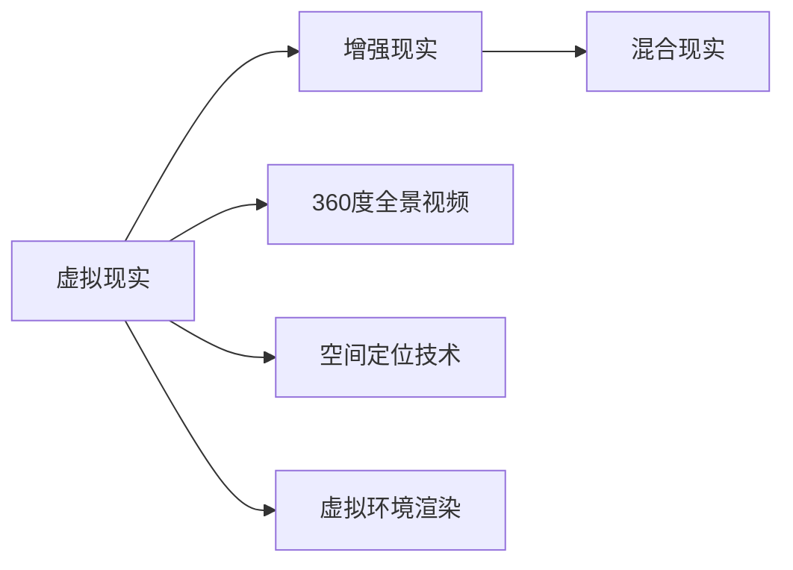
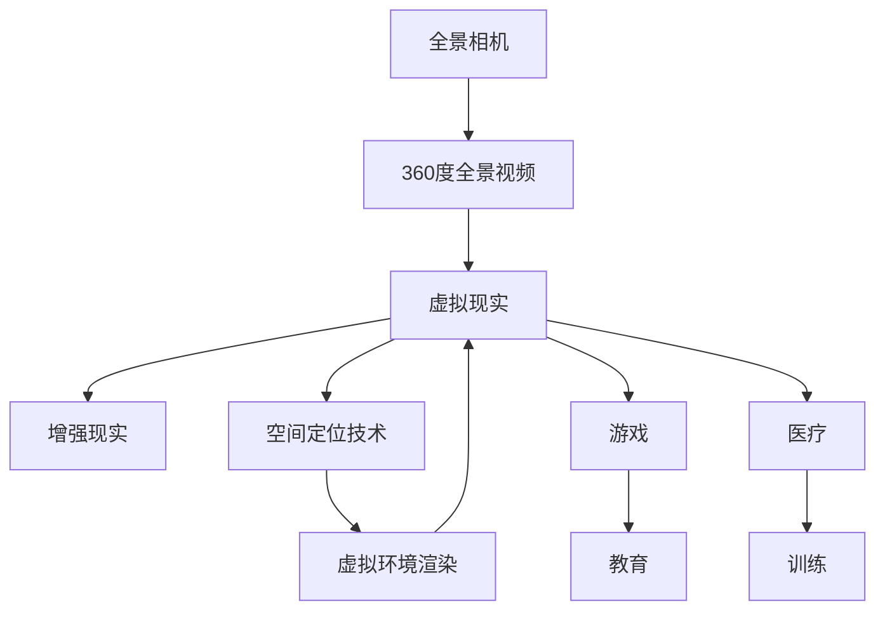

                 

# 虚拟现实 (Virtual Reality)

虚拟现实 (Virtual Reality, 简称 VR) 是近年来兴起的一项新兴技术，它通过计算机技术、多媒体技术、仿真技术、网络技术等多种技术手段，生成一个逼真的三维虚拟环境，使用户可以沉浸其中，获得身临其境的体验。VR 技术已经广泛应用于游戏、教育、医疗、军事、房地产等领域，成为推动产业数字化转型的重要力量。

## 1. 背景介绍

### 1.1 问题由来

虚拟现实技术的发展，可以追溯到1960年代，当时科学家们开始尝试使用计算机生成虚拟场景，让用户能够通过头盔显示器 (Head-Mounted Display, HMD) 体验到三维虚拟环境。早期的 VR 系统由于硬件技术的限制，只能提供简单的视觉和听觉效果，用户体验和沉浸感都相当有限。

随着计算机图形学、计算机视觉、计算机网络、传感器技术等领域的快速发展，VR 技术逐步成熟，并开始向消费级和专业级两个方向发展。在消费级领域，VR 主要应用于游戏、娱乐等场景，为用户提供沉浸式体验。在专业级领域，VR 则被广泛应用于军事模拟、医疗培训、建筑设计等领域，通过仿真技术实现对真实场景的模拟和分析。

### 1.2 问题核心关键点

虚拟现实技术的主要目标是通过计算机生成逼真的三维虚拟环境，使用户能够沉浸其中，获得身临其境的体验。虚拟现实系统通常包括以下几个关键组件：

- 传感器：包括位置传感器、姿态传感器、深度传感器等，用于捕捉用户的运动和姿势，实现对虚拟环境的交互。
- 显示设备：头盔显示器或曲面屏幕，用于显示虚拟场景。
- 控制器：手柄、手势识别器等设备，用于与虚拟环境进行交互。
- 渲染引擎：用于生成三维虚拟场景，包括地形、物体、光照、阴影等效果。

这些关键组件的协同工作，使得用户能够在虚拟环境中自由移动、观察、操作，获得更加真实和沉浸的体验。

### 1.3 问题研究意义

虚拟现实技术的发展，对于推动产业数字化转型、提升用户体验、促进跨领域协作等方面具有重要意义：

1. **产业数字化转型**：虚拟现实技术能够将现实世界的复杂场景进行数字化重构，为企业的数字化管理提供新的手段，提高生产效率。
2. **提升用户体验**：通过虚拟现实技术，用户可以体验到真实世界中难以实现的场景，如高空飞行、深海潜水、极端环境探索等，获得更丰富和沉浸的体验。
3. **促进跨领域协作**：虚拟现实技术可以模拟真实场景，使得不同领域的专家能够在一个虚拟环境中进行协作，解决复杂问题。
4. **教育培训**：虚拟现实技术可以模拟各种教学场景，如虚拟实验室、虚拟手术等，帮助学生和医生进行模拟训练，提高技能水平。
5. **医疗健康**：虚拟现实技术可以用于心理治疗、康复训练等医疗领域，帮助患者恢复健康。

虚拟现实技术的应用前景广阔，正在逐步改变人们的生产和生活方式。

## 2. 核心概念与联系

### 2.1 核心概念概述

为了更好地理解虚拟现实技术，我们需要介绍几个关键概念：

- **虚拟现实 (Virtual Reality, VR)**：通过计算机技术生成一个逼真的三维虚拟环境，使用户能够沉浸其中，获得身临其境的体验。
- **增强现实 (Augmented Reality, AR)**：在现实世界中添加虚拟元素，实现对现实世界的增强，常用于导航、教育、游戏等领域。
- **混合现实 (Mixed Reality, MR)**：将虚拟对象和现实世界进行融合，使用户能够在虚拟和现实环境中自由切换，常用于协作、设计、训练等领域。
- **360度全景视频**：通过全景相机捕捉现实世界的三维场景，并生成360度全景视频，让用户可以自由地旋转观察，用于教育、房地产等领域。
- **空间定位技术**：通过传感器等设备捕捉用户的位置和姿势，实现对虚拟环境的交互，常用于游戏、机器人等领域。
- **虚拟环境渲染**：使用渲染引擎生成逼真的三维虚拟场景，包括地形、物体、光照、阴影等效果，常用于游戏、电影、建筑等领域。

这些核心概念共同构成了虚拟现实技术的框架，使得用户能够在虚拟环境中获得丰富的视觉、听觉、触觉等感官体验。

### 2.2 概念间的关系

这些核心概念之间存在着紧密的联系，形成了虚拟现实技术的完整生态系统。我们可以用以下Mermaid流程图来展示它们之间的关系：

这个流程图展示了虚拟现实、增强现实、混合现实、360度全景视频、空间定位技术和虚拟环境渲染之间的关系：

1. 虚拟现实技术包含了增强现实和混合现实，可以生成一个逼真的三维虚拟环境，供用户沉浸其中。
2. 360度全景视频可以生成虚拟环境的一部分，使用户能够在虚拟环境中获得更丰富的视觉体验。
3. 空间定位技术用于捕捉用户的位置和姿势，实现对虚拟环境的交互。
4. 虚拟环境渲染用于生成逼真的三维虚拟场景，包括地形、物体、光照、阴影等效果。

这些关键技术共同构成了虚拟现实技术的基础，使得用户能够在虚拟环境中获得丰富的感官体验，进行交互和探索。

### 2.3 核心概念的整体架构

最后，我们用一个综合的流程图来展示这些核心概念在大规模场景中的应用：

这个综合流程图展示了全景相机、360度全景视频、虚拟现实、增强现实、空间定位技术和虚拟环境渲染在大规模场景中的应用：

1. 全景相机可以捕捉现实世界的三维场景，并生成360度全景视频，供用户沉浸其中。
2. 360度全景视频可以被虚拟现实技术用于生成虚拟环境，供用户自由探索和交互。
3. 增强现实技术可以在现实世界中添加虚拟元素，提升用户的体验。
4. 虚拟环境渲染用于生成逼真的三维虚拟场景，包括地形、物体、光照、阴影等效果。
5. 空间定位技术用于捕捉用户的位置和姿势，实现对虚拟环境的交互。

这些技术可以应用于游戏、教育、医疗、军事、房地产等多个领域，为用户提供丰富的虚拟体验和交互功能。

## 3. 核心算法原理 & 具体操作步骤

### 3.1 算法原理概述

虚拟现实技术的核心原理是通过计算机生成逼真的三维虚拟环境，使用户能够在虚拟环境中进行自由移动、观察、操作，获得身临其境的体验。这一过程包括以下几个关键步骤：

1. **全景视频生成**：通过全景相机捕捉现实世界的三维场景，并生成360度全景视频。
2. **空间定位技术**：通过传感器等设备捕捉用户的位置和姿势，实现对虚拟环境的交互。
3. **虚拟环境渲染**：使用渲染引擎生成逼真的三维虚拟场景，包括地形、物体、光照、阴影等效果。
4. **交互控制**：通过控制器等设备实现对虚拟环境的交互，包括移动、观察、操作等。

这些步骤通过硬件设备和软件算法的协同工作，使得用户能够在虚拟环境中获得丰富的感官体验，进行交互和探索。

### 3.2 算法步骤详解

下面详细介绍虚拟现实技术的各个关键步骤：

#### 3.2.1 全景视频生成

全景视频生成是虚拟现实技术的第一步，通过全景相机捕捉现实世界的三维场景，生成360度全景视频。全景相机通常由多个摄像机组成，可以捕捉到一个球面范围内的所有视角，生成一个完整的全景视频。

全景视频生成过程包括以下几个关键步骤：

1. **相机标定**：通过标定相机的内部参数和外部参数，确定相机的投影模型。
2. **图像拼接**：将多个摄像机捕捉到的图像进行拼接，生成一个全景图像。
3. **全景视频渲染**：将全景图像渲染成视频，供用户观看。

#### 3.2.2 空间定位技术

空间定位技术用于捕捉用户的位置和姿势，实现对虚拟环境的交互。常见的空间定位技术包括位置传感器、姿态传感器、深度传感器等。

位置传感器可以测量用户的位置信息，常见的传感器包括GPS、Lidar等。姿态传感器可以测量用户的姿势信息，常见的传感器包括陀螺仪、加速度计等。深度传感器可以测量用户与虚拟环境之间的距离，常见的传感器包括ToF、激光雷达等。

空间定位技术用于生成用户的位置和姿势信息，供虚拟环境渲染和交互控制使用。

#### 3.2.3 虚拟环境渲染

虚拟环境渲染用于生成逼真的三维虚拟场景，包括地形、物体、光照、阴影等效果。常见的渲染引擎包括Unity、Unreal Engine等，这些引擎可以生成高质量的3D图像和动画。

虚拟环境渲染过程包括以下几个关键步骤：

1. **场景建模**：根据虚拟环境的需求，构建虚拟场景的三维模型。
2. **材质纹理**：为虚拟场景添加材质和纹理，增加逼真效果。
3. **光照处理**：添加光源和阴影效果，实现对光照和阴影的处理。
4. **渲染输出**：将渲染结果输出到显示器或头盔显示器，供用户观看。

#### 3.2.4 交互控制

交互控制用于实现对虚拟环境的交互，包括移动、观察、操作等。常见的交互控制设备包括手柄、手势识别器等。

手柄可以用于控制虚拟环境中的物体和角色，常见的设备包括Xbox、PS等。手势识别器可以用于实现手势控制，常见的设备包括Leap Motion、Kinect等。

交互控制设备用于实现用户对虚拟环境的交互，增强用户的沉浸感和体验。

### 3.3 算法优缺点

虚拟现实技术的优点包括：

1. **沉浸式体验**：通过计算机生成逼真的三维虚拟环境，用户可以身临其境地体验虚拟场景，获得丰富的感官体验。
2. **互动性**：用户可以通过控制器等设备实现对虚拟环境的交互，增强互动性。
3. **跨领域应用**：虚拟现实技术可以应用于游戏、教育、医疗、军事等多个领域，具有广泛的应用前景。
4. **模拟仿真**：虚拟现实技术可以用于模拟真实场景，如飞行、潜水、探索等，帮助用户进行模拟训练和探索。

虚拟现实技术的缺点包括：

1. **硬件成本高**：虚拟现实系统需要配备高质量的传感器、显示器、控制器等硬件设备，成本较高。
2. **交互复杂**：用户需要熟练掌握交互设备和交互技术，交互体验可能较为复杂。
3. **视觉疲劳**：长时间使用虚拟现实设备可能引发视觉疲劳和不适，需要适度休息和调整。
4. **技术门槛高**：虚拟现实技术涉及计算机图形学、计算机视觉、传感器技术等多个领域的知识，技术门槛较高。

### 3.4 算法应用领域

虚拟现实技术已经在多个领域得到应用，具体包括：

- **游戏娱乐**：虚拟现实技术广泛应用于游戏领域，为用户提供沉浸式的游戏体验。
- **教育培训**：虚拟现实技术可以用于虚拟实验室、虚拟手术等培训场景，帮助学生和医生进行模拟训练。
- **医疗健康**：虚拟现实技术可以用于心理治疗、康复训练等医疗领域，帮助患者恢复健康。
- **房地产**：虚拟现实技术可以用于房产展示和虚拟旅游，帮助用户进行虚拟房产选购和旅游体验。
- **军事模拟**：虚拟现实技术可以用于军事模拟和训练，帮助士兵进行战术演练和技能训练。
- **文化娱乐**：虚拟现实技术可以用于虚拟博物馆、虚拟展览等文化娱乐领域，为用户提供丰富的文化体验。
- **工业设计**：虚拟现实技术可以用于产品设计和原型测试，帮助工程师进行虚拟设计和验证。

## 4. 数学模型和公式 & 详细讲解

### 4.1 数学模型构建

虚拟现实技术涉及多个领域的数学模型，下面以渲染引擎为例，详细讲解虚拟环境渲染的数学模型。

虚拟环境渲染的数学模型主要包括以下几个关键部分：

- **三维建模**：将三维场景中的物体进行建模，生成几何图形和纹理。
- **光照模型**：计算光源与物体之间的光照关系，生成逼真的光照效果。
- **阴影模型**：计算光源与物体之间的阴影关系，生成逼真的阴影效果。
- **渲染方程**：将上述各个部分的计算结果进行组合，生成最终的渲染结果。

#### 4.1.1 三维建模

三维建模过程包括以下几个关键步骤：

1. **几何建模**：将三维场景中的物体进行建模，生成几何图形。常见的几何建模工具包括Blender、Maya等。
2. **纹理映射**：为三维模型添加材质和纹理，增加逼真效果。常见的纹理映射工具包括Texture Paint、Substance Painter等。

#### 4.1.2 光照模型

光照模型用于计算光源与物体之间的光照关系，生成逼真的光照效果。常见的光照模型包括Phong模型、Blinn-Phong模型、Phong光照模型等。

Phong光照模型的计算公式如下：

$$
\mathbf{I}(\mathbf{p}) = \mathbf{K}_{\mathrm{d}} \mathbf{L}(\mathbf{p}) \mathbf{a}_{\mathbf{d}}(\mathbf{p}, \mathbf{w}) \mathbf{n}(\mathbf{p})+\mathbf{K}_{\mathrm{s}} \mathbf{L}(\mathbf{p}) \mathbf{a}_{\mathbf{s}}(\mathbf{p}, \mathbf{w}) \mathbf{n}(\mathbf{p})+\mathbf{K}_{\mathrm{r}} \mathbf{L}(\mathbf{p}) \mathbf{a}_{\mathbf{r}}(\mathbf{p}, \mathbf{w}) \mathbf{n}(\mathbf{p})
$$

其中，$\mathbf{I}(\mathbf{p})$表示点光源 $\mathbf{p}$ 对点 $\mathbf{n}$ 的光照强度，$\mathbf{K}_{\mathrm{d}}$、$\mathbf{K}_{\mathrm{s}}$、$\mathbf{K}_{\mathrm{r}}$ 表示漫反射、镜面反射、镜面折射的系数，$\mathbf{L}(\mathbf{p})$ 表示点光源 $\mathbf{p}$ 的光照强度，$\mathbf{a}_{\mathbf{d}}(\mathbf{p}, \mathbf{w})$、$\mathbf{a}_{\mathbf{s}}(\mathbf{p}, \mathbf{w})$、$\mathbf{a}_{\mathbf{r}}(\mathbf{p}, \mathbf{w})$ 表示漫反射、镜面反射、镜面折射的余弦值，$\mathbf{n}(\mathbf{p})$ 表示点光源 $\mathbf{p}$ 的光照方向。

#### 4.1.3 阴影模型

阴影模型用于计算光源与物体之间的阴影关系，生成逼真的阴影效果。常见的阴影模型包括平顶阴影、点阴影、软阴影等。

软阴影模型的计算公式如下：

$$
\mathbf{I}_{\mathbf{s}}(\mathbf{p})=\mathbf{I}(\mathbf{p})-\mathbf{I}_{\mathbf{s}}^{\prime}(\mathbf{p})\left(\frac{\mathbf{n}(\mathbf{p}) \cdot \mathbf{w}}{\mathbf{n}(\mathbf{p}) \cdot \mathbf{n}(\mathbf{w})}\right)^{q}
$$

其中，$\mathbf{I}_{\mathbf{s}}(\mathbf{p})$ 表示点光源 $\mathbf{p}$ 对点 $\mathbf{n}$ 的阴影强度，$\mathbf{I}(\mathbf{p})$ 表示点光源 $\mathbf{p}$ 的光照强度，$\mathbf{I}_{\mathbf{s}}^{\prime}(\mathbf{p})$ 表示点光源 $\mathbf{p}$ 对点 $\mathbf{n}$ 的阴影强度，$\mathbf{n}(\mathbf{p})$ 表示点光源 $\mathbf{p}$ 的光照方向，$\mathbf{n}(\mathbf{w})$ 表示光源与物体的夹角，$q$ 表示阴影衰减指数。

#### 4.1.4 渲染方程

渲染方程用于将上述各个部分的计算结果进行组合，生成最终的渲染结果。常见的渲染方程包括Phong渲染方程、Blinn-Phong渲染方程、Phong光照渲染方程等。

Phong渲染方程的计算公式如下：

$$
\mathbf{L}(\mathbf{p}, \mathbf{w})=\mathbf{K}_{\mathrm{d}} \mathbf{a}_{\mathbf{d}}(\mathbf{p}, \mathbf{w}) \mathbf{I}_{\mathbf{d}}(\mathbf{p})+\mathbf{K}_{\mathrm{s}} \mathbf{a}_{\mathbf{s}}(\mathbf{p}, \mathbf{w}) \mathbf{I}_{\mathbf{s}}(\mathbf{p})+\mathbf{K}_{\mathrm{r}} \mathbf{a}_{\mathbf{r}}(\mathbf{p}, \mathbf{w}) \mathbf{I}_{\mathbf{r}}(\mathbf{p})
$$

其中，$\mathbf{L}(\mathbf{p}, \mathbf{w})$ 表示点光源 $\mathbf{p}$ 对点 $\mathbf{n}$ 的光照强度，$\mathbf{K}_{\mathrm{d}}$、$\mathbf{K}_{\mathrm{s}}$、$\mathbf{K}_{\mathrm{r}}$ 表示漫反射、镜面反射、镜面折射的系数，$\mathbf{a}_{\mathbf{d}}(\mathbf{p}, \mathbf{w})$、$\mathbf{a}_{\mathbf{s}}(\mathbf{p}, \mathbf{w})$、$\mathbf{a}_{\mathbf{r}}(\mathbf{p}, \mathbf{w})$ 表示漫反射、镜面反射、镜面折射的余弦值，$\mathbf{I}_{\mathbf{d}}(\mathbf{p})$、$\mathbf{I}_{\mathbf{s}}(\mathbf{p})$、$\mathbf{I}_{\mathbf{r}}(\mathbf{p})$ 表示点光源 $\mathbf{p}$ 对点 $\mathbf{n}$ 的光照强度。

### 4.2 公式推导过程

下面以Phong渲染方程为例，详细介绍其推导过程。

Phong渲染方程的推导过程包括以下几个关键步骤：

1. **漫反射**：点光源对物体表面的光照效果，计算公式如下：

   $$
   \mathbf{L}_{\mathbf{d}}(\mathbf{p}, \mathbf{w})=\mathbf{K}_{\mathrm{d}} \mathbf{a}_{\mathbf{d}}(\mathbf{p}, \mathbf{w}) \mathbf{I}_{\mathbf{d}}(\mathbf{p})
   $$

   其中，$\mathbf{L}_{\mathbf{d}}(\mathbf{p}, \mathbf{w})$ 表示点光源 $\mathbf{p}$ 对物体表面 $\mathbf{w}$ 的漫反射强度，$\mathbf{K}_{\mathrm{d}}$ 表示漫反射系数，$\mathbf{a}_{\mathbf{d}}(\mathbf{p}, \mathbf{w})$ 表示漫反射的余弦值，$\mathbf{I}_{\mathbf{d}}(\mathbf{p})$ 表示点光源 $\mathbf{p}$ 的光照强度。

2. **镜面反射**：点光源对物体表面的镜面反射效果，计算公式如下：

   $$
   \mathbf{L}_{\mathbf{s}}(\mathbf{p}, \mathbf{w})=\mathbf{K}_{\mathrm{s}} \mathbf{a}_{\mathbf{s}}(\mathbf{p}, \mathbf{w}) \mathbf{I}_{\mathbf{s}}(\mathbf{p})
   $$

   其中，$\mathbf{L}_{\mathbf{s}}(\mathbf{p}, \mathbf{w})$ 表示点光源 $\mathbf{p}$ 对物体表面 $\mathbf{w}$ 的镜面反射强度，$\mathbf{K}_{\mathrm{s}}$ 表示镜面反射系数，$\mathbf{a}_{\mathbf{s}}(\mathbf{p}, \mathbf{w})$ 表示镜面反射的余弦值，$\mathbf{I}_{\mathbf{s}}(\mathbf{p})$ 表示点光源 $\mathbf{p}$ 的光照强度。

3. **镜面折射**：点光源对物体表面的镜面折射效果，计算公式如下：

   $$
   \mathbf{L}_{\mathbf{r}}(\mathbf{p}, \mathbf{w})=\mathbf{K}_{\mathrm{r}} \mathbf{a}_{\mathbf{r}}(\mathbf{p}, \mathbf{w}) \mathbf{I}_{\mathbf{r}}(\mathbf{p})
   $$

   其中，$\mathbf{L}_{\mathbf{r}}(\mathbf{p}, \mathbf{w})$ 表示点光源 $\mathbf{p}$ 对物体表面 $\mathbf{w}$ 的镜面折射强度，$\mathbf{K}_{\mathrm{r}}$ 表示镜面折射系数，$\mathbf{a}_{\mathbf{r}}(\mathbf{p}, \mathbf{w})$ 表示镜面折射的余弦值，$\mathbf{I}_{\mathbf{r}}(\mathbf{p})$ 表示点光源 $\mathbf{p}$ 的光照强度。

4. **渲染方程**：将上述各个部分的计算结果进行组合，生成最终的渲染结果，计算公式如下：

   $$
   \mathbf{L}(\mathbf{p}, \mathbf{w})=\mathbf{L}_{\mathbf{d}}(\mathbf{p}, \mathbf{w})+\mathbf{L}_{\mathbf{s}}(\mathbf{p}, \mathbf{w})+\mathbf{L}_{\mathbf{r}}(\mathbf{p}, \mathbf{w})
   $$

   其中，$\mathbf{L}(\mathbf{p}, \mathbf{w})$ 表示点光源 $\mathbf{p}$ 对物体表面 $\mathbf{w}$ 的最终光照强度。

通过上述推导，我们可以看到，Phong渲染方程将漫反射、镜面反射、镜面折射等效果进行组合，生成最终的渲染结果，能够逼真地模拟光照效果。

### 4.3 案例分析与讲解

下面我们以一个简单的虚拟现实场景为例，分析Phong渲染方程的实际应用。

假设我们要渲染一个立方体的光照效果，立方体的各个面均为正方形，每个面的材质均为白色。点光源的位置为 $(0,0,1)$，光线的方向为 $(0,0,-1)$，光照强度为 $1.0$，漫反射系数为 $0.5$，镜面反射系数为 $0.2$，镜面折射系数为 $0.1$。

首先，我们需要计算点光源对每个面的漫反射强度。假设光源与立方体的夹角为 $\alpha$，光源与立方体表面的法向量为 $\mathbf{n}$，则漫反射强度为：

$$
\mathbf{L}_{\mathbf{d}}(\mathbf{n}, \mathbf{w})=\mathbf{K}_{\mathrm{d}} \mathbf{a}_{\mathbf{d}}(\mathbf{n}, \mathbf{w}) \mathbf{I}_{\mathbf{d}}(\mathbf{n})
$$

其中，$\mathbf{K}_{\mathrm{d}}$ 表示漫反射系数，$\mathbf{a}_{\mathbf{d}}(\mathbf{n}, \mathbf{w})$ 表示漫反射的余弦值，$\mathbf{I}_{\mathbf{d}}(\mathbf{n})$ 表示点光源对立方体的光照强度。

假设立方体的法向量为 $(0,0,1)$，光源与立方体的夹角为 $\alpha$，则漫反射强度为：

$$
\mathbf{L}_{\mathbf{d}}(\mathbf{n}, \mathbf{w})=\mathbf{K}_{\mathrm{d}} \mathbf{a}_{\mathbf{d}}(\mathbf{n}, \mathbf{w}) \mathbf{I}_{\mathbf{d}}(\mathbf{n})=0.5 \times \cos^2 \alpha \times 1.0
$$

同理，我们可以计算点光源对每个面的镜面反射强度和镜面折射强度，然后将其组合，得到最终的渲染结果。

## 5. 项目实践：代码实例和详细解释说明

### 5.1 开发环境搭建

在进行虚拟现实项目开发前，我们需要准备好开发环境。以下是使用Unity引擎进行VR应用开发的配置流程：

1. 安装Unity编辑器：从Unity官网下载并安装Unity编辑器，创建新的Unity项目。
2. 添加VR插件：在Unity编辑器中，添加VR插件

