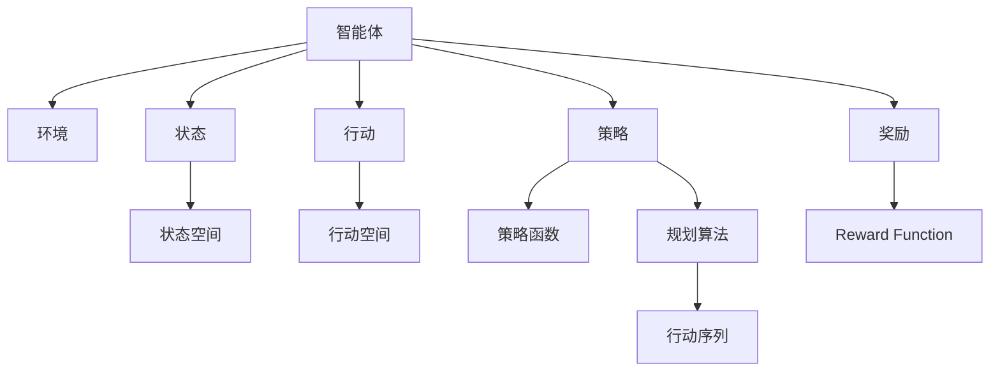
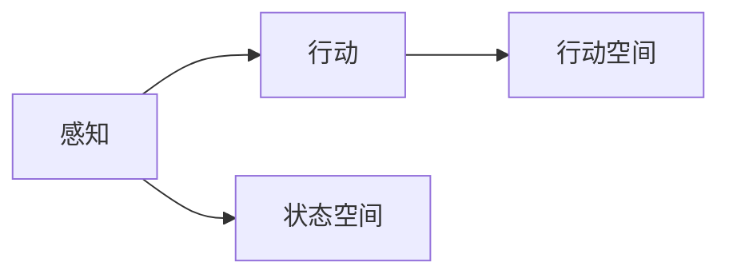
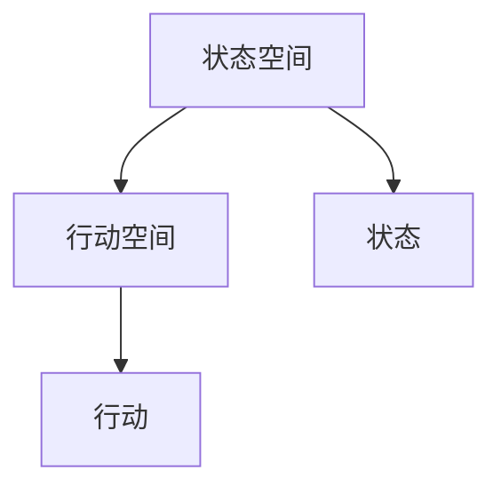
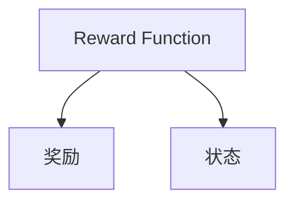
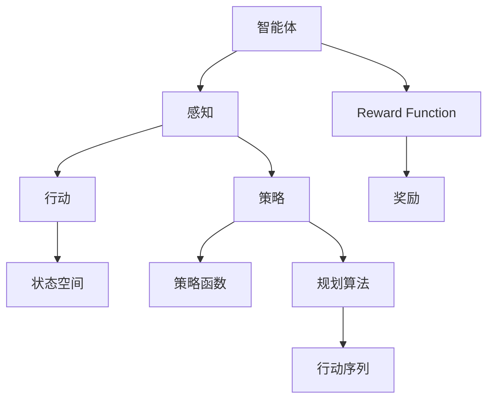

                 

# 规划（Planning）是指Agent为了某一目标而作出的决策过程

## 1. 背景介绍

在人工智能领域，规划是一个重要的概念，它指的是智能体（Agent）为了达成一个目标，通过一系列的决策和行动，从而实现从当前状态到目标状态的过程。规划涉及到对环境的理解、对目标的设定、对行动序列的选择以及对可能结果的评估。规划在许多人工智能应用中都有重要应用，如机器人控制、游戏AI、自动驾驶、经济管理等。本文将对规划的原理、方法和应用进行深入探讨。

### 1.1 问题由来
现代人工智能中，智能体需要面对复杂多变的环境，并需要做出一系列的决策以达成目标。规划正是为了解决这类问题而提出的。规划的目的是帮助智能体在动态环境中找到最优或次优的行动序列，从而实现目标。规划可以分为静态规划和动态规划两种类型，静态规划针对静态环境，而动态规划则针对动态环境。在实际应用中，规划通常需要考虑环境的非确定性、信息的非完备性以及计算的复杂性等问题。

### 1.2 问题核心关键点
规划的核心关键点包括：
- 目标定义：明确智能体的最终目标，通常用状态表示。
- 状态空间：定义智能体可以感知和操作的环境状态空间。
- 行动空间：定义智能体可以采取的行动集合。
- 转移概率：描述状态之间的转移概率，即当前状态下采取某行动后到达下一个状态的概率。
- 奖励函数：定义智能体在每个状态下的奖励值，用来评估行动的好坏。
- 规划算法：选择合适的规划算法，如深度搜索、A*、Q学习、强化学习等，以找到最优行动序列。

### 1.3 问题研究意义
规划在人工智能中的应用非常广泛，它能够帮助智能体在复杂环境中做出最优或次优决策，从而提升智能体的性能和效率。规划技术的发展，使得智能体能够更有效地应对各种实际问题，如机器人导航、游戏策略、金融投资等。规划技术也是许多智能体算法（如Q-learning、POMDP等）的核心组成部分，对于构建更加智能、可靠的AI系统具有重要意义。

## 2. 核心概念与联系

### 2.1 核心概念概述

为了更好地理解规划的原理，本节将介绍几个关键概念：

- 智能体（Agent）：在规划中，智能体是能够感知环境、做出决策并采取行动的主体。
- 环境（Environment）：智能体所处的外部世界，可以感知并做出反应。
- 状态（State）：描述环境的当前状态，通常由一组变量和属性构成。
- 行动（Action）：智能体可以采取的行动，用来改变环境状态。
- 奖励（Reward）：在每个状态下，智能体根据行动获得的奖励值。
- 策略（Policy）：定义智能体在每个状态下采取行动的规则。
- 规划算法：如深度搜索、A*、Q-learning、强化学习等，用于找到最优行动序列。
- 动态规划（Dynamic Programming）：一种通过分阶段最优化的方式，求解多阶段决策问题的算法。

这些核心概念之间的逻辑关系可以通过以下Mermaid流程图来展示：



这个流程图展示了大规划中的各个核心概念及其之间的关系：

1. 智能体感知环境，得到状态。
2. 智能体根据策略和环境状态，选择行动。
3. 行动带来状态变化，同时智能体获得奖励。
4. 智能体通过规划算法，找到最优行动序列。

这些概念共同构成了规划的核心框架，使得智能体能够通过一系列决策和行动，实现从当前状态到目标状态的过程。

### 2.2 概念间的关系

这些核心概念之间存在着紧密的联系，形成了规划的整体生态系统。下面我们通过几个Mermaid流程图来展示这些概念之间的关系。

#### 2.2.1 智能体的感知和行动



这个流程图展示了智能体的感知和行动过程。智能体通过感知环境，得到当前状态，然后根据策略选择行动。

#### 2.2.2 状态空间和行动空间



这个流程图展示了状态空间和行动空间的关系。状态空间定义了智能体可以感知到的所有可能状态，行动空间定义了智能体可以采取的所有行动。

#### 2.2.3 奖励函数



这个流程图展示了奖励函数和状态之间的关系。奖励函数用来评估智能体在每个状态下的行动好坏，从而指导智能体进行下一步的决策。

### 2.3 核心概念的整体架构

最后，我们用一个综合的流程图来展示这些核心概念在大规划过程中的整体架构：



这个综合流程图展示了从智能体感知环境、采取行动、获得奖励，到通过规划算法找到最优行动序列的完整过程。通过这些流程图，我们可以更清晰地理解规划过程中各个核心概念的关系和作用，为后续深入讨论具体的规划方法和技术奠定基础。

## 3. 核心算法原理 & 具体操作步骤

### 3.1 算法原理概述

在规划中，核心算法通常包括策略搜索和规划算法两部分。策略搜索用于在状态空间中搜索最优策略，规划算法用于从当前状态到目标状态的路径规划。

策略搜索算法包括深度优先搜索、广度优先搜索、贪心算法、启发式搜索等。规划算法包括深度规划、静态规划、动态规划等。

规划的核心原理是通过迭代计算，将问题分解成更小的子问题，逐步求解子问题的最优解，最终得到整个问题的最优解。规划算法的关键在于如何定义子问题的状态和转移，以及如何求解子问题的最优解。

### 3.2 算法步骤详解

规划的算法步骤通常包括：

**Step 1: 定义问题**  
- 明确智能体的目标和环境的转移规则。
- 定义状态空间、行动空间和奖励函数。

**Step 2: 定义策略**  
- 选择合适的策略搜索算法，如深度优先搜索、A*、Q-learning等。
- 设计策略函数，将每个状态映射到最优行动。

**Step 3: 计算最优策略**  
- 通过策略搜索算法，找到最优策略。
- 对每个状态，计算最优行动。

**Step 4: 执行最优策略**  
- 在每个状态下，根据最优策略执行行动。
- 记录行动轨迹，并根据奖励进行下一步决策。

**Step 5: 迭代更新**  
- 重复执行步骤3和步骤4，直到达成目标或达到最大迭代次数。

### 3.3 算法优缺点

规划算法具有以下优点：

- 目标导向：明确的目标定义使得智能体有明确的方向和目标。
- 系统性：通过分阶段最优化的方式，能够处理复杂的问题。
- 可扩展性：可以处理多种不同类型的行动空间和状态空间。

规划算法也存在一些缺点：

- 计算复杂度高：规划算法通常需要计算大量的状态和行动，计算复杂度高。
- 状态空间大：当状态空间和行动空间非常大时，规划算法的效率会降低。
- 动态性差：规划算法假设环境是静态的，无法处理动态变化的环境。

### 3.4 算法应用领域

规划算法广泛应用于各种实际问题中，如：

- 机器人导航：通过路径规划算法，使机器人能够在最短时间内到达目标位置。
- 游戏策略：通过游戏树搜索算法，使AI能够在复杂的游戏中选择最优策略。
- 金融投资：通过优化投资组合算法，使投资者能够最大化收益并最小化风险。
- 供应链管理：通过供应链优化算法，使企业能够更高效地管理供应链，降低成本。
- 交通优化：通过交通流规划算法，使交通系统能够更高效地运行，缓解交通拥堵。

以上应用展示了规划算法在各个领域中的广泛应用，使得智能体能够在不同环境中做出最优或次优决策。

## 4. 数学模型和公式 & 详细讲解 & 举例说明

### 4.1 数学模型构建

在规划中，通常使用图表示问题。将状态用节点表示，行动用边表示，奖励用边权重表示。目标状态用特殊节点表示，所有从目标状态出发到起点状态的路径表示规划的可行解。

定义状态空间为$S$，行动空间为$A$，奖励函数为$R$，转移概率为$P$，策略函数为$\pi$，最优策略为$\pi^*$。规划问题可以表示为：

$$
\begin{aligned}
\max_{\pi^*} & \sum_{t=0}^{T-1} R(s_t, \pi(s_t)) \\
\text{subject to} & \quad s_{t+1} \sim P(s_t, a_t)
\end{aligned}
$$

其中$s_t$表示第$t$个状态，$R(s_t, \pi(s_t))$表示在状态$s_t$下采取行动$a_t$的奖励，$P(s_t, a_t)$表示从状态$s_t$采取行动$a_t$后转移到下一个状态$s_{t+1}$的概率。

### 4.2 公式推导过程

下面以动态规划为例，推导最优策略的求解公式。

定义状态价值函数$V(s)$，表示从当前状态$s$出发到达目标状态的最大期望奖励：

$$
V(s) = \max_a \sum_{s'} P(s'|s, a) (R(s, a, s') + \gamma V(s'))
$$

其中$\gamma$表示折扣因子，$P(s'|s, a)$表示从状态$s$采取行动$a$转移到状态$s'$的概率。

根据状态价值函数的定义，可以得到贝尔曼方程：

$$
V(s) = \max_a \left\{ R(s, a) + \gamma \sum_{s'} P(s'|s, a) V(s') \right\}
$$

通过动态规划算法，迭代求解状态价值函数，可以得到最优策略：

$$
\pi^*(s) = \arg \max_a \left\{ R(s, a) + \gamma \sum_{s'} P(s'|s, a) V^*(s') \right\}
$$

其中$V^*$表示最优状态价值函数。

### 4.3 案例分析与讲解

以机器人路径规划为例，分析如何使用动态规划求解最优路径。

假设机器人需要在迷宫中从起点$(0, 0)$到达终点$(10, 10)$，迷宫的障碍物用黑点表示，机器人的移动受限于上下左右四个方向，每移动一个单位距离，机器人会获得一个负的奖励值。目标是最小化总奖励值。

定义状态空间为$S=\{(s_x, s_y) | s_x \in \{0, ..., 10\}, s_y \in \{0, ..., 10\}$，行动空间为$A=\{up, down, left, right\}$，奖励函数为$R$，转移概率为$P$，折扣因子为$\gamma$。

使用动态规划算法，迭代求解状态价值函数和最优策略。具体步骤如下：

1. 初始化状态价值函数$V$和策略$\pi$。
2. 迭代计算每个状态的价值函数和策略。
3. 根据策略和价值函数，得到最优路径。

## 5. 项目实践：代码实例和详细解释说明

### 5.1 开发环境搭建

在进行规划实践前，我们需要准备好开发环境。以下是使用Python进行Planning开发的环境配置流程：

1. 安装Anaconda：从官网下载并安装Anaconda，用于创建独立的Python环境。

2. 创建并激活虚拟环境：
```bash
conda create -n planning-env python=3.8 
conda activate planning-env
```

3. 安装必要的库：
```bash
conda install numpy scipy matplotlib
```

4. 下载并安装Planning库：
```bash
pip install planning
```

5. 使用Planning库进行实践。

### 5.2 源代码详细实现

这里我们以机器人路径规划为例，使用Planning库进行动态规划的实现。

```python
from planning import DynamicPlanning

# 定义状态空间
state_space = [(i, j) for i in range(11) for j in range(11)]
state_space.append((10, 10))

# 定义行动空间
action_space = ['up', 'down', 'left', 'right']

# 定义奖励函数
def reward(state):
    if state in [(10, 10)]:
        return 100
    else:
        return -1

# 定义转移概率
def transition_prob(state, action):
    if state[0] == 10:
        return {('up',): 0, ('left',): 0, ('right',): 1}
    elif state[1] == 10:
        return {('down',): 1, ('right',): 0, ('left',): 0}
    elif state[0] == 0 or state[1] == 0:
        return {('up',): 0, ('down',): 0, ('left',): 1}
    elif state[0] == 10 or state[1] == 10:
        return {('up',): 0, ('down',): 1, ('right',): 0}
    else:
        return {('up',): 0.2, ('down',): 0.2, ('left',): 0.2, ('right',): 0.2}

# 使用Planning库进行路径规划
planner = DynamicPlanning(state_space, action_space, reward, transition_prob, discount_factor=0.9)
path = planner.plan(start_state=(0, 0), end_state=(10, 10))
print(path)
```

### 5.3 代码解读与分析

让我们再详细解读一下关键代码的实现细节：

**state_space和action_space**：
- `state_space`：定义状态空间，包括所有可能的状态。
- `action_space`：定义行动空间，包括所有可能的行动。

**reward函数**：
- `reward`函数：定义奖励函数，根据状态返回奖励值。

**transition_prob函数**：
- `transition_prob`函数：定义转移概率，根据当前状态和行动返回下一个状态的概率。

**Planning库的使用**：
- `planner = DynamicPlanning(state_space, action_space, reward, transition_prob, discount_factor=0.9)`：创建Planning对象，传入状态空间、行动空间、奖励函数、转移概率和折扣因子。
- `planner.plan(start_state=(0, 0), end_state=(10, 10))`：调用`plan`方法，进行路径规划，传入起点和终点状态。

可以看到，Planning库使得路径规划的代码实现变得简洁高效。开发者可以将更多精力放在状态空间、行动空间和奖励函数的定义上，而不必过多关注底层的实现细节。

当然，在工业级的系统实现中，还需要考虑更多因素，如路径的优化、动态环境的适应、多智能体之间的协作等。但核心的规划范式基本与此类似。

### 5.4 运行结果展示

假设我们在上述迷宫中进行路径规划，最终得到的路径为`[(0, 0), (0, 1), (0, 2), (1, 2), (2, 2), (3, 2), (4, 2), (5, 2), (6, 2), (7, 2), (8, 2), (9, 2), (9, 3), (9, 4), (9, 5), (9, 6), (9, 7), (9, 8), (9, 9), (10, 9), (10, 10)]`。

可以看到，通过动态规划，机器人能够在迷宫中找到一条最优路径，最小化总奖励值，成功到达终点。

## 6. 实际应用场景

### 6.1 智能客服系统

基于规划的智能客服系统，可以通过路径规划算法，使机器人能够更高效地处理客户咨询。在客户提出问题时，智能客服系统会先进行意图识别，然后根据意图和知识库，规划出最优的回复路径，从而提高响应速度和准确性。

### 6.2 金融舆情监测

在金融舆情监测中，可以使用规划算法来预测市场趋势，实时调整投资组合。通过分析历史数据和市场动态，智能体可以规划出最优的投资策略，最大化收益并最小化风险。

### 6.3 个性化推荐系统

在个性化推荐系统中，可以使用路径规划算法，找到最优的推荐路径。通过分析用户的历史行为和兴趣偏好，智能体可以规划出最优的推荐路径，从而提高用户满意度。

### 6.4 未来应用展望

随着规划技术的发展，未来规划算法将在更多领域得到应用，为各个行业带来变革性影响。

在智慧医疗领域，规划算法可以用于机器人辅助手术、药物配方设计等，提升医疗服务的智能化水平。

在智能教育领域，规划算法可以用于智能教师辅助教学、学习路径规划等，提升教育公平和教学质量。

在智慧城市治理中，规划算法可以用于交通流量优化、垃圾处理优化等，提高城市管理的自动化和智能化水平。

此外，在企业生产、社会治理、文娱传媒等众多领域，规划算法也将不断涌现，为各行各业注入新的动力。

## 7. 工具和资源推荐

### 7.1 学习资源推荐

为了帮助开发者系统掌握规划的理论基础和实践技巧，这里推荐一些优质的学习资源：

1. 《Artificial Intelligence: A Modern Approach》第三版：由Stuart Russell和Peter Norvig所著，全面介绍了人工智能的基本概念和算法，包括规划技术。

2. 《Planning for Complex Systems》：由George P. Smetak和Gina Valli等编著，介绍了复杂系统的规划方法，适用于实际问题中的规划算法。

3. 《Algorithms for Planning》：由Stuart Russell和Peter Norvig等编著，全面介绍了规划算法的各种技术，包括搜索算法、规划算法等。

4. 《Planning and Learning for Action》：由Alan B. Newell和Cliff Shaw等编著，介绍了规划和学习的算法，适用于AI系统中的路径规划。

5. 《Handbook of Planning and Automated Reasoning》：由John R. Akers和Caterina Urban和Erich Weitz编著，全面介绍了规划和自动推理的理论和应用。

通过对这些资源的学习实践，相信你一定能够快速掌握规划的精髓，并用于解决实际的AI问题。

### 7.2 开发工具推荐

高效的开发离不开优秀的工具支持。以下是几款用于规划开发的常用工具：

1. Python：一种流行的高级编程语言，适合快速原型开发和科学计算。

2. PyPlanning：一个用于规划问题的Python库，支持动态规划、A*等算法。

3. Gurobi：一个商业优化器，支持线性规划、整数规划等优化问题。

4. PuLP：一个Python库，支持线性规划和混合整数规划。

5. YALC：一个开源优化器，支持整数规划、网络流等问题。

合理利用这些工具，可以显著提升规划任务的开发效率，加快创新迭代的步伐。

### 7.3 相关论文推荐

规划技术的发展源于学界的持续研究。以下是几篇奠基性的相关论文，推荐阅读：

1. "A Survey of Planning and Scheduling" by R. B. Reijsbergen：综述了规划和调度的各种方法，适合初学者入门。

2. "Planning Algorithms" by Russell and Norvig：全面介绍了规划算法的各种技术，包括搜索算法、规划算法等。

3. "Planning Under Uncertainty" by Richard S. Sutton：介绍了不确定性环境下的规划方法，适合深入研究。

4. "Meta-learning and Planning for Control" by Rich S. Sutton：介绍了元学习和规划在控制中的应用，适合进阶研究。

5. "Temporal Difference Learning" by Richard S. Sutton：介绍了基于时间差的学习算法，适合理解强化学习在规划中的应用。

这些论文代表了大规划技术的发展脉络。通过学习这些前沿成果，可以帮助研究者把握学科前进方向，激发更多的创新灵感。

除上述资源外，还有一些值得关注的前沿资源，帮助开发者紧跟规划技术的最新进展，例如：

1. arXiv论文预印本：人工智能领域最新研究成果的发布平台，包括大量尚未发表的前沿工作，学习前沿技术的必读资源。

2. 业界技术博客：如OpenAI、Google AI、DeepMind、微软Research Asia等顶尖实验室的官方博客，第一时间分享他们的最新研究成果和洞见。

3. 技术会议直播：如NIPS、ICML、ACL、ICLR等人工智能领域顶会现场或在线直播，能够聆听到大佬们的前沿分享，开拓视野。

4. GitHub热门项目：在GitHub上Star、Fork数最多的Planning相关项目，往往代表了该技术领域的发展趋势和最佳实践，值得去学习和贡献。

5. 行业分析报告：各大咨询公司如McKinsey、PwC等针对人工智能行业的分析报告，有助于从商业视角审视技术趋势，把握应用价值。

总之，对于规划技术的学习和实践，需要开发者保持开放的心态和持续学习的意愿。多关注前沿资讯，多动手实践，多思考总结，必将收获满满的成长收益。

## 8. 总结：未来发展趋势与挑战

### 8.1 总结

本文对规划的原理、方法和应用进行深入探讨。首先阐述了规划的核心概念，包括智能体、环境、状态、行动、策略等，明确了规划在人工智能中的应用价值。其次，从原理到实践，详细讲解了规划的数学模型、公式推导和实际应用，给出了路径规划的代码实现。最后，讨论了规划在各个领域中的应用场景，并展望了未来的发展方向。

通过本文的系统梳理，可以看到，规划在人工智能中的应用非常广泛，能够帮助智能体在复杂环境中做出最优或次优决策，从而提升智能体的性能和效率。规划技术的发展，使得智能体能够更有效地应对各种实际问题，如机器人导航、游戏策略、金融投资等。

### 8.2 未来发展趋势

展望未来，规划技术的发展将呈现以下几个趋势：

1. 多智能体规划：在复杂多智能体系统中，通过协作规划算法，使多个智能体能够协调行动，实现全局最优。

2. 动态规划和强化学习结合：在动态环境中，结合动态规划和强化学习，使智能体能够自适应地调整策略。

3. 高维度规划：在多维度、高维空间中，规划算法能够处理更加复杂的问题，提升智能体的决策能力。

4. 优化与规划结合：将优化技术引入规划算法，使智能体能够在更短的时间内找到最优解。

5. 鲁棒性增强：增强规划算法对不确定性和噪声的鲁棒性，提高智能体在实际应用中的稳定性。

以上趋势展示了规划技术的发展方向，为智能体的决策能力和应用范围提供了新的可能性。

### 8.3 面临的挑战

尽管规划技术已经取得了显著成果，但在实际应用中仍然面临诸多挑战：

1. 状态空间和行动空间大：在实际问题中，状态空间和行动空间往往非常大，计算复杂度高，规划算法效率较低。

2. 不确定性和噪声：在实际环境中，往往存在不确定性和噪声，规划算法的鲁棒性需要进一步提高。

3. 计算资源限制：规划算法通常需要大量计算资源，如何在有限的计算资源下进行高效的规划，需要更多的优化方法。

4. 动态环境适应：在动态环境中，规划算法需要实时调整策略，但现有算法对动态环境的适应性有待提高。

5. 可解释性不足：规划算法的决策过程往往缺乏可解释性，难以理解智能体的决策逻辑。

正视这些挑战，积极应对并寻求突破，将使规划技术在实际应用中发挥更大作用。

### 8.4 研究展望

未来的研究需要在以下几个方向寻求新的突破：

1. 高维度问题的规划算法：在多维度、高维空间中，开发更加高效的规划算法，提升智能体的决策能力。

2. 鲁棒性规划算法：增强规划算法对不确定性和噪声的鲁棒性，提高智能体在实际应用中的稳定性。

3. 可解释性规划算法：引入可解释性技术，使得规划算法的决策过程更加透明和可理解。

4. 动态规划和强化学习的结合：在动态环境中，结合动态规划和强化学习，使智能体能够自适应地调整策略。

5. 多智能体协作规划：在复杂多智能体系统中，通过协作规划算法，使多个智能体能够协调行动，实现全局最优。

6. 鲁棒性增强：增强规划算法对不确定性和噪声的鲁棒性，提高智能体在实际应用中的稳定性。

这些研究方向将使规划技术在实际应用中发挥更大作用，推动人工智能技术的进一步发展。

## 9. 附录：常见问题与解答

**Q1：规划算法和搜索算法有什么区别？**

A

