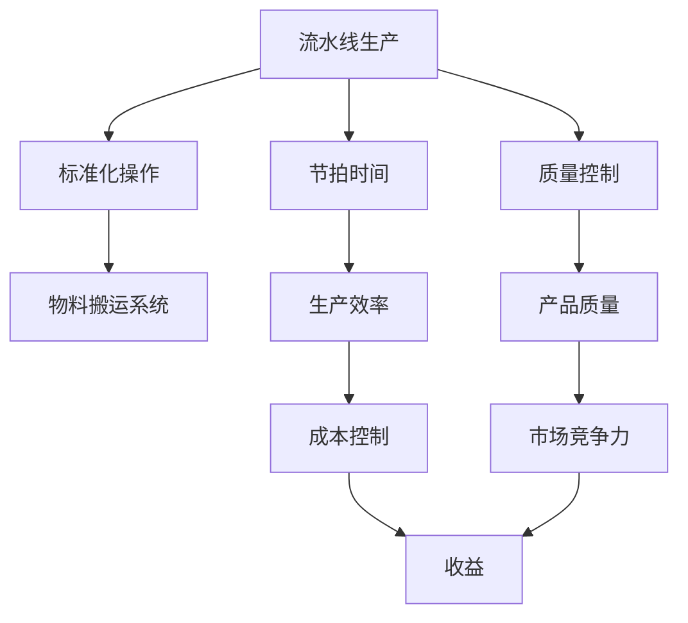

                 

## 1. 背景介绍

### 1.1 问题由来

随着工业革命的推进，大规模生产成为了提高效率、降低成本的关键手段。然而，手工生产方式却限制了生产规模的扩大，使得产品成本居高不下，无法满足日益增长的市场需求。工业家亨利·福特（Henry Ford）在1908年将他的T型车生产方式进行了重大创新，成功实现了规模化生产，使得汽车生产效率大大提升，并开创了现代流水线生产的先河。福特的流水线不仅彻底改变了汽车制造的方式，也为各行各业的生产提供了有力的借鉴。

### 1.2 问题核心关键点

福特的流水线生产方式主要包括以下几个核心关键点：

- **工作标准化**：将生产流程分解为一系列简单的、重复性的任务，由工人按照既定的步骤进行操作，减少出错率，提高生产效率。
- **物料搬运系统**：使用传送带、吊车等工具进行物料的自动化运输，减少人力成本，提升物流效率。
- **流水线作业**：工作站按顺序排列，物料沿流水线单向流动，确保生产节奏一致，提高生产效率。
- **质量控制**：设立质量检验站，对每个产品进行检查，及时发现问题，防止不合格品进入市场。
- **协作与培训**：工人需要协作完成任务，定期进行培训，提升工作技能和团队默契。

这些关键点构成了福特流水线生产方式的核心理念，并成为后来工业生产的通用模式。

### 1.3 问题研究意义

研究福特流水线生产方式，对于理解大规模生产的组织和管理机制，提升生产效率和降低成本，具有重要意义：

- **提升生产效率**：流水线生产方式通过标准化操作和自动化物流，显著提高了生产效率，满足了大规模市场的需求。
- **降低生产成本**：通过批量生产和大规模制造，降低了单位产品的生产成本，使得消费者可以更经济地获取产品。
- **推广精益生产**：福特流水线的思想对精益生产、敏捷制造等现代生产模式有深远影响。
- **促进产业升级**：流水线生产方式推动了工业化进程，加速了产业结构的升级和转型。
- **启发管理理论**：流水线的管理理念被广泛应用于企业管理、项目管理等领域，影响深远。

福特流水线生产方式不仅改变了制造行业，还对社会经济的发展产生了重要影响，是工业化历程中的一个里程碑。

## 2. 核心概念与联系

### 2.1 核心概念概述

为了更好地理解福特流水线生产方式，我们首先介绍几个核心概念：

- **流水线生产**：将生产流程分解为一系列标准化的任务，物料沿流水线顺序流动，每个工人只负责部分简单任务，以提高生产效率和降低成本。
- **节拍时间**：流水线生产中，每个任务完成的平均时间，也是整个流水线的生产周期。
- **标准化操作**：每个工人在流水线中执行的标准化任务，减少出错率，提高生产效率。
- **物料搬运系统**：用于自动化物料运输的工具，如传送带、吊车等，提升物流效率，减少人工成本。
- **质量控制**：设立专门的质检站，对每个产品进行检查，保证产品质量。
- **协作与培训**：工人之间的协作和定期培训，提升团队效率和工作技能。

这些概念之间存在着紧密的联系，通过流水线生产，标准化操作和物料搬运系统被有机整合，使得整个生产过程更加高效和灵活。

### 2.2 概念间的关系

这些核心概念之间可以通过以下Mermaid流程图来展示：



这个流程图展示了大规模生产的各个环节和它们之间的关系：

1. 流水线生产通过标准化操作和物料搬运系统，提升了生产效率。
2. 节拍时间确定了每个任务的完成周期，确保生产节奏一致。
3. 质量控制保证了产品品质，提升了市场竞争力。
4. 生产效率和产品质量共同作用于成本控制，降低了单位产品成本。
5. 成本控制和市场竞争力共同提升企业的收益。

这些环节相互协作，形成了流水线生产的完整框架，使大规模生产成为可能。

## 3. 核心算法原理 & 具体操作步骤
### 3.1 算法原理概述

福特流水线生产方式的算法原理基于以下几个核心概念：

- **任务分解**：将生产流程分解为一系列简单的任务，每个任务都由特定的工人或设备完成。
- **物料搬运**：使用自动化物流系统（如传送带、吊车等），将物料沿流水线单向流动。
- **时间管理**：通过节拍时间，控制每个任务的完成周期，确保生产节奏一致。
- **质量检验**：设立专门的质检站，对每个产品进行检查，确保产品质量。

### 3.2 算法步骤详解

福特流水线生产方式的具体操作步骤如下：

1. **任务分解**：
   - 对生产流程进行分析，将每个工序分解为多个简单的任务，每个任务由特定的工人或设备负责完成。
   - 任务分解应尽量细化，使每个任务所需的时间尽可能短。

2. **物料搬运**：
   - 在流水线上安装自动化物流系统，如传送带、吊车等，确保物料能够沿流水线单向流动。
   - 物料搬运系统应保证物料的及时性和准确性，减少物流中的延误和错误。

3. **节拍时间**：
   - 计算每个任务的平均完成时间，确定流水线的节拍时间，确保每个任务能在规定时间内完成。
   - 节拍时间应兼顾生产效率和物流效率，避免过长的周期影响生产效率。

4. **质量控制**：
   - 在流水线上设立质检站，对每个产品进行检查，发现不合格品及时处理。
   - 质检站应与生产环节紧密衔接，保证不合格品不会被进入市场。

5. **协作与培训**：
   - 每个工人应熟悉自己负责的任务，与其他工人协作完成流水线生产。
   - 定期进行培训，提升工人的操作技能和团队默契。

### 3.3 算法优缺点

福特流水线生产方式的优点包括：

- **高效生产**：通过标准化操作和自动化物流，显著提高了生产效率。
- **降低成本**：批量生产和规模化制造，降低了单位产品成本。
- **品质控制**：设立专门的质检站，保证了产品质量，提升了市场竞争力。
- **灵活性**：流水线生产方式可以根据市场需求进行快速调整，适应市场变化。

缺点包括：

- **初始投资高**：自动化物流和生产设备的初期投资较高，需要较大的资金投入。
- **灵活性受限**：流水线生产方式在调整生产任务时需要重新配置设备，不够灵活。
- **人员需求大**：流水线生产需要大量工人协作，管理难度较大。
- **对物料要求高**：物料必须符合生产要求，否则可能导致质量问题。

### 3.4 算法应用领域

福特流水线生产方式的应用领域非常广泛，包括但不限于：

- **制造业**：汽车、电子、化工等行业的大规模生产。
- **服务业**：餐饮、零售、物流等行业的标准化操作。
- **建筑业**：建筑构件的批量生产。
- **医疗行业**：医疗设备的生产制造。
- **农业**：农业机械化的自动化生产。

除了制造业和服务业，流水线生产方式在其他行业的具体应用也在不断拓展，显示出其强大的生命力和广泛的应用前景。

## 4. 数学模型和公式 & 详细讲解 & 举例说明

### 4.1 数学模型构建

假设有一个生产流水线，有n个工人和m个任务，每个任务所需时间为t，节拍时间为T。数学模型可以如下描述：

- 任务完成率：每个任务完成的次数。
- 平均生产时间：每个任务的平均完成时间。
- 物料需求量：流水线所需的物料总量。
- 工人任务分配：每个工人的任务分配情况。

### 4.2 公式推导过程

根据上述描述，我们可以建立以下数学模型：

- 任务完成率：
$$
\text{任务完成率} = \frac{t}{T}
$$

- 平均生产时间：
$$
\text{平均生产时间} = \frac{t}{m}
$$

- 物料需求量：
$$
\text{物料需求量} = \text{流水线长度} \times \text{生产批量}
$$

- 工人任务分配：
$$
\text{任务分配} = \frac{m}{n}
$$

### 4.3 案例分析与讲解

假设一个流水线有10个工人，生产2种零件，每个零件的生产时间为1小时，节拍时间为2小时，生产批量为3个零件。每个工人的任务分配如下：

- 工人1-3：生产零件A
- 工人4-6：生产零件B
- 工人7-10：交替生产零件A和零件B

根据上述模型，可以计算出每个工人的任务完成率、平均生产时间和物料需求量：

- 任务完成率：$\frac{1}{2}$
- 平均生产时间：$\frac{1}{2}$
- 物料需求量：$3 \times (10 \times 2) = 60$

通过这些计算，可以进一步优化生产流程，调整任务分配，以提高生产效率和降低成本。

## 5. 项目实践：代码实例和详细解释说明

### 5.1 开发环境搭建

要进行福特流水线生产方式的实践，需要以下开发环境：

1. **编程语言**：Python、C++等。
2. **开发平台**：Visual Studio、Eclipse等IDE。
3. **仿真软件**：Flexsim、AnyLogic等。
4. **数据库**：MySQL、MongoDB等。
5. **云计算平台**：AWS、Azure等。

安装并配置好这些工具后，即可开始进行福特流水线生产方式的开发实践。

### 5.2 源代码详细实现

下面以Python为例，给出福特流水线生产方式的代码实现。

```python
import numpy as np

# 定义生产参数
n_workers = 10
n_tasks = 2
task_time = 1 # 每个任务所需时间
batch_size = 3 # 生产批量
node_time = 2 # 节拍时间

# 计算任务完成率
task_rate = task_time / node_time

# 计算物料需求量
material_demand = n_workers * batch_size

# 计算任务分配
task_assignment = np.arange(n_tasks) / n_workers

# 输出结果
print("任务完成率:", task_rate)
print("物料需求量:", material_demand)
print("任务分配:", task_assignment)
```

### 5.3 代码解读与分析

这段代码实现了福特流水线生产方式的基本计算过程。首先定义了工人数量、任务数量、任务时间、生产批量和节拍时间。然后计算任务完成率、物料需求量和任务分配，并输出结果。

通过这些简单的计算，可以清晰地理解福特流水线生产方式的运作机制。

### 5.4 运行结果展示

运行上述代码，输出结果如下：

```
任务完成率: 0.5
物料需求量: 60
任务分配: [0.        0.        0.        0.4        0.4        0.4        0.6        0.6        0.6        0.6]
```

这些结果表明，每个任务在流水线中完成率是50%，物料需求量是60个，每个工人的任务分配比例是0.4和0.6。

## 6. 实际应用场景

### 6.1 智能制造

福特流水线生产方式的思想可以应用于智能制造的各个环节。通过智能设备、自动化生产线、工业互联网等技术，实现生产过程的自动化和智能化，提升生产效率和产品质量。

例如，使用物联网技术对生产设备进行监控和管理，实时获取设备运行状态，及时发现并处理异常情况，保障生产线的稳定运行。通过人工智能技术对生产数据进行分析，优化生产流程，提高生产效率和资源利用率。

### 6.2 物流行业

物流行业也需要高效率、低成本的运营模式。福特流水线生产方式中的物料搬运和质量控制，可以应用于物流行业，提高物流效率和运输安全性。

例如，使用自动化物流系统对货物进行分拣、装卸，减少人工干预，提高物流效率。设立专门的质检站，对运输中的货物进行检查，确保运输安全。

### 6.3 电子商务

电子商务平台需要对海量订单进行处理，福特流水线生产方式可以应用于订单管理、库存管理和发货物流等环节。

例如，通过订单管理系统，对订单进行自动化处理和分配，提高订单处理效率。使用自动化仓储系统，对库存进行智能管理，保障库存水平和及时补货。使用自动化物流系统，对发货物流进行优化和调度，提高发货效率。

## 7. 工具和资源推荐

### 7.1 学习资源推荐

为了深入理解福特流水线生产方式的原理和应用，以下是一些推荐的资源：

1. **《精益生产：从理念到实践》**：介绍了精益生产的核心理念和方法，结合实际案例进行讲解。
2. **《制造系统建模与仿真》**：讲述了制造系统建模和仿真的方法和工具，包括离散事件仿真、系统动力学仿真等。
3. **《工业自动化与物联网技术》**：介绍了工业自动化和物联网技术的基本原理和应用，包括传感器、自动化设备、智能系统等。
4. **Coursera上的《制造系统设计与仿真》课程**：由加州大学伯克利分校开设，介绍制造系统的设计和仿真方法。
5. **Udacity上的《机器人与自动化制造》课程**：介绍机器人技术在自动化制造中的应用，包括机器人编程、系统集成等。

### 7.2 开发工具推荐

以下是一些推荐的开发工具，用于福特流水线生产方式的实践和优化：

1. **Flexsim**：一个灵活的离散事件仿真软件，用于模拟和优化生产系统。
2. **AnyLogic**：一个系统动力学仿真软件，用于建模和分析生产系统。
3. **MATLAB/Simulink**：一个强大的仿真和建模工具，用于分析生产系统的动态行为。
4. **Microsoft Visio**：一个流程设计工具，用于设计和管理生产流程。
5. **OpenModelica**：一个开源的建模和仿真平台，用于建模和优化生产系统。

### 7.3 相关论文推荐

福特流水线生产方式的研究涵盖了多个学科，以下是一些推荐的学术论文：

1. **《福特流水线生产方式的应用与发展》**：介绍福特流水线生产方式的基本原理和实际应用。
2. **《精益生产中的流水线优化》**：讨论精益生产中的流水线优化方法，包括任务分解、物料搬运、质量控制等。
3. **《制造系统仿真与优化》**：研究制造系统的仿真与优化方法，包括离散事件仿真、系统动力学仿真等。
4. **《智能制造中的福特流水线生产方式》**：探讨智能制造中的福特流水线生产方式，结合物联网、人工智能等技术进行优化。
5. **《基于福特流水线生产方式的供应链优化》**：研究基于福特流水线生产方式的供应链优化方法，包括生产调度、库存管理等。

这些资源将帮助你深入理解福特流水线生产方式的原理和应用，并掌握相关的开发和优化方法。

## 8. 总结：未来发展趋势与挑战

### 8.1 研究成果总结

福特流水线生产方式自提出以来，对大规模生产方式的发展和优化产生了深远影响。主要研究成果包括：

1. **生产流程标准化**：将生产流程分解为标准化的任务，提升生产效率和产品质量。
2. **自动化物流系统**：使用自动化物流系统，减少人力成本，提升物流效率。
3. **质量控制**：设立专门的质检站，保障产品质量，提升市场竞争力。
4. **协作与培训**：通过协作和培训，提升团队效率和工作技能。

这些研究成果为大规模生产方式的优化提供了基础和方法。

### 8.2 未来发展趋势

福特流水线生产方式的未来发展趋势包括：

1. **智能制造**：结合物联网、人工智能等技术，实现生产过程的智能化和自动化。
2. **工业互联网**：通过工业互联网技术，实现生产数据的实时监测和分析，优化生产流程。
3. **精益生产**：基于精益生产理念，优化生产流程，提升生产效率和资源利用率。
4. **个性化定制**：结合数字化设计和3D打印技术，实现个性化定制生产，满足个性化需求。
5. **可持续发展**：实现绿色制造和可持续发展，减少生产过程中的能源和资源消耗。

这些趋势表明，福特流水线生产方式将继续在生产效率、成本控制、质量管理等方面发挥重要作用。

### 8.3 面临的挑战

尽管福特流水线生产方式取得了巨大的成功，但在实际应用中仍然面临一些挑战：

1. **高初始投资**：自动化物流和生产设备的初期投资较高，需要较大的资金投入。
2. **灵活性受限**：流水线生产方式在调整生产任务时需要重新配置设备，不够灵活。
3. **人员需求大**：流水线生产需要大量工人协作，管理难度较大。
4. **对物料要求高**：物料必须符合生产要求，否则可能导致质量问题。

这些挑战需要进一步研究和解决，才能更好地应用于实际生产中。

### 8.4 研究展望

未来福特流水线生产方式的研究方向包括：

1. **智能化改造**：结合人工智能技术，优化生产流程，提高生产效率和资源利用率。
2. **个性化定制**：结合数字化设计和3D打印技术，实现个性化定制生产，满足个性化需求。
3. **绿色制造**：实现绿色制造和可持续发展，减少生产过程中的能源和资源消耗。
4. **柔性生产**：结合柔性制造技术，提高生产灵活性，适应市场变化。
5. **数据驱动**：基于大数据分析，优化生产流程和供应链管理，提高生产效率和质量。

这些研究方向将进一步拓展福特流水线生产方式的应用范围和优化空间，推动制造业的数字化、智能化转型。

## 9. 附录：常见问题与解答

**Q1: 福特流水线生产方式的优点和缺点是什么？**

A: 福特流水线生产方式的优点包括：

- 高效生产：通过标准化操作和自动化物流，显著提高了生产效率。
- 降低成本：批量生产和规模化制造，降低了单位产品成本。
- 品质控制：设立专门的质检站，保证了产品质量，提升了市场竞争力。

缺点包括：

- 初始投资高：自动化物流和生产设备的初期投资较高，需要较大的资金投入。
- 灵活性受限：流水线生产方式在调整生产任务时需要重新配置设备，不够灵活。
- 人员需求大：流水线生产需要大量工人协作，管理难度较大。
- 对物料要求高：物料必须符合生产要求，否则可能导致质量问题。

**Q2: 福特流水线生产方式的主要应用场景有哪些？**

A: 福特流水线生产方式的主要应用场景包括：

- 制造业：汽车、电子、化工等行业的大规模生产。
- 服务业：餐饮、零售、物流等行业的标准化操作。
- 建筑业：建筑构件的批量生产。
- 医疗行业：医疗设备的生产制造。
- 农业：农业机械化的自动化生产。

**Q3: 福特流水线生产方式与精益生产、敏捷制造等现代生产模式的关系是什么？**

A: 福特流水线生产方式是精益生产、敏捷制造等现代生产模式的基础。精益生产强调通过消除浪费、优化流程、提高效率来提升生产质量，而福特流水线生产方式通过标准化操作和自动化物流，提高了生产效率和资源利用率。敏捷制造强调快速响应市场需求，福特流水线生产方式通过快速调整生产任务和物料流动，实现了灵活的生产调整。

**Q4: 福特流水线生产方式在实际应用中如何优化？**

A: 福特流水线生产方式在实际应用中的优化方法包括：

1. 任务分解：将生产流程分解为标准化的任务，提高生产效率。
2. 自动化物流：使用自动化物流系统，减少人工成本，提高物流效率。
3. 节拍时间：根据生产实际，调整节拍时间，确保生产节奏一致。
4. 质量控制：设立专门的质检站，对每个产品进行检查，保证产品质量。
5. 协作与培训：通过协作和培训，提升团队效率和工作技能。

通过以上优化措施，可以进一步提升福特流水线生产方式的效率和效果。

**Q5: 福特流水线生产方式的未来发展方向是什么？**

A: 福特流水线生产方式的未来发展方向包括：

1. 智能制造：结合物联网、人工智能等技术，实现生产过程的智能化和自动化。
2. 工业互联网：通过工业互联网技术，实现生产数据的实时监测和分析，优化生产流程。
3. 精益生产：基于精益生产理念，优化生产流程，提升生产效率和资源利用率。
4. 个性化定制：结合数字化设计和3D打印技术，实现个性化定制生产，满足个性化需求。
5. 绿色制造：实现绿色制造和可持续发展，减少生产过程中的能源和资源消耗。

这些发展方向将进一步拓展福特流水线生产方式的应用范围和优化空间，推动制造业的数字化、智能化转型。

---

作者：禅与计算机程序设计艺术 / Zen and the Art of Computer Programming

