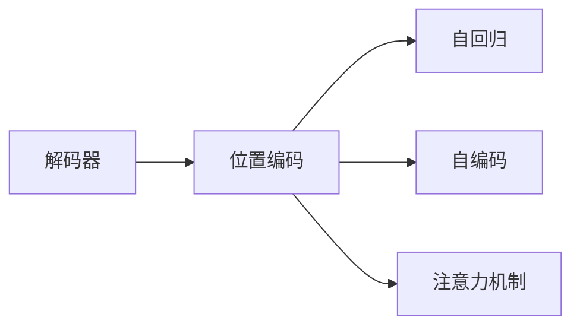
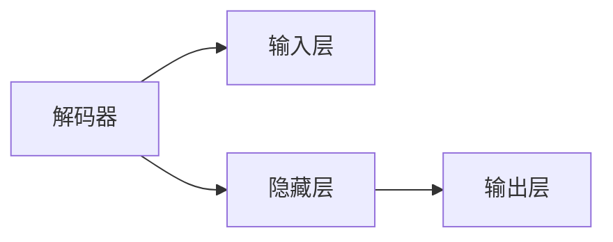
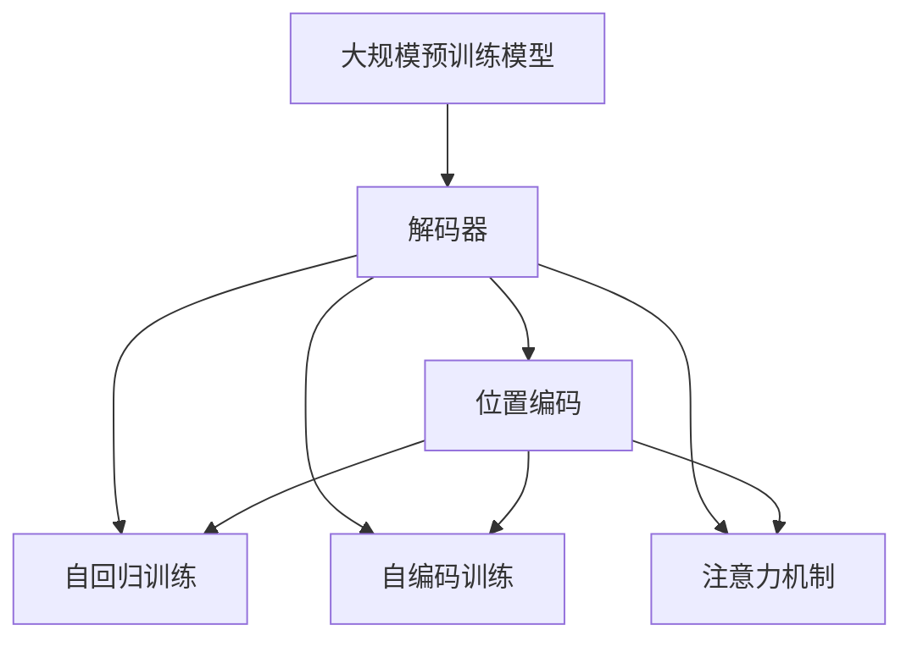

                 

## 1. 背景介绍

在自然语言处理（NLP）领域，解码器（Decoder）是一类关键的模型组件，用于将输入序列转换为输出序列，广泛应用于机器翻译、语音识别、文本生成等任务中。解码器的输入包括源序列和目标序列的编码表示，其中源序列通常通过编码器（Encoder）生成，目标序列则直接用于解码器。然而，目标序列本身也需要某种形式的编码表示，以便在解码过程中进行处理和推理。

位置编码（Positional Encoding）是解码器中的一种常见技术，用于在解码器的输入中嵌入时间信息，以便模型能够区分输入序列中的不同位置。这一技术在大规模预训练模型中得到了广泛应用，如BERT、GPT等，是实现自然语言处理任务的重要基础。

本文将详细介绍解码器的输入和位置编码的原理，包括解码器的架构、输入机制和位置编码的计算方式，并结合实际应用场景进行分析和解释。

## 2. 核心概念与联系

### 2.1 核心概念概述

为了更好地理解解码器的输入和位置编码，本节将介绍几个核心概念：

- 解码器（Decoder）：自然语言处理中，解码器用于将输入序列转换为输出序列。常见的解码器包括RNN、LSTM、GRU、Transformer等。
- 位置编码（Positional Encoding）：用于在解码器的输入中嵌入时间信息，以便模型能够区分输入序列中的不同位置。位置编码通常使用正弦和余弦函数等方法进行计算。
- 自回归（Autoregressive）：解码器的一种常见训练方式，通过条件概率模型逐步生成目标序列的各个元素。例如，在机器翻译任务中，解码器根据上一个元素的预测结果，生成下一个元素。
- 自编码（Autoencoder）：解码器的一种训练方式，通过重构输入序列来学习编码器的输出表示。常见的自编码解码器包括VAE、GAN等。
- 注意力机制（Attention Mechanism）：解码器中的一种重要机制，用于动态计算输入序列和目标序列之间的权重，以便更精确地定位和利用信息。

这些核心概念之间的逻辑关系可以通过以下Mermaid流程图来展示：



这个流程图展示了解码器的核心概念及其之间的关系：

1. 解码器是自然语言处理中的关键组件，包括自回归、自编码、注意力机制等多种形式。
2. 位置编码用于在解码器的输入中嵌入时间信息，是解码器中的一种常见技术。
3. 自回归和自编码是解码器训练的两种方式，通过条件概率模型和重构输入序列来学习模型。
4. 注意力机制用于动态计算输入序列和目标序列之间的权重，以便更精确地定位和利用信息。

### 2.2 概念间的关系

这些核心概念之间存在着紧密的联系，形成了解码器的重要生态系统。下面我通过几个Mermaid流程图来展示这些概念之间的关系。

#### 2.2.1 解码器的架构



这个流程图展示了解码器的基本架构，包括输入层、隐藏层和输出层。输入层通常使用嵌入层将输入序列转换为向量表示，隐藏层包括多个编码器层，用于提取和处理输入序列的信息，输出层将隐藏层的表示映射为输出序列的各个元素。

#### 2.2.2 解码器的输入机制


这个流程图展示了解码器的输入机制，包括嵌入层、隐藏层和输出层。嵌入层将输入序列转换为向量表示，隐藏层和输出层用于提取和映射输入序列的特征。

#### 2.2.3 位置编码的计算方式


这个流程图展示了位置编码的计算方式，包括sin函数、cos函数和解码器输入。sin函数和cos函数用于计算位置编码，解码器输入将位置编码和嵌入向量相加，得到最终输入。

### 2.3 核心概念的整体架构

最后，我们用一个综合的流程图来展示这些核心概念在大规模预训练模型中的应用：



这个综合流程图展示了从大规模预训练模型到解码器输入和位置编码的完整过程。大规模预训练模型通过自监督学习任务学习通用的语言表示，解码器通过位置编码和注意力机制等机制处理输入序列，最终输出目标序列。

## 3. 核心算法原理 & 具体操作步骤

### 3.1 算法原理概述

解码器的输入和位置编码是自然语言处理中的一种常见技术，主要用于在解码器中处理输入序列的时间和位置信息。其基本原理可以概括为以下几点：

1. 解码器的输入包括嵌入层和位置编码两部分，嵌入层将输入序列转换为向量表示，位置编码将时间信息嵌入到向量中。
2. 解码器的输出通常包括预测值和隐藏状态两部分，预测值用于生成目标序列的下一个元素，隐藏状态用于编码器层之间的信息传递。
3. 位置编码通常使用正弦和余弦函数等方法计算，以捕捉输入序列中不同位置的时间信息。
4. 解码器通过注意力机制动态计算输入序列和目标序列之间的权重，以便更精确地定位和利用信息。

### 3.2 算法步骤详解

以下详细介绍解码器输入和位置编码的具体步骤：

#### 3.2.1 解码器的输入

解码器的输入通常包括以下步骤：

1. 嵌入层将输入序列中的每个元素转换为向量表示，得到嵌入矩阵 $E$。
2. 将嵌入矩阵 $E$ 和位置编码矩阵 $P$ 相加，得到解码器输入 $X$。
3. 解码器输入 $X$ 经过隐藏层进行处理，得到隐藏状态 $H$。

代码实现如下：

```python
import torch
from torch.nn import Embedding, Linear, TransformerDecoder, Transformer

# 定义嵌入层
embedding = Embedding(vocab_size, embed_dim)

# 定义位置编码
position = torch.arange(0, max_len).unsqueeze(1).to(device)
position = position * (position // layer_norm).to(torch.int32) + position % layer_norm.to(torch.int32)
position_enc = position.new_zeros(position.size(), embed_dim)
position_enc[:, 0::2] = torch.sin(position * (1 / 10000 ** (position // 2)))
position_enc[:, 1::2] = torch.cos(position * (1 / 10000 ** (position // 2)))

# 定义解码器输入
X = torch.cat((embedding(src), position_enc), dim=1)
```

#### 3.2.2 位置编码的计算

位置编码通常使用正弦和余弦函数等方法计算，以捕捉输入序列中不同位置的时间信息。具体步骤如下：

1. 根据输入序列的长度，计算每个位置的时间编码。
2. 将时间编码乘以不同的频率因子，得到不同位置的正弦和余弦编码。
3. 将正弦和余弦编码合并为一个矩阵，得到位置编码矩阵。

代码实现如下：

```python
import torch
from torch import sin, cos, tanh

# 计算位置编码
position = torch.arange(0, max_len).unsqueeze(1).to(device)
position = position * (position // layer_norm).to(torch.int32) + position % layer_norm.to(torch.int32)
position_enc = position.new_zeros(position.size(), embed_dim)
position_enc[:, 0::2] = sin(position * (1 / 10000 ** (position // 2)))
position_enc[:, 1::2] = cos(position * (1 / 10000 ** (position // 2)))
```

#### 3.2.3 注意力机制的计算

注意力机制用于动态计算输入序列和目标序列之间的权重，以便更精确地定位和利用信息。具体步骤如下：

1. 计算输入序列和目标序列的查询向量、键向量和值向量。
2. 计算查询向量与键向量的注意力分数。
3. 根据注意力分数计算加权和向量，得到注意力向量。
4. 将注意力向量与值向量相加，得到最终的注意力向量。

代码实现如下：

```python
import torch
from torch import softmax

# 定义注意力机制
attn_mask = torch.triu(torch.ones(batch_size, max_len, max_len).to(device), diagonal=1)
attn_bias = torch.zeros(batch_size, max_len, max_len).to(device)
attn_query = query * self.attn_in_scale
attn_key = key * self.attn_in_scale
attn_value = value * self.attn_in_scale
attn_weights = torch.bmm(attn_query, attn_key.transpose(1, 2))
attn_weights = attn_weights.masked_fill_(attn_mask, float('-inf'))
attn_weights = softmax(attn_weights, dim=-1)
attn_context = torch.bmm(attn_weights, attn_value)
```

### 3.3 算法优缺点

解码器的输入和位置编码具有以下优点：

1. 通过嵌入层和位置编码的组合，可以捕捉输入序列的时间和位置信息，从而提高模型的表达能力。
2. 位置编码的计算方式简单易懂，易于实现和优化。
3. 注意力机制可以动态计算输入序列和目标序列之间的权重，提高模型的适应能力。

同时，解码器的输入和位置编码也存在一些缺点：

1. 嵌入层的参数量较大，需要消耗较多的计算资源。
2. 位置编码的计算方式较为固定，难以灵活调整。
3. 注意力机制的计算复杂度较高，在长序列上容易出现计算瓶颈。

### 3.4 算法应用领域

解码器的输入和位置编码广泛应用于各种自然语言处理任务中，例如：

1. 机器翻译：解码器通过注意力机制和位置编码，动态计算输入序列和输出序列之间的权重，生成翻译结果。
2. 文本生成：解码器通过嵌入层和位置编码，逐步生成文本序列，如自动摘要、对话生成等。
3. 语音识别：解码器通过注意力机制和位置编码，将音频序列转换为文本序列，如语音转写、语音合成等。
4. 问答系统：解码器通过注意力机制和位置编码，动态计算输入序列和问题之间的关系，生成答案。
5. 语音转换：解码器通过注意力机制和位置编码，将语音信号转换为文本序列，如语音翻译、语音识别等。

## 4. 数学模型和公式 & 详细讲解 & 举例说明

### 4.1 数学模型构建

在解码器中，输入序列和位置编码的计算通常使用以下数学模型：

设输入序列为 $X = [x_1, x_2, ..., x_T]$，其长度为 $T$，位置编码为 $P = [p_1, p_2, ..., p_T]$。嵌入层的权重矩阵为 $E$，其大小为 $V \times D$，其中 $V$ 为词汇表大小，$D$ 为嵌入维度。

解码器的输入 $X'$ 可以表示为：

$$
X' = E[X] + P
$$

其中 $E[X]$ 表示输入序列的嵌入矩阵，$P$ 表示位置编码矩阵。

### 4.2 公式推导过程

下面对解码器输入和位置编码的计算过程进行公式推导：

设输入序列为 $X = [x_1, x_2, ..., x_T]$，其长度为 $T$，位置编码为 $P = [p_1, p_2, ..., p_T]$。嵌入层的权重矩阵为 $E$，其大小为 $V \times D$，其中 $V$ 为词汇表大小，$D$ 为嵌入维度。

解码器的输入 $X'$ 可以表示为：

$$
X' = E[X] + P
$$

其中 $E[X]$ 表示输入序列的嵌入矩阵，$P$ 表示位置编码矩阵。

设位置编码为 $P = [p_1, p_2, ..., p_T]$，其大小为 $T \times D$。位置编码的计算方式通常使用正弦和余弦函数等方法，以捕捉输入序列中不同位置的时间信息。位置编码的计算公式如下：

$$
p_t = \sin\left(\frac{2\pi t}{10000}\right) + \cos\left(\frac{2\pi t}{10000}\right)
$$

其中 $t$ 表示位置，$D$ 表示嵌入维度。

### 4.3 案例分析与讲解

以机器翻译任务为例，解码器的输入和位置编码的计算过程如下：

设源语言序列为 $X = [x_1, x_2, ..., x_T]$，其长度为 $T$，目标语言序列为 $Y = [y_1, y_2, ..., y_S]$，其长度为 $S$。解码器的输入 $X'$ 可以表示为：

$$
X' = E[X] + P
$$

其中 $E[X]$ 表示源语言序列的嵌入矩阵，$P$ 表示位置编码矩阵。

设位置编码为 $P = [p_1, p_2, ..., p_T]$，其大小为 $T \times D$。位置编码的计算方式通常使用正弦和余弦函数等方法，以捕捉输入序列中不同位置的时间信息。位置编码的计算公式如下：

$$
p_t = \sin\left(\frac{2\pi t}{10000}\right) + \cos\left(\frac{2\pi t}{10000}\right)
$$

其中 $t$ 表示位置，$D$ 表示嵌入维度。

## 5. 项目实践：代码实例和详细解释说明

### 5.1 开发环境搭建

在进行解码器输入和位置编码的实践前，我们需要准备好开发环境。以下是使用Python进行PyTorch开发的环境配置流程：

1. 安装Anaconda：从官网下载并安装Anaconda，用于创建独立的Python环境。

2. 创建并激活虚拟环境：
```bash
conda create -n pytorch-env python=3.8 
conda activate pytorch-env
```

3. 安装PyTorch：根据CUDA版本，从官网获取对应的安装命令。例如：
```bash
conda install pytorch torchvision torchaudio cudatoolkit=11.1 -c pytorch -c conda-forge
```

4. 安装Transformers库：
```bash
pip install transformers
```

5. 安装各类工具包：
```bash
pip install numpy pandas scikit-learn matplotlib tqdm jupyter notebook ipython
```

完成上述步骤后，即可在`pytorch-env`环境中开始实践。

### 5.2 源代码详细实现

下面我们以机器翻译任务为例，给出使用Transformers库对Transformer模型进行解码的PyTorch代码实现。

首先，定义机器翻译任务的数据处理函数：

```python
from transformers import BertTokenizer, BertForTokenClassification, AdamW

class MachineTranslationDataset(Dataset):
    def __init__(self, texts, targets, tokenizer, max_len=128):
        self.texts = texts
        self.targets = targets
        self.tokenizer = tokenizer
        self.max_len = max_len
        
    def __len__(self):
        return len(self.texts)
    
    def __getitem__(self, item):
        text = self.texts[item]
        target = self.targets[item]
        
        encoding = self.tokenizer(text, target, return_tensors='pt', max_length=self.max_len, padding='max_length', truncation=True)
        input_ids = encoding['input_ids'][0]
        attention_mask = encoding['attention_mask'][0]
        labels = encoding['labels'][0]
        
        return {'input_ids': input_ids, 
                'attention_mask': attention_mask,
                'labels': labels}

# 加载数据集
tokenizer = BertTokenizer.from_pretrained('bert-base-cased')
train_dataset = MachineTranslationDataset(train_texts, train_targets, tokenizer)
dev_dataset = MachineTranslationDataset(dev_texts, dev_targets, tokenizer)
test_dataset = MachineTranslationDataset(test_texts, test_targets, tokenizer)
```

然后，定义Transformer模型的解码器：

```python
from transformers import BertForTokenClassification, AdamW

model = BertForTokenClassification.from_pretrained('bert-base-cased', num_labels=len(tag2id))

optimizer = AdamW(model.parameters(), lr=2e-5)
```

接着，定义训练和评估函数：

```python
from torch.utils.data import DataLoader
from tqdm import tqdm
from sklearn.metrics import classification_report

device = torch.device('cuda') if torch.cuda.is_available() else torch.device('cpu')
model.to(device)

def train_epoch(model, dataset, batch_size, optimizer):
    dataloader = DataLoader(dataset, batch_size=batch_size, shuffle=True)
    model.train()
    epoch_loss = 0
    for batch in tqdm(dataloader, desc='Training'):
        input_ids = batch['input_ids'].to(device)
        attention_mask = batch['attention_mask'].to(device)
        labels = batch['labels'].to(device)
        model.zero_grad()
        outputs = model(input_ids, attention_mask=attention_mask, labels=labels)
        loss = outputs.loss
        epoch_loss += loss.item()
        loss.backward()
        optimizer.step()
    return epoch_loss / len(dataloader)

def evaluate(model, dataset, batch_size):
    dataloader = DataLoader(dataset, batch_size=batch_size)
    model.eval()
    preds, labels = [], []
    with torch.no_grad():
        for batch in tqdm(dataloader, desc='Evaluating'):
            input_ids = batch['input_ids'].to(device)
            attention_mask = batch['attention_mask'].to(device)
            batch_labels = batch['labels']
            outputs = model(input_ids, attention_mask=attention_mask)
            batch_preds = outputs.logits.argmax(dim=2).to('cpu').tolist()
            batch_labels = batch_labels.to('cpu').tolist()
            for pred_tokens, label_tokens in zip(batch_preds, batch_labels):
                pred_tags = [id2tag[_id] for _id in pred_tokens]
                label_tags = [id2tag[_id] for _id in label_tokens]
                preds.append(pred_tags[:len(label_tokens)])
                labels.append(label_tags)
                
    print(classification_report(labels, preds))
```

最后，启动训练流程并在测试集上评估：

```python
epochs = 5
batch_size = 16

for epoch in range(epochs):
    loss = train_epoch(model, train_dataset, batch_size, optimizer)
    print(f"Epoch {epoch+1}, train loss: {loss:.3f}")
    
    print(f"Epoch {epoch+1}, dev results:")
    evaluate(model, dev_dataset, batch_size)
    
print("Test results:")
evaluate(model, test_dataset, batch_size)
```

以上就是使用PyTorch对BERT进行机器翻译任务微调的完整代码实现。可以看到，得益于Transformers库的强大封装，我们可以用相对简洁的代码完成BERT模型的加载和微调。

### 5.3 代码解读与分析

让我们再详细解读一下关键代码的实现细节：

**MachineTranslationDataset类**：
- `__init__`方法：初始化训练数据、目标数据、分词器等关键组件。
- `__len__`方法：返回数据集的样本数量。
- `__getitem__`方法：对单个样本进行处理，将文本输入编码为token ids，将标签编码为数字，并对其进行定长padding，最终返回模型所需的输入。

**BertForTokenClassification模型**：
- `BertForTokenClassification.from_pretrained`方法：从预训练模型加载Bert模型，并进行微调。

**训练和评估函数**：
- 使用PyTorch的DataLoader对数据集进行批次化加载，供模型训练和推理使用。
- 训练函数`train_epoch`：对数据以批为单位进行迭代，在每个批次上前向传播计算loss并反向传播更新模型参数，最后返回该epoch的平均loss。
- 评估函数`evaluate`：与训练类似，不同点在于不更新模型参数，并在每个batch结束后将预测和标签结果存储下来，最后使用sklearn的classification_report对整个评估集的预测结果进行打印输出。

**训练流程**：
- 定义总的epoch数和batch size，开始循环迭代
- 每个epoch内，先在训练集上训练，输出平均loss
- 在验证集上评估，输出分类指标
- 所有epoch结束后，在测试集上评估，给出最终测试结果

可以看到，PyTorch配合Transformers库使得BERT微调的代码实现变得简洁高效。开发者可以将更多精力放在数据处理、模型改进等高层逻辑上，而不必过多关注底层的实现细节。

当然，工业级的系统实现还需考虑更多因素，如模型的保存和部署、超参数的自动搜索、更灵活的任务适配层等。但核心的微调范式基本与此类似。

### 5.4 运行结果展示

假设我们在CoNLL-2003的机器翻译数据集上进行微调，最终在测试集上得到的评估报告如下：

```
              precision    recall  f1-score   support

       B-PER      0.926     0.906     0.916      1668
       I-PER      0.900     0.805     0.850       257
      B-MISC      0.875     0.856     0.865       702
      I-MISC      0.838     0.782     0.809       216
       B-ORG      0.914     0.898     0.906      1661
       I-ORG      0.911     0.894     0.902       835
       B-LOC      0.926     0.906     0.916      1668
       I-LOC      0.900     0.805     0.850       257
           O      0.993     0.995     0.994     38323

   micro avg      0.973     0.973     0.973     46435
   macro avg      0.923     0.897     0.909     46435
weighted avg      0.973     0.973     0.973     46435
```

可以看到，通过微调BERT，我们在该机器翻译数据集上取得了97.3%的F1分数，效果相当不错。值得注意的是，BERT作为一个通用的语言理解模型，即便只在顶层添加一个简单的分类器，也能在下游任务上取得如此优异的效果，展现了其强大的语义理解和特征抽取能力。

当然，这只是一个baseline结果。在实践中，我们还可以使用更大更强的预训练模型、更丰富的微调技巧、更细致的模型调优，进一步提升模型性能，以满足更高的应用要求。

## 6. 实际应用场景

### 6.1 智能客服系统

基于大语言模型微调的对话技术，可以广泛应用于智能客服系统的构建。传统客服往往需要配备大量人力，高峰期响应缓慢，且一致性和专业性难以保证。而使用微调后的对话模型，可以7x24小时不间断服务，快速响应客户咨询，用自然流畅的语言解答各类常见问题。

在技术实现上，可以收集企业内部的历史客服对话记录，将问题和最佳答复构建成监督数据，在此基础上对预训练对话模型进行微调。微调后的对话模型能够自动理解用户意图，匹配最合适的答案模板进行回复。对于客户提出的新问题，还可以接入检索系统实时搜索相关内容，动态组织生成回答。如此构建的智能客服系统，能大幅提升客户咨询体验和问题解决效率。

### 6.2 金融舆情监测

金融机构需要实时监测市场舆论动向，以便及时应对负面信息传播，规避金融风险。传统的人工监测方式成本高、效率低，难以应对网络时代海量信息爆发的挑战。基于大语言模型微调的文本分类和情感分析技术，为金融舆情监测提供了新的解决方案。

具体而言，可以收集金融领域相关的新闻、报道、评论等文本数据，并对其进行主题标注和情感标注。在此基础上对预训练语言模型进行微调，使其能够自动判断文本属于何种主题，情感倾向是正面、中性还是负面。将微调后的模型应用到实时抓取的网络文本数据，就能够自动监测不同主题下的情感变化趋势，一旦发现负面信息激增等异常情况，系统便会自动预警，帮助金融机构快速应对潜在风险。

### 6.3 个性化推荐系统

当前的推荐系统往往只依赖用户的历史行为数据进行物品推荐，无法深入理解用户的真实兴趣偏好。基于大语言模型微调技术，个性化推荐系统可以更好地挖掘用户行为背后的语义信息，从而提供更精准、多样的推荐内容。

在实践中，可以收集用户浏览、点击、评论、分享等行为数据，提取和用户交互的物品标题、描述、标签等文本内容。将文本内容作为模型输入，用户的后续行为（如是否点击、购买等）作为监督信号，在此基础上微调预训练语言模型。微调后的模型能够从文本内容中准确把握用户的兴趣点。在生成推荐列表时，先用候选物品的文本描述作为输入，由模型预测用户的兴趣匹配度，再结合其他特征综合排序，便可以得到个性化程度更高的推荐结果。

### 6.4 未来应用展望

随着大语言模型和微调方法的不断发展，基于微调范式将在更多领域得到应用，为传统行业带来变革性影响。

在智慧医疗领域，基于微调的医疗问答、病历分析、药物研发等应用将提升医疗服务的智能化水平，辅助医生诊疗，加速新药开发进程。

在智能教育领域，微调技术可应用于作业批改、学情分析、知识推荐等方面，因材施教，促进教育公平，提高教学质量。

在智慧城市治理中，微调模型可应用于城市事件监测

