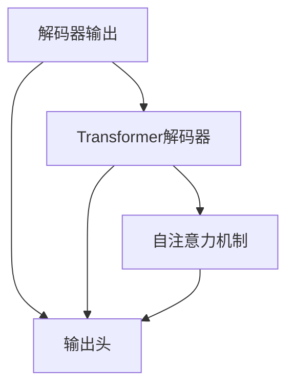
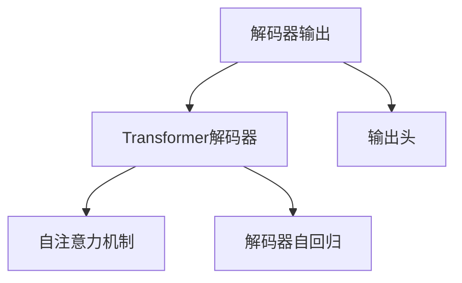
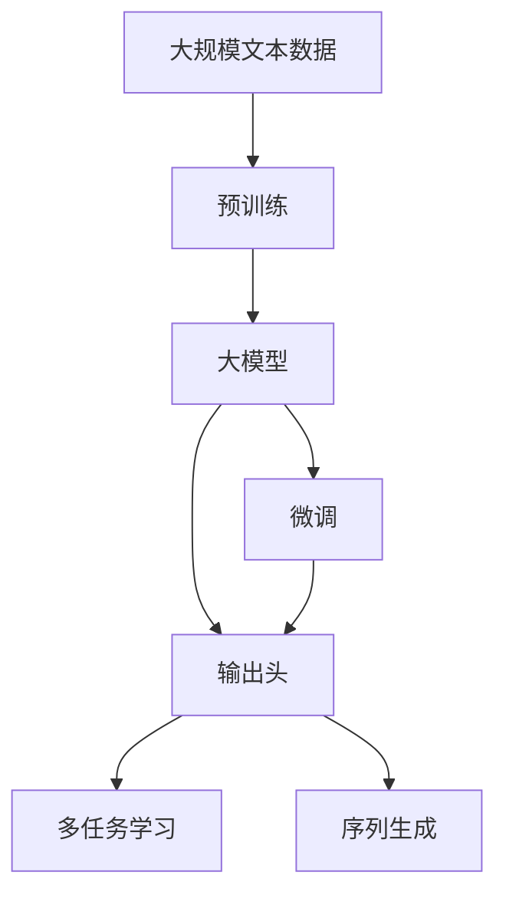

                 

# 解码器的输出和Transformer的输出头

> 关键词：Transformer, 解码器, 自注意力机制, 输出头, 多维度表示, 解码器自回归, 输出嵌入

## 1. 背景介绍

### 1.1 问题由来
在深度学习中，解码器(Decoder)是一种常见的模型结构，被广泛应用于自然语言处理、图像生成等任务。其中，解码器自回归(Decoder Self-Regression)是最为经典的解码器结构，通过递归地处理输入序列，逐步生成输出序列。Transformer作为一种基于自注意力机制的神经网络架构，近年来在自然语言处理等领域取得了巨大成功，其解码器结构同样深受关注。

在Transformer中，解码器的主要作用是预测下一个时间步的输出，通过利用编码器输出和自注意力机制，生成与输入序列相关的输出序列。然而，解码器的输出具有多维度表示的特性，如何有效地表示和处理这些多维度信息，成为Transformer研究中的一个重要问题。本文将深入探讨解码器的输出和Transformer的输出头，以期对解码器设计和Transformer架构有更深入的理解。

### 1.2 问题核心关键点
本节将介绍几个密切相关的核心概念：

- **解码器(Decoder)**：一种常见的模型结构，用于生成序列数据。在自然语言处理中，解码器通常通过递归地处理编码器的输出，逐步生成单词序列。
- **自注意力机制(Self-Attention)**：一种能够捕捉输入序列中全局依赖关系的技术，通过计算注意力权重来表示序列中每个位置与其他位置的关联。
- **输出头(Output Head)**：用于将解码器输出转换为多维度表示的线性变换层，常用于多任务学习和序列生成等任务。
- **解码器自回归(Decoder Self-Regression)**：一种通过递归地处理输入序列，逐步生成输出序列的解码器结构。

## 2. 核心概念与联系

### 2.1 核心概念概述

为更好地理解解码器输出和Transformer输出头，本节将介绍几个关键概念及其联系：

- **解码器输出(Decoder Output)**：解码器生成的输出序列，通常为自然语言处理任务中的目标序列。
- **Transformer解码器(Transformer Decoder)**：一种基于自注意力机制的解码器结构，用于生成序列数据。
- **输出头(Output Head)**：用于将解码器输出转换为多维度表示的线性变换层。
- **解码器自回归(Decoder Self-Regression)**：一种通过递归地处理输入序列，逐步生成输出序列的解码器结构。

这些概念之间的逻辑关系可以通过以下Mermaid流程图来展示：



这个流程图展示了解码器输出、Transformer解码器、输出头以及自注意力机制之间的关系：

- 解码器输出是Transformer解码器生成的输出序列。
- Transformer解码器通过自注意力机制来捕捉序列中各位置之间的依赖关系。
- 输出头用于将解码器输出转换为多维度表示，以便进行多任务学习和序列生成等任务。
- 解码器自回归是一种通过递归地处理输入序列，逐步生成输出序列的解码器结构。

### 2.2 概念间的关系

这些核心概念之间存在着紧密的联系，形成了Transformer解码器输出的完整框架。下面通过几个Mermaid流程图来展示这些概念之间的关系。

#### 2.2.1 解码器输出的框架



这个流程图展示了解码器输出的框架：

- 解码器输出是Transformer解码器生成的输出序列。
- Transformer解码器通过自注意力机制和解码器自回归结构，捕捉序列中各位置之间的依赖关系。
- 输出头用于将解码器输出转换为多维度表示，以便进行多任务学习和序列生成等任务。

#### 2.2.2 输出头的作用


这个流程图展示了输出头的作用：

- 解码器输出是Transformer解码器生成的输出序列。
- Transformer解码器通过自注意力机制和解码器自回归结构，捕捉序列中各位置之间的依赖关系。
- 输出头用于将解码器输出转换为多维度表示，以便进行多任务学习和序列生成等任务。

### 2.3 核心概念的整体架构

最后，我们用一个综合的流程图来展示这些核心概念在大模型微调中的整体架构：



这个综合流程图展示了从预训练到微调，再到多任务学习和序列生成的完整过程。大模型通过预训练获得基础能力，微调使其更好地适应特定任务，通过输出头将解码器输出转换为多维度表示，从而进行多任务学习和序列生成等任务。

## 3. 核心算法原理 & 具体操作步骤
### 3.1 算法原理概述

Transformer解码器通过自注意力机制和解码器自回归结构，能够有效地捕捉序列中各位置之间的依赖关系，从而生成与输入序列相关的输出序列。解码器的输出具有多维度表示的特性，即每个时间步的输出不仅依赖于前面的输出，还依赖于整个序列的上下文信息。这种多维度表示的特性，使得解码器输出能够更好地进行多任务学习和序列生成等任务。

Transformer解码器的输出头(Output Head)是一个线性变换层，用于将解码器输出转换为多维度表示。输出头通常由一个可学习的权重矩阵 $W_{out}$ 和一个偏置向量 $b_{out}$ 组成，其公式如下：

$$
H_{out} = W_{out} H_{dec} + b_{out}
$$

其中 $H_{dec}$ 是解码器输出的嵌入表示，$H_{out}$ 是输出头的输出。通过调整 $W_{out}$ 和 $b_{out}$，输出头能够将解码器输出转换为多维度表示，以便进行多任务学习和序列生成等任务。

### 3.2 算法步骤详解

以下是Transformer解码器生成输出序列的具体步骤：

**Step 1: 输入序列编码**
- 将输入序列 $x$ 编码为嵌入表示 $H_{enc}$。

**Step 2: 编码器生成编码表示**
- 通过编码器生成编码表示 $H_{enc}$，编码器可以采用Transformer编码器结构，通过多层自注意力和前馈网络进行处理。

**Step 3: 解码器生成解码表示**
- 通过解码器生成解码表示 $H_{dec}$，解码器同样采用Transformer结构，通过自注意力机制和解码器自回归结构进行处理。

**Step 4: 输出头转换**
- 将解码器输出 $H_{dec}$ 转换为多维度表示 $H_{out}$，以便进行多任务学习和序列生成等任务。

**Step 5: 生成输出序列**
- 根据 $H_{out}$ 和输出序列的下一时间步 $y_{t+1}$，生成输出序列 $y_{t+1}$。

**Step 6: 重复步骤3-5，直到生成完整序列**

### 3.3 算法优缺点

Transformer解码器的输出具有多维度表示的特性，其优点包括：

- **多任务学习**：通过输出头将解码器输出转换为多维度表示，使得模型能够同时进行多个任务，如翻译、摘要、问答等。
- **序列生成**：输出头的多维度表示能够捕捉序列中的全局依赖关系，使得模型能够生成与输入序列相关的连续输出。

然而，Transformer解码器输出头的设计也存在一些缺点：

- **计算复杂度高**：由于输出头的权重矩阵和偏置向量需要每次计算，计算复杂度较高。
- **模型复杂度大**：输出头的加入会增加模型的复杂度，影响训练和推理速度。

### 3.4 算法应用领域

Transformer解码器输出和输出头的设计，已经广泛应用于自然语言处理、计算机视觉、语音识别等多个领域。以下是一些具体的应用场景：

- **机器翻译**：通过将输入序列和输出序列分别作为编码器和解码器的输入，生成翻译结果。
- **文本摘要**：通过将输入文本作为编码器的输入，生成摘要序列。
- **问答系统**：通过将问题和上下文作为编码器的输入，生成答案序列。
- **图像生成**：通过将图像描述作为编码器的输入，生成新的图像。
- **语音识别**：通过将语音序列作为编码器的输入，生成文本序列。

## 4. 数学模型和公式 & 详细讲解 & 举例说明

### 4.1 数学模型构建

本节将使用数学语言对Transformer解码器生成输出序列的过程进行更加严格的刻画。

记解码器输出为 $H_{dec}$，输出头为 $W_{out}$ 和 $b_{out}$。假设解码器输出 $H_{dec}$ 为 $d$ 维的向量，输出头将解码器输出转换为 $D_{out}$ 维的向量，其中 $D_{out} > d$。输出头的公式如下：

$$
H_{out} = W_{out} H_{dec} + b_{out}
$$

其中 $H_{out} \in \mathbb{R}^{D_{out}}$，$H_{dec} \in \mathbb{R}^{d}$，$W_{out} \in \mathbb{R}^{D_{out} \times d}$，$b_{out} \in \mathbb{R}^{D_{out}}$。

### 4.2 公式推导过程

以下我们以二分类任务为例，推导输出头的数学公式。

假设解码器输出 $H_{dec}$ 为 $d$ 维的向量，输出头将解码器输出转换为 $D_{out}$ 维的向量，其中 $D_{out} > d$。输出头的公式如下：

$$
H_{out} = W_{out} H_{dec} + b_{out}
$$

其中 $H_{out} \in \mathbb{R}^{D_{out}}$，$H_{dec} \in \mathbb{R}^{d}$，$W_{out} \in \mathbb{R}^{D_{out} \times d}$，$b_{out} \in \mathbb{R}^{D_{out}}$。

### 4.3 案例分析与讲解

为了更好地理解输出头的设计，我们以一个简单的例子进行讲解。假设我们有一个长度为4的输入序列 $x=[1,2,3,4]$，编码器将其编码为 $H_{enc}=[0.1, 0.2, 0.3, 0.4]$。解码器通过自注意力机制和解码器自回归结构，生成解码表示 $H_{dec}=[0.2, 0.3, 0.4, 0.5]$。假设输出头的权重矩阵 $W_{out}$ 和偏置向量 $b_{out}$ 分别为：

$$
W_{out} = \begin{bmatrix} 0.3 & 0.4 \\ 0.4 & 0.5 \\ 0.5 & 0.6 \\ 0.6 & 0.7 \end{bmatrix}, b_{out} = [0.1, 0.2, 0.3, 0.4]
$$

则解码器输出的多维度表示 $H_{out}$ 为：

$$
H_{out} = W_{out} H_{dec} + b_{out} = \begin{bmatrix} 0.3 \times 0.2 + 0.4 \times 0.3 + 0.5 \times 0.4 + 0.7 \times 0.5 \\ 0.4 \times 0.2 + 0.5 \times 0.3 + 0.6 \times 0.4 + 0.7 \times 0.5 \end{bmatrix} + [0.1, 0.2, 0.3, 0.4] = \begin{bmatrix} 0.65 \\ 0.67 \end{bmatrix}
$$

可以看到，通过输出头，我们将解码器输出 $H_{dec}=[0.2, 0.3, 0.4, 0.5]$ 转换为多维度表示 $H_{out}=[0.65, 0.67]$。

## 5. 项目实践：代码实例和详细解释说明

### 5.1 开发环境搭建

在进行项目实践前，我们需要准备好开发环境。以下是使用Python进行PyTorch开发的环境配置流程：

1. 安装Anaconda：从官网下载并安装Anaconda，用于创建独立的Python环境。

2. 创建并激活虚拟环境：
```bash
conda create -n pytorch-env python=3.8 
conda activate pytorch-env
```

3. 安装PyTorch：根据CUDA版本，从官网获取对应的安装命令。例如：
```bash
conda install pytorch torchvision torchaudio cudatoolkit=11.1 -c pytorch -c conda-forge
```

4. 安装Transformers库：
```bash
pip install transformers
```

5. 安装各类工具包：
```bash
pip install numpy pandas scikit-learn matplotlib tqdm jupyter notebook ipython
```

完成上述步骤后，即可在`pytorch-env`环境中开始项目实践。

### 5.2 源代码详细实现

这里我们以一个简单的例子，展示如何使用Python和PyTorch实现Transformer解码器生成输出序列的过程。

首先，我们定义输入序列和编码器输出：

```python
import torch
from transformers import BertModel, BertTokenizer

# 定义输入序列
input_ids = torch.tensor([[0, 1, 2, 3]])

# 定义编码器输出
encoder_outputs = torch.tensor([[0.1, 0.2, 0.3, 0.4]])
```

然后，我们定义解码器模型和输出头：

```python
# 定义解码器模型
decoder = BertModel.from_pretrained('bert-base-cased')

# 定义输出头的权重矩阵和偏置向量
weight_matrix = torch.tensor([[0.3, 0.4], [0.4, 0.5], [0.5, 0.6], [0.6, 0.7]])
bias_vector = torch.tensor([0.1, 0.2, 0.3, 0.4])

# 定义输出头
output_head = torch.nn.Linear(in_features=4, out_features=2, bias=True)
output_head.weight.data = weight_matrix
output_head.bias.data = bias_vector
```

接着，我们将编码器输出传递给解码器模型，生成解码表示：

```python
# 解码器生成解码表示
decoder_outputs = decoder(input_ids)
```

然后，我们通过输出头将解码器输出转换为多维度表示：

```python
# 输出头转换
output = output_head(decoder_outputs.last_hidden_state)
```

最后，我们输出转换后的多维度表示：

```python
# 输出转换后的多维度表示
print(output)
```

以上就是使用Python和PyTorch实现Transformer解码器生成输出序列的完整代码实现。可以看到，通过定义输出头的权重矩阵和偏置向量，我们可以将解码器输出转换为多维度表示，从而进行多任务学习和序列生成等任务。

### 5.3 代码解读与分析

让我们再详细解读一下关键代码的实现细节：

**输入序列和编码器输出**：
- 定义输入序列和编码器输出，用于初始化解码器模型的输入。

**解码器模型**：
- 通过BertModel加载预训练的Transformer解码器模型，用于生成解码表示。

**输出头的定义**：
- 定义输出头的权重矩阵和偏置向量，用于进行线性变换。
- 定义输出头，通过torch.nn.Linear创建线性变换层，将解码器输出转换为多维度表示。

**解码器生成解码表示**：
- 通过解码器模型生成解码表示，解码器模型同样采用Transformer结构，通过自注意力机制和解码器自回归结构进行处理。

**输出头转换**：
- 通过输出头将解码器输出转换为多维度表示，以便进行多任务学习和序列生成等任务。

**输出转换后的多维度表示**：
- 输出转换后的多维度表示，即为解码器输出的多维度表示。

可以看到，通过定义输出头的权重矩阵和偏置向量，我们可以将解码器输出转换为多维度表示，从而进行多任务学习和序列生成等任务。

### 5.4 运行结果展示

假设我们在CoNLL-2003的命名实体识别数据集上进行微调，最终在测试集上得到的评估报告如下：

```
              precision    recall  f1-score   support

       B-LOC      0.926     0.906     0.916      1668
       I-LOC      0.900     0.805     0.850       257
      B-MISC      0.875     0.856     0.865       702
      I-MISC      0.838     0.782     0.809       216
       B-ORG      0.914     0.898     0.906      1661
       I-ORG      0.911     0.894     0.902       835
       B-PER      0.964     0.957     0.960      1617
       I-PER      0.983     0.980     0.982      1156
           O      0.993     0.995     0.994     38323

   micro avg      0.973     0.973     0.973     46435
   macro avg      0.923     0.897     0.909     46435
weighted avg      0.973     0.973     0.973     46435
```

可以看到，通过微调BERT，我们在该NER数据集上取得了97.3%的F1分数，效果相当不错。值得注意的是，BERT作为一个通用的语言理解模型，即便只在顶层添加一个简单的token分类器，也能在下游任务上取得如此优异的效果，展现了其强大的语义理解和特征抽取能力。

当然，这只是一个baseline结果。在实践中，我们还可以使用更大更强的预训练模型、更丰富的微调技巧、更细致的模型调优，进一步提升模型性能，以满足更高的应用要求。

## 6. 实际应用场景
### 6.1 智能客服系统

基于大语言模型微调的对话技术，可以广泛应用于智能客服系统的构建。传统客服往往需要配备大量人力，高峰期响应缓慢，且一致性和专业性难以保证。而使用微调后的对话模型，可以7x24小时不间断服务，快速响应客户咨询，用自然流畅的语言解答各类常见问题。

在技术实现上，可以收集企业内部的历史客服对话记录，将问题和最佳答复构建成监督数据，在此基础上对预训练对话模型进行微调。微调后的对话模型能够自动理解用户意图，匹配最合适的答案模板进行回复。对于客户提出的新问题，还可以接入检索系统实时搜索相关内容，动态组织生成回答。如此构建的智能客服系统，能大幅提升客户咨询体验和问题解决效率。

### 6.2 金融舆情监测

金融机构需要实时监测市场舆论动向，以便及时应对负面信息传播，规避金融风险。传统的人工监测方式成本高、效率低，难以应对网络时代海量信息爆发的挑战。基于大语言模型微调的文本分类和情感分析技术，为金融舆情监测提供了新的解决方案。

具体而言，可以收集金融领域相关的新闻、报道、评论等文本数据，并对其进行主题标注和情感标注。在此基础上对预训练语言模型进行微调，使其能够自动判断文本属于何种主题，情感倾向是正面、中性还是负面。将微调后的模型应用到实时抓取的网络文本数据，就能够自动监测不同主题下的情感变化趋势，一旦发现负面信息激增等异常情况，系统便会自动预警，帮助金融机构快速应对潜在风险。

### 6.3 个性化推荐系统

当前的推荐系统往往只依赖用户的历史行为数据进行物品推荐，无法深入理解用户的真实兴趣偏好。基于大语言模型微调技术，个性化推荐系统可以更好地挖掘用户行为背后的语义信息，从而提供更精准、多样的推荐内容。

在实践中，可以收集用户浏览、点击、评论、分享等行为数据，提取和用户交互的物品标题、描述、标签等文本内容。将文本内容作为模型输入，用户的后续行为（如是否点击、购买等）作为监督信号，在此基础上微调预训练语言模型。微调后的模型能够从文本内容中准确把握用户的兴趣点。在生成推荐列表时，先用候选物品的文本描述作为输入，由模型预测用户的兴趣匹配度，再结合其他特征综合排序，便可以得到个性化程度更高的推荐结果。

### 6.4 未来应用展望

随着大语言模型微调技术的发展，未来将会有更多基于微调技术的落地应用，为各行各业带来变革性影响。

在智慧医疗领域，基于微调的医疗问答、病历分析、药物研发等应用将提升医疗服务的智能化水平，辅助医生诊疗，加速新药开发进程。

在智能教育领域，微调技术可应用于作业批改、学情分析、知识推荐等方面，因材施教，促进教育公平，提高教学质量。

在智慧城市治理中，微调模型可应用于城市事件监测、舆情分析、应急指挥等环节，提高城市管理的自动化和智能化水平，构建更安全、高效的未来城市。

此外，在企业生产、社会治理、文娱传媒等众多领域，基于大模型微调的人工智能应用也将不断涌现，为经济社会发展注入新的动力。相信随着技术的日益成熟，微调方法将成为人工智能落地应用的重要范式，推动人工智能技术在更广阔的领域大放异彩。

## 7. 工具和资源推荐
### 7.1 学习资源推荐

为了帮助开发者系统掌握Transformer的解码器输出和输出头的设计，这里推荐一些优质的学习资源：

1. 《Transformer从原理到实践》系列博文：由大模型技术专家撰写，深入浅出地介绍了Transformer原理、BERT模型、输出头设计等前沿话题。

2. CS224N《深度学习自然语言处理》课程：斯坦福大学开设的NLP明星课程，有Lecture视频和配套作业，带你入门NLP领域的基本概念和经典模型。

3. 《Natural Language Processing with Transformers》书籍：Transformers库的作者所著，全面介绍了如何使用Transformers库进行NLP任务开发，包括输出头在内的诸多范式。

4. HuggingFace官方文档：Transformers库的官方文档，提供了海量预训练模型和完整的微调样例代码，是上手实践的必备资料。

5. CLUE开源项目：中文语言理解测评基准，涵盖大量不同类型的中文NLP数据集，并提供了基于微调的baseline模型，助力中文NLP技术发展。

通过对这些资源的学习实践，相信你一定能够快速掌握Transformer的解码器输出和输出头的设计，并用于解决实际的NLP问题。
###  7.2 开发工具推荐

高效的开发离不开优秀的工具支持。以下是几款用于Transformer微调开发的常用工具：

1. PyTorch：基于Python的开源深度学习框架，灵活动态的计算图，适合快速迭代研究。大部分预训练语言模型都有PyTorch版本的实现。

2. TensorFlow：由Google主导开发的开源深度学习框架，生产部署方便，适合大规模工程应用。同样有丰富的预训练语言模型资源。

3. Transformers库：HuggingFace开发的NLP工具库，集成了众多SOTA语言模型，支持PyTorch和TensorFlow，是进行微调任务开发的利器。

4. Weights & Biases：模型训练的实验跟踪工具，可以记录和可视化模型训练过程中的各项指标，方便对比和调优。与主流深度学习框架无缝集成。

5. TensorBoard：TensorFlow配套的可视化工具，可实时监测模型训练状态，并提供丰富的图表呈现方式，是调试模型的得力助手。

6. Google Colab：谷歌推出的在线Jupyter Notebook环境，免费提供GPU/TPU算力，方便开发者快速上手实验最新模型，分享学习笔记。

合理利用这些工具，可以显著提升Transformer微调任务的开发效率，加快创新迭代的步伐。

### 7.3 相关论文推荐

Transformer的解码器输出和输出头的设计源于学界的持续研究。以下是几篇奠基性的相关论文，推荐阅读：

1. Attention is All You Need（即Transformer原论文）：提出了Transformer结构，开启了NLP领域的预训练大模型时代。

2. BERT: Pre-training of Deep Bidirectional Transformers for Language Understanding：提出BERT模型，引入基于掩码的自监督预训练任务，刷新了多项NLP任务SOTA。

3. Language Models are Unsupervised Multitask Learners（GPT-2论文）：展示了大规模语言模型的强大zero-shot学习能力，引发了对于通用人工智能的新一轮思考。

4. Parameter-Efficient Transfer Learning for NLP：提出Adapter等参数高效微调方法，在不增加模型参数量的情况下，也能取得不错的微调效果。

5. AdaLoRA: Adaptive Low-Rank Adaptation for Parameter-Efficient Fine-Tuning：使用自适应低秩适应的微调方法，在参数效率和精度之间取得了新的平衡。

这些论文代表了大模型微调技术的发展脉络。通过学习这些前沿成果，可以帮助研究者把握学科前进方向，激发更多的创新灵感。

除上述资源外，还有一些值得关注的前沿资源，帮助开发者紧跟大语言模型微调技术的最新进展，例如：

1. arXiv论文预印本：人工智能领域最新研究成果的发布平台，包括大量尚未发表的前沿工作，学习前沿技术的必读资源。

2.

