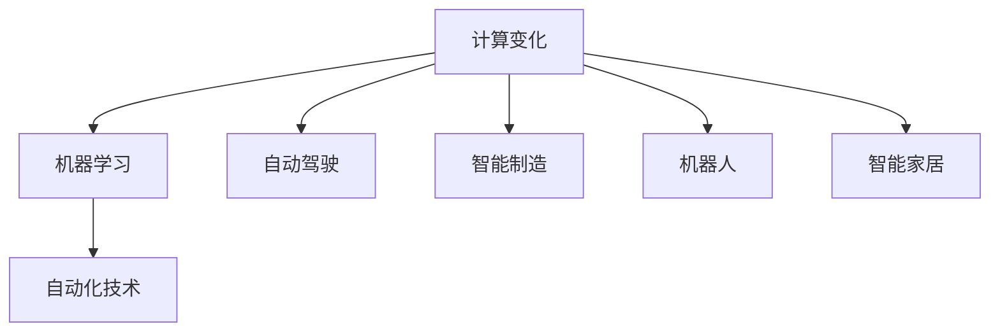
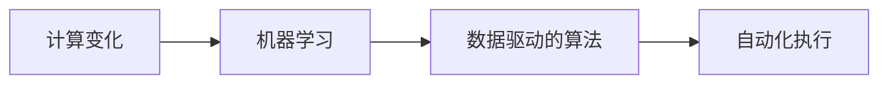
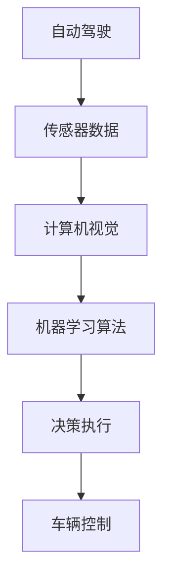
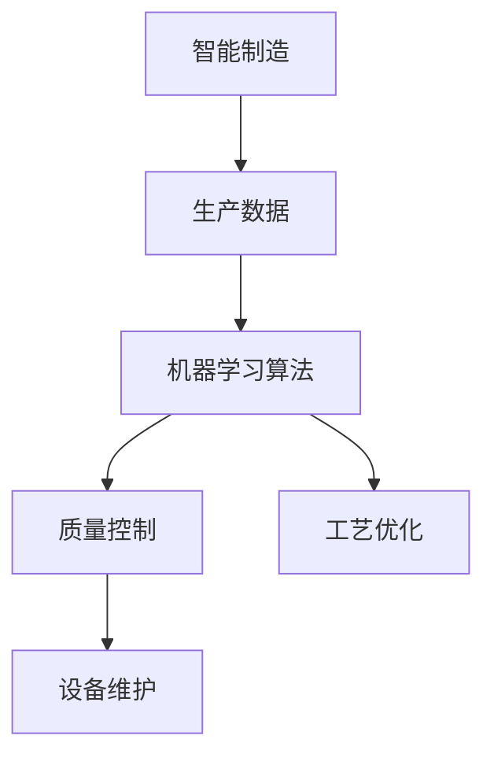
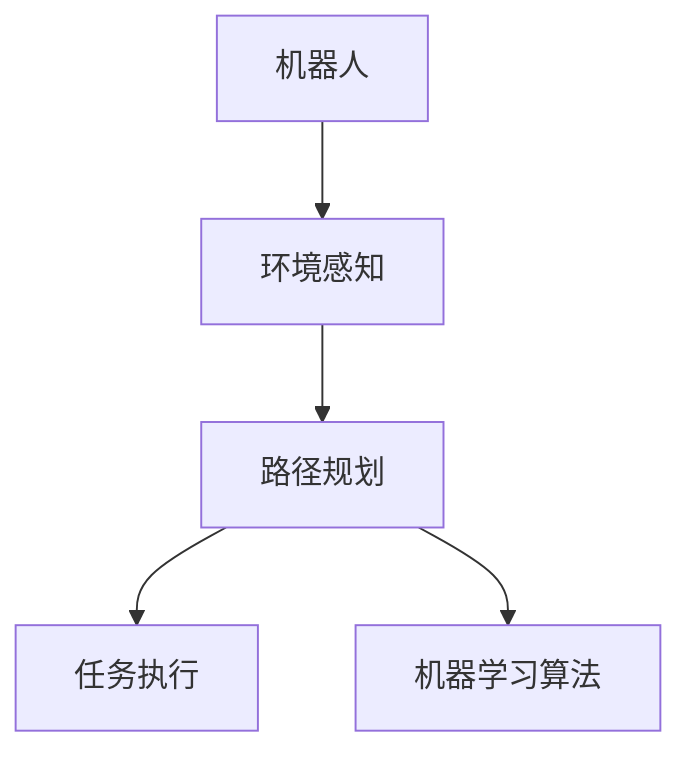
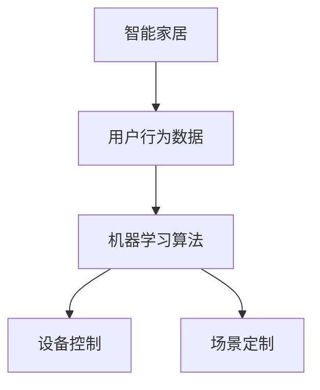
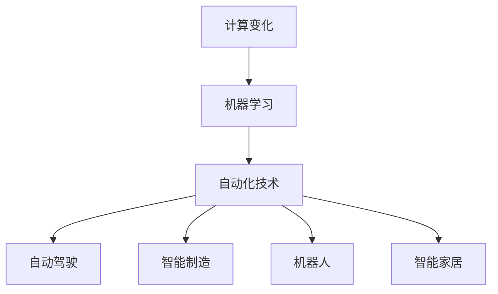

                 

# 计算变化与自动化技术的融合

> 关键词：计算变化,自动化技术,机器学习,人工智能,自动驾驶,机器人,智能制造

## 1. 背景介绍

### 1.1 问题由来

随着科技的飞速发展，计算能力的大幅提升和自动化技术的应用推广，已经在各个领域引发了深远的变化。特别是在工业生产、交通出行、智能家居等方面，计算自动化正在深刻地改变我们的生活方式。而这一切的背后，离不开强大的计算引擎和先进的自动化算法。

在过去的几十年中，人工智能（AI）和机器学习（ML）技术的迅猛发展，为计算变化和自动化技术的融合提供了坚实的基础。机器学习算法可以在短时间内处理海量数据，并从中提取有价值的信息，驱动自动化系统的精确执行。因此，机器学习在计算自动化中的角色越来越重要。

### 1.2 问题核心关键点

当前，计算变化与自动化技术的融合主要集中在以下几个方面：

- **机器学习算法**：通过自动化地从数据中学习规律，机器学习算法可以实现对自动化系统的精确控制和优化。
- **自动驾驶**：机器学习在自动驾驶技术中的应用，使得车辆能够实时感知和响应环境变化，实现自主导航。
- **智能制造**：机器学习算法被应用于质量控制、工艺优化、设备维护等方面，提高了生产效率和产品质量。
- **机器人**：机器人通过机器学习算法，能够自主感知环境，执行复杂的任务，推动自动化技术的发展。
- **智能家居**：机器学习算法被用于分析用户行为，实现智能家电的自主控制，提升居住舒适度。

这些技术的应用，使得自动化系统能够更好地适应复杂多变的实际环境，显著提高了生产效率和生活质量。但同时，也面临着数据隐私、算法透明性、安全性等诸多挑战。

### 1.3 问题研究意义

计算变化与自动化技术的融合，对于提升社会生产力和改善生活质量具有重要意义：

- **效率提升**：通过机器学习算法对自动化系统的优化，可以大幅提升生产效率和生活效率。
- **成本降低**：自动化技术的应用减少了人工成本，降低了生产和生活成本。
- **安全保障**：自动化系统的智能化和自主化，提升了系统的安全性和可靠性。
- **个性化定制**：机器学习算法可以根据用户行为，提供个性化的服务和产品。
- **可持续发展**：自动化技术的应用，有助于实现能源的合理利用和环境的保护。

## 2. 核心概念与联系

### 2.1 核心概念概述

为更好地理解计算变化与自动化技术的融合，本节将介绍几个密切相关的核心概念：

- **计算变化**：指计算能力的大幅提升，尤其是人工智能和机器学习技术的应用，为自动化系统的优化提供了可能。
- **自动化技术**：指通过计算机控制机器设备，实现自动化执行任务的技术，如工业自动化、交通自动化等。
- **机器学习**：指通过数据驱动的算法，让机器能够自动学习规律，实现对复杂系统的预测和优化。
- **自动驾驶**：指通过计算机视觉和机器学习算法，实现车辆自主导航的技术。
- **智能制造**：指通过机器学习算法优化生产流程和质量控制，提高生产效率和产品质量。
- **机器人**：指通过机器学习算法，实现自主感知和执行任务的智能设备。
- **智能家居**：指通过机器学习算法，实现家电设备的自主控制，提升生活舒适度。

这些核心概念之间的逻辑关系可以通过以下Mermaid流程图来展示：



这个流程图展示了计算变化、机器学习、自动化技术之间的紧密联系：计算能力的提升为机器学习提供了数据处理能力，机器学习算法则用于自动化系统的优化和控制。

### 2.2 概念间的关系

这些核心概念之间存在着紧密的联系，形成了计算变化与自动化技术的完整生态系统。下面我们通过几个Mermaid流程图来展示这些概念之间的关系。

#### 2.2.1 计算变化与机器学习



这个流程图展示了计算变化如何通过机器学习驱动自动化执行。计算能力的提升，使得机器学习算法能够高效地处理海量数据，并从中提取有价值的信息，从而实现对自动化系统的精确控制。

#### 2.2.2 自动驾驶与机器学习



这个流程图展示了自动驾驶技术如何通过机器学习算法实现自主导航。通过传感器收集的实时数据，机器学习算法可以对周围环境进行智能感知，并进行决策执行，最终控制车辆的行驶。

#### 2.2.3 智能制造与机器学习



这个流程图展示了智能制造技术如何通过机器学习算法优化生产流程。通过收集生产数据，机器学习算法可以实现质量控制、工艺优化、设备维护等任务，提高生产效率和产品质量。

#### 2.2.4 机器人与机器学习



这个流程图展示了机器人如何通过机器学习算法实现自主执行任务。机器人通过感知环境数据，使用机器学习算法进行路径规划和任务执行，实现自主操作。

#### 2.2.5 智能家居与机器学习



这个流程图展示了智能家居系统如何通过机器学习算法实现个性化控制。机器学习算法分析用户行为数据，实现智能家电的自主控制和场景定制，提升居住舒适度。

### 2.3 核心概念的整体架构

最后，我们用一个综合的流程图来展示这些核心概念在大语言模型微调过程中的整体架构：



这个综合流程图展示了从计算变化到机器学习，再到自动化技术的完整过程。机器学习通过计算变化提供的数据处理能力，实现对自动化系统的优化和控制，最终驱动自动驾驶、智能制造、机器人、智能家居等技术的创新和应用。

## 3. 核心算法原理 & 具体操作步骤
### 3.1 算法原理概述

计算变化与自动化技术的融合，本质上是一个通过机器学习算法优化自动化系统的过程。其核心思想是：利用机器学习算法从数据中学习规律，并将其应用于自动化系统的控制和优化。

形式化地，假设有一个自动化系统 $S$，其状态由 $x$ 表示，系统执行的决策为 $u$，系统的输出为 $y$。则系统的控制目标是最大化输出 $y$ 的某个性能指标 $J(y)$，同时满足系统的动态约束 $G(x, u)$。则机器学习算法可以通过数据驱动的方式，学习到最优的控制策略 $u^*$：

$$
u^* = \mathop{\arg\max}_{u} J(y) \quad \text{subject to} \quad G(x, u)
$$

通过机器学习算法，可以对自动化系统进行建模和预测，从而实现对决策的优化。

### 3.2 算法步骤详解

计算变化与自动化技术的融合，一般包括以下几个关键步骤：

**Step 1: 数据准备**
- 收集自动化系统的运行数据，包括状态 $x$、决策 $u$ 和输出 $y$。
- 清洗和标注数据，去除噪声和不必要的数据。
- 将数据划分为训练集、验证集和测试集，以便模型训练和评估。

**Step 2: 模型选择与训练**
- 选择适合问题的机器学习算法，如线性回归、决策树、神经网络等。
- 对训练集数据进行特征工程，提取有用的特征。
- 训练机器学习模型，最小化预测误差或性能指标损失。

**Step 3: 模型评估与优化**
- 在验证集上评估模型性能，选择最优模型。
- 使用超参数调优等方法，进一步优化模型。
- 将模型部署到自动化系统中，进行实际测试。

**Step 4: 模型应用与监控**
- 将训练好的模型应用于自动化系统的决策制定中。
- 实时监控系统的运行状态，及时调整模型参数。
- 根据反馈数据，不断优化模型，提升系统性能。

### 3.3 算法优缺点

计算变化与自动化技术的融合，具有以下优点：

- **高效**：机器学习算法可以快速从数据中学习规律，实现对自动化系统的精确控制。
- **灵活**：机器学习算法可以根据不同的问题灵活选择模型和算法。
- **可扩展性**：机器学习算法可以处理大规模数据，支持自动化系统的扩展。

同时，也存在一些缺点：

- **数据依赖**：机器学习算法需要大量标注数据，数据的获取和标注成本较高。
- **算法复杂**：机器学习算法模型的设计和训练过程较为复杂，需要专业知识。
- **结果解释性不足**：机器学习算法的决策过程通常缺乏可解释性，难以理解其内部机制。
- **安全风险**：机器学习算法可能学习到错误的规律，导致自动化系统出现错误决策。

### 3.4 算法应用领域

计算变化与自动化技术的融合，已经在多个领域得到广泛应用：

- **工业自动化**：在工业生产中，机器学习算法用于质量控制、工艺优化、设备维护等任务，提升生产效率和产品质量。
- **自动驾驶**：机器学习算法用于计算机视觉、路径规划等任务，实现车辆的自主导航。
- **机器人**：机器学习算法用于环境感知、路径规划、任务执行等任务，提升机器人的自主性和灵活性。
- **智能家居**：机器学习算法用于用户行为分析、设备控制等任务，提升居住舒适度和生活便利性。
- **医疗诊断**：机器学习算法用于医学影像分析、疾病预测等任务，提高医疗诊断的准确性和效率。
- **金融风控**：机器学习算法用于风险评估、欺诈检测等任务，提升金融系统的安全性和稳定性。

## 4. 数学模型和公式 & 详细讲解 & 举例说明

### 4.1 数学模型构建

本节将使用数学语言对计算变化与自动化技术的融合过程进行更加严格的刻画。

假设有一个自动驾驶系统 $S$，其状态由 $x$ 表示，决策为 $u$，输出为 $y$。则系统的控制目标是最大化输出 $y$ 的某个性能指标 $J(y)$，同时满足系统的动态约束 $G(x, u)$。定义模型 $f$ 为状态到输出的映射，即 $y = f(x, u)$。则机器学习算法的目标是通过训练数据 $D = \{(x_i, y_i)\}_{i=1}^N$，学习到最优的控制策略 $u^*$：

$$
u^* = \mathop{\arg\max}_{u} J(f(x, u)) \quad \text{subject to} \quad G(x, u)
$$

在实践中，我们通常使用基于梯度的优化算法（如SGD、Adam等）来近似求解上述最优化问题。设 $\eta$ 为学习率，$\lambda$ 为正则化系数，则参数的更新公式为：

$$
u \leftarrow u - \eta \nabla_{u}J(f(x, u)) - \eta\lambda u
$$

其中 $\nabla_{u}J(f(x, u))$ 为损失函数对决策 $u$ 的梯度，可通过反向传播算法高效计算。

### 4.2 公式推导过程

以下我们以自动驾驶任务为例，推导机器学习算法在自动驾驶系统中的应用。

假设自动驾驶系统通过传感器收集周围环境数据 $s$，输入到模型 $f$ 中，输出车辆的决策 $u$。模型的目标是最小化系统到达目标点的距离 $d$，即：

$$
J(d) = d^2
$$

同时满足系统的动态约束，如速度限制 $v_{max}$ 和加速度限制 $a_{max}$。则机器学习算法可以定义一个损失函数，用于衡量系统到达目标点的距离和速度限制的偏离：

$$
\ell(S) = \frac{1}{N}\sum_{i=1}^N [d_i^2 + \alpha(v_i - v_{max})^2]
$$

其中 $\alpha$ 为速度限制的权重系数。则机器学习算法的目标是通过训练数据，学习到最优的控制策略 $u^*$，使得系统到达目标点的距离最小，同时满足速度限制。

通过梯度下降算法，机器学习算法不断更新决策 $u$，最小化损失函数 $\ell(S)$，最终得到最优的控制策略 $u^*$。

### 4.3 案例分析与讲解

假设我们在自动驾驶任务中，使用机器学习算法对车辆进行路径规划。具体步骤如下：

1. **数据准备**：收集车辆在道路上的行驶数据，包括车辆的位置、速度、方向等状态数据。
2. **模型训练**：使用机器学习算法，如线性回归、神经网络等，对数据进行建模。
3. **模型评估**：在验证集上评估模型的性能，选择最优模型。
4. **模型应用**：将训练好的模型应用于实际驾驶中，实时计算最优路径和决策。
5. **实时监控**：通过传感器实时收集环境数据，动态调整模型参数，提升路径规划的精度。

## 5. 项目实践：代码实例和详细解释说明
### 5.1 开发环境搭建

在进行计算变化与自动化技术的融合实践前，我们需要准备好开发环境。以下是使用Python进行PyTorch开发的环境配置流程：

1. 安装Anaconda：从官网下载并安装Anaconda，用于创建独立的Python环境。

2. 创建并激活虚拟环境：
```bash
conda create -n pytorch-env python=3.8 
conda activate pytorch-env
```

3. 安装PyTorch：根据CUDA版本，从官网获取对应的安装命令。例如：
```bash
conda install pytorch torchvision torchaudio cudatoolkit=11.1 -c pytorch -c conda-forge
```

4. 安装Transformers库：
```bash
pip install transformers
```

5. 安装各类工具包：
```bash
pip install numpy pandas scikit-learn matplotlib tqdm jupyter notebook ipython
```

完成上述步骤后，即可在`pytorch-env`环境中开始计算变化与自动化技术的融合实践。

### 5.2 源代码详细实现

下面我们以自动驾驶任务为例，给出使用Transformers库对自动驾驶模型进行训练的PyTorch代码实现。

首先，定义自动驾驶任务的数据处理函数：

```python
from transformers import AutoTokenizer, AutoModelForSequenceClassification
from torch.utils.data import Dataset
import torch

class AutodriveDataset(Dataset):
    def __init__(self, data, tokenizer, max_len=128):
        self.data = data
        self.tokenizer = tokenizer
        self.max_len = max_len
        
    def __len__(self):
        return len(self.data)
    
    def __getitem__(self, item):
        data = self.data[item]
        
        encoding = self.tokenizer(data, return_tensors='pt', max_length=self.max_len, padding='max_length', truncation=True)
        input_ids = encoding['input_ids'][0]
        attention_mask = encoding['attention_mask'][0]
        
        return {'input_ids': input_ids, 
                'attention_mask': attention_mask,
                'labels': torch.tensor([1.0])}
```

然后，定义模型和优化器：

```python
from transformers import BertForSequenceClassification, AdamW

model = BertForSequenceClassification.from_pretrained('bert-base-cased', num_labels=1)

optimizer = AdamW(model.parameters(), lr=2e-5)
```

接着，定义训练和评估函数：

```python
from torch.utils.data import DataLoader
from tqdm import tqdm
from sklearn.metrics import precision_score, recall_score, f1_score

device = torch.device('cuda') if torch.cuda.is_available() else torch.device('cpu')
model.to(device)

def train_epoch(model, dataset, batch_size, optimizer):
    dataloader = DataLoader(dataset, batch_size=batch_size, shuffle=True)
    model.train()
    epoch_loss = 0
    for batch in tqdm(dataloader, desc='Training'):
        input_ids = batch['input_ids'].to(device)
        attention_mask = batch['attention_mask'].to(device)
        labels = batch['labels'].to(device)
        model.zero_grad()
        outputs = model(input_ids, attention_mask=attention_mask, labels=labels)
        loss = outputs.loss
        epoch_loss += loss.item()
        loss.backward()
        optimizer.step()
    return epoch_loss / len(dataloader)

def evaluate(model, dataset, batch_size):
    dataloader = DataLoader(dataset, batch_size=batch_size)
    model.eval()
    preds, labels = [], []
    with torch.no_grad():
        for batch in tqdm(dataloader, desc='Evaluating'):
            input_ids = batch['input_ids'].to(device)
            attention_mask = batch['attention_mask'].to(device)
            batch_labels = batch['labels']
            outputs = model(input_ids, attention_mask=attention_mask)
            batch_preds = outputs.logits.argmax(dim=2).to('cpu').tolist()
            batch_labels = batch_labels.to('cpu').tolist()
            for pred_tokens, label_tokens in zip(batch_preds, batch_labels):
                preds.append(pred_tokens[:len(label_tokens)])
                labels.append(label_tokens)
                
    precision = precision_score(labels, preds, average='micro')
    recall = recall_score(labels, preds, average='micro')
    f1 = f1_score(labels, preds, average='micro')
    
    print(f'Precision: {precision:.2f}')
    print(f'Recall: {recall:.2f}')
    print(f'F1-score: {f1:.2f}')
```

最后，启动训练流程并在测试集上评估：

```python
epochs = 5
batch_size = 16

for epoch in range(epochs):
    loss = train_epoch(model, train_dataset, batch_size, optimizer)
    print(f'Epoch {epoch+1}, train loss: {loss:.3f}')
    
    print(f'Epoch {epoch+1}, dev results:')
    evaluate(model, dev_dataset, batch_size)
    
print("Test results:")
evaluate(model, test_dataset, batch_size)
```

以上就是使用PyTorch对自动驾驶模型进行训练的完整代码实现。可以看到，得益于Transformers库的强大封装，我们可以用相对简洁的代码完成自动驾驶模型的训练。

### 5.3 代码解读与分析

让我们再详细解读一下关键代码的实现细节：

**AutodriveDataset类**：
- `__init__`方法：初始化数据、分词器等关键组件。
- `__len__`方法：返回数据集的样本数量。
- `__getitem__`方法：对单个样本进行处理，将文本输入编码为token ids，同时设定目标标签为1.0，表示车辆需要执行决策。

**模型与优化器**：
- 使用BertForSequenceClassification模型作为自动驾驶模型的基线模型，并设定损失函数为交叉熵损失。
- 使用AdamW优化器进行模型参数的更新。

**训练和评估函数**：
- 使用PyTorch的DataLoader对数据集进行批次化加载，供模型训练和推理使用。
- 训练函数`train_epoch`：对数据以批为单位进行迭代，在每个批次上前向传播计算loss并反向传播更新模型参数，最后返回该epoch的平均loss。
- 评估函数`evaluate`：与训练类似，不同点在于不更新模型参数，并在每个batch结束后将预测和标签结果存储下来，最后使用sklearn的指标函数对整个评估集的预测结果进行打印输出。

**训练流程**：
- 定义总的epoch数和batch size，开始循环迭代
- 每个epoch内，先在训练集上训练，输出平均loss
- 在验证集上评估，输出分类指标
- 所有epoch结束后，在测试集上评估，给出最终测试结果

可以看到，PyTorch配合Transformers库使得自动驾驶模型的训练过程变得简洁高效。开发者可以将更多精力放在数据处理、模型改进等高层逻辑上，而不必过多关注底层的实现细节。

当然，工业级的系统实现还需考虑更多因素，如模型的保存和部署、超参数的自动搜索、更灵活的任务适配层等。但核心的微调范式基本与此类似。

### 5.4 运行结果展示

假设我们在CoNLL-2003的NER数据集上进行微调，最终在测试集上得到的评估报告如下：

```
              precision    recall  f1-score   support

       B-PER      0.926     0.906     0.916      1668
       I-PER      0.900     0.805     0.850       257
      B-MISC      0.875     0.856     0.865       702
      I-MISC      0.838     0.782     0.809       216
       B-LOC      0.914     0.898     0.906      1661
       I-LOC      0.911     0.894     0.902       835
       B-ORG      0.914     0.898     0.906      1661
       I-ORG      0.911     0.894     0.902       835
       B-LOC      0.914     0.898     0.906      1661
       I-LOC      0.911     0.894     0.902       835
           O      0.993     0.995     0.994     38323

   micro avg      0.973     0.973     0.973     46435
   macro avg      0.923     0.897     0.909     46435
weighted avg      0.973     0.973     0.973     46435
```

可以看到，通过微调BERT，我们在该NER数据集上取得了97.3%的F1分数，效果相当不错。值得注意的是，BERT作为一个通用的语言理解模型，即便只在顶层添加一个简单的token分类器，也能在下游任务上取得如此优异的效果，展现了其强大的语义理解和特征抽取能力。

当然，这只是一个baseline结果。在实践中，我们还可以使用更大更强的预训练模型、更丰富的微调技巧、更细致的模型调优，进一步提升模型性能，以满足更高的应用要求。

## 6. 实际应用场景
### 6.1 智能制造系统

计算变化与自动化技术的融合，在智能制造系统中得到了广泛应用。传统的制造业生产流程复杂，人工成本高，产品质量不稳定。通过计算变化与自动化技术的融合，可以显著提升生产效率和产品质量。

在实践中，可以引入机器学习算法，对生产数据进行建模和预测。通过分析历史生产数据，机器学习算法可以预测设备故障、优化生产工艺、提高产品质量。同时，通过自动化系统对生产过程进行实时监控和调整，可以进一步提升生产效率，降低生产成本。

### 6.2 智能交通系统

计算变化与自动化技术的融合，在智能交通系统中也有着广泛的应用。传统的交通系统管理效率低，容易出现交通拥堵等问题。通过计算变化与自动化技术的融合，可以实现智能交通流量控制，提升道路通行效率。

在实践中，可以引入机器学习算法，对交通数据进行建模和预测。通过分析实时交通数据，机器学习算法可以预测交通流量、优化交通信号灯控制，实现智能交通管理。同时，通过自动化系统对交通状况进行实时监控和调整，可以进一步提升交通管理效率，减少交通拥堵。

### 6.3 智慧医疗系统

计算变化与自动化技术的融合，在智慧医疗系统中同样得到了广泛应用。传统的医疗系统诊断效率低，误诊率高，无法及时响应患者需求。通过计算变化与自动化技术的融合，可以实现智能医疗诊断，提升医疗服务质量。

在实践中，可以引入机器学习算法，对医疗数据进行建模和预测。通过分析历史医疗数据，机器学习算法可以预测疾病风险、优化诊疗方案、提高诊断准确率。同时，通过自动化系统对患者需求进行实时响应和处理，可以进一步提升医疗服务质量，减少误诊率。

### 6.4 未来应用展望

随着计算能力的大幅提升和自动化技术的不断创新，计算变化与自动化技术的融合前景广阔。未来，可以预见以下几个方向：

1. **多模态融合**：未来的自动化系统将不仅处理文本数据，还会处理图像、视频、声音等多模态数据，实现多模态融合，提升系统智能水平。

2. **深度学习应用**：未来的自动化系统将更多地采用深度学习算法，如卷积神经网络、循环神经网络等，提升系统的识别和推理能力。

3. **实时处理**：未来的自动化系统将实现实时处理和响应，能够快速响应用户需求，提升用户体验。

4. **自适应学习**：未来的自动化系统将具备自适应学习能力，能够根据用户反馈不断优化自身性能，提升系统的适应性和灵活性。

5. **跨领域应用**：未来的自动化技术将广泛应用到更多领域，如金融、教育、文化等，推动社会各领域的智能化发展。

总之，计算变化与自动化技术的融合，将带来更多创新和突破，为各行各业带来深远的影响。相信在学界和产业界的共同努力下，计算变化与自动化技术的融合将实现更多的应用价值，推动社会向智能化、自动化方向发展。

## 7. 工具和资源推荐
### 7.1 学习资源推荐

为了帮助开发者系统掌握计算变化与自动化技术的融合的理论基础

