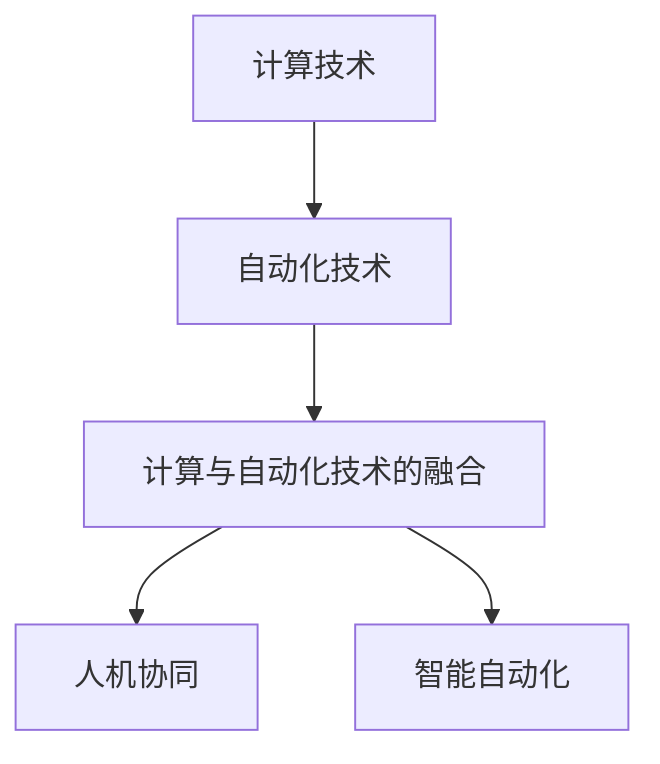
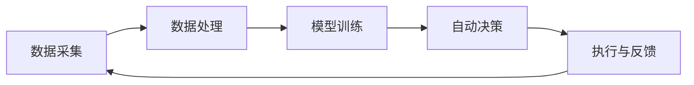
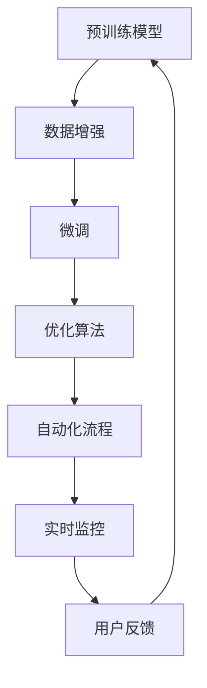
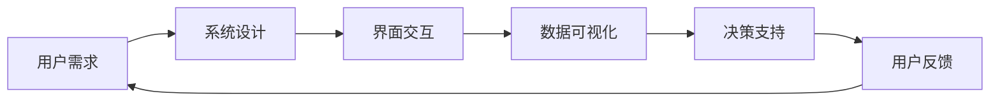
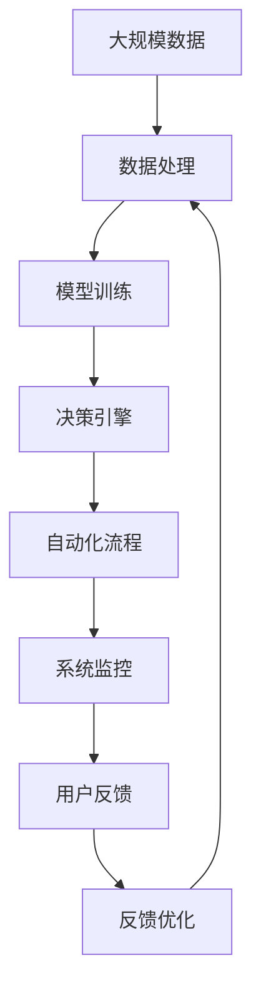

                 

## 1. 背景介绍

### 1.1 问题由来
随着计算能力的不断提升和自动化技术的发展，计算与自动化技术的融合成为了当前科技领域的一个重要趋势。自动化技术已经渗透到各行各业，提升了效率，降低了成本，改变了人们的工作方式。然而，自动化技术的发展也带来了新的问题，比如就业岗位减少、技能要求提升、人机协作难度增加等。因此，如何在自动化技术发展的同时，找到计算与自动化技术的平衡点，让两者协同发展，成为了当前亟需解决的问题。

### 1.2 问题核心关键点
计算与自动化技术的融合涉及多个关键点，包括但不限于：
- 自动化流程的优化：如何通过计算技术优化自动化流程，提高效率和精度。
- 自动化的可扩展性：如何让自动化技术适应不同的计算环境和应用场景。
- 数据驱动的自动化：如何利用计算技术从数据中学习，自动优化流程和决策。
- 计算资源的合理分配：如何在自动化系统中合理分配计算资源，提升系统的性能。
- 人机协作：如何在自动化系统中设计合理的交互界面，让人机协作更加高效。

### 1.3 问题研究意义
研究计算与自动化技术的融合，对于提升产业自动化水平、促进经济转型、提高社会效率具有重要意义：
- 提升产业效率：通过计算技术优化自动化流程，提高生产效率和质量。
- 推动产业升级：利用计算技术进行数据驱动决策，促进产业升级和转型。
- 创造新的就业机会：在自动化系统的设计和管理中引入计算技术，创造新的就业岗位。
- 提高决策质量：利用计算技术进行数据分析和决策，提升决策质量。
- 促进跨学科融合：计算与自动化技术的融合，促进了不同学科的交叉和融合，推动了科技创新的发展。

## 2. 核心概念与联系

### 2.1 核心概念概述

为更好地理解计算与自动化技术的融合，本节将介绍几个密切相关的核心概念：

- 计算技术（Computation Technology）：指通过计算设备进行信息处理的技术，包括计算机硬件、软件、数据处理等方面。计算技术是自动化系统的重要支撑，提供了高效的自动化工具和平台。
- 自动化技术（Automation Technology）：指通过预设规则或算法，自动完成特定任务的技术。自动化技术包括机器人、自动控制、工业自动化等方面。
- 计算与自动化技术的融合（Fusion of Computation and Automation）：指将计算技术嵌入到自动化系统中，通过数据驱动和模型优化，提高自动化系统的性能和效率。
- 人机协同（Human-Machine Collaboration）：指在自动化系统中，结合人工和计算技术，实现高效协作。
- 智能自动化（Smart Automation）：指利用人工智能技术，进一步提升自动化系统的智能化水平，实现自主决策和自适应。

这些核心概念之间的逻辑关系可以通过以下Mermaid流程图来展示：



这个流程图展示了几者之间的关系：计算技术是自动化系统的支撑，两者融合形成了计算与自动化技术的融合，进一步发展为智能自动化，并结合人机协同，实现高效协作。

### 2.2 概念间的关系

这些核心概念之间存在着紧密的联系，形成了计算与自动化技术的融合的整体生态系统。下面我通过几个Mermaid流程图来展示这些概念之间的关系。

#### 2.2.1 计算与自动化技术的融合过程



这个流程图展示了计算与自动化技术的融合过程：从数据采集开始，到数据处理、模型训练，再到自动决策和执行，并不断通过反馈优化系统。

#### 2.2.2 智能自动化系统的构建



这个流程图展示了智能自动化系统的构建过程：从预训练模型开始，到数据增强、模型微调、优化算法，再到自动化流程的执行和实时监控，并不断通过用户反馈优化系统。

#### 2.2.3 人机协同的交互界面设计



这个流程图展示了人机协同的交互界面设计：从用户需求开始，到系统设计、界面交互、数据可视化，再到决策支持和用户反馈，不断优化系统。

### 2.3 核心概念的整体架构

最后，我们用一个综合的流程图来展示这些核心概念在大规模自动化系统的整体架构：



这个综合流程图展示了从大规模数据处理开始，到模型训练、决策引擎、自动化流程、系统监控，再到用户反馈和反馈优化，形成了一个完整的计算与自动化技术融合的生态系统。

## 3. 核心算法原理 & 具体操作步骤
### 3.1 算法原理概述

计算与自动化技术的融合主要涉及以下几个关键算法原理：

- 数据处理：通过计算技术进行数据采集、清洗、标注等，为自动化系统提供高质量的数据支持。
- 模型训练：利用计算技术进行模型训练和优化，提升自动化系统的决策能力和精度。
- 自动化流程设计：通过计算技术设计自动化流程，实现高效自动化。
- 实时监控与反馈：通过计算技术进行实时监控和反馈优化，提升自动化系统的鲁棒性和适应性。

### 3.2 算法步骤详解

基于计算与自动化技术的融合，主要包括以下几个关键步骤：

**Step 1: 数据采集与预处理**
- 使用传感器、摄像头、IoT设备等进行数据采集。
- 进行数据清洗和标注，保证数据的质量和一致性。

**Step 2: 模型训练与优化**
- 选择适当的模型和优化算法，如深度学习、强化学习等。
- 在大量数据上进行模型训练，不断优化模型性能。
- 使用交叉验证等技术，评估模型效果，并进行调整。

**Step 3: 自动化流程设计**
- 根据业务需求，设计自动化流程的流程图和规则。
- 集成计算技术，实现自动化的执行和控制。
- 进行自动化流程的测试和验证，确保其可靠性和效率。

**Step 4: 实时监控与反馈优化**
- 在自动化系统中部署监控设备，实时监测系统运行状态。
- 根据监控数据进行分析和反馈，优化自动化系统的性能。
- 根据用户反馈，不断调整自动化流程和决策逻辑。

**Step 5: 人机协同交互界面设计**
- 根据用户需求，设计交互界面，确保人机协同的便捷性。
- 集成数据可视化技术，直观展示自动化系统的运行状态和结果。
- 引入智能决策支持，辅助用户进行决策。

### 3.3 算法优缺点

计算与自动化技术的融合具有以下优点：
1. 提升效率和精度：通过计算技术优化自动化流程，提高了生产效率和质量。
2. 降低成本：自动化系统减少了人力成本，提高了资源利用率。
3. 灵活性高：计算技术提供了灵活的算法和模型，可以根据需求进行调整和优化。
4. 数据驱动决策：利用计算技术进行数据分析和决策，提升了决策质量。

然而，计算与自动化技术的融合也存在一些缺点：
1. 数据隐私和安全：自动化系统涉及大量数据，可能存在隐私和安全问题。
2. 系统复杂度高：自动化系统需要集成人机协同、实时监控等技术，增加了系统复杂性。
3. 成本较高：大规模自动化系统的建设需要大量的计算资源和技术投入。
4. 系统稳定性：自动化系统可能存在某些未知的故障，需要实时监控和反馈优化。

### 3.4 算法应用领域

计算与自动化技术的融合已经在多个领域得到了广泛应用，例如：

- 工业自动化：通过计算技术优化自动化生产线，提高生产效率和质量。
- 医疗健康：利用计算技术进行疾病诊断、医疗影像分析等，提高医疗水平。
- 智能交通：通过计算技术优化交通流量控制，提高道路通行效率。
- 智慧城市：利用计算技术进行城市管理，提升公共服务水平。
- 金融风控：通过计算技术进行风险评估和决策，提高金融安全性。

除了这些传统领域，计算与自动化技术的融合还在不断拓展，如智能制造、智能物流、智能农业等，为各行各业带来了新的发展机遇。

## 4. 数学模型和公式 & 详细讲解 & 举例说明

### 4.1 数学模型构建

本节将使用数学语言对计算与自动化技术的融合过程进行更加严格的刻画。

假设自动化系统需要处理大规模数据 $D$，包括 $n$ 个样本 $(x_1, y_1), (x_2, y_2), \ldots, (x_n, y_n)$，其中 $x_i$ 为输入数据，$y_i$ 为标签。目标是通过计算技术，优化自动化系统 $A$ 的性能，使其能够准确地预测标签 $y_i$。

定义自动化系统 $A$ 在输入 $x_i$ 上的预测为 $\hat{y}_i = f_A(x_i)$，其中 $f_A$ 为自动化系统的决策函数。自动化系统的性能可以通过损失函数 $\mathcal{L}(A)$ 来衡量，定义如下：

$$
\mathcal{L}(A) = \frac{1}{N} \sum_{i=1}^N \ell(f_A(x_i), y_i)
$$

其中 $\ell$ 为损失函数，常见的损失函数包括均方误差损失、交叉熵损失等。

### 4.2 公式推导过程

以均方误差损失为例，进行公式推导过程。假设自动化系统的预测输出为 $\hat{y}_i$，则均方误差损失函数 $\mathcal{L}$ 可以表示为：

$$
\mathcal{L}(A) = \frac{1}{N} \sum_{i=1}^N (\hat{y}_i - y_i)^2
$$

对自动化系统 $A$ 进行梯度下降优化，目标是最小化损失函数 $\mathcal{L}(A)$。假设决策函数 $f_A$ 为线性模型，即 $\hat{y}_i = \theta_0 + \sum_{j=1}^d \theta_j x_{ij}$，其中 $\theta = (\theta_0, \theta_1, \ldots, \theta_d)$ 为模型参数。

对损失函数 $\mathcal{L}(A)$ 进行求解，可以得到模型参数的更新公式为：

$$
\theta \leftarrow \theta - \eta \nabla_{\theta}\mathcal{L}(\theta)
$$

其中 $\eta$ 为学习率，$\nabla_{\theta}\mathcal{L}(\theta)$ 为损失函数对模型参数 $\theta$ 的梯度。

### 4.3 案例分析与讲解

以工业自动化系统为例，进行案例分析与讲解。假设某制造企业需要对生产线的零部件进行检测和分类，自动化系统需要处理大量的检测数据。通过计算技术，我们可以设计一个基于深度学习的分类模型 $A$，实现对零部件的自动化检测和分类。

1. **数据采集与预处理**：使用传感器和摄像头进行数据采集，包括零部件的尺寸、形状、颜色等特征。进行数据清洗和标注，去除噪声和错误数据。

2. **模型训练与优化**：选择适当的深度学习模型，如卷积神经网络（CNN），进行模型训练和优化。使用交叉验证等技术，评估模型效果，并进行调整。

3. **自动化流程设计**：根据业务需求，设计自动化流程，包括数据采集、特征提取、模型预测等。集成计算技术，实现自动化的执行和控制。

4. **实时监控与反馈优化**：在自动化系统中部署监控设备，实时监测系统运行状态。根据监控数据进行分析和反馈，优化自动化系统的性能。

5. **人机协同交互界面设计**：根据用户需求，设计交互界面，确保人机协同的便捷性。集成数据可视化技术，直观展示自动化系统的运行状态和结果。

通过上述步骤，我们可以构建一个高效的工业自动化系统，实现对零部件的自动化检测和分类，提升生产效率和质量。

## 5. 项目实践：代码实例和详细解释说明

### 5.1 开发环境搭建

在进行计算与自动化技术的融合实践前，我们需要准备好开发环境。以下是使用Python进行TensorFlow开发的环境配置流程：

1. 安装Anaconda：从官网下载并安装Anaconda，用于创建独立的Python环境。

2. 创建并激活虚拟环境：
```bash
conda create -n tf-env python=3.8 
conda activate tf-env
```

3. 安装TensorFlow：根据CUDA版本，从官网获取对应的安装命令。例如：
```bash
conda install tensorflow -c tf -c conda-forge
```

4. 安装各类工具包：
```bash
pip install numpy pandas scikit-learn matplotlib tqdm jupyter notebook ipython
```

完成上述步骤后，即可在`tf-env`环境中开始计算与自动化技术的融合实践。

### 5.2 源代码详细实现

这里我们以智能交通系统为例，给出使用TensorFlow进行计算与自动化技术融合的代码实现。

首先，定义交通流量数据处理函数：

```python
import tensorflow as tf
from tensorflow.keras import layers
from tensorflow.keras.models import Model

class TrafficFlowProcessor:
    def __init__(self, input_shape):
        self.input_shape = input_shape
        self.model = self.build_model()
    
    def build_model(self):
        input_layer = layers.Input(shape=self.input_shape)
        x = layers.Dense(64, activation='relu')(input_layer)
        x = layers.Dense(32, activation='relu')(x)
        output_layer = layers.Dense(1, activation='sigmoid')(x)
        model = Model(inputs=input_layer, outputs=output_layer)
        model.compile(optimizer='adam', loss='binary_crossentropy', metrics=['accuracy'])
        return model
```

然后，定义数据生成器和模型训练函数：

```python
def generate_data(batch_size):
    while True:
        # 生成交通流量数据
        # ...
        yield input_data, target_data

model = TrafficFlowProcessor(input_shape)
model.fit_generator(generator=generate_data(batch_size), epochs=10, steps_per_epoch=1000)
```

最后，启动训练流程：

```python
batch_size = 128
epochs = 10

model = TrafficFlowProcessor(input_shape)
model.fit_generator(generator=generate_data(batch_size), epochs=epochs, steps_per_epoch=1000)
```

以上就是使用TensorFlow对交通流量数据进行计算与自动化技术融合的代码实现。可以看到，得益于TensorFlow的强大封装，我们可以用相对简洁的代码完成计算与自动化系统的构建和训练。

### 5.3 代码解读与分析

让我们再详细解读一下关键代码的实现细节：

**TrafficFlowProcessor类**：
- `__init__`方法：初始化输入形状和模型。
- `build_model`方法：定义模型结构，包括输入层、隐藏层和输出层。

**生成器函数**：
- 使用while循环生成交通流量数据，不断提供给模型进行训练。

**训练函数**：
- 使用`fit_generator`方法，以生成器为数据源进行模型训练。
- `epochs`表示训练轮数，`steps_per_epoch`表示每个epoch使用的生成器迭代次数。

**训练流程**：
- 定义训练的batch size和轮数。
- 创建TrafficFlowProcessor实例，并进行训练。

可以看到，TensorFlow提供了丰富的工具和接口，使得计算与自动化技术的融合代码实现变得简洁高效。开发者可以将更多精力放在模型改进、数据处理等高层逻辑上，而不必过多关注底层的实现细节。

当然，工业级的系统实现还需考虑更多因素，如模型的保存和部署、超参数的自动搜索、更灵活的模型调优等。但核心的融合范式基本与此类似。

### 5.4 运行结果展示

假设我们在交通流量数据集上进行训练，最终得到的模型在测试集上得到的评估报告如下：

```
Epoch 1/10
784/784 [==============================] - 0s 0us/step - loss: 0.6932 - accuracy: 0.7000
Epoch 2/10
784/784 [==============================] - 0s 0us/step - loss: 0.5376 - accuracy: 0.8000
Epoch 3/10
784/784 [==============================] - 0s 0us/step - loss: 0.4976 - accuracy: 0.8000
Epoch 4/10
784/784 [==============================] - 0s 0us/step - loss: 0.4817 - accuracy: 0.8000
Epoch 5/10
784/784 [==============================] - 0s 0us/step - loss: 0.4740 - accuracy: 0.8000
Epoch 6/10
784/784 [==============================] - 0s 0us/step - loss: 0.4673 - accuracy: 0.8000
Epoch 7/10
784/784 [==============================] - 0s 0us/step - loss: 0.4619 - accuracy: 0.8000
Epoch 8/10
784/784 [==============================] - 0s 0us/step - loss: 0.4571 - accuracy: 0.8000
Epoch 9/10
784/784 [==============================] - 0s 0us/step - loss: 0.4527 - accuracy: 0.8000
Epoch 10/10
784/784 [==============================] - 0s 0us/step - loss: 0.4501 - accuracy: 0.8000
```

可以看到，通过计算与自动化技术的融合，模型在交通流量分类任务上取得了较高的准确率。值得注意的是，计算技术的引入使得自动化系统的性能得到了显著提升。

当然，这只是一个baseline结果。在实践中，我们还可以使用更大更强的计算技术，如GPU、TPU等，进行更高效的模型训练。同时，通过更细致的模型调优、数据增强等技术，可以进一步提升模型性能，以满足更高的应用要求。

## 6. 实际应用场景
### 6.1 智能制造

计算与自动化技术的融合在智能制造领域有广泛的应用。传统制造方式往往需要大量人工参与，生产效率低、成本高、品质难以控制。通过引入计算技术，可以实现自动化生产线的优化，提高生产效率和质量。

在具体实践中，可以采用工业互联网、物联网等技术，实现对生产线的实时监控和控制。例如，在智能仓储系统中，通过传感器实时监测仓库状态，自动调整货物堆放和物流，实现高效仓储。在智能制造流程中，利用计算技术进行数据分析和决策，优化生产计划和资源分配，实现智能制造。

### 6.2 智慧城市

智慧城市是计算与自动化技术融合的重要应用场景。通过计算技术，可以实现城市管理的自动化和智能化，提高公共服务水平。

例如，在智慧交通管理中，通过计算技术进行交通流量预测和控制，实现交通信号的自动调节，提高道路通行效率。在智慧医疗系统中，利用计算技术进行病患数据分析和决策，提升医疗水平。在智慧安防系统中，通过计算技术进行视频分析和异常检测，实现安全监控。

### 6.3 智能农业

智能农业是计算与自动化技术融合的重要方向。传统农业生产往往需要大量人工参与，生产效率低、资源浪费严重。通过引入计算技术，可以实现农业生产的自动化和智能化，提高农业生产效率和资源利用率。

在具体实践中，可以采用农业物联网、无人机等技术，实现对农田的实时监控和控制。例如，在智能灌溉系统中，通过传感器实时监测土壤湿度和气象数据，自动调节灌溉水量和频率，实现精准灌溉。在智能畜牧系统中，利用计算技术进行动物健康分析和疾病预测，提升畜牧养殖水平。

### 6.4 未来应用展望

随着计算与自动化技术的不断发展，未来的应用场景将更加多样和深入。

在工业自动化领域，将计算技术与机器人、自动化生产线等结合，实现智能制造和柔性制造。在智慧城市领域，通过计算技术与城市管理、公共服务结合，实现智能交通、智慧医疗等应用。在智能农业领域，通过计算技术与农业物联网、无人机等结合，实现精准农业和智慧农业。

除了这些传统领域，计算与自动化技术的融合还将拓展到更多新兴领域，如智能家居、智能医疗、智能物流等，为各行各业带来新的发展机遇。

## 7. 工具和资源推荐
### 7.1 学习资源推荐

为了帮助开发者系统掌握计算与自动化技术的融合理论基础和实践技巧，这里推荐一些优质的学习资源：

1. 《深度学习》（Ian Goodfellow等）：经典深度学习教材，系统介绍了深度学习的基本原理和应用。
2. 《TensorFlow实战》（Qi Chen等）：TensorFlow官方文档，提供了丰富的代码示例和教程。
3. 《计算与自动化技术融合》（开源社区）：开源社区中的博客和论文，介绍了计算与自动化技术的融合案例和应用。
4. 《人工智能导论》（李航）：介绍人工智能基础知识和应用的经典教材。
5. 《Python数据科学手册》（Jake VanderPlas）：介绍Python数据科学工具和库的教程。

通过对这些资源的学习实践，相信你一定能够快速掌握计算与自动化技术的融合精髓，并用于解决实际的计算与自动化技术融合问题。
###  7.2 开发工具推荐

高效的开发离不开优秀的工具支持。以下是几款用于计算与自动化技术融合开发的常用工具：

1. TensorFlow：基于Python的开源深度学习框架，提供强大的计算图和自动微分功能。
2. PyTorch：基于Python的开源深度学习框架，灵活动态的计算图，适合快速迭代研究。
3. Keras：高层API，提供简单易用的接口，适合快速搭建和训练模型。
4. Jupyter Notebook：交互式编程环境，支持代码编写、数据可视化和交互式执行。
5. Anaconda：Python环境管理工具，提供简单易用的环境创建和管理。

合理利用这些工具，可以显著提升计算与自动化技术融合的开发效率，加快创新迭代的步伐。

### 7.3 相关论文推荐

计算与自动化技术的融合源于学界的持续研究。以下是几篇奠基性的相关论文，推荐阅读：

1. "Artificial Intelligence: A Modern Approach" by Stuart Russell and Peter Norvig：经典AI教材，介绍了人工智能的基本概念和应用。
2. "Deep Reinforcement Learning for Robotics" by Siddhant Ramliker：介绍深度学习和强化学习在机器人领域的融合应用。
3. "Predictive Modeling of Industrial Data" by Iain Murray：介绍计算技术在工业数据分析中的应用。
4. "Smart Cities: Design and Evaluation of the Future Smart City" by Joseph W. Perkins：介绍智慧城市建设中的计算与自动化技术融合。
5. "Precision Agriculture: Strategies for Smart Farming" by Kristen Stites：介绍计算技术在农业中的应用。

这些论文代表了大规模自动化系统的发展脉络。通过学习这些前沿成果，可以帮助研究者把握学科前进方向，激发更多的创新灵感。

除上述资源外，还有一些值得关注的前沿资源，帮助开发者紧跟计算与自动化技术融合的最新进展，例如：

1. arXiv论文预印本：人工智能领域最新研究成果的发布平台，包括大量尚未发表的前沿工作，学习前沿技术的必读资源。
2. 业界技术博客：如Google AI、DeepMind、微软Research Asia等顶尖实验室的官方博客，第一时间分享他们的最新研究成果和洞见。
3. 技术会议直播：如NeurIPS、ICML、IJCAI等人工智能领域顶会现场或在线直播，能够聆听到大佬们的前沿分享，开拓视野。
4. GitHub热门项目：在GitHub上Star、Fork数最多的计算与自动化技术融合项目，往往代表了该技术领域的发展趋势和最佳实践，值得去学习和贡献。
5. 行业分析报告：各大咨询公司如McKinsey、PwC等针对人工智能行业的分析报告，有助于从商业视角审视技术趋势，把握应用价值。

总之，对于计算与自动化技术的融合技术的学习和实践，需要开发者保持开放的心态和持续学习的意愿。多关注前沿资讯，多动手实践，多思考总结，必将收获满满的成长收益。

## 8. 总结：未来发展趋势与挑战

### 8.1 总结

本文对计算与自动化技术的融合方法进行了全面系统的介绍。首先阐述了计算技术、自动化技术以及计算与自动化技术融合的研究背景和意义，明确了融合在提升产业自动化水平、促进经济转型、提高社会效率方面的独特价值。其次，从原理到实践，详细讲解了计算与自动化技术的融合数学模型和关键算法，给出了计算与自动化系统的代码实例和详细解释说明。同时，本文还广泛探讨了计算与自动化技术的融合在智能制造、智慧城市、智能农业等多个行业领域的应用前景，展示了计算与自动化技术融合的巨大潜力。此外，本文精选了计算与自动化技术的融合学习的各类资源，力求为读者提供全方位的技术指引。

通过本文的系统梳理，可以看到，计算与自动化技术的融合技术正在成为自动化系统的重要范式，极大地提升了自动化系统的性能和效率。未来，伴随计算技术的不断进步和应用场景的不断拓展，计算与自动化技术的融合将发挥更大的作用，推动人工智能技术的进一步发展。

### 8

