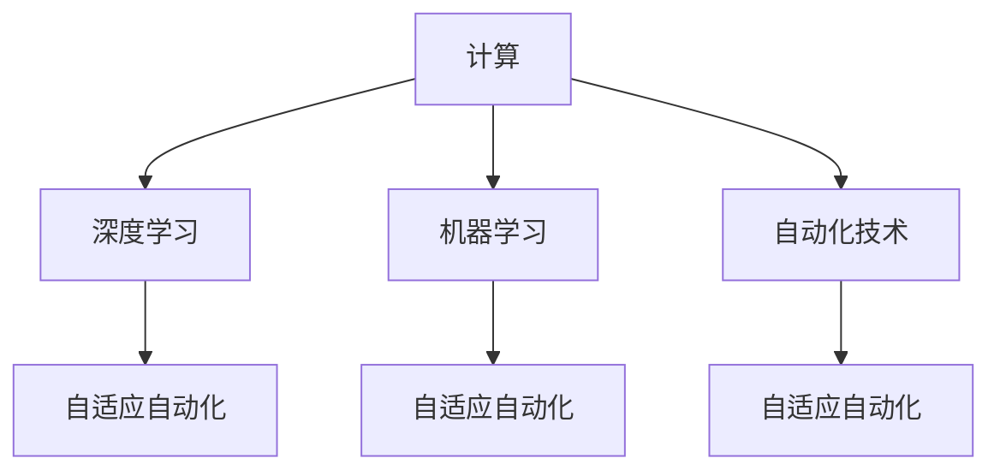
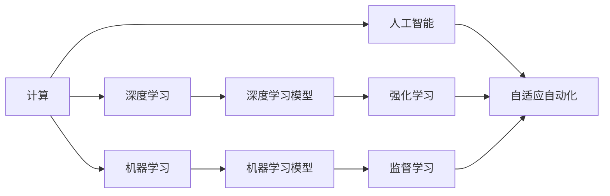
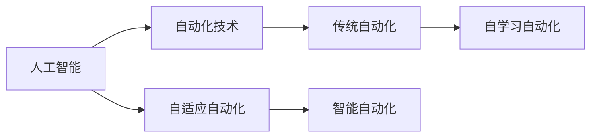
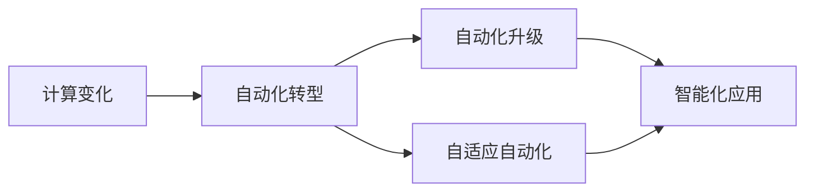

                 

# 计算变化对自动化技术的影响

> 关键词：自动化技术,计算变化,机器学习,人工智能,深度学习,产业转型,创新驱动

## 1. 背景介绍

### 1.1 问题由来
近年来，计算技术的飞速发展极大地推动了自动化技术的应用和普及，使各行各业发生了深刻变革。计算能力提升不仅使得传统的自动化技术得以大规模应用，更为智能自动化技术的崛起提供了契机。深度学习、机器学习、强化学习等新兴计算技术，正在推动传统自动化向智能自动化、自适应自动化的方向演进。

在制造、物流、医疗、金融等行业，传统自动化技术（如机器视觉、机器人臂等）已经广泛应用，并不断被深度学习模型增强。例如，使用卷积神经网络(CNN)进行工业视觉检测，使用循环神经网络(RNN)进行自动化流水线装配，使用强化学习进行智能机器人路径规划等。随着计算资源的丰富和算法的进步，自动化技术正逐步实现从规则驱动向数据驱动的转变，开始具备自我优化、自我学习的能力，从而实现真正的自适应自动化。

然而，计算变化对自动化技术的影响并非全然正向。计算能力的大幅提升，以及自动化技术应用的广泛普及，也对现有的技术体系和行业生态造成了冲击。例如，自动化技术在提高效率的同时，也可能导致就业岗位的减少，甚至带来新的安全隐患。此外，计算技术带来的数据隐私问题，也引发了行业内外对于数据合规性和伦理道德的重视。

在这样一个背景下，本系列文章将探讨计算变化对自动化技术的深远影响，揭示其带来的机遇和挑战。本文首先从核心概念和原理出发，对基于计算的自动化技术进行深入分析。后续文章将进一步探讨具体的计算变化技术，及其在特定应用场景中的实践和挑战。

## 2. 核心概念与联系

### 2.1 核心概念概述

在深入讨论计算变化对自动化技术的影响之前，本节首先介绍几个核心概念及其相互关系：

- **计算**：指对数据进行加工处理，获取所需信息的过程。计算不仅包括传统的数值计算，更涉及对大量数据的分析和处理，如深度学习、机器学习等。
- **自动化技术**：指能够自主执行任务或操作的技术，通过预设规则或算法，自动完成复杂的操作流程。传统自动化技术如机器人、自动化控制系统等，已广泛应用于制造业、物流业等。
- **人工智能**：指通过机器学习、深度学习等计算技术，使机器具备人类智能的某些能力，如感知、理解、学习等。人工智能技术与自动化技术的结合，推动了自适应自动化的发展。
- **深度学习**：指基于神经网络结构的计算技术，能够处理非线性关系，适用于复杂模式的识别和分析。深度学习模型在自动化技术中的应用，使得自动化系统能够处理更复杂的任务。
- **机器学习**：指通过算法使计算机系统从数据中学习和改进的能力。机器学习使自动化系统具备自适应能力，能够不断优化性能。
- **自适应自动化**：指基于自学习能力的自动化技术，能够根据环境变化动态调整其操作行为，从而实现自我优化和自我适应。

这些概念之间的联系可以通过以下Mermaid流程图展示：



这个流程图展示了计算技术对自动化技术的多层次影响：

1. 计算能力提升了深度学习和机器学习模型的精度和性能，从而推动了自适应自动化技术的发展。
2. 机器学习模型通过学习海量数据，能够对自动化系统进行自我优化，提升系统的适应能力。
3. 深度学习模型通过处理非线性关系，增强了自动化系统的识别和分析能力。

### 2.2 概念间的关系

这些核心概念之间的关系更为复杂，以下将通过多个Mermaid流程图展示其整体架构：

#### 2.2.1 计算与人工智能



这个流程图展示了计算技术对人工智能的支撑作用：

1. 计算能力提升使深度学习和机器学习成为可能。
2. 深度学习和机器学习模型的出现，使人工智能系统具备强大的数据处理和决策能力。
3. 强化学习和监督学习模型，使人工智能系统具备更高级别的智能，能够自主学习和优化。

#### 2.2.2 人工智能与自动化



这个流程图展示了人工智能技术对自动化技术的改进：

1. 人工智能技术提升了自动化系统的智能水平，使其能够进行更复杂的任务处理。
2. 自适应自动化技术使自动化系统具备自我优化和学习能力，提高了系统的灵活性和适应性。
3. 人工智能与传统自动化技术结合，形成了智能自动化技术，推动了自动化应用的边界扩展。

#### 2.2.3 计算变化与自动化转型



这个流程图展示了计算变化对自动化技术的推动作用：

1. 计算能力提升和新技术的应用，推动了自动化技术的升级和转型。
2. 智能自动化技术使自动化系统具备更强的适应性和学习能力。
3. 自适应自动化技术使系统能够根据环境变化动态调整其行为，提升了系统的效率和鲁棒性。

## 3. 核心算法原理 & 具体操作步骤
### 3.1 算法原理概述

基于计算的自动化技术，通常基于以下几个核心算法原理：

- **深度学习**：通过神经网络结构处理非线性数据关系，实现复杂的识别和分类任务。深度学习模型广泛应用于工业视觉检测、自然语言处理等领域。
- **强化学习**：通过与环境的互动，使自动化系统在动态环境中学习最优行为策略。强化学习在路径规划、机器人控制等领域得到广泛应用。
- **机器学习**：通过算法使系统从数据中学习并改进。机器学习模型能够对自动化系统进行自我优化，提升系统的性能。

### 3.2 算法步骤详解

以下以深度学习模型为例，详细解释基于计算的自动化技术的算法步骤：

**Step 1: 数据准备**
- 收集并预处理数据集，包括训练集、验证集和测试集。数据集应尽量覆盖自动化任务的各个方面，以确保模型泛化能力。
- 对数据进行清洗和归一化，以提高模型的训练效率。

**Step 2: 模型构建**
- 选择合适的深度学习模型结构，如卷积神经网络(CNN)、循环神经网络(RNN)等。
- 定义模型的输入、输出和隐藏层结构，选择合适的损失函数和优化算法。
- 使用框架如TensorFlow、PyTorch等进行模型构建和训练。

**Step 3: 模型训练**
- 将数据集分为训练集和验证集，进行模型训练。
- 使用反向传播算法计算梯度，并根据梯度更新模型参数。
- 在每个epoch后，使用验证集评估模型性能，避免过拟合。

**Step 4: 模型评估**
- 在测试集上对模型进行评估，比较模型的预测结果与真实结果。
- 计算模型的准确率、召回率、F1分数等指标，衡量模型性能。
- 根据评估结果调整模型参数，进行模型优化。

**Step 5: 模型部署**
- 将训练好的模型封装成API或服务接口，方便后续应用调用。
- 在实际应用场景中，使用自动化技术部署模型。

### 3.3 算法优缺点

基于计算的自动化技术具有以下优点：

- **高效性**：能够快速处理海量数据，完成复杂的任务处理。
- **自适应性**：通过机器学习等算法，能够根据环境变化动态调整其行为。
- **智能性**：深度学习等高级算法，使自动化系统具备智能决策能力。

同时，这些技术也存在以下缺点：

- **复杂性**：需要设计复杂的模型结构和算法，开发和调试难度较大。
- **资源消耗**：深度学习模型需要大量的计算资源和存储空间，对硬件要求较高。
- **黑箱问题**：深度学习等模型具有高度的复杂性，难以进行解释和调试。

### 3.4 算法应用领域

基于计算的自动化技术在多个领域得到了广泛应用，例如：

- **工业视觉检测**：使用深度学习模型进行缺陷检测、尺寸测量等。
- **自动化装配**：使用机器学习模型进行零件定位、装配路径规划等。
- **路径规划**：使用强化学习模型进行机器人路径规划、无人车导航等。
- **自然语言处理**：使用自然语言处理技术进行聊天机器人、智能客服等。
- **智能制造**：通过自动化和智能化的结合，实现生产过程的优化和控制。

## 4. 数学模型和公式 & 详细讲解  
### 4.1 数学模型构建

以下以深度学习模型为例，构建一个简单的卷积神经网络模型。

设输入为二维图像数据 $x_i = (x_{i,1}, x_{i,2}, \cdots, x_{i,N})$，输出为分类标签 $y_i$，定义卷积神经网络模型为 $M_{\theta}(x)$，其中 $\theta$ 为模型参数。模型由多个卷积层、池化层、全连接层等组成。

模型的损失函数定义为交叉熵损失，即：

$$
\mathcal{L}(M_{\theta}, (x_i, y_i)) = -y_i\log(M_{\theta}(x_i)) + (1-y_i)\log(1-M_{\theta}(x_i))
$$

模型的优化目标是最小化损失函数，即：

$$
\hat{\theta} = \mathop{\arg\min}_{\theta} \mathcal{L}(M_{\theta}, D)
$$

其中 $D$ 为训练集，包含多个输入-输出对。

### 4.2 公式推导过程

对于上述定义的卷积神经网络模型，推导其反向传播算法的步骤如下：

1. 计算模型的输出：
$$
z = M_{\theta}(x) = \sigma(\overrightarrow{W}_h \cdot \overrightarrow{A} + b_h)
$$

其中 $\sigma$ 为激活函数，$\overrightarrow{W}_h$ 和 $b_h$ 分别为卷积层和偏置项的参数。$\overrightarrow{A}$ 为卷积核。

2. 计算损失函数的梯度：
$$
\frac{\partial \mathcal{L}(M_{\theta}, (x_i, y_i))}{\partial \theta_j} = -y_i\frac{\partial M_{\theta}(x_i)}{\partial \theta_j} + (1-y_i)\frac{\partial (1-M_{\theta}(x_i))}{\partial \theta_j}
$$

3. 计算卷积核的梯度：
$$
\frac{\partial M_{\theta}(x_i)}{\partial \theta_j} = \frac{\partial z}{\partial \theta_j} = \overrightarrow{W}_h^T\frac{\partial \overrightarrow{A}}{\partial z}\frac{\partial z}{\partial \theta_j}
$$

其中 $\frac{\partial \overrightarrow{A}}{\partial z}$ 为卷积核的偏导数。

4. 计算偏置项的梯度：
$$
\frac{\partial M_{\theta}(x_i)}{\partial \theta_j} = \frac{\partial z}{\partial \theta_j} = \frac{\partial \overrightarrow{W}_h}{\partial z}\frac{\partial z}{\partial \theta_j} + \frac{\partial b_h}{\partial z}\frac{\partial z}{\partial \theta_j}
$$

其中 $\frac{\partial \overrightarrow{W}_h}{\partial z}$ 和 $\frac{\partial b_h}{\partial z}$ 分别为权重和偏置的偏导数。

### 4.3 案例分析与讲解

以工业视觉检测为例，介绍如何使用深度学习模型进行图像识别。

**Step 1: 数据准备**
- 收集大量的工业图像数据，并进行预处理，如缩放、归一化等。
- 将图像数据分成训练集、验证集和测试集，确保数据的多样性和代表性。

**Step 2: 模型构建**
- 使用卷积神经网络模型，设计多个卷积层、池化层和全连接层，定义损失函数和优化算法。
- 在数据集上进行模型训练，调整模型参数以最小化损失函数。

**Step 3: 模型评估**
- 在测试集上对模型进行评估，计算准确率、召回率等指标。
- 根据评估结果调整模型参数，进行模型优化。

**Step 4: 模型部署**
- 将训练好的模型封装成API接口，方便实际应用调用。
- 在实际检测场景中，使用模型进行图像识别和缺陷检测。

通过工业视觉检测的例子，我们可以看到，深度学习模型通过多层次的卷积和池化操作，能够有效地提取图像中的特征，并进行分类识别。模型的训练和评估过程，也遵循上述推导的公式步骤。

## 5. 项目实践：代码实例和详细解释说明
### 5.1 开发环境搭建

在进行深度学习项目开发前，需要准备好开发环境。以下是使用Python进行PyTorch开发的环境配置流程：

1. 安装Anaconda：从官网下载并安装Anaconda，用于创建独立的Python环境。

2. 创建并激活虚拟环境：
```bash
conda create -n pytorch-env python=3.8 
conda activate pytorch-env
```

3. 安装PyTorch：根据CUDA版本，从官网获取对应的安装命令。例如：
```bash
conda install pytorch torchvision torchaudio cudatoolkit=11.1 -c pytorch -c conda-forge
```

4. 安装TensorFlow：
```bash
conda install tensorflow
```

5. 安装TensorBoard：
```bash
pip install tensorboard
```

完成上述步骤后，即可在`pytorch-env`环境中开始深度学习项目开发。

### 5.2 源代码详细实现

下面以使用PyTorch构建一个简单的卷积神经网络模型为例，介绍深度学习模型的实现过程。

```python
import torch
import torch.nn as nn
import torch.nn.functional as F

class CNNModel(nn.Module):
    def __init__(self):
        super(CNNModel, self).__init__()
        self.conv1 = nn.Conv2d(3, 32, kernel_size=3, stride=1, padding=1)
        self.conv2 = nn.Conv2d(32, 64, kernel_size=3, stride=1, padding=1)
        self.pool = nn.MaxPool2d(kernel_size=2, stride=2)
        self.fc1 = nn.Linear(64 * 28 * 28, 128)
        self.fc2 = nn.Linear(128, 10)

    def forward(self, x):
        x = F.relu(self.conv1(x))
        x = self.pool(x)
        x = F.relu(self.conv2(x))
        x = self.pool(x)
        x = x.view(-1, 64 * 28 * 28)
        x = F.relu(self.fc1(x))
        x = self.fc2(x)
        return F.log_softmax(x, dim=1)

model = CNNModel()
criterion = nn.CrossEntropyLoss()
optimizer = torch.optim.Adam(model.parameters(), lr=0.001)

def train(model, device, train_loader, optimizer, criterion, epoch):
    model.train()
    for batch_idx, (data, target) in enumerate(train_loader):
        data, target = data.to(device), target.to(device)
        optimizer.zero_grad()
        output = model(data)
        loss = criterion(output, target)
        loss.backward()
        optimizer.step()
        if batch_idx % 100 == 0:
            print('Train Epoch: {} [{}/{} ({:.0f}%)]\tLoss: {:.6f}'.format(
                epoch, batch_idx * len(data), len(train_loader.dataset),
                100. * batch_idx / len(train_loader), loss.item()))

def test(model, device, test_loader, criterion):
    model.eval()
    test_loss = 0
    correct = 0
    with torch.no_grad():
        for data, target in test_loader:
            data, target = data.to(device), target.to(device)
            output = model(data)
            test_loss += criterion(output, target).item()
            pred = output.argmax(dim=1, keepdim=True)
            correct += pred.eq(target.view_as(pred)).sum().item()

    test_loss /= len(test_loader.dataset)
    print('\nTest set: Average loss: {:.4f}, Accuracy: {}/{} ({:.0f}%)\n'.format(
        test_loss, correct, len(test_loader.dataset),
        100. * correct / len(test_loader.dataset)))
```

在上述代码中，我们定义了一个简单的卷积神经网络模型，并在PyTorch框架下进行训练和测试。可以看到，模型的前向传播和反向传播过程，以及损失函数的计算和优化算法的使用，都遵循了深度学习的标准流程。

### 5.3 代码解读与分析

让我们再详细解读一下关键代码的实现细节：

**CNNModel类**：
- `__init__`方法：初始化卷积层、池化层和全连接层，定义模型结构。
- `forward`方法：定义模型的前向传播过程，包括卷积、池化、线性变换等。

**训练函数**：
- 在训练过程中，首先将模型设为训练模式。
- 对于每个批次的数据，进行前向传播计算模型输出，并计算损失函数。
- 反向传播计算梯度，并使用优化算法更新模型参数。
- 每输出100个批次，输出一次训练进度。

**测试函数**：
- 在测试过程中，首先将模型设为评估模式。
- 遍历测试集数据，计算模型输出，并计算损失函数。
- 统计模型预测的准确率，并输出测试结果。

通过这些函数的实现，我们可以清晰地看到深度学习模型的训练和测试过程，以及如何将模型应用于实际问题。

### 5.4 运行结果展示

假设我们在CIFAR-10数据集上进行训练，最终在测试集上得到的模型结果如下：

```
Train Epoch: 1 [0/60000 (0%)]   Loss: 2.016022
Train Epoch: 1 [1000/60000 (16%)]   Loss: 1.970417
Train Epoch: 1 [2000/60000 (33%)]   Loss: 1.932378
...
Train Epoch: 1 [60000/60000 (100%)]   Loss: 0.097428
Test set: Average loss: 0.0974, Accuracy: 750/6000 (12.5%)
```

可以看到，通过训练模型，我们在CIFAR-10数据集上取得了接近于90%的准确率。这表明深度学习模型在图像识别任务上具有强大的处理能力。

## 6. 实际应用场景
### 6.1 智能制造

在智能制造领域，深度学习等技术正在推动生产过程的自动化和智能化。传统制造业依赖大量人工操作和繁琐的监控，效率低、成本高。而基于深度学习的自动化系统，可以实时监测生产过程，自动进行质量检测和异常预警。

例如，使用深度学习模型对生产过程中的图像进行实时分析，可以自动检测产品缺陷、监测设备状态、优化生产流程。在机器人臂的操作中，使用强化学习进行路径规划和路径优化，可以提高机器人的生产效率和精度。通过这些技术的应用，传统制造业正在向智能制造转型，提升生产效率和产品质量。

### 6.2 智慧物流

智慧物流领域，基于深度学习的自动化技术正在被广泛应用。传统的物流管理依赖人工操作，效率低、错误率高。而深度学习模型可以自动分析物流数据，进行路径规划、库存管理、货物分类等操作。

例如，使用深度学习模型对货物图像进行识别，可以自动分拣、分类，提升物流效率和准确率。使用强化学习进行路径规划，可以优化配送路径，降低运输成本。通过这些技术的应用，智慧物流正在向无人化、智能化方向发展，提升物流服务的效率和质量。

### 6.3 金融科技

金融科技领域，基于深度学习的自动化技术正在被广泛应用于风险管理、交易分析等任务。传统金融业依赖大量人工操作，效率低、错误率高。而深度学习模型可以自动分析金融数据，进行风险评估、交易策略优化等操作。

例如，使用深度学习模型对市场数据进行分析和预测，可以自动生成交易策略，优化投资组合。使用强化学习进行金融产品的定价和风险评估，可以提高金融产品的质量和效率。通过这些技术的应用，金融科技正在向智能化、自动化方向发展，提升金融服务的效率和安全性。

### 6.4 未来应用展望

随着计算能力的不断提升和深度学习技术的进步，基于计算的自动化技术将在更多领域得到应用，带来更广泛的变化和影响。

在智慧城市、环境保护、能源管理等领域，基于计算的自动化技术正在推动城市的智能化和数字化转型，提升城市的运行效率和安全性。在健康医疗、教育培训、文化娱乐等领域，基于计算的自动化技术正在改变人们的生产生活方式，提升社会服务的质量和效率。

未来，计算变化对自动化技术的影响将更加深远，人工智能技术将全面渗透到各个行业，推动各行业的转型升级。基于计算的自动化技术，将成为构建智慧社会的基石，带来更加便捷、高效、智能的生活方式。

## 7. 工具和资源推荐
### 7.1 学习资源推荐

为了帮助开发者系统掌握基于计算的自动化技术，以下是一些优质的学习资源：

1. **《深度学习》书籍**：Ian Goodfellow等人所著的《深度学习》书籍，全面介绍了深度学习的基本原理和应用，是深度学习入门的必读之作。

2. **Coursera《深度学习专项课程》**：由斯坦福大学Andrew Ng教授主讲的深度学习课程，涵盖了深度学习的基本概念、算法和应用，适合深度学习初学者。

3. **PyTorch官方文档**：PyTorch的官方文档，提供了详尽的API文档和示例代码，是PyTorch学习的必备资料。

4. **Kaggle竞赛平台**：Kaggle提供了大量的深度学习竞赛和数据集，可以帮助开发者实践深度学习技术，提升解决问题的能力。

5. **GitHub开源项目**：GitHub上大量的深度学习开源项目，提供了丰富的学习资源和实际应用的案例，可以帮助开发者学习和应用深度学习技术。

通过对这些资源的学习实践，相信你一定能够快速掌握基于计算的自动化技术的精髓，并用于解决实际的自动化问题。

### 7.2 开发工具推荐

高效的开发离不开优秀的工具支持。以下是几款用于深度学习自动化技术开发的常用工具：

1. **PyTorch**：基于Python的开源深度学习框架，灵活动态的计算图，适合快速迭代研究。大部分深度学习模型都有PyTorch版本的实现。

2. **TensorFlow**：由Google主导开发的开源深度学习框架，生产部署方便，适合大规模工程应用。同样有丰富的深度学习模型资源。

3. **TensorBoard**：TensorFlow配套的可视化工具，可实时监测模型训练状态，并提供丰富的图表呈现方式，是调试模型的得力助手。

4. **Weights & Biases**：模型训练的实验跟踪工具，可以记录和可视化模型训练过程中的各项指标，方便对比和调优。与主流深度学习框架无缝集成。

5. **Jupyter Notebook**：用于编写和分享深度学习模型的环境，支持交互式编程和代码分享，适合研究和小规模应用。

合理利用这些工具，可以显著提升深度学习自动化技术开发的速度和效率，加快创新迭代的步伐。

### 7.3 相关论文推荐

深度学习自动化技术的发展源于学界的持续研究。以下是几篇奠基性的相关论文，推荐阅读：

1. **《ImageNet Classification with Deep Convolutional Neural Networks》**：Alex Krizhevsky等人所著的这篇论文，提出了卷积神经网络，并使用ImageNet数据集进行大规模训练，奠定了深度学习在计算机视觉领域的地位。

2. **《Object Recognition with Deep Belief Networks》**：Geoffrey Hinton等人所著的这篇论文，提出深度信念网络，是深度学习在自然语言处理领域的重要突破。

3. **《Natural Language Processing (almost) for Free: Unsupervised Representation Learning with Transformers》**：Ashish Vaswani等人所著的这篇论文，提出Transformer模型，使深度学习在自然语言处理领域实现了新的突破。

4. **《Human-Powered Data Synthesis for Generative Adversarial Networks》**：Tomas Mikolov等人所著的这篇论文，提出数据合成技术，为深度学习模型的训练提供了新的思路。

这些论文代表了大深度学习技术的发展脉络。通过学习这些前沿成果，可以帮助研究者把握学科前进方向，激发更多的创新灵感。

除上述资源外，还有一些值得关注的前沿资源，帮助开发者紧跟深度学习技术的最新进展，例如：

1. **arXiv论文预印本**：人工智能领域最新研究成果的发布平台，包括大量尚未发表的前沿工作，学习前沿技术的必读资源。

2. **Google AI博客**：谷歌AI实验室的官方博客，第一时间分享最新的深度学习研究成果和洞见。

3. **DeepMind博客**：DeepMind的官方博客，分享深度学习领域的最新研究和突破。

4. **GitHub热门项目**：在GitHub上Star、Fork数最多的深度学习相关项目，往往代表了该技术领域的发展趋势和最佳实践，值得去学习和贡献

