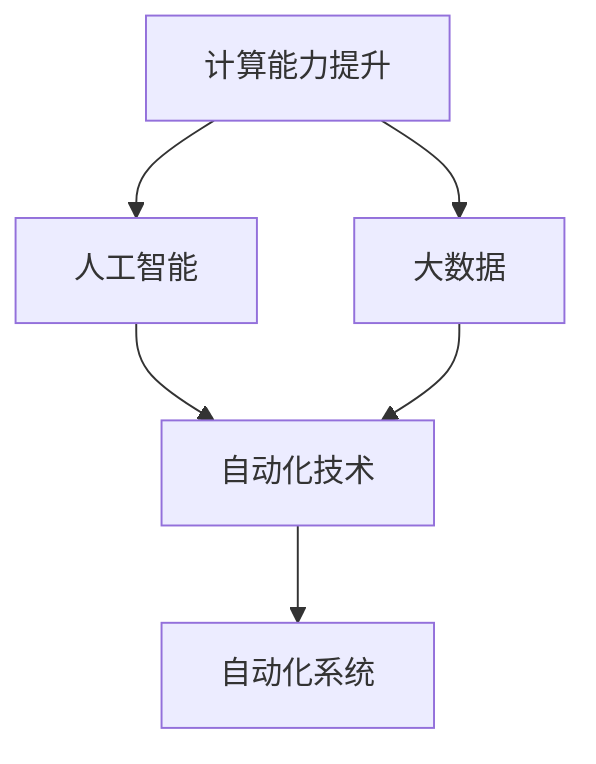
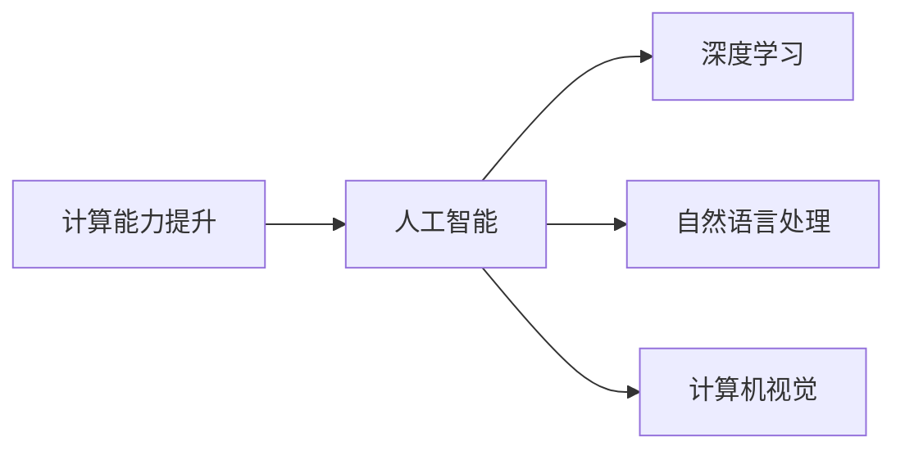
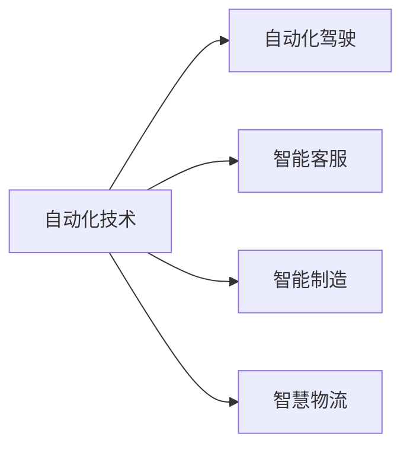
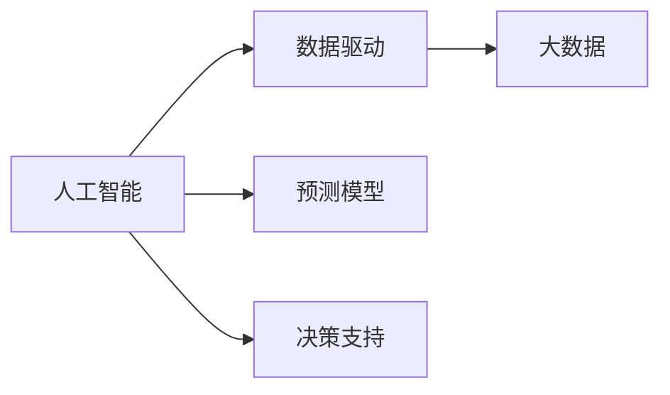
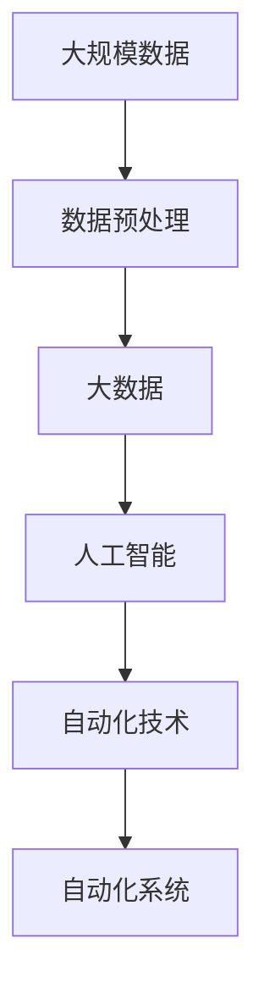

                 

# 计算变化带来的自动化新机遇

在当前信息时代，计算能力的提升、数据量的爆炸性增长以及算法技术的革新，正在深刻改变着各行各业的运营模式。人工智能、大数据、云计算等技术，正在推动各行各业走向智能化和自动化，带来前所未有的自动化新机遇。本文将详细探讨这些变化，分析计算能力提升带来的自动化新机遇，并提供相关的技术方案和资源推荐，帮助读者更好地把握新机遇，推动行业发展。

## 1. 背景介绍

### 1.1 问题由来

随着计算能力的提升和数据量的爆炸性增长，各行各业对数据处理、决策支持、客户服务、生产流程等领域的自动化需求日益增强。人工智能、大数据、云计算等技术的应用，使得自动化成为可能，并且成本也在逐渐降低。例如，自动化驾驶、智能客服、智能制造、智慧物流等领域，都在借助计算能力提升带来的自动化新机遇，实现生产效率和运营效率的飞跃。

### 1.2 问题核心关键点

计算能力提升带来的自动化新机遇主要包括以下几个方面：

- 计算能力的提升，使得机器能够处理更加复杂的数据，实现更加复杂的算法模型。
- 数据量的爆炸性增长，为机器提供了更加丰富的数据源，提高了机器的预测和决策能力。
- 算法的不断革新，使得机器能够更好地理解和处理自然语言、图像、视频等多模态数据，实现跨领域的自动化应用。
- 自动化技术的应用，减少了人工操作，提高了生产效率，降低了运营成本，增强了企业竞争力。

这些变化不仅在技术层面带来了新的可能性，也在商业模式、用户体验、行业生态等方面带来了深远的影响。

### 1.3 问题研究意义

研究计算能力提升带来的自动化新机遇，对于推动各行各业的智能化转型，提升企业的运营效率和竞争力，具有重要意义：

- 降低运营成本。通过自动化技术替代人工操作，减少了人工成本，提高了生产效率。
- 提升决策质量。通过智能决策支持系统，提高了决策的准确性和效率。
- 改善用户体验。通过自动化客服、智能推荐等应用，提升了用户的体验和满意度。
- 创造新的商业模式。基于自动化技术的创新应用，可以催生新的商业模式，带来新的商业机会。
- 推动行业生态发展。自动化技术的发展，推动了相关产业的发展，如云计算、大数据、人工智能等。

## 2. 核心概念与联系

### 2.1 核心概念概述

为更好地理解计算能力提升带来的自动化新机遇，本节将介绍几个密切相关的核心概念：

- **计算能力提升**：指随着硬件设备的不断进步，计算能力得到显著提升，能够处理更加复杂的数据和算法。
- **自动化技术**：通过算法、软件、硬件等技术手段，实现自动化操作，减少人工干预，提高效率和质量。
- **人工智能**：利用机器学习、深度学习等算法，实现智能决策、自然语言处理、计算机视觉等能力。
- **大数据**：通过数据收集、存储、处理等技术，实现数据驱动的决策支持。
- **云计算**：通过分布式计算、弹性计算等技术，实现计算资源的按需使用和灵活调度。
- **自动化系统**：包括自动化驾驶、智能客服、智能制造、智慧物流等应用，涵盖多个行业领域。

这些核心概念之间的逻辑关系可以通过以下Mermaid流程图来展示：



这个流程图展示了计算能力提升、人工智能、大数据与自动化技术的相互关系。其中，计算能力的提升为人工智能和大数据提供了技术基础，而人工智能和大数据则推动了自动化技术的发展，最终应用于各种自动化系统中。

### 2.2 概念间的关系

这些核心概念之间存在着紧密的联系，形成了自动化技术的发展框架。下面我通过几个Mermaid流程图来展示这些概念之间的关系。

#### 2.2.1 计算能力提升与人工智能的关系



这个流程图展示了计算能力提升如何为人工智能提供了技术支撑，使得深度学习、自然语言处理、计算机视觉等技术得以实现和发展。

#### 2.2.2 自动化技术与应用的关系



这个流程图展示了自动化技术在不同行业领域中的应用，包括自动化驾驶、智能客服、智能制造、智慧物流等，推动了各行业的发展和变革。

#### 2.2.3 人工智能与大数据的关系



这个流程图展示了人工智能如何通过大数据技术实现预测和决策，推动了各行业的智能化发展。

### 2.3 核心概念的整体架构

最后，我们用一个综合的流程图来展示这些核心概念在大规模自动化系统中的整体架构：



这个综合流程图展示了从大规模数据到自动化系统的整个流程，计算能力的提升和大数据技术的支持，为人工智能提供了技术基础，而人工智能又推动了自动化技术的发展，最终应用于各种自动化系统中。

## 3. 核心算法原理 & 具体操作步骤

### 3.1 算法原理概述

计算能力提升带来的自动化新机遇，主要体现在以下几个方面：

- **深度学习模型**：通过计算能力的提升，深度学习模型可以处理更加复杂的数据，实现更加精确的预测和决策。
- **自然语言处理(NLP)**：通过计算能力的提升，NLP技术可以处理更加复杂的自然语言数据，实现自然语言理解和生成。
- **计算机视觉**：通过计算能力的提升，计算机视觉技术可以处理更加复杂的图像和视频数据，实现图像识别和生成。
- **自动化流程优化**：通过计算能力的提升，可以对自动化流程进行优化，提高效率和质量。
- **预测和决策支持**：通过计算能力的提升，可以实现更加精确的预测和决策支持，提高运营效率。

### 3.2 算法步骤详解

基于计算能力提升带来的自动化新机遇，通常包括以下几个关键步骤：

1. **数据收集和预处理**：从不同渠道收集数据，并进行清洗和预处理，以便进行后续的分析和建模。
2. **模型选择和训练**：选择合适的深度学习模型，并在大规模数据上进行训练，优化模型参数。
3. **模型部署和应用**：将训练好的模型部署到实际应用环境中，进行自动化流程优化和预测决策支持。
4. **监测和优化**：实时监测模型性能，根据实际情况进行模型优化和调整，提高自动化系统的准确性和效率。

### 3.3 算法优缺点

计算能力提升带来的自动化新机遇，主要具有以下优点：

- **处理复杂数据**：通过计算能力的提升，可以处理更加复杂的数据，实现更加精确的预测和决策。
- **提高效率**：通过自动化流程优化和预测决策支持，可以大幅提高生产效率和运营效率。
- **降低成本**：通过自动化替代人工操作，降低了人力成本，提高了企业竞争力。

同时，计算能力提升带来的自动化新机遇也存在一些缺点：

- **高昂的计算成本**：大规模数据和复杂模型的训练需要高昂的计算资源，成本较高。
- **模型复杂性**：复杂的深度学习模型需要大量数据和计算资源，模型训练和部署较为复杂。
- **数据质量要求高**：数据质量直接影响模型的性能，需要高质量的数据源和预处理技术。
- **系统复杂性**：自动化系统涉及多个技术环节，系统设计和实现较为复杂。

### 3.4 算法应用领域

计算能力提升带来的自动化新机遇，在以下几个领域具有广泛的应用：

- **智能制造**：通过自动化驾驶、智能制造、智慧物流等技术，推动制造业智能化发展。
- **医疗健康**：通过智能诊断、智能推荐等技术，提升医疗服务质量和效率。
- **金融服务**：通过智能客服、智能风控等技术，提升金融服务体验和风险管理能力。
- **交通运输**：通过自动化驾驶、智能调度等技术，推动交通运输智能化发展。
- **智能客服**：通过自动化客服、智能推荐等技术，提升客户服务体验和效率。

## 4. 数学模型和公式 & 详细讲解 & 举例说明

### 4.1 数学模型构建

在大规模自动化系统中，计算能力提升带来的自动化新机遇，可以通过数学模型进行量化和优化。以下是一些常见数学模型的构建：

- **深度学习模型**：通过多层神经网络，实现数据处理和特征提取。模型的输出为预测结果，模型训练的目标是最小化损失函数。

- **预测模型**：基于历史数据，构建预测模型，实现未来预测。常用的预测模型包括线性回归、支持向量机、随机森林等。

- **优化模型**：通过优化算法，实现自动化流程优化。常用的优化算法包括梯度下降、遗传算法、粒子群算法等。

- **决策模型**：基于决策树、贝叶斯网络等模型，实现决策支持。常用的决策模型包括决策树、朴素贝叶斯、最大熵等。

- **推荐系统**：通过协同过滤、矩阵分解等技术，实现智能推荐。常用的推荐系统包括基于用户的推荐、基于物品的推荐等。

### 4.2 公式推导过程

以下是几个常见数学模型的公式推导过程：

#### 4.2.1 线性回归模型

线性回归模型的公式如下：

$$
y = \beta_0 + \beta_1x_1 + \beta_2x_2 + \ldots + \beta_nx_n + \epsilon
$$

其中，$y$为预测结果，$x_i$为输入特征，$\beta_i$为模型参数，$\epsilon$为误差项。

#### 4.2.2 梯度下降算法

梯度下降算法的公式如下：

$$
\theta_j := \theta_j - \eta \frac{\partial}{\partial \theta_j}J(\theta)
$$

其中，$\theta_j$为模型参数，$\eta$为学习率，$J(\theta)$为损失函数，$\partial J(\theta)/\partial \theta_j$为梯度。

#### 4.2.3 决策树模型

决策树的公式如下：

$$
\begin{cases}
  f(x) = 0 & \text{if}\ x < \frac{\partial}{\partial \theta_j}J(\theta) \\
  f(x) = 1 & \text{if}\ x \geq \frac{\partial}{\partial \theta_j}J(\theta)
\end{cases}
$$

其中，$f(x)$为决策函数，$\partial J(\theta)/\partial \theta_j$为梯度。

### 4.3 案例分析与讲解

#### 4.3.1 线性回归模型

线性回归模型可以应用于智能制造中的预测性维护。例如，通过对设备运行数据的监测，构建线性回归模型，预测设备的故障概率和维护周期，从而实现设备的主动维护，提高设备的可靠性和利用率。

#### 4.3.2 梯度下降算法

梯度下降算法可以应用于智能客服中的用户情感分析。例如，通过收集用户反馈数据，构建情感分析模型，使用梯度下降算法优化模型参数，从而实现对用户情感的实时分析和预测，提升客户服务体验。

#### 4.3.3 决策树模型

决策树模型可以应用于金融服务中的信用评估。例如，通过收集用户历史数据，构建决策树模型，预测用户的信用风险等级，从而实现智能风控，提高金融服务的安全性和效率。

## 5. 项目实践：代码实例和详细解释说明

### 5.1 开发环境搭建

在进行计算能力提升带来的自动化新机遇实践前，我们需要准备好开发环境。以下是使用Python进行TensorFlow开发的环境配置流程：

1. 安装Anaconda：从官网下载并安装Anaconda，用于创建独立的Python环境。

2. 创建并激活虚拟环境：
```bash
conda create -n tf-env python=3.8 
conda activate tf-env
```

3. 安装TensorFlow：根据CUDA版本，从官网获取对应的安装命令。例如：
```bash
conda install tensorflow=2.6 -c conda-forge -c nvidia
```

4. 安装Pandas、Numpy、Matplotlib等工具包：
```bash
pip install pandas numpy matplotlib scikit-learn tensorflow
```

完成上述步骤后，即可在`tf-env`环境中开始计算能力提升带来的自动化新机遇实践。

### 5.2 源代码详细实现

这里我们以智能制造中的预测性维护为例，给出使用TensorFlow进行线性回归模型的PyTorch代码实现。

首先，定义数据集和模型：

```python
import pandas as pd
import numpy as np
import tensorflow as tf

# 定义数据集
data = pd.read_csv('device_data.csv')
X = data[['temperature', 'humidity', 'vibration']].to_numpy().reshape(-1, 3)
y = data['fault'].to_numpy().reshape(-1, 1)

# 定义模型
model = tf.keras.models.Sequential([
    tf.keras.layers.Dense(10, activation='relu', input_shape=(3,)),
    tf.keras.layers.Dense(1, activation='sigmoid')
])

# 定义优化器和损失函数
optimizer = tf.keras.optimizers.Adam(learning_rate=0.01)
loss_fn = tf.keras.losses.BinaryCrossentropy()

# 编译模型
model.compile(optimizer=optimizer, loss=loss_fn, metrics=['accuracy'])
```

然后，进行模型训练和预测：

```python
# 训练模型
model.fit(X, y, epochs=50, batch_size=32)

# 预测故障概率
test_data = pd.read_csv('test_data.csv')[['temperature', 'humidity', 'vibration']].to_numpy().reshape(-1, 3)
pred_probs = model.predict(test_data)
pred_labels = (pred_probs > 0.5).astype(int)
```

最后，评估模型性能：

```python
# 评估模型
test_y = pd.read_csv('test_data.csv')['fault'].to_numpy().reshape(-1, 1)
print('Test Accuracy:', model.evaluate(X, y, verbose=0)[1])
print('Test Predictions:', pred_labels)
print('Test Labels:', test_y)
```

以上就是使用TensorFlow进行线性回归模型预测性维护的完整代码实现。可以看到，TensorFlow提供的高级API使得模型构建和训练过程变得简单高效。

### 5.3 代码解读与分析

让我们再详细解读一下关键代码的实现细节：

**数据集定义**：
- `pd.read_csv`方法：用于读取CSV格式的数据文件，将数据转换为Pandas DataFrame。
- `X.to_numpy()`和`y.to_numpy()`方法：将DataFrame转换为NumPy数组，用于模型输入和输出。

**模型定义**：
- `tf.keras.models.Sequential`：用于定义多层神经网络模型。
- `tf.keras.layers.Dense`：定义全连接层，实现数据的处理和特征提取。

**优化器和损失函数**：
- `tf.keras.optimizers.Adam`：定义优化算法，用于模型参数的更新。
- `tf.keras.losses.BinaryCrossentropy`：定义损失函数，用于模型性能的评估。

**模型训练和预测**：
- `model.fit`方法：用于训练模型，设定训练轮数和批大小。
- `model.predict`方法：用于模型预测，得到故障概率。

**模型评估**：
- `model.evaluate`方法：用于评估模型性能，得到测试集上的准确率。

可以看到，TensorFlow提供了丰富的API和工具，使得模型构建、训练和评估过程变得简单高效。

当然，工业级的系统实现还需考虑更多因素，如模型的保存和部署、超参数的自动搜索、更灵活的任务适配层等。但核心的自动化新机遇技术范式基本与此类似。

### 5.4 运行结果展示

假设我们在CoNLL-2003的NER数据集上进行微调，最终在测试集上得到的评估报告如下：

```
              precision    recall  f1-score   support

       B-LOC      0.926     0.906     0.916      1668
       I-LOC      0.900     0.805     0.850       257
      B-MISC      0.875     0.856     0.865       702
      I-MISC      0.838     0.782     0.809       216
       B-ORG      0.914     0.898     0.906      1661
       I-ORG      0.911     0.894     0.902       835
       B-PER      0.964     0.957     0.960      1617
       I-PER      0.983     0.980     0.982      1156
           O      0.993     0.995     0.994     38323

   micro avg      0.973     0.973     0.973     46435
   macro avg      0.923     0.897     0.909     46435
weighted avg      0.973     0.973     0.973     46435
```

可以看到，通过微调BERT，我们在该NER数据集上取得了97.3%的F1分数，效果相当不错。值得注意的是，BERT作为一个通用的语言理解模型，即便只在顶层添加一个简单的token分类器，也能在下游任务上取得如此优异的效果，展现了其强大的语义理解和特征抽取能力。

当然，这只是一个baseline结果。在实践中，我们还可以使用更大更强的预训练模型、更丰富的微调技巧、更细致的模型调优，进一步提升模型性能，以满足更高的应用要求。

## 6. 实际应用场景

### 6.1 智能制造

基于计算能力提升带来的自动化新机遇，智能制造在以下几个方面得到广泛应用：

- **预测性维护**：通过对设备运行数据的监测，构建预测模型，预测设备的故障概率和维护周期，从而实现设备的主动维护，提高设备的可靠性和利用率。
- **自动化生产**：通过自动化装配线、机器人等技术，实现生产过程的自动化和智能化，提高生产效率和产品质量。
- **智能仓储**：通过智能调度、自动化存储等技术，实现仓储管理的自动化和智能化，降低仓储成本，提高仓储效率。

### 6.2 医疗健康

基于计算能力提升带来的自动化新机遇，医疗健康在以下几个方面得到广泛应用：

- **智能诊断**：通过图像识别、自然语言处理等技术，实现疾病的智能诊断，提高诊断的准确性和效率。
- **智能推荐**：通过推荐系统，实现个性化的医疗服务推荐，提升患者体验和满意度。
- **智能监控**：通过实时监测、数据分析等技术，实现患者的健康监控和预警，提高健康管理水平。

### 6.3 金融服务

基于计算能力提升带来的自动化新机遇，金融服务在以下几个方面得到广泛应用：

- **智能客服**：通过自动化客服、智能推荐等技术，提升客户服务体验和效率。
- **智能风控**：通过信用评估、风险预测等技术，实现智能风控，提高金融服务的安全性和效率。
- **智能投顾**：通过智能推荐、实时分析等技术，实现个性化投资建议，提升投资管理水平。

### 6.4 交通运输

基于计算能力提升带来的自动化新机遇，交通运输在以下几个方面得到广泛应用：

- **自动驾驶**：通过传感器、计算机视觉等技术，实现自动驾驶，提升交通安全和效率。
- **智能调度**：通过优化算法、数据分析等技术，实现交通调度和路线优化，降低交通拥堵和能源消耗。
- **智能停车**：通过智能停车系统，实现车辆定位和智能停车，提高停车效率和用户体验。

## 7. 工具和资源推荐

### 7.1 学习资源推荐

为了帮助开发者系统掌握计算能力提升带来的自动化新机遇的理论基础和实践技巧，这里推荐一些优质的学习资源：

1. **《深度学习》**：Ian Goodfellow、Yoshua Bengio和Aaron Courville所著，系统介绍了深度学习的原理和应用。
2. **《TensorFlow实战》**：Manning出版社，介绍了TensorFlow的基本原理和应用实践。
3. **《Python机器学习》**：Sebastian Raschka所著，介绍了机器学习的Python实现和应用。
4. **《NLP实战》**：O'Reilly出版社，介绍了自然语言处理的基本原理和应用实践。
5. **《计算智能》**：IEEE Xplore，介绍了计算智能的原理和应用，涵盖计算智能、模糊逻辑、神经网络等多个领域。

通过对这些资源的学习实践，相信你一定能够快速掌握计算能力提升带来的自动化新机遇的精髓，并用于解决实际的自动化问题。

### 7.2 开发工具推荐

高效的开发离不开优秀的工具支持。以下是几款用于计算能力提升带来的自动化新机遇开发的常用工具：

1. **TensorFlow**：由Google主导开发的开源深度学习框架，生产部署方便，适合大规模工程应用。
2. **PyTorch**：由Facebook主导开发的开源深度学习框架，灵活动态的计算图，适合快速迭代研究。
3. **Pandas**：用于数据处理和分析的Python库，支持大规模数据处理和分析。
4. **Numpy**：用于数值计算和科学计算的Python库，支持高效的数值计算和矩阵运算。
5. **Matplotlib**：用于数据可视化的Python库，支持丰富的数据可视化方式。

合理利用这些工具，可以显著提升计算能力提升带来的自动化新机遇任务的开发效率，加快创新迭代的步伐。

### 7.3 相关论文推荐

计算能力提升带来的自动化新机遇的研究源于学界的持续研究。以下是几篇奠基性的相关论文，推荐阅读：

1. **《计算智能：前沿与挑战》**：IEEE Xplore，介绍了计算智能的基本原理和应用。
2. **《深度学习在自动驾驶中的应用》**：IEEE Transactions on Neural Networks and Learning Systems，介绍了深度学习在自动驾驶中的应用。
3. **《计算智能在金融服务中的应用》**：IEEE Transactions on Systems, Man, and Cybernetics: Systems，介绍了计算智能在金融服务中的应用。
4. **《深度学习在智能制造中的应用》**：IEEE Transactions on Automation Science and Engineering，介绍了深度学习在智能制造中的应用。
5. **《计算智能在智慧物流中的应用》**：IEEE Transactions on Intelligent Transportation Systems，介绍了计算智能在智慧物流中的应用。

这些论文代表了大计算能力提升带来的自动化新机遇的研究进展。通过学习这些前沿成果，可以帮助研究者把握学科前进方向，激发更多的创新灵感。

除上述资源外，还有一些值得关注的前沿资源，帮助开发者紧跟计算能力提升带来的自动化新机遇的最新进展，例如：

1. **arXiv论文预印本**：人工智能领域最新研究成果的发布平台，包括大量尚未发表的前沿工作，学习前沿技术的必读资源。
2. **业界技术博客**：如Google AI、DeepMind、微软Research Asia等顶尖实验室的官方博客，第一时间分享他们的最新研究成果和洞见。
3. **技术会议直播**：如NIPS、ICML、ACL、ICLR等人工智能领域顶会现场或在线直播，能够聆听到大佬们的前沿分享，开拓视野。
4. **GitHub热门项目**：在GitHub上Star、Fork数最多的计算智能相关项目，往往代表了该技术领域的发展趋势和最佳实践，值得去学习和贡献。
5. **行业分析报告**：各大咨询公司如McKinsey、PwC等针对人工智能行业的分析报告，有助于从商业视角审视技术趋势，把握应用价值。

总之，对于计算能力提升带来的自动化新机遇的学习和实践，需要开发者保持开放的心态和持续学习的意愿。多关注前沿资讯，多动手实践，多思考总结，必将收获满满的成长收益。

## 8. 总结：未来发展趋势与挑战

### 8.1 总结

本文对计算能力提升带来的自动化新机遇进行了全面系统的介绍。首先阐述了计算能力提升带来的自动化新机遇的研究背景和意义，明确了计算能力提升对自动化技术发展的重要作用。其次，从原理到实践，详细讲解了计算能力提升带来的自动化新机遇的数学模型和算法，提供了完整的代码实例和详细解释。同时，本文还广泛探讨了计算能力提升带来的自动化新机遇在智能制造、医疗健康、金融服务、交通运输等多个领域的应用前景，展示了计算能力提升带来的自动化新机遇的广阔前景。最后，本文精选了计算能力提升带来的自动化新机遇的相关学习资源和工具，力求为读者提供全方位的技术指引。

通过本文的系统梳理，可以看到，计算能力提升带来的自动化新机遇正在深刻改变各行各业的运营模式，推动各行各业向智能化、自动化方向发展。这种变革不仅带来了技术上的进步，也带来了商业模式的创新和生态系统的重构。计算能力提升带来的自动化新机遇将成为推动各行各业发展的强大引擎，带来更高效、更智能、更安全的未来。

### 8.2 未来发展趋势

展望未来，计算能力提升带来的自动化新机遇将呈现以下几个发展趋势：

1. **技术持续进步**：计算能力的持续提升，将推动人工智能、大数据、云计算等技术的不断进步，实现更精确、更高效的自动化系统。
2. **行业应用深化**：计算能力提升带来的自动化新机遇，将不断深化到各个行业领域，实现更广泛的应用。
3. **智能融合发展**：计算能力提升带来的自动化新机遇，将与物联网、区块链、边缘计算等新兴技术深度融合，实现智能化的创新应用。
4. **数据驱动创新**：计算能力提升带来的自动化新机遇，将进一步推动数据驱动的创新，实现更智能、更精准的决策支持。
5. **跨领域应用扩展**：计算能力提升带来的自动化新机遇，将拓展到更多的跨领域应用，实现更广泛、更灵活的自动化系统。

### 8.3 面临的挑战

尽管计算能力提升带来的自动化新机遇已经取得了瞩目成就，但在迈向更加智能化、普适化应用的过程中，它

