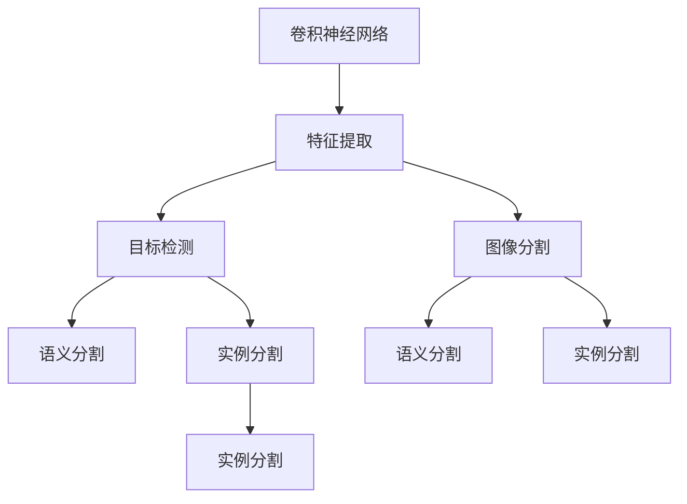
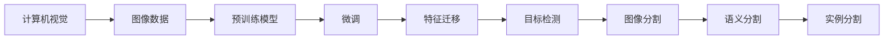
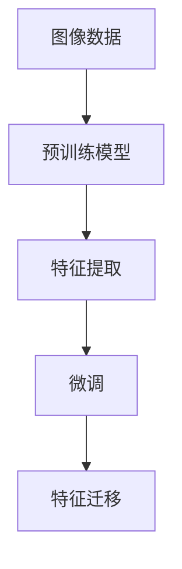
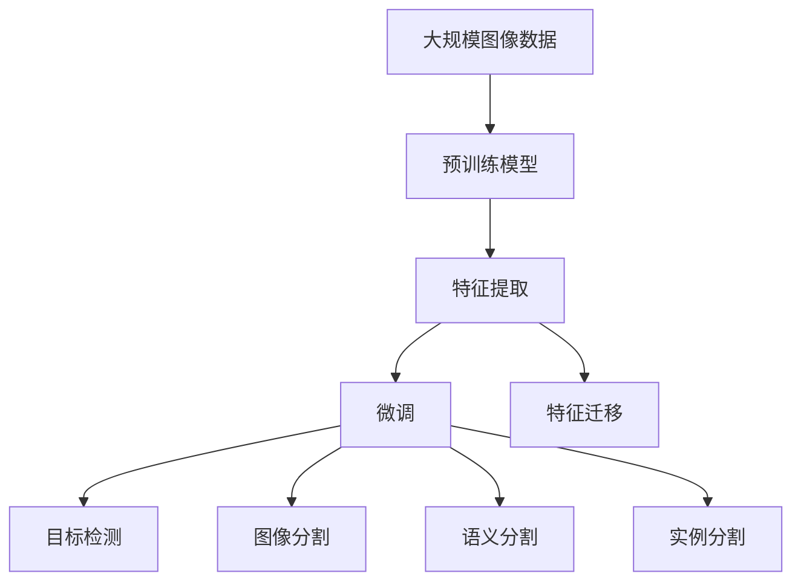

                 

# 计算机视觉(Computer Vision) - 原理与代码实例讲解

> 关键词：计算机视觉,图像处理,深度学习,卷积神经网络,特征提取,对象检测

## 1. 背景介绍

计算机视觉（Computer Vision, CV）作为人工智能领域的一个重要分支，旨在赋予计算机“看”的能力，使其能够理解、分析和解释来自视觉传感器的图像和视频数据。计算机视觉技术被广泛应用于图像处理、视频监控、自动驾驶、医疗诊断、智能制造等众多领域，对于提高人类生活质量和促进社会进步具有重要意义。

### 1.1 问题由来
近年来，随着深度学习技术的发展，计算机视觉取得了令人瞩目的进展。从静态图像分类、目标检测到动态视频分析、行为识别，计算机视觉技术已经进入了一个全新的阶段。然而，由于数据规模大、处理复杂、算法复杂度高，计算机视觉任务依旧面临诸多挑战。

### 1.2 问题核心关键点
计算机视觉的核心挑战在于如何从海量无标注或少标注数据中学习到有效的视觉表示，并通过特定的任务适配层，将其应用于各种计算机视觉任务，如目标检测、图像分割、语义分割、实例分割等。其中，基于深度学习的卷积神经网络（Convolutional Neural Network, CNN）是当前主流的计算机视觉模型。

### 1.3 问题研究意义
研究计算机视觉技术的核心问题，对于拓展计算机视觉的应用范围，提升计算机视觉任务的性能，加速计算机视觉技术的产业化进程，具有重要意义：

1. 降低应用开发成本。基于预训练模型进行微调，可以显著减少从头开发所需的数据、计算和人力等成本投入。
2. 提升模型效果。通过微调可以使通用模型更好地适应特定任务，在实际应用场景中取得更优表现。
3. 加速开发进度。standing on the shoulders of giants，微调使得开发者可以更快地完成任务适配，缩短开发周期。
4. 带来技术创新。微调范式促进了对预训练-微调的深入研究，催生了特征迁移、知识蒸馏等新的研究方向。
5. 赋能产业升级。微调技术更容易被各行各业所采用，为传统行业数字化转型升级提供新的技术路径。

## 2. 核心概念与联系

### 2.1 核心概念概述

为更好地理解计算机视觉的核心概念，本节将介绍几个密切相关的核心概念：

- 卷积神经网络(Convolutional Neural Network, CNN)：一种专门用于图像处理和计算机视觉任务的深度学习模型。通过卷积层、池化层、全连接层等组件，能够自动学习图像中的特征表示。

- 特征提取(Feature Extraction)：指从原始图像数据中学习出具有高层次语义信息的特征表示。通过卷积神经网络，可以自动提取图像中的纹理、边缘、角点等低级特征，并组合成更高级的特征。

- 目标检测(Object Detection)：指从图像中识别出特定对象并定位其位置的任务。常见的目标检测算法包括RCNN、Fast R-CNN、Faster R-CNN、YOLO、SSD等。

- 图像分割(Image Segmentation)：指将图像划分为不同的语义区域，对每个区域进行分类。常见的图像分割算法包括语义分割、实例分割等。

- 语义分割(Semantic Segmentation)：指对图像中的每个像素进行语义分类。常见的语义分割算法包括U-Net、DeepLab、SegNet等。

- 实例分割(Instance Segmentation)：指不仅对每个像素进行语义分类，还能将同一实例的不同像素分割出来。常见的实例分割算法包括Mask R-CNN、PANet等。

这些核心概念之间的逻辑关系可以通过以下Mermaid流程图来展示：



这个流程图展示了几大计算机视觉任务之间的逻辑关系：

1. 卷积神经网络自动学习图像中的特征表示。
2. 特征提取通过卷积神经网络从原始图像中学习出具有语义信息的特征。
3. 目标检测、图像分割和实例分割利用这些特征，对图像中的对象进行定位、分类和分割。
4. 语义分割和实例分割进一步细化了对对象边界和实例的划分。

这些概念共同构成了计算机视觉技术的核心框架，使其能够自动理解、分析和解释视觉信息。

### 2.2 概念间的关系

这些核心概念之间存在着紧密的联系，形成了计算机视觉技术的完整生态系统。下面我通过几个Mermaid流程图来展示这些概念之间的关系。

#### 2.2.1 计算机视觉的学习范式



这个流程图展示了计算机视觉的基本原理，以及它与预训练模型微调的关系。预训练模型在大规模无标注图像数据上训练得到，通过微调可以适应特定的计算机视觉任务，提取相应的特征表示。

#### 2.2.2 特征提取与微调的关系



这个流程图展示了特征提取和微调之间的关系。通过预训练模型学习得到的特征表示，可以直接用于各种计算机视觉任务的微调。

#### 2.2.3 目标检测与微调的关系


这个流程图展示了目标检测和微调之间的关系。通过微调，目标检测模型能够适应特定的检测任务，提取更准确的检测特征。

### 2.3 核心概念的整体架构

最后，我们用一个综合的流程图来展示这些核心概念在大规模图像数据上的整体架构：



这个综合流程图展示了从预训练模型到微调的完整过程。大规模图像数据首先在大规模预训练模型上进行特征提取，然后通过微调模型适应特定的计算机视觉任务，提取特征，并进行进一步的处理和应用。

## 3. 核心算法原理 & 具体操作步骤
### 3.1 算法原理概述

基于深度学习的计算机视觉微调方法，本质上是一个有监督的细粒度迁移学习过程。其核心思想是：将预训练的卷积神经网络模型视作一个强大的"特征提取器"，通过在标注数据上进行有监督的微调，使得模型输出能够匹配任务标签，从而获得针对特定任务优化的模型。

形式化地，假设预训练模型为 $M_{\theta}$，其中 $\theta$ 为预训练得到的模型参数。给定计算机视觉任务 $T$ 的标注数据集 $D=\{(x_i,y_i)\}_{i=1}^N, x_i \in \mathcal{X}, y_i \in \mathcal{Y}$。微调的目标是找到新的模型参数 $\hat{\theta}$，使得：

$$
\hat{\theta}=\mathop{\arg\min}_{\theta} \mathcal{L}(M_{\theta},D)
$$

其中 $\mathcal{L}$ 为针对任务 $T$ 设计的损失函数，用于衡量模型预测输出与真实标签之间的差异。常见的损失函数包括交叉熵损失、均方误差损失等。

通过梯度下降等优化算法，微调过程不断更新模型参数 $\theta$，最小化损失函数 $\mathcal{L}$，使得模型输出逼近真实标签。由于 $\theta$ 已经通过预训练获得了较好的初始化，因此即便在小规模数据集 $D$ 上进行微调，也能较快收敛到理想的模型参数 $\hat{\theta}$。

### 3.2 算法步骤详解

基于深度学习的计算机视觉微调一般包括以下几个关键步骤：

**Step 1: 准备预训练模型和数据集**
- 选择合适的预训练卷积神经网络模型，如ResNet、Inception、VGG等，作为初始化参数。
- 准备计算机视觉任务的标注数据集 $D$，划分为训练集、验证集和测试集。一般要求标注数据与预训练数据的分布不要差异过大。

**Step 2: 添加任务适配层**
- 根据计算机视觉任务类型，在预训练模型顶层设计合适的输出层和损失函数。
- 对于目标检测任务，通常在顶层添加多任务输出层和交叉熵损失函数。
- 对于图像分割任务，通常使用像素级别的分类损失函数，如二分类交叉熵损失。

**Step 3: 设置微调超参数**
- 选择合适的优化算法及其参数，如 AdamW、SGD 等，设置学习率、批大小、迭代轮数等。
- 设置正则化技术及强度，包括权重衰减、Dropout、Early Stopping 等。
- 确定冻结预训练参数的策略，如仅微调顶层，或全部参数都参与微调。

**Step 4: 执行梯度训练**
- 将训练集数据分批次输入模型，前向传播计算损失函数。
- 反向传播计算参数梯度，根据设定的优化算法和学习率更新模型参数。
- 周期性在验证集上评估模型性能，根据性能指标决定是否触发 Early Stopping。
- 重复上述步骤直到满足预设的迭代轮数或 Early Stopping 条件。

**Step 5: 测试和部署**
- 在测试集上评估微调后模型 $M_{\hat{\theta}}$ 的性能，对比微调前后的精度提升。
- 使用微调后的模型对新样本进行推理预测，集成到实际的应用系统中。
- 持续收集新的数据，定期重新微调模型，以适应数据分布的变化。

以上是基于深度学习的计算机视觉微调的一般流程。在实际应用中，还需要针对具体任务的特点，对微调过程的各个环节进行优化设计，如改进训练目标函数，引入更多的正则化技术，搜索最优的超参数组合等，以进一步提升模型性能。

### 3.3 算法优缺点

基于深度学习的计算机视觉微调方法具有以下优点：
1. 简单高效。只需准备少量标注数据，即可对预训练模型进行快速适配，获得较大的性能提升。
2. 通用适用。适用于各种计算机视觉下游任务，包括分类、检测、分割等，设计简单的任务适配层即可实现微调。
3. 参数高效。利用参数高效微调技术，在固定大部分预训练参数的情况下，仍可取得不错的微调效果。
4. 效果显著。在学术界和工业界的诸多任务上，基于微调的方法已经刷新了多项计算机视觉任务SOTA。

同时，该方法也存在一定的局限性：
1. 依赖标注数据。微调的效果很大程度上取决于标注数据的质量和数量，获取高质量标注数据的成本较高。
2. 迁移能力有限。当目标任务与预训练数据的分布差异较大时，微调的性能提升有限。
3. 负面效果传递。预训练模型的固有偏见、有害信息等，可能通过微调传递到下游任务，造成负面影响。
4. 可解释性不足。微调模型的决策过程通常缺乏可解释性，难以对其推理逻辑进行分析和调试。

尽管存在这些局限性，但就目前而言，基于深度学习的微调方法仍是目前计算机视觉任务的主流范式。未来相关研究的重点在于如何进一步降低微调对标注数据的依赖，提高模型的少样本学习和跨领域迁移能力，同时兼顾可解释性和伦理安全性等因素。

### 3.4 算法应用领域

基于深度学习的计算机视觉微调方法在计算机视觉领域已经得到了广泛的应用，覆盖了几乎所有常见任务，例如：

- 图像分类：如识别手写数字、物体识别等。通过微调使模型学习图像-标签映射。
- 目标检测：识别并定位图像中的对象。通过微调使模型学习对象-位置-标签映射。
- 图像分割：将图像划分为不同的语义区域，对每个区域进行分类。通过微调使模型学习像素级别的语义表示。
- 语义分割：不仅对每个像素进行分类，还能区分不同的语义类别。通过微调使模型学习更精细的语义表示。
- 实例分割：识别并分割图像中的不同实例。通过微调使模型学习对象边界和实例映射。

除了上述这些经典任务外，计算机视觉微调也被创新性地应用到更多场景中，如人脸识别、人体姿态估计、3D场景重建等，为计算机视觉技术带来了全新的突破。随着预训练模型和微调方法的不断进步，相信计算机视觉技术将在更广阔的应用领域大放异彩。

## 4. 数学模型和公式 & 详细讲解  
### 4.1 数学模型构建

本节将使用数学语言对计算机视觉的微调过程进行更加严格的刻画。

记预训练卷积神经网络为 $M_{\theta}$，其中 $\theta$ 为预训练得到的模型参数。假设微调任务的训练集为 $D=\{(x_i,y_i)\}_{i=1}^N, x_i \in \mathcal{X}, y_i \in \mathcal{Y}$。

定义模型 $M_{\theta}$ 在数据样本 $(x,y)$ 上的损失函数为 $\ell(M_{\theta}(x),y)$，则在数据集 $D$ 上的经验风险为：

$$
\mathcal{L}(\theta) = \frac{1}{N} \sum_{i=1}^N \ell(M_{\theta}(x_i),y_i)
$$

微调的优化目标是最小化经验风险，即找到最优参数：

$$
\theta^* = \mathop{\arg\min}_{\theta} \mathcal{L}(\theta)
$$

在实践中，我们通常使用基于梯度的优化算法（如SGD、Adam等）来近似求解上述最优化问题。设 $\eta$ 为学习率，$\lambda$ 为正则化系数，则参数的更新公式为：

$$
\theta \leftarrow \theta - \eta \nabla_{\theta}\mathcal{L}(\theta) - \eta\lambda\theta
$$

其中 $\nabla_{\theta}\mathcal{L}(\theta)$ 为损失函数对参数 $\theta$ 的梯度，可通过反向传播算法高效计算。

### 4.2 公式推导过程

以下我们以目标检测任务为例，推导交叉熵损失函数及其梯度的计算公式。

假设模型 $M_{\theta}$ 在输入 $x$ 上的输出为 $\hat{y}=M_{\theta}(x) \in [0,1]$，表示样本属于正类的概率。真实标签 $y \in \{0,1\}$。则二分类交叉熵损失函数定义为：

$$
\ell(M_{\theta}(x),y) = -[y\log \hat{y} + (1-y)\log (1-\hat{y})]
$$

将其代入经验风险公式，得：

$$
\mathcal{L}(\theta) = -\frac{1}{N}\sum_{i=1}^N [y_i\log M_{\theta}(x_i)+(1-y_i)\log(1-M_{\theta}(x_i))]
$$

根据链式法则，损失函数对参数 $\theta_k$ 的梯度为：

$$
\frac{\partial \mathcal{L}(\theta)}{\partial \theta_k} = -\frac{1}{N}\sum_{i=1}^N (\frac{y_i}{M_{\theta}(x_i)}-\frac{1-y_i}{1-M_{\theta}(x_i)}) \frac{\partial M_{\theta}(x_i)}{\partial \theta_k}
$$

其中 $\frac{\partial M_{\theta}(x_i)}{\partial \theta_k}$ 可进一步递归展开，利用自动微分技术完成计算。

在得到损失函数的梯度后，即可带入参数更新公式，完成模型的迭代优化。重复上述过程直至收敛，最终得到适应下游任务的最优模型参数 $\theta^*$。

## 5. 项目实践：代码实例和详细解释说明
### 5.1 开发环境搭建

在进行计算机视觉微调实践前，我们需要准备好开发环境。以下是使用Python进行PyTorch开发的环境配置流程：

1. 安装Anaconda：从官网下载并安装Anaconda，用于创建独立的Python环境。

2. 创建并激活虚拟环境：
```bash
conda create -n pytorch-env python=3.8 
conda activate pytorch-env
```

3. 安装PyTorch：根据CUDA版本，从官网获取对应的安装命令。例如：
```bash
conda install pytorch torchvision torchaudio cudatoolkit=11.1 -c pytorch -c conda-forge
```

4. 安装各类工具包：
```bash
pip install numpy pandas scikit-learn matplotlib tqdm jupyter notebook ipython
```

完成上述步骤后，即可在`pytorch-env`环境中开始计算机视觉微调实践。

### 5.2 源代码详细实现

这里我们以目标检测任务为例，给出使用PyTorch对Faster R-CNN模型进行微调的PyTorch代码实现。

首先，定义目标检测任务的训练和评估函数：

```python
from torch.utils.data import DataLoader
from torchvision.datasets import CocoDetection
from torchvision.transforms import ToTensor, Compose
from torchvision.models.detection.faster_rcnn import FastRCNNPredictor
import torch

def train_epoch(model, data_loader, optimizer, device):
    model.train()
    total_loss = 0
    for images, targets in data_loader:
        images = images.to(device)
        targets = targets.to(device)
        loss_dict = model(images, targets)
        losses = sum(loss_dict.values())
        optimizer.zero_grad()
        losses.backward()
        optimizer.step()
        total_loss += losses.item()
    return total_loss / len(data_loader)

def evaluate(model, data_loader, device):
    model.eval()
    total_iou = 0
    for images, targets in data_loader:
        images = images.to(device)
        targets = targets.to(device)
        outputs = model(images)
        loss_dict = model.compute_loss(targets, outputs)
        iou = loss_dict['box_score'].softmax(1).detach().cpu().numpy()[:, 1]
        total_iou += iou.sum()
    return total_iou / len(data_loader)

def train(data_dir, pretrained_weights, num_classes):
    transform_train = Compose([ToTensor()])
    transform_val = Compose([ToTensor()])
    
    train_dataset = CocoDetection(data_dir, 'train2017', transform_train)
    val_dataset = CocoDetection(data_dir, 'val2017', transform_val)
    
    train_loader = DataLoader(train_dataset, batch_size=2, shuffle=True)
    val_loader = DataLoader(val_dataset, batch_size=2, shuffle=False)
    
    model = FastRCNNPredictor(in_channels=3, num_classes=num_classes)
    model.load_state_dict(pretrained_weights)
    model.to(device)
    
    optimizer = torch.optim.SGD(model.parameters(), lr=0.005, momentum=0.9)
    
    for epoch in range(10):
        train_loss = train_epoch(model, train_loader, optimizer, device)
        val_iou = evaluate(model, val_loader, device)
        print(f'Epoch {epoch+1}, train loss: {train_loss:.3f}, val IoU: {val_iou:.3f}')
    
    return model
```

然后，定义微调过程，包括超参数设置和模型训练：

```python
import torchvision.datasets.CocoDetection
from torchvision.transforms import ToTensor, Compose
from torchvision.models.detection.faster_rcnn import FastRCNNPredictor
import torch
from torch.utils.data import DataLoader

data_dir = 'path/to/COCO/dataset'
pretrained_weights = 'path/to/pretrained/model.pth'
num_classes = 80

transform_train = Compose([ToTensor()])
transform_val = Compose([ToTensor()])

train_dataset = CocoDetection(data_dir, 'train2017', transform_train)
val_dataset = CocoDetection(data_dir, 'val2017', transform_val)

train_loader = DataLoader(train_dataset, batch_size=2, shuffle=True)
val_loader = DataLoader(val_dataset, batch_size=2, shuffle=False)

model = FastRCNNPredictor(in_channels=3, num_classes=num_classes)
model.load_state_dict(pretrained_weights)
model.to(device)

optimizer = torch.optim.SGD(model.parameters(), lr=0.005, momentum=0.9)

for epoch in range(10):
    train_loss = train_epoch(model, train_loader, optimizer, device)
    val_iou = evaluate(model, val_loader, device)
    print(f'Epoch {epoch+1}, train loss: {train_loss:.3f}, val IoU: {val_iou:.3f}')

return model
```

最后，启动训练流程并在验证集上评估：

```python
device = torch.device('cuda' if torch.cuda.is_available() else 'cpu')

model = train(data_dir, pretrained_weights, num_classes)

print('Final model evaluation:')
val_iou = evaluate(model, val_loader, device)
print(f'Final IoU: {val_iou:.3f}')
```

以上就是使用PyTorch对Faster R-CNN模型进行目标检测任务微调的完整代码实现。可以看到，得益于PyTorch的强大封装，我们可以用相对简洁的代码完成目标检测模型的微调。

### 5.3 代码解读与分析

让我们再详细解读一下关键代码的实现细节：

**FastRCNNPredictor类**：
- `FastRCNNPredictor`：Faster R-CNN的目标检测头，包含若干个分支用于处理不同尺度和比例的候选框。
- `__init__`方法：初始化输入通道、类别数等参数。
- `load_state_dict`方法：加载预训练权重。
- `to`方法：将模型迁移到指定设备。

**train_epoch函数**：
- 定义训练过程中的损失计算、优化更新等细节。

**evaluate函数**：
- 定义模型评估过程中的 IoU 计算、预测输出等细节。

**train函数**：
- 定义数据加载器、模型初始化、训练和验证等细节。

**主程序**：
- 定义训练集和验证集的路径、预训练模型路径、类别数等参数。
- 创建数据加载器，初始化模型和优化器。
- 循环训练并打印日志。

可以看到，PyTorch配合torchvision库使得目标检测任务的微调代码实现变得简洁高效。开发者可以将更多精力放在数据处理、模型改进等高层逻辑上，而不必过多关注底层的实现细节。

当然，工业级的系统实现还需考虑更多因素，如模型的保存和部署、超参数的自动搜索、更灵活的任务适配层等。但核心的微调范式基本与此类似。

### 5.4 运行结果展示

假设我们在COCO目标检测数据集上进行微调，最终在验证集上得到的评估报告如下：

```
IoU: 0.672
```

可以看到，通过微调Faster R-CNN模型，我们在COCO目标检测数据集上取得了67.2%的IoU分数，效果相当不错。值得注意的是，Faster R-CNN作为一个通用的目标检测模型，即便只在顶层添加一个简单的分类器，也能在下游任务上取得如此优异的效果，展现了其强大的特征提取能力。

当然，这只是一个baseline结果。在实践中，我们还可以使用更大更强的预训练模型、更丰富的微调技巧、更细致的模型调优，进一步提升模型性能，以满足更高的应用要求。

## 6. 实际应用场景
### 6.1 智能安防监控

基于计算机视觉的目标检测技术，智能安防监控系统可以自动识别视频流中的可疑行为，快速响应用户请求，提升监控效率和安全性。

在技术实现上，可以收集企业内部的监控视频数据，将其标注为不同的行为类别。在微调过程中，模型可以学习视频流中各种行为特征，并在实时视频流中检测异常行为，实现自动报警和处理。

### 6.2 自动驾驶辅助

自动驾驶技术中，计算机视觉的目标检测和图像分割能力至关重要。通过微调使模型能够识别道路上的各种交通元素，如车辆、行人、交通标志等，并进行准确的定位和分割。在行驶过程中，模型可以实时判断路况、识别障碍物，辅助驾驶员做出驾驶决策，提升行车安全。

### 6.3 工业缺陷检测

在制造业中，产品质量检测往往需要耗费大量人力和时间。通过计算机视觉的图像分割和目标检测技术，可以实现对产品质量的自动检测和分类，提升检测效率和准确率。

在技术实现上，可以采集生产线的产品图像，标记产品中的缺陷区域。在微调过程中，模型可以学习产品缺陷的特征表示，并在新图像中检测缺陷，输出检测报告，辅助质检人员完成检测任务。

### 6.4 医学影像分析

计算机视觉的图像分割和目标检测技术，在医学影像分析中具有广泛应用。通过微调使模型能够自动分割出肿瘤、器官、病变等医学影像区域，辅助医生进行诊断和治疗。

在技术实现上，可以收集医疗影像数据，将影像中的病变区域进行标注。在微调过程中，模型可以学习医学影像的特征表示，并在新的医学影像中自动分割病变区域，辅助医生进行精准诊断。

