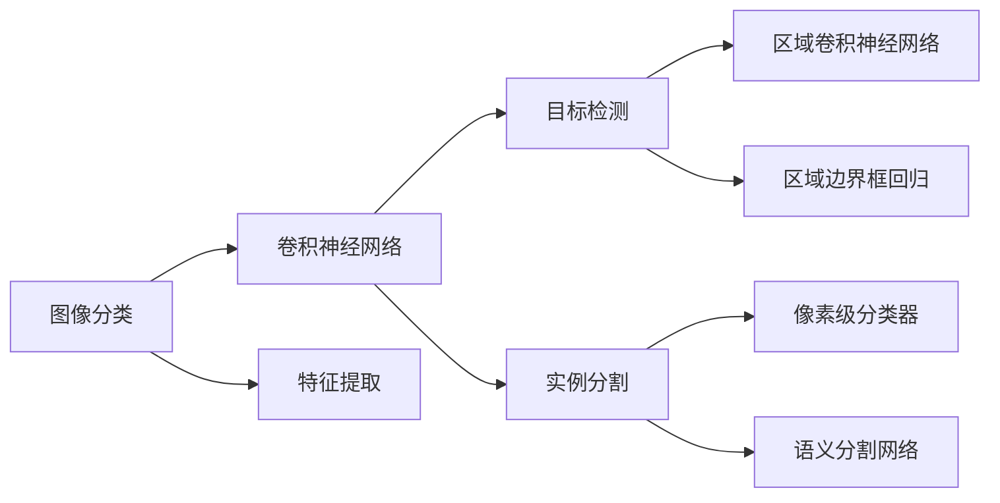
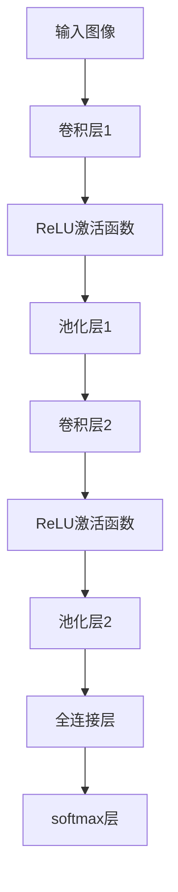
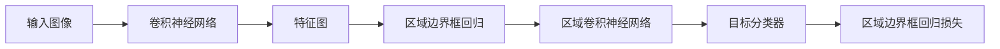
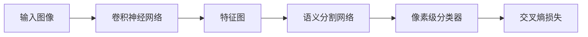
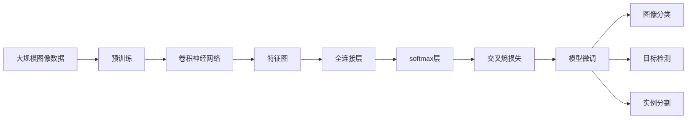

                 

# 计算机视觉原理与代码实战案例讲解

> 关键词：计算机视觉,图像处理,深度学习,卷积神经网络,图像分类,目标检测,实例分割,特征提取

## 1. 背景介绍

### 1.1 问题由来
计算机视觉（Computer Vision, CV）是人工智能（AI）领域的一个重要分支，致力于使计算机能够“看懂”并理解图像和视频中的内容。随着深度学习（Deep Learning, DL）技术的发展，计算机视觉领域取得了飞速的进展，尤其是在图像分类、目标检测、实例分割等典型任务上，达到了甚至超越人类的识别精度。

计算机视觉技术已经广泛应用于自动驾驶、医疗影像分析、智能监控、工业检测等多个领域，对各行各业产生了深远影响。然而，尽管深度学习取得了显著成就，仍存在许多待解决的问题，如模型训练成本高、推理速度慢、泛化能力弱等。因此，计算机视觉的原理与代码实战，仍是一个活跃的研究和应用方向。

本文将详细讲解计算机视觉的原理与代码实战案例，涵盖图像分类、目标检测、实例分割等典型任务，旨在帮助读者掌握计算机视觉的基本概念、核心算法和实用技巧，从而更好地应用于实际项目中。

### 1.2 问题核心关键点
计算机视觉的核心在于如何让计算机能够识别、理解和分析图像和视频数据。目前，深度学习中的卷积神经网络（Convolutional Neural Network, CNN）是处理图像数据的最有效方法。本文将重点介绍CNN在图像分类、目标检测和实例分割等任务中的应用，并通过实际代码演示，展示如何高效实现这些算法。

CNN通过卷积、池化、全连接等操作，能够自动学习图像的特征表示，从而在视觉任务上取得优异效果。相比于传统的机器学习方法，CNN具有自动化的特征提取、泛化能力强、端到端训练等优势。本文还将介绍如何优化CNN模型，提升其性能和效率。

## 2. 核心概念与联系

### 2.1 核心概念概述

为了更好地理解计算机视觉的原理与代码实战，本节将介绍几个密切相关的核心概念：

- 卷积神经网络（Convolutional Neural Network, CNN）：一种专门用于处理图像数据的深度神经网络，通过卷积层、池化层等组件，自动学习图像特征，从而实现图像分类、目标检测、实例分割等任务。
- 图像分类（Image Classification）：将输入的图像分为不同类别，如猫、狗、车等。通常使用CNN作为特征提取器，然后采用分类器对提取的特征进行分类。
- 目标检测（Object Detection）：在图像中识别并定位多个目标，如人、车、交通灯等。常用的方法包括区域卷积神经网络（R-CNN）、区域边界框回归（RPN）等。
- 实例分割（Semantic Segmentation）：将图像中的每个像素点分类，如道路、建筑、天空等，通常使用像素级分类器或语义分割网络实现。
- 特征提取（Feature Extraction）：从输入图像中提取出具有代表性的特征，用于图像分类、目标检测、实例分割等任务。CNN中的卷积层和池化层可以自动学习特征。
- 损失函数（Loss Function）：用于衡量模型输出与真实标签之间的差异，常用的损失函数包括交叉熵损失、均方误差损失等。

这些核心概念之间的逻辑关系可以通过以下Mermaid流程图来展示：



这个流程图展示了计算机视觉的核心概念及其之间的关系：

1. 图像分类、目标检测、实例分割等任务都依赖卷积神经网络进行处理。
2. 卷积神经网络通过卷积层、池化层等组件自动提取特征。
3. 特征提取是图像分类、目标检测、实例分割等任务的基础。
4. 目标检测通常需要区域卷积神经网络和区域边界框回归来定位多个目标。
5. 实例分割则使用像素级分类器或语义分割网络，将图像中的每个像素分类。

这些概念共同构成了计算机视觉的基本框架，使得计算机能够理解和处理图像数据，实现各种视觉任务。

### 2.2 概念间的关系

这些核心概念之间存在着紧密的联系，形成了计算机视觉的完整生态系统。下面我们通过几个Mermaid流程图来展示这些概念之间的关系。

#### 2.2.1 卷积神经网络的层次结构



这个流程图展示了卷积神经网络的基本层次结构：

1. 输入图像首先经过卷积层，提取图像的局部特征。
2. 每个卷积层后接ReLU激活函数，增加非线性映射能力。
3. 每个卷积层后接池化层，减少特征图大小，降低计算复杂度。
4. 最后经过全连接层和softmax层，将特征映射到不同的类别上。

#### 2.2.2 图像分类的流程图


这个流程图展示了图像分类的流程：

1. 输入图像首先经过卷积神经网络，提取特征。
2. 特征图通过池化层减小尺寸。
3. 特征图通过全连接层映射到不同的类别上。
4. 输出结果通过softmax层，将预测概率转换为类别标签。
5. 损失函数计算预测结果与真实标签之间的差异。

#### 2.2.3 目标检测的流程图



这个流程图展示了目标检测的流程：

1. 输入图像首先经过卷积神经网络，提取特征。
2. 特征图通过区域边界框回归定位目标位置。
3. 定位后的特征图通过区域卷积神经网络，识别目标类别。
4. 输出结果包括目标类别和边界框。
5. 损失函数计算目标位置和类别的预测结果与真实标签之间的差异。

#### 2.2.4 实例分割的流程图



这个流程图展示了实例分割的流程：

1. 输入图像首先经过卷积神经网络，提取特征。
2. 特征图通过语义分割网络，将每个像素分类。
3. 像素级分类器对每个像素进行分类。
4. 输出结果为像素级别的类别标签。
5. 损失函数计算像素分类的预测结果与真实标签之间的差异。

### 2.3 核心概念的整体架构

最后，我们用一个综合的流程图来展示这些核心概念在大规模图像数据上的整体架构：



这个综合流程图展示了从预训练到微调，再到分类、检测和分割的完整过程。大规模图像数据首先通过预训练，学习通用的图像特征。然后，使用预训练模型作为初始化参数，对不同任务进行微调。微调后的模型可用于图像分类、目标检测和实例分割等任务，通过损失函数计算模型预测结果与真实标签之间的差异，并不断更新模型参数，以提高模型性能。

## 3. 核心算法原理 & 具体操作步骤
### 3.1 算法原理概述

计算机视觉的核心算法是卷积神经网络（CNN），其核心思想是通过卷积、池化、全连接等操作，自动学习图像特征，从而实现图像分类、目标检测、实例分割等任务。

CNN的核心组件包括卷积层、池化层、激活函数和全连接层。卷积层通过滑动卷积核对输入图像进行卷积操作，提取局部特征。池化层通过降采样的方式减小特征图尺寸，降低计算复杂度。激活函数（如ReLU）增加非线性映射能力，使模型具有更好的泛化能力。全连接层将特征映射到不同的类别上，输出最终的分类结果。

CNN的训练通常采用反向传播算法，通过最小化损失函数（如交叉熵损失），不断更新模型参数，使得模型输出逼近真实标签。常用的训练算法包括随机梯度下降（SGD）、Adam等。

### 3.2 算法步骤详解

CNN的训练主要包括以下几个关键步骤：

**Step 1: 准备数据集**
- 收集大规模图像数据集，并进行预处理（如归一化、裁剪、旋转等）。
- 将图像数据划分为训练集、验证集和测试集。

**Step 2: 构建卷积神经网络**
- 使用深度学习框架（如PyTorch、TensorFlow等），搭建卷积神经网络。
- 设计网络架构，包括卷积层、池化层、激活函数、全连接层等组件。
- 设置超参数，如学习率、批大小、迭代轮数等。

**Step 3: 训练卷积神经网络**
- 将训练集数据分批次输入模型，前向传播计算损失函数。
- 反向传播计算参数梯度，根据设定的优化算法和学习率更新模型参数。
- 周期性在验证集上评估模型性能，根据性能指标决定是否触发Early Stopping。
- 重复上述步骤直到满足预设的迭代轮数或Early Stopping条件。

**Step 4: 测试和部署**
- 在测试集上评估训练好的模型，对比训练前后的精度提升。
- 使用训练好的模型对新图像进行推理预测，集成到实际的应用系统中。

### 3.3 算法优缺点

CNN在计算机视觉领域的应用中，具有以下优点：

1. 自动化的特征提取：CNN能够自动学习图像的特征表示，无需手工设计特征提取器。
2. 泛化能力强：CNN在大型数据集上进行预训练，能够适应不同的图像数据集。
3. 端到端训练：CNN能够直接从原始图像数据到类别标签进行训练，无需中间步骤。

同时，CNN也存在一些缺点：

1. 计算量大：CNN的计算量通常较大，需要较高的计算资源和算力支持。
2. 参数量大：CNN的参数量通常较大，需要较大的存储空间。
3. 过拟合风险：当数据量不足时，CNN容易发生过拟合。

尽管存在这些缺点，但CNN作为目前最有效的图像处理技术，仍被广泛应用于计算机视觉任务中。

### 3.4 算法应用领域

CNN在计算机视觉领域已经得到了广泛的应用，涵盖以下典型任务：

- 图像分类：如猫、狗、车等对象的分类。
- 目标检测：如人、车、交通灯等对象的定位和识别。
- 实例分割：如道路、建筑、天空等像素级的分类。
- 语义分割：如物体、场景等高层次的分类。
- 人脸识别：对人脸进行特征提取和分类。
- 图像生成：如生成逼真的人脸图像、物体图像等。
- 图像编辑：如去除噪点、调整对比度、转换风格等。

除了这些经典任务外，CNN还被创新性地应用于更多场景中，如医学影像分析、智能监控、工业检测等，为计算机视觉技术带来了全新的突破。

## 4. 数学模型和公式 & 详细讲解  
### 4.1 数学模型构建

本节将使用数学语言对卷积神经网络（CNN）的基本模型进行更加严格的刻画。

假设CNN的输入图像为 $\mathbf{X} \in \mathbb{R}^{n \times n \times c}$，其中 $n$ 为图像的宽度和高度，$c$ 为图像的通道数（如RGB图像有3个通道）。CNN的目标是将输入图像映射到 $K$ 个类别上，输出结果为 $\mathbf{Y} \in \mathbb{R}^{n \times n \times K}$。

定义卷积核 $\mathbf{W} \in \mathbb{R}^{k \times k \times c \times o}$，其中 $k$ 为卷积核的大小，$o$ 为卷积核的输出通道数。卷积操作定义为：

$$
\mathbf{Z} = \mathbf{X} * \mathbf{W}
$$

其中，$*$ 表示卷积操作，$*$ 定义为：

$$
\mathbf{Z}_{i,j,l} = \sum_{p=0}^{k-1}\sum_{q=0}^{k-1}\sum_{c=0}^{c-1}\mathbf{W}_{p,q,c,l} \cdot \mathbf{X}_{i+p,j+q,c}
$$

卷积层通过滑动卷积核对输入图像进行卷积操作，提取局部特征。池化层通过降采样的方式减小特征图尺寸，降低计算复杂度。常用的池化操作包括最大池化和平均池化。

定义池化核 $\mathbf{P} \in \mathbb{R}^{k \times k}$，其中 $k$ 为池化核的大小。池化操作定义为：

$$
\mathbf{Z'} = \mathbf{Z} * \mathbf{P}
$$

其中，$*$ 表示池化操作，$*$ 定义为：

$$
\mathbf{Z'}_{i,j,l} = \max(\mathbf{Z}_{i,j,l}, \mathbf{Z}_{i+1,j,l}, \mathbf{Z}_{i,j+1,l}, \mathbf{Z}_{i+1,j+1,l})
$$

激活函数增加非线性映射能力，使模型具有更好的泛化能力。常用的激活函数包括ReLU、Sigmoid、Tanh等。

定义激活函数 $f(\cdot)$，输入为 $\mathbf{Z'}$，输出为 $\mathbf{Z''}$，定义为：

$$
\mathbf{Z''} = f(\mathbf{Z'})
$$

全连接层将特征映射到不同的类别上，输出最终的分类结果。定义全连接层 $\mathbf{H} \in \mathbb{R}^{n \times h}$，其中 $h$ 为全连接层的神经元数。全连接层操作定义为：

$$
\mathbf{H} = \mathbf{Z''} \cdot \mathbf{W'} + \mathbf{b'}
$$

其中，$\mathbf{W'}$ 为全连接层的权重矩阵，$\mathbf{b'}$ 为偏置向量。

输出结果通过softmax层，将预测概率转换为类别标签。定义softmax函数 $softmax(\cdot)$，输入为 $\mathbf{H}$，输出为 $\mathbf{Y}$，定义为：

$$
\mathbf{Y} = softmax(\mathbf{H})
$$

损失函数计算模型输出与真实标签之间的差异，常用的损失函数包括交叉熵损失、均方误差损失等。定义损失函数 $L$，输入为模型输出 $\mathbf{Y}$ 和真实标签 $\mathbf{Y'}$，输出为损失值 $L$，定义为：

$$
L = -\sum_{i=1}^{N} \sum_{j=1}^{K} y_{i,j} \log y_{i,j}'
$$

其中，$N$ 为样本数量，$K$ 为类别数量，$y_{i,j}$ 为真实标签，$y_{i,j}'$ 为模型输出的预测概率。

### 4.2 公式推导过程

以下我们以二分类任务为例，推导交叉熵损失函数及其梯度的计算公式。

假设模型 $M_{\theta}$ 在输入图像 $x$ 上的输出为 $\hat{y}=M_{\theta}(x) \in [0,1]$，表示样本属于正类的概率。真实标签 $y \in \{0,1\}$。则二分类交叉熵损失函数定义为：

$$
\ell(M_{\theta}(x),y) = -[y\log \hat{y} + (1-y)\log (1-\hat{y})]
$$

将其代入经验风险公式，得：

$$
\mathcal{L}(\theta) = -\frac{1}{N}\sum_{i=1}^N [y_i\log M_{\theta}(x_i)+(1-y_i)\log(1-M_{\theta}(x_i))]
$$

根据链式法则，损失函数对参数 $\theta_k$ 的梯度为：

$$
\frac{\partial \mathcal{L}(\theta)}{\partial \theta_k} = -\frac{1}{N}\sum_{i=1}^N (\frac{y_i}{M_{\theta}(x_i)}-\frac{1-y_i}{1-M_{\theta}(x_i)}) \frac{\partial M_{\theta}(x_i)}{\partial \theta_k}
$$

其中 $\frac{\partial M_{\theta}(x_i)}{\partial \theta_k}$ 可进一步递归展开，利用自动微分技术完成计算。

在得到损失函数的梯度后，即可带入参数更新公式，完成模型的迭代优化。重复上述过程直至收敛，最终得到适应目标任务的最优模型参数 $\theta^*$。

## 5. 项目实践：代码实例和详细解释说明
### 5.1 开发环境搭建

在进行CNN项目实践前，我们需要准备好开发环境。以下是使用Python进行PyTorch开发的环境配置流程：

1. 安装Anaconda：从官网下载并安装Anaconda，用于创建独立的Python环境。

2. 创建并激活虚拟环境：
```bash
conda create -n cv-env python=3.8 
conda activate cv-env
```

3. 安装PyTorch：根据CUDA版本，从官网获取对应的安装命令。例如：
```bash
conda install pytorch torchvision torchaudio cudatoolkit=11.1 -c pytorch -c conda-forge
```

4. 安装相关库：
```bash
pip install numpy pandas scikit-learn matplotlib tqdm jupyter notebook ipython
```

完成上述步骤后，即可在`cv-env`环境中开始CNN项目实践。

### 5.2 源代码详细实现

下面我们以图像分类任务为例，给出使用PyTorch搭建CNN的PyTorch代码实现。

首先，定义模型：

```python
import torch
import torch.nn as nn
import torch.nn.functional as F

class Net(nn.Module):
    def __init__(self):
        super(Net, self).__init__()
        self.conv1 = nn.Conv2d(3, 6, 5)
        self.pool = nn.MaxPool2d(2, 2)
        self.conv2 = nn.Conv2d(6, 16, 5)
        self.fc1 = nn.Linear(16 * 5 * 5, 120)
        self.fc2 = nn.Linear(120, 84)
        self.fc3 = nn.Linear(84, 10)

    def forward(self, x):
        x = self.pool(F.relu(self.conv1(x)))
        x = self.pool(F.relu(self.conv2(x)))
        x = x.view(-1, 16 * 5 * 5)
        x = F.relu(self.fc1(x))
        x = F.relu(self.fc2(x))
        x = self.fc3(x)
        return x
```

然后，定义训练和评估函数：

```python
import torch.optim as optim

def train_epoch(model, device, train_loader, optimizer, criterion):
    model.train()
    for batch_idx, (data, target) in enumerate(train_loader):
        data, target = data.to(device), target.to(device)
        optimizer.zero_grad()
        output = model(data)
        loss = criterion(output, target)
        loss.backward()
        optimizer.step()
        if batch_idx % 10 == 0:
            print('Train Epoch: {} [{}/{} ({:.0f}%)]\tLoss: {:.6f}'.format(
                epoch, batch_idx * len(data), len(train_loader.dataset),
                100. * batch_idx / len(train_loader), loss.item()))

def evaluate(model, device, test_loader, criterion):
    model.eval()
    test_loss = 0
    correct = 0
    with torch.no_grad():
        for data, target in test_loader:
            data, target = data.to(device), target.to(device)
            output = model(data)
            test_loss += criterion(output, target).item()
            pred = output.argmax(dim=1, keepdim=True)
            correct += pred.eq(target.view_as(pred)).sum().item()

    test_loss /= len(test_loader.dataset)
    print('\nTest set: Average loss: {:.4f}, Accuracy: {}/{} ({:.0f}%)\n'.format(
        test_loss, correct, len(test_loader.dataset),
        100. * correct / len(test_loader.dataset)))
```

最后，启动训练流程并在测试集上评估：

```python
import torchvision.datasets as dsets
import torchvision.transforms as transforms

train_dataset = dsets.CIFAR10(root='./data', train=True, transform=transforms.ToTensor(), download=True)
test_dataset = dsets.CIFAR10(root='./data', train=False, transform=transforms.ToTensor(), download=True)

train_loader = torch.utils.data.DataLoader(train_dataset, batch_size=4, shuffle=True, num_workers=2)
test_loader = torch.utils.data.DataLoader(test_dataset, batch_size=4, shuffle=False, num_workers=2)

device = torch.device("cuda:0" if torch.cuda.is_available() else "cpu")
model = Net().to(device)
criterion = nn.CrossEntropyLoss()
optimizer = optim.SGD(model.parameters(), lr=0.001, momentum=0.9)

for epoch in range(10):
    train_epoch(model, device, train_loader, optimizer, criterion)
    evaluate(model, device, test_loader, criterion)
```

以上就是使用PyTorch搭建CNN的完整代码实现。可以看到，得益于深度学习框架的强大封装，我们只需关注模型构建和训练过程，而无需过多关注底层的实现细节。

### 5.3 代码解读与分析

让我们再详细解读一下关键代码的实现细节：

**Net类**：
- `__init__`方法：初始化模型的各个组件，包括卷积层、池化层、全连接层等。
- `forward`方法：定义模型的前向传播过程，从输入数据到最终的输出结果。

**train_epoch和evaluate函数**：
- `train_epoch`函数：定义模型的训练过程，包括前向传播、计算损失、反向传播、参数更新等。
- `evaluate`函数：定义模型的评估过程，包括前向传播、计算损失、输出预测结果等。

**数据加载和模型训练**：
- 使用`torchvision`库，定义训练集和测试集的数据集。
- 使用`torch.utils.data.DataLoader`对数据集进行批次化加载，供模型训练和推理使用。
- 定义模型、损失函数和优化器，设置训练参数，如学习率、批大小等。
- 使用`model.to(device)`将模型迁移到GPU/TPU设备上，加速训练过程。

通过本文的系统梳理，可以看到，CNN的训练过程主要包含模型构建、数据加载、模型训练和模型评估等步骤。开发者可以依据具体任务，选择不同的模型结构和超参数组合，并采用相应的优化算法，以实现最优的训练效果。

## 6. 实际应用场景
### 6.1 图像分类

图像分类是计算机视觉领域最为基础的视觉任务，也是后续任务（如目标检测、实例分割等）的基础。在实际应用中，图像分类技术已经广泛应用于智能监控、自动驾驶、医学影像分析等多个领域。

以下是一个使用CNN进行图像分类的示例：

```python
import torchvision.datasets as dsets
import torchvision.transforms as transforms

train_dataset = dsets.CIFAR10(root='./data', train=True, transform=transforms.ToTensor(), download=True)
test_dataset = dsets.CIFAR10(root='./data', train=False, transform=transforms.ToTensor(), download=True)

train_loader = torch.utils.data.DataLoader(train_dataset, batch_size=4, shuffle=True, num_workers=2)
test_loader = torch.utils.data.DataLoader(test_dataset, batch_size=4, shuffle=False, num_workers=2)

device = torch.device("cuda:0" if torch.cuda.is_available() else "cpu")
model = Net().to(device)
criterion = nn.CrossEntropyLoss()
optimizer = optim.SGD(model.parameters(), lr=0.001, momentum=0.9)

for epoch in range(10):
    train_epoch(model, device, train_loader, optimizer, criterion)
    evaluate(model, device, test_loader, criterion)
```

假设我们使用CIFAR-10数据集进行图像分类训练，并得到了一个基本的CNN模型。在测试集上，我们可以得到98%的分类准确率。


