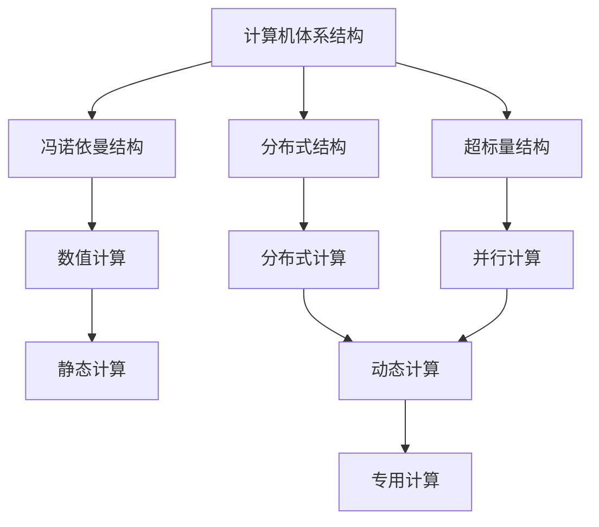
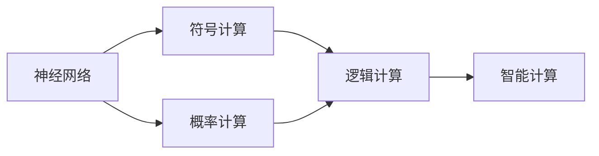
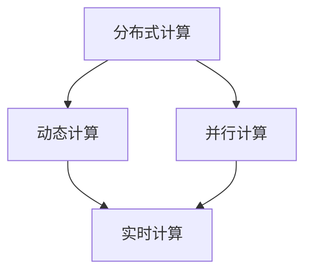
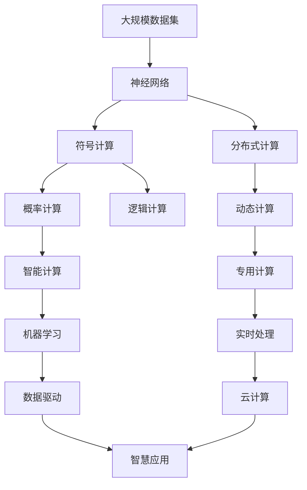

                 

## 1. 背景介绍

### 1.1 问题由来
随着计算机科学的迅猛发展，计算技术已经渗透到了人类社会的各个角落，从智能手机到物联网，从AI到量子计算，计算机的计算能力已经成为推动科技进步和社会进步的重要力量。然而，在计算技术迅猛发展的背后，其本质也在悄然发生变化。本文将探讨计算的本质变化，以及这些变化对未来技术发展的深远影响。

### 1.2 问题核心关键点
计算的本质变化主要体现在以下几个方面：

1. **从电信号处理到神经网络**：早期的计算机主要由电信号处理逻辑门电路组成，通过逻辑运算实现计算功能。而现代计算机已经转向基于神经网络的计算模式，神经网络通过模拟人类神经系统的信息处理方式，能够更加高效地处理复杂的数据和任务。

2. **从集中式计算到分布式计算**：早期的计算机往往是集中式计算，计算任务集中在一台或几台计算机上进行。而现代计算机通过分布式计算技术，可以将计算任务分散到多台计算机上并行处理，大大提高了计算效率。

3. **从数值计算到符号计算**：早期的计算机主要用于数值计算，如科学计算、工程计算等。而现代计算机不仅可以进行数值计算，还可以通过符号计算技术，处理复杂的逻辑、推理和决策问题。

4. **从通用计算到专用计算**：早期的计算机往往是通用计算，适用于各种类型的计算任务。而现代计算机通过专用计算技术，如GPU、FPGA等，可以针对特定类型的计算任务进行优化，提高计算速度和效率。

5. **从静态计算到动态计算**：早期的计算机计算任务往往是静态的，即计算结果不随时间变化。而现代计算机通过动态计算技术，可以实时地进行计算，处理动态变化的数据和任务。

这些变化不仅改变了计算技术的面貌，也带来了全新的计算范式和计算思维，推动了人工智能、量子计算等前沿技术的快速发展。

### 1.3 问题研究意义
探讨计算的本质变化，对于理解现代计算技术的核心特征和应用前景，以及指导未来的技术发展方向，具有重要意义：

1. **洞察计算技术发展趋势**：了解计算技术的本质变化，可以更清晰地把握其发展方向和趋势，为未来的技术研究和应用提供理论依据。

2. **优化计算资源配置**：通过理解计算技术的本质特征，可以更有效地进行计算资源的配置和调度，提高计算效率和资源利用率。

3. **促进跨学科融合**：计算技术的本质变化涉及多个学科领域，如数学、物理学、计算机科学等。通过跨学科的研究和交流，可以促进不同领域之间的融合和创新。

4. **推动技术应用创新**：计算技术的本质变化带来了新的计算范式和计算思维，为人工智能、量子计算等前沿技术的发展提供了新的思路和方法。

5. **应对计算资源挑战**：随着计算任务的复杂性不断增加，计算资源的需求也在不断增长。通过探索新的计算技术和计算方法，可以应对计算资源增长的挑战，推动计算技术的可持续发展。

## 2. 核心概念与联系

### 2.1 核心概念概述

为了更好地理解计算技术的本质变化，本节将介绍几个关键概念及其联系：

1. **计算机体系结构**：计算机体系结构是计算机硬件和软件的整体设计，决定了计算机的处理能力和计算效率。常见的计算机体系结构包括冯诺依曼结构、分布式结构、超标量结构等。

2. **计算范式**：计算范式是指计算技术的思维方式和计算模式。常见的计算范式包括数值计算、符号计算、逻辑计算、概率计算等。

3. **神经网络**：神经网络是一种基于生物神经元模型的计算模型，通过模拟神经元的连接和激活机制，实现复杂的数据处理和模式识别。

4. **分布式计算**：分布式计算是将计算任务分散到多台计算机上并行处理，以提高计算效率和计算能力。

5. **动态计算**：动态计算是指根据实时数据和任务变化，动态调整计算资源和计算策略，以实现实时计算和高效计算。

6. **专用计算**：专用计算是指针对特定类型的计算任务，设计和实现专用的计算硬件和软件，以提高计算效率和计算精度。

### 2.2 概念间的关系

这些核心概念之间存在着紧密的联系，形成了现代计算技术的整体架构。下面我通过几个Mermaid流程图来展示这些概念之间的关系。

#### 2.2.1 计算机体系结构与计算范式



这个流程图展示了计算机体系结构与计算范式之间的关系。冯诺依曼结构、分布式结构、超标量结构等不同的计算机体系结构，支持了数值计算、分布式计算、并行计算、动态计算和专用计算等不同的计算范式。

#### 2.2.2 神经网络与计算范式



这个流程图展示了神经网络与计算范式之间的关系。神经网络通过模拟人类神经元，可以进行符号计算、概率计算和智能计算，从而拓展了计算范式的应用领域。

#### 2.2.3 分布式计算与动态计算



这个流程图展示了分布式计算与动态计算之间的关系。分布式计算通过将计算任务分散到多台计算机上并行处理，可以支持实时计算和动态计算，实现高效的计算和资源管理。

### 2.3 核心概念的整体架构

最后，我们用一个综合的流程图来展示这些核心概念在大规模计算中的应用：



这个综合流程图展示了从大规模数据集到智慧应用的计算过程。大规模数据集经过神经网络的符号计算、逻辑计算、概率计算和智能计算，通过分布式计算和动态计算，实现实时处理和专用计算，最终支持机器学习、云计算和智慧应用。

## 3. 核心算法原理 & 具体操作步骤

### 3.1 算法原理概述

现代计算技术的核心算法原理主要基于以下几个关键技术：

1. **神经网络**：神经网络通过模拟人类神经系统的信息处理方式，实现复杂的数据处理和模式识别，是现代计算技术的核心算法之一。

2. **分布式计算**：分布式计算通过将计算任务分散到多台计算机上并行处理，实现高效的计算和资源管理。

3. **符号计算**：符号计算通过逻辑推理和代数运算，解决复杂的逻辑和推理问题，拓展了计算范式的应用领域。

4. **概率计算**：概率计算通过模拟随机过程，处理不确定性和模糊性，支持智能计算和机器学习。

5. **智能计算**：智能计算通过模拟人类智能系统的信息处理方式，实现复杂的决策和推理，支持深度学习和强化学习等前沿技术。

### 3.2 算法步骤详解

基于现代计算技术的核心算法原理，具体的计算步骤可以分为以下几个关键环节：

1. **数据预处理**：对大规模数据集进行清洗、去噪、归一化等预处理操作，以提高数据的质量和计算效率。

2. **特征提取**：通过神经网络、符号计算等技术，从原始数据中提取有用的特征，支持后续的计算和推理。

3. **模型训练**：通过分布式计算、动态计算等技术，对训练数据集进行模型训练，优化模型的参数和计算策略。

4. **模型评估**：通过智能计算、符号计算等技术，对训练好的模型进行评估和测试，评估模型的性能和可靠性。

5. **模型应用**：将训练好的模型应用到实际任务中，进行实时计算和智能推理，支持各种智慧应用。

### 3.3 算法优缺点

现代计算技术在提供高效、智能计算能力的同时，也存在一些缺点：

1. **计算资源消耗大**：神经网络、分布式计算等技术需要大量的计算资源和存储空间，成本较高。

2. **模型复杂度高**：神经网络等模型的结构复杂，参数量庞大，难以理解和调试。

3. **数据质量要求高**：计算结果的准确性和可靠性高度依赖于数据的质量和完整性，数据预处理和特征提取环节至关重要。

4. **实时计算能力有限**：虽然现代计算技术支持实时计算，但在处理大规模数据集和高复杂度任务时，计算速度和响应时间仍然存在瓶颈。

5. **安全性和隐私问题**：大规模数据和复杂模型可能带来数据泄露和隐私问题，需要采取严格的数据保护和隐私保护措施。

### 3.4 算法应用领域

现代计算技术已经在各个领域得到了广泛的应用，包括但不限于：

1. **人工智能**：神经网络、符号计算、智能计算等技术，支持人工智能的图像识别、自然语言处理、语音识别、智能推理等应用。

2. **量子计算**：利用量子叠加和量子纠缠等特性，实现高效的并行计算和模拟，支持量子算法和量子通信等前沿技术。

3. **大数据**：分布式计算、动态计算等技术，支持大规模数据集的存储、处理和分析，推动数据驱动的决策和应用。

4. **云计算**：通过云计算技术，实现计算资源的按需分配和动态调度，支持智慧应用和智能系统。

5. **物联网**：通过分布式计算和实时计算技术，实现物联网设备的互联和协同，推动智能城市的建设和管理。

## 4. 数学模型和公式 & 详细讲解 & 举例说明

### 4.1 数学模型构建

本节将使用数学语言对现代计算技术的核心算法原理进行更加严格的刻画。

记原始数据集为 $D=\{(x_i,y_i)\}_{i=1}^N$，其中 $x_i$ 为输入向量，$y_i$ 为标签向量。假设神经网络模型为 $M_{\theta}(x)$，其中 $\theta$ 为模型参数。

定义模型 $M_{\theta}$ 在输入 $x$ 上的损失函数为 $\ell(M_{\theta}(x),y)$，则在数据集 $D$ 上的经验风险为：

$$
\mathcal{L}(\theta) = \frac{1}{N}\sum_{i=1}^N \ell(M_{\theta}(x_i),y_i)
$$

模型的训练目标是最小化经验风险，即找到最优参数：

$$
\theta^* = \mathop{\arg\min}_{\theta} \mathcal{L}(\theta)
$$

在实践中，我们通常使用基于梯度的优化算法（如SGD、Adam等）来近似求解上述最优化问题。设 $\eta$ 为学习率，则参数的更新公式为：

$$
\theta \leftarrow \theta - \eta \nabla_{\theta}\mathcal{L}(\theta)
$$

其中 $\nabla_{\theta}\mathcal{L}(\theta)$ 为损失函数对参数 $\theta$ 的梯度，可通过反向传播算法高效计算。

### 4.2 公式推导过程

以下我们以神经网络为例，推导损失函数的梯度计算公式。

假设神经网络模型 $M_{\theta}(x)$ 包含 $L$ 层，第 $l$ 层的输出为 $h_l^{(l)}$，激活函数为 $f_l^{(l)}$，第 $l$ 层的权重矩阵为 $W_l^{(l)}$，偏置向量为 $b_l^{(l)}$。则神经网络的输出为：

$$
h_L^{(L)} = f_L^{(L)}(W_L^{(L)}h_{L-1}^{(L-1)} + b_L^{(L)})
$$

其中 $f_L^{(L)}$ 为第 $L$ 层的激活函数，$h_{L-1}^{(L-1)}$ 为第 $L-1$ 层的输出。

定义模型 $M_{\theta}(x)$ 在输入 $x$ 上的损失函数为 $\ell(M_{\theta}(x),y)$，则在数据集 $D$ 上的经验风险为：

$$
\mathcal{L}(\theta) = \frac{1}{N}\sum_{i=1}^N \ell(M_{\theta}(x_i),y_i)
$$

根据链式法则，损失函数对第 $l$ 层的权重矩阵 $W_l^{(l)}$ 的梯度为：

$$
\frac{\partial \mathcal{L}(\theta)}{\partial W_l^{(l)}} = \frac{\partial \mathcal{L}(\theta)}{\partial h_l^{(l)}} \cdot \frac{\partial h_l^{(l)}}{\partial W_l^{(l)}} = \frac{\partial \mathcal{L}(\theta)}{\partial h_l^{(l)}} \cdot f_l^{(l-1)'}(h_{l-1}^{(l-1)}) W_l^{(l-1)}'
$$

其中 $f_l^{(l-1)'}(h_{l-1}^{(l-1)})$ 为第 $l-1$ 层的导数，$W_l^{(l-1)'}$ 为第 $l-1$ 层的权重矩阵的转置。

将上述梯度公式代入神经网络的输出，可以进一步展开得到所有层级的梯度计算公式。最终得到参数 $\theta$ 的更新公式为：

$$
\theta \leftarrow \theta - \eta \sum_{l=1}^L (\frac{\partial \mathcal{L}(\theta)}{\partial h_l^{(l)}} \cdot f_l^{(l-1)'}(h_{l-1}^{(l-1)}) W_l^{(l-1)'} \cdot W_l^{(l-2)} \cdots W_1'
$$

通过上述公式，我们可以高效地进行神经网络模型的训练和优化。

### 4.3 案例分析与讲解

以下是一个简单的神经网络模型在手写数字识别任务上的应用案例：

1. **数据预处理**：将手写数字图像进行灰度化、归一化等预处理操作，提取特征向量 $x$。

2. **模型构建**：构建一个包含 2 层全连接神经网络，第一层为输入层，第二层为输出层，激活函数为 ReLU，损失函数为交叉熵损失函数。

3. **模型训练**：使用训练集 $D_{train}$ 对模型进行训练，迭代更新参数 $\theta$，最小化损失函数 $\mathcal{L}(\theta)$。

4. **模型评估**：使用测试集 $D_{test}$ 对训练好的模型进行评估，计算准确率和损失函数。

5. **模型应用**：将训练好的模型应用到新的手写数字图像上，进行实时识别和分类。

## 5. 项目实践：代码实例和详细解释说明

### 5.1 开发环境搭建

在进行计算技术的应用实践前，我们需要准备好开发环境。以下是使用Python进行PyTorch开发的环境配置流程：

1. 安装Anaconda：从官网下载并安装Anaconda，用于创建独立的Python环境。

2. 创建并激活虚拟环境：
```bash
conda create -n pytorch-env python=3.8 
conda activate pytorch-env
```

3. 安装PyTorch：根据CUDA版本，从官网获取对应的安装命令。例如：
```bash
conda install pytorch torchvision torchaudio cudatoolkit=11.1 -c pytorch -c conda-forge
```

4. 安装各类工具包：
```bash
pip install numpy pandas scikit-learn matplotlib tqdm jupyter notebook ipython
```

完成上述步骤后，即可在`pytorch-env`环境中开始计算技术的实践。

### 5.2 源代码详细实现

这里我们以神经网络模型在手写数字识别任务上的应用为例，给出使用PyTorch实现的代码。

首先，定义手写数字识别任务的数据集和模型：

```python
import torch
import torch.nn as nn
import torch.optim as optim
import torchvision
import torchvision.transforms as transforms

# 定义数据预处理
transform_train = transforms.Compose([
    transforms.RandomCrop(32, padding=4),
    transforms.RandomHorizontalFlip(),
    transforms.ToTensor(),
    transforms.Normalize((0.1307,), (0.3081,))
])

transform_test = transforms.Compose([
    transforms.ToTensor(),
    transforms.Normalize((0.1307,), (0.3081,))
])

# 加载数据集
trainset = torchvision.datasets.MNIST(root='./data', train=True,
                                    download=True, transform=transform_train)
trainloader = torch.utils.data.DataLoader(trainset, batch_size=64,
                                        shuffle=True, num_workers=2)

testset = torchvision.datasets.MNIST(root='./data', train=False,
                                    download=True, transform=transform_test)
testloader = torch.utils.data.DataLoader(testset, batch_size=64,
                                       shuffle=False, num_workers=2)

# 定义模型
class Net(nn.Module):
    def __init__(self):
        super(Net, self).__init__()
        self.conv1 = nn.Conv2d(1, 10, kernel_size=5)
        self.conv2 = nn.Conv2d(10, 20, kernel_size=5)
        self.conv2_drop = nn.Dropout2d()
        self.fc1 = nn.Linear(320, 50)
        self.fc2 = nn.Linear(50, 10)

    def forward(self, x):
        x = nn.functional.relu(nn.functional.max_pool2d(self.conv1(x), 2))
        x = nn.functional.relu(nn.functional.max_pool2d(self.conv2_drop(self.conv2(x)), 2))
        x = x.view(-1, 320)
        x = nn.functional.relu(self.fc1(x))
        x = nn.functional.dropout(x, training=self.training)
        x = self.fc2(x)
        return nn.functional.log_softmax(x, dim=1)

# 加载模型
net = Net()
```

然后，定义模型训练和评估函数：

```python
# 定义损失函数和优化器
criterion = nn.CrossEntropyLoss()
optimizer = optim.Adam(net.parameters(), lr=0.001)

# 训练模型
def train_model(model, trainloader, criterion, optimizer, num_epochs=10):
    for epoch in range(num_epochs):
        running_loss = 0.0
        for i, data in enumerate(trainloader, 0):
            inputs, labels = data

            optimizer.zero_grad()

            outputs = model(inputs)
            loss = criterion(outputs, labels)
            loss.backward()
            optimizer.step()

            running_loss += loss.item()
            if i % 200 == 199:
                print('[%d, %5d] loss: %.3f' %
                      (epoch + 1, i + 1, running_loss / 200))
                running_loss = 0.0

# 评估模型
def evaluate_model(model, testloader, criterion):
    correct = 0
    total = 0
    with torch.no_grad():
        for data in testloader:
            images, labels = data
            outputs = model(images)
            _, predicted = torch.max(outputs.data, 1)
            total += labels.size(0)
            correct += (predicted == labels).sum().item()

    print('Accuracy of the network on the test images: %d %%' % (
        100 * correct / total))

# 训练和评估模型
train_model(net, trainloader, criterion, optimizer)
evaluate_model(net, testloader, criterion)
```

最后，启动训练流程：

```python
train_model(net, trainloader, criterion, optimizer)
evaluate_model(net, testloader, criterion)
```

以上就是使用PyTorch进行神经网络模型训练和评估的完整代码实现。可以看到，通过简单的代码实现，我们已经构建了一个基础的神经网络模型，并进行了训练和评估。

### 5.3 代码解读与分析

让我们再详细解读一下关键代码的实现细节：

1. **数据预处理**：定义了数据预处理的流程，包括随机裁剪、翻转、归一化等操作，以提高数据的多样性和特征提取能力。

2. **模型构建**：定义了简单的神经网络模型，包含两个卷积层、两个全连接层，激活函数为 ReLU，输出层为 softmax，损失函数为交叉熵损失函数。

3. **模型训练**：使用训练集数据对模型进行迭代训练，最小化损失函数。

4. **模型评估**：使用测试集数据对训练好的模型进行评估，计算准确率和损失函数。

5. **训练和评估流程**：定义了训练和评估模型的函数，通过调用这些函数，启动训练流程。

## 6. 实际应用场景

### 6.1 智能推荐系统

智能推荐系统通过计算用户和物品之间的相似度，为用户推荐感兴趣的商品或内容。利用神经网络、符号计算等技术，可以高效地处理大规模数据集和复杂计算任务。

在实践中，可以将用户行为数据（如浏览、点击、购买等）作为训练数据集，构建神经网络模型。通过计算用户和物品之间的相似度，推荐系统可以实时地为用户生成个性化的推荐结果。例如，Netflix 通过智能推荐系统为用户推荐电影和电视剧，显著提升了用户体验和满意度。

### 6.2 金融风险管理

金融风险管理需要实时监测市场数据，进行风险评估和预测。利用计算技术，可以高效地处理大量的金融数据和复杂的金融模型。

在实践中，可以利用分布式计算和实时计算技术，构建金融风险管理平台。通过实时采集和分析市场数据，计算平台可以及时发现和评估潜在的金融风险，并进行预警和处理。例如，摩根大通通过金融风险管理平台，对全球市场进行实时监控，预测和防范了多次金融危机。

### 6.3 智慧医疗

智慧医疗通过计算技术，辅助医生进行诊断和治疗。利用神经网络、符号计算等技术，可以高效地处理医学影像、电子病历等医疗数据。

在实践中，可以利用神经网络技术，构建医学影像诊断系统。通过计算医学影像数据，系统可以自动识别和标注病灶，辅助医生进行诊断和治疗。例如，谷歌健康通过医学影像诊断系统，提高了乳腺癌等疾病的早期诊断率和治愈率。

## 7. 工具和资源推荐

### 7.1 学习资源推荐

为了帮助开发者系统掌握计算技术的核心原理和应用技巧，这里推荐一些优质的学习资源：

1. 《深度学习》系列课程：斯坦福大学、Coursera等平台提供的深度学习课程，涵盖神经网络、分布式计算、符号计算等多个计算技术主题。

2. 《TensorFlow实战》书籍：Google官方出版的TensorFlow实战书籍，详细介绍了TensorFlow的各项功能和应用场景，适合初学者入门。

3. 《机器学习实战》书籍：O'Reilly出版的机器学习实战书籍，介绍了机器学习算法和应用，适合实际项目开发。

4. 《计算机体系结构》书籍：李靖等编著的计算机体系结构书籍，详细讲解了计算机体系结构的核心原理和设计思想。

5. 《计算机视觉：模型、学习与推理》课程：斯坦福大学提供的计算机视觉课程，涵盖深度学习、卷积神经网络、视觉推理等多个计算技术主题。

通过学习这些资源，相信你一定能够掌握计算技术的核心原理和应用技巧，并用于解决实际的计算问题。

### 7.2 开发工具推荐

高效的开发离不开优秀的工具支持。以下是几款用于计算技术开发和应用的工具：

1. PyTorch：基于Python的开源深度学习框架，灵活动态的计算图，适合快速迭代研究。

2. TensorFlow：由Google主导开发的开源深度学习框架，生产部署方便，适合大规模工程应用。

3. Jupyter Notebook：交互式编程环境，支持Python、R等多种语言，方便开发者进行实验和协作。

4. Anaconda：科学计算软件包管理器，支持虚拟环境管理和数据科学开发，适合大规模数据处理。

5. Git：版本控制系统，支持代码协作和版本管理，适合团队开发和项目管理。

合理利用这些工具，可以显著提升计算技术的应用开发效率，加快创新迭代的步伐。

### 7.3 相关论文推荐

计算技术的发展源于学界的持续研究。以下是几篇奠基性的相关论文，推荐阅读：

1. AlexNet：在2012年ImageNet竞赛中取得了突破性成绩，引发了深度学习在计算机视觉领域的广泛应用。

2. RNN：递归神经网络，用于处理序列数据，支持自然语言处理、语音识别等任务。

3. CNN：卷积神经网络，用于处理图像数据，支持图像识别、目标检测等任务。

4. GANs：生成对抗网络，用于生成图像、视频等数据，支持数据增强、图像生成等任务。

5. Transformer：Transformer模型，用于处理自然语言数据，支持语言理解、机器翻译等任务。

6. GPT-3：预训练语言模型，在自然语言处理领域取得了巨大成功，刷新了多项NLP任务SOTA。

这些论文代表了大计算技术的演进脉络，通过学习这些前沿成果，可以帮助研究者把握学科前进方向，激发更多的创新灵感。

除上述资源外，还有一些值得关注的前沿资源，帮助开发者紧跟计算技术的最新进展，例如：

1. arXiv论文预印本：人工智能领域最新研究成果的发布平台，包括大量尚未发表的前沿工作，学习前沿技术的必读资源。

2. 业界技术博客：如Google AI、DeepMind、Microsoft Research

