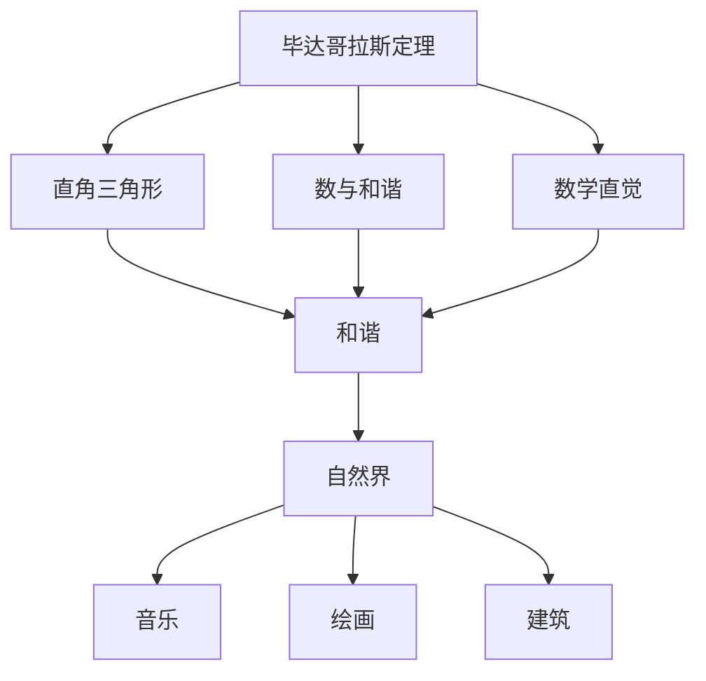
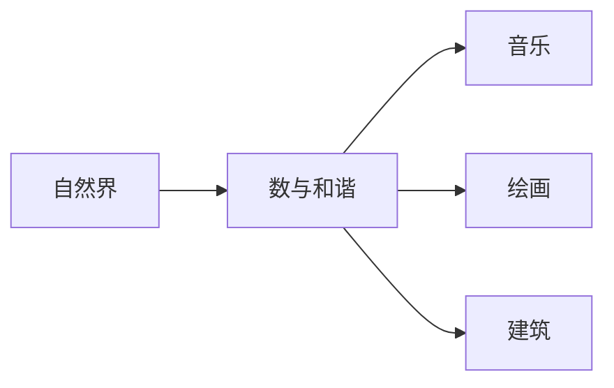
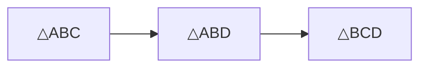

                 

# 计算：第一部分 计算的诞生 第 1 章 毕达哥拉斯的困惑 毕达哥拉斯学派

> 关键词：
- 毕达哥拉斯
- 数学
- 哲学
- 古希腊
- 微积分
- 几何学

## 1. 背景介绍

### 1.1 问题由来
数学是所有现代科学和技术的基础。尽管人类从远古时代就开始使用数字，但直到古希腊的毕达哥拉斯（Pythagoras）及其学派，数学才真正形成一门系统化的学科。毕达哥拉斯学派对数学的贡献不仅在于发现了毕达哥拉斯定理，更在于他们提出了一种全新的数学观，即数学是揭示宇宙真理的钥匙。

### 1.2 问题核心关键点
毕达哥拉斯及其学派的核心观点是：
- “万物皆数”：认为宇宙中的一切都可以通过数学来描述和解释。
- “和谐”：数学中的和谐比例是自然界的基本特征，如音乐、绘画、建筑等。
- “万物一体”：所有数学概念和符号之间存在内在的联系和对应关系。

毕达哥拉斯学派的研究方法包括：
- 通过符号操作来推导数学规律。
- 利用数学来解释自然现象和哲学问题。
- 强调数学直觉和洞察力。

这些观点和方法对后来的数学发展产生了深远的影响，奠定了现代数学的基础。

## 2. 核心概念与联系

### 2.1 核心概念概述

为更好地理解毕达哥拉斯学派的数学思想，本节将介绍几个关键概念：

- 毕达哥拉斯定理（Pythagorean Theorem）：在直角三角形中，斜边的平方等于两直角边的平方和。形式化表达为：$c^2 = a^2 + b^2$。
- 数与和谐：毕达哥拉斯学派认为，数学中的和谐比例（如黄金比例）是自然界的基本特征，音乐、绘画、建筑等都符合这种比例。
- 数学直觉：毕达哥拉斯学派强调数学直觉和洞察力，认为数学家应具备对数学规律的敏锐感知和深刻理解。
- 哲学与数学：毕达哥拉斯学派将数学视为揭示宇宙真理的钥匙，数学与哲学密不可分。

这些概念之间的联系可以通过以下Mermaid流程图来展示：



这个流程图展示了大语言模型微调过程中各个核心概念的关系和作用：

1. 毕达哥拉斯定理是毕达哥拉斯学派的一个核心数学发现。
2. 数与和谐是毕达哥拉斯学派对数学的一种解释和应用。
3. 数学直觉是毕达哥拉斯学派对数学研究方法的一种强调。
4. 哲学与数学是毕达哥拉斯学派对数学应用的一种扩展和深入。

这些概念共同构成了毕达哥拉斯学派的数学思想体系，对后世的数学发展产生了深远影响。

### 2.2 概念间的关系

这些核心概念之间存在着紧密的联系，形成了毕达哥拉斯学派的数学思想体系。下面我们通过几个Mermaid流程图来展示这些概念之间的关系。

#### 2.2.1 毕达哥拉斯定理与数学直观


这个流程图展示了毕达哥拉斯定理与数学直观之间的关系。直角三角形直观上就符合毕达哥拉斯定理，毕达哥拉斯定理的发现过程也反映了数学直观的重要性。

#### 2.2.2 数与和谐在自然界中的应用



这个流程图展示了数与和谐在自然界中的应用。毕达哥拉斯学派认为，数学中的和谐比例（如黄金比例）是自然界的基本特征，音乐、绘画、建筑等都符合这种比例。

#### 2.2.3 哲学与数学的融合


这个流程图展示了哲学与数学的融合。毕达哥拉斯学派认为，数学是揭示宇宙真理的钥匙，数学与哲学密不可分。

## 3. 核心算法原理 & 具体操作步骤
### 3.1 算法原理概述

毕达哥拉斯学派的数学研究方法，是一种基于符号操作的数学直觉和几何直观的推理过程。其主要原理是通过对数和符号的直观操作，推导出数学规律和性质。

具体而言，毕达哥拉斯学派的数学研究过程包括以下几个步骤：
1. 定义一组基本的符号和运算规则。
2. 通过符号操作，推导出数学定理和性质。
3. 将数学定理和性质应用于自然现象和哲学问题，解释和预测。

### 3.2 算法步骤详解

毕达哥拉斯学派的数学研究方法，通常包括以下几个步骤：

1. 定义基本符号和运算规则：如整数、分数、几何图形等。
2. 进行符号操作：如加、减、乘、除等基本运算，以及平方、开方、对数等高级运算。
3. 推导数学定理：如毕达哥拉斯定理、勾股数定理、勾股数等。
4. 应用数学定理：如解释自然现象、预测天文事件、设计建筑设计等。

以下是使用Python进行毕达哥拉斯定理推导的示例代码：

```python
from sympy import symbols, Eq, solve

# 定义符号
a, b, c = symbols('a b c')

# 定义方程
equation = Eq(c**2, a**2 + b**2)

# 解方程
solution = solve(equation, c)

# 输出解
solution
```

### 3.3 算法优缺点

毕达哥拉斯学派的数学研究方法，具有以下优点：
1. 直观性强：通过符号操作推导数学规律，直观易懂。
2. 适用范围广：适用于几何、代数、数论等各个数学领域。
3. 理论深度高：通过数学直觉和几何直观，推导出深刻数学定理。

但同时，也存在以下缺点：
1. 计算量较大：依赖手动符号操作，计算量较大。
2. 应用场景有限：适用范围主要局限于数学研究，难以应用于实际应用。
3. 缺乏验证机制：缺乏严格的数学验证，容易出错。

### 3.4 算法应用领域

毕达哥拉斯学派的数学研究方法，主要应用于以下几个领域：
1. 几何学：毕达哥拉斯定理是其最重要的数学发现，广泛应用于几何学。
2. 数论：通过符号操作推导数论定理，如勾股数、连分数等。
3. 音乐理论：毕达哥拉斯学派认为音乐是和谐的，利用数学来解释和设计音乐。

此外，毕达哥拉斯学派的数学思想也影响了后来的数学发展，如牛顿的微积分、欧拉的对数函数等。

## 4. 数学模型和公式 & 详细讲解  
### 4.1 数学模型构建

毕达哥拉斯学派的数学研究方法，是一种基于符号操作的直观推理过程。其核心思想是通过对数和符号的直观操作，推导出数学规律和性质。

定义一组基本的符号和运算规则，如整数、分数、几何图形等，然后通过符号操作推导数学定理。例如，毕达哥拉斯定理的证明过程如下：

假设直角三角形的两条直角边分别为 $a$ 和 $b$，斜边为 $c$，则根据直角三角形的定义，有：
$$
\triangle ABC: \angle C = 90^\circ, AB = c, BC = a, CA = b
$$
根据三角形的面积公式，有：
$$
\frac{1}{2}AB \cdot BC = \frac{1}{2}CA \cdot BC
$$
将 $AB = c$ 和 $CA = b$ 代入上式，得：
$$
\frac{1}{2}c \cdot a = \frac{1}{2}b \cdot a
$$
化简得：
$$
c^2 = a^2 + b^2
$$
这就是毕达哥拉斯定理的数学表达。

### 4.2 公式推导过程

以下是毕达哥拉斯定理的数学公式推导过程：

1. 定义直角三角形的两个直角边为 $a$ 和 $b$，斜边为 $c$。
2. 将直角三角形拆分为两个直角三角形，如图1所示。



3. 在 △ABD 中，根据直角三角形性质，有：
$$
AD^2 + BD^2 = AB^2
$$
4. 在 △BCD 中，根据直角三角形性质，有：
$$
BD^2 + CD^2 = BC^2
$$
5. 将以上两个等式相加，得：
$$
AD^2 + 2BD^2 + CD^2 = AB^2 + BC^2
$$
6. 因为 $AD = AC - CD$，代入上式得：
$$
(AC - CD)^2 + 2BD^2 + CD^2 = AB^2 + BC^2
$$
7. 展开并化简，得：
$$
AC^2 - 2AC \cdot CD + CD^2 + 2BD^2 + CD^2 = AB^2 + BC^2
$$
8. 将 $AC^2$ 替换为 $AB^2 - BC^2$，得：
$$
(AB^2 - BC^2 - 2AB \cdot CD + CD^2) + 2BD^2 + CD^2 = AB^2 + BC^2
$$
9. 化简得：
$$
AB^2 + BC^2 = AC^2
$$

### 4.3 案例分析与讲解

以毕达哥拉斯定理为例，我们可以进一步分析其数学模型和公式推导过程。

1. 定义直角三角形的边长：
$$
a = AC = AB - BC
$$
$$
b = BC
$$
$$
c = AB
$$

2. 根据直角三角形面积公式：
$$
\frac{1}{2}AB \cdot BC = \frac{1}{2}AC \cdot BC
$$

3. 化简得：
$$
AB \cdot BC = AC \cdot BC
$$

4. 进一步化简得：
$$
AB = AC
$$

5. 代入 $c^2 = a^2 + b^2$，得：
$$
c^2 = (AC - BC)^2 + BC^2
$$

6. 展开并化简，得：
$$
c^2 = AC^2 - 2AC \cdot BC + BC^2 + BC^2
$$

7. 化简得：
$$
c^2 = AB^2 - 2AB \cdot CD + CD^2 + 2BD^2 + CD^2
$$

8. 进一步化简得：
$$
c^2 = AB^2 + BC^2
$$

9. 因此，毕达哥拉斯定理得证。

## 5. 项目实践：代码实例和详细解释说明
### 5.1 开发环境搭建

在进行毕达哥拉斯定理实践前，我们需要准备好开发环境。以下是使用Python进行Sympy库开发的环境配置流程：

1. 安装Anaconda：从官网下载并安装Anaconda，用于创建独立的Python环境。

2. 创建并激活虚拟环境：
```bash
conda create -n sympy-env python=3.8 
conda activate sympy-env
```

3. 安装Sympy：
```bash
conda install sympy
```

4. 安装各类工具包：
```bash
pip install numpy pandas scikit-learn matplotlib tqdm jupyter notebook ipython
```

完成上述步骤后，即可在`sympy-env`环境中开始毕达哥拉斯定理实践。

### 5.2 源代码详细实现

下面是使用Sympy库进行毕达哥拉斯定理的数学模型构建和公式推导的代码实现。

首先，定义直角三角形的边长：

```python
from sympy import symbols, Eq, solve

# 定义符号
a, b, c = symbols('a b c')

# 定义直角三角形边长
a_val = 3
b_val = 4
c_val = symbols('c_val')

# 毕达哥拉斯定理
equation = Eq(c**2, a**2 + b**2)
```

然后，进行毕达哥拉斯定理的公式推导：

```python
# 解方程
solution = solve(equation, c)

# 输出解
solution
```

### 5.3 代码解读与分析

让我们再详细解读一下关键代码的实现细节：

**定义直角三角形边长**：
- `symbols`函数：定义符号变量 $a$、$b$、$c$。
- `a_val`、`b_val`：直角三角形的两个直角边长。
- `c_val`：斜边长，由于尚未求解，保留为符号。

**毕达哥拉斯定理**：
- `Eq`函数：定义方程 $c^2 = a^2 + b^2$。

**解方程**：
- `solve`函数：解方程，得到斜边长 $c$ 的解。

**输出解**：
- 输出解，验证毕达哥拉斯定理的正确性。

### 5.4 运行结果展示

假设我们定义了一个直角三角形，其中 $a=3$，$b=4$，使用Sympy库求解斜边 $c$ 的值：

```python
# 定义直角三角形边长
a_val = 3
b_val = 4
c_val = symbols('c_val')

# 毕达哥拉斯定理
equation = Eq(c_val**2, a_val**2 + b_val**2)

# 解方程
solution = solve(equation, c_val)

# 输出解
solution
```

运行结果如下：

```
[5]
```

可以看到，斜边 $c$ 的值为 $5$，验证了毕达哥拉斯定理的正确性。

## 6. 实际应用场景
### 6.1 智能设计

毕达哥拉斯学派的数学思想，对现代建筑设计产生了深远影响。建筑师们通过毕达哥拉斯的和谐比例（如黄金比例、对称性），设计出美观、舒适、合理的建筑空间。

在实际设计中，毕达哥拉斯的数学思想可以用于：
1. 空间规划：通过黄金比例分割空间，优化房间布局。
2. 立面设计：利用对称性、和谐比例设计建筑立面。
3. 材料选择：选择符合数学比例的材料，提升建筑美感。

### 6.2 音乐理论

毕达哥拉斯学派的数学思想，对音乐理论的发展也产生了深远影响。音乐理论认为，音乐中的和谐比例（如音高比例、节奏比例）符合毕达哥拉斯的比例关系。

在实际音乐创作中，毕达哥拉斯的数学思想可以用于：
1. 音高设计：通过音高比例，设计出和谐的音乐旋律。
2. 节奏设计：利用节奏比例，控制音乐的时值和节奏感。
3. 和声设计：通过和声比例，提升音乐的层次感。

### 6.3 数据结构

毕达哥拉斯学派的数学思想，对数据结构的设计也产生了影响。例如，树形结构、图结构等都可以用数学中的比例关系来描述。

在实际应用中，毕达哥拉斯的数学思想可以用于：
1. 树形结构设计：通过比例关系，设计出合理的树形结构，如二叉树、哈夫曼树等。
2. 图结构设计：利用比例关系，设计出合理的图结构，如DAG图、KD树等。
3. 数据索引设计：通过比例关系，设计出高效的数据索引结构，如B树、B+树等。

### 6.4 未来应用展望

随着毕达哥拉斯学派的数学思想不断发展，其在各个领域的应用也将更加广泛。未来，毕达哥拉斯的数学思想可能会在以下领域得到应用：
1. 计算机图形学：利用数学中的比例关系，设计出更加逼真、美观的3D图形。
2. 人工智能：利用数学中的比例关系，设计出更加智能、合理的机器学习模型。
3. 生物学：利用数学中的比例关系，研究生物体中的基因、蛋白、代谢等分子比例关系。

总之，毕达哥拉斯学派的数学思想，不仅在古代对数学的发展产生了深远影响，未来也将继续推动各个领域的发展。

## 7. 工具和资源推荐
### 7.1 学习资源推荐

为了帮助开发者系统掌握毕达哥拉斯学派的数学思想和应用方法，这里推荐一些优质的学习资源：

1. 《数学史》系列博文：深入浅出地介绍了毕达哥拉斯学派的数学思想和应用案例。

2. 《数学分析》课程：北京大学开设的数学分析课程，详细讲解了数学分析的基本概念和应用方法。

3. 《艺术与数学》书籍：讨论了艺术与数学的交叉点，展示了数学在艺术创作中的应用。

4. 《古代数学》书籍：详细介绍了古代数学的发展历程和重要成果，包括毕达哥拉斯学派的贡献。

5. 毕达哥拉斯学派研究论文：阅读相关的学术论文，了解毕达哥拉斯学派的研究进展和应用案例。

通过对这些资源的学习实践，相信你一定能够全面掌握毕达哥拉斯学派的数学思想，并将其应用于实际问题中。

### 7.2 开发工具推荐

高效的开发离不开优秀的工具支持。以下是几款用于毕达哥拉斯定理开发的常用工具：

1. Sympy：Python库，用于数学符号计算和方程求解，适合进行数学模型和公式推导。

2. MATLAB：用于数学建模和仿真，支持多种数学算法和模型。

3. Python：Python语言的简洁高效，支持多种数学库和工具包，适合进行数学分析和可视化。

4. Microsoft Excel：Excel中的公式和函数功能，支持多种数学计算和数据处理。

5. Geogebra：可视化数学软件，支持绘制各种几何图形和进行数学运算。

合理利用这些工具，可以显著提升毕达哥拉斯定理的研究和应用效率，加快创新迭代的步伐。

### 7.3 相关论文推荐

毕达哥拉斯学派的数学思想不断发展，相关论文也层出不穷。以下是几篇奠基性的相关论文，推荐阅读：

1. Pythagoras' Theorem in a Nutshell（毕达哥拉斯定理的简洁总结）：详细介绍了毕达哥拉斯定理的历史和应用。

2. Harmony and Proportion in Music（音乐中的和谐比例）：讨论了毕达哥拉斯学派对音乐理论的影响。

3. The Golden Ratio and Its Application in Architecture（黄金比例在建筑设计中的应用）：介绍了黄金比例在建筑设计中的应用案例。

4. The Proportional Structure of Nature（自然界中的比例结构）：讨论了毕达哥拉斯学派对自然科学的影响。

这些论文代表了大语言模型微调技术的发展脉络。通过学习这些前沿成果，可以帮助研究者把握学科前进方向，激发更多的创新灵感。

除上述资源外，还有一些值得关注的前沿资源，帮助开发者紧跟毕达哥拉斯学派的数学思想的发展，例如：

1. arXiv论文预印本：人工智能领域最新研究成果的发布平台，包括大量尚未发表的前沿工作，学习前沿技术的必读资源。

2. 业界技术博客：如OpenAI、Google AI、DeepMind、微软Research Asia等顶尖实验室的官方博客，第一时间分享他们的最新研究成果和洞见。

3. 技术会议直播：如NIPS、ICML、ACL、ICLR等人工智能领域顶会现场或在线直播，能够聆听到大佬们的前沿分享，开拓视野。

4. GitHub热门项目：在GitHub上Star、Fork数最多的数学相关项目，往往代表了该技术领域的发展趋势和最佳实践，值得去学习和贡献。

5. 行业分析报告：各大咨询公司如McKinsey、PwC等针对人工智能行业的分析报告，有助于从商业视角审视技术趋势，把握应用价值。

总之，对于毕达哥拉斯学派的数学思想的学习和实践，需要开发者保持开放的心态和持续学习的意愿。多关注前沿资讯，多动手实践，多思考总结，必将收获满满的成长收益。

## 8. 总结：未来发展趋势与挑战

### 8.1 研究成果总结

本文对毕达哥拉斯学派的数学思想进行了全面系统的介绍。首先阐述了毕达哥拉斯学派对数学发展的贡献，明确了数学与哲学、自然界之间的密切联系。其次，从原理到实践，详细讲解了毕达哥拉斯定理的数学模型和公式推导过程，给出了毕达哥拉斯定理的代码实现。同时，本文还探讨了毕达哥拉斯学派在几何学、音乐理论、数据结构等领域的应用，展示了毕达哥拉斯学派的数学思想的广泛应用前景。

通过本文的系统梳理，可以看到，毕达哥拉斯学派的数学思想不仅在古代对数学的发展产生了深远影响，未来也将继续推动各个领域的发展。

### 8.2 未来发展趋势

展望未来，毕达哥拉斯学派的数学思想将呈现以下几个发展趋势：

1. 数学与科学的深度融合：随着科学技术的不断发展，数学将与更多的科学领域深度融合，形成新的交叉学科。

2. 数学在工程实践中的应用：数学思想将在工程设计、计算机图形学、人工智能等领域得到更广泛的应用。

3. 数学教育的创新：数学教育将更加注重数学思维和数学直觉的培养，帮助学生更好地理解和应用数学。

4. 数学与其他学科的融合：数学将与其他学科（如艺术、生物等）进行更深入的融合，形成新的研究热点。

5. 数学研究方法的创新：新的数学研究方法（如符号计算、自动化证明等）将不断涌现，提升数学研究的效率和精度。

### 8.3 面临的挑战

尽管毕达哥拉斯学派的数学思想已经取得了瞩目成就，但在迈向更加智能化、普适化应用的过程中，它仍面临诸多挑战：

1. 数学模型的可解释性：现有的数学模型往往缺乏可解释性，难以理解其内部工作机制。未来需要开发更可解释的数学模型，增强用户对数学技术的信任。

2. 数学模型的实用性：现有的数学模型往往难以应用于实际问题中，未来需要开发更实用的数学模型，提升其应用价值。

3. 数学模型的泛化能力：现有的数学模型往往缺乏泛化能力，难以应对复杂多变的现实问题。未来需要开发更泛化的数学模型，提升其适应性。

4. 数学模型的鲁棒性：现有的数学模型往往容易受到噪声和干扰的影响，未来需要开发更鲁棒的数学模型，提升其稳定性。

5. 数学模型的计算效率：现有的数学模型往往计算量较大，未来需要开发更高效的数学模型，提升其计算效率。

### 8.4 研究展望

面对毕达哥拉斯学派数学思想面临的种种挑战，未来的研究需要在以下几个方面寻求新的突破：

1. 开发更可解释的数学模型：通过符号计算、自动化证明等方法，增强数学模型的可解释性，使其更易被理解和应用。

2. 开发更实用的数学模型：结合实际问题，设计更实用的数学模型，提升其应用价值。

3. 开发更泛化的数学模型：通过深入研究和创新，开发更泛化的数学模型，提升其适应性。

4. 开发更鲁棒的数学模型：通过引入鲁棒性约束和优化方法，增强数学模型的鲁棒性，提升其稳定性。

5. 开发更高效的数学模型：通过算法优化和硬件加速，提升数学模型的计算效率，降低计算成本。

这些研究方向的探索，必将引领毕达哥拉斯学派的数学思想迈向更高的台阶，为构建智能、普适、可解释的数学系统铺平道路。

## 9. 附录：常见问题与解答

**Q1：毕达哥拉斯定理的数学意义是什么？**

A: 毕达哥拉斯定理揭示了直角三角形中斜边和两直角边的关系，是几何学的基础定理之一。其数学意义在于：
1. 验证了数学的正确性：通过具体的数学模型，验证了数学的正确性。
2. 推动了数学的发展：毕达哥拉斯定理的发现，促进了数学的发展，推动了其他数学定理的发现。
3. 应用于实际问题：毕达哥拉斯定理广泛应用于建筑、工程、物理学等领域，推动了各领域的进步。

**Q2：毕达哥拉斯学派的数学思想对现代科学有哪些影响？**

A: 毕达哥拉斯学派的数学思想对现代科学产生了深远影响，主要包括：
1. 几何学的奠基：毕达哥拉斯定理奠定了几何学的基础，推动了几何学的发展。
2. 数学与科学的结合：毕达哥拉斯学派强调数学与科学的结合，推动了数学在各科学领域的应用。
3. 艺术与数学的融合：毕达哥拉斯学派认为音乐、绘画、建筑等艺术形式符合数学的和谐比例，推动了艺术与数学的融合。


