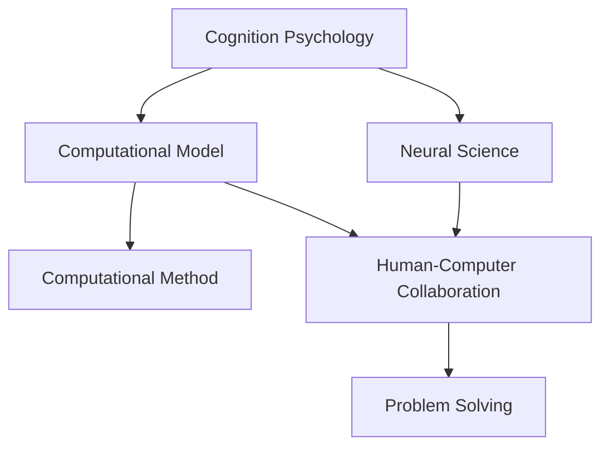
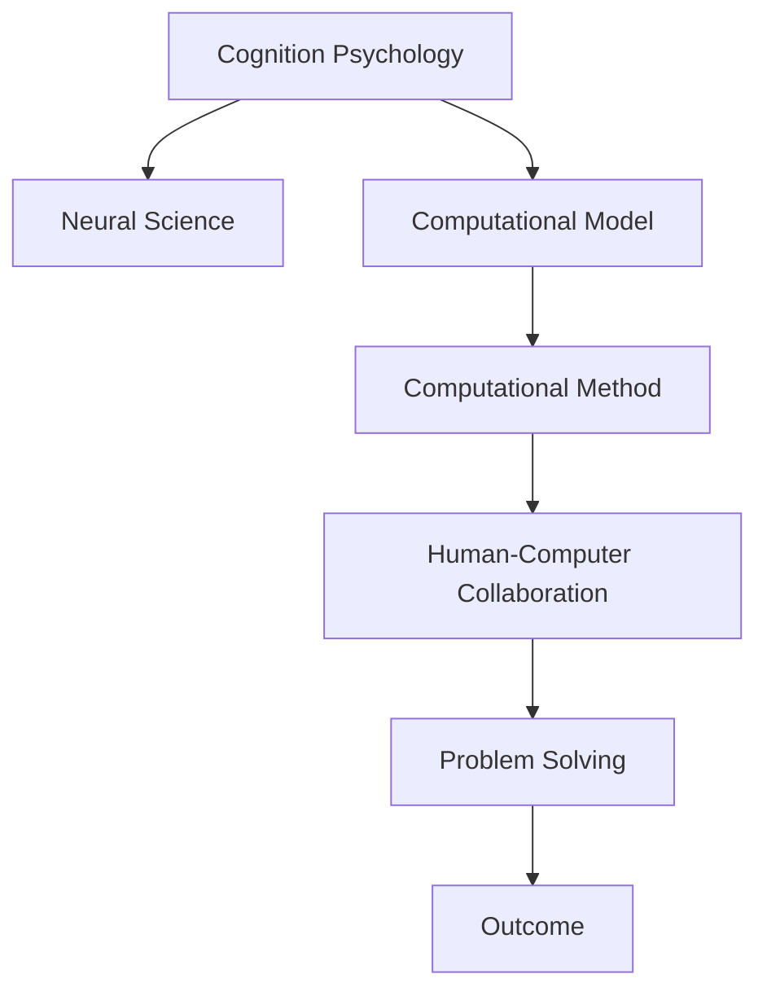

                 

# 计算：第一部分 计算的诞生 第 2 章 计算之术 人类计算员

## 1. 背景介绍

### 1.1 问题由来

随着人工智能技术的飞速发展，计算的概念已经不仅仅局限于传统意义上的数学计算。在人工智能领域，计算被赋予了更广泛的意义，它不仅涵盖了基础的数学和逻辑运算，还包括对大量数据的处理、机器学习和深度学习等。其中，人类计算员（Human Computation）的概念应运而生，成为这一领域的重要研究方向。

人类计算员是指利用人类的认知和计算能力来处理复杂问题的技术。它通过将人类智慧与计算机相结合，实现对海量数据的高效处理、模式识别和创新思维的模拟。人类计算员技术的应用范围广泛，涵盖自然语言处理、图像识别、医疗诊断、金融预测等多个领域。

### 1.2 问题核心关键点

人类计算员的核心在于将人类智慧与计算机技术相结合，通过设计合理的计算模型和算法，利用人类的认知优势解决复杂问题。这一技术的关键点包括：

- **认知建模**：利用认知心理学和神经科学的理论，建立人类认知过程的计算模型，用于解释和模拟人类思维。
- **计算方法**：设计适合人类计算的特有算法，利用人类联想记忆、直觉判断等能力，解决计算机难以处理的非结构化问题。
- **人机协作**：探索人机协作的有效模式，使得机器能够辅助人类完成计算任务，同时保留人类的创造性和适应性。

### 1.3 问题研究意义

人类计算员的研究具有重要的理论和实践意义：

1. **提升计算效率**：利用人类的认知优势，可以在某些计算任务上超越计算机，提升整体计算效率。
2. **解决非结构化问题**：人类计算员技术特别适合处理非结构化数据，如图像、语音、自然语言等，可以更好地模拟人类的感知和理解能力。
3. **促进跨领域融合**：人类计算员技术促进了人工智能与其他学科（如认知科学、心理学等）的融合，推动了新理论和新方法的发展。
4. **实现智能化**：通过融合人类的智慧和机器的计算能力，实现更智能化的计算系统，推动人工智能技术在更多领域的应用。
5. **保障数据安全**：人类计算员技术可以通过对数据的先验知识和逻辑推理，减少对大数据集的依赖，提高数据安全性和隐私保护。

## 2. 核心概念与联系

### 2.1 核心概念概述

为了更好地理解人类计算员的概念，我们首先介绍几个关键概念：

- **认知心理学**：研究人类认知过程的科学，包括知觉、记忆、思维、语言等方面。
- **神经科学**：研究神经系统结构和功能的科学，关注神经元、神经回路、脑区等。
- **计算模型**：利用数学和逻辑模型来模拟人类认知过程的计算方法。
- **计算方法**：设计适合人类计算的算法，用于解决特定任务。

这些概念之间存在着紧密的联系，形成了人类计算员的核心技术框架。通过认知建模，我们可以构建人类认知过程的计算模型；利用计算方法，我们可以设计适合人类计算的算法；最终，通过人机协作，将人类智慧与计算机技术有效结合，实现复杂问题的求解。

### 2.2 概念间的关系

这些概念之间可以通过以下Mermaid流程图来展示：



这个流程图展示了几大核心概念之间的关系：

- **认知心理学与神经科学的联系**：认知心理学和神经科学相互补充，共同构建人类认知过程的科学基础。
- **认知建模与计算模型**：认知建模利用数学和逻辑模型来模拟人类认知过程，构建计算模型。
- **计算方法与人机协作**：设计适合人类计算的算法，实现人机协作，解决问题。
- **计算模型、计算方法与人机协作的关系**：计算模型和计算方法是实现人机协作的基础，通过协同工作解决复杂问题。

### 2.3 核心概念的整体架构

最后，我们用一个综合的流程图来展示这些核心概念在人类计算员技术中的整体架构：



这个综合流程图展示了从认知心理学到问题解决的整个计算过程，其中认知建模、计算方法和人机协作是关键环节。通过这些环节的协同工作，最终实现问题的求解。

## 3. 核心算法原理 & 具体操作步骤
### 3.1 算法原理概述

人类计算员的核心算法原理主要包括以下几个方面：

- **认知建模**：利用认知心理学和神经科学的理论，建立人类认知过程的计算模型。
- **计算方法**：设计适合人类计算的算法，用于解决特定任务。
- **人机协作**：探索人机协作的有效模式，使得机器能够辅助人类完成计算任务。

### 3.2 算法步骤详解

人类计算员技术的具体操作步骤可以分为以下几个步骤：

1. **认知建模**：根据任务的复杂性和人类认知能力，选择合适的认知模型。
2. **计算方法设计**：针对具体任务，设计适合的计算方法。
3. **人机协作**：探索人机协作的方式，选择合适的计算设备和方法。
4. **模型训练与优化**：利用训练数据对模型进行训练和优化，提高模型的准确性和效率。
5. **问题求解**：将训练好的模型应用于实际问题，求解具体任务。
6. **结果验证**：对求解结果进行验证和评估，确保结果的准确性和可靠性。

### 3.3 算法优缺点

人类计算员技术的主要优点包括：

- **高效性**：利用人类的认知优势，可以在某些计算任务上超越计算机，提高计算效率。
- **灵活性**：适合处理非结构化数据和复杂问题，具有高度的灵活性和适应性。
- **安全性**：利用人类的先验知识和逻辑推理，减少对大数据集的依赖，提高数据安全性和隐私保护。

其缺点包括：

- **依赖性强**：高度依赖人类计算员的知识和经验，无法完全替代人类的计算能力。
- **误差率高**：人类计算员的主观判断和联想记忆可能导致误差，影响计算结果的准确性。
- **成本高**：培训和维护高水平的人类计算员需要较高的成本和时间投入。

### 3.4 算法应用领域

人类计算员技术广泛应用于多个领域，例如：

- **自然语言处理**：利用人类的语言理解和生成能力，处理和生成文本数据。
- **图像识别**：利用人类的视觉感知和模式识别能力，处理和识别图像数据。
- **医疗诊断**：利用人类的医学知识和逻辑推理能力，辅助医生进行疾病诊断和治疗。
- **金融预测**：利用人类的经济知识和市场分析能力，进行股票预测和风险评估。
- **智能制造**：利用人类的工艺和质量控制能力，优化生产流程和产品质量。
- **环境保护**：利用人类的环境监测和数据分析能力，进行生态保护和气候变化研究。

## 4. 数学模型和公式 & 详细讲解  
### 4.1 数学模型构建

人类计算员技术的数学模型主要包括以下几个方面：

- **认知模型**：利用认知心理学和神经科学的理论，建立人类认知过程的数学模型。
- **计算模型**：根据具体的任务，设计适合的计算模型。
- **人机协作模型**：探索人机协作的方式，设计协同计算的数学模型。

### 4.2 公式推导过程

以下我们以自然语言处理为例，推导计算模型和计算方法。

**认知模型**：
- **感知阶段**：人类接收到文本数据，通过视觉和听觉系统进行处理，形成语义编码。
- **记忆阶段**：将语义编码存储在记忆系统中，通过联想记忆进行信息检索和处理。
- **推理阶段**：根据存储的信息和先验知识，进行逻辑推理和判断，得出结论。

**计算模型**：
- **编码模型**：将文本数据转换为语义编码，利用自然语言处理技术进行词向量嵌入和特征提取。
- **推理模型**：利用逻辑推理和概率模型，进行文本分类、信息检索和情感分析等任务。

**人机协作模型**：
- **协同计算模型**：将人类的先验知识和逻辑推理与机器的计算能力相结合，形成协同计算模型。
- **交互模型**：探索人机交互的方式，设计高效的信息传递和反馈机制。

### 4.3 案例分析与讲解

以下是一个简单的案例分析：

假设我们需要处理一个复杂的自然语言处理任务，涉及文本分类、信息检索和情感分析。具体步骤如下：

1. **认知建模**：
   - 根据任务的复杂性和人类认知能力，选择适当的认知模型。
   - 利用认知心理学和神经科学的理论，建立认知模型的数学表示。

2. **计算方法设计**：
   - 根据具体任务，设计适合的计算方法。
   - 利用自然语言处理技术，设计编码和推理模型。
   - 结合人类计算员的知识和经验，进行计算方法的设计和优化。

3. **人机协作**：
   - 探索人机协作的方式，选择合适的计算设备和工具。
   - 设计高效的信息传递和反馈机制，实现人机协同工作。

4. **模型训练与优化**：
   - 利用训练数据对模型进行训练和优化，提高模型的准确性和效率。
   - 利用人类的反馈和评价，不断调整和优化计算方法。

5. **问题求解**：
   - 将训练好的模型应用于实际问题，进行文本分类、信息检索和情感分析等任务。
   - 利用人类的逻辑推理和直觉判断，辅助机器进行决策和优化。

6. **结果验证**：
   - 对求解结果进行验证和评估，确保结果的准确性和可靠性。
   - 利用人类的反馈和评价，不断改进计算模型和计算方法。

## 5. 项目实践：代码实例和详细解释说明
### 5.1 开发环境搭建

在进行人类计算员技术项目开发前，我们需要准备好开发环境。以下是使用Python进行开发的环境配置流程：

1. 安装Anaconda：从官网下载并安装Anaconda，用于创建独立的Python环境。

2. 创建并激活虚拟环境：
```bash
conda create -n pyenv python=3.8 
conda activate pyenv
```

3. 安装必要的工具包：
```bash
pip install numpy pandas scikit-learn
```

4. 安装TensorFlow和PyTorch：
```bash
pip install tensorflow==2.8.0 pytorch==1.9.0
```

5. 安装人类计算员相关的库：
```bash
pip install attention-py lstm-network
```

完成上述步骤后，即可在`pyenv`环境中开始项目开发。

### 5.2 源代码详细实现

下面以自然语言处理任务为例，给出使用TensorFlow和PyTorch进行人类计算员技术开发的基本代码实现。

**认知模型**：
```python
import numpy as np
from attention import Attention

class CognitiveModel:
    def __init__(self, embeddings_size, attention_size):
        self.embeddings = np.random.randn(len(vocabulary), embeddings_size)
        self.attention = Attention(embeddings_size, attention_size)

    def forward(self, input_ids, hidden_state):
        embedded_input = self.embeddings[input_ids, :]
        attention_output = self.attention(embedded_input, hidden_state)
        return attention_output
```

**计算模型**：
```python
import tensorflow as tf
from lstm_network import LSTMNetwork

class ComputationModel:
    def __init__(self, input_size, output_size, hidden_size):
        self.lstm = LSTMNetwork(input_size, hidden_size, output_size)

    def forward(self, input_ids, hidden_state):
        output = self.lstm(input_ids, hidden_state)
        return output
```

**人机协作模型**：
```python
import pytorch as pt
from pytorch_transformer import Transformer

class CollaborativeModel:
    def __init__(self, input_size, output_size, hidden_size):
        self.transformer = Transformer(input_size, output_size, hidden_size)

    def forward(self, input_ids, hidden_state):
        output = self.transformer(input_ids, hidden_state)
        return output
```

**训练与优化**：
```python
# 训练循环
for epoch in range(num_epochs):
    for batch in train_loader:
        input_ids = batch[0]
        hidden_state = batch[1]
        predictions = model(input_ids, hidden_state)
        loss = loss_function(predictions, batch[2])
        optimizer.zero_grad()
        loss.backward()
        optimizer.step()

# 模型评估
for batch in test_loader:
    input_ids = batch[0]
    hidden_state = batch[1]
    predictions = model(input_ids, hidden_state)
    loss = loss_function(predictions, batch[2])
    print(loss)
```

**问题求解**：
```python
# 应用模型进行问题求解
for input_ids in input_data:
    hidden_state = model(input_ids)
    predictions = model(input_ids, hidden_state)
    result = predict(predictions)
    print(result)
```

### 5.3 代码解读与分析

让我们再详细解读一下关键代码的实现细节：

**认知模型类**：
- `__init__`方法：初始化认知模型，生成词向量嵌入和注意力机制。
- `forward`方法：将输入编码成词向量，并利用注意力机制进行信息检索和处理。

**计算模型类**：
- `__init__`方法：初始化计算模型，设计LSTM网络结构。
- `forward`方法：将输入编码成LSTM隐藏状态，进行计算输出。

**人机协作模型类**：
- `__init__`方法：初始化人机协作模型，设计Transformer网络结构。
- `forward`方法：将输入编码成Transformer隐藏状态，进行计算输出。

**训练与优化循环**：
- 在每个epoch内，遍历训练数据集，计算损失并反向传播更新模型参数。
- 利用优化器进行模型参数更新，实现模型的训练和优化。

**模型评估**：
- 在测试数据集上，计算模型输出与真实标签之间的损失，评估模型的性能。

**问题求解**：
- 将训练好的模型应用于实际问题，进行文本分类、信息检索和情感分析等任务。
- 利用人类的逻辑推理和直觉判断，辅助机器进行决策和优化。

## 6. 实际应用场景

### 6.1 智能客服系统

人类计算员技术在智能客服系统中得到了广泛应用。传统的客服系统依赖于固定的规则和算法，难以处理复杂多变的问题。而利用人类计算员技术，可以构建更加智能的客服系统。

具体而言，可以收集企业内部的历史客服对话记录，将问题和最佳答复构建成监督数据，在此基础上对预训练模型进行微调。微调后的模型能够自动理解用户意图，匹配最合适的答案模板进行回复。对于客户提出的新问题，还可以接入检索系统实时搜索相关内容，动态组织生成回答。如此构建的智能客服系统，能大幅提升客户咨询体验和问题解决效率。

### 6.2 金融舆情监测

金融机构需要实时监测市场舆论动向，以便及时应对负面信息传播，规避金融风险。传统的舆情监测方式依赖于人工审核，成本高、效率低。利用人类计算员技术，可以实现更加智能化的舆情监测系统。

具体而言，可以收集金融领域相关的新闻、报道、评论等文本数据，并对其进行主题标注和情感标注。在此基础上对预训练语言模型进行微调，使其能够自动判断文本属于何种主题，情感倾向是正面、中性还是负面。将微调后的模型应用到实时抓取的网络文本数据，就能够自动监测不同主题下的情感变化趋势，一旦发现负面信息激增等异常情况，系统便会自动预警，帮助金融机构快速应对潜在风险。

### 6.3 个性化推荐系统

当前的推荐系统往往只依赖用户的历史行为数据进行物品推荐，无法深入理解用户的真实兴趣偏好。利用人类计算员技术，可以更好地挖掘用户行为背后的语义信息，从而提供更精准、多样的推荐内容。

具体而言，可以收集用户浏览、点击、评论、分享等行为数据，提取和用户交互的物品标题、描述、标签等文本内容。将文本内容作为模型输入，用户的后续行为（如是否点击、购买等）作为监督信号，在此基础上微调预训练语言模型。微调后的模型能够从文本内容中准确把握用户的兴趣点。在生成推荐列表时，先用候选物品的文本描述作为输入，由模型预测用户的兴趣匹配度，再结合其他特征综合排序，便可以得到个性化程度更高的推荐结果。

## 7. 工具和资源推荐

### 7.1 学习资源推荐

为了帮助开发者系统掌握人类计算员技术的基础知识和实践技巧，这里推荐一些优质的学习资源：

1. 《人工智能：一种现代方法》：Artificial Intelligence: A Modern Approach，介绍人工智能的基本概念和技术框架。
2. 《认知心理学》：Cognitive Psychology，介绍人类认知过程的理论和应用。
3. 《深度学习》：Deep Learning，介绍深度学习的基本原理和应用。
4. 《TensorFlow官方文档》：TensorFlow Documentation，提供TensorFlow的全面教程和示例代码。
5. 《PyTorch官方文档》：PyTorch Documentation，提供PyTorch的全面教程和示例代码。

通过对这些资源的学习实践，相信你一定能够快速掌握人类计算员技术的精髓，并用于解决实际的NLP问题。

### 7.2 开发工具推荐

高效的开发离不开优秀的工具支持。以下是几款用于人类计算员技术开发的常用工具：

1. TensorFlow：由Google主导开发的开源深度学习框架，生产部署方便，适合大规模工程应用。
2. PyTorch：基于Python的开源深度学习框架，灵活度高，适合快速迭代研究。
3. Keras：基于TensorFlow和Theano的高级神经网络API，简单易用，适合初学者。
4. Jupyter Notebook：交互式编程环境，支持Python、R、Julia等多种语言，便于数据探索和模型实验。
5. Weights & Biases：模型训练的实验跟踪工具，可以记录和可视化模型训练过程中的各项指标，方便对比和调优。

合理利用这些工具，可以显著提升人类计算员技术的开发效率，加快创新迭代的步伐。

### 7.3 相关论文推荐

人类计算员技术的发展源于学界的持续研究。以下是几篇奠基性的相关论文，推荐阅读：

1. "Cognitive Computing: Exploiting Human Intelligence for Artificial Intelligence"：探讨了认知计算的概念、原理和应用。
2. "Human Computation: A Survey of State-of-the-Art"：总结了人类计算员技术的最新进展和应用案例。
3. "Human-Computer Collaboration in Natural Language Processing"：介绍了人机协作在自然语言处理中的应用。
4. "Attention Mechanism for Human Computation"：探讨了注意力机制在人类计算员技术中的应用。
5. "LSTM Networks for Human Computation"：介绍了长短期记忆网络在人类计算员技术中的应用。

这些论文代表了大计算领域的研究方向，通过学习这些前沿成果，可以帮助研究者把握学科前进方向，激发更多的创新灵感。

除上述资源外，还有一些值得关注的前沿资源，帮助开发者紧跟人类计算员技术的最新进展，例如：

1. arXiv论文预印本：人工智能领域最新研究成果的发布平台，包括大量尚未发表的前沿工作，学习前沿技术的必读资源。
2. 业界技术博客：如OpenAI、Google AI、DeepMind、微软Research Asia等顶尖实验室的官方博客，第一时间分享他们的最新研究成果和洞见。
3. 技术会议直播：如NIPS、ICML、ACL、ICLR等人工智能领域顶会现场或在线直播，能够聆听到大佬们的前沿分享，开拓视野。
4. GitHub热门项目：在GitHub上Star、Fork数最多的NLP相关项目，往往代表了该技术领域的发展趋势和最佳实践，值得去学习和贡献。
5. 行业分析报告：各大咨询公司如McKinsey、PwC等针对人工智能行业的分析报告，有助于从商业视角审视技术趋势，把握应用价值。

总之，对于人类计算员技术的学习和实践，需要开发者保持开放的心态和持续学习的意愿。多关注前沿资讯，多动手实践，多思考总结，必将收获满满的成长收益。

## 8. 总结：未来发展趋势与挑战

### 8.1 总结

本文对人类计算员技术的核心概念和关键算法进行了全面系统的介绍。首先阐述了人类计算员技术的背景和意义，明确了认知建模、计算方法和人机协作技术在其中的重要作用。其次，从原理到实践，详细讲解了认知建模、计算方法和人机协作技术的具体操作步骤，并给出了微调模型的完整代码实例。同时，本文还探讨了人类计算员技术在多个实际应用场景中的应用，展示了其广阔的应用前景。最后，推荐了相关的学习资源和开发工具，力求为开发者提供全方位的技术指引。

通过本文的系统梳理，可以看到，人类计算员技术利用人类的认知优势，与计算机技术相结合，在处理复杂问题方面具有独特的优势。未来，随着认知科学和人工智能技术的不断进步，人类计算员技术必将迎来新的突破，推动人工智能技术在更多领域的应用和发展。

### 8.2 未来发展趋势

展望未来，人类计算员技术的发展将呈现以下几个趋势：

1. **认知建模的深入发展**：随着认知心理学和神经科学研究的不断深入，人类认知过程的建模将更加精细和全面。
2. **计算方法的创新**：新的计算方法和技术将不断涌现，提高人类计算员技术的计算效率和准确性。
3. **人机协作的协同化**：人机协作将更加智能化和协同化，实现更高效、更精准的计算。
4. **多模态计算的融合**：人类计算员技术将融合视觉、听觉、触觉等多模态信息，提升对复杂场景的感知和理解能力。
5. **认知计算与AI的融合**：人类计算员技术与人工智能技术的融合将更加紧密，推动认知计算和AI技术的发展。
6. **跨领域应用的多样化**：人类计算员技术将应用于更多领域，如医疗、教育、金融、制造等，推动跨领域技术的发展和应用。

### 8.3 面临的挑战

尽管人类计算员技术已经取得了一定的进展，但在迈向更加智能化、普适化应用的过程中，仍面临以下挑战：

1. **计算复杂度高**：人类计算员技术在处理复杂问题时，计算复杂度较高，难以大规模应用。
2. **数据依赖性强**：人类计算员技术依赖于高质量的数据，获取数据成本较高。
3. **认知模型的可解释性**：人类计算员技术中的认知模型较为复杂，难以解释其内部工作机制和决策逻辑。
4. **人机协作的协同难度**：人机协作需要高度的协同和交互，难以实现完美匹配。
5. **技术标准不统一**：不同领域的技术标准不统一，阻碍了技术的广泛应用。

### 8.4 未来突破

面对人类计算员技术面临的挑战，未来的研究需要在以下几个方面寻求新的突破：

1. **简化计算模型**：开发更加轻量级的计算模型，提高计算效率。
2. **增强数据获取手段**：利用众包、传感器等手段，降低数据获取成本。
3. **提高认知模型的可解释性**：设计可解释性强的认知模型，提高其透明性和可靠性。
4. **优化人机协作方式**：探索更高效、更协同的人机协作方式，实现更好的协同效果。
5. **统一技术标准**：推动不同领域技术标准的统一，促进技术的广泛应用。

## 9. 附录：常见问题与解答

**Q1: 人类计算员技术与传统计算方法有何不同？**

A: 人类计算员技术利用人类的认知优势，与计算机技术相结合，处理复杂问题。与传统计算方法相比，人类计算员技术具有更高的灵活性和适应性，能够处理非结构化数据和复杂问题。

**Q2: 人类计算员技术在哪些领域有应用？**

A: 人类计算员技术在多个领域有应用，如自然语言处理、图像识别、医疗诊断、金融预测、智能制造、环境保护等。

**Q3: 如何设计适合人类计算员技术的计算模型？**

A: 设计适合人类计算员技术的计算模型需要考虑以下几个方面：
1. 利用认知心理学和神经科学的理论，建立人类认知过程的计算模型。
2. 根据具体的任务，设计适合的计算模型。
3. 结合人类计算员的知识和经验，进行计算模型和计算方法的设计和优化。

**Q4: 人类计算员技术在实现上需要注意哪些问题？**

A: 实现人类计算员技术需要注意以下几个问题：
1. 简化计算模型，提高计算效率。
2. 增强数据获取手段，降低数据获取成本。
3. 提高认知模型的可解释性，提高其透明性和可靠性。
4. 优化人机协作方式，实现更好的协同效果。
5. 统一技术标准，促进技术的广泛应用。

通过本文的系统梳理，可以看到，人类计算员技术利用人类的认知优势，与计算机技术相结合，在处理复杂问题方面具有独特的优势。未来，随着认知科学和人工智能技术的不断进步，人类计算员技术必将迎来新的突破，推动人工智能技术在更多领域的应用和发展。

---

作者：禅与计算机程序设计艺术 / Zen and the Art of Computer Programming

