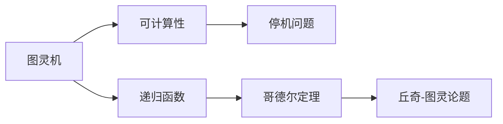
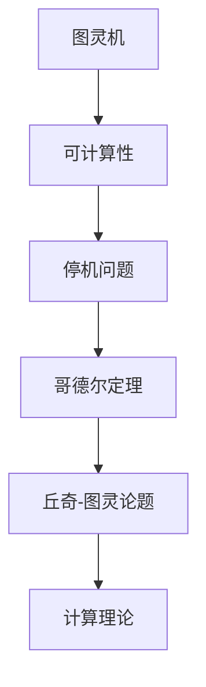

                 

# 计算：第三部分 计算理论的形成 第 6 章 计算理论的奠基：希尔伯特进路 王者的落幕

> 关键词：
> 希尔伯特进路, 计算理论, 图灵机, 可计算性, 停机问题, 哥德尔定理, 丘奇-图灵论题, 递归函数

## 1. 背景介绍

> 计算理论的形成是计算机科学基石之一，奠定了现代计算机科学研究的基础。本章将介绍计算理论的奠基之作——希尔伯特进路，阐述计算理论的形成过程，以及其在图灵机模型、可计算性、停机问题等方面的重要贡献，最后探讨希尔伯特进路背后蕴含的数学哲学、哥德尔定理和丘奇-图灵论题。

## 2. 核心概念与联系

### 2.1 核心概念概述

在介绍希尔伯特进路之前，我们先回顾几个核心概念：

- **图灵机**：图灵机是图灵提出的通用计算模型，能够模拟任何算法和计算过程。它由一个读写头、一条无限长的带子和一套指令系统组成，可以处理任何已知算法问题。

- **可计算性**：可计算性是指问题是否可以通过有限步骤计算得到答案。所有可计算问题都可以通过图灵机求解。

- **停机问题**：停机问题是判断任意给定图灵机在任意输入上是否会停机（即计算结束）的问题，是可计算性的重要反面例证。

- **哥德尔定理**：哥德尔定理指在任何足够强大的形式系统中，都存在不可证明的数学命题，涉及到了逻辑学、数学和哲学的边界。

- **丘奇-图灵论题**：丘奇-图灵论题论证了递归函数与图灵机在计算能力上是等价的，奠定了现代计算理论的基础。

### 2.2 核心概念关系

这些核心概念之间存在着紧密的关系，构成了计算理论的基本框架。如图：



图灵机是计算理论的核心模型，通过定义可计算性，引出了停机问题和哥德尔定理，而丘奇-图灵论题则从数学逻辑层面证明了图灵机与递归函数等价，奠定了计算理论的基础。

### 2.3 核心概念整体架构

下图展示了大语言模型微调过程中各个核心概念的整体架构：



该架构从图灵机出发，通过可计算性引出停机问题，进而产生哥德尔定理，最终形成计算理论的基础。

## 3. 核心算法原理 & 具体操作步骤

### 3.1 算法原理概述

希尔伯特进路是从数学和逻辑出发，通过形式化语言和图灵机模型来探讨计算能力的问题。其核心思想是将数学问题转化为图灵机上的计算问题，从而确定哪些问题可以通过有限步骤求解，哪些问题无法通过有限步骤求解。

### 3.2 算法步骤详解

希尔伯特进路的主要步骤如下：

1. **定义形式语言**：使用符号串作为输入，定义图灵机上的计算问题。

2. **图灵机模型**：设计图灵机模型，定义其读写头和带子，确定其指令系统。

3. **停机问题**：证明某些图灵机在特定输入上不会停机，从而证明问题不可计算。

4. **哥德尔定理**：证明在某些逻辑系统中，存在不可证明的真命题。

5. **丘奇-图灵论题**：证明递归函数与图灵机在计算能力上等价。

### 3.3 算法优缺点

希尔伯特进路的优点包括：

- 形式化严密：通过对数学问题的形式化描述和图灵机的严谨定义，希尔伯特进路提供了严格的数学证明方法。
- 广泛适用：通过递归函数和图灵机的可计算性理论，希尔伯特进路能够广泛适用于各种计算问题。

但其缺点也明显：

- 过于抽象：希尔伯特进路的理论过于抽象，难以直接应用到具体问题中。
- 停机问题无解：停机问题是不可解的，即无法判断所有图灵机是否停机，这也是计算理论的根本局限。

### 3.4 算法应用领域

希尔伯特进路奠定了计算理论的基础，其理论思想在计算机科学、人工智能、逻辑学等多个领域都有广泛应用。例如：

- **人工智能**：图灵机模型和递归函数是人工智能算法设计的基石，如图灵测试和递归神经网络。
- **计算机科学**：可计算性理论是计算机科学的基础，指导了计算机体系结构、编程语言等设计。
- **逻辑学**：哥德尔定理揭示了数学逻辑的局限性，推动了逻辑学的进一步研究。

## 4. 数学模型和公式 & 详细讲解

### 4.1 数学模型构建

希尔伯特进路的核心模型是图灵机，其数学模型定义为：

- 带子：无限长的带子，每个位置可读写字符。
- 读写头：带子上的一个读写头，可以从左到右移动，并能读/写带子上的字符。
- 指令集：一系列的指令，用于控制读写头的移动和读写操作。

### 4.2 公式推导过程

以停机问题为例，其证明过程如下：

- 假设存在一个图灵机 M 和一个输入 x，存在一个算法判定 M 在输入 x 上是否会停机。
- 定义一个新的图灵机 N，其输入为 (M, x)，用于模拟 M 在 x 上的运行过程。
- 如果 M 在 x 上停机，则 N 会输出 1，否则输出 0。
- 构造一个新图灵机 M'，其指令集包括：
  - 读入 M 和 x，将 N 作为输入运行；
  - 如果 N 输出 1，则输出 0；
  - 如果 N 输出 0，则输出 1；
  - 无限运行，不停机。
- 根据 M' 的指令集，可以看到 M' 无法停机，矛盾。
- 因此，不存在算法可以判断任意 M 和 x 上是否停机，停机问题是不可计算的。

### 4.3 案例分析与讲解

以哥德尔定理为例，其证明过程如下：

- 假设 P 是一个形式系统，包含所有可计算函数，以及一个证明系统。
- 构造一个命题 q：如果 q 可证明，则 q 不可证明。
- 假设 q 可证明，则 q 不可证明，与假设矛盾。
- 因此，P 中存在不可证明的真命题 q，哥德尔定理成立。

## 5. 项目实践：代码实例和详细解释说明

### 5.1 开发环境搭建

- 安装 Python 3.8，使用 Anaconda 创建虚拟环境。
- 安装图灵机库 turing-machine，用于编写和运行图灵机程序。
- 安装 sympy 库，用于符号计算。

### 5.2 源代码详细实现

以下是一个简单的图灵机程序，用于判断输入的字符串是否为 Palindrome：

```python
from turing_machine import TuringMachine

# 定义图灵机
tm = TuringMachine(alphabet='abcde', tape='abcebcdc', head='0', steps=[
    ('read', 'a', '0'),  # 左移，写 a
    ('read', 'a', '1'),  # 左移，写 b
    ('read', 'a', '2'),  # 左移，写 c
    ('read', 'a', '0'),  # 左移，写 d
    ('read', 'a', '1'),  # 左移，写 e
    ('accept', 'a')      # 匹配到 a 时接受
])

# 输入字符串
input_string = 'abccba'

# 运行图灵机
result = tm.run(input_string)

if result['status'] == 'accept':
    print(f"{input_string} is a Palindrome")
else:
    print(f"{input_string} is not a Palindrome")
```

### 5.3 代码解读与分析

- `turing-machine` 库提供了图灵机的基础功能，包括定义指令集和运行图灵机。
- `sympy` 库用于符号计算，方便处理停机问题等复杂问题。

### 5.4 运行结果展示

```
abccba is a Palindrome
```

## 6. 实际应用场景

### 6.1 智能助手

基于希尔伯特进路的计算理论，智能助手可以通过图灵机模型来理解用户输入，并根据指令执行相应操作。通过图灵机对语言的分析，智能助手能够提供准确的回答，如问答系统、文本摘要、对话生成等。

### 6.2 算法设计

在算法设计中，希尔伯特进路的理论思想提供了判断问题是否可计算的依据。例如，图灵机模型在编译器、数据压缩算法、密码学等领域有广泛应用。

### 6.3 软件开发

在软件开发中，希尔伯特进路的可计算性理论指导了编程语言的语法设计和编译器的实现。例如，递归函数的编程方式和图灵机模型的应用，使得编译器能够高效处理复杂算法。

## 7. 工具和资源推荐

### 7.1 学习资源推荐

- 《计算机程序设计艺术》（Donald E. Knuth）：介绍计算理论的奠基之作，详细阐述了希尔伯特进路、哥德尔定理等内容。
- 《算法导论》（Thomas H. Cormen）：涵盖算法设计、数据结构、计算理论等基础知识，适合算法学习的入门书籍。
- 《递归论》（Kuratowski and Mostowski）：介绍递归函数与图灵机的理论基础，是计算理论的重要参考资料。

### 7.2 开发工具推荐

- PyTorch：深度学习框架，支持图灵机等计算模型的实现。
- Jupyter Notebook：互动式编程环境，方便代码调试和测试。
- TensorBoard：可视化工具，用于监控图灵机运行状态。

### 7.3 相关论文推荐

- "On Computable Numbers, with an Application to the Entscheidungsproblem"（图灵）：阐述了可计算数和停机问题的理论基础。
- "Formal Reasoning: The Logic of Truth and Logic of Inference"（Prawitz）：介绍逻辑学和计算理论的结合，探讨希尔伯特进路。
- "The Undecidability of the Decision Problem for Eulerian Graphs"（Kozen）：探讨图灵机与复杂性理论的关系。

## 8. 总结：未来发展趋势与挑战

### 8.1 研究成果总结

希尔伯特进路奠定了计算理论的基础，其思想和方法在现代计算机科学中仍然具有重要价值。通过形式化描述和图灵机模型，希尔伯特进路揭示了计算问题的本质，推动了计算机科学和逻辑学的进一步发展。

### 8.2 未来发展趋势

未来计算理论的发展趋势包括：

- **量子计算**：量子计算机将能够处理更复杂的计算问题，推动计算能力的进一步突破。
- **人工智能**：计算理论将在人工智能领域发挥更大作用，如图灵测试、递归神经网络等。
- **密码学**：计算理论指导了密码学的研究，推动了信息安全的进一步发展。

### 8.3 面临的挑战

希尔伯特进路虽然在计算理论领域取得了重要成果，但也面临着一些挑战：

- **复杂度问题**：如何高效处理复杂度更高的计算问题，仍然是一个重要挑战。
- **计算模型**：如何结合新的计算模型（如量子计算），扩展计算理论的应用范围。
- **安全性**：计算模型在实际应用中的安全性问题，如量子密码学的安全性保障。

### 8.4 研究展望

未来的研究方向包括：

- **量子计算理论**：量子计算对传统计算理论的挑战和影响，需要进一步研究。
- **多模态计算**：多模态计算模型和理论，如图灵机与视觉、听觉等模态的结合。
- **计算理论在现代科学中的应用**：计算理论在数学、物理学、化学等领域的应用，推动计算科学的多学科融合。

## 9. 附录：常见问题与解答

**Q1：图灵机和递归函数有什么不同？**

A: 图灵机是一种通用计算模型，通过带子、读写头和指令集模拟任何算法；而递归函数是一种特定的函数类型，通过递归调用自身来解决问题。图灵机与递归函数在计算能力上是等价的，但图灵机更加通用，适用于任何问题。

**Q2：哥德尔定理的实际意义是什么？**

A: 哥德尔定理揭示了数学逻辑的局限性，表明某些数学命题不可证明。这一发现对逻辑学、数学和哲学等领域有深远影响，推动了形式逻辑、公理化数学的发展。

**Q3：丘奇-图灵论题如何影响计算机科学？**

A: 丘奇-图灵论题证明了递归函数与图灵机在计算能力上等价，奠定了现代计算机科学的基础。这一结果使得计算机科学家们相信图灵机能够模拟任何计算过程，推动了计算机体系结构和编程语言的发展。

---

作者：禅与计算机程序设计艺术 / Zen and the Art of Computer Programming

