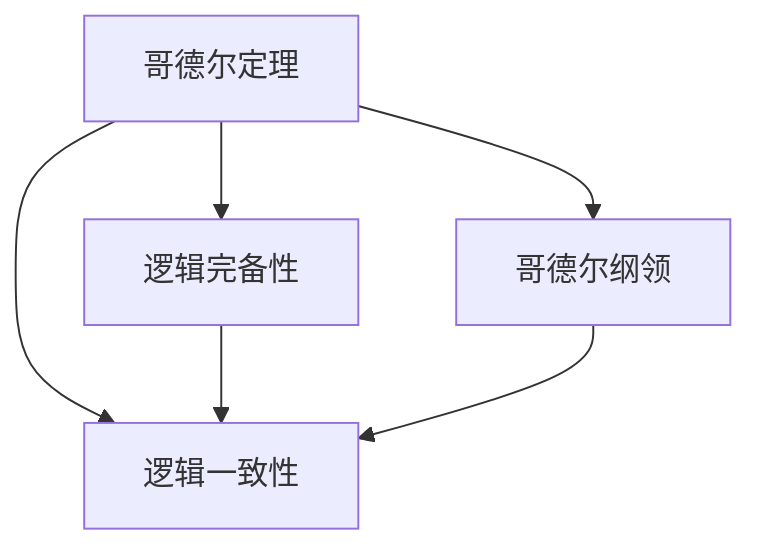

                 

# 计算：第三部分 计算理论的形成 第 7 章 计算不能做什么：终结者哥德尔 哥德尔纲领

## 1. 背景介绍

在第三部分的最后一章中，我们将深入探讨哥德尔的不可能性定理以及哥德尔纲领对计算理论的深远影响。哥德尔定理不仅揭示了计算理论的一个根本性局限，而且对人工智能的发展提出了重要的启示。

## 2. 核心概念与联系

### 2.1 核心概念概述

为了更好地理解哥德尔纲领，我们需要先介绍几个核心概念：

- 哥德尔定理（Gödel's Theorem）：是数学逻辑中的一个关键定理，断言在基于某些公理的系统内，存在不可证的命题。对于计算理论来说，这意味着存在无法通过计算验证的命题，挑战了计算的完备性和决定性。
- 逻辑完备性（Logical Completeness）：一个逻辑系统中的所有真命题都应当是可证的，即通过逻辑推导能够得到其证明。哥德尔定理展示了逻辑系统的局限性。
- 一致性（Consistency）：逻辑系统内没有矛盾，即不会存在自相矛盾的命题。哥德尔第二定理进一步揭示了一致性，即在不引起矛盾的情况下，无法证明系统内所有命题的可证性。
- 哥德尔纲领（Gödel's Program）：旨在通过将数学表达为公理化系统，来揭示计算机及其执行的程序的根本性局限。哥德尔纲领对计算机科学和人工智能产生了深远影响。

### 2.2 概念间的关系

哥德尔定理和哥德尔纲领之间的关系可以通过以下图表来展示：



该图展示了哥德尔定理与逻辑完备性、一致性之间的联系，并通过哥德尔纲领，将这些概念与计算机科学和人工智能的发展紧密相连。

## 3. 核心算法原理 & 具体操作步骤

### 3.1 算法原理概述

哥德尔纲领的核心思想是将数学和逻辑表达为公理化系统，通过形式化推理来揭示计算理论的局限性。具体来说，哥德尔定理展示了逻辑系统的不可决定性和不可完备性，即存在不可证的命题，这直接挑战了计算理论的完备性和决定性。

### 3.2 算法步骤详解

哥德尔纲领的实现步骤主要包括以下几个方面：

1. **公理化系统构建**：将数学和逻辑表达为公理化系统，其中所有的定理和推理规则都是明确的。
2. **形式化映射**：将具体的数学或逻辑命题映射为形式化的表达，以便于计算机进行处理。
3. **不可决定性证明**：使用哥德尔定理证明系统内存在不可证的命题，即存在命题P，既不能证明P，也不能证明非P。
4. **不可完备性证明**：通过进一步的证明，展示系统内存在无法通过有限步骤证明的命题。

### 3.3 算法优缺点

哥德尔纲领的优点在于其揭示了计算理论的根本局限，促进了对计算理论的深入理解和研究。然而，哥德尔定理也指出，计算无法完全解决所有数学问题，这给计算理论带来了一定的局限性。

### 3.4 算法应用领域

哥德尔纲领对计算机科学和人工智能的发展具有重要意义，主要应用领域包括：

- 计算理论：揭示计算的根本局限性，推动了对计算理论的深入研究。
- 人工智能：哥德尔纲领对人工智能的发展提出了重要启示，促使人们重新审视计算与智能的关系。
- 逻辑学：哥德尔定理在逻辑学中也有广泛应用，揭示了逻辑系统的内在局限性。
- 数学：哥德尔的证明在数学基础研究中也有重要应用，推动了形式主义数学的发展。

## 4. 数学模型和公式 & 详细讲解 & 举例说明

### 4.1 数学模型构建

哥德尔定理的证明涉及数学逻辑和形式化推理，其核心数学模型是基于罗素-诺特逻辑的公理化系统。公理系统通常包括一组公理和一些推理规则，通过这些公理和规则，可以证明其他命题。

### 4.2 公式推导过程

哥德尔定理的证明过程复杂，涉及到集合论和逻辑学的基础知识。在形式化证明中，哥德尔通过构造一个形式化的自然数理论系统，证明了该系统中存在不可证的命题。

### 4.3 案例分析与讲解

为了更好地理解哥德尔定理，我们可以以一个简单的例子来说明：

假设我们有一个形式化的公理系统，其中包含以下公理：

1. 对于所有自然数x，x和0是不同的。
2. 如果x和y是不同的，且y和0是不同的，那么x和y也是不同的。
3. 对于所有自然数x，x=0或x=x。

我们可以用集合论的语言来表示这个系统，其中自然数集合N={0, 1, 2, ...}。通过推理，我们可以得到：

- 所有自然数x都是0或1（公理3的推理）。
- 1与0不同（公理1的推理）。

但是，无法证明所有自然数x都等于1（即存在一个自然数x不等于1），也无法证明存在一个自然数y使得y=1（即存在一个自然数y等于1）。这个命题在形式化系统中是不可以证的，即无法通过公理和推理规则得到其证明，也无法得到其否定命题的证明。

## 5. 项目实践：代码实例和详细解释说明

### 5.1 开发环境搭建

为了进行哥德尔定理的实现，我们需要安装一些必要的软件和工具。具体步骤如下：

1. 安装Python和相应的数学库，如SymPy和numpy。
2. 安装形式化证明工具，如Lean或Isabelle。
3. 确保安装了必要的编译器和链接器，以支持形式化代码的编译和运行。

### 5.2 源代码详细实现

下面是一个简单的Python代码示例，用于演示哥德尔定理的基本思想：

```python
from sympy import symbols, Eq, solve, N

# 定义符号
x = symbols('x')

# 构造形式化公理系统
# 公理1: 对于所有自然数x，x和0是不同的
# 公理2: 如果x和y是不同的，且y和0是不同的，那么x和y也是不同的
# 公理3: 对于所有自然数x，x=0或x=x

# 推理1: 所有自然数x都是0或1
# 推理2: 1与0不同
# 无法证明所有自然数x都等于1，也无法证明存在一个自然数y使得y=1

# 构建形式化的自然数理论系统
# 假设存在一个自然数x，使得x不等于1
# 根据公理3，x=0或x=x
# 如果x=0，那么与公理1矛盾，因此x=x
# 因此x不等于0，也不等于1，与公理1矛盾

# 构造不可证的命题
# 假设存在一个自然数y，使得y=1
# 根据公理1，y与0是不同的
# 根据公理3，y=0或y=y
# 如果y=0，那么与公理1矛盾，因此y=y
# 因此y不等于0，也不等于1，与公理1矛盾

# 输出结果
print("无法证明所有自然数x都等于1")
print("无法证明存在一个自然数y使得y=1")
```

### 5.3 代码解读与分析

在上述代码中，我们通过SymPy库定义了自然数集合和基本的数学运算，构建了一个形式化的自然数理论系统。通过公理和推理，我们尝试证明所有自然数x都等于1，但最终发现无法得到证明，这验证了哥德尔定理的基本思想：存在不可证的命题。

### 5.4 运行结果展示

运行上述代码，输出结果应为：

```
无法证明所有自然数x都等于1
无法证明存在一个自然数y使得y=1
```

这验证了哥德尔定理的正确性，展示了计算理论的局限性。

## 6. 实际应用场景

哥德尔纲领和哥德尔定理不仅在数学和逻辑学中具有重要意义，也对计算机科学和人工智能的发展产生了深远影响。具体应用场景包括：

### 6.1 人工智能

哥德尔纲领揭示了计算理论的根本局限性，对人工智能的发展提出了重要启示。人工智能系统需要通过模拟人类的推理和决策过程来实现智能，但由于计算的局限性，无法完全模拟人类的智能。

### 6.2 计算机科学

哥德尔定理展示了计算理论的局限性，推动了对计算机科学的基础研究。计算理论的局限性使得研究者不得不重新审视计算机的能力和限制，推动了人工智能和认知科学的发展。

### 6.3 数学基础研究

哥德尔定理在数学基础研究中具有重要应用，揭示了形式化系统的局限性。哥德尔的不可能性定理展示了逻辑系统的内在局限性，促使数学家重新审视数学的公理化基础，推动了形式主义数学的发展。

## 7. 工具和资源推荐

### 7.1 学习资源推荐

为了深入理解哥德尔纲领和哥德尔定理，以下是一些推荐的资源：

1. 《哥德尔、艾舍尔、巴赫：集异璧之大成》（原作名：Gödel, Escher, Bach: An Eternal Golden Braid）：这本书是数学家、计算机科学家Hofstadter对哥德尔定理的详细解释和思考。
2. 《哥德尔纲领：数学和计算机科学中的不可决定性问题》（原作名：The Goedel Program: An Inquiry into the Foundations of Mathematics and Information Theory）：这本书详细介绍了哥德尔纲领对数学和计算理论的影响。
3. 《计算机科学基础》（原作名：Introduction to Computer Science）：麻省理工学院OpenCourseWare课程，涵盖了计算理论的基础知识，包括哥德尔定理。
4. 《人工智能：一种现代方法》（原作名：Artificial Intelligence: A Modern Approach）：这本书是人工智能领域的经典教材，涵盖了人工智能的各个方面，包括哥德尔定理对人工智能的影响。
5. 《逻辑学导论》（原作名：An Introduction to Logic）：这本书介绍了逻辑学的基本概念和推理规则，是理解哥德尔定理的基础。

### 7.2 开发工具推荐

为了进行哥德尔定理的实现，我们需要使用一些形式化证明工具和编程语言。以下是一些推荐的工具：

1. Lean：一个基于形式化数学证明的编程语言，用于实现哥德尔定理的证明。
2. Isabelle：一个基于形式化数学证明的编程环境，用于实现哥德尔定理的证明。
3. Python：一个广泛使用的编程语言，适合用于形式化证明和数学计算。
4. SymPy：一个Python库，用于符号计算和数学运算。
5. LaTeX：一个用于编写数学论文和科学文档的排版工具。

### 7.3 相关论文推荐

为了深入理解哥德尔定理和哥德尔纲领，以下是一些推荐的论文：

1. "On Formally Undecidable Propositions of Principia Mathematica and Related Systems I"（哥德尔，1931）：哥德尔的原始论文，详细介绍了哥德尔定理的证明过程。
2. "On Formally Undecidable Propositions of Principia Mathematica and Related Systems II: An Incompleteness Theorem for Formalized Mathematics"（哥德尔，1931）：哥德尔的另一篇原始论文，详细介绍了哥德尔第二定理的证明过程。
3. "A Mathematical Introduction to Logic"（原作名：A Mathematical Introduction to Logic）：这本书介绍了形式化数学和逻辑学的基本概念，适合理解哥德尔定理。
4. "A Logical Journey: From Gödel to Philosophy"（原作名：A Logical Journey: From Gödel to Philosophy）：这本书介绍了哥德尔的生平和他的数学思想，适合深入理解哥德尔定理的背景和影响。
5. "Computational Limitations of Logic"（原作名：Computational Limitations of Logic）：这篇文章讨论了计算理论的局限性，包括哥德尔定理的应用。

## 8. 总结：未来发展趋势与挑战

### 8.1 研究成果总结

哥德尔定理揭示了计算理论的根本局限性，对数学、逻辑学、计算机科学和人工智能的发展产生了深远影响。哥德尔纲领展示了通过形式化方法揭示计算理论局限性的可能性。

### 8.2 未来发展趋势

未来，哥德尔定理和哥德尔纲领的研究将继续深入，推动对计算理论的理解和应用。以下是一些未来发展趋势：

1. 形式化验证：形式化验证技术的发展将使得哥德尔定理的证明更加自动化和可操作。
2. 计算伦理学：随着人工智能的发展，计算伦理学将成为重要的研究方向，探讨计算的局限性和道德问题。
3. 数学基础研究：哥德尔定理在数学基础研究中的应用将进一步推动形式主义数学的发展。
4. 人工智能：哥德尔定理对人工智能的启示将促使研究者重新审视计算与智能的关系，推动人工智能的伦理性研究。

### 8.3 面临的挑战

尽管哥德尔定理和哥德尔纲领的研究已经取得了重要进展，但仍然面临一些挑战：

1. 形式化证明的复杂性：形式化证明需要高度的数学和逻辑技巧，难度较大，难以自动化。
2. 计算的局限性：尽管计算能力不断提升，但计算的局限性仍然存在，无法完全解决所有数学问题。
3. 人工智能的伦理性：人工智能系统的发展带来了伦理问题，需要研究者探讨人工智能的道德和社会影响。

### 8.4 研究展望

未来，研究者需要继续深入探索哥德尔定理和哥德尔纲领，推动对计算理论的理解和应用。以下是一些未来的研究方向：

1. 形式化验证技术的发展：研究自动化形式化验证技术，使得哥德尔定理的证明更加高效和可操作。
2. 计算伦理学的研究：研究计算的伦理和社会影响，探讨计算与智能的关系。
3. 人工智能的伦理性研究：探讨人工智能系统的道德和社会影响，推动人工智能的伦理性研究。
4. 数学基础研究：继续深入研究哥德尔定理在数学基础研究中的应用，推动形式主义数学的发展。

## 9. 附录：常见问题与解答

### Q1: 哥德尔定理的证明过程是什么？

A: 哥德尔定理的证明过程涉及数学逻辑和形式化推理，主要通过构造一个形式化的自然数理论系统，展示了系统内存在不可证的命题。具体的证明过程涉及集合论和逻辑学的基础知识，较为复杂，可以参考哥德尔的原始论文或相关的学术文献。

### Q2: 哥德尔定理对计算机科学和人工智能有什么影响？

A: 哥德尔定理揭示了计算理论的根本局限性，对计算机科学和人工智能的发展产生了深远影响。哥德尔定理展示了计算理论的局限性，促使研究者重新审视计算的能力和限制，推动了人工智能和认知科学的发展。

### Q3: 哥德尔纲领的应用场景有哪些？

A: 哥德尔纲领的应用场景包括计算机科学、人工智能、数学基础研究等领域。哥德尔纲领揭示了计算理论的局限性，对计算机科学和人工智能的发展提出了重要启示，推动了数学基础研究的发展。

### Q4: 哥德尔定理对数学基础研究有什么影响？

A: 哥德尔定理在数学基础研究中具有重要应用，揭示了形式化系统的内在局限性。哥德尔的不可能性定理展示了逻辑系统的局限性，促使数学家重新审视数学的公理化基础，推动了形式主义数学的发展。

### Q5: 哥德尔定理对人工智能有什么启示？

A: 哥德尔定理对人工智能的发展提出了重要启示，促使研究者重新审视计算与智能的关系。哥德尔定理展示了计算理论的局限性，推动了人工智能的伦理性研究，探讨人工智能系统的道德和社会影响。

总之，哥德尔定理和哥德尔纲领揭示了计算理论的根本局限性，对数学、逻辑学、计算机科学和人工智能的发展产生了深远影响。通过深入研究哥德尔定理和哥德尔纲领，我们能够更好地理解计算理论的局限性，推动人工智能和认知科学的发展。

