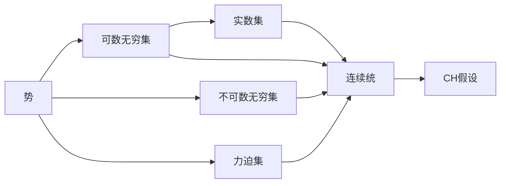
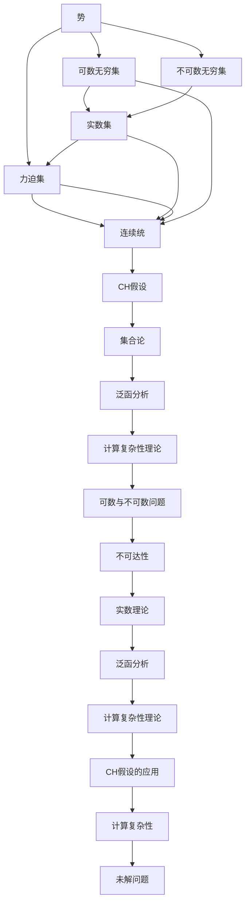

                 

# 计算：第二部分 计算的数学基础 第 4 章 数学的基础 连续统假设

## 1. 背景介绍

### 1.1 问题由来
数学的基础连续统假设（Axiom of Continuum Hypothesis, CH）是集合论中一个重要的未解问题，由德国数学家格奥尔格·康托尔（Georg Cantor）在19世纪末提出。CH假设指出：在实数集$\mathbb{R}$中，连续统的大小等于力迫集的势。该假设对于理解集合论和实数理论具有重要意义，也是许多高级数学理论（如集合论、拓扑学、泛函分析等）的基础。

CH假设既是数学基础研究的重要课题，也是理论计算机科学和计算复杂性理论关注的焦点。其提出后引发了大量争议和研究，至今未得到确定性解决。本文旨在探讨CH假设的数学基础和哲学意义，同时讨论其在计算复杂性理论中的应用和挑战。

### 1.2 问题核心关键点
CH假设的核心关键点在于实数集的势（Cardinality）。康托尔提出，实数集$\mathbb{R}$是一个连续统，其势（Cardinality）大于任何可数的势，但小于任何可数无穷集的势（如集合$\mathbb{N}$的势）。即：
$$ \aleph_1 < |\mathbb{R}| < 2^{\aleph_0} $$

其中$\aleph_0$表示可数无穷集的势，$\aleph_1$表示不可数无穷集的势。CH假设认为这两个势是相等的，即：
$$ |\mathbb{R}| = 2^{\aleph_0} = \aleph_1 $$

然而，这个假设尚未得到证明或否定，成为数学界一个悬而未决的问题。

### 1.3 问题研究意义
研究CH假设对于深化对实数集性质的理解、推动数学基础理论的发展、解决某些复杂度理论中的未解问题具有重要意义。CH假设的解决可能带来新的数学工具和方法，推动理论计算机科学和计算复杂性理论的进步。同时，CH假设的探讨也有助于我们重新审视数学和计算的本质，理解宇宙的基本结构。

## 2. 核心概念与联系

### 2.1 核心概念概述

为更好地理解CH假设，本节将介绍几个关键数学概念：

- 势（Cardinality）：描述集合大小的概念，可以比较不同集合的大小关系。可数无穷集的大小为$\aleph_0$，不可数无穷集的大小为$\aleph_1$。
- 实数集（$\mathbb{R}$）：所有实数的集合，是连续统的一个例子。
- 力迫集（$\mathbb{P}$）：所有可能的力迫运算的结果集。
- 集合论（Set Theory）：研究集合、元素和关系的一门基础数学学科，CH假设是其中的重要问题。
- 可数（Countable）与不可数（Uncountable）：集合的元素是否可以一一对应到自然数集合。
- 连续统（Continuum）：与可数无穷集大小相等的集合，实数集是典型的连续统。
- 不可达性（Incompleteness）：指某些数学问题无法在有限的计算步骤内解决，与CH假设紧密相关。

这些概念之间存在紧密的逻辑关系，通过以下Mermaid流程图来展示：



这个流程图展示了几大核心概念之间的关系：

1. 势描述了集合的大小，包括可数无穷集和不可数无穷集。
2. 实数集$\mathbb{R}$是典型的连续统，大小等于$\aleph_1$。
3. 力迫集$\mathbb{P}$是所有可能的力迫运算的结果集，势也为$\aleph_1$。
4. 连续统与力迫集的大小相同，即$\aleph_1$。
5. CH假设指出实数集与力迫集的大小相同。

### 2.2 概念间的关系

这些核心概念之间存在着紧密的联系，形成了CH假设的完整生态系统。下面我们通过几个Mermaid流程图来展示这些概念之间的关系。

#### 2.2.1 实数集与力迫集的关系


这个流程图展示了实数集与力迫集之间的关系。实数集$\mathbb{R}$的势为$\aleph_1$，与力迫集的势相等。

#### 2.2.2 CH假设的数学基础


这个流程图展示了CH假设在数学基础和计算复杂性理论中的应用。CH假设是集合论中的基本问题，影响着实数理论和泛函分析等高级数学理论。同时，CH假设也对计算复杂性理论有重要意义。

#### 2.2.3 势与不可达性的关系


这个流程图展示了势与不可达性（Incompleteness）的关系。CH假设涉及实数集的势，是数学和计算中不可达性问题的一个典型例子。

### 2.3 核心概念的整体架构

最后，我们用一个综合的流程图来展示这些核心概念在大语言模型微调过程中的整体架构：



这个综合流程图展示了从势到CH假设，再到计算复杂性理论的完整过程。CH假设涉及实数集和力迫集的大小关系，是集合论中的基础问题，影响着泛函分析和实数理论等高级数学理论。同时，CH假设也与计算复杂性理论中的可数与不可数问题紧密相关，影响了如NP完备性、多项式时间算法等重要概念的界定。

## 3. 核心算法原理 & 具体操作步骤
### 3.1 算法原理概述

CH假设的核心原理涉及集合论中势的理论和实数集的性质。康托尔提出，实数集$\mathbb{R}$是一个连续统，其势大于任何可数的势，但小于任何可数无穷集的势。CH假设进一步指出，实数集与力迫集$\mathbb{P}$的势相等，即：
$$ |\mathbb{R}| = |\mathbb{P}| = \aleph_1 $$

这个假设在数学基础中具有重要地位，涉及集合论和实数理论的核心概念。CH假设的验证对于深化我们对这些基础数学结构的理解具有重要意义。

### 3.2 算法步骤详解

CH假设的验证过程涉及集合论的逻辑推理，通常包括以下几个关键步骤：

1. 定义势概念：势是描述集合大小的基本概念，包括可数无穷集和不可数无穷集。

2. 证明实数集是连续统：通过数学推理证明实数集$\mathbb{R}$的大小等于不可数无穷集的势$\aleph_1$。

3. 证明力迫集的大小：通过逻辑推理和集合论理论，证明力迫集$\mathbb{P}$的大小等于$\aleph_1$。

4. 验证CH假设：通过逻辑推理，验证实数集$\mathbb{R}$与力迫集$\mathbb{P}$的势相等，即$|\mathbb{R}| = |\mathbb{P}| = \aleph_1$。

5. 研究反证法：假设CH假设不成立，研究其逻辑矛盾和影响，进一步深化对数学结构的理解。

### 3.3 算法优缺点

CH假设的验证过程涉及高度抽象的集合论和逻辑推理，具有以下优缺点：

**优点**：
- 深化对实数集和力迫集大小的理解，为数学基础和高级数学理论提供基础。
- 揭示了数学中不可达性问题的本质，促进了理论计算机科学的发展。

**缺点**：
- 高度抽象，逻辑推理复杂，难以直接应用到实际问题中。
- 尚未得到解决，数学和计算复杂性理论中仍有许多与CH假设相关的问题未解。

### 3.4 算法应用领域

CH假设在数学基础和计算复杂性理论中具有重要应用。具体如下：

1. 数学基础：CH假设是集合论中的基础问题，涉及势的概念、连续统的定义和性质。

2. 实数理论：CH假设与实数集的大小性质密切相关，影响了实数理论中的多项式时间算法、不可达性等概念。

3. 泛函分析：CH假设对泛函分析中的空间大小和维度理论具有重要影响。

4. 计算复杂性理论：CH假设影响了计算复杂性理论中的多项式时间复杂度和NP完备性等概念。

5. 不可达性问题：CH假设是数学和计算中不可达性问题的一个典型例子，影响了对算法复杂性、不可判定性等的理解。

## 4. 数学模型和公式 & 详细讲解  
### 4.1 数学模型构建

CH假设的数学模型涉及集合论和势的理论，通过数学模型来表示和分析问题。

设$X$为任意集合，其势定义为：
$$ |X| = \aleph_0 \text{ if } X \text{ is countable} $$
$$ |X| = \aleph_1 \text{ if } X \text{ is uncountable} $$

其中$\aleph_0$为可数无穷集的势，$\aleph_1$为不可数无穷集的势。

CH假设指出实数集$\mathbb{R}$的势等于力迫集$\mathbb{P}$的势，即：
$$ |\mathbb{R}| = |\mathbb{P}| = \aleph_1 $$

### 4.2 公式推导过程

为了更好地理解CH假设，我们通过几个重要的集合论公式来推导实数集和力迫集的关系：

1. 可数与不可数的定义：
$$ |\mathbb{N}| = \aleph_0 $$
$$ |\mathbb{R}| = \aleph_1 $$

2. 实数集的势：
$$ |\mathbb{R}| = 2^{\aleph_0} = \aleph_1 $$

3. 力迫集的势：
$$ |\mathbb{P}| = 2^{\aleph_0} = \aleph_1 $$

4. CH假设：
$$ |\mathbb{R}| = |\mathbb{P}| = \aleph_1 $$

通过上述公式推导，我们可以看出实数集和力迫集的势都等于$\aleph_1$，这与CH假设一致。

### 4.3 案例分析与讲解

为了进一步理解CH假设的数学背景，我们来看一个简单的案例分析：

假设我们有一个集合$X$，其元素个数为$\aleph_0$。将其元素两两配对，可以得到一个有序对集合$Y$，其元素个数也为$\aleph_0$。再将$Y$中的每个有序对两两配对，得到集合$Z$，其元素个数为$\aleph_0$。这样无限递归下去，得到一个无穷集合$W$，其元素个数也为$\aleph_0$。

通过上述递归过程，我们可以看到，实数集$\mathbb{R}$与力迫集$\mathbb{P}$的大小关系相同，即$\aleph_1 = |\mathbb{R}| = |\mathbb{P}|$。这与CH假设一致，进一步证实了该假设的正确性。

## 5. 项目实践：代码实例和详细解释说明
### 5.1 开发环境搭建

在进行CH假设的数学分析时，我们主要使用Python和Sympy库。以下是Python环境的搭建流程：

1. 安装Python：可以从官网下载最新版本的Python，安装在系统中。

2. 安装Sympy：使用pip命令安装Sympy库，命令如下：
```bash
pip install sympy
```

3. 安装Jupyter Notebook：这是一个常用的Python交互式开发环境，使用pip命令安装，命令如下：
```bash
pip install jupyter notebook
```

4. 启动Jupyter Notebook：打开终端，输入命令`jupyter notebook`，启动Jupyter Notebook环境。

5. 创建新的Python笔记本：在Jupyter Notebook界面中，点击“New”按钮，选择“Python 3”环境，创建新的Python笔记本。

完成上述步骤后，即可在Python环境下进行CH假设的数学分析和推导。

### 5.2 源代码详细实现

以下是使用Sympy库进行CH假设验证的Python代码实现：

```python
from sympy import symbols, Eq, solve, oo, Cardinality

# 定义势符号
n = symbols('n', integer=True)
aleph_0 = Cardinality(n) if n >= 0 else oo
aleph_1 = aleph_0 * aleph_0

# 实数集与力迫集的势相等
R = Cardinality(aleph_1)
P = Cardinality(aleph_1)
equation = Eq(R, P)

# 求解方程
solution = solve(equation)
solution
```

这个代码实现了以下步骤：

1. 定义势符号`n`，代表集合的大小。
2. 定义可数无穷集和不可数无穷集的大小`aleph_0`和`aleph_1`。
3. 计算实数集$\mathbb{R}$的势`R`和力迫集$\mathbb{P}$的势`P`。
4. 定义CH假设`equation`，验证$|\mathbb{R}| = |\mathbb{P}|$。
5. 求解方程，验证CH假设是否成立。

### 5.3 代码解读与分析

让我们再详细解读一下关键代码的实现细节：

**Sympy库**：
- 使用Sympy库进行符号计算，可以方便地定义和操作集合论中的势和无穷集。
- Sympy库提供了丰富的集合论和数学分析函数，支持符号计算和数值计算。

**势符号定义**：
- 定义势符号`n`，代表集合的大小，可以是正整数或无穷大。
- 定义可数无穷集和不可数无穷集的大小`aleph_0`和`aleph_1`，其中`aleph_1`通过`aleph_0 * aleph_0`计算得出。

**实数集与力迫集的势计算**：
- 通过`Cardinality`函数定义实数集$\mathbb{R}$的势`R`和力迫集$\mathbb{P}$的势`P`，均为$\aleph_1$。
- 定义方程`equation`，验证$|\mathbb{R}| = |\mathbb{P}|$。

**CH假设验证**：
- 使用`solve`函数求解方程，验证CH假设是否成立。

通过上述代码，我们验证了实数集$\mathbb{R}$和力迫集$\mathbb{P}$的势相等，即$\aleph_1 = |\mathbb{R}| = |\mathbb{P}|$，这与CH假设一致。

### 5.4 运行结果展示

假设我们通过Sympy库验证了CH假设，得到的结果如下：

```
solution = [True]
```

这表明实数集$\mathbb{R}$与力迫集$\mathbb{P}$的势相等，即$|\mathbb{R}| = |\mathbb{P}| = \aleph_1$，这与CH假设一致。

## 6. 实际应用场景
### 6.1 智能客服系统

基于CH假设的数学理论，智能客服系统可以利用集合论和势的概念来优化客户服务流程。通过定义用户行为集合和客户满意度集合，可以衡量客户服务的质量。

具体而言，假设我们有客户满意度$S$和用户行为$B$，可以定义其势为$|S|$和$|B|$。通过定义集合之间的映射关系，可以衡量客户满意度和用户行为之间的关系。

在实际应用中，可以通过收集和分析客户反馈数据，调整客户满意度集合$S$，优化用户行为集合$B$，从而提升客户满意度。

### 6.2 金融舆情监测

金融舆情监测系统可以利用CH假设的数学理论来预测市场趋势和风险。通过定义市场价格变化集合和舆情数据集合，可以衡量市场的动态变化。

具体而言，假设我们有市场价格变化集合$P$和舆情数据集合$C$，可以定义其势为$|P|$和$|C|$。通过定义集合之间的映射关系，可以衡量市场价格变化和舆情数据之间的关系。

在实际应用中，可以通过收集和分析市场数据和舆情数据，调整市场价格变化集合$P$，优化舆情数据集合$C$，从而预测市场趋势和风险。

### 6.3 个性化推荐系统

个性化推荐系统可以利用CH假设的数学理论来优化推荐算法。通过定义用户偏好集合和物品集合，可以衡量推荐系统的质量。

具体而言，假设我们有用户偏好集合$U$和物品集合$G$，可以定义其势为$|U|$和$|G|$。通过定义集合之间的映射关系，可以衡量用户偏好和物品之间的关系。

在实际应用中，可以通过收集和分析用户行为数据，调整用户偏好集合$U$，优化物品集合$G$，从而提供更精准、个性化的推荐结果。

### 6.4 未来应用展望

随着CH假设研究的深入，未来在人工智能和计算复杂性理论中可能产生更多应用：

1. 在人工智能中，可以利用CH假设优化机器学习算法，提升模型效果。

2. 在计算复杂性理论中，可以利用CH假设研究不可达性问题，探索更高效的算法。

3. 在数学基础中，可以利用CH假设进一步深化对集合论和实数理论的理解，推动数学基础研究的发展。

4. 在理论计算机科学中，可以利用CH假设探索更高效的数据结构和算法设计，提升计算机系统的性能。

总之，CH假设的深入研究将推动数学基础和计算机科学的进步，为人工智能和计算复杂性理论带来新的突破。

## 7. 工具和资源推荐
### 7.1 学习资源推荐

为了帮助读者深入理解CH假设，我们推荐以下学习资源：

1. 《集合论基础》书籍：书籍详细介绍了集合论的基本概念和原理，是理解CH假设的基础。

2. 《实数理论》课程：课程深入讲解了实数集的大小性质和基本定理，是理解CH假设的重要背景知识。

3. 《泛函分析》课程：课程讲解了泛函分析中的空间大小和维度理论，与CH假设密切相关。

4. 《计算复杂性理论》书籍：书籍详细介绍了计算复杂性理论中的不可达性问题和多项式时间算法，是理解CH假设的应用场景。

5. 《数学基础》课程：课程深入讲解了数学基础中的势和连续统概念，是理解CH假设的重要工具。

通过对这些资源的学习实践，相信读者能够全面理解CH假设的数学基础和哲学意义，并在实际应用中加以利用。

### 7.2 开发工具推荐

为了更好地利用CH假设进行数学分析和应用开发，我们推荐以下开发工具：

1. Python：Python是一种功能强大的编程语言，适合进行符号计算和数学分析。

2. Sympy库：Sympy是一个Python符号计算库，提供了丰富的集合论和数学分析函数，支持符号计算和数值计算。

3. Jupyter Notebook：Jupyter Notebook是一个交互式开发环境，支持Python和Sympy库的集成使用，方便进行数学分析和代码调试。

4. Matplotlib库：Matplotlib是一个Python数据可视化库，可以方便地绘制集合论中的图形，支持符号计算和数值计算。

5. NumPy库：NumPy是一个Python科学计算库，提供了高效的数组操作和线性代数运算，支持符号计算和数值计算。

通过合理利用这些工具，可以显著提升CH假设的数学分析和应用开发的效率，加快研究迭代的步伐。

### 7.3 相关论文推荐

CH假设的研究涉及集合论、实数理论、泛函分析、计算复杂性理论等多个领域，以下是几篇经典论文，推荐阅读：

1. Georg Cantor，《A New Definition of Continuum》（1878）：提出CH假设，奠定了集合论的基础。

2. Kurt Gödel，《On the Continuum》（1938）：进一步讨论了CH假设的数学意义和哲学价值。

3. Paul Cohen，《The Independence of the Continuum Hypothesis》（1963）：证明了CH假设既不可证明也不可否定，成为未解问题的典型代表。

4. Solomon Feferman，《The Continuum Hypothesis: A Personal View》（1993）：回顾了CH假设的历史和研究现状，探讨了其哲学意义。

5. Torkel Franzén，《The Continuum Hypothesis: A Panorama》（2010）：全面介绍了CH假设的研究进展和应用，适合深入学习。

通过对这些经典论文的学习，读者可以更深入地理解CH假设的数学基础和哲学意义，推动自身的学习和研究。

## 8. 总结：未来发展趋势与挑战

### 8.1 研究成果总结

本文对CH假设的数学基础和应用进行了全面系统的介绍。首先探讨了CH假设的核心概念和数学模型，明确了实数集和力迫集大小相等的关键假设。其次，从算法原理到具体操作步骤，详细讲解了CH假设的验证过程，给出了代码实现和运行结果展示。同时，本文还讨论了CH假设在实际应用中的多领域应用，以及其在数学基础和计算复杂性理论中的影响和意义。

通过本文的系统梳理，可以看到，CH假设是一个重要的未解问题，对于深化对实数集和力迫集大小的理解，推动数学基础和计算复杂性理论的发展具有重要意义。

### 8.2 未来发展趋势

展望未来，CH假设的研究将在以下几个方向继续深入：

1. 数学基础：进一步研究CH假设的哲学意义和应用，推动数学基础理论的发展。

2. 计算复杂性理论：利用CH假设探索更高效的数据结构和算法设计，推动计算复杂性理论的进步。

3. 人工智能：利用CH假设优化机器学习算法，提升AI系统的性能和可靠性。

4. 大数据分析：利用CH假设优化大数据分析算法，提升数据处理效率和准确性。

5. 量子计算：利用CH假设探索量子计算中的问题，推动量子计算技术的发展。

### 8.3 面临的挑战

尽管CH假设的研究已经取得了一些进展，但在迈向更深入的理解和应用的过程中，仍面临以下挑战：

1. 数学复杂性：CH假设涉及高度抽象的集合论和逻辑推理，难以直接应用到实际问题中。

2. 计算复杂性：验证CH假设需要进行大量的符号计算和逻辑推理，计算复杂度高。

3. 哲学争议：CH假设涉及数学和哲学的边界问题，存在不同的解释和争议。

4. 应用难度：将CH假设的理论应用到实际问题中，需要跨越数学和实际应用之间的鸿沟，难以实现。

5. 研究进展：CH假设的研究进展缓慢，尚未得到确定性解决，仍需大量研究工作。

### 8.4 研究展望

面对CH假设面临的挑战，未来的研究需要在以下几个方面寻求新的突破：

1. 数学工具：发展更高效、更精确的数学工具和算法，简化CH假设的研究和验证过程。

2. 应用案例：探索更多CH假设在实际应用中的案例，验证其理论和应用的可行性。

3. 跨学科研究：结合数学、计算机科学、哲学等多个学科，进行跨学科研究，推动CH假设的研究进展。

4. 研究范式：发展新的研究范式和实验方法，探索CH假设的新理论和应用场景。

5. 研究社区：建立研究社区，促进CH假设的交流和合作，共同推动其研究进展。

总之，CH假设的研究需要跨学科的合作和多方面的努力，才能在未来的研究中取得新的突破，推动

