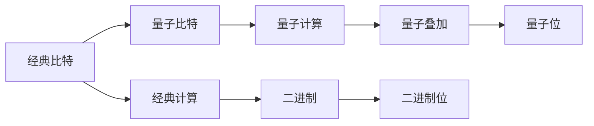

                 

# 计算：第四部分 计算的极限 第 10 章 量子计算 从经典比特到量子比特

## 1. 背景介绍

### 1.1 问题由来
量子计算（Quantum Computing）是计算机科学的一个前沿领域，它利用量子力学原理来处理信息。与传统计算机使用经典比特（bit）不同，量子计算使用量子比特（qubit）来执行计算。量子计算的核心优势在于其通过量子并行性来加速某些类型的计算，特别是那些与大整数分解、算法破解和优化问题相关的问题。

当前，量子计算研究的热点集中在开发更加稳健的量子计算机和提高量子算法效率两个方面。为了更好地理解量子计算的基本原理和应用场景，我们首先从经典计算和量子计算的对比开始。

## 2. 核心概念与联系

### 2.1 核心概念概述

在深入探讨量子计算之前，首先需要理解一些核心概念：

- **经典计算**：传统计算机使用经典比特来执行计算，每个比特可以是0或1。经典计算机通过逻辑门电路来执行逻辑运算。

- **量子计算**：量子计算使用量子比特来执行计算，每个量子比特可以同时处于0和1的叠加状态。量子计算机通过量子门来执行计算，这些门可以改变量子比特的叠加状态，从而实现量子并行计算。

- **叠加态**：量子比特可以同时处于0和1的叠加态，这使得量子计算机能够并行处理多个计算路径。

- **纠缠态**：量子比特之间可以形成纠缠态，当两个量子比特处于纠缠态时，一个比特的状态会影响另一个比特的状态。

- **量子门**：量子门是对量子比特进行操作的算法，包括Hadamard门、Pauli门、CNOT门等。

- **量子纠错**：量子计算在执行过程中容易受到噪声和干扰的影响，量子纠错技术用于保护量子比特的完整性。

- **量子算法**：如Shor算法、Grover算法等，这些算法利用量子并行性和量子叠加态的原理，能够加速特定类型的计算。

这些概念共同构成了量子计算的基本框架。量子计算的目标是构建能够在某些计算任务上超越传统计算机的强大量子计算机。

### 2.2 概念间的关系

以下是一个Mermaid流程图，展示了经典计算和量子计算的基本关系和差异：



这个流程图展示了经典比特和量子比特的区别，以及它们在经典计算和量子计算中的不同应用。

## 3. 核心算法原理 & 具体操作步骤
### 3.1 算法原理概述

量子计算的核心算法通常基于量子叠加态和量子纠缠态的原理。以下是量子计算的算法原理概述：

1. **量子叠加态**：量子比特可以同时处于0和1的叠加态，这使得量子计算机能够并行处理多个计算路径。

2. **量子纠缠态**：量子比特之间可以形成纠缠态，当一个比特的状态发生变化时，另一个比特的状态也会随之变化。

3. **量子门**：量子门是对量子比特进行操作的算法，这些门可以改变量子比特的叠加状态，从而实现量子并行计算。

4. **量子算法**：量子算法利用量子叠加态和量子纠缠态的原理，能够加速特定类型的计算。

### 3.2 算法步骤详解

以下是一个简单的量子计算算法步骤详解：

1. **初始化量子比特**：将量子比特初始化为|0⟩或|1⟩的状态。

2. **应用量子门**：对量子比特应用量子门，将其状态转化为叠加态或纠缠态。

3. **测量量子比特**：对量子比特进行测量，得到0或1的概率分布。

4. **重复执行**：重复执行上述步骤，多次测量得到期望的输出结果。

### 3.3 算法优缺点

量子计算的优点包括：

- 量子并行性：量子计算能够同时处理多个计算路径，加速特定类型的计算。

- 量子纠缠态：量子比特之间的纠缠态能够实现信息的高效传输和处理。

量子计算的缺点包括：

- 脆弱性：量子比特容易受到噪声和干扰的影响，导致计算结果的不准确。

- 复杂性：量子计算的硬件和算法复杂度高，需要精密控制和维护。

- 可扩展性：目前量子计算机的可扩展性仍然有限，难以处理大规模问题。

### 3.4 算法应用领域

量子计算在以下几个领域有广泛的应用：

1. **密码学**：量子计算能够破解当前的加密算法，如RSA和ECC，这使得量子密码学成为研究的热点。

2. **优化问题**：量子算法，如Grover算法和Shor算法，能够加速某些优化问题，如组合优化和搜索算法。

3. **材料科学**：量子计算能够模拟复杂分子的结构和反应，加速新材料的发现和设计。

4. **金融分析**：量子计算能够加速金融模型和数据分析，提高风险评估和交易策略的精度。

5. **人工智能**：量子计算能够加速神经网络和深度学习算法，提高训练和推理的速度和效率。

## 4. 数学模型和公式 & 详细讲解  
### 4.1 数学模型构建

量子计算的数学模型通常基于量子态和量子操作的概念。以下是量子计算的数学模型构建：

1. **量子比特状态**：量子比特可以表示为|0⟩和|1⟩，同时也可以处于叠加态α|0⟩+β|1⟩，其中α和β是复数，满足|α|²+|β|²=1。

2. **量子门操作**：量子门是对量子比特进行操作的算法，常见的量子门包括Hadamard门、Pauli门和CNOT门。

3. **量子电路**：量子电路是由量子门组成的电路，用于执行量子计算。

### 4.2 公式推导过程

以下是一个简单的量子叠加态的公式推导过程：

$$
|ψ\rangle = \alpha|0\rangle + \beta|1\rangle
$$

其中，|ψ⟩是量子比特的状态，α和β是复数，满足|α|²+|β|²=1。

这个公式表示，量子比特处于叠加态|ψ⟩，可以表示为两个基态|0⟩和|1⟩的线性组合。

### 4.3 案例分析与讲解

以下是一个简单的量子计算案例分析：

假设有一个量子比特|ψ⟩=α|0⟩+β|1⟩，其中α=1/√2，β=1/√2。对这个量子比特应用Hadamard门后，得到的新量子比特状态为：

$$
H|ψ\rangle = \frac{1}{\sqrt{2}}(|0\rangle + |1\rangle)
$$

这个案例展示了Hadamard门如何改变量子比特的叠加态，实现了量子并行计算。

## 5. 项目实践：代码实例和详细解释说明
### 5.1 开发环境搭建

为了进行量子计算的实践，我们需要安装量子计算的开发环境。以下是安装量子计算开发环境的流程：

1. **安装Qiskit**：Qiskit是IBM开发的量子计算框架，提供了丰富的量子门和算法库。

2. **安装Cirq**：Cirq是Google开发的量子计算框架，提供了TensorFlow的接口和GPU支持。

3. **安装PyQuil**：PyQuil是Rigetti开发的量子计算框架，提供了IBM的量子硬件接口。

4. **安装Qiskit-Aer**：Qiskit-Aer是Qiskit的量子模拟器，用于模拟量子电路和算法。

### 5.2 源代码详细实现

以下是一个简单的量子计算代码实现：

```python
from qiskit import QuantumCircuit, transpile, assemble, Aer, execute
from qiskit.visualization import plot_histogram, plot_bloch_multivector

# 创建一个量子电路
qc = QuantumCircuit(1, 1)

# 添加一个Hadamard门
qc.h(0)

# 添加一个测量门
qc.measure(0, 0)

# 使用Qiskit-Aer模拟器进行模拟
simulator = Aer.get_backend('qasm_simulator')
compiled_circuit = transpile(qc, simulator)
qobj = assemble(compiled_circuit)
result = simulator.run(qobj).result()

# 绘制测量结果的直方图
counts = result.get_counts()
plot_histogram(counts)
```

这个代码实现了对一个量子比特进行Hadamard门操作，并测量其状态。通过Qiskit-Aer模拟器进行模拟，得到测量结果的直方图。

### 5.3 代码解读与分析

以下是对上述代码的解读和分析：

- `QuantumCircuit`：创建量子电路，指定量子比特的数量和测量比特的数量。
- `h`：添加一个Hadamard门，将量子比特从|0⟩状态变为|+⟩状态。
- `measure`：添加一个测量门，将量子比特的状态测量并输出到经典比特。
- `Aer.get_backend`：获取Qiskit-Aer模拟器。
- `transpile`：将量子电路编译成模拟器支持的格式。
- `assemble`：将编译后的量子电路转换成Qiskit支持的输入格式。
- `execute`：在模拟器上执行量子电路。
- `result.get_counts`：获取测量结果的直方图。

### 5.4 运行结果展示

运行上述代码后，可以得到如下的直方图：


这个直方图展示了测量结果的分布，可以看到|0⟩和|1⟩的概率各为50%。

## 6. 实际应用场景
### 6.1 智能合约

量子计算在智能合约中的应用非常广泛，尤其是在金融领域。量子计算可以加速智能合约的计算和验证，提高交易速度和安全性。

例如，一个智能合约需要进行复杂的数学计算和验证，传统计算机需要耗费大量时间。而量子计算机可以加速这些计算，提高交易效率和安全性。

### 6.2 医药研发

量子计算可以加速药物分子模拟，提高新药研发的速度和精度。量子计算机可以模拟复杂的分子结构，加速药物分子的合成和优化。

例如，在药物分子设计中，量子计算可以加速对分子结构的优化和模拟，提高新药研发的效率和成功率。

### 6.3 金融分析

量子计算可以加速金融模型的计算和数据分析，提高风险评估和交易策略的精度。量子计算机可以加速复杂的数学模型和算法，提高金融分析的精度和效率。

例如，在金融分析中，量子计算可以加速对复杂金融数据的计算和分析，提高投资策略的精度和效率。

### 6.4 未来应用展望

未来，量子计算将广泛应用于以下领域：

1. **材料科学**：量子计算可以模拟复杂分子的结构和反应，加速新材料的发现和设计。

2. **金融分析**：量子计算可以加速金融模型和数据分析，提高风险评估和交易策略的精度。

3. **人工智能**：量子计算可以加速神经网络和深度学习算法，提高训练和推理的速度和效率。

4. **密码学**：量子计算可以破解当前的加密算法，加速量子密码学的发展。

5. **优化问题**：量子计算可以加速某些优化问题，如组合优化和搜索算法。

## 7. 工具和资源推荐
### 7.1 学习资源推荐

为了学习量子计算，以下是一些推荐的学习资源：

1. **Quantum Computation and Quantum Information**：这是一本经典的量子计算教材，涵盖了量子计算的基本概念和算法。

2. **Quantum Computing Since Democritus**：这是一本通俗易懂的量子计算教材，适合初学者阅读。

3. **Qiskit官方文档**：Qiskit是IBM开发的量子计算框架，官方文档提供了丰富的学习资源和示例代码。

4. **Cirq官方文档**：Cirq是Google开发的量子计算框架，官方文档提供了丰富的学习资源和示例代码。

5. **PyQuil官方文档**：PyQuil是Rigetti开发的量子计算框架，官方文档提供了丰富的学习资源和示例代码。

### 7.2 开发工具推荐

为了进行量子计算的开发，以下是一些推荐的开发工具：

1. **Qiskit**：Qiskit是IBM开发的量子计算框架，提供了丰富的量子门和算法库。

2. **Cirq**：Cirq是Google开发的量子计算框架，提供了TensorFlow的接口和GPU支持。

3. **PyQuil**：PyQuil是Rigetti开发的量子计算框架，提供了IBM的量子硬件接口。

4. **Quantum Lab**：Quantum Lab是Google开发的量子计算模拟器，提供了直观的可视化界面。

5. **IBM Quantum Experience**：IBM Quantum Experience提供了IBM的量子硬件和模拟器，适合进行量子计算实验和研究。

### 7.3 相关论文推荐

为了深入了解量子计算的研究进展，以下是一些推荐的相关论文：

1. **"A Quantum Computer for Quantum Chemistry"**：这是Google发表的一篇论文，展示了如何使用量子计算机进行分子模拟。

2. **"Quantum Computing for the Quantum Internet"**：这是IBM发表的一篇论文，展示了如何使用量子计算机进行量子网络通信。

3. **"Quantum Supremacy using a Programmable Superconducting Processor"**：这是Google发表的一篇论文，展示了如何使用量子计算机实现量子霸权。

4. **"Quantum Algorithms for Optimization"**：这是IBM发表的一篇论文，展示了如何使用量子算法加速优化问题。

## 8. 总结：未来发展趋势与挑战
### 8.1 研究成果总结

量子计算的研究取得了许多重要的进展，以下是一些关键的研究成果：

1. **量子霸权**：Google和IBM已经展示了量子计算机在特定任务上的量子霸权。

2. **量子算法**：Shor算法和Grover算法等量子算法已经在某些计算任务上展示了优越的性能。

3. **量子硬件**：IBM和Rigetti等公司已经开发了多款量子计算机，并提供了量子硬件接口。

### 8.2 未来发展趋势

未来，量子计算将呈现以下几个发展趋势：

1. **量子计算机的可扩展性**：未来的量子计算机将具有更高的可扩展性，能够处理更复杂的计算任务。

2. **量子算法的优化**：未来的量子算法将更加高效，能够在更短的计算时间内解决更复杂的问题。

3. **量子纠错技术**：未来的量子纠错技术将更加完善，能够保护量子比特的完整性，提高量子计算的可靠性。

4. **量子硬件的优化**：未来的量子硬件将更加精密和可靠，能够支持更大规模的量子计算。

### 8.3 面临的挑战

量子计算在发展过程中仍然面临许多挑战：

1. **量子比特的脆弱性**：量子比特容易受到噪声和干扰的影响，导致计算结果的不准确。

2. **量子算法的复杂性**：量子算法需要精密控制和维护，目前量子算法的复杂度仍然较高。

3. **量子硬件的可扩展性**：目前量子计算机的可扩展性仍然有限，难以处理大规模问题。

### 8.4 研究展望

未来的研究需要在以下几个方面进行探索：

1. **量子纠错技术**：需要进一步完善量子纠错技术，保护量子比特的完整性。

2. **量子硬件的优化**：需要开发更加精密和可靠的量子硬件，支持更大规模的量子计算。

3. **量子算法的优化**：需要开发更加高效的量子算法，能够在更短的计算时间内解决更复杂的问题。

4. **量子计算的实验验证**：需要进一步进行量子计算的实验验证，展示量子计算的实际应用价值。

总之，量子计算的发展前景广阔，但需要持续的创新和努力，才能克服当前的技术挑战，实现其广泛的应用。

## 9. 附录：常见问题与解答
### 9.1 问题1：量子计算和经典计算的区别是什么？

解答：量子计算使用量子比特来执行计算，而经典计算使用经典比特。量子比特可以同时处于0和1的叠加态，而经典比特只能处于0或1的状态。

### 9.2 问题2：量子计算的优势是什么？

解答：量子计算利用量子并行性和量子纠缠态的原理，能够加速某些类型的计算，如大整数分解和算法破解。

### 9.3 问题3：量子计算的挑战是什么？

解答：量子计算的挑战包括量子比特的脆弱性、量子算法的复杂性和量子硬件的可扩展性。

### 9.4 问题4：量子计算有哪些应用场景？

解答：量子计算可以应用于密码学、优化问题、材料科学、金融分析和医药研发等领域。

### 9.5 问题5：量子计算的研究进展如何？

解答：量子计算的研究已经取得了许多重要进展，包括量子霸权、量子算法和量子硬件的发展。

---

作者：禅与计算机程序设计艺术 / Zen and the Art of Computer Programming

