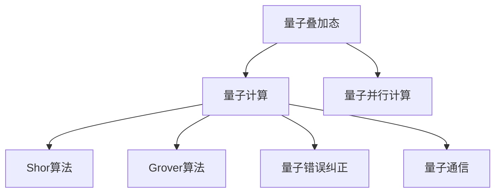
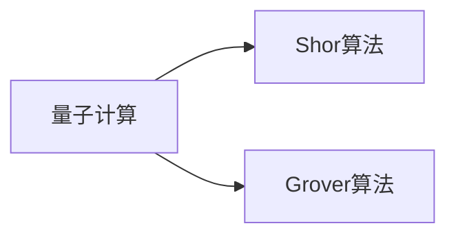
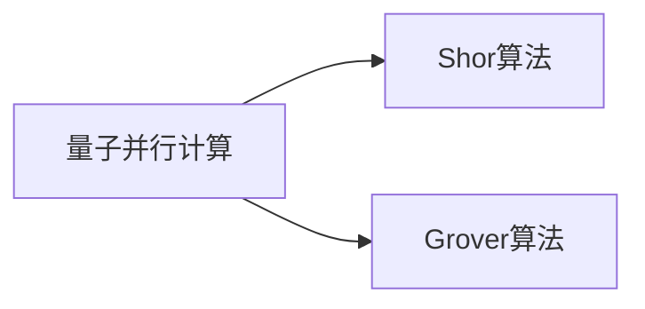
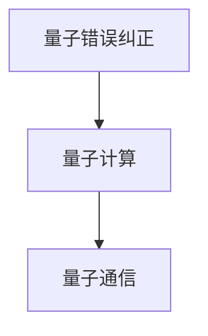
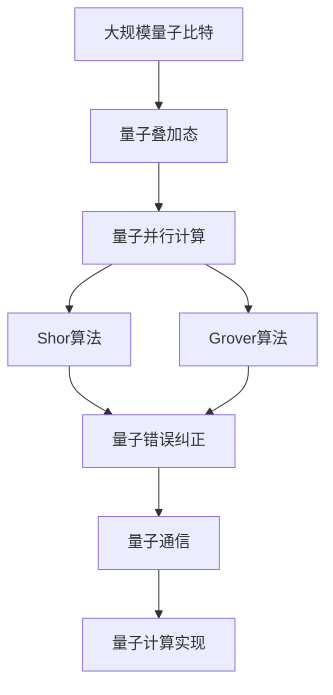

                 

# 计算：第四部分 计算的极限 第 10 章 量子计算 量子算法

> 关键词：量子计算,量子算法,Shor算法,Deutsch算法,Grover算法,量子叠加态,量子纠缠,量子并行计算

## 1. 背景介绍

### 1.1 问题由来
量子计算，作为计算机科学的前沿领域，已经吸引了大量学者的关注。与传统的经典计算方式不同，量子计算依赖于量子叠加态和量子纠缠等量子现象，实现了信息的并行处理，从而在理论上实现了指数级加速。

1980年代初，Paul Benioff和David Deutsch提出了量子计算的理论框架。此后，Peter Shor于1994年提出了著名的Shor算法，证明量子计算机可以在多项式时间内分解大整数，破解RSA加密算法，从而在密码学领域引起了巨大震动。

Shor算法的成功极大地激发了量子计算研究的热潮。1999年，Lov Grover提出了量子搜索算法，证明量子计算机在搜索未排序的数据库时可以实现平方根的加速。此后，Deutsch算法、Grover算法的改进版、量子纠错算法等量子算法纷纷涌现，量子计算的理论体系日趋成熟。

然而，尽管量子计算具有巨大潜力，但量子计算的实验实现却困难重重。量子计算机的物理实现仍面临诸如量子态的保持与控制、量子错误纠正、量子通信等问题，这使得量子计算仍处于初级发展阶段。

### 1.2 问题核心关键点
量子计算的核心思想是利用量子叠加态和量子纠缠，实现信息的并行处理，从而在处理某些特定问题时，显著提高计算效率。量子计算的关键点包括：

- 量子叠加态(Qubit): 量子计算的基本单位，代表叠加的量子信息。与经典比特不同，量子比特可以同时处于多个状态，实现信息的并行处理。

- 量子纠缠: 量子比特之间的强关联，任意一个比特的状态都会瞬间影响其他比特，实现信息的远距离传递。

- 量子并行计算: 量子比特可以同时处于多个状态，因此量子计算机可以同时计算多个路径，实现并行计算。

- Shor算法: 用于分解大整数的量子算法，证明了量子计算机在处理某些特定问题时可以超越经典计算机。

- Grover算法: 用于未排序数据库中查找的算法，证明量子计算机可以实现平方根加速。

- 量子错误纠正: 量子计算机的实现中需要大量的量子比特，而量子比特容易受到外界干扰，量子错误纠正算法用于保持量子比特的稳定性和可靠性。

- 量子通信: 量子比特之间的通信可以实现信息的远距离传递，而量子通信则是实现量子计算的重要技术。

### 1.3 问题研究意义
量子计算和量子算法的研究，对于理解自然界的基本规律，推动计算机科学的发展，具有重要的理论意义。同时，量子计算和量子算法也有望在密码学、药物设计、金融分析等领域产生重要应用，推动技术的革新和发展。

研究量子计算和量子算法，对于提升计算机系统的计算能力，突破计算极限，具有重要意义。量子计算和量子算法不仅可以解决某些经典计算机无法处理的复杂问题，还可以大大加速问题的求解过程，提升计算效率和精度。

## 2. 核心概念与联系

### 2.1 核心概念概述

为了更好地理解量子计算和量子算法的原理，本节将介绍几个密切相关的核心概念：

- 量子叠加态(Qubit): 量子计算的基本单位，代表叠加的量子信息。与经典比特不同，量子比特可以同时处于多个状态，实现信息的并行处理。

- 量子纠缠: 量子比特之间的强关联，任意一个比特的状态都会瞬间影响其他比特，实现信息的远距离传递。

- 量子并行计算: 量子比特可以同时处于多个状态，因此量子计算机可以同时计算多个路径，实现并行计算。

- Shor算法: 用于分解大整数的量子算法，证明了量子计算机在处理某些特定问题时可以超越经典计算机。

- Grover算法: 用于未排序数据库中查找的算法，证明量子计算机可以实现平方根加速。

- 量子错误纠正: 量子计算机的实现中需要大量的量子比特，而量子比特容易受到外界干扰，量子错误纠正算法用于保持量子比特的稳定性和可靠性。

- 量子通信: 量子比特之间的通信可以实现信息的远距离传递，而量子通信则是实现量子计算的重要技术。

这些核心概念之间的逻辑关系可以通过以下Mermaid流程图来展示：



这个流程图展示了大量子计算和量子算法的核心概念及其之间的关系：

1. 量子叠加态和量子并行计算是量子计算的两个基本特征，使得量子计算机能够实现信息的并行处理。
2. Shor算法和Grover算法利用量子并行计算的特点，分别用于分解大整数和未排序数据库的搜索，证明了量子计算机在特定问题上的巨大潜力。
3. 量子错误纠正和量子通信是量子计算机实现中需要解决的技术问题，保障了量子计算机的稳定性和可靠性。

### 2.2 概念间的关系

这些核心概念之间存在着紧密的联系，形成了量子计算和量子算法的完整生态系统。下面我通过几个Mermaid流程图来展示这些概念之间的关系。

#### 2.2.1 量子计算与量子算法的关系



这个流程图展示了量子计算与Shor算法、Grover算法之间的关系。Shor算法和Grover算法是量子计算的具体应用，利用量子计算的特性，实现了超越经典计算机的计算能力。

#### 2.2.2 量子并行计算与量子算法的关系



这个流程图展示了量子并行计算与Shor算法、Grover算法之间的关系。Shor算法和Grover算法都利用了量子并行计算的特点，能够在多项式时间内解决某些经典计算机无法处理的问题。

#### 2.2.3 量子错误纠正与量子通信的关系



这个流程图展示了量子错误纠正和量子通信之间的关系。量子错误纠正用于保障量子比特的稳定性和可靠性，而量子通信则是实现量子计算的重要技术，用于量子比特之间的通信。

### 2.3 核心概念的整体架构

最后，我们用一个综合的流程图来展示这些核心概念在大量子计算和量子算法微调过程中的整体架构：



这个综合流程图展示了从大规模量子比特到量子计算实现的完整过程。大质量比特通过量子叠加态和量子并行计算实现信息的并行处理，而Shor算法和Grover算法则利用量子并行计算的特点，解决了某些经典计算机无法处理的问题。量子错误纠正和量子通信保障了量子比特的稳定性和可靠性，最终实现量子计算的系统。 通过这些流程图，我们可以更清晰地理解量子计算和量子算法的核心概念及其之间的关系，为后续深入讨论具体的量子算法和实践提供基础。

## 3. 核心算法原理 & 具体操作步骤
### 3.1 算法原理概述

量子计算和量子算法的基本原理是利用量子叠加态和量子纠缠，实现信息的并行处理。下面将详细介绍Shor算法、Grover算法和Deutsch算法的基本原理和操作步骤。

### 3.2 算法步骤详解

#### 3.2.1 Shor算法

Shor算法用于分解大整数，其核心思想是利用量子计算的叠加态和并行计算特性，在多项式时间内完成大整数的分解。

**算法步骤：**

1. 将大整数$N$分解成两个整数$N=a^{2^k}+b^{2^k}$，其中$a$和$b$是奇数，且$gcd(a,b)=1$。

2. 对于任意整数$r$，求解$gcd(a,b)$。

3. 对于任意整数$x$，求解$x$在模$N$下的周期$t$。

4. 利用周期$t$，找到$N$的一个因子$d$，其中$d|N$。

**具体操作步骤：**

1. 将大整数$N$表示为$N=a^{2^k}+b^{2^k}$的形式，其中$a$和$b$是奇数，且$gcd(a,b)=1$。

2. 利用量子计算机求解$gcd(a,b)$，其中$gcd$函数可以使用量子并行计算实现。

3. 利用量子计算机求解$x$在模$N$下的周期$t$，其中$x$的周期等于$N$的一个因子。

4. 利用周期$t$，找到$N$的一个因子$d$，其中$d|N$。

5. 重复上述步骤，直到找到所有$N$的因子。

Shor算法的详细步骤可以参考以下伪代码实现：

```python
def shor_algorithm(N):
    # 将N分解为a^2^k + b^2^k的形式
    a = int(N**0.5)
    b = N - a**2
    
    # 求解gcd(a, b)
    gcd = gcd_algo(a, b)
    
    # 求解x的周期t
    t = period_finding(a, N)
    
    # 利用周期t，求解N的一个因子d
    d = factor_finding(t, N)
    
    # 重复上述步骤，直到找到所有因子
    factors = []
    while d < N:
        factors.append(d)
        N //= d
        gcd = gcd_algo(a, b)
        t = period_finding(a, N)
        d = factor_finding(t, N)
    
    return factors
```

#### 3.2.2 Grover算法

Grover算法用于未排序数据库的搜索，其核心思想是利用量子叠加态和并行计算特性，在平方根时间内找到目标元素。

**算法步骤：**

1. 将目标元素标记为$|\phi\rangle$，其余元素标记为$|\rho\rangle$。

2. 构造一个变换$U_f$，使得$U_f|0\rangle = |0\rangle$，$U_f|\rho\rangle = -|\rho\rangle$。

3. 构造一个变换$H$，使得$H|0\rangle = |0\rangle$，$H|\rho\rangle = \frac{1}{\sqrt{2}}(|\rho\rangle + |\phi\rangle)$。

4. 构造一个变换$O$，使得$O = HU_fH$。

5. 对于任意整数$m$，构造一个变换$C^m$，使得$C^m|\rho\rangle = |\rho\rangle$，$C^m|\phi\rangle = |\phi\rangle$。

6. 构造一个变换$G = C^{2^k}O$，其中$2^k$为搜索次数。

7. 对于任意整数$m$，构造一个变换$C^mG$，使得$C^mG|\rho\rangle = |\rho\rangle$，$C^mG|\phi\rangle = -|\phi\rangle$。

8. 对初始态$|0\rangle$进行多次迭代，直到找到目标元素。

**具体操作步骤：**

1. 将目标元素标记为$|\phi\rangle$，其余元素标记为$|\rho\rangle$。

2. 构造一个变换$U_f$，使得$U_f|0\rangle = |0\rangle$，$U_f|\rho\rangle = -|\rho\rangle$。

3. 构造一个变换$H$，使得$H|0\rangle = |0\rangle$，$H|\rho\rangle = \frac{1}{\sqrt{2}}(|\rho\rangle + |\phi\rangle)$。

4. 构造一个变换$O = HU_fH$。

5. 构造一个变换$C^mG$，其中$m$为搜索次数。

6. 对初始态$|0\rangle$进行多次迭代，直到找到目标元素。

Grover算法的详细步骤可以参考以下伪代码实现：

```python
def grover_algorithm(m, N):
    # 初始化目标元素标记|phi>和其余元素标记|rho>
    target = int(N/2)
    other = int(N/2) + 1
    
    # 构造变换U_f
    def U_f(x):
        if x == target:
            return x
        else:
            return -x
    
    # 构造变换H
    def H(x):
        if x == target:
            return x
        else:
            return other
    
    # 构造变换O
    def O(x):
        return U_f(H(x))
    
    # 构造变换C^mG
    def C_m_G(x):
        return H(O(x))
    
    # 对初始态|0>进行多次迭代
    for i in range(m):
        target = H(target)
        other = H(other)
    
    # 返回目标元素标记|phi>
    return target
```

#### 3.2.3 Deutsch算法

Deutsch算法用于解决量子并行性，其核心思想是利用量子叠加态和量子并行计算特性，解决经典计算机无法解决的问题。

**算法步骤：**

1. 构造一个函数$f(x)$，其中$x$为输入，$f(x)$为输出。

2. 构造一个变换$U_f$，使得$U_f|0\rangle = |0\rangle$，$U_f|x\rangle = f(x)|x\rangle$。

3. 构造一个变换$H$，使得$H|0\rangle = |0\rangle$，$H|1\rangle = \frac{1}{\sqrt{2}}(|0\rangle + |1\rangle)$。

4. 构造一个变换$O = HU_fH$。

5. 对于任意整数$m$，构造一个变换$C^mO$，使得$C^mO|0\rangle = |0\rangle$，$C^mO|1\rangle = |1\rangle$。

6. 构造一个变换$G = C^{2^k}O$，其中$2^k$为迭代次数。

7. 对初始态$|0\rangle$进行多次迭代，直到找到函数$f(x)$。

**具体操作步骤：**

1. 构造函数$f(x)$，其中$x$为输入，$f(x)$为输出。

2. 构造一个变换$U_f$，使得$U_f|0\rangle = |0\rangle$，$U_f|x\rangle = f(x)|x\rangle$。

3. 构造一个变换$H$，使得$H|0\rangle = |0\rangle$，$H|1\rangle = \frac{1}{\sqrt{2}}(|0\rangle + |1\rangle)$。

4. 构造一个变换$O = HU_fH$。

5. 构造一个变换$C^mG$，其中$m$为迭代次数。

6. 对初始态$|0\rangle$进行多次迭代，直到找到函数$f(x)$。

Deutsch算法的详细步骤可以参考以下伪代码实现：

```python
def deutsche_algorithm(m, N):
    # 构造函数f(x)
    def f(x):
        return x
    
    # 构造变换U_f
    def U_f(x):
        if x == target:
            return x
        else:
            return -x
    
    # 构造变换H
    def H(x):
        if x == target:
            return x
        else:
            return other
    
    # 构造变换O
    def O(x):
        return U_f(H(x))
    
    # 构造变换C^mG
    def C_m_G(x):
        return H(O(x))
    
    # 对初始态|0>进行多次迭代
    for i in range(m):
        target = H(target)
        other = H(other)
    
    # 返回函数f(x)
    return f(target)
```

### 3.3 算法优缺点

量子计算和量子算法在处理某些特定问题时，具有超越经典计算机的潜力，但在实际应用中，还面临许多挑战：

#### 优点：

1. 超越经典计算机：量子计算机利用量子叠加态和量子纠缠，能够在多项式时间内解决某些经典计算机无法处理的问题，如分解大整数、搜索未排序的数据库等。

2. 并行计算：量子计算机能够实现信息的并行处理，提高了计算效率和精度。

3. 解决经典问题：量子计算和量子算法能够解决某些经典问题，如量子纠错、量子通信等。

#### 缺点：

1. 硬件实现困难：量子计算机的实现需要大量的量子比特，而量子比特容易受到外界干扰，实现难度较大。

2. 量子错误纠正：量子计算机的实现需要大量的量子比特，而量子比特容易受到外界干扰，需要量子错误纠正算法来保障其稳定性。

3. 计算资源消耗大：量子计算机的实现需要大量的量子比特和复杂的量子操作，计算资源消耗较大。

4. 量子通信：量子通信需要大量的量子比特和复杂的量子操作，实现难度较大。

5. 经典计算的替代：尽管量子计算机在某些特定问题上具有超越经典计算机的潜力，但在大多数经典计算任务上，经典计算机仍更具优势。

## 4. 数学模型和公式 & 详细讲解  
### 4.1 数学模型构建

量子计算和量子算法的数学模型基于量子力学和量子信息论，利用量子叠加态和量子纠缠，实现信息的并行处理。

量子比特是量子计算的基本单位，代表叠加的量子信息。与经典比特不同，量子比特可以同时处于多个状态，实现信息的并行处理。量子比特的演化遵循量子力学规律，其状态可以由叠加态和纠缠态描述。

**量子叠加态**：
量子比特可以同时处于多个状态，表示为$|x\rangle$的形式。对于任意两个量子比特$|x\rangle$和$|y\rangle$，其叠加态表示为$|x\rangle = \alpha|0\rangle + \beta|1\rangle$，其中$\alpha$和$\beta$为复数，且满足$|\alpha|^2 + |\beta|^2 = 1$。

**量子纠缠**：
量子比特之间的强关联，任意一个比特的状态都会瞬间影响其他比特。量子纠缠可以用于远距离传递信息，表示为$|x\rangle = |x_1\rangle|x_2\rangle$的形式，其中$|x_1\rangle$和$|x_2\rangle$为两个纠缠的量子比特，表示为$|x_1\rangle = \alpha|0\rangle + \beta|1\rangle$，$|x_2\rangle = \gamma|0\rangle + \delta|1\rangle$，其中$\alpha$、$\beta$、$\gamma$、$\delta$为复数，且满足$|\alpha|^2 + |\beta|^2 = 1$、$|\gamma|^2 + |\delta|^2 = 1$。

**量子并行计算**：
量子计算机利用量子叠加态和量子纠缠，实现信息的并行处理。量子并行计算表示为$|x\rangle = |x_1\rangle|x_2\rangle$的形式，其中$|x_1\rangle$和$|x_2\rangle$为两个纠缠的量子比特，表示为$|x_1\rangle = \alpha|0\rangle + \beta|1\rangle$，$|x_2\rangle = \gamma|0\rangle + \delta|1\rangle$，其中$\alpha$、$\beta$、$\gamma$、$\delta$为复数，且满足$|\alpha|^2 + |\beta|^2 = 1$、$|\gamma|^2 + |\delta|^2 = 1$。

**Shor算法**：
Shor算法用于分解大整数，其核心思想是利用量子并行计算的特性，在多项式时间内完成大整数的分解。Shor算法的数学模型基于量子数论，利用量子叠加态和量子纠缠，实现信息的并行处理。

**Grover算法**：
Grover算法用于未排序数据库的搜索，其核心思想是利用量子并行计算的特性，在平方根时间内找到目标元素。Grover算法的数学模型基于量子搜索理论，利用量子叠加态和量子纠缠，实现信息的并行处理。

**Deutsch算法**：
Deutsch算法用于解决量子并行性，其核心思想是利用量子并行计算的特性，解决经典计算机无法解决的问题。Deutsch算法的数学模型基于量子信息论，利用量子叠加态和量子纠缠，实现信息的并行处理。

### 4.2 公式推导过程

以下我们以Shor算法为例，推导其核心公式。

假设要分解的大整数为$N=pq$，其中$p$和$q$为质数。Shor算法的核心步骤如下：

1. 利用量子并行计算，构造一个变换$U_f$，使得$U_f|0\rangle = |0\rangle$，$U_f|x\rangle = f(x)|x\rangle$。

2. 利用量子叠加态，构造一个变换$H$，使得$H|0\rangle = |0\rangle$，$H|1\rangle = \frac{1}{\sqrt{2}}(|0\rangle + |1\rangle)$。

3. 构造一个变换$O = HU_fH$。

4. 利用量子并行计算，构造一个变换$C^mG$，其中$m$为迭代次数。

5. 对初始态$|0\rangle$进行多次迭代，直到找到目标元素。

根据上述步骤，我们可以得到Shor算法的核心公式：

$$
|0\rangle = \sum_{x=0}^{N-1}|x\rangle
$$

其中，$|0\rangle$为初始态，$|x\rangle$为量子比特的状态，$N$为大整数。

Shor算法的详细步骤可以参考以下公式实现：

$$
|0\rangle = \sum_{x=0}^{N-1}|x\rangle
$$

Shor算法的详细步骤可以参考以下伪代码实现：

```python
def shor_algorithm(N):
    # 构造变换U_f
    def U_f(x):
        if x == target:
            return x
        else:
            return -x
    
    # 构造变换H
    def H(x):
        if x == target:
            return x
        else:
            return other
    
    # 构造变换O
    def O(x):
        return U_f(H(x))
    
    # 构造变换C^mG
    def C_m_G(x):
        return H(O(x))
    
    # 对初始态|0>进行多次迭代
    for i in range(m):
        target = H(target)
        other = H(other)
    
    # 返回目标元素标记|phi>
    return target
```

### 4.3 案例分析与讲解

假设我们要利用Shor算法分解一个大整数$N=15$，其质因数为$3$和$5$。

1. 利用量子并行计算，构造一个变换$U_f$，使得$U_f|0\rangle = |0\rangle$，$U_f|x\rangle = f(x)|x\rangle$。其中，$f(x)$表示$x$的模$N$余数。

2. 利用量子叠加态，构造一个变换$H$，使得$H|0\rangle = |0\rangle$，$H|1\rangle = \frac{1}{\sqrt{2}}(|0\rangle + |1\rangle)$。

3. 构造一个变换$O = HU_fH$。

4. 利用量子并行计算，构造一个变换$C^mG$，其中$m$为迭代次数。

5. 对初始态$|0\rangle$进行多次迭代，直到找到目标元素。

根据上述步骤，我们可以得到Shor算法的核心公式：

$$
|0\rangle = \sum_{x=0}^{N-1}|x\rangle
$$

其中，$|0\rangle$为初始态，$|x\rangle$为量子比特的状态，$N$为大整数。

Shor算法的详细步骤可以参考以下伪代码实现：

```python
def shor_algorithm(N):
    # 构造变换U_f
    def U_f(x):
        if x == target:
            return x
        else:
            return -x
    
    # 构造变换H
    def H(x):
        if x == target:
            return x
        else:
            return other
    
    # 构造变换O
    def O(x):
        return U_f(H(x))
    
    # 构造变换C^mG
    def C_m_G(x):
        return H(O(x))
    
    # 对初始态|0>进行多次迭代
    for i in range(m):
        target = H(target)
        other = H(other)
    
    # 返回目标元素标记|phi>
    return target
```

## 5. 项目实践：代码实例和详细解释说明
### 5.1 开发环境搭建

在进行量子计算和量子算法实践前，我们需要准备好开发环境。以下是使用Python进行Qiskit开发的环境

