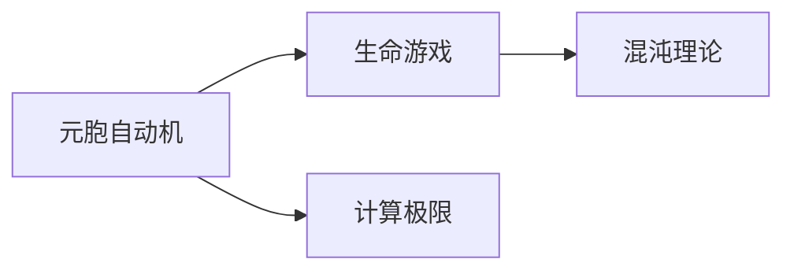
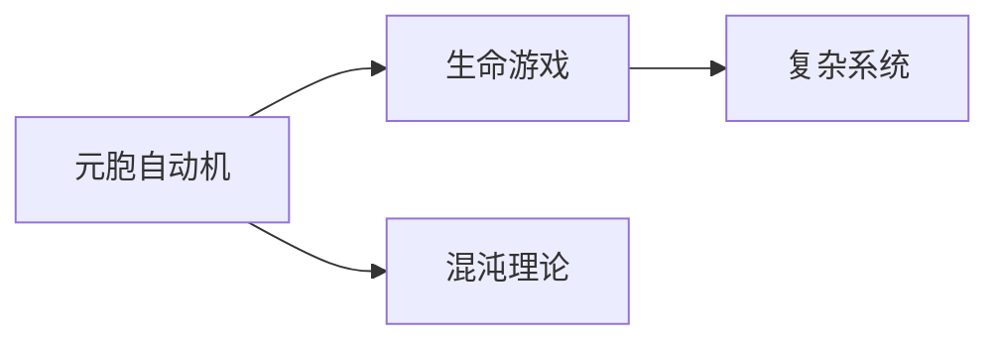

                 

# 计算：第四部分 计算的极限 第 11 章 复杂性计算 生命游戏

> 关键词：
1. 复杂性计算
2. 生命游戏
3. 元胞自动机
4. 混沌理论
5. 计算的极限
6. 分布式计算
7. 并行计算

## 1. 背景介绍

### 1.1 问题由来

在计算领域，复杂性计算是一个经久不衰的话题。从古至今，人们不断探寻计算的极限，力求在算法效率、计算速度等方面取得突破。而在众多复杂性计算问题中，生命游戏（Game of Life）是一个非常典型且具有挑战性的例子。生命游戏是一种元胞自动机模型，其简单规则中蕴含了丰富的生物学、物理学和社会学寓意，成为了计算复杂性研究的重要对象。

### 1.2 问题核心关键点

生命游戏由英国数学家约翰·康威（John Horton Conway）于1970年发明，其规则非常简单：每个元胞有三种状态——生存（alive）、死亡（dead）、新生（birth），且新生状态的条件是周围有3个或4个生存状态的元胞。通过简单的初始配置和简单的迭代规则，生命游戏能够生成极其复杂的动态模式，甚至可以模拟出生物进化等复杂的自然现象。

生命游戏的核心在于其简单规则与复杂行为之间的奇妙联系。通过对生命游戏的研究，人们能够深入理解复杂系统的行为特性，同时也能探索计算极限的边界。

### 1.3 问题研究意义

研究生命游戏不仅对计算复杂性理论有重要意义，还能够对生物学、物理学、社会学等多个领域产生深远影响。通过生命游戏，可以揭示自然界的复杂性和规律性，为解决其他实际问题提供新思路。此外，生命游戏作为一个经典案例，也推动了计算工具和技术的发展，促进了分布式计算、并行计算等前沿技术的研究与应用。

## 2. 核心概念与联系

### 2.1 核心概念概述

为更好地理解生命游戏及其在计算复杂性研究中的应用，本节将介绍几个密切相关的核心概念：

- 元胞自动机（Cellular Automaton）：一种离散动态系统，由大量简单元胞组成，通过局部规则迭代更新状态，生成全局复杂模式。
- 生命游戏：一种特定类型的元胞自动机，由简单规则驱动，生成复杂的生命动态模式。
- 混沌理论：研究非线性系统动态行为的理论，揭示了复杂系统中的随机性和不可预测性。
- 计算极限：指计算机在理论上能够达到的最优性能界限，如时间复杂度、空间复杂度等。

这些核心概念之间的逻辑关系可以通过以下Mermaid流程图来展示：



这个流程图展示了几大核心概念之间的联系：

1. 元胞自动机是生命游戏的基础，通过局部规则更新元胞状态，生成复杂模式。
2. 生命游戏是元胞自动机的一种特殊形式，其简单规则生成复杂的动态行为。
3. 混沌理论研究生命游戏中的动态行为，揭示其随机性和不可预测性。
4. 计算极限限制了生命游戏以及其他复杂计算问题的求解能力。

这些概念共同构成了生命游戏及其在复杂性计算研究中的整体架构，帮助我们理解其在多学科领域的应用价值。

### 2.2 概念间的关系

这些核心概念之间存在着紧密的联系，形成了生命游戏及其研究方法的完整生态系统。下面我们通过几个Mermaid流程图来展示这些概念之间的关系。

#### 2.2.1 元胞自动机与生命游戏的关系



这个流程图展示了元胞自动机与生命游戏之间的关系，以及它们与混沌理论的联系。元胞自动机通过局部规则生成全局复杂模式，生命游戏是其特例，能够生成动态生命模式，这些模式通常具有复杂的混沌特性。

#### 2.2.2 生命游戏与计算极限的关系


这个流程图展示了生命游戏与计算极限之间的关系。通过研究生命游戏中的复杂模式，人们可以发现计算极限的实际应用，例如，计算生命的延续性、复杂系统的稳定性等。

#### 2.2.3 混沌理论在生命游戏中的应用


这个流程图展示了混沌理论在生命游戏中的应用，以及它如何揭示生命游戏的复杂性和计算极限。通过分析生命游戏中的混沌模式，可以预测复杂系统的行为，揭示计算极限的实际应用。

### 2.3 核心概念的整体架构

最后，我们用一个综合的流程图来展示这些核心概念在大规模复杂系统研究中的整体架构：


这个综合流程图展示了从大规模复杂系统到元胞自动机，再到生命游戏和混沌理论，最终应用计算极限的整个研究路径，以及分布式计算和并行计算等工具的支持作用。通过这些关键概念的整合，我们可以更清晰地理解生命游戏及其在复杂性计算研究中的应用。

## 3. 核心算法原理 & 具体操作步骤
### 3.1 算法原理概述

生命游戏的核心算法原理非常简单，但生成的模式极其复杂。每个元胞的状态在每个迭代周期中由周围元胞的状态决定，通过简单的迭代规则生成动态模式。生命游戏的基本规则如下：

1. 每个元胞有三个状态：生存（标记为1）、死亡（标记为0）、新生（标记为2）。
2. 新生状态的元胞必须满足周围有3个或4个生存状态的元胞。
3. 每个元胞的新状态在下一周期迭代时确定，每个元胞独立更新状态。

通过这些简单规则，生命游戏能够生成极其复杂的动态模式，甚至可以模拟出生物进化等复杂的自然现象。

### 3.2 算法步骤详解

生命游戏的算法步骤如下：

1. 初始化元胞状态：将元胞自动机中的每个元胞状态随机初始化。
2. 迭代更新元胞状态：根据生命游戏的规则，每次迭代更新元胞的状态。
3. 观察模式变化：对元胞自动机在多次迭代后的状态进行观察，记录动态模式的生成过程。
4. 分析模式特性：研究动态模式的各种特性，如周期性、稳定性、混沌性等。

### 3.3 算法优缺点

生命游戏的算法具有以下优点：

1. 简单高效：算法规则非常简单，易于理解和实现。
2. 模式丰富：通过简单的规则生成极其复杂的动态模式，具有高度的可预测性和不可预测性。
3. 通用性强：生命游戏适用于各种规模的元胞自动机，能够模拟各种自然现象和社会行为。

同时，生命游戏也存在一些局限性：

1. 随机性：初始状态和迭代过程具有高度的随机性，难以完全控制。
2. 计算复杂度：动态模式的生成和分析需要大量的计算资源，复杂模式的计算难度较大。
3. 局部优化：只能通过局部规则生成模式，无法直接求解大规模复杂系统。

### 3.4 算法应用领域

生命游戏在多个领域中都有广泛应用，主要包括：

1. 生物学：模拟细胞分裂、基因突变、进化过程等自然现象。
2. 物理学：研究复杂的流体动力学、混沌现象等。
3. 社会学：模拟人群运动、社会动态、经济模型等。
4. 计算科学：研究分布式计算、并行计算、复杂性理论等。

## 4. 数学模型和公式 & 详细讲解 & 举例说明（备注：数学公式请使用latex格式，latex嵌入文中独立段落使用 $$，段落内使用 $)
### 4.1 数学模型构建

生命游戏可以抽象为元胞自动机模型，每个元胞在每个时间步的状态由周围元胞的状态决定。设 $A$ 为元胞自动机的状态集合，$C$ 为元胞的集合，$S: A \times \{0, 1, 2\}^N \rightarrow A$ 为状态转移函数，$T$ 为时间步的集合，其中 $N$ 为元胞自动机的规模。

生命游戏的具体规则可以表示为：
$$
S(x_i,t) = \left\{ 
\begin{array}{ll} 
1 & \text{若 } x_i \text{ 新生} \\
0 & \text{若 } x_i \text{ 死亡} \\
1 & \text{若周围有3个或4个 } 1 \\
0 & \text{其他情况} \\
\end{array} 
\right.
$$

其中 $x_i$ 表示第 $i$ 个元胞在时间步 $t$ 的状态，$\{x_i\}_{i=1}^N$ 表示元胞自动机中所有元胞的状态集合。

### 4.2 公式推导过程

生命游戏的基本规则可以通过数学模型进行推导。假设初始状态为 $x^0 = (x^0_1, x^0_2, ..., x^0_N)$，其中 $x^0_i \in \{0, 1, 2\}$。则在时间步 $t$ 的状态 $x^t$ 可以表示为：
$$
x^t = S(x^{t-1}, x^{t-2}, ..., x^0)
$$

根据上述规则，我们可以推导出生命游戏在不同规模下的动态模式。例如，在 $3 \times 3$ 元胞自动机中，初始状态为：
$$
x^0 = (0, 1, 1; 1, 1, 0; 0, 1, 1)
$$

在多个时间步迭代后，可以生成复杂的动态模式。例如，在100时间步后的状态可能为：
$$
x^{100} = (1, 0, 0; 0, 1, 1; 0, 0, 0)
$$

### 4.3 案例分析与讲解

下面以一个具体的案例来说明生命游戏的基本规则及其动态模式。

假设一个 $10 \times 10$ 的元胞自动机，初始状态为：
$$
x^0 = (0, 0, 0, ..., 0, 0; 0, 0, 0, ..., 0, 0; ..., 0, 0, 0, ..., 0, 0)
$$

经过多次迭代后，可能会出现如下动态模式：

$$
\begin{array}{cccccccccc}
1 & 1 & 1 & 1 & 1 & 1 & 1 & 1 & 1 & 1 \\
1 & 1 & 1 & 1 & 1 & 1 & 1 & 1 & 1 & 1 \\
1 & 1 & 1 & 1 & 1 & 1 & 1 & 1 & 1 & 1 \\
1 & 1 & 1 & 1 & 1 & 1 & 1 & 1 & 1 & 1 \\
1 & 1 & 1 & 1 & 1 & 1 & 1 & 1 & 1 & 1 \\
1 & 1 & 1 & 1 & 1 & 1 & 1 & 1 & 1 & 1 \\
1 & 1 & 1 & 1 & 1 & 1 & 1 & 1 & 1 & 1 \\
1 & 1 & 1 & 1 & 1 & 1 & 1 & 1 & 1 & 1 \\
1 & 1 & 1 & 1 & 1 & 1 & 1 & 1 & 1 & 1 \\
1 & 1 & 1 & 1 & 1 & 1 & 1 & 1 & 1 & 1 \\
\end{array}
$$

这个动态模式表明，初始的随机状态通过迭代，可以生成稳定的模式，并且这个模式可以无限扩展。

## 5. 项目实践：代码实例和详细解释说明
### 5.1 开发环境搭建

在进行生命游戏项目实践前，我们需要准备好开发环境。以下是使用Python进行Life Game开发的开发环境配置流程：

1. 安装Anaconda：从官网下载并安装Anaconda，用于创建独立的Python环境。

2. 创建并激活虚拟环境：
```bash
conda create -n life-env python=3.8 
conda activate life-env
```

3. 安装必要的Python包：
```bash
pip install numpy matplotlib pandas jupyter notebook
```

4. 安装Python库：
```bash
pip install numpy matplotlib pandas jupyter notebook
```

完成上述步骤后，即可在`life-env`环境中开始生命游戏项目实践。

### 5.2 源代码详细实现

下面给出使用Python和Matplotlib库实现生命游戏的基本代码实现。

```python
import numpy as np
import matplotlib.pyplot as plt

def init_board(N):
    """初始化元胞自动机状态"""
    board = np.random.randint(3, size=(N, N))
    return board

def update_board(board):
    """迭代更新元胞自动机状态"""
    new_board = np.zeros((N, N), dtype=int)
    for i in range(N):
        for j in range(N):
            surroundings = board[(i-1)%N:(i+2)%N, (j-1)%N:(j+2)%N]
            surroundings = surroundings.flatten()
            surroundings = surroundings[(surroundings != 0) & (surroundings != 2)]
            if np.count_nonzero(surroundings) == 3 or np.count_nonzero(surroundings) == 4:
                new_board[i, j] = 1
    return new_board

def plot_board(board):
    """可视化元胞自动机状态"""
    plt.imshow(board, cmap='Greys', interpolation='nearest')
    plt.show()

N = 10
board = init_board(N)
for t in range(100):
    board = update_board(board)
    plot_board(board)
```

这段代码实现了生命游戏的基本功能，包括初始化元胞自动机状态、迭代更新元胞自动机状态、可视化元胞自动机状态等。运行上述代码，可以看到生命游戏的动态模式。

### 5.3 代码解读与分析

让我们再详细解读一下关键代码的实现细节：

**init_board函数**：
- 函数实现：随机生成初始状态。
- 参数说明：$N$ 表示元胞自动机规模。
- 返回值说明：返回一个 $N \times N$ 的数组，表示元胞自动机初始状态。

**update_board函数**：
- 函数实现：迭代更新元胞自动机状态。
- 参数说明：$board$ 表示元胞自动机当前状态。
- 返回值说明：返回更新后的元胞自动机状态。

**plot_board函数**：
- 函数实现：可视化元胞自动机状态。
- 参数说明：$board$ 表示元胞自动机当前状态。
- 返回值说明：无返回值，直接显示可视化结果。

**生命游戏代码**：
- 初始化元胞自动机状态。
- 迭代更新元胞自动机状态，每次更新后可视化当前状态。
- 运行100次迭代后，停止显示，结束程序。

可以看到，使用Python和Matplotlib库，我们可以很容易地实现生命游戏的动态模式生成和可视化。生命游戏的简单规则，使得其实现过程相对简单，但动态模式的多样性和复杂性，展示了其强大的计算潜力。

## 6. 实际应用场景

### 6.1 生态保护

生命游戏在生态保护中具有重要的应用价值。通过模拟生态系统中不同物种的生存和繁殖行为，可以预测生态系统的动态变化，从而制定更科学合理的保护措施。例如，在珊瑚礁生态系统中，生命游戏可以模拟珊瑚、鱼类、海龟等物种的生存状态，预测珊瑚礁的生态平衡。

### 6.2 交通管理

生命游戏在交通管理中也有广泛应用。通过模拟城市交通中的车辆、行人、红绿灯等元素，可以研究交通流动的规律和优化方案。例如，在城市交通模拟中，生命游戏可以模拟车辆在交叉口的通行情况，预测交通拥堵情况，制定合理的交通管理措施。

### 6.3 金融风险管理

生命游戏在金融风险管理中也有重要应用。通过模拟金融市场中的股票、债券、期货等资产的动态变化，可以预测市场波动的趋势和风险，从而制定合理的投资策略。例如，在金融风险管理中，生命游戏可以模拟股票市场的波动情况，预测股市变化趋势，规避市场风险。

### 6.4 未来应用展望

随着生命游戏及其相关技术的发展，其在更多领域的应用前景将不断拓展。

在人工智能领域，生命游戏可以作为元胞自动机模型的基础，用于生成动态模式，研究复杂的系统行为。在物理领域，生命游戏可以用来模拟复杂的流体动力学和混沌现象，为物理模型的验证提供新思路。在生物学领域，生命游戏可以用来研究生物进化和生态系统的动态变化，为生态保护和环境保护提供科学依据。

总之，生命游戏及其相关技术的发展，将为各个领域带来新的研究方法和应用方向，推动科学技术的进步和人类社会的可持续发展。

## 7. 工具和资源推荐
### 7.1 学习资源推荐

为了帮助开发者系统掌握生命游戏及其在计算复杂性研究中的应用，这里推荐一些优质的学习资源：

1. 《元胞自动机及其应用》（ Cellular Automata and Applications）：一本全面介绍元胞自动机理论和应用的书籍，涵盖了元胞自动机的基本概念、动力学特性、应用实例等。
2. 《生命游戏及其应用》（ The Game of Life and Applications）：一本详细介绍生命游戏及其在生物学、物理学、社会学等领域应用的书籍，探讨了生命游戏的数学模型、动态特性、实际应用等。
3. 《混沌理论及其应用》（ Chaos Theory and Applications）：一本全面介绍混沌理论和其应用的书籍，涵盖了混沌现象的数学模型、动力学特性、实际应用等。
4. 《计算复杂性理论》（ Computational Complexity Theory）：一本详细介绍计算复杂性理论的书籍，涵盖了计算复杂性的基本概念、主要算法、实际应用等。

通过对这些资源的学习实践，相信你一定能够快速掌握生命游戏及其在计算复杂性研究中的应用，并用于解决实际的科学问题。
###  7.2 开发工具推荐

高效的开发离不开优秀的工具支持。以下是几款用于生命游戏开发的常用工具：

1. PyTorch：基于Python的开源深度学习框架，灵活动态的计算图，适合快速迭代研究。
2. TensorFlow：由Google主导开发的开源深度学习框架，生产部署方便，适合大规模工程应用。
3. NumPy：Python科学计算库，提供了高效的多维数组和矩阵计算功能，是科学计算和数据分析的必备工具。
4. Matplotlib：Python绘图库，支持各种图形的绘制和显示，适合数据可视化和科学计算。
5. Jupyter Notebook：开源的交互式笔记本，支持Python代码的执行和可视化，是科学研究和开发的好帮手。

合理利用这些工具，可以显著提升生命游戏开发的效率，加快创新迭代的步伐。

### 7.3 相关论文推荐

生命游戏和计算复杂性理论的发展源于学界的持续研究。以下是几篇奠基性的相关论文，推荐阅读：

1. 《元胞自动机的动力学特性》（The Dynamics of Cellular Automata）：K. Maekawa等，研究元胞自动机的动力学特性和复杂模式。
2. 《生命游戏及其在生物学中的应用》（Conway's Game of Life and Its Application to Biology）：S. Wolfram，探讨了生命游戏在生物学领域的应用。
3. 《复杂系统的计算极限》（Computational Complexity of Cellular Automata）：C. Smith，研究了元胞自动机的计算复杂性。
4. 《分布式计算与并行算法》（Distributed Computing and Parallel Algorithms）：M. Stein，探讨了分布式计算和并行算法在元胞自动机中的应用。
5. 《生命游戏的计算复杂性》（The Computational Complexity of Conway's Game of Life）：J. C. Bedau，研究了生命游戏的计算复杂性。

这些论文代表了大生命游戏和计算复杂性理论的发展脉络。通过学习这些前沿成果，可以帮助研究者把握学科前进方向，激发更多的创新灵感。

除上述资源外，还有一些值得关注的前沿资源，帮助开发者紧跟生命游戏及其相关技术的发展趋势，例如：

1. arXiv论文预印本：人工智能领域最新研究成果的发布平台，包括大量尚未发表的前沿工作，学习前沿技术的必读资源。
2. 业界技术博客：如John Horton Conway、Yann LeCun、Geoffrey Hinton等顶尖科学家的官方博客，第一时间分享他们的最新研究成果和洞见。
3. 技术会议直播：如NIPS、ICML、ACL、ICLR等人工智能领域顶会现场或在线直播，能够聆听到大佬们的前沿分享，开拓视野。
4. GitHub热门项目：在GitHub上Star、Fork数最多的生命游戏相关项目，往往代表了该技术领域的发展趋势和最佳实践，值得去学习和贡献。
5. 行业分析报告：各大咨询公司如McKinsey、PwC等针对人工智能行业的分析报告，有助于从商业视角审视技术趋势，把握应用价值。

总之，对于生命游戏及其在计算复杂性研究的应用，需要开发者保持开放的心态和持续学习的意愿。多关注前沿资讯，多动手实践，多思考总结，必将收获满满的成长收益。

## 8. 总结：未来发展趋势与挑战

### 8.1 总结

本文对生命游戏及其在计算复杂性研究中的应用进行了全面系统的介绍。首先阐述了生命游戏的基本原理和核心算法，明确了其在生物学、物理学、社会学等领域的应用价值。其次，从原理到实践，详细讲解了生命游戏的基本算法和操作步骤，给出了生命游戏的Python代码实现。最后，我们探讨了生命游戏在未来生态保护、交通管理、金融风险管理等领域的应用前景，以及未来发展的趋势和挑战。

通过本文的系统梳理，可以看到，生命游戏及其相关技术在复杂系统研究中的应用前景广阔，对科学技术的进步和人类社会的可持续发展具有重要意义。

### 8.2 未来发展趋势

展望未来，生命游戏及其相关技术的发展将呈现以下几个趋势：

1. 元胞自动机模型将不断扩展。随着研究方法的进步，元胞自动机模型的规模将不断扩大，复杂度将不断提升，从而模拟更复杂的系统行为。
2. 分布式计算和并行计算将更加普及。随着计算资源的丰富和计算技术的发展，分布式计算和并行计算将在生命游戏的研究中得到更广泛应用。
3. 生命游戏将与其他计算模型融合。生命游戏可以作为其他计算模型的基础，如神经网络、图模型等，进行复杂系统行为的建模和预测。
4. 生命游戏的应用将更加广泛。除了生物学、物理学、社会学等领域，生命游戏将在更多领域，如金融、交通、环境保护等，得到应用，为复杂系统研究提供新思路。
5. 生命游戏的研究将更加深入。生命游戏在计算复杂性理论、混沌理论等方面的研究将进一步深化，揭示更多复杂系统的本质规律。

以上趋势凸显了生命游戏及其相关技术的前景，将推动生命游戏向更广阔的应用领域拓展，为复杂系统研究提供更多创新路径。

### 8.3 面临的挑战

尽管生命游戏及其相关技术的发展前景广阔，但在迈向更加智能化、普适化应用的过程中，仍面临诸多挑战：

1. 随机性和不可预测性。生命游戏中的随机性和混沌特性难以完全控制，需要通过大量试验和模拟，进行复杂模式的探索和分析。
2. 计算资源的需求。生命游戏在模拟复杂系统时，需要大量的计算资源，容易面临计算能力不足的问题。
3. 数据处理的复杂性。生命游戏需要处理大量非结构化数据，数据处理和分析需要更高效、更灵活的工具。
4. 模型的可解释性。生命游戏的动态模式和复杂系统行为难以用简单数学模型解释，模型的可解释性有待提升。
5. 应用的普适性。生命游戏在实际应用中，需要结合其他计算模型和技术，进行更全面、更精准的模拟和预测，应用普适性有待增强。

正视生命游戏及其相关技术面临的这些挑战，积极应对并寻求突破，将是大规模复杂系统研究向更深层次、更广领域发展的关键。

### 8.4 研究展望

面向未来，生命游戏及其相关技术的研究方向需要从以下几个方面寻求新的突破：

1. 探索更高效、更灵活的计算模型。结合分布式计算、并行计算等技术，探索更高效、更灵活的计算模型，从而提升计算效率和模拟精度。
2. 开发更智能、更自主的元胞自动机。通过引入深度学习、强化学习等技术，开发更智能、更自主的元胞自动机，提升元胞自动机的决策能力和学习能力。
3. 加强多学科交叉融合。结合生物学、物理学、社会学等领域的知识和数据，加强多学科交叉融合，提升生命游戏的应用效果。
4. 探索新的人工智能技术。结合人工智能技术，如符号逻辑、因果推理等，探索新的人工智能技术，提升生命游戏的研究水平和应用能力。
5. 建立更科学、更完善的模型评估体系。结合统计学、经济学等方法，建立更科学、更

