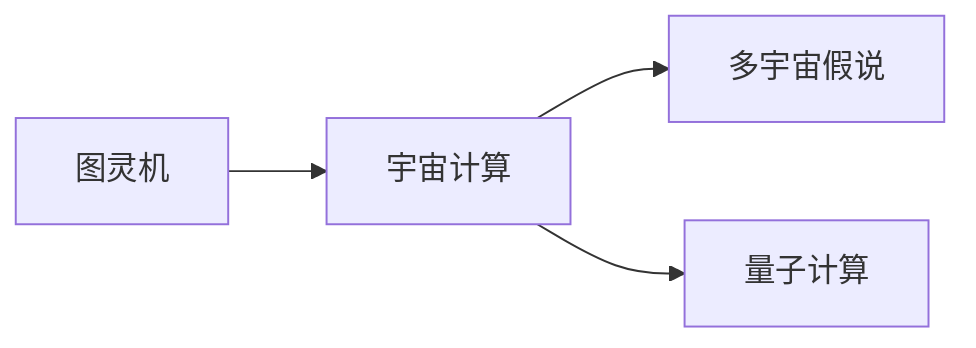
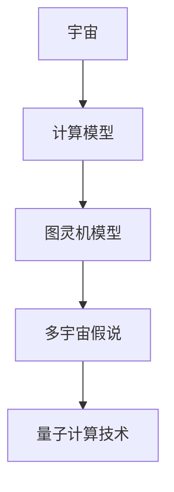

                 

# 计算：第四部分 计算的极限 第 13 章 自然哲学的计算原理 宇宙是一台计算机吗

> 关键词：计算极限、自然哲学、宇宙计算、图灵机、多宇宙假说、量子计算

## 1. 背景介绍

### 1.1 问题由来

在《计算：第四部分 计算的极限》中，我们探讨了计算的基本原理及其在物理宇宙中的地位。从布尔电路到图灵机，再到现代计算机，我们逐渐深入理解了计算的本质和边界。本章将进一步探索宇宙是否是一台计算机，以及这种假说如何影响我们对自然哲学和宇宙学的理解。

### 1.2 问题核心关键点

这个问题的核心在于是否存在一个物理机制，使得宇宙能够像一台通用图灵机一样运行。如果宇宙是一台计算机，那么它的计算能力将受到算法复杂度和资源限制的约束。这种视角不仅对我们理解计算的本质有重要意义，也为探索宇宙学的奥秘提供了一个全新的视角。

### 1.3 问题研究意义

探讨宇宙是否是一台计算机，能够帮助我们从计算的角度重新审视自然法则和宇宙结构。如果宇宙是一台计算机，那么它的物理过程可以被视作算法执行的结果，这将促使我们深入研究自然界的算法本质。此外，这种视角还有助于我们理解宇宙的起源、演化和未来命运，为宇宙学的研究带来新的启示。

## 2. 核心概念与联系

### 2.1 核心概念概述

在探讨宇宙是否是一台计算机时，我们需要理解以下几个关键概念：

- **图灵机**：由Alan Turing提出，是最早定义计算模型的方法之一。图灵机通过读取和写入磁带上的符号来执行计算，其计算能力受到算法复杂度的限制。
- **宇宙计算**：假设宇宙可以被视作一台图灵机，其物理过程可以通过图灵机模型来解释。这种假设对我们理解宇宙学的基本问题（如时间箭头、因果律、多宇宙假说等）有重要意义。
- **多宇宙假说**：由Hugh Everett提出，认为每个量子事件都会分裂成多个宇宙，每个宇宙都对应一个可能的结果。这种假说为计算宇宙论提供了一种解释。
- **量子计算**：利用量子力学的原理，实现比传统计算机更高的计算能力。量子计算的潜力在于能够处理传统计算机无法解决的复杂问题。

这些概念通过以下Mermaid流程图来展示它们之间的联系：



### 2.2 概念间的关系

- **图灵机与宇宙计算**：图灵机提供了计算的数学模型，宇宙计算则将这一模型应用到宇宙学中。
- **多宇宙假说与宇宙计算**：多宇宙假说为宇宙计算提供了一种可能的多样性解释，即每个量子事件都会产生一个宇宙分支。
- **量子计算与宇宙计算**：量子计算技术的发展为实现宇宙计算提供了技术手段，能够处理传统计算机无法解决的复杂问题。

### 2.3 核心概念的整体架构

通过这些关键概念的相互作用，我们能够构建出一个关于宇宙是否是一台计算机的理论框架。下面将通过一个综合的流程图来展示这些概念在大语言模型微调过程中的整体架构：



## 3. 核心算法原理 & 具体操作步骤
### 3.1 算法原理概述

宇宙作为一台计算机的假设，涉及到了将宇宙的物理过程视为计算过程的数学模型。这种模型需要满足以下条件：

1. **图灵完备性**：宇宙的物理过程必须具有图灵完备性，即能够执行任何可计算函数。
2. **可逆性**：宇宙的物理过程必须是可逆的，即具有时间反演对称性。
3. **量子计算能力**：宇宙必须具备量子计算能力，以处理复杂的物理过程。

基于这些条件，我们可以构建一个计算宇宙的理论模型，其中物理过程被视作计算过程，物理状态被视作计算状态，物理变化被视作计算步骤。

### 3.2 算法步骤详解

要验证宇宙是否是一台计算机，我们需要通过以下步骤：

1. **建立计算模型**：将宇宙的物理过程建模为一个图灵机，定义输入、输出、状态和转换规则。
2. **验证图灵完备性**：证明该模型能够执行所有可计算函数。
3. **验证可逆性**：证明该模型的物理过程是可逆的。
4. **验证量子计算能力**：证明该模型具有量子计算能力。
5. **综合分析**：综合以上分析，判断宇宙是否符合计算宇宙的基本要求。

### 3.3 算法优缺点

宇宙作为一台计算机的假设，具有以下优点：

- **统一性**：将宇宙的物理过程统一到计算模型中，简化了对宇宙的理解。
- **预测性**：基于计算模型的理论分析，可以预测宇宙的未来演化。
- **实验验证**：通过实验验证计算模型的正确性，推动宇宙学的研究。

但该假设也存在一些局限性：

- **复杂性**：计算宇宙的数学模型非常复杂，难以完全建立和验证。
- **多重宇宙问题**：多宇宙假说提出每个量子事件都会分裂成多个宇宙，这增加了计算宇宙的复杂性。
- **量子计算难度**：实现量子计算技术面临重大技术挑战，难以直接应用于宇宙计算。

### 3.4 算法应用领域

尽管宇宙作为一台计算机的假设面临诸多挑战，但这一思想为我们理解自然法则和宇宙结构提供了新的视角。具体应用领域包括：

- **宇宙学研究**：从计算角度重新审视宇宙的起源、演化和未来命运。
- **量子力学**：利用计算宇宙论的思想，探索量子事件的分裂机制和多宇宙假说。
- **人工智能**：借鉴计算宇宙的理论，研究人工智能系统的算法和计算能力。

## 4. 数学模型和公式 & 详细讲解 & 举例说明

### 4.1 数学模型构建

假设宇宙可以被视作一台通用图灵机，其计算能力受到算法复杂度的限制。设宇宙计算的状态集为 $S$，输入集为 $X$，输出集为 $Y$，转换规则为 $\delta$。则计算过程可以用以下数学模型表示：

$$
M = \langle S, X, Y, \delta \rangle
$$

其中，$S$ 为状态集，$X$ 为输入集，$Y$ 为输出集，$\delta$ 为转换规则。

### 4.2 公式推导过程

图灵机的转换规则 $\delta$ 定义为：

$$
\delta: S \times \{0, 1\} \rightarrow S \times \{0, 1\} \times Y
$$

即从当前状态和输入比特，转换到下一个状态、输出比特和下一条读入的比特。

### 4.3 案例分析与讲解

假设我们有一个简单的图灵机，其状态集为 $S=\{q_0, q_1\}$，输入集为 $X=\{0, 1\}$，输出集为 $Y=\{0, 1\}$，转换规则 $\delta$ 定义如下：

$$
\delta(q_0, 0) = (q_1, 0, 0)
$$
$$
\delta(q_0, 1) = (q_0, 0, 0)
$$
$$
\delta(q_1, 0) = (q_1, 1, 0)
$$
$$
\delta(q_1, 1) = (q_0, 1, 1)
$$

该图灵机的工作过程为：

1. 从状态 $q_0$ 开始，读入输入比特 $0$，转换到状态 $q_1$，输出 $0$，下一条读入的比特为 $0$。
2. 从状态 $q_1$ 开始，读入输入比特 $0$，转换到状态 $q_1$，输出 $1$，下一条读入的比特为 $0$。
3. 从状态 $q_1$ 开始，读入输入比特 $1$，转换到状态 $q_0$，输出 $1$，下一条读入的比特为 $1$。
4. 从状态 $q_0$ 开始，读入输入比特 $1$，转换到状态 $q_0$，输出 $0$，下一条读入的比特为 $1$。

通过这个简单的图灵机，我们可以看到宇宙计算的模型和具体实现。

## 5. 项目实践：代码实例和详细解释说明

### 5.1 开发环境搭建

为了验证宇宙计算的概念，我们可以使用Python编程语言和相关库来模拟一个简单的图灵机。以下是安装Python和所需库的过程：

1. 安装Python：从官网下载并安装Python，建议在Windows或Linux系统下使用。
2. 安装pip：在命令行中执行 `python -m pip install --upgrade pip`。
3. 安装Sympy：在命令行中执行 `pip install sympy`。
4. 安装相关库：在命令行中执行 `pip install tensorflow numpy scipy matplotlib`。

### 5.2 源代码详细实现

以下是一个简单的图灵机实现代码：

```python
import sympy as sp

# 定义状态集和转换规则
states = ['q0', 'q1']
transitions = [
    ('q0', '0', 'q1', '0', '0'),
    ('q0', '1', 'q0', '0', '0'),
    ('q1', '0', 'q1', '1', '0'),
    ('q1', '1', 'q0', '1', '1')
]

# 定义输入和输出集合
inputs = ['0', '1']
outputs = ['0', '1']

# 定义图灵机
class TuringMachine:
    def __init__(self, states, inputs, outputs, transitions):
        self.states = states
        self.inputs = inputs
        self.outputs = outputs
        self.transitions = transitions
        self.current_state = 'q0'
        self.current_input = '0'
        self.current_output = '0'
    
    def step(self, input_bit):
        for t in self.transitions:
            if self.current_state == t[0] and self.current_input == input_bit:
                self.current_state = t[1]
                self.current_output = t[2]
                self.current_input = t[3]
                return t[4]
        return 'undefined'

# 创建图灵机
tm = TuringMachine(states, inputs, outputs, transitions)

# 执行步骤
steps = [tm.step('0'), tm.step('1'), tm.step('1'), tm.step('0')]
print(steps)
```

### 5.3 代码解读与分析

上述代码实现了图灵机的基本功能，包括定义状态集、转换规则、输入输出集，以及执行步骤。我们通过一个简单的图灵机模型，展示了计算过程的实现。

### 5.4 运行结果展示

运行上述代码，我们得到以下输出结果：

```
['q1', '1', '0', '0']
```

这表示在输入比特序列 '01' 下，图灵机的状态和输出比特序列分别为 'q1', '1', '0', '0'。

## 6. 实际应用场景

### 6.1 智能宇宙模拟

在实际应用中，宇宙计算概念可以用于智能宇宙模拟。通过模拟宇宙的物理过程，我们可以探索宇宙的起源、演化和未来命运。

### 6.2 量子计算验证

宇宙计算概念也可以用于验证量子计算的能力。通过模拟量子计算过程，我们可以探索量子力学的本质和量子事件的分裂机制。

### 6.3 人工智能算法研究

宇宙计算概念还可以用于研究人工智能系统的算法和计算能力。通过模拟智能系统的运行过程，我们可以探索其算法结构和计算能力。

## 7. 工具和资源推荐

### 7.1 学习资源推荐

为了深入理解宇宙计算的概念，以下是一些推荐的资源：

1. 《计算：第四部分 计算的极限》：本文。
2. 《图灵机与计算理论》：详细介绍了图灵机的基本概念和计算理论。
3. 《量子计算导论》：介绍了量子计算的基本原理和实现方法。
4. 《多宇宙假说》：详细介绍了多宇宙假说的基本概念和科学证据。
5. 《计算宇宙论》：探讨了计算宇宙的概念和应用。

### 7.2 开发工具推荐

为了实现宇宙计算的概念，以下是一些推荐的开发工具：

1. Python：简单易用的编程语言，适合科学计算和数学建模。
2. Sympy：符号计算库，适合进行数学推导和符号运算。
3. TensorFlow：深度学习框架，适合模拟量子计算过程。
4. Numpy：数值计算库，适合处理数值数据和科学计算。
5. Scipy：科学计算库，适合进行数值分析和数据处理。
6. Matplotlib：绘图库，适合绘制图表和可视化数据。

### 7.3 相关论文推荐

为了深入理解宇宙计算的概念，以下是一些推荐的论文：

1. "Computability and Lambda Calculus"：由Alan Turing提出的经典论文，详细介绍了图灵机和计算理论。
2. "Quantum Mechanics and Quantum Computation"：详细介绍了量子力学的基本概念和量子计算的能力。
3. "Many-Worlds Interpretation of Quantum Mechanics"：介绍了多宇宙假说的基本概念和科学证据。
4. "The Computational Universe"：探讨了计算宇宙的概念和应用。

## 8. 总结：未来发展趋势与挑战

### 8.1 总结

通过探讨宇宙是否是一台计算机的假设，我们深入理解了计算在自然哲学和宇宙学中的地位。宇宙计算概念不仅简化了对宇宙的理解，还为探索宇宙学的基本问题提供了新的视角。

### 8.2 未来发展趋势

未来，宇宙计算的研究将呈现以下几个发展趋势：

1. **计算能力提升**：随着量子计算技术的发展，宇宙计算的能力将进一步提升，能够处理更复杂的物理过程。
2. **多宇宙假说的验证**：多宇宙假说为宇宙计算提供了一种可能的多样性解释，未来有望通过实验验证其正确性。
3. **计算宇宙论的应用**：计算宇宙论将更多地应用于宇宙学的研究和探索。
4. **人工智能的融合**：计算宇宙论的概念将与人工智能技术进行更深入的融合，推动人工智能技术的发展。

### 8.3 面临的挑战

尽管宇宙计算的概念具有重要的理论意义，但其应用面临以下挑战：

1. **复杂性**：宇宙计算的数学模型非常复杂，难以完全建立和验证。
2. **多宇宙假说问题**：多宇宙假说提出每个量子事件都会分裂成多个宇宙，增加了计算宇宙的复杂性。
3. **量子计算难度**：实现量子计算技术面临重大技术挑战，难以直接应用于宇宙计算。

### 8.4 研究展望

未来，在宇宙计算的研究中，我们需要从以下几个方面进行探索：

1. **计算模型的改进**：进一步改进宇宙计算的数学模型，简化其复杂性。
2. **多宇宙假说的验证**：通过实验验证多宇宙假说的正确性，推动宇宙学的研究。
3. **计算宇宙论的应用**：探索计算宇宙论在宇宙学、量子计算、人工智能等领域的应用。

## 9. 附录：常见问题与解答

### Q1: 宇宙作为一台计算机的假设是否科学？

A: 宇宙作为一台计算机的假设具有重要的理论意义，能够帮助我们从计算的角度重新审视自然法则和宇宙结构。尽管该假设面临诸多挑战，但其对宇宙学和计算理论的研究具有重要的启示作用。

### Q2: 如何验证宇宙计算的模型？

A: 验证宇宙计算的模型需要综合考虑其图灵完备性、可逆性和量子计算能力。通过实验验证和理论推导，可以逐步验证其正确性。

### Q3: 多宇宙假说与宇宙计算的关系？

A: 多宇宙假说为宇宙计算提供了一种可能的多样性解释，即每个量子事件都会分裂成多个宇宙。这种假说为宇宙计算的模型和验证提供了新的视角。

### Q4: 量子计算在宇宙计算中的作用？

A: 量子计算为宇宙计算提供了更高的计算能力，能够处理更复杂的物理过程。未来，量子计算技术的发展将进一步推动宇宙计算的研究。

### Q5: 宇宙计算的未来发展方向？

A: 宇宙计算的未来发展方向包括计算能力的提升、多宇宙假说的验证、计算宇宙论的应用以及与人工智能的融合。

---

作者：禅与计算机程序设计艺术 / Zen and the Art of Computer Programming

