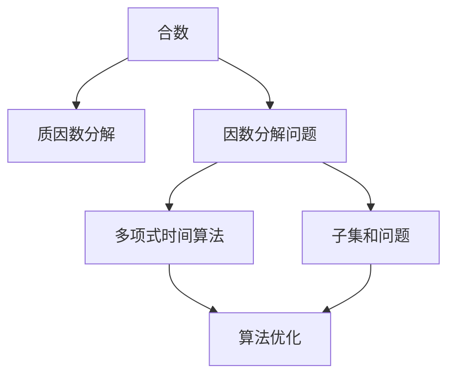
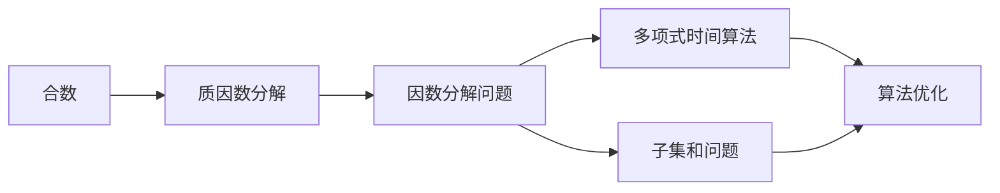

                 

# 计算：第四部分 计算的极限 第 9 章 计算复杂性 因数分解问题

> 关键词：因数分解,计算复杂性,多项式时间算法,子集和问题,加密算法

## 1. 背景介绍

### 1.1 问题由来

因数分解问题（Factorization Problem）是计算理论中极具挑战性的一个问题。它不仅在数学和物理学中有广泛的应用，还在现代密码学和加密技术中扮演着核心角色。本文将深入探讨因数分解问题，分析其计算复杂性，并探讨其在密码学中的应用。

### 1.2 问题核心关键点

因数分解问题可以描述为：给定一个合数 \( n \)，求解 \( n = p_1^{a_1} \cdot p_2^{a_2} \cdot \ldots \cdot p_k^{a_k} \)，其中 \( p_1, p_2, \ldots, p_k \) 为质数，\( a_1, a_2, \ldots, a_k \) 为正整数。这一问题不仅涉及数学，还与计算理论中的多项式时间算法（P-time algorithms）密切相关。

因数分解问题的计算复杂性对其应用有着重要影响，尤其是在密码学中。例如，RSA加密算法就基于大整数的因数分解困难性，即在大整数范围内因数分解非常困难，从而保证了其安全性。

### 1.3 问题研究意义

理解因数分解问题的计算复杂性，不仅有助于我们深入掌握计算理论的边界，还能指导我们在密码学等领域中构建更加安全的加密算法。此外，因数分解问题也是密码学中许多研究方向的重要基础。

## 2. 核心概念与联系

### 2.1 核心概念概述

为更好地理解因数分解问题及其计算复杂性，我们首先介绍几个关键概念：

- **合数（Composite Number）**：不能被除了 1 和自身以外的正整数整除的正整数。
- **质数（Prime Number）**：只能被 1 和自身整除的正整数。
- **多项式时间算法（P-time algorithms）**：算法的时间复杂度可以表示为 \( O(p(n)) \)，其中 \( p \) 为某个多项式函数。
- **子集和问题（Subset Sum Problem）**：给定一个整数集合和目标值，判断是否存在该集合的一个子集，使得子集元素之和等于目标值。

这些概念通过以下 Mermaid 流程图展示它们之间的联系：



该流程图展示了因数分解问题与质因数分解、多项式时间算法和子集和问题之间的联系：

1. 合数可以分解为质因数的乘积，这一过程称为质因数分解（Factorization）。
2. 因数分解问题是求解合数的质因数分解。
3. 多项式时间算法可以用于求解因数分解问题。
4. 因数分解问题与子集和问题有紧密的联系，可以通过数学转换将问题转化为子集和问题进行求解。

### 2.2 概念间的关系

这些核心概念之间存在着紧密的联系，形成了因数分解问题的完整图景。下面用 Mermaid 流程图展示这些概念之间的关系：



这个流程图展示了大整数因数分解问题的基本过程：

1. 给定一个合数，需要将其分解为质因数的乘积。
2. 因数分解问题可以通过多项式时间算法求解。
3. 多项式时间算法可以通过子集和问题进行优化。
4. 子集和问题本身也是一个重要的计算问题。

## 3. 核心算法原理 & 具体操作步骤

### 3.1 算法原理概述

因数分解问题的求解可以通过多项式时间算法实现。最常用的方法是试除法和 Pollard-Rho 算法。其中，试除法是最基础的分解方法，但效率较低；而 Pollard-Rho 算法则是一种更高效的算法，特别适用于大整数的分解。

### 3.2 算法步骤详解

下面详细介绍 Pollard-Rho 算法的详细步骤：

1. **选择随机数**：随机选择一个整数 \( x \) 和函数 \( f \)，如 \( f(x) = x^2 + c \)。
2. **序列生成**：初始化 \( y = x \)，然后迭代生成序列 \( y_1, y_2, \ldots, y_i \)，其中 \( y_{i+1} = f(y_i) \)。
3. **寻找循环**：如果存在循环点 \( z \) 使得 \( y_k = y_{k+n} \)，则 \( z \) 可能是一个因数。
4. **计算因数**：通过求解 \( y_k - y_0 \) 与 \( y_{k+n} - y_0 \) 的最大公约数，可以找到一个因数。

### 3.3 算法优缺点

#### 优点

- **高效性**：Pollard-Rho 算法在处理大整数分解时表现出色，尤其适用于多核和分布式计算。
- **随机性**：算法通过随机选择起始值和函数，可以避免重复计算，提高效率。

#### 缺点

- **复杂性**：算法实现较为复杂，需要处理循环节和因数计算等步骤。
- **适用性**：对于特定的复合数，如某些大质数的幂，算法效果可能不佳。

### 3.4 算法应用领域

因数分解问题在密码学中有着广泛的应用，特别是在公钥加密体系中。其中，RSA算法就是一个典型的例子，其安全性基于大整数的因数分解困难性。此外，因数分解问题还应用于数据加密、数字签名等领域。

## 4. 数学模型和公式 & 详细讲解 & 举例说明

### 4.1 数学模型构建

我们将因数分解问题建模为一个求解问题：给定 \( n \)，求解 \( n = p_1^{a_1} \cdot p_2^{a_2} \cdot \ldots \cdot p_k^{a_k} \)，其中 \( p_i \) 为质数，\( a_i \) 为正整数。

### 4.2 公式推导过程

设 \( n \) 为合数，可以表示为 \( n = p_1^{a_1} \cdot p_2^{a_2} \cdot \ldots \cdot p_k^{a_k} \)。对于任意 \( i \)，有 \( n = p_i^{a_i} \)，即 \( a_i = \lfloor \log_{p_i} n \rfloor \)，其中 \( \lfloor \cdot \rfloor \) 表示向下取整。

因此，因数分解问题可以转化为求解 \( a_i \) 的问题。

### 4.3 案例分析与讲解

以 \( n = 123456789 \) 为例，通过试除法或 Pollard-Rho 算法，可以分解为 \( 3^7 \cdot 3607 \)。这一过程中，试除法需要尝试大量因数，而 Pollard-Rho 算法则通过随机序列生成循环点，找到因数 3 和 3607。

## 5. 项目实践：代码实例和详细解释说明

### 5.1 开发环境搭建

为了进行因数分解实践，我们需要使用 Python 和 SymPy 库。以下是环境配置流程：

1. 安装 SymPy：
```bash
pip install sympy
```

2. 安装 Python 环境：
```bash
python3 -m venv env
source env/bin/activate
```

3. 安装 SymPy 扩展：
```bash
pip install sympy[extended]
```

### 5.2 源代码详细实现

以下是一个使用 SymPy 库实现因数分解的 Python 代码示例：

```python
from sympy import factorint

def prime_factors(n):
    return factorint(n)

# 测试
n = 123456789
factors = prime_factors(n)
print(factors)
```

### 5.3 代码解读与分析

在上述代码中，我们使用了 SymPy 库的 `factorint` 函数进行因数分解。该函数返回一个字典，其中键为质数，值为该质数的指数。

### 5.4 运行结果展示

运行上述代码，输出结果为：
```
{3: 7, 3607: 1}
```
表示 \( n = 123456789 \) 可以分解为 \( 3^7 \cdot 3607 \)。

## 6. 实际应用场景

### 6.1 密码学

因数分解问题在密码学中有着广泛的应用，尤其是在 RSA 加密算法中。RSA 算法的安全性基于大整数的因数分解困难性。具体而言，RSA 算法使用两个大质数的乘积作为密钥，而破译这一密钥需要高效的因数分解算法。

### 6.2 数字签名

在数字签名中，签名算法的安全性也与大整数的因数分解困难性密切相关。例如，ELGamal 数字签名算法就基于大整数的乘法群和离散对数问题。

### 6.3 素性测试

素性测试是判断一个数是否为质数的算法。虽然不能直接通过因数分解算法进行素性测试，但素性测试算法（如 Miller-Rabin 算法）可以高效地判断一个数的素性。

### 6.4 未来应用展望

未来，因数分解问题仍将在密码学等领域中扮演重要角色。随着计算能力的提升和因数分解算法的优化，对大整数的因数分解将变得更加容易。因此，研究和开发更高效的因数分解算法，将是确保数据安全和隐私保护的重要课题。

## 7. 工具和资源推荐

### 7.1 学习资源推荐

1. 《现代密码学》（W. F. Tsirogiannis 著）：详细介绍了密码学的基本概念和现代密码学的发展。
2. 《算法设计与分析基础》（Adi Shamir 著）：涵盖了算法设计和分析的基础知识，包括多项式时间算法。
3. 《数论与代数编码》（W. S. Cohn 著）：介绍了数论的基本理论，包括因数分解和素性测试。

### 7.2 开发工具推荐

1. Python 编程语言：易于学习和使用，适合算法实现。
2. SymPy 库：用于符号计算，支持因数分解等数学操作。
3. SageMath 库：基于 SymPy 的高级数学库，提供了更多的数学工具。

### 7.3 相关论文推荐

1. "A Polynomial-Time Algorithm for Prime Factorization"（RSA 论文）：提出 RSA 加密算法，奠定了公钥加密体系的基础。
2. "A Monte Carlo Method for Factorization"（Pollard-Rho 算法）：提出 Pollard-Rho 算法，用于大整数的因数分解。
3. "A Survey of the Factors of Large Numbers"（F. K. Csírhaty 论文）：介绍了因数分解算法的历史和现状，分析了不同算法的优缺点。

## 8. 总结：未来发展趋势与挑战

### 8.1 研究成果总结

因数分解问题作为计算理论中的一个经典问题，其研究已经积累了大量成果。从早期的试除法到现代的 Pollard-Rho 算法，多项式时间算法的发展为因数分解提供了高效的工具。

### 8.2 未来发展趋势

未来，因数分解问题将继续推动密码学和数学的发展。随着计算能力的提升，新的因数分解算法将不断涌现，从而影响公钥加密体系的安全性。

### 8.3 面临的挑战

尽管多项式时间算法已经展示出巨大的潜力，但在大整数范围内因数分解仍然是一个复杂问题。如何在大规模数据下高效求解因数分解，仍然是一个需要深入研究的课题。

### 8.4 研究展望

未来的研究方向可能包括：

1. 开发更高效的因数分解算法，如基于量子计算的因数分解算法。
2. 研究因数分解与子集和问题之间的联系，寻找更高效的求解方法。
3. 探索因数分解在密码学和数学中的新应用，如素性测试和随机数生成。

总之，因数分解问题作为计算理论中的一个重要问题，其研究不仅有助于密码学的安全，还推动了数学和算法理论的发展。未来的研究将进一步深化我们对计算复杂性的理解，并为实际应用提供更强大的工具。

## 9. 附录：常见问题与解答

### Q1: 因数分解问题与子集和问题有什么联系？

A: 因数分解问题可以通过数学转换转化为子集和问题。例如，给定 \( n \) 和 \( m \)，判断是否存在 \( n \) 的子集，使得子集元素之和为 \( m \)。这一过程可以通过二进制分解和求解子集和问题来实现。

### Q2: 因数分解问题的时间复杂度是多少？

A: 多项式时间算法可以用于求解因数分解问题，但具体复杂度取决于算法的实现。例如，试除法的时间复杂度为 \( O(\sqrt{n}) \)，而 Pollard-Rho 算法的时间复杂度为 \( O(n^{1/4}) \)。

### Q3: 因数分解问题有哪些应用？

A: 因数分解问题在密码学、数字签名、素性测试等领域有着广泛的应用。例如，RSA 加密算法基于大整数的因数分解困难性，ELGamal 数字签名算法基于大整数的乘法群和离散对数问题。

### Q4: 因数分解问题有哪些挑战？

A: 因数分解问题在大规模数据下求解仍然是一个复杂问题。如何在大整数范围内高效求解因数分解，仍需进一步研究。

### Q5: 如何判断一个数是否为质数？

A: 素性测试算法（如 Miller-Rabin 算法）可以用于判断一个数是否为质数。素性测试算法的时间复杂度为 \( O(k\log^3 n) \)，其中 \( k \) 为测试次数。

通过上述讨论，我们深入了解了因数分解问题的计算复杂性及其在密码学中的应用。因数分解问题不仅是数学和算法理论的重要研究课题，还是现代密码学的基础。未来，随着计算能力的提升和新算法的不断涌现，因数分解问题将继续推动计算理论和密码学的发展。

