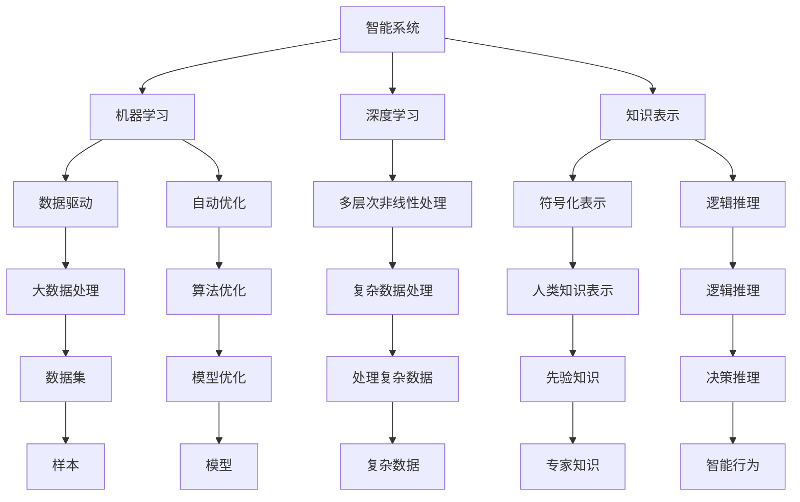
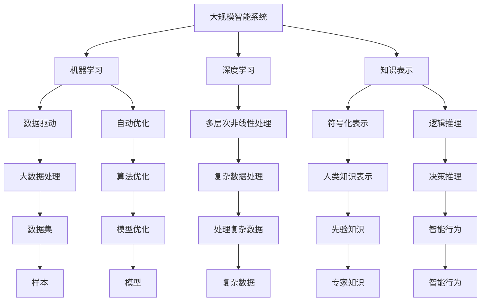

                 

# 计算：附录 C 世界需要什么样的智能系统

## 1. 背景介绍

### 1.1 问题由来
人工智能(AI)技术已经取得了令人瞩目的进展，从自动驾驶、机器人控制到语音识别、自然语言处理等领域，AI的应用无处不在。然而，随着技术的快速发展，人们开始反思，“什么是好的智能系统？”以及“世界需要什么样的智能系统？”

这些问题不仅关系到技术的发展方向，也关乎社会伦理、经济安全等深远问题。本文将从AI技术的现状、挑战和未来趋势三个方面探讨这些问题，希望能为相关领域的研究者和从业者提供一些启发和思考。

### 1.2 问题核心关键点
本文的核心问题是：“世界需要什么样的智能系统？”具体而言，包括：

- 智能系统的定义和评价标准是什么？
- 智能系统的设计原则和伦理准则是什么？
- 智能系统如何应对社会、经济、伦理等复杂环境？

这三个问题构成了本文的主要讨论框架。

## 2. 核心概念与联系

### 2.1 核心概念概述

为了更深入地探讨“世界需要什么样的智能系统”，本文首先介绍几个核心概念：

1. **智能系统(Smart System)**：指能够自主感知、学习、决策和执行任务的计算机系统。智能系统可以是自动化的物理设备，也可以是模拟现实世界的软件系统。

2. **机器学习(Machine Learning)**：指通过数据驱动的算法，让计算机系统自动学习和优化其性能。机器学习是实现智能系统的核心技术之一。

3. **深度学习(Deep Learning)**：一种特殊的机器学习方法，通过多层次的非线性处理，能够处理大规模复杂的数据。深度学习在计算机视觉、语音识别等领域取得了显著成果。

4. **知识表示(Knowledge Representation)**：指用计算机系统表示人类知识的方式。知识表示是实现智能系统的前提，决定了系统的理解力和推理能力。

5. **因果推理(Causal Reasoning)**：指推理过程中考虑因果关系，能够预测和解释因果关系的行为。因果推理是实现智能系统决策的关键。

6. **道德伦理(Ethics and Morality)**：指智能系统设计和应用过程中需要遵循的伦理准则，确保系统的行为符合人类的价值观和法律规范。

这些概念之间的关系可以通过以下Mermaid流程图来展示：



这个流程图展示了智能系统的核心组成和关键技术。智能系统的构建离不开机器学习、深度学习、知识表示、因果推理等多方面的技术支持。同时，智能系统的设计和应用还需要遵循伦理道德准则，确保其行为符合社会价值观。

### 2.2 概念间的关系

这些核心概念之间存在着紧密的联系，共同构成了智能系统的完整框架。下面我们通过几个Mermaid流程图来展示这些概念之间的关系。

#### 2.2.1 智能系统的学习范式

```mermaid
graph TB
    A[智能系统] --> B[机器学习]
    A --> C[深度学习]
    B --> D[监督学习]
    B --> E[强化学习]
    B --> F[无监督学习]
    C --> G[神经网络]
    C --> H[卷积神经网络]
    C --> I[循环神经网络]
    D --> J[标注数据]
    E --> K[奖励信号]
    F --> L[无标注数据]
    G --> M[多层感知机]
    H --> N[卷积操作]
    I --> O[序列操作]
    J --> P[监督样本]
    K --> Q[强化信号]
    L --> R[无监督样本]
    M --> S[多层网络]
    N --> T[卷积层]
    O --> U[递归网络]
    P --> V[监督任务]
    Q --> W[强化任务]
    R --> X[无监督任务]
    S --> Y[复杂模型]
    T --> Z[卷积特征]
    U --> $[递归特征]
    V --> [监督学习]
    W --> [强化学习]
    X --> [无监督学习]
    Y --> [智能行为]
    Z --> [特征提取]
    [卷积特征]
    $ --> [特征提取]
```

这个流程图展示了智能系统的三种主要学习范式：监督学习、强化学习、无监督学习。这些学习范式通过不同的数据和算法，训练智能系统的不同模块，实现其智能行为。

#### 2.2.2 深度学习在智能系统中的应用

```mermaid
graph TB
    A[深度学习] --> B[智能系统]
    A --> C[卷积神经网络]
    A --> D[循环神经网络]
    A --> E[生成对抗网络]
    A --> F[自编码器]
    B --> G[计算机视觉]
    B --> H[语音识别]
    B --> I[自然语言处理]
    C --> J[图像分类]
    D --> K[时间序列分析]
    E --> L[图像生成]
    F --> M[数据压缩]
    G --> N[图像识别]
    H --> O[语音识别]
    I --> P[文本分析]
    J --> Q[图像分类]
    K --> R[时间序列预测]
    L --> S[图像生成]
    M --> T[数据压缩]
    N --> U[图像识别]
    O --> V[语音识别]
    P --> W[文本分析]
    Q --> X[图像分类]
    R --> Y[时间序列预测]
    S --> Z[图像生成]
    T --> $[数据压缩]
    U --> [图像识别]
    V --> [语音识别]
    W --> [文本分析]
    X --> [图像分类]
    Y --> [时间序列预测]
    Z --> [图像生成]
    $ --> [数据压缩]
```

这个流程图展示了深度学习在智能系统中的主要应用。卷积神经网络、循环神经网络和生成对抗网络等深度学习模型，被广泛应用于计算机视觉、语音识别、自然语言处理等领域，推动了智能系统的快速发展。

#### 2.2.3 知识表示与智能系统的关联

```mermaid
graph LR
    A[知识表示] --> B[智能系统]
    A --> C[符号化表示]
    A --> D[逻辑推理]
    B --> E[符号化处理]
    B --> F[逻辑推理]
    C --> G[知识库]
    C --> H[本体论]
    C --> I[语义网络]
    D --> J[规则引擎]
    D --> K[专家系统]
    E --> L[知识图谱]
    E --> M[知识抽取]
    F --> N[推理机]
    F --> O[知识推理]
    G --> P[知识库]
    H --> Q[本体论]
    I --> R[语义网络]
    J --> S[规则引擎]
    K --> T[专家系统]
    L --> U[知识图谱]
    M --> V[知识抽取]
    N --> W[推理机]
    O --> X[知识推理]
    P --> Y[知识库]
    Q --> Z[本体论]
    R --> $[语义网络]
    S --> [规则引擎]
    T --> [专家系统]
    U --> [知识图谱]
    V --> [知识抽取]
    W --> [推理机]
    X --> [知识推理]
    Y --> [知识库]
    Z --> [本体论]
    $ --> [语义网络]
```

这个流程图展示了知识表示与智能系统的关联。符号化表示和逻辑推理技术，使智能系统能够理解和应用人类知识，增强其智能推理和决策能力。

#### 2.2.4 智能系统的伦理道德约束

```mermaid
graph LR
    A[伦理道德] --> B[智能系统]
    A --> C[人类价值观]
    A --> D[法律法规]
    B --> E[行为规范]
    B --> F[透明公正]
    B --> G[安全性]
    B --> H[隐私保护]
    C --> I[伦理准则]
    C --> J[社会责任]
    D --> K[法律规定]
    D --> L[政策要求]
    E --> M[行为规范]
    E --> N[责任主体]
    F --> O[透明公正]
    F --> P[数据公开]
    G --> Q[安全性]
    G --> R[数据安全]
    H --> S[隐私保护]
    H --> T[数据匿名]
    I --> U[伦理准则]
    I --> V[行为指南]
    J --> W[社会责任]
    J --> X[公益事业]
    K --> Y[法律规定]
    K --> Z[合规性]
    L --> [政策要求]
    L --> [法规遵循]
    M --> [行为规范]
    M --> [责任主体]
    N --> [责任主体]
    O --> [透明公正]
    O --> [数据公开]
    P --> [数据公开]
    Q --> [安全性]
    Q --> [数据安全]
    R --> [数据安全]
    S --> [隐私保护]
    S --> [数据匿名]
    U --> [伦理准则]
    U --> [行为指南]
    V --> [行为指南]
    W --> [社会责任]
    W --> [公益事业]
    X --> [公益事业]
    Y --> [法律规定]
    Y --> [合规性]
    Z --> [法规遵循]
```

这个流程图展示了智能系统的伦理道德约束。智能系统需要遵循人类的价值观和法律法规，确保其行为透明公正、安全可靠，同时保护用户的隐私。

### 2.3 核心概念的整体架构

最后，我们用一个综合的流程图来展示这些核心概念在大规模智能系统中的整体架构：



这个综合流程图展示了从预训练到微调，再到持续学习的完整过程。智能系统首先在大规模数据上进行预训练，然后通过机器学习、深度学习和知识表示等技术，进行微调和优化，最后通过持续学习技术，系统可以不断学习新知识，适应数据分布的变化。

## 3. 核心算法原理 & 具体操作步骤
### 3.1 算法原理概述

智能系统的构建离不开机器学习、深度学习和知识表示等多方面的技术支持。本文重点介绍机器学习和深度学习的核心算法原理和操作步骤。

### 3.2 算法步骤详解

#### 3.2.1 机器学习的基本流程

机器学习的基本流程包括数据准备、模型训练、模型评估和模型应用四个步骤。

1. **数据准备**：收集和预处理训练数据，包括数据清洗、特征提取、数据集划分等。
2. **模型训练**：选择合适的机器学习算法，对模型进行训练，调整模型参数，最小化损失函数。
3. **模型评估**：使用测试数据集对模型进行评估，计算评估指标，如准确率、召回率、F1值等。
4. **模型应用**：将训练好的模型应用到实际问题中，进行预测和推理。

#### 3.2.2 深度学习的核心算法

深度学习的核心算法包括卷积神经网络(CNN)、循环神经网络(RNN)和生成对抗网络(GAN)等。

1. **卷积神经网络**：通过多层卷积操作，提取图像、文本等数据的局部特征，广泛应用于计算机视觉、自然语言处理等领域。
2. **循环神经网络**：通过时间序列处理，能够捕捉时间上的依赖关系，广泛应用于语音识别、自然语言生成等领域。
3. **生成对抗网络**：通过对抗训练，生成高质量的图像、语音等数据，广泛应用于数据增强、图像生成等领域。

#### 3.2.3 算法优缺点

机器学习和深度学习在应用中各有优缺点：

- **优点**：
  - 可以处理大规模数据，自动发现数据中的模式和规律。
  - 在特定任务上通常能够取得更好的效果。
- **缺点**：
  - 模型复杂度高，需要大量的计算资源和训练时间。
  - 模型难以解释，缺乏可解释性。
  - 需要大量的标注数据，标注成本较高。

### 3.3 算法应用领域

机器学习和深度学习在多个领域得到了广泛应用，包括计算机视觉、语音识别、自然语言处理等。

- **计算机视觉**：如人脸识别、图像分类、目标检测等。
- **语音识别**：如自动语音识别、语音合成等。
- **自然语言处理**：如机器翻译、文本生成、情感分析等。

## 4. 数学模型和公式 & 详细讲解 & 举例说明

### 4.1 数学模型构建

本文将介绍几个常用的数学模型和公式，以帮助读者更好地理解智能系统的构建。

#### 4.1.1 线性回归模型

线性回归模型是一种用于回归问题的基本模型，其数学公式如下：

$$
y = \theta_0 + \theta_1x_1 + \theta_2x_2 + \cdots + \theta_nx_n
$$

其中 $y$ 为预测值，$\theta_0, \theta_1, \cdots, \theta_n$ 为模型参数，$x_1, x_2, \cdots, x_n$ 为输入特征。

#### 4.1.2 逻辑回归模型

逻辑回归模型是一种用于分类问题的基本模型，其数学公式如下：

$$
P(y=1|x) = \sigma(\theta_0 + \theta_1x_1 + \theta_2x_2 + \cdots + \theta_nx_n)
$$

其中 $\sigma(\cdot)$ 为 sigmoid 函数，$y=1$ 表示正类，$y=0$ 表示负类。

#### 4.1.3 神经网络模型

神经网络模型是一种由多个神经元组成的非线性模型，其数学公式如下：

$$
a_i = \sigma(\sum_{j=1}^{m}w_{ij}x_j + b_i)
$$

其中 $a_i$ 为神经元 $i$ 的输出，$w_{ij}$ 为连接权重，$x_j$ 为输入特征，$b_i$ 为偏置项。

#### 4.1.4 卷积神经网络模型

卷积神经网络模型是一种用于图像处理的深度学习模型，其数学公式如下：

$$
y = \sum_{k=1}^{n}w_{k}*conv2d(x_k) + b
$$

其中 $y$ 为输出，$w_k$ 为卷积核，$conv2d(x_k)$ 为卷积操作，$b$ 为偏置项。

#### 4.1.5 生成对抗网络模型

生成对抗网络模型是一种用于生成高质量数据的深度学习模型，其数学公式如下：

$$
G(z) = \sigma(D(z))
$$

其中 $G(z)$ 为生成器，$D(z)$ 为判别器，$z$ 为输入噪声。

### 4.2 公式推导过程

#### 4.2.1 线性回归模型

线性回归模型的损失函数通常采用均方误差(MSE)，其公式如下：

$$
\mathcal{L} = \frac{1}{2N}\sum_{i=1}^N(y_i - \hat{y}_i)^2
$$

其中 $y_i$ 为真实值，$\hat{y}_i$ 为预测值，$N$ 为样本数量。

#### 4.2.2 逻辑回归模型

逻辑回归模型的损失函数通常采用交叉熵损失函数，其公式如下：

$$
\mathcal{L} = -\frac{1}{N}\sum_{i=1}^N[y_i\log \hat{y}_i + (1-y_i)\log(1-\hat{y}_i)]
$$

其中 $y_i$ 为真实值，$\hat{y}_i$ 为预测值，$N$ 为样本数量。

#### 4.2.3 神经网络模型

神经网络模型的损失函数通常采用交叉熵损失函数，其公式如下：

$$
\mathcal{L} = -\frac{1}{N}\sum_{i=1}^N\sum_{j=1}^C[y_{ij}\log \hat{y}_{ij} + (1-y_{ij})\log(1-\hat{y}_{ij})]
$$

其中 $y_{ij}$ 为真实标签，$\hat{y}_{ij}$ 为预测值，$N$ 为样本数量，$C$ 为类别数。

#### 4.2.4 卷积神经网络模型

卷积神经网络模型的损失函数通常采用交叉熵损失函数，其公式如下：

$$
\mathcal{L} = -\frac{1}{N}\sum_{i=1}^N\sum_{j=1}^C[y_{ij}\log \hat{y}_{ij} + (1-y_{ij})\log(1-\hat{y}_{ij})]
$$

其中 $y_{ij}$ 为真实标签，$\hat{y}_{ij}$ 为预测值，$N$ 为样本数量，$C$ 为类别数。

#### 4.2.5 生成对抗网络模型

生成对抗网络模型的损失函数通常采用Wasserstein距离，其公式如下：

$$
\mathcal{L}_G = -\mathbb{E}_{x\sim p(x)}[D(G(x))]
$$

$$
\mathcal{L}_D = -\mathbb{E}_{x\sim p(x)}[D(x)] + \mathbb{E}_{z\sim p(z)}[D(G(z))]
$$

其中 $D(z)$ 为判别器，$G(z)$ 为生成器，$x$ 为真实数据，$z$ 为噪声数据，$p(x)$ 为数据分布。

### 4.3 案例分析与讲解

下面我们以一个具体的案例来讲解如何使用机器学习和深度学习技术解决实际问题。

#### 案例：手写数字识别

手写数字识别是一种常见的计算机视觉任务，其目标是从输入的手写数字图片中识别出数字。

1. **数据准备**：收集大量手写数字图片作为训练数据，并进行数据清洗、特征提取等预处理。
2. **模型训练**：选择卷积神经网络模型作为基本架构，使用交叉熵损失函数，对模型进行训练，调整卷积核和偏置等参数。
3. **模型评估**：使用测试数据集对模型进行评估，计算准确率、召回率等评估指标。
4. **模型应用**：将训练好的模型应用到实际问题中，对输入的未知手写数字图片进行预测和识别。

通过以上步骤，可以构建一个高效准确的手写数字识别系统。

## 5. 项目实践：代码实例和详细解释说明

### 5.1 开发环境搭建

在进行机器学习和深度学习项目开发前，需要准备合适的开发环境。以下是使用Python进行TensorFlow开发的环境配置流程：

1. 安装Anaconda：从官网下载并安装Anaconda，用于创建独立的Python环境。

2. 创建并激活虚拟环境：
```bash
conda create -n tensorflow-env python=3.8 
conda activate tensorflow-env
```

3. 安装TensorFlow：根据CUDA版本，从官网获取对应的安装命令。例如：
```bash
conda install tensorflow
```

4. 安装各类工具包：
```bash
pip install numpy pandas scikit-learn matplotlib tqdm jupyter notebook ipython
```

完成上述步骤后，即可在`tensorflow-env`环境中开始项目开发。

### 5.2 源代码详细实现

下面我们以手写数字识别项目为例，给出使用TensorFlow进行机器学习和深度学习的PyTorch代码实现。

首先，定义模型和优化器：

```python
import tensorflow as tf
from tensorflow.keras import layers, models

model = models.Sequential([
    layers.Conv2D(32, (3, 3), activation='relu', input_shape=(28, 28, 1)),
    layers.MaxPooling2D((2, 2)),
    layers.Conv2D(64, (3, 3), activation='relu'),
    layers.MaxPooling2D((2, 2)),
    layers.Conv2D(64, (3, 3), activation='relu'),
    layers.Flatten(),
    layers.Dense(64, activation='relu'),
    layers.Dense(10)
])

optimizer = tf.keras.optimizers.Adam()

# 定义损失函数
loss_fn = tf.keras.losses.SparseCategoricalCrossentropy(from_logits=True)

# 定义评估指标
acc_metric = tf.keras.metrics.SparseCategoricalAccuracy()
```

然后，定义训练和评估函数：

```python
import numpy as np
from tensorflow.keras.datasets import mnist
from tensorflow.keras.utils import to_categorical

# 加载数据集
(x_train, y_train), (x_test, y_test) = mnist.load_data()

# 数据预处理
x_train = x_train.reshape(-1, 28, 28, 1).astype('float32') / 255.0
x_test = x_test.reshape(-1, 28, 28, 1).astype('float32') / 255.0
y_train = to_categorical(y_train, num_classes=10)
y_test = to_categorical(y_test, num_classes=10)

# 训练函数
@tf.function
def train_epoch(model, x_train, y_train, optimizer, loss_fn):
    for batch in range(0, len(x_train), 32):
        x_batch = x_train[batch:batch+32]
        y_batch = y_train[batch:batch+32]
        with tf.GradientTape() as tape:
            logits = model(x_batch)
            loss_value = loss_fn(y_batch, logits)
        gradients = tape.gradient(loss_value, model.trainable_variables)
        optimizer.apply_gradients(zip(gradients, model.trainable_variables))
    return loss_value

# 评估函数
@tf.function
def evaluate(model, x_test, y_test):
    logits = model(x_test)
    predictions = tf.argmax(logits, axis=1)
    accuracy = np.mean(predictions == y_test)
    return accuracy
```

最后，启动训练流程并在测试集上评估：

```python
epochs = 10

for epoch in range(epochs):
    loss_value = train_epoch(model, x_train, y_train, optimizer, loss_fn)
    accuracy = evaluate(model, x_test, y_test)
    print(f"Epoch {epoch+1}, loss: {loss_value:.3f}, accuracy: {accuracy:.3f}")

print(f"Final accuracy: {accuracy:.3f}")
```

以上就是使用TensorFlow进行手写数字识别的完整代码实现。可以看到，得益于TensorFlow的强大封装，我们可以用相对简洁的代码完成机器学习和深度学习模型的构建和训练。

### 5.3 代码解读与分析

让我们再详细解读一下关键代码的实现细节：

**model定义**：
- 首先定义一个Sequential模型，依次添加卷积层、池化层和全连接层，形成完整的卷积神经网络架构。
- 使用`input_shape`参数指定输入图片的形状，`Activation`参数指定激活函数。
- 使用`Flatten`层将卷积层输出的二维特征图展平，便于输入到全连接层。
- 最后定义输出层的神经元个数，即分类数目。

**optimizer定义**：
- 选择Adam优化器，并设置学习率。

**loss_fn定义**：
- 使用SparseCategoricalCrossentropy损失函数，指定`from_logits=True`参数，表示输出为logits而非概率值。

**数据预处理**：
- 加载MNIST数据集，并进行归一化处理，将像素值缩放到0到1之间。
- 对标签进行one-hot编码，以便与输出层的神经元对应。

**train_epoch函数**：
- 使用`tf.function`装饰器进行图优化，加速模型训练过程。
- 对每个批次的样本进行前向传播，计算损失值。
- 使用`tf.GradientTape`计算梯度，并使用`optimizer.apply_gradients`更新模型参数。
- 返回该批次的损失值。

**evaluate函数**：
- 使用`tf.function`装饰器进行图优化。
- 对测试集进行前向传播，得到模型的预测结果。
- 计算预测结果与真实标签的匹配率，即准确率。
- 返回该次评估的准确率。

**训练流程**：
- 定义总的epoch数，开始循环迭代
- 每个epoch内，先在训练集上训练，输出损失值和准确率
- 在测试集上评估，输出最终准确率

可以看到，TensorFlow提供了高度封装和优化的API，使得模型构建和训练过程变得简单高效。开发者可以通过微调超参数、使用更

