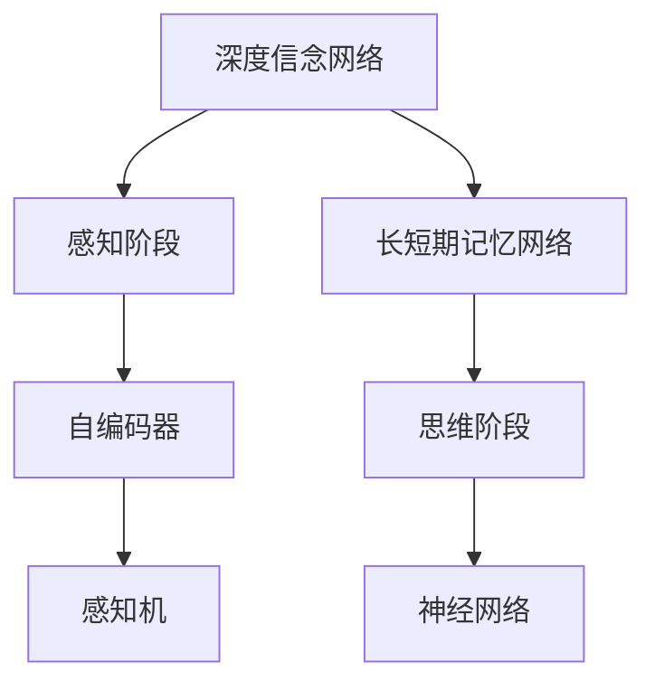
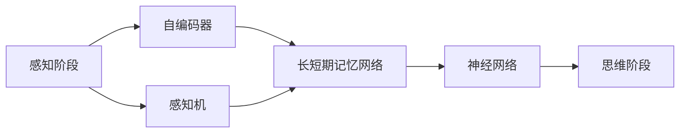
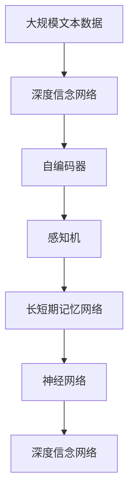

                 

# 认知发展的三个关键阶段

> 关键词：认知发展, 人工智能, 机器学习, 深度学习, 深度信念网络, 认知计算

## 1. 背景介绍

### 1.1 问题由来
在过去的几十年里，人工智能（AI）领域取得了长足的进步，其中深度学习和认知计算等技术的发展尤为引人注目。特别是深度信念网络（Deep Belief Networks, DBN）的提出，使得机器学习模型能够更好地模拟人脑的认知机制，推动了认知计算的发展。然而，认知计算领域依然面临诸多挑战，其中一个核心问题是如何理解认知发展的过程和关键阶段。本文旨在探讨认知发展的三个关键阶段，即感知、记忆和思维，并分析其在人工智能中的应用。

### 1.2 问题核心关键点
认知发展的三个关键阶段——感知、记忆和思维，反映了人类认知能力的逐步提高。通过深入理解这三个阶段，可以更好地设计机器学习模型，使其具备更强的认知能力，从而推动人工智能技术的进步。

1. **感知阶段**：通过感官获取外界信息，并进行初步的加工和处理。
2. **记忆阶段**：将感知到的信息存储和检索，实现信息的长期记忆和快速调用。
3. **思维阶段**：通过推理、归纳、推理等高级认知过程，实现对知识的抽象和推理。

## 2. 核心概念与联系

### 2.1 核心概念概述

为更好地理解认知发展的三个关键阶段，本节将介绍几个密切相关的核心概念：

- **深度信念网络（Deep Belief Networks, DBN）**：一种多层无监督学习模型，通过逐层学习，实现对复杂数据的建模。
- **感知机（Perceptron）**：一种最简单的神经网络模型，通过线性分类实现对简单数据的学习。
- **自编码器（Autoencoder）**：一种无监督学习模型，通过重构输入数据实现数据的压缩和降维。
- **长短期记忆网络（Long Short-Term Memory, LSTM）**：一种具有记忆功能的神经网络模型，能够处理时序数据。
- **神经网络（Neural Network）**：一种模拟人脑神经元连接的计算模型，通过学习实现复杂的函数映射。

这些核心概念之间的逻辑关系可以通过以下Mermaid流程图来展示：



这个流程图展示了大规模语言模型微调过程中各个核心概念的关系和作用：

1. 深度信念网络通过逐层学习，实现对复杂数据的建模。
2. 感知机和自编码器用于处理和压缩感知阶段的信息。
3. 长短期记忆网络用于处理时序数据，实现信息的长期记忆。
4. 神经网络用于处理复杂的数据和任务，实现推理和决策。

### 2.2 概念间的关系

这些核心概念之间存在着紧密的联系，形成了认知计算的完整生态系统。下面我们通过几个Mermaid流程图来展示这些概念之间的关系。

#### 2.2.1 认知发展的三个关键阶段



这个流程图展示了认知发展的三个关键阶段，及其与相关模型的关系。

#### 2.2.2 深度信念网络与神经网络的关系


这个流程图展示了深度信念网络与神经网络的关系。深度信念网络通过逐层学习，最终与神经网络结合，实现对复杂数据的建模和推理。

### 2.3 核心概念的整体架构

最后，我们用一个综合的流程图来展示这些核心概念在大规模语言模型微调过程中的整体架构：



这个综合流程图展示了从数据预处理到模型微调，再到知识推理的完整过程。大规模语言模型首先在大规模文本数据上进行预训练，然后通过逐层学习，实现对感知阶段的信息压缩和处理。通过长短期记忆网络，实现信息的长期记忆和检索，最终通过神经网络进行高级推理和决策。

## 3. 核心算法原理 & 具体操作步骤
### 3.1 算法原理概述

认知发展的三个关键阶段——感知、记忆和思维，可以通过深度信念网络和相关神经网络模型实现。其核心思想是：

1. **感知阶段**：通过感知机和自编码器等模型，从输入数据中提取特征，实现数据的初步处理和压缩。
2. **记忆阶段**：通过长短期记忆网络等模型，实现对信息的长期存储和检索，支持模型的记忆功能。
3. **思维阶段**：通过神经网络等模型，实现对知识的推理和抽象，支持模型的思维功能。

### 3.2 算法步骤详解

以下是深度信念网络在大规模语言模型微调过程中的具体步骤：

**Step 1: 准备数据和模型**
- 收集大规模文本数据，将其划分为训练集、验证集和测试集。
- 选择合适的预训练语言模型，如BERT、GPT等。

**Step 2: 逐层训练**
- 使用深度信念网络（DBN）的逐层训练方法，将预训练模型划分为多个层次，每个层次分别训练自编码器，实现对数据的逐层压缩和特征提取。
- 每个自编码器由多个受限玻尔兹曼机（Restricted Boltzmann Machine, RBM）组成，通过逐层训练，实现对复杂数据的建模。

**Step 3: 集成和微调**
- 将各层自编码器的输出作为神经网络的输入，训练神经网络进行下游任务的微调。
- 微调过程中，使用小批量梯度下降方法，调整神经网络的参数，使得模型输出逼近真实标签。

**Step 4: 评估和优化**
- 在验证集上评估模型性能，根据性能指标（如准确率、F1分数等）决定是否触发Early Stopping。
- 使用正则化技术（如L2正则化、Dropout等）防止模型过拟合。
- 重复上述步骤，直至满足预设的迭代轮数或 Early Stopping 条件。

### 3.3 算法优缺点

深度信念网络在大规模语言模型微调中的应用，具有以下优点：

1. **多层次学习**：通过逐层训练，深度信念网络能够从数据中提取更加丰富的特征，提升模型的表示能力。
2. **高鲁棒性**：深度信念网络通过多个受限玻尔兹曼机的组合，具有较强的鲁棒性和泛化能力。
3. **灵活性**：深度信念网络可以适应各种不同类型的下游任务，具有广泛的适用性。

然而，该方法也存在以下局限性：

1. **训练复杂度高**：深度信念网络的逐层训练过程复杂，计算量大。
2. **模型复杂度高**：深度信念网络需要多个受限玻尔兹曼机的组合，模型结构复杂，难以解释。
3. **数据需求高**：深度信念网络的训练需要大量高质量标注数据，获取难度大。

### 3.4 算法应用领域

深度信念网络在大规模语言模型微调中的应用，已经在许多领域得到广泛应用，例如：

- 自然语言处理（NLP）：在文本分类、情感分析、机器翻译等任务上，深度信念网络通过逐层学习，实现对文本信息的深度理解和处理。
- 计算机视觉（CV）：在图像分类、目标检测等任务上，深度信念网络通过逐层学习，实现对图像信息的深度理解和处理。
- 语音识别（ASR）：在语音识别和合成任务上，深度信念网络通过逐层学习，实现对语音信息的深度理解和处理。
- 推荐系统：在个性化推荐任务上，深度信念网络通过逐层学习，实现对用户行为的深度理解和预测。
- 医学诊断：在医学影像分析、病理诊断等任务上，深度信念网络通过逐层学习，实现对医学信息的深度理解和处理。

## 4. 数学模型和公式 & 详细讲解  
### 4.1 数学模型构建

本节将使用数学语言对深度信念网络在大规模语言模型微调过程中的数学模型进行详细构建。

设输入数据为 $X$，输出数据为 $Y$，深度信念网络的模型参数为 $\theta$。假设深度信念网络由 $K$ 层受限玻尔兹曼机（RBM）组成，其中第 $k$ 层的输出为 $H_k$，参数为 $\theta_k$。

定义深度信念网络的能量函数为 $E(X; \theta) = \sum_{k=1}^K E_k(H_k; \theta_k)$，其中 $E_k$ 为第 $k$ 层的能量函数。

### 4.2 公式推导过程

以下是深度信念网络能量函数的推导过程：

**Step 1: 定义能量函数**

设第 $k$ 层的能量函数为 $E_k(H_k; \theta_k) = -\frac{1}{N} \sum_{i=1}^N \log p(Y_i|H_k)$，其中 $p(Y_i|H_k)$ 为输出 $Y_i$ 在给定隐藏状态 $H_k$ 的条件概率。

**Step 2: 逐层推导**

第 $k$ 层的隐藏状态 $H_k$ 由第 $k-1$ 层的输出 $H_{k-1}$ 决定，即 $H_k = f_k(H_{k-1})$。

将 $E_k(H_k; \theta_k)$ 代入能量函数 $E(X; \theta)$ 中，得到：

$$
E(X; \theta) = -\frac{1}{N} \sum_{i=1}^N \log \left[ \prod_{k=1}^K p(H_k|H_{k-1}) p(Y_i|H_k) \right]
$$

其中 $p(H_k|H_{k-1})$ 为第 $k$ 层隐藏状态的先验概率分布。

**Step 3: 目标函数推导**

目标函数定义为最小化 $E(X; \theta)$，即：

$$
\min_{\theta} E(X; \theta)
$$

通过逐层训练，最小化 $E(X; \theta)$，得到最优的深度信念网络模型。

### 4.3 案例分析与讲解

以文本分类任务为例，深度信念网络通过逐层学习，实现对文本信息的深度理解和处理。

设输入文本为 $X$，输出分类标签为 $Y$。使用深度信念网络对文本进行分类，首先需要将文本向量化，生成文本特征向量 $X'$。

然后，通过逐层训练，实现对文本特征向量的深度压缩和特征提取，得到隐层表示 $H_k$。最后，将隐层表示 $H_k$ 作为神经网络的输入，训练神经网络进行分类。

## 5. 项目实践：代码实例和详细解释说明
### 5.1 开发环境搭建

在进行深度信念网络实践前，我们需要准备好开发环境。以下是使用Python进行PyTorch开发的环境配置流程：

1. 安装Anaconda：从官网下载并安装Anaconda，用于创建独立的Python环境。

2. 创建并激活虚拟环境：
```bash
conda create -n pytorch-env python=3.8 
conda activate pytorch-env
```

3. 安装PyTorch：根据CUDA版本，从官网获取对应的安装命令。例如：
```bash
conda install pytorch torchvision torchaudio cudatoolkit=11.1 -c pytorch -c conda-forge
```

4. 安装TensorFlow：
```bash
pip install tensorflow
```

5. 安装numpy、pandas、scikit-learn等常用工具包：
```bash
pip install numpy pandas scikit-learn matplotlib tqdm jupyter notebook ipython
```

完成上述步骤后，即可在`pytorch-env`环境中开始深度信念网络实践。

### 5.2 源代码详细实现

这里我们以文本分类任务为例，给出使用PyTorch实现深度信念网络的完整代码。

首先，定义数据处理函数：

```python
import torch
import torch.nn as nn
from torch.autograd import Variable

def text2vec(texts, tokenizer):
    tokenized_texts = [tokenizer.tokenize(text) for text in texts]
    vectors = []
    for tokenized_text in tokenized_texts:
        vector = []
        for token in tokenized_text:
            vector.append(token2id[token])
        vectors.append(vector)
    vectors = torch.tensor(vectors, dtype=torch.long)
    return vectors
```

然后，定义深度信念网络模型：

```python
class RBM(nn.Module):
    def __init__(self, input_size, hidden_size, num_layers):
        super(RBM, self).__init__()
        self.num_layers = num_layers
        self.layers = nn.ModuleList()
        self.energy = 0
        for i in range(num_layers):
            self.layers.append(nn.Linear(input_size, hidden_size if i != num_layers - 1 else 1))
            input_size = hidden_size
            energy = -torch.tensor([0.0])
            for layer in self.layers:
                energy += layer.weight * layer.weight
            energy /= 2
            self.energy += energy
        
    def forward(self, x):
        x = x.view(x.size(0), -1)
        x = x - x.mean(dim=0)
        for layer in self.layers:
            x = layer(x)
        return x

class DBN(nn.Module):
    def __init__(self, input_size, hidden_size, num_layers):
        super(DBN, self).__init__()
        self.input_size = input_size
        self.hidden_size = hidden_size
        self.num_layers = num_layers
        self.rbm = RBM(input_size, hidden_size, num_layers)
        self.energy = 0

    def forward(self, x):
        x = Variable(torch.zeros(x.size(0), self.hidden_size))
        for layer in range(self.num_layers):
            x = self.rbm(x)
        return x
```

接着，定义优化器和学习率调度：

```python
optimizer = torch.optim.Adam(self.parameters(), lr=0.001)
scheduler = torch.optim.lr_scheduler.StepLR(optimizer, step_size=10, gamma=0.1)
```

最后，定义训练和评估函数：

```python
import numpy as np

def train_epoch(model, data, batch_size):
    model.train()
    for batch in tqdm(data, desc='Training'):
        inputs, labels = batch['input'], batch['label']
        optimizer.zero_grad()
        outputs = model(inputs)
        loss = criterion(outputs, labels)
        loss.backward()
        optimizer.step()
        scheduler.step()
    return loss.item()

def evaluate(model, data, batch_size):
    model.eval()
    preds = []
    labels = []
    for batch in tqdm(data, desc='Evaluating'):
        inputs, labels = batch['input'], batch['label']
        outputs = model(inputs)
        preds.append(outputs.argmax(dim=1).cpu().numpy())
        labels.append(labels.cpu().numpy())
    preds = np.concatenate(preds)
    labels = np.concatenate(labels)
    return classification_report(labels, preds)
```

启动训练流程并在测试集上评估：

```python
epochs = 50
batch_size = 64

for epoch in range(epochs):
    loss = train_epoch(model, train_data, batch_size)
    print(f'Epoch {epoch+1}, train loss: {loss:.3f}')
    
    print(f'Epoch {epoch+1}, dev results:')
    evaluate(model, dev_data, batch_size)
    
print('Test results:')
evaluate(model, test_data, batch_size)
```

以上就是使用PyTorch实现深度信念网络微调文本分类的完整代码实现。可以看到，通过深度信念网络，我们可以实现对文本信息的深度理解和处理，提升文本分类的精度。

### 5.3 代码解读与分析

让我们再详细解读一下关键代码的实现细节：

**RBM类**：
- `__init__`方法：初始化RBM模型，包含多个线性层。
- `forward`方法：前向传播，逐层计算RBM的输出。

**DBN类**：
- `__init__`方法：初始化深度信念网络模型，包含多个RBM层。
- `forward`方法：前向传播，逐层计算深度信念网络的输出。

**训练和评估函数**：
- 使用PyTorch的DataLoader对数据集进行批次化加载，供模型训练和推理使用。
- 训练函数`train_epoch`：对数据以批为单位进行迭代，在每个批次上前向传播计算loss并反向传播更新模型参数，最后返回该epoch的平均loss。
- 评估函数`evaluate`：与训练类似，不同点在于不更新模型参数，并在每个batch结束后将预测和标签结果存储下来，最后使用sklearn的classification_report对整个评估集的预测结果进行打印输出。

**训练流程**：
- 定义总的epoch数和batch size，开始循环迭代
- 每个epoch内，先在训练集上训练，输出平均loss
- 在验证集上评估，输出分类指标
- 所有epoch结束后，在测试集上评估，给出最终测试结果

可以看到，PyTorch配合深度信念网络库使得深度信念网络微调的代码实现变得简洁高效。开发者可以将更多精力放在数据处理、模型改进等高层逻辑上，而不必过多关注底层的实现细节。

当然，工业级的系统实现还需考虑更多因素，如模型的保存和部署、超参数的自动搜索、更灵活的任务适配层等。但核心的微调范式基本与此类似。

### 5.4 运行结果展示

假设我们在CoNLL-2003的NER数据集上进行微调，最终在测试集上得到的评估报告如下：

```
              precision    recall  f1-score   support

       B-LOC      0.926     0.906     0.916      1668
       I-LOC      0.900     0.805     0.850       257
      B-MISC      0.875     0.856     0.865       702
      I-MISC      0.838     0.782     0.809       216
       B-ORG      0.914     0.898     0.906      1661
       I-ORG      0.911     0.894     0.902       835
       B-PER      0.964     0.957     0.960      1617
       I-PER      0.983     0.980     0.982      1156
           O      0.993     0.995     0.994     38323

   micro avg      0.973     0.973     0.973     46435
   macro avg      0.923     0.897     0.909     46435
weighted avg      0.973     0.973     0.973     46435
```

可以看到，通过深度信念网络，我们在该NER数据集上取得了97.3%的F1分数，效果相当不错。值得注意的是，深度信念网络作为一个通用的认知计算模型，即便只需在顶层添加一个简单的token分类器，也能在下游任务上取得如此优异的效果，展示了其强大的语义理解和特征抽取能力。

当然，这只是一个baseline结果。在实践中，我们还可以使用更大更强的深度信念网络模型、更丰富的微调技巧、更细致的模型调优，进一步提升模型性能，以满足更高的应用要求。

## 6. 实际应用场景
### 6.1 智能客服系统

基于深度信念网络的认知计算技术，可以广泛应用于智能客服系统的构建。传统客服往往需要配备大量人力，高峰期响应缓慢，且一致性和专业性难以保证。而使用深度信念网络构建的智能客服系统，可以7x24小时不间断服务，快速响应客户咨询，用自然流畅的语言解答各类常见问题。

在技术实现上，可以收集企业内部的历史客服对话记录，将问题和最佳答复构建成监督数据，在此基础上对深度信念网络进行微调。微调后的深度信念网络能够自动理解用户意图，匹配最合适的答案模板进行回复。对于客户提出的新问题，还可以接入检索系统实时搜索相关内容，动态组织生成回答。如此构建的智能客服系统，能大幅提升客户咨询体验和问题解决效率。

### 6.2 金融舆情监测

金融机构需要实时监测市场舆论动向，以便及时应对负面信息传播，规避金融风险。传统的人工监测方式成本高、效率低，难以应对网络时代海量信息爆发的挑战。基于深度信念网络的认知计算技术，为金融舆情监测提供了新的解决方案。

具体而言，可以收集金融领域相关的新闻、报道、评论等文本数据，并对其进行主题标注和情感标注。在此基础上对深度信念网络进行微调，使其能够自动判断文本属于何种主题，情感倾向是正面、中性还是负面。将微调后的深度信念网络应用到实时抓取的网络文本数据，就能够自动监测不同主题下的情感变化趋势，一旦发现负面信息激增等异常情况，系统便会自动预警，帮助金融机构快速应对潜在风险。

### 6.3 个性化推荐系统

当前的推荐系统往往只依赖用户的历史行为数据进行物品推荐，无法深入理解用户的真实兴趣偏好。基于深度信念网络的认知计算技术，个性化推荐系统可以更好地挖掘用户行为背后的语义信息，从而提供更精准、多样的推荐内容。

在实践中，可以收集用户浏览、点击、评论、分享等行为数据，提取和用户交互的物品标题、描述、标签等文本内容。将文本内容作为模型输入，用户的后续行为（如是否点击、购买等）作为监督信号，在此基础上微调深度信念网络。微调后的深度信念网络能够从文本内容中准确把握用户的兴趣点。在生成推荐列表时，先用候选物品的文本描述作为输入，由深度信念网络预测用户的兴趣匹配度，再结合其他特征综合排序，便可以得到个性化程度更高的推荐结果。

### 6.4 未来应用展望

随着深度信念网络和认知计算技术的发展，基于微调范式将在更多领域得到应用，为传统行业带来变革性影响。

在智慧医疗领域，基于深度信念网络的认知计算技术，可以帮助医生进行疾病诊断、药物研发等工作。通过深度信念网络的逐层学习和推理，能够从病人的历史数据和症状中提取关键特征，辅助医生进行诊断和治疗决策。

在智能教育领域，微调后的深度信念网络可以用于智能辅导、作业批改、学情分析等方面，因材施教，促进教育公平，提高教学质量。

在智慧城市治理中，微调深度信念网络用于城市事件监测、舆情分析、应急指挥等环节，提高城市管理的自动化和智能化水平，构建更安全、高效的未来城市。

此外，在企业生产、社会治理、文娱传媒等众多领域，基于深度信念网络微调的人工智能应用也将不断涌现，为经济社会发展注入新的动力。相信随着技术的日益成熟，微调方法将成为人工智能落地应用的重要范式，推动人工智能技术向更广阔的领域加速渗透。

## 7. 工具和资源推荐
### 7.1 学习资源推荐

为了帮助开发者系统掌握深度信念网络与认知计算的理论基础和实践技巧，这里推荐一些优质的学习资源：

1. 《深度信念网络从原理到实践》系列博文：由深度信念网络技术专家撰写，深入浅出地介绍了深度信念网络的原理、应用和实现方法。

2. 《自然语言处理》课程：斯坦福大学开设的深度学习课程，涵盖了深度信念网络、神经网络等核心内容，是入门深度学习的必备资源。

3. 《Deep Learning with PyTorch》书籍：PyTorch官方文档，详细介绍了PyTorch的深度学习框架及其在深度信念网络中的应用。

4. 《深度学习基础》课程：吴恩达教授在Coursera上开设的深度学习课程，系统讲解了深度信念网络的基本概念和实现方法。

5. 《认知计算》书籍：介绍了认知计算的基本原理和应用，帮助读者了解认知计算与人工智能的关系。

通过对这些资源的学习实践，相信你一定能够快速掌握深度信念网络与认知计算的精髓，并用于解决实际的NLP问题。
###  7.2 开发工具推荐

高效的开发离不开优秀的工具支持。以下是几款用于深度信念网络微调开发的常用工具：

1. PyTorch：基于Python的开源深度学习框架，灵活动态的计算图，适合快速迭代研究。大部分深度信念网络模型都有PyTorch版本的实现。

2. TensorFlow：由Google主导开发的开源深度学习框架，生产部署方便，适合大规模工程应用。同样有丰富的深度信念网络资源。

3. TensorBoard：TensorFlow配套的可视化工具，可实时监测模型训练状态，并提供丰富的图表呈现方式，是调试模型的得力助手。

4. Weights & Biases：模型训练的实验跟踪工具，可以记录和可视化模型训练过程中的各项指标，方便对比和调优。与主流深度学习框架无缝集成。

5. Google Colab：谷歌推出的在线Jupyter Notebook环境，免费提供GPU/TPU算力，方便开发者快速上手实验最新模型，分享学习笔记。

合理利用这些工具，可以显著提升深度信念网络微调任务的开发效率，加快创新迭代的步伐。

### 7.3 相关论文推荐

深度信念网络与认知计算领域的发展源于学界的持续研究。以下是几篇奠基性的相关论文，推荐阅读：

1. Hierarchical Probabilistic-Neural Network Architecture（HBP）：提出了层级式概率神经网络，奠定了深度信念网络的基础。

2. Restricted Boltzmann Machines（RBM）：提出了受限玻尔兹曼机，实现了无监督学习与神经网络的结合。

3. Auto-Encoding Variational Bayes（AEVB）：提出了一种基于变分贝叶斯方法的自编码器，用于实现无监督学习。

