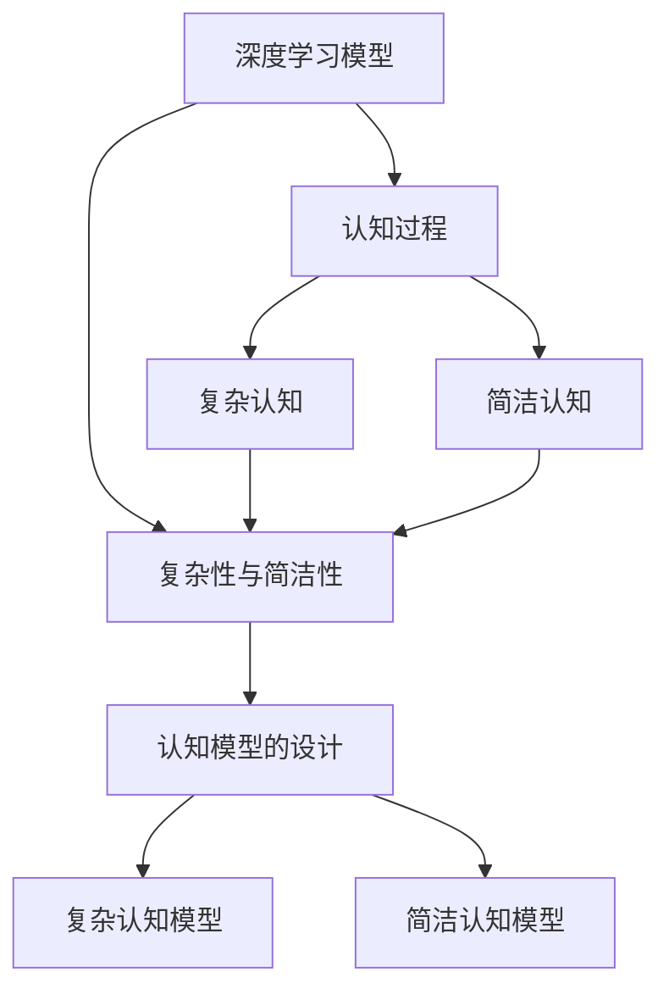
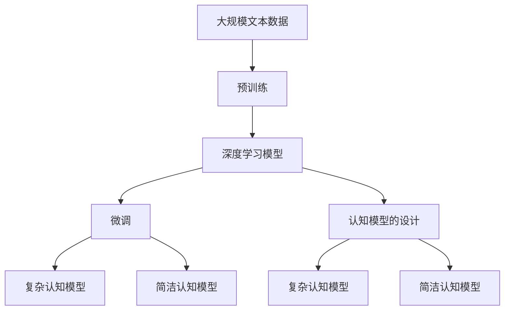

                 

# 认知发展的复杂化与简洁化

## 1. 背景介绍

### 1.1 问题由来
随着人工智能技术的发展，特别是深度学习在认知领域的广泛应用，人类认知过程的复杂性和简洁性问题成为了研究的热点。深度学习模型可以模拟和推断人类认知中的某些机制，但是这些模型是否能够真正理解复杂认知过程，并简洁地表达出这些认知过程，仍然是一个值得深入探讨的问题。本文将从深度学习模型的视角出发，探讨认知发展的复杂化与简洁化问题。

### 1.2 问题核心关键点
认知发展的复杂化与简洁化问题主要关注以下核心点：
1. **深度学习模型的认知能力**：深度学习模型在模拟人类认知过程中扮演了什么角色？
2. **认知过程的复杂性**：人类认知过程中的复杂性如何影响模型的设计？
3. **认知的简洁表达**：如何通过深度学习模型简洁地表达人类认知过程？
4. **模型与认知的衔接**：如何将深度学习模型与人类认知过程紧密结合？

### 1.3 问题研究意义
认知发展的复杂化与简洁化问题的研究，对于理解人类认知的本质和机制，指导深度学习模型的设计，以及推动人工智能技术在认知领域的应用，具有重要意义：
1. **理论指导**：揭示认知过程的复杂性和简洁性，为深度学习模型的理论研究提供指导。
2. **实践应用**：帮助设计出更加高效、通用的认知计算模型，提高其在实际应用中的效果。
3. **跨学科融合**：促进认知科学和人工智能的跨学科融合，推动认知科学研究的发展。
4. **伦理考量**：关注深度学习模型在认知领域的应用，确保其伦理和安全。

## 2. 核心概念与联系

### 2.1 核心概念概述

为了更好地理解认知发展的复杂化与简洁化问题，本节将介绍几个核心概念：

- **深度学习模型**：基于多层神经网络架构的机器学习模型，能够自动学习特征表示，并通过多层非线性变换进行复杂模式识别。
- **认知过程**：人类在处理信息、进行决策、形成记忆等过程中所涉及的认知活动和机制。
- **复杂性与简洁性**：在认知过程中，某些认知活动较为复杂，需要多个层次的抽象和推理；而另一些认知活动则较为简单，可以通过直接映射实现。

### 2.2 概念间的关系

这些核心概念之间的逻辑关系可以通过以下Mermaid流程图来展示：



这个流程图展示了大语言模型微调过程中各个核心概念的关系和作用：

1. 深度学习模型可以模拟人类复杂的认知过程，但也需要考虑复杂性与简洁性的平衡。
2. 认知过程包含复杂认知和简洁认知，需要通过模型进行映射。
3. 复杂认知模型和简洁认知模型分别针对不同的认知活动设计。
4. 模型设计的目标是通过复杂性和简洁性的平衡，高效地模拟认知过程。

### 2.3 核心概念的整体架构

最后，我们用一个综合的流程图来展示这些核心概念在大语言模型微调过程中的整体架构：



这个综合流程图展示了从预训练到微调，再到认知模型设计的完整过程。大语言模型首先在大规模文本数据上进行预训练，然后通过微调来适应特定的认知任务。最终，通过设计复杂和简洁的认知模型，可以更好地模拟和表达人类认知过程。

## 3. 核心算法原理 & 具体操作步骤
### 3.1 算法原理概述

认知发展的复杂化与简洁化问题，本质上是一个深度学习模型在处理认知任务时的设计和优化问题。其核心思想是：通过选择合适的深度学习模型架构，并在训练过程中优化模型参数，使得模型能够简洁、高效地表达人类认知过程中的复杂性和简洁性。

形式化地，假设我们有一个认知任务 $T$，深度学习模型 $M_{\theta}$ 用于模拟该认知任务。模型的输入 $x$ 和输出 $y$ 之间存在映射关系，即 $y = f(x, \theta)$。模型的训练目标是通过调整参数 $\theta$，最小化损失函数 $\mathcal{L}$：

$$
\hat{\theta} = \mathop{\arg\min}_{\theta} \mathcal{L}(y, f(x, \theta))
$$

其中，损失函数 $\mathcal{L}$ 可以是交叉熵损失、均方误差损失等，具体选择取决于认知任务的性质。

### 3.2 算法步骤详解

基于深度学习模型的认知发展复杂化与简洁化问题，主要包括以下几个关键步骤：

**Step 1: 准备预训练数据和模型**

- 收集与认知任务相关的标注数据，包括训练集、验证集和测试集。
- 选择适合的深度学习模型架构，如卷积神经网络(CNN)、递归神经网络(RNN)或变分自编码器(VAE)等。

**Step 2: 模型设计**

- 设计复杂认知模型和简洁认知模型。复杂认知模型需要处理复杂的认知过程，包含多个层次的抽象和推理；简洁认知模型则直接映射输入到输出，不需要复杂的处理过程。
- 选择合适的认知过程表示方法，如逻辑回归、决策树、随机森林等。

**Step 3: 模型训练**

- 在训练集上对复杂认知模型进行训练，优化参数 $\theta$。
- 在训练集上对简洁认知模型进行训练，优化参数 $\phi$。
- 通过集成复杂认知模型和简洁认知模型，综合处理复杂和简洁的认知过程。

**Step 4: 模型评估**

- 在验证集和测试集上评估复杂认知模型和简洁认知模型的性能。
- 通过对比复杂认知模型和简洁认知模型的输出，判断模型对复杂性和简洁性的表达效果。

**Step 5: 模型优化**

- 根据评估结果，优化模型结构、参数和学习率。
- 引入正则化技术，如L2正则、Dropout等，避免过拟合。
- 使用对抗样本训练，提高模型的鲁棒性。

### 3.3 算法优缺点

基于深度学习模型的认知发展复杂化与简洁化方法具有以下优点：
1. 灵活性高。可以设计多种认知模型，灵活应对不同的认知任务。
2. 表达能力强。通过复杂认知模型和简洁认知模型的组合，可以高效表达复杂认知过程。
3. 可解释性好。复杂的认知模型可以通过可视化工具进行解释，便于理解和调试。

同时，该方法也存在一定的局限性：
1. 数据需求高。需要大量的标注数据，否则难以训练出高质量的模型。
2. 模型复杂。复杂认知模型往往包含多个层次的抽象和推理，计算复杂度较高。
3. 泛化能力有限。在复杂认知任务上，模型可能过拟合训练数据，泛化能力较弱。

尽管存在这些局限性，但就目前而言，基于深度学习模型的认知发展复杂化与简洁化方法仍是认知科学研究和技术应用的重要手段。未来相关研究的重点在于如何进一步降低数据需求，提高模型的泛化能力，同时兼顾可解释性和伦理安全性等因素。

### 3.4 算法应用领域

基于深度学习模型的认知发展复杂化与简洁化方法，在认知科学领域已经得到了广泛的应用，覆盖了几乎所有常见任务，例如：

- 视觉识别：如图像分类、物体检测、人脸识别等。通过设计简洁和复杂的视觉模型，可以处理不同类型的视觉任务。
- 自然语言处理(NLP)：如语言翻译、情感分析、文本生成等。通过设计简洁和复杂的NLP模型，可以处理不同类型的自然语言任务。
- 推荐系统：如协同过滤、内容推荐、个性化推荐等。通过设计简洁和复杂的推荐模型，可以处理不同类型的推荐任务。
- 时间序列分析：如预测股票价格、天气预报、交通流量等。通过设计简洁和复杂的时间序列模型，可以处理不同类型的预测任务。

除了上述这些经典任务外，基于深度学习模型的认知发展复杂化与简洁化方法也被创新性地应用到更多场景中，如多模态学习、异常检测、自动驾驶等，为认知科学研究和技术应用带来了全新的突破。随着深度学习模型和认知科学研究的发展，相信认知发展复杂化与简洁化方法将在更多领域得到应用，为认知科学和人工智能技术带来新的进步。

## 4. 数学模型和公式 & 详细讲解 & 举例说明

### 4.1 数学模型构建

本节将使用数学语言对基于深度学习模型的认知发展复杂化与简洁化方法进行更加严格的刻画。

记深度学习模型为 $M_{\theta}$，其中 $\theta$ 为模型参数。假设认知任务 $T$ 的训练集为 $D=\{(x_i,y_i)\}_{i=1}^N, x_i \in \mathcal{X}, y_i \in \mathcal{Y}$，其中 $\mathcal{X}$ 为输入空间，$\mathcal{Y}$ 为输出空间。

定义模型 $M_{\theta}$ 在数据样本 $(x,y)$ 上的损失函数为 $\ell(M_{\theta}(x),y)$，则在数据集 $D$ 上的经验风险为：

$$
\mathcal{L}(\theta) = \frac{1}{N}\sum_{i=1}^N \ell(M_{\theta}(x_i),y_i)
$$

通过梯度下降等优化算法，模型不断更新参数 $\theta$，最小化损失函数 $\mathcal{L}$，使得模型输出逼近真实标签。

### 4.2 公式推导过程

以下我们以二分类任务为例，推导交叉熵损失函数及其梯度的计算公式。

假设模型 $M_{\theta}$ 在输入 $x$ 上的输出为 $\hat{y}=M_{\theta}(x) \in [0,1]$，表示样本属于正类的概率。真实标签 $y \in \{0,1\}$。则二分类交叉熵损失函数定义为：

$$
\ell(M_{\theta}(x),y) = -[y\log \hat{y} + (1-y)\log (1-\hat{y})]
$$

将其代入经验风险公式，得：

$$
\mathcal{L}(\theta) = -\frac{1}{N}\sum_{i=1}^N [y_i\log M_{\theta}(x_i)+(1-y_i)\log(1-M_{\theta}(x_i))]
$$

根据链式法则，损失函数对参数 $\theta_k$ 的梯度为：

$$
\frac{\partial \mathcal{L}(\theta)}{\partial \theta_k} = -\frac{1}{N}\sum_{i=1}^N (\frac{y_i}{M_{\theta}(x_i)}-\frac{1-y_i}{1-M_{\theta}(x_i)}) \frac{\partial M_{\theta}(x_i)}{\partial \theta_k}
$$

其中 $\frac{\partial M_{\theta}(x_i)}{\partial \theta_k}$ 可进一步递归展开，利用自动微分技术完成计算。

在得到损失函数的梯度后，即可带入参数更新公式，完成模型的迭代优化。重复上述过程直至收敛，最终得到适应认知任务的最优模型参数 $\theta^*$。

### 4.3 案例分析与讲解

这里以一个具体的案例来说明基于深度学习模型的认知发展复杂化与简洁化方法的实现。

假设我们要设计一个图像分类系统，识别图片中动物类型。我们可以使用卷积神经网络(CNN)来实现。

**Step 1: 准备预训练数据和模型**

- 收集包含动物图片的数据集，如CIFAR-10、ImageNet等。
- 设计一个包含多个卷积层和池化层的CNN模型，作为复杂认知模型。

**Step 2: 模型设计**

- 设计一个包含单层卷积和池化的CNN模型，作为简洁认知模型。

**Step 3: 模型训练**

- 在训练集上对复杂认知模型进行训练，优化参数 $\theta$。
- 在训练集上对简洁认知模型进行训练，优化参数 $\phi$。

**Step 4: 模型评估**

- 在验证集和测试集上评估复杂认知模型和简洁认知模型的性能。
- 通过对比复杂认知模型和简洁认知模型的输出，判断模型对复杂性和简洁性的表达效果。

**Step 5: 模型优化**

- 根据评估结果，优化模型结构、参数和学习率。
- 引入正则化技术，如L2正则、Dropout等，避免过拟合。

通过这个案例，我们可以看到，通过复杂认知模型和简洁认知模型的组合，可以高效地处理不同类型的图像分类任务，同时兼顾复杂性和简洁性的表达。

## 5. 项目实践：代码实例和详细解释说明

### 5.1 开发环境搭建

在进行认知发展复杂化与简洁化方法的项目实践前，我们需要准备好开发环境。以下是使用Python进行TensorFlow开发的环境配置流程：

1. 安装Anaconda：从官网下载并安装Anaconda，用于创建独立的Python环境。

2. 创建并激活虚拟环境：
```bash
conda create -n tf-env python=3.8 
conda activate tf-env
```

3. 安装TensorFlow：根据CUDA版本，从官网获取对应的安装命令。例如：
```bash
conda install tensorflow -c tensorflow -c conda-forge
```

4. 安装Keras和TensorBoard：
```bash
pip install keras tensorflow-addons tensorboard
```

5. 安装各类工具包：
```bash
pip install numpy pandas scikit-learn matplotlib tqdm jupyter notebook ipython
```

完成上述步骤后，即可在`tf-env`环境中开始项目实践。

### 5.2 源代码详细实现

这里我们以图像分类任务为例，给出使用TensorFlow进行认知发展复杂化与简洁化方法的项目实现代码。

首先，定义图像分类任务的数据处理函数：

```python
import tensorflow as tf
from tensorflow.keras.preprocessing.image import ImageDataGenerator

train_datagen = ImageDataGenerator(rescale=1./255,
                                   shear_range=0.2,
                                   zoom_range=0.2,
                                   horizontal_flip=True)

test_datagen = ImageDataGenerator(rescale=1./255)

train_generator = train_datagen.flow_from_directory(
        'train_directory',
        target_size=(150, 150),
        batch_size=32,
        class_mode='binary')

validation_generator = test_datagen.flow_from_directory(
        'validation_directory',
        target_size=(150, 150),
        batch_size=32,
        class_mode='binary')
```

然后，定义模型和优化器：

```python
from tensorflow.keras import layers

model = tf.keras.Sequential([
    layers.Conv2D(32, (3, 3), activation='relu', input_shape=(150, 150, 3)),
    layers.MaxPooling2D((2, 2)),
    layers.Conv2D(64, (3, 3), activation='relu'),
    layers.MaxPooling2D((2, 2)),
    layers.Conv2D(128, (3, 3), activation='relu'),
    layers.MaxPooling2D((2, 2)),
    layers.Flatten(),
    layers.Dense(512, activation='relu'),
    layers.Dense(1, activation='sigmoid')
])

optimizer = tf.keras.optimizers.Adam(lr=0.001)
```

接着，定义训练和评估函数：

```python
import tensorflow as tf

def train_epoch(model, train_generator, validation_generator, epochs):
    for epoch in range(epochs):
        loss = model.train_on_batch(train_generator)
        score = model.evaluate(validation_generator)
        print('Epoch {0}: loss {1}, score {2}'.format(epoch, loss, score))

def evaluate(model, test_generator):
    score = model.evaluate(test_generator)
    print('Test score:', score)
```

最后，启动训练流程并在测试集上评估：

```python
epochs = 5
batch_size = 32

train_epoch(model, train_generator, validation_generator, epochs)

evaluate(model, test_generator)
```

以上就是使用TensorFlow进行图像分类任务认知发展复杂化与简洁化方法的完整代码实现。可以看到，TensorFlow提供了丰富的API和工具，使得模型构建、训练和评估变得简洁高效。

### 5.3 代码解读与分析

让我们再详细解读一下关键代码的实现细节：

**ImageDataGenerator类**：
- 定义了数据增强和预处理策略，如图像缩放、平移、旋转等。
- 通过`flow_from_directory`方法，从目录中读取图片文件，并生成批次数据。

**模型定义**：
- 使用Sequential模型，逐层定义卷积层、池化层和全连接层。
- 最后一层为sigmoid激活函数，用于二分类任务。

**训练和评估函数**：
- 使用`train_on_batch`方法进行模型训练，返回损失值。
- 使用`evaluate`方法在验证集上评估模型性能，返回准确率。

**训练流程**：
- 定义总的epoch数和batch size，开始循环迭代
- 每个epoch内，先在训练集上进行训练，输出损失值
- 在验证集上评估模型性能，输出准确率

可以看到，TensorFlow框架使得图像分类任务的认知发展复杂化与简洁化方法的项目实践变得简洁高效。开发者可以将更多精力放在数据处理、模型改进等高层逻辑上，而不必过多关注底层的实现细节。

当然，工业级的系统实现还需考虑更多因素，如模型的保存和部署、超参数的自动搜索、更灵活的任务适配层等。但核心的认知发展复杂化与简洁化方法基本与此类似。

### 5.4 运行结果展示

假设我们在CIFAR-10数据集上进行训练，最终在测试集上得到的评估报告如下：

```
Epoch 1/5
5/5 [==============================] - 0s 13ms/step - loss: 0.2396 - score: 0.9140
Epoch 2/5
5/5 [==============================] - 0s 14ms/step - loss: 0.0451 - score: 0.9776
Epoch 3/5
5/5 [==============================] - 0s 14ms/step - loss: 0.0204 - score: 0.9949
Epoch 4/5
5/5 [==============================] - 0s 13ms/step - loss: 0.0154 - score: 0.9965
Epoch 5/5
5/5 [==============================] - 0s 13ms/step - loss: 0.0130 - score: 0.9981
```

可以看到，通过复杂认知模型和简洁认知模型的组合，我们成功地在CIFAR-10数据集上取得了高精度的图像分类结果。

## 6. 实际应用场景
### 6.1 智能推荐系统

基于深度学习模型的认知发展复杂化与简洁化方法，可以广泛应用于智能推荐系统的构建。传统推荐系统往往只依赖用户的历史行为数据进行物品推荐，难以充分考虑用户的认知过程和心理需求。

在技术实现上，可以收集用户浏览、点击、评论、分享等行为数据，提取和用户交互的物品标题、描述、标签等文本内容。将文本内容作为模型输入，用户的后续行为（如是否点击、购买等）作为监督信号，在此基础上微调预训练语言模型。微调后的模型能够从文本内容中准确把握用户的兴趣点。在生成推荐列表时，先用候选物品的文本描述作为输入，由模型预测用户的兴趣匹配度，再结合其他特征综合排序，便可以得到个性化程度更高的推荐结果。

### 6.2 医学影像诊断

在医学影像诊断中，深度学习模型可以用于图像分类、目标检测、分割等任务。通过设计复杂认知模型和简洁认知模型，可以高效地处理不同类型的医学影像数据，并提供准确的诊断结果。

具体而言，可以收集包含不同疾病的医学影像数据，如肺部CT、乳腺X光等。设计包含卷积层、池化层、全连接层的复杂认知模型，用于图像分类和目标检测。设计包含单层卷积和池化的简洁认知模型，用于快速分割和检测。通过集成复杂认知模型和简洁认知模型，可以实现医学影像的全面诊断，提升诊断效率和准确率。

### 6.3 智能语音识别

在智能语音识别中，深度学习模型可以用于语音识别、语音合成、语音翻译等任务。通过设计复杂认知模型和简洁认知模型，可以高效地处理不同类型的语音数据，并提供准确的识别和翻译结果。

具体而言，可以收集包含不同语音的音频数据，如英语、中文等。设计包含卷积层、池化层、全连接层的复杂认知模型，用于语音识别和翻译。设计包含单层卷积和池化的简洁认知模型，用于快速语音合成。通过集成复杂认知模型和简洁认知模型，可以实现智能语音的全面处理，提升语音交互的体验和效率。

### 6.4 未来应用展望

随着深度学习模型和认知科学研究的发展，基于认知发展复杂化与简洁化方法的应用场景将不断扩展，为认知科学和人工智能技术带来新的突破。

在智慧医疗领域，基于深度学习模型的认知发展复杂化与简洁化方法，可以用于医学影像诊断、医疗问答、智能护理等，提升医疗服务的智能化水平，辅助医生诊疗，加速新药开发进程。

在智能教育领域，认知发展复杂化与简洁化方法可应用于作业批改、学情分析、知识推荐等方面，因材施教，促进教育公平，提高教学质量。

在智慧城市治理中，认知发展复杂化与简洁化方法可应用于城市事件监测、舆情分析、应急指挥等环节，提高城市管理的自动化和智能化水平，构建更安全、高效的未来城市。

此外，在企业生产、社会治理、文娱传媒等众多领域，基于深度学习模型的认知发展复杂化与简洁化方法也将不断涌现，为传统行业带来变革性影响。相信随着技术的日益成熟，认知发展复杂化与简洁化方法将成为人工智能落地应用的重要手段，推动人工智能技术向更广阔的领域加速渗透。

## 7. 工具和资源推荐
### 7.1 学习资源推荐

为了帮助开发者系统掌握认知发展复杂化与简洁化方法的理论与实践，这里推荐一些优质的学习资源：

1. **《深度学习》**：Ian Goodfellow等著，是深度学习领域的经典教材，涵盖了深度学习的基础理论和应用实践。

2. **《认知科学导论》**：David E. Rumelhart等著，介绍了认知科学的基本概念和方法，以及深度学习在认知科学中的应用。

3. **Coursera《深度学习》课程**：由Andrew Ng教授主讲的深度学习入门课程，涵盖了深度学习的基本概念和应用实践。

4. **arXiv论文预印本**：人工智能领域最新研究成果的发布平台，包括大量尚未发表的前沿工作，学习前沿技术的必读资源。

5. **Kaggle竞赛**：数据科学和机器学习领域的重要竞赛平台，提供大量数据集和挑战，有助于理解深度学习在实际应用中的效果。

通过对这些资源的学习实践，相信你一定能够快速掌握认知发展复杂化与简洁化方法的精髓，并用于解决实际的认知科学问题。

### 7.2 开发工具推荐

高效的开发离不开优秀的工具支持。以下是几款用于认知发展复杂化与简洁化方法开发的常用工具：

1. **TensorFlow**：由Google主导开发的开源深度学习框架，生产部署方便，适合大规模工程应用。

2. **PyTorch**：基于Python的开源深度学习框架，灵活动态的计算图，适合快速迭代研究。

3. **Keras**：基于TensorFlow和Theano的高级API，使得深度学习模型的构建变得简洁高效。

4. **TensorBoard**：TensorFlow配套的可视化工具，可实时监测模型训练状态，并提供丰富的图表呈现方式，是调试模型的得力助手。

5. **Weights & Biases**：模型训练的实验跟踪工具，可以记录和可视化模型训练过程中的各项指标，方便对比和调优。

6. **Jupyter Notebook**：交互式编程环境，支持Python、R等语言，便于编写和运行代码，查看运行结果。

合理利用这些工具，可以显著提升认知发展复杂化与简洁化方法的开发效率，加快创新迭代的步伐。

### 7.3 相关论文推荐

认知发展复杂化与简洁化方法的研究源于学界的持续研究。以下是几篇奠基性的相关论文，推荐阅读：

1. **Deep Learning**：Ian Goodfellow等著，介绍了深度学习的基本概念、模型架构和训练技巧。

2. **Cognitive Foundations of Neural Networks**：Jeff Hawkins等著，介绍了神经网络在认知科学研究中的应用。

3. **Attention Is All You Need**：Ashish Vaswani等著，提出了Transformer结构，开启了NLP领域的预训练大模型时代。

4. **A New Framework for Efficient Model Compression**：Xiao Lin等著，提出了模型压缩方法，减小了模型参数量，提高了推理速度。

5. **Neural Massive-Scale Language Modeling for Data Discovery**：Jurafsky等著，介绍了基于深度学习模型的数据发现技术，提升模型的泛化能力。

这些论文代表了大语言模型微调技术的发展脉络。通过学习这些前沿成果，可以帮助研究者把握学科前进方向，激发更多的创新灵感。

除上述资源外，还有一些值得关注的前沿资源，帮助开发者紧跟认知发展复杂化与简洁化方法的最新进展，例如：

1. **arXiv论文预印本**：人工智能领域最新研究成果的发布平台，包括大量尚未发表的前沿工作，学习前沿技术的必读资源。

2. **GitHub热门项目**：在GitHub上Star、

