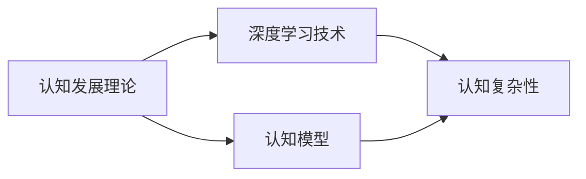

                 

# 认知发展的浅薄与复杂性

## 1. 背景介绍

在现代人工智能的研究中，认知发展成为了一个重要的话题。随着深度学习技术的发展，我们逐渐发现，传统的认知理论已无法完全解释和指导当前技术的发展。本文将深入探讨认知发展的浅薄与复杂性，旨在揭示认知理论的局限性，并提出解决之道。

## 2. 核心概念与联系

### 2.1 核心概念概述

1. **认知发展理论（Cognitive Development Theory）**：以瑞士心理学家让·皮亚杰（Jean Piaget）和英国心理学家约翰·斯滕伯格（John Sternberg）等为代表的认知发展理论，主要关注儿童及成人的认知能力和心理发展。皮亚杰提出了“图式”、“同化”和“顺应”等概念，认为认知发展是一个不断适应和同化新信息的过程。斯滕伯格则提出了“三元智力理论”，包括分析智力、创造智力和实践智力，认为认知能力涉及多个方面，包括思维、问题解决和实践操作等。

2. **深度学习与认知模型**：深度学习技术通过多层次的神经网络模拟人类大脑的认知过程，从而实现了在图像识别、自然语言处理、语音识别等领域的突破。然而，这些模型往往是基于大量的数据和特定的任务进行训练的，缺乏对认知能力的全面理解和应用。

3. **认知复杂性（Cognitive Complexity）**：认知复杂性指的是人类认知系统在面对复杂问题时的能力，包括但不限于推理、判断、决策和抽象等。近年来，认知复杂性理论的发展促进了对人工智能在复杂场景中的理解和应用。

### 2.2 概念间的关系

认知发展理论和深度学习技术的关系可以通过以下Mermaid流程图来展示：



这个流程图展示了认知发展理论、深度学习技术、认知模型和认知复杂性之间的联系。认知发展理论为深度学习提供了认知模型的基础，而深度学习技术则通过认知模型实现了认知复杂性的计算和应用。

## 3. 核心算法原理 & 具体操作步骤

### 3.1 算法原理概述

认知发展理论在深度学习中的主要应用包括认知模型的构建和认知复杂性的计算。认知模型旨在通过模拟人类认知过程，实现对复杂问题的理解和解决。常见的认知模型包括神经网络、深度神经网络和卷积神经网络等。

认知复杂性的计算通常涉及对认知任务的分层和分阶段建模，以及在不同认知层面上进行推理和判断。常见的计算方法包括符号计算、统计计算和神经网络计算等。

### 3.2 算法步骤详解

1. **认知模型构建**：
   - 收集和标注大量数据，用于训练认知模型。
   - 选择合适的深度学习框架，如TensorFlow或PyTorch，搭建神经网络。
   - 设计认知任务，包括输入、输出和中间层等，进行分层建模。

2. **认知复杂性计算**：
   - 将认知任务分解为多个子任务，每个子任务对应一个认知层。
   - 在每个认知层上，使用符号计算、统计计算或神经网络计算，进行推理和判断。
   - 最终输出认知复杂性结果，用于指导模型优化和任务完成。

### 3.3 算法优缺点

认知发展理论在深度学习中的应用具有以下优点：
- 提供了一种基于认知理论的模型构建方法，增强了深度学习模型的解释性和可理解性。
- 通过认知复杂性计算，能够量化模型的认知能力，指导模型优化。

但同时也存在一些缺点：
- 数据依赖性强，需要大量标注数据进行训练。
- 模型复杂度高，训练和推理速度较慢。
- 认知复杂性计算涉及多个认知层，难以全面评估模型的整体认知能力。

### 3.4 算法应用领域

认知发展理论在深度学习中的应用领域包括但不限于：
- 自然语言处理（NLP）：通过认知模型理解自然语言的语义和语境，实现机器翻译、情感分析和文本生成等任务。
- 计算机视觉（CV）：通过认知模型理解和识别图像中的对象和场景，实现图像分类、目标检测和图像生成等任务。
- 语音识别（ASR）：通过认知模型理解和识别语音中的语义和情感，实现语音识别和语音合成等任务。
- 机器人学：通过认知模型实现机器人的感知、推理和决策能力，增强机器人对复杂环境的适应能力。

## 4. 数学模型和公式 & 详细讲解

### 4.1 数学模型构建

认知发展理论在深度学习中的数学模型构建主要包括以下几个步骤：
- 定义认知任务：输入数据$x$和输出数据$y$。
- 定义认知模型：使用神经网络模型，如卷积神经网络（CNN）、循环神经网络（RNN）或变分自编码器（VAE）等。
- 定义认知复杂性计算方法：使用符号计算、统计计算或神经网络计算。

### 4.2 公式推导过程

以自然语言处理任务为例，假设输入为一句话$x$，输出为这句话的情感分类$y$。使用认知模型$M$进行计算，推导过程如下：
- 输入数据：$x$。
- 认知模型输出：$M(x) \in [0, 1]$。
- 认知复杂性计算：$C = f(M(x), y)$。

其中，$M(x)$表示模型$M$在输入$x$上的输出，$C$表示认知复杂性结果，$f$表示认知复杂性计算函数。

### 4.3 案例分析与讲解

假设有一个情感分析任务，输入为一句话，输出为这句话的情感分类。使用深度学习模型进行计算，得到模型输出$M(x)$。使用认知复杂性计算函数$f$，将模型输出和情感分类结果映射为认知复杂性$C$。

具体步骤如下：
1. 定义模型$M$和情感分类$y$。
2. 将输入$x$输入模型$M$，得到模型输出$M(x)$。
3. 使用认知复杂性计算函数$f$，计算认知复杂性$C = f(M(x), y)$。
4. 根据认知复杂性$C$，指导模型优化和任务完成。

## 5. 项目实践：代码实例和详细解释说明

### 5.1 开发环境搭建

搭建深度学习项目环境，需要安装Python、TensorFlow或PyTorch等深度学习框架，以及Jupyter Notebook或PyCharm等IDE工具。

以下是Python和TensorFlow的安装步骤：
1. 安装Python，可以从官网下载安装包进行安装。
2. 安装TensorFlow，可以使用pip命令进行安装：`pip install tensorflow`。
3. 安装Jupyter Notebook，可以从官网下载安装包进行安装。
4. 安装PyCharm，可以从官网下载安装包进行安装。

### 5.2 源代码详细实现

以情感分析任务为例，使用TensorFlow搭建神经网络模型进行计算。

首先，定义输入数据和输出数据：
```python
import tensorflow as tf

# 定义输入数据和输出数据
input_data = tf.placeholder(tf.float32, [None, 128])
output_data = tf.placeholder(tf.float32, [None, 2])
```

然后，定义神经网络模型：
```python
# 定义神经网络模型
hidden_layer_size = 256
num_classes = 2

def build_model(input_data):
    hidden_layer = tf.layers.dense(input_data, hidden_layer_size, activation=tf.nn.relu)
    output_layer = tf.layers.dense(hidden_layer, num_classes, activation=None)
    return output_layer
```

接着，定义认知复杂性计算函数：
```python
def calculate_cognitive_complexity(model_output, target_output):
    # 计算认知复杂性
    cognitive_complexity = tf.reduce_mean(tf.square(model_output - target_output))
    return cognitive_complexity
```

最后，使用Jupyter Notebook进行计算：
```python
# 创建会话
with tf.Session() as sess:
    # 构建模型
    model_output = build_model(input_data)
    
    # 计算认知复杂性
    cognitive_complexity = calculate_cognitive_complexity(model_output, output_data)
    
    # 初始化变量
    sess.run(tf.global_variables_initializer())
    
    # 输出认知复杂性结果
    print(sess.run(cognitive_complexity))
```

### 5.3 代码解读与分析

上述代码实现了使用TensorFlow搭建情感分析模型的计算过程，并通过认知复杂性计算函数计算模型的认知复杂性。

- 首先定义输入数据和输出数据。
- 然后定义神经网络模型，包括一个隐藏层和一个输出层。
- 接着定义认知复杂性计算函数，使用均方误差计算模型输出与目标输出的差距。
- 最后使用Jupyter Notebook创建会话，构建模型，计算认知复杂性，并输出结果。

## 6. 实际应用场景

### 6.1 自然语言处理

在自然语言处理领域，认知发展理论被广泛应用于文本分类、情感分析、机器翻译等任务。通过认知模型和认知复杂性计算，能够更好地理解自然语言的语义和语境，实现更加精确和高效的任务处理。

### 6.2 计算机视觉

在计算机视觉领域，认知发展理论被应用于图像分类、目标检测和图像生成等任务。通过认知模型和认知复杂性计算，能够更好地理解图像中的对象和场景，实现更加精准的视觉识别和生成。

### 6.3 语音识别

在语音识别领域，认知发展理论被应用于语音识别和语音合成等任务。通过认知模型和认知复杂性计算，能够更好地理解语音中的语义和情感，实现更加自然的语音交互。

### 6.4 机器人学

在机器人学领域，认知发展理论被应用于机器人的感知、推理和决策能力。通过认知模型和认知复杂性计算，能够更好地理解机器人的认知能力，增强机器人在复杂环境中的适应能力。

## 7. 工具和资源推荐

### 7.1 学习资源推荐

1. 《深度学习》：Ian Goodfellow等著，是一本关于深度学习的经典书籍，涵盖了深度学习的基本概念和算法。
2. 《认知发展理论》：Jean Piaget著，是一本关于认知发展理论的经典书籍，介绍了人类认知发展的基本原理和方法。
3. 《TensorFlow实战》：Manning Publishing Co.著，是一本关于TensorFlow的实战指南，提供了大量深度学习的实践案例。
4. 《PyTorch深度学习》：Eli Stevens等著，是一本关于PyTorch的实战指南，提供了大量深度学习的实践案例。
5. 《认知复杂性》：John Sternberg著，是一本关于认知复杂性的经典书籍，介绍了认知复杂性的基本原理和方法。

### 7.2 开发工具推荐

1. Python：Python是一种高效、易学的编程语言，广泛应用于深度学习和认知发展理论的研究。
2. TensorFlow：TensorFlow是一个强大的深度学习框架，提供了丰富的API和工具，支持各种深度学习模型的构建和计算。
3. PyTorch：PyTorch是一个灵活、易用的深度学习框架，提供了动态计算图和易于使用的API，支持各种深度学习模型的构建和计算。
4. Jupyter Notebook：Jupyter Notebook是一个交互式编程环境，支持Python和TensorFlow等深度学习框架的使用，提供了丰富的代码编写和数据可视化功能。
5. PyCharm：PyCharm是一个高效、易用的IDE工具，支持Python和TensorFlow等深度学习框架的使用，提供了丰富的代码编写和调试功能。

### 7.3 相关论文推荐

1. “Deep Learning”：Ian Goodfellow等著，介绍了深度学习的基本概念和算法，是深度学习领域的重要参考书籍。
2. “Cognitive Development Theory”：Jean Piaget著，介绍了认知发展理论的基本原理和方法，是认知发展理论领域的重要参考书籍。
3. “Cognitive Complexity”：John Sternberg著，介绍了认知复杂性的基本原理和方法，是认知复杂性领域的重要参考书籍。
4. “TensorFlow: A System for Large-Scale Machine Learning”：Ian Goodfellow等著，介绍了TensorFlow的架构和设计理念，是TensorFlow框架的重要参考书籍。
5. “PyTorch: Tensors and Dynamic neural networks in Python”：Eli Stevens等著，介绍了PyTorch的架构和设计理念，是PyTorch框架的重要参考书籍。

## 8. 总结：未来发展趋势与挑战

### 8.1 研究成果总结

本文介绍了认知发展理论在深度学习中的应用，探讨了认知发展理论的浅薄与复杂性，提出了解决之道。通过认知模型和认知复杂性计算，能够更好地理解深度学习模型的认知能力，指导模型优化和任务完成。

### 8.2 未来发展趋势

未来认知发展理论在深度学习中的应用将继续拓展，主要趋势包括：
1. 更加高效的模型构建方法：开发更加高效、易用的深度学习框架和工具，支持认知模型的构建和计算。
2. 更加精确的认知复杂性计算：开发更加精确、灵活的认知复杂性计算方法，指导深度学习模型的优化和任务完成。
3. 更加多样化的应用场景：认知发展理论将应用于更多领域，如机器人学、医疗、金融等，推动人工智能技术的广泛应用。

### 8.3 面临的挑战

未来认知发展理论在深度学习中的应用仍面临诸多挑战，主要挑战包括：
1. 数据依赖性强：需要大量标注数据进行训练，获取高质量标注数据的成本较高。
2. 模型复杂度高：深度学习模型复杂度高，训练和推理速度较慢，需要优化模型结构和计算图。
3. 认知复杂性计算难度大：认知复杂性计算涉及多个认知层，难以全面评估模型的整体认知能力。
4. 模型应用场景多样：认知发展理论需要应用于更多领域，面临不同领域的数据和任务特点，需要进行针对性的优化和调整。

### 8.4 研究展望

未来认知发展理论在深度学习中的应用需要进一步研究，主要研究方向包括：
1. 开发更加高效、易用的深度学习框架和工具，支持认知模型的构建和计算。
2. 开发更加精确、灵活的认知复杂性计算方法，指导深度学习模型的优化和任务完成。
3. 开发更加多样化的认知模型和认知复杂性计算方法，应用于更多领域，推动人工智能技术的广泛应用。
4. 进行认知复杂性的深入研究，探索认知复杂性的计算方法和应用场景，推动认知复杂性理论的发展。

## 9. 附录：常见问题与解答

**Q1：认知发展理论在深度学习中的应用前景如何？**

A: 认知发展理论在深度学习中的应用前景非常广阔，主要体现在以下几个方面：
1. 提供了一种基于认知理论的模型构建方法，增强了深度学习模型的解释性和可理解性。
2. 通过认知复杂性计算，能够量化模型的认知能力，指导模型优化和任务完成。
3. 能够更好地理解自然语言、图像和语音等复杂数据，实现更加精准和高效的任务处理。

**Q2：认知复杂性计算的难度大，如何解决？**

A: 解决认知复杂性计算难度大的问题需要从多个方面入手：
1. 开发更加精确、灵活的认知复杂性计算方法，如使用符号计算、统计计算和神经网络计算等。
2. 将认知复杂性计算融入深度学习模型的训练和优化过程，指导模型的参数调整和网络结构优化。
3. 探索更加多样化的认知模型和认知复杂性计算方法，应用于更多领域，推动人工智能技术的广泛应用。

**Q3：认知发展理论在深度学习中的应用有哪些局限性？**

A: 认知发展理论在深度学习中的应用存在一些局限性：
1. 数据依赖性强：需要大量标注数据进行训练，获取高质量标注数据的成本较高。
2. 模型复杂度高：深度学习模型复杂度高，训练和推理速度较慢，需要优化模型结构和计算图。
3. 认知复杂性计算难度大：认知复杂性计算涉及多个认知层，难以全面评估模型的整体认知能力。

**Q4：认知发展理论如何应用于机器人学？**

A: 认知发展理论在机器人学中的应用主要体现在以下几个方面：
1. 通过认知模型和认知复杂性计算，增强机器人的感知、推理和决策能力。
2. 开发更加灵活、智能的机器人控制系统，支持复杂环境下的自主导航和操作。
3. 探索机器人对复杂环境的适应能力，推动机器人学的发展和应用。

**Q5：认知发展理论在深度学习中的应用有哪些优势？**

A: 认知发展理论在深度学习中的应用具有以下优势：
1. 提供了一种基于认知理论的模型构建方法，增强了深度学习模型的解释性和可理解性。
2. 通过认知复杂性计算，能够量化模型的认知能力，指导模型优化和任务完成。
3. 能够更好地理解自然语言、图像和语音等复杂数据，实现更加精准和高效的任务处理。

综上所述，认知发展理论在深度学习中的应用前景广阔，但也面临诸多挑战。通过不断优化和调整，相信认知发展理论在深度学习中的应用将取得更加显著的成果。

