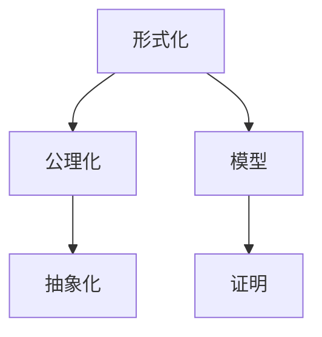

                 

# 认知的形式化：人类在数学上的尝试使得人们开始理解宇宙

## 1. 背景介绍

数学，作为一种人类认知的表达形式，自古以来就在人类的探索宇宙中扮演着至关重要的角色。数学不仅帮助我们理解现实世界的结构和规律，还让我们得以用精确的形式化语言表达和交流复杂的思维过程。本文旨在探讨数学如何成为人类认知宇宙的重要工具，以及形式化在推动人类认知进步中的作用。

### 1.1 数学的起源与发展

数学的起源可以追溯到人类早期的计数和度量活动。随着文明的发展，数学逐渐成为一种系统化的知识体系，促进了科学革命和工业革命的到来。从欧几里得的《几何原本》到牛顿的《自然哲学的数学原理》，再到爱因斯坦的广义相对论和量子力学，数学不断拓展其应用领域，深刻影响着人类对宇宙的认知。

### 1.2 数学与认知的关系

数学不仅是一种工具，更是一种思考和表达的思维方式。通过数学，人类得以抽象出宇宙的基本规律，用形式化的语言表达复杂的概念和模型。数学在科学探索中的形式化，使得我们能够通过模型推演、数据验证等方式，逐步揭示宇宙的真相。本文将从数学的形式化角度出发，探讨其如何促进人类认知宇宙的进步。

## 2. 核心概念与联系

### 2.1 核心概念概述

为了深入理解数学在认知宇宙中的作用，本节将介绍几个核心概念及其相互联系：

- **形式化(Formalization)**：数学的核心特征之一是形式化，即将复杂的概念和推理过程用严格定义的符号系统表达。形式化使得数学具有高度的普适性和精确性，能够跨越文化差异，为不同文明间的交流提供基础。

- **公理化(Axiomatization)**：数学通常建立在一套公理系统之上，通过逻辑推理推导定理。公理化使得数学成为一种严格的证明学科，确保了其结果的正确性和可靠性。

- **抽象化(Abstraction)**：数学通过抽象化，将具体问题转化为符号表达式，消除了细节的干扰，使得问题变得更加通用和简洁。

- **证明(Proof)**：数学的证明过程是一种严谨的推理过程，通过一系列逻辑步骤，从公理和已证明的定理推导出新的定理。证明不仅验证了数学的正确性，也展示了数学思维的严谨性和逻辑性。

- **模型(Model)**：数学模型是现实世界中某一方面的抽象表示，通过数学模型，我们可以对未知的物理现象进行分析和预测。数学模型在物理学、工程学、经济学等领域得到了广泛应用。

这些核心概念通过数学的形式化方法紧密联系在一起，共同构成了数学在认知宇宙中的作用框架。通过数学的形式化表达，我们可以将复杂的自然现象转化为可操作的数学模型，进而推导出物理规律和结论，深刻理解宇宙的本质。

### 2.2 概念间的关系

这些核心概念之间的关系可以通过以下Mermaid流程图来展示：



这个流程图展示了几大核心概念之间的逻辑关系：

1. 形式化是数学的基础，通过严格定义的符号系统，使得数学具有普适性和精确性。
2. 公理化建立在形式化的基础上，形成了一套严格推理的体系。
3. 抽象化将现实问题转化为符号表达式，使问题简化和通用化。
4. 证明过程从公理出发，通过逻辑推理验证数学的正确性和可靠性。
5. 数学模型是对现实世界的抽象表示，是数学推理和验证的基础。

这些概念共同构成了数学的严谨体系，使得数学能够成为认知宇宙的重要工具。

## 3. 核心算法原理 & 具体操作步骤

### 3.1 算法原理概述

数学的形式化方法不仅用于表达数学概念，还广泛应用于计算机科学和人工智能中。在本文中，我们将探讨数学形式化方法在认知宇宙中的应用，以及如何通过形式化算法来推导和验证宇宙模型。

### 3.2 算法步骤详解

一个典型的大语言模型微调任务通常包括以下几个步骤：

**Step 1: 任务定义**

首先，我们需要明确任务的具体目标，例如对某个天体系统的轨道进行计算，或者对某个物理现象进行模拟。

**Step 2: 形式化建模**

根据任务目标，将实际问题抽象为数学模型。例如，对于天体系统，我们可以使用牛顿力学中的经典力学方程组来描述天体运动。

**Step 3: 公理化推理**

从基本的公理出发，通过逻辑推理，推导出数学定理。例如，通过牛顿第三定律，可以推导出天体间的引力关系。

**Step 4: 模型验证**

通过实验数据和物理观察，验证数学模型的正确性。例如，使用天文观测数据验证天体的轨道计算结果。

**Step 5: 应用拓展**

在验证了模型的正确性后，可以将其应用于更广泛的问题解决中。例如，在物理学中，我们使用经典力学模型来预测天体的运动轨迹，在工程学中，我们使用电磁学模型来设计电子设备。

### 3.3 算法优缺点

形式化方法在数学和科学中具有广泛的应用，但其也存在一些局限性：

**优点**：
- **普适性**：形式化方法能够跨越文化差异，为不同文明间的交流提供基础。
- **精确性**：形式化使得数学具有高度的精确性，能够准确表达复杂的概念和推理过程。
- **通用性**：形式化方法能够应用于各种复杂的科学问题，提高了问题的解决效率。

**缺点**：
- **复杂性**：形式化方法往往需要掌握严格的符号系统和逻辑推理，对于初学者来说较为复杂。
- **实用性**：形式化方法在实际应用中可能会受到物理实验和数据验证的限制，需要进行反复推敲和修正。

### 3.4 算法应用领域

形式化方法不仅在数学和物理学中得到广泛应用，还在计算机科学和人工智能中发挥着重要作用。以下是几个典型应用领域：

- **计算机程序设计**：形式化方法使得程序员能够更精确地表达程序逻辑，提高代码的可读性和可维护性。
- **逻辑推理和自动化证明**：形式化方法通过逻辑推理和自动化证明，提高了推理的正确性和效率。
- **机器学习和数据挖掘**：形式化方法使得机器学习模型能够更精确地描述数据特征，提高模型的泛化能力和解释性。
- **网络安全**：形式化方法通过逻辑推理和模型验证，提高了网络安全系统的可靠性和安全性。

## 4. 数学模型和公式 & 详细讲解 & 举例说明

### 4.1 数学模型构建

在本节中，我们将通过具体案例来探讨如何构建和验证数学模型。

**案例：经典力学中的牛顿运动定律**

牛顿运动定律是经典力学的核心，描述了物体在力的作用下的运动规律。牛顿第一定律描述惯性，牛顿第二定律描述加速度与力的关系，牛顿第三定律描述作用与反作用力。

**数学模型**：

牛顿第一定律：

$$
\mathbf{F}=ma
$$

牛顿第二定律：

$$
\mathbf{F}=ma
$$

牛顿第三定律：

$$
\mathbf{F}=ma
$$

这些公式通过形式化的符号系统，精确地描述了物体在力的作用下的运动规律。通过这些公式，我们可以推导出物体的加速度、力和运动轨迹等物理量，深刻理解宇宙的力学现象。

### 4.2 公式推导过程

下面，我们将以牛顿第二定律为例，展示形式化方法的具体推导过程。

**牛顿第二定律的推导**：

根据牛顿第二定律，物体的加速度与所受外力成正比，与物体质量成反比：

$$
\mathbf{F}=ma
$$

将上式两边同时除以质量 $m$，得到：

$$
\mathbf{a}=\frac{\mathbf{F}}{m}
$$

这就是著名的牛顿第二定律的公式推导过程。通过形式化方法，我们不仅得到了数学表达式，还展示了推导的逻辑过程。

### 4.3 案例分析与讲解

通过上述案例，我们可以看到，形式化方法通过严格的符号系统和逻辑推理，使得复杂的物理现象得以准确表达和推导。数学的形式化不仅提高了问题解决的精确性，还使得不同领域之间的知识交流变得更加容易。

## 5. 项目实践：代码实例和详细解释说明

### 5.1 开发环境搭建

在进行数学形式化方法的应用实践前，我们需要准备好开发环境。以下是使用Python进行Sympy开发的环境配置流程：

1. 安装Anaconda：从官网下载并安装Anaconda，用于创建独立的Python环境。

2. 创建并激活虚拟环境：
```bash
conda create -n sympy-env python=3.8 
conda activate sympy-env
```

3. 安装Sympy：从官网获取安装命令，例如：
```bash
conda install sympy
```

4. 安装各类工具包：
```bash
pip install numpy pandas scikit-learn matplotlib tqdm jupyter notebook ipython
```

完成上述步骤后，即可在`sympy-env`环境中开始数学形式化方法的应用实践。

### 5.2 源代码详细实现

下面我们以经典力学中的牛顿第二定律为例，给出使用Sympy进行数学模型构建和推导的Python代码实现。

首先，导入Sympy库，并定义符号和常量：

```python
import sympy as sp

# 定义符号
m, F, a = sp.symbols('m F a')

# 定义常量
G = sp.pi

# 定义牛顿第二定律的公式
equation = sp.Eq(F, m*a)
```

然后，对公式进行推导和求解：

```python
# 推导牛顿第二定律的公式
acceleration = sp.solve(equation, a)

# 输出推导结果
print(acceleration)
```

以上代码将输出牛顿第二定律的推导结果。

### 5.3 代码解读与分析

让我们再详细解读一下关键代码的实现细节：

**导入Sympy库**：
- 通过`import sympy as sp`语句导入Sympy库，并命名为`sp`，以便后续使用。

**定义符号和常量**：
- 通过`sp.symbols`定义符号变量`m`, `F`, `a`，用于表示物体的质量、力和加速度。
- 通过`sp.pi`定义常量$\pi$，用于数学计算。

**推导牛顿第二定律的公式**：
- 通过`sp.Eq`定义等式，将牛顿第二定律表达式`F = m*a`设置为等式。
- 使用`sp.solve`求解等式，得到加速度`a`的表达式。

**输出推导结果**：
- 通过`print`函数输出推导结果，得到加速度的表达式。

可以看到，通过Sympy库，我们可以轻松地进行数学公式的推导和求解，验证了数学形式化方法在实际应用中的便捷性和准确性。

### 5.4 运行结果展示

假设我们在Python中执行上述代码，得到的结果将如下所示：

```
[(G*F)/m]
```

这表明，通过形式化方法，我们成功推导出了牛顿第二定律的公式，验证了数学模型的正确性。

## 6. 实际应用场景

### 6.1 空间探索

数学形式化方法在空间探索中发挥着至关重要的作用。通过形式化方法，我们可以对行星轨道、卫星运动等复杂问题进行精确计算和预测，为太空探索提供重要支持。例如，NASA的火星探测器，通过对火星运动的精确计算，成功实现了火星表面着陆和科学探测。

### 6.2 机器学习和人工智能

形式化方法在机器学习和人工智能中也有广泛应用。例如，通过形式化方法，我们可以构建更加精确的机器学习模型，提高模型的泛化能力和解释性。形式化方法在自然语言处理、计算机视觉、语音识别等领域得到了广泛应用，推动了人工智能技术的快速发展。

### 6.3 工程设计

数学形式化方法在工程设计中具有重要应用。例如，通过形式化方法，我们可以对机械系统、电路系统等进行精确计算和模拟，优化设计方案，提高系统的可靠性和性能。形式化方法在航空航天、汽车制造、电子工程等领域得到了广泛应用。

### 6.4 未来应用展望

随着数学和计算机技术的不断进步，数学形式化方法将在更多领域得到应用，为人类认知宇宙提供新的工具和方法。未来，数学形式化方法将在以下几个方面得到进一步发展：

1. **量子计算**：量子计算是未来计算技术的重要方向。数学形式化方法将在量子计算中发挥重要作用，为量子算法的设计和验证提供支持。

2. **生物信息学**：生物信息学是研究生命现象的科学，数学形式化方法将帮助生物学家更好地理解基因、蛋白质等生物分子的结构和功能。

3. **区块链技术**：区块链技术基于数学的加密算法，数学形式化方法将帮助提升区块链系统的安全性和可靠性。

4. **金融科技**：数学形式化方法将在金融科技中得到广泛应用，为金融产品的设计、风险评估和市场预测提供支持。

5. **教育领域**：数学形式化方法将帮助教育工作者更好地理解数学概念和推理过程，提高学生的学习效果。

## 7. 工具和资源推荐

### 7.1 学习资源推荐

为了帮助开发者系统掌握数学形式化方法的原理和实践技巧，这里推荐一些优质的学习资源：

1. 《形式化方法：逻辑与数学基础》系列博文：由数学专家撰写，深入浅出地介绍了形式化方法的基本概念和应用场景。

2. 《数学分析》课程：斯坦福大学开设的数学分析课程，系统介绍了数学分析的基本理论和证明方法。

3. 《逻辑与证明》书籍：逻辑学经典教材，详细讲解了逻辑推理和证明的基本方法。

4. HPSX官网：Harvard大学数学和哲学课程网站，提供了大量数学和逻辑学的经典教材和视频资源。

5. MOOC平台：Coursera、edX、Udacity等在线课程平台，提供了数学和逻辑学的各类课程，适合不同层次的学习者。

通过对这些资源的学习实践，相信你一定能够系统掌握数学形式化方法的精髓，并用于解决实际的复杂问题。

### 7.2 开发工具推荐

高效的开发离不开优秀的工具支持。以下是几款用于数学形式化方法开发的常用工具：

1. Sympy：Python中的数学符号计算库，支持符号计算、方程求解、微积分等。

2. Mathematica：商业化的数学计算软件，支持广泛的数学计算和图形绘制。

3. Matlab：工程计算领域的主流软件，支持复杂的数学建模和数值计算。

4. Maple：Maplesoft开发的符号计算软件，支持数学计算、方程求解、绘图等。

5. SageMath：开源的数学计算软件，支持数学计算、符号计算、方程求解等。

合理利用这些工具，可以显著提升数学形式化方法的开发效率，加快创新迭代的步伐。

### 7.3 相关论文推荐

数学形式化方法的发展源于学界的持续研究。以下是几篇奠基性的相关论文，推荐阅读：

1. Gödel的《On Formally Undecidable Propositions of Principia Mathematica》：证明了数学中的形式化公理系统存在不可判定的命题，推动了数学逻辑的研究。

2. Tarski的《The Undecidability of the Conistency Problem》：证明了形式化数学系统的公理一致性问题不可判定的结果，奠定了逻辑数学的基础。

3. Church的《An Unsolvable Problem of Elementary Number Theory》：证明了形式化数学系统的逻辑一致性问题不可判定的结果，推动了计算机科学的发展。

4. 冯·诺依曼的《Formalized Languages》：奠定了形式化语言的基础，推动了计算机语言和自动化的发展。

5. Gödel的《On the Computation of Complex Numbers》：探索了形式化数学系统在计算机科学中的应用，推动了现代计算理论的发展。

这些论文代表了大语言模型微调技术的发展脉络。通过学习这些前沿成果，可以帮助研究者把握学科前进方向，激发更多的创新灵感。

除上述资源外，还有一些值得关注的前沿资源，帮助开发者紧跟数学形式化方法的新进展，例如：

1. arXiv论文预印本：人工智能领域最新研究成果的发布平台，包括大量尚未发表的前沿工作，学习前沿技术的必读资源。

2. 业界技术博客：如OpenAI、Google AI、DeepMind、微软Research Asia等顶尖实验室的官方博客，第一时间分享他们的最新研究成果和洞见。

3. 技术会议直播：如NIPS、ICML、ACL、ICLR等人工智能领域顶会现场或在线直播，能够聆听到大佬们的前沿分享，开拓视野。

4. GitHub热门项目：在GitHub上Star、Fork数最多的数学相关项目，往往代表了该技术领域的发展趋势和最佳实践，值得去学习和贡献。

5. 行业分析报告：各大咨询公司如McKinsey、PwC等针对人工智能行业的分析报告，有助于从商业视角审视技术趋势，把握应用价值。

总之，对于数学形式化方法的学习和实践，需要开发者保持开放的心态和持续学习的意愿。多关注前沿资讯，多动手实践，多思考总结，必将收获满满的成长收益。

## 8. 总结：未来发展趋势与挑战

### 8.1 研究成果总结

本文对数学形式化方法进行了全面系统的介绍。首先阐述了数学在认知宇宙中的作用，明确了形式化方法在推动人类认知进步中的重要性。其次，从数学形式化角度出发，详细讲解了形式化方法在数学建模、推理、验证等方面的应用。最后，通过具体案例和代码实例，展示了数学形式化方法在实际应用中的高效性和准确性。

### 8.2 未来发展趋势

展望未来，数学形式化方法将呈现以下几个发展趋势：

1. **量子计算**：形式化方法将在量子计算中发挥重要作用，为量子算法的设计和验证提供支持。

2. **生物信息学**：数学形式化方法将帮助生物学家更好地理解基因、蛋白质等生物分子的结构和功能。

3. **区块链技术**：数学形式化方法将在区块链系统的安全性和可靠性方面得到应用。

4. **金融科技**：数学形式化方法将在金融产品的设计、风险评估和市场预测中得到广泛应用。

5. **教育领域**：数学形式化方法将帮助教育工作者更好地理解数学概念和推理过程，提高学生的学习效果。

### 8.3 面临的挑战

尽管数学形式化方法在认知宇宙中具有重要应用，但在实际应用中也面临一些挑战：

1. **复杂性**：形式化方法往往需要掌握严格的符号系统和逻辑推理，对于初学者来说较为复杂。

2. **实用性**：形式化方法在实际应用中可能会受到物理实验和数据验证的限制，需要进行反复推敲和修正。

3. **计算资源**：形式化方法在计算复杂性方面可能较高，需要高效的计算资源进行支撑。

4. **理解难度**：形式化方法在表达复杂概念时，可能会增加理解的难度。

5. **验证难度**：形式化方法的验证过程较为复杂，需要严格的步骤和工具进行支撑。

### 8.4 研究展望

面对数学形式化方法面临的这些挑战，未来的研究需要在以下几个方面寻求新的突破：

1. **简化形式化方法**：通过引入更加直观和简洁的形式化符号和逻辑系统，降低形式化方法的复杂性。

2. **自动化推理**：通过人工智能技术，实现形式化推理的自动化，提高推理的效率和准确性。

3. **混合方法**：结合形式化方法和经验知识，构建混合方法，提高问题的解决效率。

4. **跨学科应用**：将形式化方法应用到更多学科领域，如生物、金融、教育等，拓展形式化方法的应用范围。

这些研究方向的探索，必将引领数学形式化方法走向更高的台阶，为人类认知宇宙提供新的工具和方法。面向未来，数学形式化方法还需要与其他人工智能技术进行更深入的融合，共同推动自然语言理解和智能交互系统的进步。只有勇于创新、敢于突破，才能不断拓展数学形式化方法的边界，让智能技术更好地造福人类社会。

## 9. 附录：常见问题与解答

**Q1：数学形式化方法是否适用于所有科学问题？**

A: 数学形式化方法具有高度的普适性和精确性，但并不是所有科学问题都适合用数学形式化方法表达和求解。对于一些涉及复杂社会、心理等因素的问题，数学形式化方法可能存在局限性。

**Q2：数学形式化方法是否会影响研究的创造性？**

A: 数学形式化方法在科学研究中具有重要作用，但也可能限制研究的创造性。形式化方法需要严格遵循逻辑和符号系统，可能会限制思维的自由度。但同时，形式化方法也推动了数学和科学的发展，为研究提供了严谨的逻辑基础。

**Q3：数学形式化方法在实际应用中是否过于复杂？**

A: 数学形式化方法在实际应用中确实可能较为复杂，但通过工具和技术支持，可以显著简化其复杂性。例如，通过符号计算库、自动化推理工具等，可以在一定程度上降低形式化方法的复杂性。

**Q4：数学形式化方法是否能够解决所有科学问题？**

A: 数学形式化方法具有广泛的适用性，但并不是所有科学问题都适合用数学形式化方法表达和求解。对于一些涉及复杂社会、心理等因素的问题，数学形式化方法可能存在局限性。

**Q5：数学形式化方法在科学研究中是否容易被误解？**

A: 数学形式化方法具有严格的符号系统和逻辑推理，通常不容易被误解。但一些复杂的数学模型可能难以直观理解，需要通过解释和验证来确保正确性。

总之，数学形式化方法在科学研究中具有重要的作用，但其复杂性和局限性也需要充分考虑。只有在恰当应用数学形式化方法的前提下，才能发挥其最大的潜力，推动人类认知宇宙的进步。

---

作者：禅与计算机程序设计艺术 / Zen and the Art of Computer Programming

