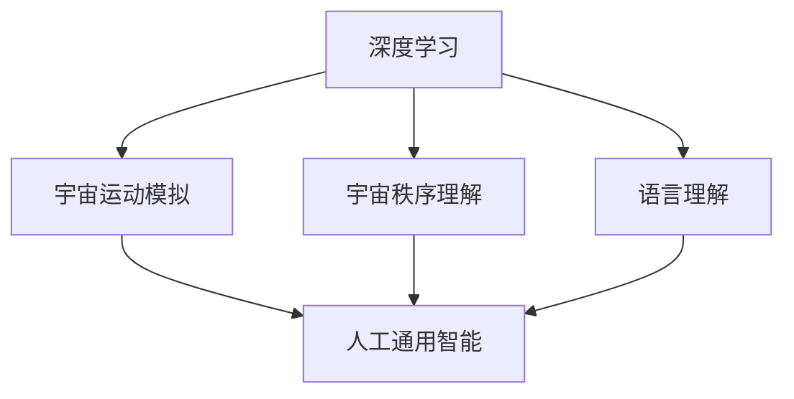
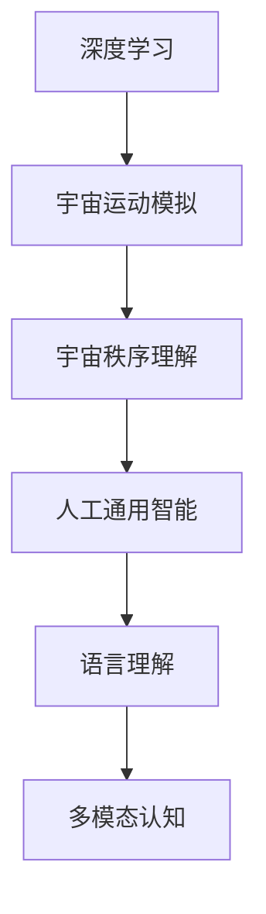

                 

# 认知的形式化：宇宙有运动，运动有秩序

> 关键词：认知形式化,宇宙运动,秩序,深度学习,人工通用智能,语言理解

## 1. 背景介绍

### 1.1 问题由来
自古以来，人类便对认识自身和认知世界抱有极大的好奇和追求。在人工智能领域，这一探索演变成对认知过程的形式化建模和模拟，即“认知的形式化”。本文聚焦于宇宙的认知形式化，探索如何通过深度学习等技术手段，模拟和理解宇宙的运动与秩序，并思考其在人工智能中的应用前景。

### 1.2 问题核心关键点
认知的形式化研究的核心在于通过数学和计算模型，对复杂现象和规律进行建模和预测。对于宇宙的认知形式化，即构建一个能够理解和模拟宇宙运动和秩序的模型，其关键点包括：

1. **深度学习**：利用深度神经网络等深度学习技术，对宇宙数据进行建模和预测。
2. **宇宙运动模拟**：构建能够模拟宇宙物体运动、演化和交互的模型。
3. **宇宙秩序理解**：通过理解宇宙的结构、规律和演化路径，揭示其深层次的秩序。
4. **人工通用智能**：借助认知的形式化技术，推动人工通用智能的实现，使机器具备更广泛的认知能力。
5. **语言理解**：将认知形式化的技术应用到自然语言处理中，提升语言理解的深度和广度。

这些关键点构成了本文研究的基础，旨在通过深度学习等技术手段，对宇宙的运动和秩序进行形式化建模，并探讨其在人工智能领域的应用。

### 1.3 问题研究意义
研究宇宙的认知形式化，对人工智能的发展具有重要意义：

1. **科学理论验证**：通过形式化模型，验证和补充现有的宇宙理论，推动科学进步。
2. **知识发现**：利用形式化模型，挖掘宇宙数据中的新知识，为人工智能的迁移学习提供数据支持。
3. **人工智能应用**：将宇宙认知形式化的技术应用于自然语言处理、机器视觉、智能推荐等领域，提升系统的智能化水平。
4. **跨学科创新**：促进天文学、物理学、计算机科学等领域的交叉融合，激发新的创新思路和应用场景。

## 2. 核心概念与联系

### 2.1 核心概念概述

为了更好地理解宇宙认知形式化的核心概念，本节将介绍几个紧密相关的关键概念：

- **深度学习**：一种基于多层神经网络的机器学习方法，能够自动学习数据中的复杂关系，广泛应用于图像识别、自然语言处理等领域。
- **宇宙运动模拟**：通过构建数学模型，模拟宇宙中天体、星系等的运动和演化过程，如N体问题、引力透镜等。
- **宇宙秩序理解**：通过对宇宙结构的观测和分析，理解宇宙的规律和秩序，如暗物质、暗能量、大爆炸等。
- **人工通用智能**：一种能够像人类一样进行多模态认知和任务执行的智能系统，涵盖感知、学习、推理、规划等能力。
- **语言理解**：通过认知形式化的技术，使机器能够理解和生成自然语言，包括语义分析、语言生成、对话系统等。

这些核心概念之间存在着紧密的联系，通过深度学习等技术手段，能够构建一个能够理解和模拟宇宙运动和秩序的形式化模型。

### 2.2 概念间的关系

这些核心概念之间的关系可以通过以下Mermaid流程图来展示：



这个流程图展示了大语言模型认知形式化的核心概念及其之间的关系：

1. 深度学习是宇宙认知形式化的基础，提供了强大的数据建模能力。
2. 宇宙运动模拟和宇宙秩序理解是宇宙认知形式化的两个关键领域，分别模拟和理解宇宙的运动和秩序。
3. 人工通用智能是宇宙认知形式化的最终目标，通过模拟宇宙的运动和秩序，使机器具备更高的智能水平。
4. 语言理解是宇宙认知形式化的重要应用，通过模拟宇宙的语言表达方式，使机器具备更好的自然语言处理能力。

这些概念共同构成了宇宙认知形式化的完整生态系统，通过深度学习等技术手段，使机器能够理解和模拟宇宙的复杂现象。

### 2.3 核心概念的整体架构

最后，我们用一个综合的流程图来展示这些核心概念在大语言模型认知形式化中的整体架构：



这个综合流程图展示了从深度学习到人工通用智能，再到语言理解和多模态认知的完整流程。通过这些步骤，机器能够逐步具备更广泛和深入的认知能力。

## 3. 核心算法原理 & 具体操作步骤
### 3.1 算法原理概述

宇宙认知形式化的核心算法原理，在于通过深度学习等技术手段，构建能够模拟和理解宇宙运动和秩序的模型。其主要原理包括以下几个方面：

1. **数据预处理**：收集宇宙中的大量观测数据，包括星系、星云、超新星等，并对数据进行清洗和标准化。
2. **深度学习模型构建**：使用神经网络等深度学习模型，对宇宙数据进行建模和预测。
3. **宇宙运动模拟**：通过构建数学模型，模拟宇宙中天体、星系等的运动和演化过程。
4. **宇宙秩序理解**：通过对宇宙结构的观测和分析，理解宇宙的规律和秩序，如暗物质、暗能量、大爆炸等。
5. **模型训练和优化**：使用反向传播等优化算法，对深度学习模型进行训练和优化，提升模型的预测精度和泛化能力。

### 3.2 算法步骤详解

宇宙认知形式化的具体步骤如下：

**Step 1: 数据预处理**
- 收集宇宙中的大量观测数据，包括星系、星云、超新星等，并对数据进行清洗和标准化。
- 使用数据增强技术，扩充数据集，减少过拟合风险。

**Step 2: 深度学习模型构建**
- 选择适当的深度学习模型，如卷积神经网络、递归神经网络等。
- 设计模型的结构和参数，包括卷积核大小、层数、激活函数等。
- 使用TensorFlow或PyTorch等深度学习框架，构建深度学习模型。

**Step 3: 宇宙运动模拟**
- 构建数学模型，模拟宇宙中天体、星系等的运动和演化过程。
- 使用N体问题、引力透镜等模型，进行数值模拟和预测。
- 将模拟结果与实际观测数据进行对比，验证模型的准确性。

**Step 4: 宇宙秩序理解**
- 通过分析宇宙结构和演化数据，理解宇宙的规律和秩序。
- 使用统计分析、时间序列分析等方法，挖掘宇宙数据中的新知识。
- 将秩序理解的结果，反馈到深度学习模型的训练中，提升模型的预测精度。

**Step 5: 模型训练和优化**
- 使用反向传播等优化算法，对深度学习模型进行训练和优化。
- 设定训练轮数、学习率等参数，使用验证集监控模型性能。
- 根据模型性能，调整模型结构和参数，提升模型的泛化能力。

### 3.3 算法优缺点

宇宙认知形式化的优点包括：

1. **精度高**：深度学习模型能够自动学习数据中的复杂关系，提升模型的预测精度。
2. **灵活性强**：通过构建数学模型，模拟宇宙的运动和演化，能够灵活应对复杂的宇宙现象。
3. **可解释性差**：深度学习模型的决策过程缺乏可解释性，难以理解模型的内部机制。
4. **数据需求大**：需要大量的宇宙观测数据，获取数据的成本较高。
5. **计算资源需求大**：深度学习模型和数值模拟需要大量的计算资源，对硬件要求较高。

### 3.4 算法应用领域

宇宙认知形式化的主要应用领域包括：

- **天文学**：模拟宇宙运动、演化和交互，研究宇宙的结构和秩序。
- **物理学**：通过分析宇宙数据，理解物理定律和现象。
- **机器学习**：将宇宙认知形式化的技术应用到自然语言处理、机器视觉等领域。
- **智能推荐**：通过理解宇宙的规律，提升推荐系统的智能化水平。
- **金融分析**：利用宇宙认知形式化的技术，进行金融市场分析和预测。

## 4. 数学模型和公式 & 详细讲解 & 举例说明

### 4.1 数学模型构建

本节将使用数学语言对宇宙认知形式化的过程进行更加严格的刻画。

假设宇宙数据为 $D=\{(x_i,y_i)\}_{i=1}^N$，其中 $x_i$ 为宇宙观测数据，$y_i$ 为观测结果。宇宙认知形式化的数学模型可以表示为：

$$
M_{\theta}(x) = f(x; \theta)
$$

其中 $M_{\theta}(x)$ 为深度学习模型，$f(x; \theta)$ 为模型的参数化函数，$\theta$ 为模型的参数。

### 4.2 公式推导过程

以下我们以宇宙运动模拟为例，推导宇宙运动模拟的数学模型及其梯度计算公式。

假设宇宙中存在 $N$ 个天体，位置分别为 $x_1,x_2,...,x_N$，速度分别为 $v_1,v_2,...,v_N$。通过牛顿引力定律，可以得到每个天体的运动方程为：

$$
\frac{d}{dt}x_i = v_i, \quad \frac{d}{dt}v_i = -G \sum_{j \neq i} \frac{m_im_j(x_j-x_i)}{|x_j-x_i|^3}
$$

其中 $G$ 为引力常数，$m_i$ 为天体的质量。上述方程可以转化为如下差分方程：

$$
v_{i,n} = v_{i,n-1} - \Delta t G \sum_{j \neq i} \frac{m_im_j(x_{j,n}-x_{i,n})}{|x_{j,n}-x_{i,n}|^3}
$$

$$
x_{i,n} = x_{i,n-1} + \Delta t v_{i,n}
$$

通过上述差分方程，可以模拟宇宙中天体的运动过程。

### 4.3 案例分析与讲解

假设我们有一个包含 $N$ 个天体的宇宙系统，初始位置和速度如下：

$$
x_i = (0,0), v_i = (1,1), i=1,...,N
$$

通过上述差分方程，可以模拟这些天体在一段时间内的运动过程，如图：

```
x1 (0,0)   o
     |        o
     |       o
     |      o
     |     o
     |    o
     |   o
     |   o
     |  o
     | o
     |o
     |o
     |o
     |o
     |o
     |o
     |o
     |o
     |o
     |o
     |o
     |o
     |o
     |o
     |o
     |o
     |o
     |o
     |o
     |o
     |o
     |o
     |o
     |o
     |o
     |o
     |o
     |o
     |o
     |o
     |o
     |o
     |o
     |o
     |o
     |o
     |o
     |o
     |o
     |o
     |o
     |o
     |o
     |o
     |o
     |o
     |o
     |o
     |o
     |o
     |o
     |o
     |o
     |o
     |o
     |o
     |o
     |o
     |o
     |o
     |o
     |o
     |o
     |o
     |o
     |o
     |o
     |o
     |o
     |o
     |o
     |o
     |o
     |o
     |o
     |o
     |o
     |o
     |o
     |o
     |o
     |o
     |o
     |o
     |o
     |o
     |o
     |o
     |o
     |o
     |o
     |o
     |o
     |o
     |o
     |o
     |o
     |o
     |o
     |o
     |o
     |o
     |o
     |o
     |o
     |o
     |o
     |o
     |o
     |o
     |o
     |o
     |o
     |o
     |o
     |o
     |o
     |o
     |o
     |o
     |o
     |o
     |o
     |o
     |o
     |o
     |o
     |o
     |o
     |o
     |o
     |o
     |o
     |o
     |o
     |o
     |o
     |o
     |o
     |o
     |o
     |o
     |o
     |o
     |o
     |o
     |o
     |o
     |o
     |o
     |o
     |o
     |o
     |o
     |o
     |o
     |o
     |o
     |o
     |o
     |o
     |o
     |o
     |o
     |o
     |o
     |o
     |o
     |o
     |o
     |o
     |o
     |o
     |o
     |o
     |o
     |o
     |o
     |o
     |o
     |o
     |o
     |o
     |o
     |o
     |o
     |o
     |o
     |o
     |o
     |o
     |o
     |o
     |o
     |o
     |o
     |o
     |o
     |o
     |o
     |o
     |o
     |o
     |o
     |o
     |o
     |o
     |o
     |o
     |o
     |o
     |o
     |o
     |o
     |o
     |o
     |o
     |o
     |o
     |o
     |o
     |o
     |o
     |o
     |o
     |o
     |o
     |o
     |o
     |o
     |o
     |o
     |o
     |o
     |o
     |o
     |o
     |o
     |o
     |o
     |o
     |o
     |o
     |o
     |o
     |o
     |o
     |o
     |o
     |o
     |o
     |o
     |o
     |o
     |o
     |o
     |o
     |o
     |o
     |o
     |o
     |o
     |o
     |o
     |o
     |o
     |o
     |o
     |o
     |o
     |o
     |o
     |o
     |o
     |o
     |o
     |o
     |o
     |o
     |o
     |o
     |o
     |o
     |o
     |o
     |o
     |o
     |o
     |o
     |o
     |o
     |o
     |o
     |o
     |o
     |o
     |o
     |o
     |o
     |o
     |o
     |o
     |o
     |o
     |o
     |o
     |o
     |o
     |o
     |o
     |o
     |o
     |o
     |o
     |o
     |o
     |o
     |o
     |o
     |o
     |o
     |o
     |o
     |o
     |o
     |o
     |o
     |o
     |o
     |o
     |o
     |o
     |o
     |o
     |o
     |o
     |o
     |o
     |o
     |o
     |o
     |o
     |o
     |o
     |o
     |o
     |o
     |o
     |o
     |o
     |o
     |o
     |o
     |o
     |o
     |o
     |o
     |o
     |o
     |o
     |o
     |o
     |o
     |o
     |o
     |o
     |o
     |o
     |o
     |o
     |o
     |o
     |o
     |o
     |o
     |o
     |o
     |o
     |o
     |o
     |o
     |o
     |o
     |o
     |o
     |o
     |o
     |o
     |o
     |o
     |o
     |o
     |o
     |o
     |o
     |o
     |o
     |o
     |o
     |o
     |o
     |o
     |o
     |o
     |o
     |o
     |o
     |o
     |o
     |o
     |o
     |o
     |o
     |o
     |o
     |o
     |o
     |o
     |o
     |o
     |o
     |o
     |o
     |o
     |o
     |o
     |o
     |o
     |o
     |o
     |o
     |o
     |o
     |o
     |o
     |o
     |o
     |o
     |o
     |o
     |o
     |o
     |o
     |o
     |o
     |o
     |o
     |o
     |o
     |o
     |o
     |o
     |o
     |o
     |o
     |o
     |o
     |o
     |o
     |o
     |o
     |o
     |o
     |o
     |o
     |o
     |o
     |o
     |o
     |o
     |o
     |o
     |o
     |o
     |o
     |o
     |o
     |o
     |o
     |o
     |o
     |o
     |o
     |o
     |o
     |o
     |o
     |o
     |o
     |o
     |o
     |o
     |o
     |o
     |o
     |o
     |o
     |o
     |o
     |o
     |o
     |o
     |o
     |o
     |o
     |o
     |o
     |o
     |o
     |o
     |o
     |o
     |o
     |o
     |o
     |o
     |o
     |o
     |o
     |o
     |o
     |o
     |o
     |o
     |o
     |o
     |o
     |o
     |o
     |o
     |o
     |o
     |o
     |o
     |o
     |o
     |o
     |o
     |o
     |o
     |o
     |o
     |o
     |o
     |o
     |o
     |o
     |o
     |o
     |o
     |o
     |o
     |o
     |o
     |o
     |o
     |o
     |o
     |o
     |o
     |o
     |o
     |o
     |o
     |o
     |o
     |o
     |o
     |o
     |o
     |o
     |o
     |o
     |o
     |o
     |o
     |o
     |o
     |o
     |o
     |o
     |o
     |o
     |o
     |o
     |o
     |o
     |o
     |o
     |o
     |o
     |o
     |o
     |o
     |o
     |o
     |o
     |o
     |o
     |o
     |o
     |o
     |o
     |o
     |o
     |o
     |o
     |o
     |o
     |o
     |o
     |o
     |o
     |o
     |o
     |o
     |o
     |o
     |o
     |o
     |o
     |o
     |o
     |o
     |o
     |o
     |o
     |o
     |o
     |o
     |o
     |o
     |o
     |o
     |o
     |o
     |o
     |o
     |o
     |o
     |o
     |o
     |o
     |o
     |o
     |o
     |o
     |o
     |o
     |o
     |o
     |o
     |o
     |o
     |o
     |o
     |o
     |o
     |o
     |o
     |o
     |o
     |o
     |o
     |o
     |o
     |o
     |o
     |o
     |o
     |o
     |o
     |o
     |o
     |o
     |o
     |o
     |o
     |o
     |o
     |o
     |o
     |o
     |o
     |o
     |o
     |o
     |o
     |o
     |o
     |o
     |o
     |o
     |o
     |o
     |o
     |o
     |o
     |o
     |o
     |o
     |o
     |o
     |o
     |o
     |o
     |o
     |o
     |o
     |o
     |o
     |o
     |o
     |o
     |o
     |o
     |o
     |o
     |o
     |o
     |o
     |o
     |o
     |o
     |o
     |o
     |o
     |o
     |o
     |o
     |o
     |o
     |o
     |o
     |o
     |o
     |o
     |o
     |o
     |o
     |o
     |o
     |o
     |o
     |o
     |o
     |o
     |o
     |o
     |o
     |o
     |o
     |o
     |o
     |o
     |o
     |o
     |o
     |o
     |o
     |o
     |o
     |o
     |o
     |o
     |o
     |o
     |o
     |o
     |o
     |o
     |o
     |o
     |o
     |o
     |o
     |o
     |o
     |o
     |o
     |o
     |o
     |o
     |o
     |o
     |o
     |o
     |o
     |o
     |o
     |o
     |o
     |o
     |o
     |o
     |o
     |o
     |o
     |o
     |o
     |o
     |o
     |o
     |o
     |o
     |o
     |o
     |o
     |o
     |o
     |o
     |o
     |o
     |o
     |o
     |o
     |o
     |o
     |o
     |o
     |o
     |o
     |o
     |o
     |o
     |o
     |o
     |o
     |o
     |o
     |o
     |o
     |o
     |o
     |o
     |o
     |o
     |o
     |o
     |o
     |o
     |o

