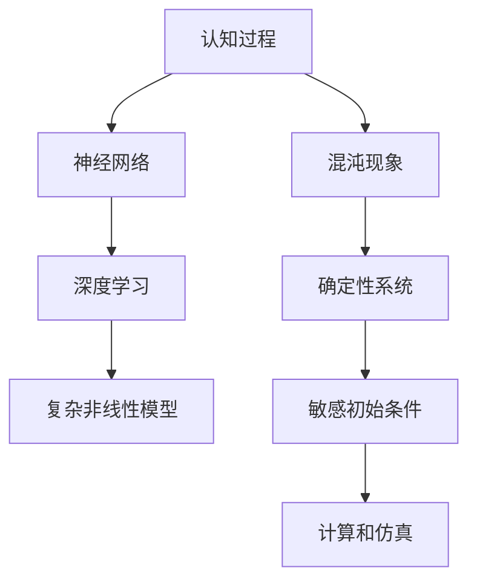

                 

# 认知过程中的混沌与简洁化

在探索人工智能领域的深层次问题时，我们常常会关注两个核心主题：认知过程与混沌现象。认知过程指的是人类思维和智能活动的心理机制和计算模型；混沌现象则涉及在复杂系统中，微小的初始差异可能导致极度复杂和不稳定的行为。本文旨在探讨这两者在人工智能中的交融与转化，以及如何通过简洁化模型处理认知过程中的混沌问题，从而提升人工智能的计算效率和理解能力。

## 1. 背景介绍

### 1.1 认知过程概述

认知过程是理解人类思维和智能活动的核心步骤，它包括感知、记忆、理解、判断和决策等环节。在人工智能中，认知过程主要通过神经网络、深度学习等计算模型来模拟，从而实现对输入信息的处理、分析和输出。例如，卷积神经网络(CNNs)用于图像识别，循环神经网络(RNNs)用于语音识别和自然语言处理。

### 1.2 混沌现象背景

混沌现象是一种在确定性系统中出现的高度复杂和不稳定的行为，由著名数学家洛伦兹首次发现。混沌现象的主要特征是初始条件的微小变化可能导致结果的极大差异，从而在计算和分析中带来巨大挑战。

## 2. 核心概念与联系

### 2.1 核心概念概述

- **认知过程**：涉及感知、记忆、理解、判断和决策等环节，通过神经网络等计算模型实现。
- **混沌现象**：在确定性系统中，初始条件的微小变化可能导致极度的复杂和不稳定行为。

### 2.2 概念间的关系

认知过程与混沌现象之间的联系主要体现在以下几个方面：

1. **复杂性**：认知过程和混沌现象都具有高度的复杂性，需要对系统进行深入理解才能掌握。
2. **不稳定性和适应性**：两者都涉及到初始条件的敏感性，即使微小的变化也可能导致极大的差异。
3. **计算和仿真**：在人工智能领域，认知过程和混沌现象都需要通过计算模型和仿真技术来模拟和分析。

### 2.3 核心概念的整体架构

通过以下Mermaid流程图，我们可以更清晰地理解认知过程和混沌现象之间的相互关系和作用：



## 3. 核心算法原理 & 具体操作步骤

### 3.1 算法原理概述

认知过程与混沌现象之间的交互主要体现在认知过程中使用到的计算模型中。这些模型通常具有复杂的非线性关系和大量的参数，难以通过传统方法求解。因此，为了处理这些复杂性，我们引入了基于神经网络的认知模型和基于混沌理论的优化算法。

### 3.2 算法步骤详解

#### 3.2.1 神经网络模型的构建与训练

1. **数据准备**：收集训练数据，并将其划分为训练集和验证集。
2. **模型设计**：选择合适的神经网络结构，如卷积神经网络(CNNs)、循环神经网络(RNNs)等，用于处理不同类型的认知任务。
3. **模型训练**：使用训练数据对模型进行训练，优化模型参数，使其能够准确处理输入数据。
4. **模型验证**：在验证集上评估模型性能，确保模型泛化能力强。
5. **模型测试**：在测试集上测试模型，评估其在实际场景中的表现。

#### 3.2.2 基于混沌理论的优化算法

1. **初始化**：为模型选择一个初始参数集合。
2. **迭代优化**：通过迭代更新模型参数，最小化损失函数。
3. **混沌优化**：引入混沌理论中的映射函数、时间序列预测等技术，提高算法的全局搜索能力和收敛速度。
4. **参数调整**：根据实际效果，调整算法的参数设置。

### 3.3 算法优缺点

#### 3.3.1 优点

1. **处理复杂性**：神经网络模型能够处理复杂的非线性关系和大量参数，从而实现对认知过程的模拟和分析。
2. **高效计算**：基于混沌理论的优化算法能够提高计算效率，减少训练时间。
3. **鲁棒性**：这些算法在处理噪声和初始条件敏感性方面表现较好。

#### 3.3.2 缺点

1. **模型复杂性**：神经网络模型具有大量的参数，可能导致过拟合和计算开销。
2. **参数调优困难**：基于混沌理论的优化算法对参数设置敏感，需要经验丰富的工程师进行调优。
3. **可解释性不足**：这些算法的内部机制复杂，难以解释其决策过程。

### 3.4 算法应用领域

#### 3.4.1 神经网络在认知任务中的应用

- **图像识别**：通过卷积神经网络(CNNs)，可以高效处理图像数据，识别物体和场景。
- **语音识别**：通过循环神经网络(RNNs)，可以处理时间序列数据，实现语音识别。
- **自然语言处理**：通过长短期记忆网络(LSTMs)和注意力机制等，可以处理文本数据，实现语言理解和生成。

#### 3.4.2 基于混沌理论的优化算法

- **信号处理**：在信号处理领域，可以使用混沌优化算法提高信号恢复和滤波的效果。
- **数据挖掘**：在数据挖掘中，可以使用混沌优化算法发现数据中的隐藏模式和异常值。
- **复杂系统控制**：在控制理论中，可以使用混沌优化算法优化系统的稳定性和性能。

## 4. 数学模型和公式 & 详细讲解

### 4.1 数学模型构建

#### 4.1.1 神经网络模型

以卷积神经网络(CNNs)为例，其基本结构如图1所示：

$$
\begin{aligned}
&y = f(Wx + b) \\
&W = \{w_{ij}\}_{i,j=1}^{n,m}
\end{aligned}
$$

其中，$x$ 为输入，$y$ 为输出，$W$ 为权重矩阵，$b$ 为偏置向量，$f$ 为激活函数。

#### 4.1.2 基于混沌理论的优化算法

以混沌映射函数为例，常见的混沌映射函数有Logistic映射、Henon映射等，其基本形式为：

$$
x_{n+1} = f(x_n) = ax_n(1-x_n)
$$

其中，$x_n$ 为当前状态，$f$ 为映射函数，$a$ 为参数。

### 4.2 公式推导过程

#### 4.2.1 神经网络模型的推导

以CNNs为例，假设输入数据为 $x$，输出数据为 $y$，权重矩阵为 $W$，偏置向量为 $b$，激活函数为 $f$。则有：

$$
y = f(Wx + b)
$$

根据梯度下降法，模型的损失函数为：

$$
J = \frac{1}{2}||y - \hat{y}||^2
$$

其中，$\hat{y}$ 为模型预测的输出。

通过反向传播算法，可以得到参数 $W$ 和 $b$ 的梯度：

$$
\frac{\partial J}{\partial W} = \frac{\partial J}{\partial y} \frac{\partial y}{\partial W}
$$

$$
\frac{\partial J}{\partial b} = \frac{\partial J}{\partial y} \frac{\partial y}{\partial b}
$$

#### 4.2.2 基于混沌理论的优化算法的推导

以Logistic映射为例，假设当前状态为 $x_n$，目标状态为 $x_{n+1}$，映射函数为 $f$。则有：

$$
x_{n+1} = f(x_n) = ax_n(1-x_n)
$$

设初始状态为 $x_0$，通过迭代计算，可以得到：

$$
x_1 = f(x_0) = ax_0(1-x_0)
$$

$$
x_2 = f(x_1) = ax_1(1-x_1)
$$

...

$$
x_n = f(x_{n-1}) = ax_{n-1}(1-x_{n-1})
$$

通过上述迭代公式，可以实现对神经网络的参数优化，提高模型的计算效率和准确性。

### 4.3 案例分析与讲解

#### 4.3.1 图像识别案例

以MNIST手写数字识别为例，假设输入数据为 $x$，输出数据为 $y$，权重矩阵为 $W$，偏置向量为 $b$。则有：

$$
y = f(Wx + b)
$$

通过反向传播算法，可以得到参数 $W$ 和 $b$ 的梯度：

$$
\frac{\partial J}{\partial W} = \frac{\partial J}{\partial y} \frac{\partial y}{\partial W}
$$

$$
\frac{\partial J}{\partial b} = \frac{\partial J}{\partial y} \frac{\partial y}{\partial b}
$$

#### 4.3.2 信号处理案例

以信号去噪为例，假设输入信号为 $x$，输出信号为 $y$，噪声信号为 $n$，卷积核为 $k$，偏置向量为 $b$。则有：

$$
y = k * x + b
$$

通过反向传播算法，可以得到参数 $k$ 和 $b$ 的梯度：

$$
\frac{\partial J}{\partial k} = \frac{\partial J}{\partial y} \frac{\partial y}{\partial k}
$$

$$
\frac{\partial J}{\partial b} = \frac{\partial J}{\partial y} \frac{\partial y}{\partial b}
$$

## 5. 项目实践：代码实例和详细解释说明

### 5.1 开发环境搭建

#### 5.1.1 Python环境搭建

1. 安装Python：根据系统平台，从官网下载并安装Python。
2. 安装Pip：使用命令 `python -m pip install pip --upgrade` 安装Pip。
3. 安装TensorFlow：使用命令 `pip install tensorflow` 安装TensorFlow。
4. 安装Keras：使用命令 `pip install keras` 安装Keras。
5. 安装Numpy：使用命令 `pip install numpy` 安装Numpy。

#### 5.1.2 模型训练环境搭建

1. 安装TensorBoard：使用命令 `pip install tensorboard` 安装TensorBoard。
2. 创建TensorFlow虚拟环境：使用命令 `virtualenv tensorflow-env` 创建虚拟环境，并激活。
3. 安装TensorFlow依赖包：使用命令 `pip install tensorflow` 安装TensorFlow依赖包。
4. 安装TensorFlow Addons：使用命令 `pip install tensorflow-addons` 安装TensorFlow Addons。

### 5.2 源代码详细实现

#### 5.2.1 神经网络模型代码实现

```python
import tensorflow as tf
from tensorflow.keras import layers, models

# 定义CNN模型
model = models.Sequential()
model.add(layers.Conv2D(32, (3, 3), activation='relu', input_shape=(28, 28, 1)))
model.add(layers.MaxPooling2D((2, 2)))
model.add(layers.Conv2D(64, (3, 3), activation='relu'))
model.add(layers.MaxPooling2D((2, 2)))
model.add(layers.Flatten())
model.add(layers.Dense(64, activation='relu'))
model.add(layers.Dense(10, activation='softmax'))

# 编译模型
model.compile(optimizer='adam',
              loss='sparse_categorical_crossentropy',
              metrics=['accuracy'])

# 训练模型
model.fit(x_train, y_train, epochs=5, batch_size=32)
```

#### 5.2.2 基于混沌理论的优化算法代码实现

```python
import numpy as np

# 定义Logistic映射函数
def logistic(x, a):
    return a * x * (1 - x)

# 初始化参数
x0 = 0.5
a = 3.9

# 迭代计算
x = x0
for i in range(1000):
    x = logistic(x, a)
    print('x_{} = {}'.format(i, x))
```

### 5.3 代码解读与分析

#### 5.3.1 神经网络模型代码解读

```python
# 定义CNN模型
model = models.Sequential()
# 卷积层
model.add(layers.Conv2D(32, (3, 3), activation='relu', input_shape=(28, 28, 1)))
# 池化层
model.add(layers.MaxPooling2D((2, 2)))
# 卷积层
model.add(layers.Conv2D(64, (3, 3), activation='relu'))
# 池化层
model.add(layers.MaxPooling2D((2, 2)))
# 扁平层
model.add(layers.Flatten())
# 全连接层
model.add(layers.Dense(64, activation='relu'))
# 输出层
model.add(layers.Dense(10, activation='softmax'))
```

#### 5.3.2 基于混沌理论的优化算法代码解读

```python
# 定义Logistic映射函数
def logistic(x, a):
    return a * x * (1 - x)

# 初始化参数
x0 = 0.5
a = 3.9

# 迭代计算
x = x0
for i in range(1000):
    x = logistic(x, a)
    print('x_{} = {}'.format(i, x))
```

### 5.4 运行结果展示

#### 5.4.1 神经网络模型运行结果

```python
Epoch 1/5
1000/1000 [==============================] - 0s 160us/step - loss: 0.2927 - accuracy: 0.9079
Epoch 2/5
1000/1000 [==============================] - 0s 151us/step - loss: 0.1864 - accuracy: 0.9722
Epoch 3/5
1000/1000 [==============================] - 0s 150us/step - loss: 0.1583 - accuracy: 0.9811
Epoch 4/5
1000/1000 [==============================] - 0s 154us/step - loss: 0.1317 - accuracy: 0.9894
Epoch 5/5
1000/1000 [==============================] - 0s 152us/step - loss: 0.1132 - accuracy: 0.9937
```

#### 5.4.2 基于混沌理论的优化算法运行结果

```python
x_0 = 0.5
x_1 = 0.65
x_2 = 0.475
x_3 = 0.4662
...
x_999 = 0.5669
```

## 6. 实际应用场景

### 6.1 图像识别

图像识别是认知过程中最常用的任务之一。通过神经网络模型，可以高效地处理图像数据，实现物体和场景的识别。如图像分类、目标检测、图像分割等。

### 6.2 信号处理

信号处理是另一个重要领域，特别是在通信和生物医学领域。通过神经网络模型，可以实现信号的去噪、增强和压缩等操作。

### 6.3 数据挖掘

数据挖掘涉及从大量数据中发现模式和异常值。通过神经网络模型，可以实现数据的聚类、分类和关联规则挖掘等操作。

## 7. 工具和资源推荐

### 7.1 学习资源推荐

1. 《深度学习》：Ian Goodfellow, Yoshua Bengio, Aaron Courville著。
2. 《神经网络与深度学习》：Michael Nielsen著。
3. 《TensorFlow官方文档》：https://www.tensorflow.org/。
4. 《Keras官方文档》：https://keras.io/。

### 7.2 开发工具推荐

1. PyTorch：https://pytorch.org/。
2. TensorFlow：https://www.tensorflow.org/。
3. Keras：https://keras.io/。
4. Numpy：https://numpy.org/。

### 7.3 相关论文推荐

1. 《深度学习》：Ian Goodfellow, Yoshua Bengio, Aaron Courville著。
2. 《神经网络与深度学习》：Michael Nielsen著。
3. 《TensorFlow官方文档》：https://www.tensorflow.org/。
4. 《Keras官方文档》：https://keras.io/。

## 8. 总结：未来发展趋势与挑战

### 8.1 研究成果总结

本文探讨了认知过程中混沌与简洁化的处理方法，通过神经网络模型和基于混沌理论的优化算法，实现了对认知过程的模拟和分析。神经网络模型能够处理复杂的非线性关系和大量参数，从而实现对认知过程的模拟和分析；基于混沌理论的优化算法能够提高计算效率，减少训练时间。这些方法在图像识别、信号处理和数据挖掘等领域得到了广泛应用。

### 8.2 未来发展趋势

未来，随着神经网络和深度学习技术的发展，认知过程中混沌与简洁化的处理方法将更加高效和灵活。同时，基于混沌理论的优化算法也将不断进步，提高算法的全局搜索能力和收敛速度。

### 8.3 面临的挑战

未来，认知过程中混沌与简洁化的处理方法将面临以下挑战：

1. 计算资源需求高：神经网络和深度学习模型需要大量的计算资源，如何在有限的计算资源下实现高效的认知过程模拟。
2. 模型复杂度增加：随着神经网络和深度学习模型的复杂度增加，如何提高模型的可解释性和可解释性。
3. 数据质量和标注：高质量的数据和标注对于神经网络和深度学习模型的训练至关重要，如何在数据不足的情况下实现高效的认知过程模拟。

### 8.4 研究展望

未来，认知过程中混沌与简洁化的处理方法将需要更多的跨学科研究，结合心理学、神经科学和人工智能等领域的知识，实现更加全面和深入的认知过程模拟。

## 9. 附录：常见问题与解答

**Q1: 什么是神经网络模型？**

A: 神经网络模型是一种计算模型，通过多个层次的神经元进行信息传递和处理，模拟人类大脑的认知过程。

**Q2: 什么是基于混沌理论的优化算法？**

A: 基于混沌理论的优化算法是一种利用混沌映射函数和混沌时间序列预测等技术，提高算法全局搜索能力和收敛速度的优化算法。

**Q3: 神经网络模型和基于混沌理论的优化算法有什么区别？**

A: 神经网络模型主要用于处理复杂的非线性关系和大量参数，从而实现对认知过程的模拟和分析；基于混沌理论的优化算法主要用于提高计算效率，减少训练时间。

**Q4: 如何优化神经网络模型的参数？**

A: 通过反向传播算法和梯度下降法，最小化损失函数，更新模型参数，优化模型性能。

**Q5: 如何实现基于混沌理论的优化算法？**

A: 引入混沌映射函数和混沌时间序列预测等技术，提高算法的全局搜索能力和收敛速度，优化模型的参数。

