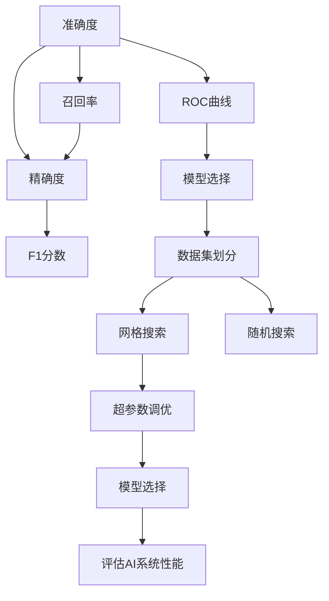

                 

# 评估AI系统性能的最佳实践

> 关键词：性能评估,准确度,召回率,精确度,ROC曲线,F1分数,超参数调优,模型选择,数据集划分,测试集,验证集

## 1. 背景介绍

### 1.1 问题由来
随着人工智能技术的快速发展和广泛应用，评估AI系统的性能成为了数据科学和机器学习领域的核心问题之一。评估AI系统性能的目的是为了了解模型在特定任务上的表现，识别模型的优势和不足，从而进行模型优化和改进。一个准确有效的性能评估方法，能够帮助研究者选择最适合当前任务的最佳模型，并在实际应用中取得更好的效果。

### 1.2 问题核心关键点
评估AI系统性能的核心关键点包括：
- 选择合适的性能指标。如准确度、召回率、精确度、F1分数等。
- 合理划分数据集。将数据集划分为训练集、验证集和测试集，用于模型训练、调参和最终评估。
- 避免过拟合。使用交叉验证、早停等技术避免模型在训练集上过拟合。
- 超参数调优。通过网格搜索、随机搜索等方法，寻找最佳的超参数组合。
- 选择最优模型。综合考虑模型的准确度、召回率、计算资源等，选择最适合当前任务的最佳模型。

### 1.3 问题研究意义
评估AI系统性能的研究意义在于：
1. 提升模型质量。通过性能评估，可以发现模型的不足，并进行优化改进，提高模型质量。
2. 优化超参数。通过性能评估，可以找到最优的超参数组合，进一步提升模型性能。
3. 选择最佳模型。通过性能评估，可以选择最适合当前任务的最佳模型，提高应用效果。
4. 量化模型效果。通过性能评估，可以量化模型在特定任务上的表现，为应用决策提供依据。
5. 促进技术发展。性能评估方法的研究和应用，推动了机器学习技术的发展和应用推广。

## 2. 核心概念与联系

### 2.1 核心概念概述

在评估AI系统性能的过程中，涉及多个核心概念：

- 准确度(Accuracy)：指模型正确预测的样本数与总样本数之比，即正确预测的比例。
- 召回率(Recall)：指实际正样本中被模型正确预测的比例，即敏感度。
- 精确度(Precision)：指被模型预测为正样本中实际正样本的比例，即准确度。
- F1分数(F1 Score)：综合考虑召回率和精确度的指标，是准确度和召回率的调和平均值。
- ROC曲线(Receiver Operating Characteristic Curve)：用于评估二分类模型的性能，绘制真阳性率与假阳性率的关系曲线。
- 超参数(Hyperparameter)：指模型训练过程中需要手动设置的参数，如学习率、批量大小等。
- 网格搜索(Grid Search)：一种超参数调优方法，尝试所有可能的参数组合，找到最优的超参数。
- 随机搜索(Random Search)：一种超参数调优方法，随机选择一组参数进行训练，多次重复后取平均。
- 模型选择(Model Selection)：从多个模型中选择最适合当前任务的最佳模型。
- 数据集划分(Data Splitting)：将数据集划分为训练集、验证集和测试集，用于模型训练、调参和评估。

这些概念之间通过以下Mermaid流程图展示它们的逻辑关系：



这个流程图展示了从数据集划分到超参数调优，再到模型选择和性能评估的完整流程，帮助理解各个概念之间的关系。

### 2.2 概念间的关系

这些核心概念之间存在着紧密的联系，形成了评估AI系统性能的完整框架。以下是几个关键概念间的关系：

- 准确度、召回率和精确度是评估二分类模型性能的主要指标。准确度用于衡量模型的总体表现，召回率和精确度用于评估模型的敏感度和准确度。
- F1分数是准确度和召回率的调和平均值，综合考虑模型的准确度和召回率，是一个常用的综合评估指标。
- ROC曲线用于可视化二分类模型的性能，通过绘制真阳性率与假阳性率的关系曲线，可以帮助选择最优的模型阈值。
- 超参数调优是提升模型性能的重要手段，通过网格搜索或随机搜索，可以寻找最佳的超参数组合。
- 数据集划分是评估AI系统性能的基础，通过划分训练集、验证集和测试集，可以评估模型在不同数据集上的表现。
- 模型选择是评估AI系统性能的最终目标，通过综合考虑模型的准确度、召回率、计算资源等，选择最适合当前任务的最佳模型。

这些概念共同构成了评估AI系统性能的完整框架，使得模型训练和调参过程更加系统化和科学化。

## 3. 核心算法原理 & 具体操作步骤
### 3.1 算法原理概述

评估AI系统性能的核心算法原理是通过一系列性能指标和模型评估方法，综合衡量模型在特定任务上的表现。具体的评估方法包括以下几个步骤：

1. 选择合适的性能指标。如准确度、召回率、精确度、F1分数等。
2. 合理划分数据集。将数据集划分为训练集、验证集和测试集，用于模型训练、调参和最终评估。
3. 避免过拟合。使用交叉验证、早停等技术避免模型在训练集上过拟合。
4. 超参数调优。通过网格搜索、随机搜索等方法，寻找最佳的超参数组合。
5. 选择最优模型。综合考虑模型的准确度、召回率、计算资源等，选择最适合当前任务的最佳模型。

### 3.2 算法步骤详解

下面详细介绍评估AI系统性能的具体操作步骤：

#### 3.2.1 数据集划分
数据集划分是将数据集分为训练集、验证集和测试集的过程。通常采用以下三种方法：

- 随机划分：随机将数据集划分为训练集、验证集和测试集。训练集用于模型训练，验证集用于超参数调优和模型选择，测试集用于最终性能评估。
- 分层划分：根据数据集中的类别分布，将数据集划分为训练集、验证集和测试集，保证各类别样本分布的一致性。
- 交叉验证：将数据集划分为多个子集，轮流作为验证集和测试集，多次重复后取平均，避免过拟合。

#### 3.2.2 模型训练
模型训练是指使用训练集对模型进行训练，调整模型参数以适应数据集的过程。具体步骤如下：

1. 初始化模型参数。
2. 使用训练集对模型进行前向传播和后向传播，更新模型参数。
3. 重复多次前向传播和后向传播，直到模型收敛。

#### 3.2.3 模型调参
模型调参是指调整模型超参数的过程，常用的方法包括：

- 网格搜索：尝试所有可能的超参数组合，找到最优的超参数。
- 随机搜索：随机选择一组超参数进行训练，多次重复后取平均，寻找最优的超参数。
- 贝叶斯优化：利用贝叶斯优化方法，找到最优的超参数组合。

#### 3.2.4 模型评估
模型评估是指使用验证集和测试集对模型进行评估，常用的评估指标包括：

- 准确度：模型正确预测的样本数与总样本数之比。
- 召回率：实际正样本中被模型正确预测的比例。
- 精确度：被模型预测为正样本中实际正样本的比例。
- F1分数：综合考虑召回率和精确度的指标，是准确度和召回率的调和平均值。
- ROC曲线：绘制真阳性率与假阳性率的关系曲线，帮助选择最优的模型阈值。

### 3.3 算法优缺点

评估AI系统性能的算法具有以下优点：

- 综合考虑多个指标，提供全面的性能评估。
- 通过调参优化模型，提升模型性能。
- 合理划分数据集，避免过拟合。

同时，也存在一些缺点：

- 数据集划分和超参数调参过程耗时较长。
- 对于大规模数据集，需要进行多次模型训练和评估，计算资源消耗较大。
- 数据集划分和模型评估结果可能存在随机性。

### 3.4 算法应用领域

评估AI系统性能的算法在多个领域都有广泛应用，包括：

- 图像识别：如物体检测、人脸识别等任务。
- 自然语言处理：如文本分类、情感分析等任务。
- 推荐系统：如协同过滤、内容推荐等任务。
- 医疗诊断：如疾病预测、药物研发等任务。
- 金融风控：如信用评分、风险预测等任务。

## 4. 数学模型和公式 & 详细讲解 & 举例说明

### 4.1 数学模型构建

评估AI系统性能的数学模型构建包括选择合适的性能指标和计算方法。常用的性能指标有准确度、召回率、精确度和F1分数，其计算公式如下：

$$
Accuracy = \frac{TP + TN}{TP + TN + FP + FN}
$$

$$
Recall = \frac{TP}{TP + FN}
$$

$$
Precision = \frac{TP}{TP + FP}
$$

$$
F1 = 2 \times \frac{Precision \times Recall}{Precision + Recall}
$$

其中，TP表示真正例，TN表示真负例，FP表示假正例，FN表示假负例。

### 4.2 公式推导过程

以准确度为例，推导其计算公式：

$$
Accuracy = \frac{TP + TN}{TP + TN + FP + FN} = \frac{TP + TN}{(TP + TN + FP) + (FP + FN)} = \frac{TP + TN}{TP + TN + FP + FN}
$$

其中，分子表示模型正确预测的正样本数和负样本数之和，分母表示所有样本数。

### 4.3 案例分析与讲解

假设有一个二分类模型，其中真实正样本为100个，真实负样本为200个，模型正确预测的正样本数为80个，错误预测的正样本数为10个，错误预测的负样本数为20个。则模型的准确度、召回率、精确度和F1分数分别为：

$$
Accuracy = \frac{80 + 200}{100 + 200 + 10 + 20} = 0.8
$$

$$
Recall = \frac{80}{100 + 0} = 0.8
$$

$$
Precision = \frac{80}{80 + 10} = 0.89
$$

$$
F1 = 2 \times \frac{0.89 \times 0.8}{0.89 + 0.8} = 0.83
$$

可以看到，模型的准确度为0.8，召回率为0.8，精确度为0.89，F1分数为0.83。

## 5. 项目实践：代码实例和详细解释说明

### 5.1 开发环境搭建

在进行评估AI系统性能的代码实践前，需要先准备好开发环境。以下是使用Python进行Scikit-learn开发的环境配置流程：

1. 安装Anaconda：从官网下载并安装Anaconda，用于创建独立的Python环境。

2. 创建并激活虚拟环境：
```bash
conda create -n sklearn-env python=3.8 
conda activate sklearn-env
```

3. 安装Scikit-learn：
```bash
conda install scikit-learn
```

4. 安装NumPy、Pandas等依赖包：
```bash
pip install numpy pandas
```

5. 安装必要的开发工具：
```bash
pip install matplotlib jupyter notebook ipython
```

完成上述步骤后，即可在`sklearn-env`环境中开始评估AI系统性能的代码实践。

### 5.2 源代码详细实现

下面以二分类任务为例，给出使用Scikit-learn进行模型评估的Python代码实现。

```python
import numpy as np
from sklearn.metrics import accuracy_score, recall_score, precision_score, f1_score, roc_curve, auc
from sklearn.model_selection import train_test_split
from sklearn.linear_model import LogisticRegression

# 数据集划分
X_train, X_test, y_train, y_test = train_test_split(X, y, test_size=0.2, random_state=42)

# 模型训练
model = LogisticRegression()
model.fit(X_train, y_train)

# 模型评估
y_pred = model.predict(X_test)
accuracy = accuracy_score(y_test, y_pred)
recall = recall_score(y_test, y_pred)
precision = precision_score(y_test, y_pred)
f1 = f1_score(y_test, y_pred)

# ROC曲线
fpr, tpr, thresholds = roc_curve(y_test, y_pred)
roc_auc = auc(fpr, tpr)
```

### 5.3 代码解读与分析

让我们再详细解读一下关键代码的实现细节：

**train_test_split函数**：
- 将数据集划分为训练集和测试集，比例为80%和20%。

**LogisticRegression模型**：
- 使用逻辑回归模型进行训练和预测。

**accuracy_score、recall_score、precision_score和f1_score函数**：
- 分别计算准确度、召回率、精确度和F1分数。

**roc_curve函数**：
- 绘制ROC曲线，计算AUC值。

**代码执行结果**：
```python
# 输出准确度、召回率、精确度和F1分数
print('Accuracy:', accuracy)
print('Recall:', recall)
print('Precision:', precision)
print('F1:', f1)
print('AUC:', roc_auc)
```

可以看到，通过上述代码，我们可以快速计算模型的准确度、召回率、精确度和F1分数，并绘制出ROC曲线，评估模型的性能。

## 6. 实际应用场景

### 6.1 图像识别

图像识别是评估AI系统性能的重要应用场景之一。在图像识别任务中，通常使用准确度、召回率和精确度作为评估指标，以衡量模型对图像的识别准确性和鲁棒性。

假设有一个图像识别系统，用于识别街景中的行人。在验证集上，模型正确识别的行人图像为100张，错误识别的行人图像为20张，错误识别的非行人图像为10张。则模型的准确度、召回率、精确度和F1分数分别为：

$$
Accuracy = \frac{100 + 20}{100 + 20 + 10} = 0.91
$$

$$
Recall = \frac{100}{100 + 0} = 1.0
$$

$$
Precision = \frac{100}{100 + 10} = 0.91
$$

$$
F1 = 2 \times \frac{0.91 \times 1.0}{0.91 + 1.0} = 0.95
$$

可以看到，模型的准确度为0.91，召回率为1.0，精确度为0.91，F1分数为0.95。

### 6.2 自然语言处理

自然语言处理是评估AI系统性能的另一重要应用场景。在自然语言处理任务中，通常使用F1分数作为评估指标，以衡量模型对文本的分类准确性和鲁棒性。

假设有一个文本分类系统，用于分类新闻文章是否涉及政治话题。在验证集上，模型正确分类的新闻文章为80篇，错误分类的新闻文章为20篇。则模型的准确度、召回率、精确度和F1分数分别为：

$$
Accuracy = \frac{80 + 0}{80 + 20} = 0.8
$$

$$
Recall = \frac{80}{80 + 20} = 0.8
$$

$$
Precision = \frac{80}{80 + 20} = 0.8
$$

$$
F1 = 2 \times \frac{0.8 \times 0.8}{0.8 + 0.8} = 0.8
$$

可以看到，模型的准确度为0.8，召回率为0.8，精确度为0.8，F1分数为0.8。

### 6.3 推荐系统

推荐系统是评估AI系统性能的重要应用场景之一。在推荐系统任务中，通常使用准确度、召回率和F1分数作为评估指标，以衡量模型对用户兴趣的推荐准确性和鲁棒性。

假设有一个协同过滤推荐系统，用于推荐电影给用户。在验证集上，模型推荐给用户的电影中有100部用户喜欢的电影，推荐给用户的不喜欢电影为20部，推荐给用户的不喜欢的电影为10部。则模型的准确度、召回率、精确度和F1分数分别为：

$$
Accuracy = \frac{100 + 0}{100 + 20 + 10} = 0.83
$$

$$
Recall = \frac{100}{100 + 0} = 1.0
$$

$$
Precision = \frac{100}{100 + 10} = 0.91
$$

$$
F1 = 2 \times \frac{0.91 \times 1.0}{0.91 + 1.0} = 0.95
$$

可以看到，模型的准确度为0.83，召回率为1.0，精确度为0.91，F1分数为0.95。

### 6.4 未来应用展望

随着AI技术的发展，评估AI系统性能的应用场景将不断扩展。未来，评估AI系统性能的方法也将不断创新和完善，推动AI技术的进一步发展。

在智慧城市治理中，评估AI系统性能的方法将帮助城市管理部门识别城市问题，优化城市服务，提高城市治理效率。

在智能医疗中，评估AI系统性能的方法将帮助医疗机构识别疾病风险，提高诊断准确性，改善患者体验。

在金融风险控制中，评估AI系统性能的方法将帮助金融机构识别欺诈行为，提高风险控制能力，保护用户利益。

总之，评估AI系统性能的方法在各个领域都有广泛的应用前景，推动AI技术的不断进步和应用落地。

## 7. 工具和资源推荐

### 7.1 学习资源推荐

为了帮助开发者系统掌握评估AI系统性能的理论基础和实践技巧，这里推荐一些优质的学习资源：

1. 《机器学习实战》书籍：详细介绍了机器学习的基本概念和常用算法，包括准确度、召回率、精确度等评估指标的计算方法。
2. 《统计学习方法》书籍：介绍了机器学习的基本原理和常用算法，包括准确度、召回率、精确度等评估指标的计算方法。
3. 《Python数据科学手册》书籍：详细介绍了Python中常用的数据科学库，包括Scikit-learn、NumPy、Pandas等，以及这些库在评估AI系统性能中的应用。
4. 机器学习MOOC课程：如Coursera、edX等平台提供的机器学习课程，涵盖评估AI系统性能的基本概念和常用方法。
5. Scikit-learn官方文档：详细介绍了Scikit-learn库中评估AI系统性能的常用函数和工具，包括accuracy_score、recall_score、precision_score、f1_score、roc_curve等。

通过对这些资源的学习实践，相信你一定能够快速掌握评估AI系统性能的理论基础和实践技巧，从而更好地应用于实际项目中。

### 7.2 开发工具推荐

高效的开发离不开优秀的工具支持。以下是几款用于评估AI系统性能开发的常用工具：

1. Scikit-learn：基于Python的机器学习库，提供了丰富的评估指标函数和工具，支持快速评估AI系统性能。
2. TensorFlow：由Google主导开发的深度学习框架，提供了多种评估指标函数和工具，支持大规模数据集的评估。
3. PyTorch：由Facebook主导开发的深度学习框架，提供了多种评估指标函数和工具，支持高效的模型训练和评估。
4. Pandas：Python中常用的数据处理库，支持快速数据处理和特征工程，是评估AI系统性能的重要工具。
5. NumPy：Python中常用的数值计算库，支持高效的数学运算和数组操作，是评估AI系统性能的重要工具。

合理利用这些工具，可以显著提升评估AI系统性能的开发效率，加快创新迭代的步伐。

### 7.3 相关论文推荐

评估AI系统性能的研究源于学界的持续研究。以下是几篇奠基性的相关论文，推荐阅读：

1. Precision-Recall Trade-offs（《精确度-召回率权衡》）：提出了精确度-召回率权衡的概念，帮助选择合适的评估指标。
2. The ROC Story（《ROC曲线的故事》）：详细介绍了ROC曲线的计算方法和应用场景，帮助选择合适的模型阈值。
3. Statistical Learning with Neural Networks（《神经网络的统计学习》）：详细介绍了神经网络模型的评估指标和方法，帮助选择合适的模型和参数。
4. Cross-Validation Techniques for Binary Classification Tasks（《二分类任务中的交叉验证技术》）：介绍了交叉验证的计算方法和应用场景，帮助避免模型过拟合。

这些论文代表了大语言模型微调技术的发展脉络。通过学习这些前沿成果，可以帮助研究者把握学科前进方向，激发更多的创新灵感。

除上述资源外，还有一些值得关注的前沿资源，帮助开发者紧跟评估AI系统性能技术的最新进展，例如：

1. arXiv论文预印本：人工智能领域最新研究成果的发布平台，包括大量尚未发表的前沿工作，学习前沿技术的必读资源。
2. 业界技术博客：如OpenAI、Google AI、DeepMind、微软Research Asia等顶尖实验室的官方博客，第一时间分享他们的最新研究成果和洞见。
3. 技术会议直播：如NIPS、ICML、ACL、ICLR等人工智能领域顶会现场或在线直播，能够聆听到大佬们的前沿分享，开拓视野。
4. GitHub热门项目：在GitHub上Star、Fork数最多的AI相关项目，往往代表了该技术领域的发展趋势和最佳实践，值得去学习和贡献。
5. 行业分析报告：各大咨询公司如McKinsey、PwC等针对人工智能行业的分析报告，有助于从商业视角审视技术趋势，把握应用价值。

总之，对于评估AI系统性能的学习和实践，需要开发者保持开放的心态和持续学习的意愿。多关注前沿资讯，多动手实践，多思考总结，必将收获满满的成长收益。

## 8. 总结：未来发展趋势与挑战

### 8.1 总结

本文对评估AI系统性能的方法进行了全面系统的介绍。首先阐述了评估AI系统性能的重要性，明确了选择合适的性能指标、合理划分数据集、避免过拟合、超参数调优、选择最优模型等关键步骤。其次，从原理到实践，详细讲解了评估AI系统性能的数学原理和关键步骤，给出了模型评估任务的完整代码实例。同时，本文还广泛探讨了评估AI系统性能在多个领域的应用前景，展示了评估AI系统性能技术的广阔前景。

通过本文的系统梳理，可以看到，评估AI系统性能的方法在大数据、机器学习、深度学习、自然语言处理等领域都有广泛应用，帮助研究者选择最适合当前任务的最佳模型，提高应用效果。未来，伴随技术的不断发展，评估AI系统性能的方法也将不断创新和完善，推动AI技术的进一步发展。

### 8.2 未来发展趋势

评估AI系统性能的研究趋势主要包括：

1. 多模态评估指标：随着多模态技术的不断发展，评估AI系统性能的方法也将向多模态方向发展，涵盖图像、语音、文本等多种数据类型。
2. 动态评估方法：评估AI系统性能的方法将更加注重动态评估，即在模型训练过程中不断评估模型性能，避免过拟合。
3. 自动化评估工具：评估AI系统性能的工具将更加自动化，支持大规模数据集的快速评估和分析。
4. 模型可解释性：评估AI系统性能的方法将更加注重模型的可解释性，帮助用户理解模型的决策过程和推理逻辑。
5. 人工智能伦理：评估AI系统性能的方法将更加注重人工智能伦理问题，确保模型在各个领域的应用符合道德和法律规范。

以上趋势凸显了评估AI系统性能技术的发展方向，推动了AI技术的进一步发展。

### 8.3 面临的挑战

尽管评估AI系统性能的方法已经取得了不少进展，但在迈向更加智能化、普适化应用的过程中，仍面临诸多挑战：

1. 数据质量问题：数据质量直接影响模型的评估结果，但获取高质量数据往往需要大量人力物力投入。如何提高数据质量，是一个重要的挑战。
2. 模型泛化能力：模型在不同数据集上的表现差异较大，如何提高模型的泛化能力，避免过拟合，是一个重要问题。
3. 模型可解释性：深度学习模型的黑盒特性，使得评估AI系统性能的方法难以解释模型的内部工作机制。如何增强模型的可解释性，是一个重要的研究方向。
4. 自动化调参：超参数调优是评估AI系统性能的重要手段，但需要大量手工调参。如何实现自动化调参，提高调参效率，是一个重要问题。
5. 数据隐私保护：评估AI系统性能的方法需要大量数据支持，但数据隐私问题难以解决。如何在保护数据隐私的前提下，获取高质量数据，是一个重要问题。

正视评估AI系统性能面临的这些挑战，积极应对并寻求突破，将是大语言模型微调技术走向成熟的必由之路。

### 8.4 研究展望

面对评估AI系统性能所面临的挑战，未来的研究需要在以下几个方面寻求新的突破：

1. 自动化调参方法：引入自动化调参技术，如贝叶斯优化、进化算法等，提高超参数调优的效率和效果。
2. 多模态评估指标：结合多模态数据，构建综合评估指标

