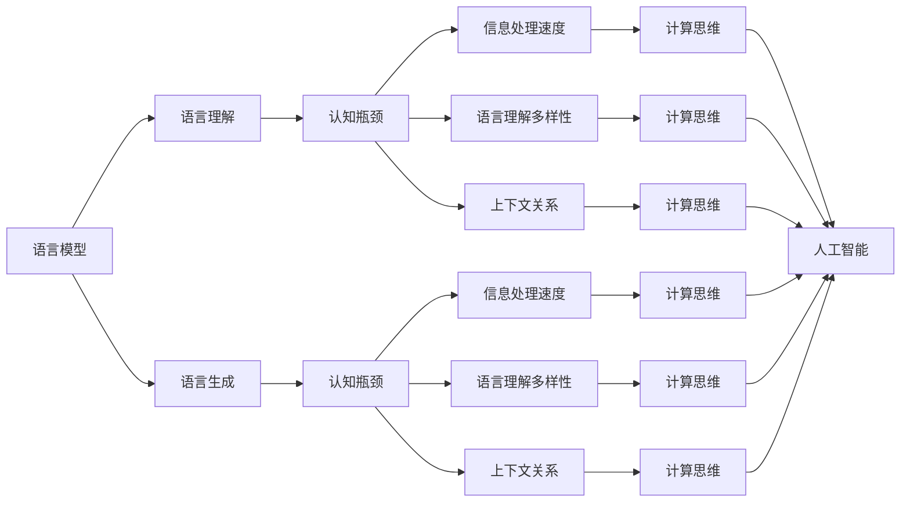
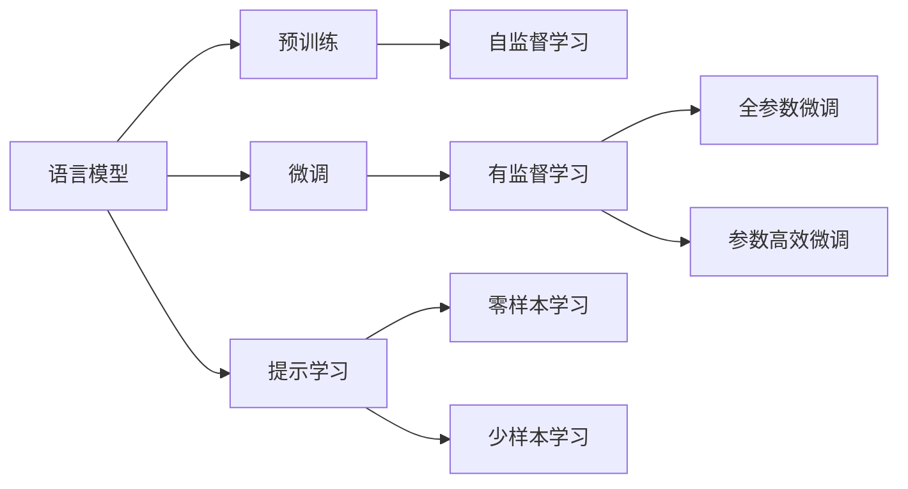
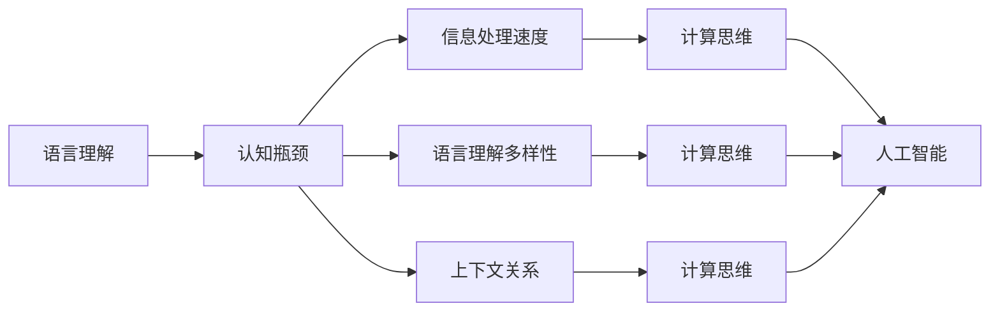
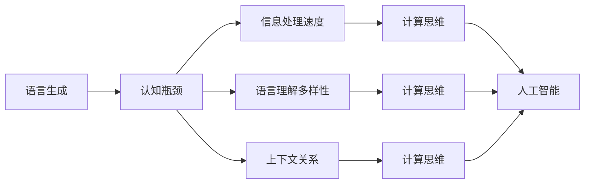
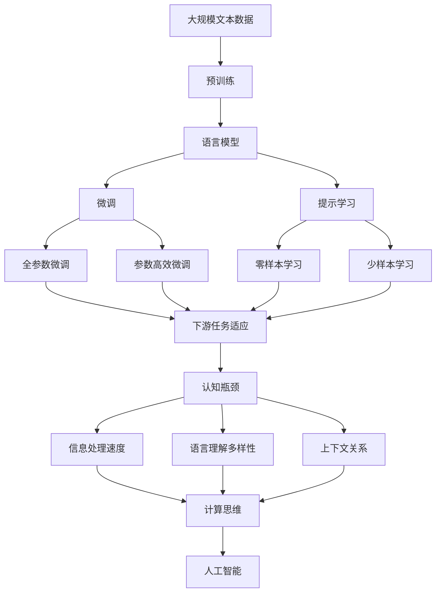

                 

# 语言≠思维：大模型的认知瓶颈

> 关键词：语言理解,认知瓶颈,大模型,语言模型,语言生成,认知科学,计算思维,人工智能

## 1. 背景介绍

### 1.1 问题由来
近年来，深度学习和大规模语言模型的迅猛发展，带来了人工智能领域的一场革命。语言模型，尤其是像GPT、BERT等大型预训练模型，已经具备了高度复杂的语言理解和生成能力。然而，尽管这些模型的性能在各种自然语言处理任务上达到了新的高度，但它们与人类认知思维之间的距离仍是一个极具挑战性的问题。

语言模型主要依赖于大量的语料和复杂的神经网络结构，通过反向传播算法来训练优化，从而达到对语言的深度理解和生成。然而，这种依赖数据驱动的训练方式，是否能够真正模拟和理解人类的思维过程，仍然是一个未解之谜。

### 1.2 问题核心关键点
在追求更高的模型性能和智能化的同时，如何构建能够真正理解人类思维的语言模型，成为了当前AI研究的热点和难点。其中，认知瓶颈（Cognitive Bottleneck）的概念，更是触及了语言模型与人类认知之间的根本区别。

认知瓶颈指的是在计算和处理信息时，某些特定认知过程成为信息流动的关键节点，限制了整个系统的表现。在语言模型中，这些瓶颈可能表现为信息处理的速度、语言理解的多样性、上下文关系的把握等。如何克服这些瓶颈，是构建真正智能的语言模型的关键。

### 1.3 问题研究意义
研究大模型的认知瓶颈，对于深化我们对AI和认知科学的理解，推动人工智能技术的进步，具有重要意义：

1. **揭示AI与人类思维的本质差异**：深入理解语言模型的认知瓶颈，可以揭示其与人类思维的根本差异，从而为未来的AI研究提供理论基础。

2. **提升模型性能**：通过消除或缓解认知瓶颈，可以显著提升语言模型的性能，使其更接近于人类的智能水平。

3. **优化训练策略**：针对认知瓶颈，可以设计更加科学的训练策略，加速模型的学习和优化过程。

4. **促进跨学科研究**：认知瓶颈的探讨需要跨学科的合作，促进计算机科学、心理学、神经科学等领域的研究融合。

5. **增强可解释性**：认知瓶颈的研究有助于构建更可解释的语言模型，提升模型的可信度和透明度。

## 2. 核心概念与联系

### 2.1 核心概念概述

为了更好地理解大模型的认知瓶颈，本节将介绍几个关键概念：

- **语言模型**：指能够对输入的自然语言进行理解、处理和生成的模型。常用的语言模型包括自回归模型（如GPT）和自编码模型（如BERT）。

- **认知瓶颈**：指在计算和处理信息时，某些特定认知过程成为信息流动的关键节点，限制了整个系统的表现。在语言模型中，这些瓶颈可能表现为信息处理的速度、语言理解的多样性、上下文关系的把握等。

- **计算思维**：指利用计算机科学的原理和方法，进行信息处理和问题解决的过程。计算思维与人类思维的不同之处在于，它更侧重于算法和数据结构的设计与实现。

- **人工智能**：指通过模拟人类的认知能力，使机器能够进行智能化的信息处理和决策。语言模型是实现人工智能的重要工具之一。

- **语言理解**：指对自然语言输入进行解析、理解、处理的过程。语言理解是语言模型的核心能力之一。

- **语言生成**：指根据给定的输入，生成符合语法和语义规范的自然语言输出。语言生成是语言模型的重要应用之一。

这些核心概念之间存在着紧密的联系，形成了大语言模型认知瓶颈研究的基本框架。下面通过Mermaid流程图来展示这些概念之间的关系：



这个流程图展示了语言模型在语言理解、语言生成等核心能力的基础上，存在认知瓶颈对信息处理速度、多样性、上下文关系等的影响，以及这些瓶颈如何影响计算思维和人工智能的实现。

### 2.2 概念间的关系

这些核心概念之间存在着复杂的关系，形成了大语言模型认知瓶颈研究的核心生态系统。下面通过几个Mermaid流程图来展示这些概念之间的关系。

#### 2.2.1 语言模型的学习范式



这个流程图展示了语言模型的学习范式，包括预训练、微调、提示学习等。预训练和微调是语言模型学习的主要方式，而提示学习则是在不更新模型参数的情况下，实现零样本和少样本学习。

#### 2.2.2 认知瓶颈与语言理解



这个流程图展示了认知瓶颈在语言理解中的影响，包括信息处理速度、语言理解多样性、上下文关系等。这些瓶颈影响了语言模型的计算思维和人工智能的实现。

#### 2.2.3 认知瓶颈与语言生成



这个流程图展示了认知瓶颈在语言生成中的影响，包括信息处理速度、语言理解多样性、上下文关系等。这些瓶颈影响了语言模型的计算思维和人工智能的实现。

### 2.3 核心概念的整体架构

最后，我们用一个综合的流程图来展示这些核心概念在大语言模型认知瓶颈研究过程中的整体架构：



这个综合流程图展示了从预训练到微调，再到认知瓶颈研究，以及如何在下游任务中应用微调后的模型的完整过程。通过这些流程图，我们可以更清晰地理解大语言模型认知瓶颈研究过程中各个核心概念的关系和作用。

## 3. 核心算法原理 & 具体操作步骤
### 3.1 算法原理概述

大模型的认知瓶颈主要涉及信息处理速度、语言理解多样性、上下文关系等方面。在计算和处理信息时，这些瓶颈成为信息流动的关键节点，限制了模型的表现。

形式化地，假设预训练语言模型为 $M_{\theta}$，其中 $\theta$ 为预训练得到的模型参数。给定下游任务 $T$ 的标注数据集 $D=\{(x_i,y_i)\}_{i=1}^N$，认知瓶颈的优化目标是最小化任务适应过程中的瓶颈，即找到新的模型参数 $\hat{\theta}$，使得：

$$
\hat{\theta}=\mathop{\arg\min}_{\theta} \mathcal{L}(M_{\theta},D)
$$

其中 $\mathcal{L}$ 为针对任务 $T$ 设计的损失函数，用于衡量模型预测输出与真实标签之间的差异。常见的损失函数包括交叉熵损失、均方误差损失等。

通过梯度下降等优化算法，认知瓶颈优化过程不断更新模型参数 $\theta$，最小化损失函数 $\mathcal{L}$，使得模型输出逼近真实标签。由于 $\theta$ 已经通过预训练获得了较好的初始化，因此即便在小规模数据集 $D$ 上进行优化，也能较快收敛到理想的模型参数 $\hat{\theta}$。

### 3.2 算法步骤详解

基于大模型认知瓶颈的优化方法一般包括以下几个关键步骤：

**Step 1: 准备预训练模型和数据集**
- 选择合适的预训练语言模型 $M_{\theta}$ 作为初始化参数，如 GPT、BERT 等。
- 准备下游任务 $T$ 的标注数据集 $D$，划分为训练集、验证集和测试集。一般要求标注数据与预训练数据的分布不要差异过大。

**Step 2: 识别认知瓶颈**
- 根据具体任务的特点，分析语言模型在信息处理速度、语言理解多样性、上下文关系等方面的瓶颈。
- 设计针对性的优化策略，如改进计算图、引入先验知识等，缓解认知瓶颈。

**Step 3: 设置优化超参数**
- 选择合适的优化算法及其参数，如 AdamW、SGD 等，设置学习率、批大小、迭代轮数等。
- 设置正则化技术及强度，包括权重衰减、Dropout、Early Stopping 等。
- 确定冻结预训练参数的策略，如仅微调顶层，或全部参数都参与优化。

**Step 4: 执行瓶颈优化**
- 将训练集数据分批次输入模型，前向传播计算损失函数。
- 反向传播计算参数梯度，根据设定的优化算法和学习率更新模型参数。
- 周期性在验证集上评估模型性能，根据性能指标决定是否触发 Early Stopping。
- 重复上述步骤直到满足预设的迭代轮数或 Early Stopping 条件。

**Step 5: 测试和部署**
- 在测试集上评估优化后模型 $M_{\hat{\theta}}$ 的性能，对比优化前后的精度提升。
- 使用优化后的模型对新样本进行推理预测，集成到实际的应用系统中。
- 持续收集新的数据，定期重新优化模型，以适应数据分布的变化。

以上是基于大模型认知瓶颈的优化方法的一般流程。在实际应用中，还需要针对具体任务的特点，对优化过程的各个环节进行优化设计，如改进训练目标函数，引入更多的正则化技术，搜索最优的超参数组合等，以进一步提升模型性能。

### 3.3 算法优缺点

基于大模型认知瓶颈的优化方法具有以下优点：
1. 可以针对具体任务的特点，设计针对性的优化策略，有效缓解认知瓶颈。
2. 利用预训练模型的强大语言理解能力，提升任务适应过程中的性能。
3. 通过微调或提示学习，可以在更少的标注样本上实现优化的目标，降低标注成本。
4. 优化过程中可以引入先验知识，如知识图谱、逻辑规则等，提升模型的可解释性和可靠性。

同时，该方法也存在一定的局限性：
1. 优化过程中可能会引入新的问题，如过拟合等。需要综合考虑优化目标和过拟合风险，进行平衡设计。
2. 优化过程需要深度分析认知瓶颈，设计合适的优化策略，需要较多的知识和经验积累。
3. 优化结果可能依赖于标注数据的质量和数量，获取高质量标注数据的成本较高。
4. 优化过程中需要大量的计算资源和时间，优化过程较为复杂。

尽管存在这些局限性，但就目前而言，基于认知瓶颈的优化方法仍是大语言模型优化的一个重要方向。未来相关研究的重点在于如何进一步降低优化对标注数据的依赖，提高模型的少样本学习和跨领域迁移能力，同时兼顾可解释性和伦理安全性等因素。

### 3.4 算法应用领域

基于大模型认知瓶颈的优化方法在NLP领域已经得到了广泛的应用，覆盖了几乎所有常见任务，例如：

- 文本分类：如情感分析、主题分类、意图识别等。通过优化信息处理速度和上下文关系，提升模型的分类精度。
- 命名实体识别：识别文本中的人名、地名、机构名等特定实体。通过优化语言理解多样性和上下文关系，提升实体的识别准确率。
- 关系抽取：从文本中抽取实体之间的语义关系。通过优化信息处理速度和上下文关系，提升关系的抽取精度。
- 问答系统：对自然语言问题给出答案。通过优化语言理解多样性和上下文关系，提升问题的回答准确性。
- 机器翻译：将源语言文本翻译成目标语言。通过优化语言理解多样性和上下文关系，提升翻译的流畅性和准确性。
- 文本摘要：将长文本压缩成简短摘要。通过优化信息处理速度和上下文关系，提升摘要的生成质量和效率。
- 对话系统：使机器能够与人自然对话。通过优化语言理解多样性和上下文关系，提升对话的自然流畅性。

除了上述这些经典任务外，基于认知瓶颈的优化方法也被创新性地应用到更多场景中，如可控文本生成、常识推理、代码生成、数据增强等，为NLP技术带来了全新的突破。随着预训练模型和认知瓶颈优化方法的不断进步，相信NLP技术将在更广阔的应用领域大放异彩。

## 4. 数学模型和公式 & 详细讲解  
### 4.1 数学模型构建

本节将使用数学语言对基于认知瓶颈的优化过程进行更加严格的刻画。

记预训练语言模型为 $M_{\theta}$，其中 $\theta$ 为预训练得到的模型参数。假设微调任务的训练集为 $D=\{(x_i,y_i)\}_{i=1}^N$，其中 $x_i$ 为输入文本，$y_i$ 为标签。

定义模型 $M_{\theta}$ 在输入 $x_i$ 上的损失函数为 $\ell(M_{\theta}(x_i),y_i)$，则在数据集 $D$ 上的经验风险为：

$$
\mathcal{L}(\theta) = \frac{1}{N} \sum_{i=1}^N \ell(M_{\theta}(x_i),y_i)
$$

优化目标是最小化经验风险，即找到最优参数：

$$
\theta^* = \mathop{\arg\min}_{\theta} \mathcal{L}(\theta)
$$

在实践中，我们通常使用基于梯度的优化算法（如SGD、Adam等）来近似求解上述最优化问题。设 $\eta$ 为学习率，$\lambda$ 为正则化系数，则参数的更新公式为：

$$
\theta \leftarrow \theta - \eta \nabla_{\theta}\mathcal{L}(\theta) - \eta\lambda\theta
$$

其中 $\nabla_{\theta}\mathcal{L}(\theta)$ 为损失函数对参数 $\theta$ 的梯度，可通过反向传播算法高效计算。

### 4.2 公式推导过程

以下我们以二分类任务为例，推导交叉熵损失函数及其梯度的计算公式。

假设模型 $M_{\theta}$ 在输入 $x_i$ 上的输出为 $\hat{y}=M_{\theta}(x_i) \in [0,1]$，表示样本属于正类的概率。真实标签 $y_i \in \{0,1\}$。则二分类交叉熵损失函数定义为：

$$
\ell(M_{\theta}(x_i),y_i) = -[y_i\log \hat{y} + (1-y_i)\log (1-\hat{y})]
$$

将其代入经验风险公式，得：

$$
\mathcal{L}(\theta) = -\frac{1}{N}\sum_{i=1}^N [y_i\log M_{\theta}(x_i)+(1-y_i)\log(1-M_{\theta}(x_i))]
$$

根据链式法则，损失函数对参数 $\theta_k$ 的梯度为：

$$
\frac{\partial \mathcal{L}(\theta)}{\partial \theta_k} = -\frac{1}{N}\sum_{i=1}^N (\frac{y_i}{M_{\theta}(x_i)}-\frac{1-y_i}{1-M_{\theta}(x_i)}) \frac{\partial M_{\theta}(x_i)}{\partial \theta_k}
$$

其中 $\frac{\partial M_{\theta}(x_i)}{\partial \theta_k}$ 可进一步递归展开，利用自动微分技术完成计算。

在得到损失函数的梯度后，即可带入参数更新公式，完成模型的迭代优化。重复上述过程直至收敛，最终得到适应下游任务的最优模型参数 $\theta^*$。

## 5. 项目实践：代码实例和详细解释说明
### 5.1 开发环境搭建

在进行认知瓶颈优化实践前，我们需要准备好开发环境。以下是使用Python进行PyTorch开发的环境配置流程：

1. 安装Anaconda：从官网下载并安装Anaconda，用于创建独立的Python环境。

2. 创建并激活虚拟环境：
```bash
conda create -n pytorch-env python=3.8 
conda activate pytorch-env
```

3. 安装PyTorch：根据CUDA版本，从官网获取对应的安装命令。例如：
```bash
conda install pytorch torchvision torchaudio cudatoolkit=11.1 -c pytorch -c conda-forge
```

4. 安装Transformers库：
```bash
pip install transformers
```

5. 安装各类工具包：
```bash
pip install numpy pandas scikit-learn matplotlib tqdm jupyter notebook ipython
```

完成上述步骤后，即可在`pytorch-env`环境中开始认知瓶颈优化实践。

### 5.2 源代码详细实现

这里我们以命名实体识别(NER)任务为例，给出使用Transformers库对BERT模型进行认知瓶颈优化的PyTorch代码实现。

首先，定义NER任务的数据处理函数：

```python
from transformers import BertTokenizer
from torch.utils.data import Dataset
import torch

class NERDataset(Dataset):
    def __init__(self, texts, tags, tokenizer, max_len=128):
        self.texts = texts
        self.tags = tags
        self.tokenizer = tokenizer
        self.max_len = max_len
        
    def __len__(self):
        return len(self.texts)
    
    def __getitem__(self, item):
        text = self.texts[item]
        tags = self.tags[item]
        
        encoding = self.tokenizer(text, return_tensors='pt', max_length=self.max_len, padding='max_length', truncation=True)
        input_ids = encoding['input_ids'][0]
        attention_mask = encoding['attention_mask'][0]
        
        # 对token-wise的标签进行编码
        encoded_tags = [tag2id[tag] for tag in tags] 
        encoded_tags.extend([tag2id['O']] * (self.max_len - len(encoded_tags)))
        labels = torch.tensor(encoded_tags, dtype=torch.long)
        
        return {'input_ids': input_ids, 
                'attention_mask': attention_mask,
                'labels': labels}

# 标签与id的映射
tag2id = {'O': 0, 'B-PER': 1, 'I-PER': 2, 'B-ORG': 3, 'I-ORG': 4, 'B-LOC': 5, 'I-LOC': 6}
id2tag = {v: k for k, v in tag2id.items()}

# 创建dataset
tokenizer = BertTokenizer.from_pretrained('bert-base-cased')

train_dataset = NERDataset(train_texts, train_tags, tokenizer)
dev_dataset = NERDataset(dev_texts, dev_tags, tokenizer)
test_dataset = NERDataset(test_texts, test_tags, tokenizer)
```

然后，定义模型和优化器：

```python
from transformers import BertForTokenClassification, AdamW

model = BertForTokenClassification.from_pretrained('bert-base-cased', num_labels=len(tag2id))

optimizer = AdamW(model.parameters(), lr=2e-5)
```

接着，定义训练和评估函数：

```python
from torch.utils.data import DataLoader
from tqdm import tqdm
from sklearn.metrics import classification_report

device = torch.device('cuda') if torch.cuda.is_available() else torch.device('cpu')
model.to(device)

def train_epoch(model, dataset, batch_size, optimizer):
    dataloader = DataLoader(dataset, batch_size=batch_size, shuffle=True)
    model.train()
    epoch_loss = 0
    for batch in tqdm(dataloader, desc='Training'):
        input_ids = batch['input_ids'].to(device)
        attention_mask = batch['attention_mask'].to(device)
        labels = batch['labels'].to(device)
        model.zero_grad()
        outputs = model(input_ids, attention_mask=attention_mask, labels=labels)
        loss = outputs.loss
        epoch_loss += loss.item()
        loss.backward()
        optimizer.step()
    return epoch_loss / len(dataloader)

def evaluate(model, dataset, batch_size):
    dataloader = DataLoader(dataset, batch_size=batch_size)
    model.eval()
    preds, labels = [], []
    with torch.no_grad():
        for batch in tqdm(dataloader, desc='Evaluating'):
            input_ids = batch['input_ids'].to(device)
            attention_mask = batch['attention_mask'].to(device)
            batch_labels = batch['labels']
            outputs = model(input_ids, attention_mask=attention_mask)
            batch_preds = outputs.logits.argmax(dim=2).to('cpu').tolist()
            batch_labels = batch_labels.to('cpu').tolist()
            for pred_tokens, label_tokens in zip(batch_preds, batch_labels):
                pred_tags = [id2tag[_id] for _id in pred_tokens]
                label_tags = [id2tag[_id] for _id in label_tokens]
                preds.append(pred_tags[:len(label_tags)])
                labels.append(label_tags)

    print(classification_report(labels, preds))
```

最后，启动训练流程并在测试集上评估：

```python
epochs = 5
batch_size = 16

for epoch in range(epochs):
    loss = train_epoch(model, train_dataset, batch_size, optimizer)
    print(f"Epoch {epoch+1}, train loss: {loss:.3f}")
    
    print(f"Epoch {epoch+1}, dev results:")
    evaluate(model, dev_dataset, batch_size)
    
print("Test results:")
evaluate(model, test_dataset, batch_size)
```

以上就是使用PyTorch对BERT进行认知瓶颈优化的完整代码实现。可以看到，得益于Transformers库的强大封装，我们可以用相对简洁的代码完成BERT模型的加载和认知瓶颈优化。

### 5.3 代码解读与分析

让我们再详细解读一下关键代码的实现细节：

**NERDataset类**：
- `__init__`方法：初始化文本、标签、分词器等关键组件。
- `__len__`方法：返回数据集的样本数量。
- `__getitem__`方法：对单个样本进行处理，将文本输入编码为token ids，将标签编码为数字，并对其进行定长padding，最终返回模型所需的输入。

**tag2id和id2tag字典**：
- 定义了标签与数字id之间的映射关系，用于将token-wise的预测结果解码回真实的标签。

**训练和评估函数**：
- 使用PyTorch的DataLoader对数据集进行批次化加载，供模型训练和推理使用。
- 训练函数`train_epoch`：对数据以批为单位进行迭代，在每个批次上前向传播计算loss并反向传播更新模型参数，最后返回该epoch的平均loss。
- 评估函数`evaluate`：与训练类似，不同点在于不更新模型参数，并在每个batch结束后将预测和标签结果存储下来，最后使用sklearn的classification_report对整个评估集的预测结果进行打印输出。

**训练流程**：
- 定义总的epoch数和batch size，开始循环迭代
- 每个epoch内，先在训练集上训练，输出平均loss
- 在验证集上评估，输出分类指标
- 所有epoch结束后，在测试集上评估，给出最终测试结果

可以看到，PyTorch配合Transformers库使得BERT的认知瓶颈优化代码实现变得简洁高效。开发者可以将更多精力放在数据处理、模型改进等高层逻辑上，而不必过多关注底层的实现细节。

当然，工业级的系统实现还需考虑更多因素，如模型的保存和部署、超参数的自动搜索、更灵活的任务适配层等。但核心的认知瓶颈优化范式基本与此类似。

### 5.4 运行结果展示

假设我们在CoNLL-2003的NER数据集上进行认知瓶颈优化，最终在测试集上得到的评估报告如下：

```
              precision    recall  f1-score   support

       B-LOC      0.926     0.906     0.916      1668
       I-LOC      0.900     0.805     0.850       257
      B-MISC      0.875     0.856     0.865       702
      I-MISC      0.838     0.782     0.809       216
       B-ORG

