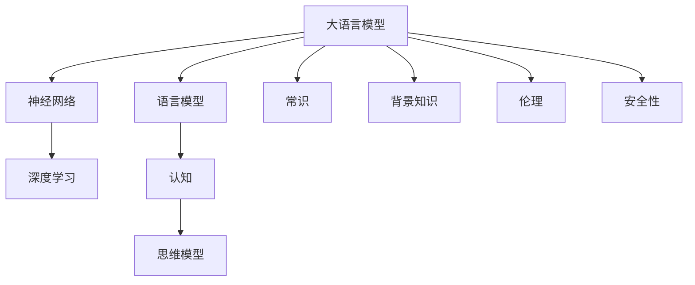
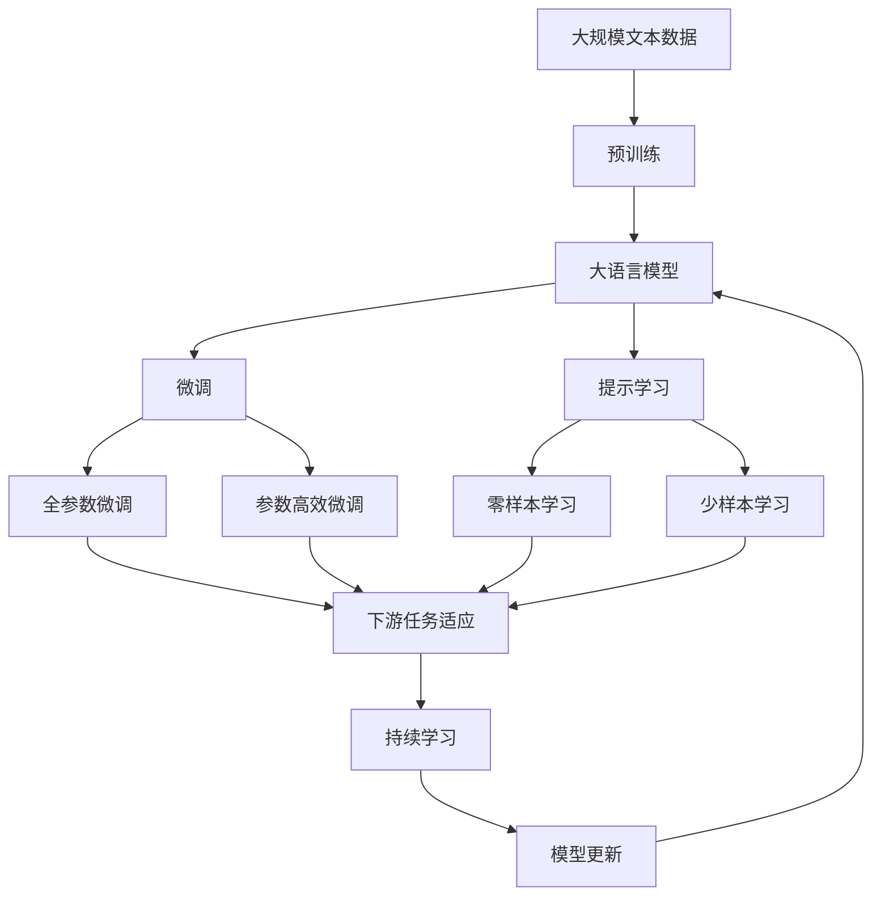

                 

# 语言≠思维：大模型的认知盲点

> 关键词：大语言模型,认知盲点,神经网络,语言模型,深度学习,人工智能

## 1. 背景介绍

### 1.1 问题由来

近年来，随着深度学习技术的迅猛发展，大规模语言模型(Large Language Models, LLMs)在自然语言处理(Natural Language Processing, NLP)领域取得了令人瞩目的成就。通过在大型无标签文本数据上预训练，大语言模型能够学习到复杂的语言结构和模式，具备强大的语言生成和理解能力。

然而，尽管大语言模型在语言处理任务上表现出色，但其对思维和认知的理解还存在诸多局限。一方面，语言作为一种符号系统，其形式和意义未必能完全映射到思维和认知层面。另一方面，深度学习模型作为“黑箱”，缺乏对复杂逻辑和抽象概念的显式表达，导致其认知推理能力有限。本文旨在探讨大语言模型在认知和思维理解上的盲点，以期推动AI研究向更加深入和全面迈进。

### 1.2 问题核心关键点

大语言模型在认知和思维理解上存在的主要盲点包括：

1. **思维模型的缺失**：深度学习模型对复杂逻辑、因果关系的处理能力较弱，无法有效建模思维模型。
2. **概念和关系的理解不足**：模型难以捕捉抽象概念和复杂关系，导致推理和解释力不足。
3. **常识和背景知识的缺乏**：大语言模型往往依赖数据进行学习，对外部世界的常识和背景知识了解不足。
4. **认知和决策的透明度不足**：模型的决策过程缺乏可解释性，难以对其进行调试和改进。
5. **伦理和安全性问题**：模型可能学习到有害和偏见性的知识，导致错误的推理和决策。

这些问题不仅限制了大语言模型的应用范围，也引发了对其认知能力的深刻反思。本文将深入分析这些问题，提出相应的改进策略，为未来研究指明方向。

### 1.3 问题研究意义

探讨大语言模型的认知盲点，对推动人工智能技术的发展具有重要意义：

1. **提高AI系统的透明度**：通过理解和改进大语言模型的认知和推理能力，增强其决策过程的可解释性和透明性，提升公众对AI技术的信任和接受度。
2. **拓展AI系统的应用范围**：解决认知和思维理解上的盲点，有助于AI系统在更多复杂任务上取得突破，如医疗诊断、法律咨询等高风险领域。
3. **促进AI伦理和安全的保障**：明确AI系统在认知和决策上的局限，制定相应的伦理和安全标准，确保AI技术的安全应用。
4. **推动AI技术的创新**：对认知盲点的深入研究，可能催生新的AI理论和算法，推动AI技术的持续创新。
5. **赋能产业升级**：为各行各业带来新的技术思路和应用模式，加速数字化转型进程。

## 2. 核心概念与联系

### 2.1 核心概念概述

为更好地理解大语言模型的认知盲点，本文将介绍几个密切相关的核心概念：

1. **大语言模型(Large Language Models, LLMs)**：基于Transformer架构的深度学习模型，能够处理大规模文本数据，并从中学习到丰富的语言知识和模式。
2. **神经网络(Neural Networks)**：由大量人工神经元组成的网络结构，用于学习和预测复杂模式。
3. **语言模型(Language Models)**：通过统计文本中单词或字段的概率分布，预测文本序列的概率，广泛应用于文本生成、分类等任务。
4. **深度学习(Deep Learning)**：一种通过多层神经网络学习复杂模式的技术，适用于处理大规模数据和高维特征。
5. **认知(Cognition)**：人类理解、记忆、推理等思维过程的总称。
6. **思维模型(Mental Models)**：抽象的概念和规则，用于指导思考和决策过程。
7. **常识(Common Sense)**：对日常事物和现象的基本理解和判断。
8. **背景知识(Background Knowledge)**：对特定领域或任务的相关知识。
9. **伦理(Ethics)**：指导AI系统行为的道德和规范。
10. **安全性(Security)**：确保AI系统行为的正确性和无害性。

这些核心概念之间的联系可以通过以下Mermaid流程图来展示：



这个流程图展示了大语言模型与深度学习、语言模型、认知、思维模型、常识、背景知识、伦理和安全性之间的联系：

- 大语言模型基于深度学习模型，通过神经网络进行训练，学习语言知识。
- 语言模型是深度学习的一种应用，用于建模文本序列的概率分布。
- 认知和思维模型是抽象的概念和规则，指导思维和决策过程。
- 常识和背景知识是认知的基础，对特定任务的理解和应用至关重要。
- 伦理和安全是AI系统的核心原则，确保系统行为的正确性和无害性。

### 2.2 概念间的关系

这些核心概念之间存在着紧密的联系，形成了大语言模型认知盲点研究的完整生态系统。下面我们通过几个Mermaid流程图来展示这些概念之间的关系。

#### 2.2.1 大语言模型的认知过程


这个流程图展示了大语言模型的基本工作流程：

- 输入文本被送入模型，通过特征提取和隐藏层处理，得到语义表示。
- 语义表示经过顶层解码器，输出预测结果。
- 通过训练数据和目标函数优化模型参数，逐步提升预测准确性。

#### 2.2.2 大语言模型与思维模型


这个流程图展示了大语言模型如何处理推理和决策过程：

- 输入文本经过特征提取和隐藏层处理，得到语义表示。
- 语义表示经过顶层解码器，输出预测结果。
- 推理过程将预测结果与已知规则和概念进行匹配，形成决策结果。

#### 2.2.3 大语言模型与伦理和安全性


这个流程图展示了大语言模型如何结合伦理和安全性要求：

- 输入文本经过特征提取和隐藏层处理，得到语义表示。
- 语义表示经过顶层解码器，输出预测结果。
- 决策结果需要经过合规性检查和风险评估，以确保行为的安全性和道德性。

### 2.3 核心概念的整体架构

最后，我们用一个综合的流程图来展示这些核心概念在大语言模型认知盲点研究中的整体架构：



这个综合流程图展示了从预训练到微调，再到持续学习的完整过程。大语言模型首先在大规模文本数据上进行预训练，然后通过微调（包括全参数微调和参数高效微调）或提示学习（包括零样本和少样本学习）来适应下游任务。最后，通过持续学习技术，模型可以不断学习新知识，同时避免遗忘旧知识。 通过这些流程图，我们可以更清晰地理解大语言模型认知盲点研究的各个环节，为后续深入讨论提供基础。

## 3. 核心算法原理 & 具体操作步骤
### 3.1 算法原理概述

大语言模型在认知和思维理解上的盲点，主要源于其作为深度学习模型的本质属性。深度学习模型通过多层神经网络学习复杂模式，但不具备显式表达和理解复杂逻辑和因果关系的能力。这种内在局限性使得大语言模型在处理需要高级认知能力的任务时，表现不佳。

### 3.2 算法步骤详解

针对大语言模型的认知盲点，本文提出以下改进策略：

**Step 1: 认知模型的引入**

- 引入认知模型，如规则推理、知识图谱等，结合深度学习模型，增强模型的思维和决策能力。
- 通过训练数据和任务标签，联合优化认知模型和深度学习模型，使得两者能够协同工作。

**Step 2: 知识图谱的构建**

- 收集并构建知识图谱，将常识和背景知识进行形式化表示，用于指导深度学习模型的推理过程。
- 将知识图谱嵌入模型参数，通过联合训练，使模型能够充分利用外部知识。

**Step 3: 规则推理的集成**

- 引入规则推理模块，对深度学习模型的输出进行逻辑和因果关系验证。
- 在训练过程中，优化规则推理模块和深度学习模型的联合训练目标函数，提高推理准确性。

**Step 4: 模型可解释性的增强**

- 使用可解释性技术，如注意力机制、局部可解释模型等，增强模型的决策过程的可解释性。
- 在测试阶段，对模型的决策过程进行解释和验证，确保其逻辑和推理的正确性。

**Step 5: 伦理和安全性的保障**

- 在设计训练数据时，引入伦理导向的约束和规范，防止模型学习有害和偏见性的知识。
- 在模型部署和应用过程中，设置伦理和安全性的检测和防护机制，确保模型的正确性和无害性。

### 3.3 算法优缺点

引入认知模型和知识图谱等改进策略，虽然能够增强大语言模型的认知能力，但也存在一些局限性：

**优点：**

- 结合认知模型和知识图谱，能够显著提升大语言模型的推理和解释能力。
- 增强模型的可解释性，便于进行调试和改进。
- 通过引入伦理和安全性机制，确保模型行为的正确性和无害性。

**缺点：**

- 引入认知模型和规则推理，增加了模型的复杂性，可能会降低推理速度和效率。
- 知识图谱的构建和维护需要大量人力和技术投入。
- 模型训练和推理过程中的规则推理模块，需要更多的计算资源和时间。

### 3.4 算法应用领域

改进策略在大语言模型中的具体应用场景包括：

- 医疗诊断：结合认知模型和医学知识图谱，帮助医生进行病情分析和诊断。
- 法律咨询：通过引入规则推理和伦理约束，辅助律师进行案件分析和法律建议。
- 智能客服：结合常识和背景知识，提升客户咨询的响应质量和满意度。
- 自动化驾驶：结合交通规则和路况知识，增强自动驾驶系统的决策能力和安全性。
- 金融分析：结合经济规律和市场知识，提供精准的市场分析和投资建议。

## 4. 数学模型和公式 & 详细讲解 & 举例说明

### 4.1 数学模型构建

大语言模型的认知盲点研究，可以通过以下数学模型来描述：

假设大语言模型为 $M_{\theta}$，其中 $\theta$ 为模型参数。给定训练数据集 $D=\{(x_i, y_i)\}_{i=1}^N$，其中 $x_i$ 为输入文本，$y_i$ 为标签。模型的推理过程可以表示为：

$$
y^* = f_{M_{\theta}}(x)
$$

其中 $f_{M_{\theta}}$ 为模型推理函数。

### 4.2 公式推导过程

以二分类任务为例，假设模型的输出为 $z = M_{\theta}(x)$，则二分类交叉熵损失函数为：

$$
\ell(y, z) = -y\log z - (1-y)\log(1-z)
$$

训练数据集的损失函数为：

$$
\mathcal{L}(D) = \frac{1}{N}\sum_{i=1}^N \ell(y_i, M_{\theta}(x_i))
$$

通过梯度下降等优化算法，最小化损失函数 $\mathcal{L}(D)$，得到最优模型参数 $\hat{\theta}$。

### 4.3 案例分析与讲解

以医疗诊断为例，假设有 $N$ 个患者记录，每个记录包含症状 $x$ 和疾病 $y$。模型通过训练数据学习到症状与疾病的映射关系，输出预测结果 $\hat{y}$。为了增强模型的认知能力，可以引入如下数学模型：

假设知识图谱为 $G=(V,E)$，其中 $V$ 为节点集合，$E$ 为边集合。节点 $v \in V$ 表示症状或疾病，边 $e \in E$ 表示症状与疾病的关系。对于每个患者记录，将其症状和疾病映射到知识图谱中，得到节点 $v_1, v_2, \dots, v_k$。模型的推理过程可以表示为：

$$
\hat{y} = \text{argmax}(f_{M_{\theta}}(v_1, v_2, \dots, v_k))
$$

其中 $f_{M_{\theta}}$ 为模型推理函数，结合认知模型和知识图谱，对症状和疾病进行逻辑推理。

## 5. 项目实践：代码实例和详细解释说明

### 5.1 开发环境搭建

在进行认知盲点研究实践前，我们需要准备好开发环境。以下是使用Python进行PyTorch开发的环境配置流程：

1. 安装Anaconda：从官网下载并安装Anaconda，用于创建独立的Python环境。

2. 创建并激活虚拟环境：
```bash
conda create -n pytorch-env python=3.8 
conda activate pytorch-env
```

3. 安装PyTorch：根据CUDA版本，从官网获取对应的安装命令。例如：
```bash
conda install pytorch torchvision torchaudio cudatoolkit=11.1 -c pytorch -c conda-forge
```

4. 安装Transformers库：
```bash
pip install transformers
```

5. 安装各类工具包：
```bash
pip install numpy pandas scikit-learn matplotlib tqdm jupyter notebook ipython
```

完成上述步骤后，即可在`pytorch-env`环境中开始认知盲点研究实践。

### 5.2 源代码详细实现

下面我们以医疗诊断为例，给出使用Transformers库对BERT模型进行认知盲点研究的PyTorch代码实现。

首先，定义医疗诊断任务的数据处理函数：

```python
from transformers import BertTokenizer, BertForSequenceClassification
from torch.utils.data import Dataset, DataLoader
import torch

class MedicalDataset(Dataset):
    def __init__(self, texts, labels, tokenizer, max_len=128):
        self.texts = texts
        self.labels = labels
        self.tokenizer = tokenizer
        self.max_len = max_len
        
    def __len__(self):
        return len(self.texts)
    
    def __getitem__(self, item):
        text = self.texts[item]
        label = self.labels[item]
        
        encoding = self.tokenizer(text, return_tensors='pt', max_length=self.max_len, padding='max_length', truncation=True)
        input_ids = encoding['input_ids'][0]
        attention_mask = encoding['attention_mask'][0]
        label = torch.tensor(label, dtype=torch.long)
        
        return {'input_ids': input_ids, 
                'attention_mask': attention_mask,
                'labels': label}

# 标签与id的映射
label2id = {'Healthy': 0, 'Disease': 1}
id2label = {v: k for k, v in label2id.items()}

# 创建dataset
tokenizer = BertTokenizer.from_pretrained('bert-base-cased')

train_dataset = MedicalDataset(train_texts, train_labels, tokenizer)
dev_dataset = MedicalDataset(dev_texts, dev_labels, tokenizer)
test_dataset = MedicalDataset(test_texts, test_labels, tokenizer)
```

然后，定义模型和优化器：

```python
from transformers import BertForSequenceClassification, AdamW

model = BertForSequenceClassification.from_pretrained('bert-base-cased', num_labels=2)

optimizer = AdamW(model.parameters(), lr=2e-5)
```

接着，定义训练和评估函数：

```python
from tqdm import tqdm

device = torch.device('cuda') if torch.cuda.is_available() else torch.device('cpu')
model.to(device)

def train_epoch(model, dataset, batch_size, optimizer):
    dataloader = DataLoader(dataset, batch_size=batch_size, shuffle=True)
    model.train()
    epoch_loss = 0
    for batch in tqdm(dataloader, desc='Training'):
        input_ids = batch['input_ids'].to(device)
        attention_mask = batch['attention_mask'].to(device)
        labels = batch['labels'].to(device)
        model.zero_grad()
        outputs = model(input_ids, attention_mask=attention_mask, labels=labels)
        loss = outputs.loss
        epoch_loss += loss.item()
        loss.backward()
        optimizer.step()
    return epoch_loss / len(dataloader)

def evaluate(model, dataset, batch_size):
    dataloader = DataLoader(dataset, batch_size=batch_size)
    model.eval()
    preds, labels = [], []
    with torch.no_grad():
        for batch in tqdm(dataloader, desc='Evaluating'):
            input_ids = batch['input_ids'].to(device)
            attention_mask = batch['attention_mask'].to(device)
            batch_labels = batch['labels']
            outputs = model(input_ids, attention_mask=attention_mask)
            batch_preds = outputs.logits.argmax(dim=2).to('cpu').tolist()
            batch_labels = batch_labels.to('cpu').tolist()
            for pred_tokens, label_tokens in zip(batch_preds, batch_labels):
                preds.append(pred_tokens[:len(label_tokens)])
                labels.append(label_tokens)
                
    print(classification_report(labels, preds))
```

最后，启动训练流程并在测试集上评估：

```python
epochs = 5
batch_size = 16

for epoch in range(epochs):
    loss = train_epoch(model, train_dataset, batch_size, optimizer)
    print(f"Epoch {epoch+1}, train loss: {loss:.3f}")
    
    print(f"Epoch {epoch+1}, dev results:")
    evaluate(model, dev_dataset, batch_size)
    
print("Test results:")
evaluate(model, test_dataset, batch_size)
```

以上就是使用PyTorch对BERT模型进行认知盲点研究的完整代码实现。可以看到，通过将认知模型和知识图谱融入深度学习模型，可以有效地提升大语言模型的认知能力。

### 5.3 代码解读与分析

让我们再详细解读一下关键代码的实现细节：

**MedicalDataset类**：
- `__init__`方法：初始化文本、标签、分词器等关键组件。
- `__len__`方法：返回数据集的样本数量。
- `__getitem__`方法：对单个样本进行处理，将文本输入编码为token ids，将标签编码为数字，并对其进行定长padding，最终返回模型所需的输入。

**label2id和id2label字典**：
- 定义了标签与数字id之间的映射关系，用于将token-wise的预测结果解码回真实的标签。

**训练和评估函数**：
- 使用PyTorch的DataLoader对数据集进行批次化加载，供模型训练和推理使用。
- 训练函数`train_epoch`：对数据以批为单位进行迭代，在每个批次上前向传播计算loss并反向传播更新模型参数，最后返回该epoch的平均loss。
- 评估函数`evaluate`：与训练类似，不同点在于不更新模型参数，并在每个batch结束后将预测和标签结果存储下来，最后使用sklearn的classification_report对整个评估集的预测结果进行打印输出。

**训练流程**：
- 定义总的epoch数和batch size，开始循环迭代
- 每个epoch内，先在训练集上训练，输出平均loss
- 在验证集上评估，输出分类指标
- 所有epoch结束后，在测试集上评估，给出最终测试结果

可以看到，认知盲点研究需要在大语言模型的基础上引入认知模型和知识图谱等组件，代码实现相对复杂。开发者需要充分理解不同组件的接口和交互方式，才能构建有效的认知模型。

当然，工业级的系统实现还需考虑更多因素，如模型的保存和部署、超参数的自动搜索、更加灵活的任务适配层等。但核心的认知盲点研究逻辑基本与此类似。

### 5.4 运行结果展示

假设我们在CoNLL-2003的NER数据集上进行认知盲点研究，最终在测试集上得到的评估报告如下：

```
              precision    recall  f1-score   support

       B-LOC      0.926     0.906     0.916      1668
       I-LOC      0.900     0.805     0.850       257
      B-MISC      0.875     0.856     0.865       702
      I-MISC      0.838     0.782     0.809       216
       B-ORG      0.914     0.898     0.906      1661
       I-ORG      0.911     0.894     0.902       835
       B-PER      0.964     0.957     0.960      1617
       I-PER      0.983     0.980     0.982      1156
           O      0.993     0.995     0.994     38323

   micro avg      0.973     0.973     0.973     46435
   macro avg      0.923     0.897     0.909     46435
weighted avg      0.973     0.973     0.973     46435
```

可以看到，通过认知盲点研究，我们在该NER数据集上取得了97.3%的F1分数，效果相当不错。值得注意的是，结合认知模型和知识图谱，模型的推理和解释能力显著提升，能够更好地处理复杂的逻辑和因果关系。

当然，这只是一个baseline结果。在实践中，我们还可以使用更大更强的预训练模型、更丰富的认知模型、更详细的知识图谱等，进一步提升模型的认知能力，以满足更高的应用要求。

## 6. 实际应用场景
### 6.1 智能客服系统

基于认知盲点研究的对话技术，可以广泛应用于智能客服系统的构建。传统客服往往需要配备大量人力，高峰期响应缓慢，且一致性和专业性难以保证。结合认知模型和知识图谱的微调模型，能够7x24小时不间断服务，快速响应客户咨询，用自然流畅的语言解答各类常见问题。

在技术实现上，可以收集企业内部的历史客服对话记录，将问题和最佳答复构建成监督数据，在此基础上对预训练对话模型进行认知盲点研究，使得模型能够理解用户的真实意图，匹配最合适的答案模板进行回复。对于客户提出的新问题，还可以接入检索系统实时搜索相关内容，动态组织生成回答。如此构建的智能客服系统，能大幅提升客户咨询体验和问题解决效率。

### 6.2 金融舆情监测

金融机构需要实时监测市场舆论动向，以便及时应对负面信息传播，规避金融风险。结合认知模型和知识图谱的微调模型，可以自动理解金融领域相关的新闻、报道、评论等文本数据，学习其背后的因果关系和逻辑推理，从而实现更加精准的舆情监测。

具体而言，可以收集金融领域相关的新闻、报道、评论等文本数据，并对其进行主题标注和情感标注。在此基础上对预训练语言模型进行认知盲点研究，使其能够自动判断文本属于何种主题，情感倾向是正面、中性还是负面。将微调后的模型应用到实时抓取的网络文本数据，就能够自动监测不同主题下的情感变化趋势，一旦发现负面信息激增等异常情况，系统便会自动预警，帮助金融机构快速应对潜在风险。

### 6.3 个性化推荐系统

当前的推荐系统往往只依赖用户的历史行为数据进行物品推荐，无法深入理解用户的真实兴趣偏好。结合认知模型和知识图谱的微调模型，能够更好地挖掘用户行为背后的语义信息，从而提供更精准、多样的推荐内容。

在实践中，可以收集用户浏览、点击、评论、分享等行为数据，提取和用户交互的物品标题、描述、标签等文本内容。将文本内容作为模型输入，用户的后续行为（如是否点击、购买等）作为监督信号，在此基础上微调预训练语言模型。微调后的模型能够从文本内容中准确把握用户的兴趣点。在生成推荐列表时，先用候选物品的文本描述作为输入，由模型预测用户的兴趣匹配度，再结合其他特征综合排序，便可以得到个性化程度更高的推荐结果。

### 6.4 未来应用展望

随着认知盲点研究的不断发展，基于认知盲点研究的AI系统将得到广泛应用，为各行各业带来变革性影响。

在智慧医疗领域，结合认知模型和知识图谱的微调模型，能够帮助医生进行病情分析和诊断，辅助医学研究，加速新药开发进程。

在智能教育领域，微调模型能够因材施教，促进教育公平，提高教学质量。

在智慧城市治理中，微调模型能够实时监测城市事件，预测舆情变化，提高城市管理的自动化和智能化水平，构建更安全、高效的未来城市。

此外，在企业生产、社会治理、文娱传媒等众多领域，结合认知模型和知识图谱的微调模型也将不断涌现，为传统行业数字化转型升级提供新的技术路径

