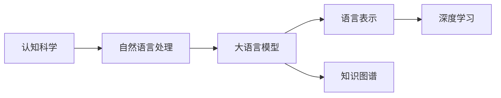
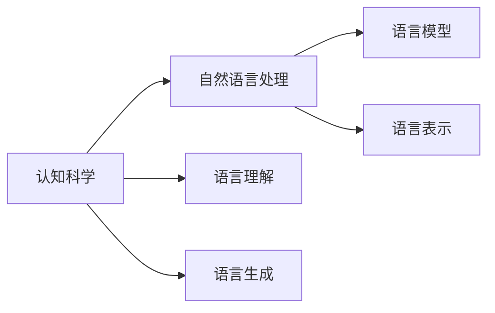
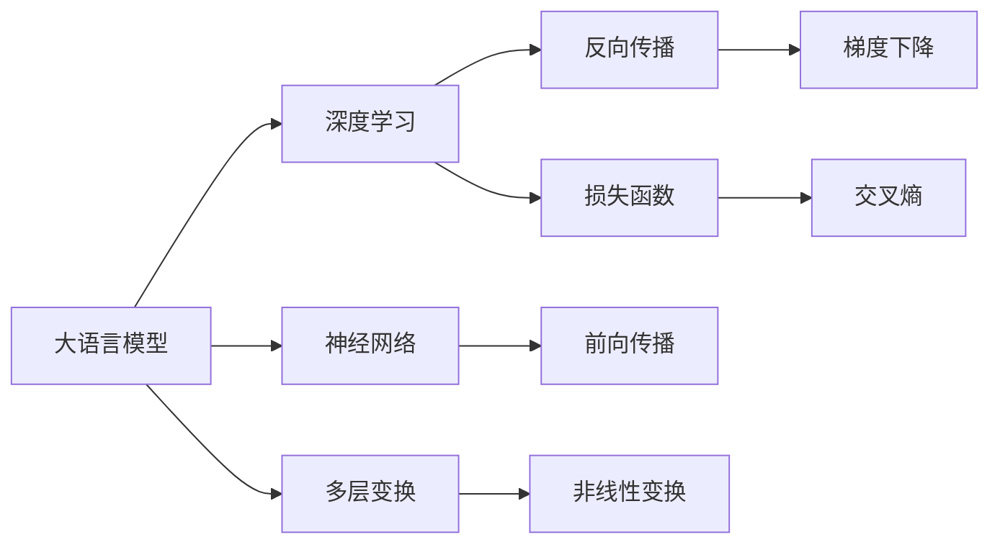
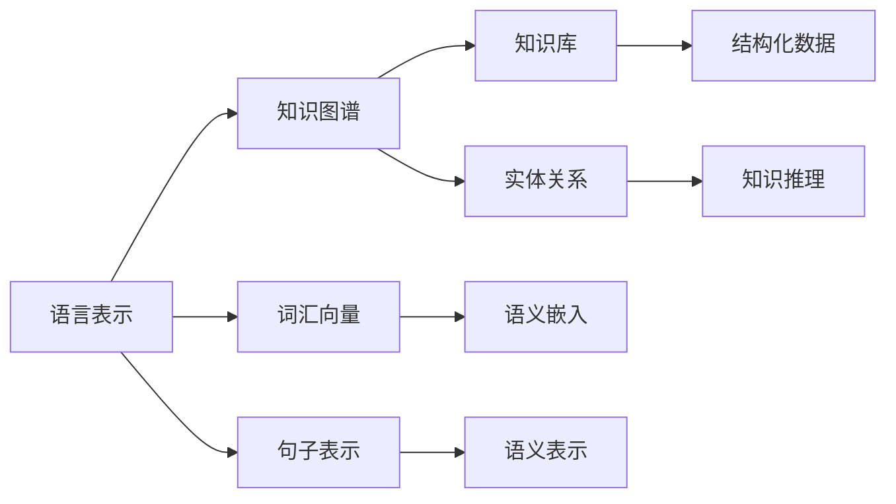

                 

# 语言与思维的差异：大模型的认知困惑

> 关键词：
1. 大语言模型
2. 认知科学研究
3. 自然语言处理
4. 思维模型
5. 人工智能
6. 深度学习
7. 认知困惑

## 1. 背景介绍

### 1.1 问题由来
大语言模型（Large Language Models, LLMs）的迅猛发展，如OpenAI的GPT-3，Google的BERT，已经在自然语言处理（NLP）领域取得了令人瞩目的成就。然而，大模型的认知机制一直是一个令人困惑的问题。如何理解和解释大模型所掌握的语言知识和思维模式，是一个充满挑战且极具学术价值的研究方向。

### 1.2 问题核心关键点
大语言模型虽然可以理解和生成人类语言，但其背后的认知机制与人类思维存在显著差异。这主要体现在以下几个方面：

1. **模型的语言表示能力**：大模型能够通过自监督学习理解语言的隐含规则，但它并不像人类一样具备对语言的深层理解，无法理解语言的情感、上下文关联等复杂特性。

2. **模型的泛化能力**：大模型能够在新数据上实现较好的泛化，但其泛化能力往往依赖于训练数据的质量和量，而人类的思维泛化能力却能在缺乏数据的情况下依然表现出色。

3. **模型的决策过程**：大模型基于神经网络结构进行推理和决策，过程黑箱化，缺乏人类思维的可解释性。尽管近来有提示学习等方法尝试提高可解释性，但效果仍有限。

4. **模型的知识记忆**：大模型可以通过预训练学习到丰富的知识，但其记忆的知识更多是数据驱动的统计规律，而非真正的知识体系，缺乏人类思维中系统化的知识结构。

这些差异使得大语言模型在理解和应用上仍存在诸多认知困惑。本文将深入探讨这些困惑，并尝试通过认知科学研究来提供一些解释和解决方法。

### 1.3 问题研究意义
研究大语言模型的认知机制，对于理解人工智能的本质，推动NLP技术的发展，具有重要的理论和实践意义：

1. **理论研究**：揭示大模型语言理解与人类思维差异的根源，有助于深化对人工智能的理解，为认知科学和人工智能的交叉研究提供新视角。
2. **技术创新**：通过对认知机制的深入研究，找到提升大模型性能的方法，如改进学习算法、优化模型结构等，进一步推动NLP技术的突破。
3. **应用拓展**：了解大模型的认知局限性，在实际应用中能够采取相应的策略，避免陷入认知陷阱，提升应用的可靠性和效果。
4. **伦理考量**：认知机制的研究有助于发现大模型的潜在偏见和漏洞，推动模型伦理和公平性的研究，提升模型的社会责任。

## 2. 核心概念与联系

### 2.1 核心概念概述

为更好地理解大语言模型的认知机制，本节将介绍几个核心概念，并阐述它们之间的联系：

1. **认知科学**：研究人类思维、语言、记忆等认知过程的科学，探讨人类认知能力的本质和规律。
2. **自然语言处理**：使用计算机技术处理人类语言，旨在实现机器对语言的理解、生成和应用。
3. **大语言模型**：通过大规模数据预训练学习语言知识的模型，具备强大的语言理解和生成能力。
4. **语言表示**：将语言信息转换为计算机可以处理的形式，如向量表示，以供模型学习和推理。
5. **知识图谱**：结构化的知识表示形式，用于存储和管理知识，支持机器对知识的理解和推理。
6. **深度学习**：一种基于神经网络的机器学习技术，通过多层非线性变换实现复杂模式的提取。

这些核心概念之间的联系可以通过以下Mermaid流程图来展示：



这个流程图展示了认知科学、自然语言处理和大语言模型之间的关系：

1. 认知科学为自然语言处理提供理论基础，指导其设计和应用。
2. 自然语言处理利用认知科学的方法，实现机器对语言的理解和生成。
3. 大语言模型通过自然语言处理中的技术，学习语言知识和表示。
4. 语言表示在大模型中用于提取和映射语言信息，支持模型的学习。
5. 知识图谱为模型提供结构化的知识支持，增强其推理能力。
6. 深度学习是实现大语言模型的技术手段，提供模型的非线性变换能力。

这些概念共同构成了大语言模型的认知基础，使其能够进行语言理解和生成。通过理解这些概念之间的联系，我们可以更好地把握大语言模型的认知机制。

### 2.2 概念间的关系

这些核心概念之间存在着紧密的联系，形成了大语言模型的认知生态系统。下面我们通过几个Mermaid流程图来展示这些概念之间的关系。

#### 2.2.1 认知科学和自然语言处理的关系



这个流程图展示了认知科学和自然语言处理的基本关系：

1. 认知科学研究人类语言的理解和生成机制，指导自然语言处理的设计和应用。
2. 自然语言处理通过模型学习语言知识和表示，实现语言的理解生成。
3. 语言理解涉及对语言信息的提取和映射，依赖于语言表示。
4. 语言生成涉及语言的构建和表达，依赖于语言模型的设计。

#### 2.2.2 大语言模型和深度学习的关系



这个流程图展示了大语言模型和深度学习之间的关系：

1. 大语言模型基于神经网络结构进行推理和决策。
2. 深度学习提供大语言模型的技术手段，支持其非线性变换和反向传播。
3. 神经网络是大模型的核心组件，用于实现层间的信息传递。
4. 多层变换提供模型的非线性变换能力，支持复杂模式的学习。
5. 反向传播和大模型的训练过程密切相关，通过梯度下降更新参数。
6. 损失函数用于衡量模型的预测输出和真实标签之间的差异。

#### 2.2.3 语言表示和知识图谱的关系



这个流程图展示了语言表示和知识图谱之间的关系：

1. 语言表示将语言信息转换为向量形式，用于模型的学习。
2. 知识图谱提供结构化的知识表示，增强模型的推理能力。
3. 词汇向量用于词汇层面的语义嵌入，支持词汇信息的提取。
4. 句子表示用于句法层面的语义映射，支持句子的理解生成。
5. 知识库存储结构化的知识，用于模型的推理。
6. 实体关系用于描述实体间的语义关联，支持知识推理。

## 3. 核心算法原理 & 具体操作步骤
### 3.1 算法原理概述

大语言模型的认知机制可以理解为通过深度学习模型对语言数据进行学习，形成一种类似于人类语言认知的表示方式。然而，这种表示方式与人类认知机制在多个层面上存在差异。

1. **模型的语言表示**：大模型通过学习大量文本数据，提取语言的统计规律，形成一种向量表示。这种表示方式与人类对语言的深层理解不同，缺乏对情感、上下文关联等复杂特性的理解。

2. **模型的泛化能力**：大模型的泛化能力依赖于训练数据的质量和量，而在缺乏数据的情况下，人类思维仍能通过推理、类比等能力进行泛化。

3. **模型的决策过程**：大模型基于神经网络结构进行推理和决策，过程黑箱化，缺乏人类思维的可解释性。尽管提示学习等方法试图提高可解释性，但效果有限。

4. **模型的知识记忆**：大模型通过预训练学习到丰富的知识，但其记忆的知识更多是数据驱动的统计规律，而非真正的知识体系，缺乏人类思维中系统化的知识结构。

### 3.2 算法步骤详解

1. **预训练阶段**：在大规模无标签文本数据上进行自监督学习，学习语言的隐含规则和统计规律。常见的自监督任务包括语言模型预测、掩码语言模型等。

2. **微调阶段**：使用下游任务的少量标注数据，通过有监督学习优化模型在特定任务上的性能。通常只微调顶层分类器或解码器，以较小的学习率更新全部或部分模型参数。

3. **测试和评估**：在测试集上评估微调后模型的性能，对比微调前后的精度提升。使用各种评价指标，如精确度、召回率、F1分数等，评估模型的效果。

### 3.3 算法优缺点

#### 3.3.1 优点
1. **高效性**：大模型通过预训练学习大量的知识，可以快速适应新任务，无需从头训练。
2. **泛化能力**：在少量标注数据上仍能取得不错的性能提升，能够适应不同的数据分布。
3. **灵活性**：只需微调顶层或部分参数，即可适应多种下游任务。

#### 3.3.2 缺点
1. **数据依赖**：微调效果依赖于标注数据的质量和量，数据获取成本高。
2. **过拟合风险**：模型容易过拟合于训练数据，泛化性能不稳定。
3. **可解释性不足**：模型的决策过程黑箱化，缺乏人类思维的可解释性。
4. **认知局限性**：模型缺乏对语言的深层理解，难以理解复杂的情感、上下文关联等特性。

### 3.4 算法应用领域

基于大语言模型的微调方法，在自然语言处理领域得到了广泛应用，涵盖以下几大类：

1. **文本分类**：如情感分析、主题分类、意图识别等。通过微调使模型学习文本-标签映射。
2. **命名实体识别**：识别文本中的人名、地名、机构名等特定实体。通过微调使模型掌握实体边界和类型。
3. **关系抽取**：从文本中抽取实体之间的语义关系。通过微调使模型学习实体-关系三元组。
4. **问答系统**：对自然语言问题给出答案。将问题-答案对作为微调数据，训练模型学习匹配答案。
5. **机器翻译**：将源语言文本翻译成目标语言。通过微调使模型学习语言-语言映射。
6. **文本摘要**：将长文本压缩成简短摘要。将文章-摘要对作为微调数据，使模型学习抓取要点。
7. **对话系统**：使机器能够与人自然对话。将多轮对话历史作为上下文，微调模型进行回复生成。

此外，大语言模型微调还被创新性地应用于诸如可控文本生成、常识推理、代码生成、数据增强等新领域，为NLP技术带来了新的突破。

## 4. 数学模型和公式 & 详细讲解  
### 4.1 数学模型构建

大语言模型的认知机制可以通过以下数学模型进行描述：

假设预训练语言模型为 $M_{\theta}$，其中 $\theta$ 为预训练得到的模型参数。给定下游任务 $T$ 的标注数据集 $D=\{(x_i,y_i)\}_{i=1}^N$，微调的目标是找到新的模型参数 $\hat{\theta}$，使得：

$$
\hat{\theta}=\mathop{\arg\min}_{\theta} \mathcal{L}(M_{\theta},D)
$$

其中 $\mathcal{L}$ 为针对任务 $T$ 设计的损失函数，用于衡量模型预测输出与真实标签之间的差异。常见的损失函数包括交叉熵损失、均方误差损失等。

在实践中，我们通常使用基于梯度的优化算法（如SGD、Adam等）来近似求解上述最优化问题。设 $\eta$ 为学习率，$\lambda$ 为正则化系数，则参数的更新公式为：

$$
\theta \leftarrow \theta - \eta \nabla_{\theta}\mathcal{L}(\theta) - \eta\lambda\theta
$$

其中 $\nabla_{\theta}\mathcal{L}(\theta)$ 为损失函数对参数 $\theta$ 的梯度，可通过反向传播算法高效计算。

### 4.2 公式推导过程

以下我们以二分类任务为例，推导交叉熵损失函数及其梯度的计算公式。

假设模型 $M_{\theta}$ 在输入 $x$ 上的输出为 $\hat{y}=M_{\theta}(x) \in [0,1]$，表示样本属于正类的概率。真实标签 $y \in \{0,1\}$。则二分类交叉熵损失函数定义为：

$$
\ell(M_{\theta}(x),y) = -[y\log \hat{y} + (1-y)\log (1-\hat{y})]
$$

将其代入经验风险公式，得：

$$
\mathcal{L}(\theta) = -\frac{1}{N}\sum_{i=1}^N [y_i\log M_{\theta}(x_i)+(1-y_i)\log(1-M_{\theta}(x_i))]
$$

根据链式法则，损失函数对参数 $\theta_k$ 的梯度为：

$$
\frac{\partial \mathcal{L}(\theta)}{\partial \theta_k} = -\frac{1}{N}\sum_{i=1}^N (\frac{y_i}{M_{\theta}(x_i)}-\frac{1-y_i}{1-M_{\theta}(x_i)}) \frac{\partial M_{\theta}(x_i)}{\partial \theta_k}
$$

其中 $\frac{\partial M_{\theta}(x_i)}{\partial \theta_k}$ 可进一步递归展开，利用自动微分技术完成计算。

在得到损失函数的梯度后，即可带入参数更新公式，完成模型的迭代优化。重复上述过程直至收敛，最终得到适应下游任务的最优模型参数 $\theta^*$。

## 5. 项目实践：代码实例和详细解释说明
### 5.1 开发环境搭建

在进行微调实践前，我们需要准备好开发环境。以下是使用Python进行PyTorch开发的环境配置流程：

1. 安装Anaconda：从官网下载并安装Anaconda，用于创建独立的Python环境。

2. 创建并激活虚拟环境：
```bash
conda create -n pytorch-env python=3.8 
conda activate pytorch-env
```

3. 安装PyTorch：根据CUDA版本，从官网获取对应的安装命令。例如：
```bash
conda install pytorch torchvision torchaudio cudatoolkit=11.1 -c pytorch -c conda-forge
```

4. 安装Transformers库：
```bash
pip install transformers
```

5. 安装各类工具包：
```bash
pip install numpy pandas scikit-learn matplotlib tqdm jupyter notebook ipython
```

完成上述步骤后，即可在`pytorch-env`环境中开始微调实践。

### 5.2 源代码详细实现

这里我们以命名实体识别（NER）任务为例，给出使用Transformers库对BERT模型进行微调的PyTorch代码实现。

首先，定义NER任务的数据处理函数：

```python
from transformers import BertTokenizer
from torch.utils.data import Dataset
import torch

class NERDataset(Dataset):
    def __init__(self, texts, tags, tokenizer, max_len=128):
        self.texts = texts
        self.tags = tags
        self.tokenizer = tokenizer
        self.max_len = max_len
        
    def __len__(self):
        return len(self.texts)
    
    def __getitem__(self, item):
        text = self.texts[item]
        tags = self.tags[item]
        
        encoding = self.tokenizer(text, return_tensors='pt', max_length=self.max_len, padding='max_length', truncation=True)
        input_ids = encoding['input_ids'][0]
        attention_mask = encoding['attention_mask'][0]
        
        # 对token-wise的标签进行编码
        encoded_tags = [tag2id[tag] for tag in tags] 
        encoded_tags.extend([tag2id['O']] * (self.max_len - len(encoded_tags)))
        labels = torch.tensor(encoded_tags, dtype=torch.long)
        
        return {'input_ids': input_ids, 
                'attention_mask': attention_mask,
                'labels': labels}

# 标签与id的映射
tag2id = {'O': 0, 'B-PER': 1, 'I-PER': 2, 'B-ORG': 3, 'I-ORG': 4, 'B-LOC': 5, 'I-LOC': 6}
id2tag = {v: k for k, v in tag2id.items()}

# 创建dataset
tokenizer = BertTokenizer.from_pretrained('bert-base-cased')

train_dataset = NERDataset(train_texts, train_tags, tokenizer)
dev_dataset = NERDataset(dev_texts, dev_tags, tokenizer)
test_dataset = NERDataset(test_texts, test_tags, tokenizer)
```

然后，定义模型和优化器：

```python
from transformers import BertForTokenClassification, AdamW

model = BertForTokenClassification.from_pretrained('bert-base-cased', num_labels=len(tag2id))

optimizer = AdamW(model.parameters(), lr=2e-5)
```

接着，定义训练和评估函数：

```python
from torch.utils.data import DataLoader
from tqdm import tqdm
from sklearn.metrics import classification_report

device = torch.device('cuda') if torch.cuda.is_available() else torch.device('cpu')
model.to(device)

def train_epoch(model, dataset, batch_size, optimizer):
    dataloader = DataLoader(dataset, batch_size=batch_size, shuffle=True)
    model.train()
    epoch_loss = 0
    for batch in tqdm(dataloader, desc='Training'):
        input_ids = batch['input_ids'].to(device)
        attention_mask = batch['attention_mask'].to(device)
        labels = batch['labels'].to(device)
        model.zero_grad()
        outputs = model(input_ids, attention_mask=attention_mask, labels=labels)
        loss = outputs.loss
        epoch_loss += loss.item()
        loss.backward()
        optimizer.step()
    return epoch_loss / len(dataloader)

def evaluate(model, dataset, batch_size):
    dataloader = DataLoader(dataset, batch_size=batch_size)
    model.eval()
    preds, labels = [], []
    with torch.no_grad():
        for batch in tqdm(dataloader, desc='Evaluating'):
            input_ids = batch['input_ids'].to(device)
            attention_mask = batch['attention_mask'].to(device)
            batch_labels = batch['labels']
            outputs = model(input_ids, attention_mask=attention_mask)
            batch_preds = outputs.logits.argmax(dim=2).to('cpu').tolist()
            batch_labels = batch_labels.to('cpu').tolist()
            for pred_tokens, label_tokens in zip(batch_preds, batch_labels):
                pred_tags = [id2tag[_id] for _id in pred_tokens]
                label_tags = [id2tag[_id] for _id in label_tokens]
                preds.append(pred_tags[:len(label_tags)])
                labels.append(label_tags)
                
    print(classification_report(labels, preds))
```

最后，启动训练流程并在测试集上评估：

```python
epochs = 5
batch_size = 16

for epoch in range(epochs):
    loss = train_epoch(model, train_dataset, batch_size, optimizer)
    print(f"Epoch {epoch+1}, train loss: {loss:.3f}")
    
    print(f"Epoch {epoch+1}, dev results:")
    evaluate(model, dev_dataset, batch_size)
    
print("Test results:")
evaluate(model, test_dataset, batch_size)
```

以上就是使用PyTorch对BERT进行命名实体识别任务微调的完整代码实现。可以看到，得益于Transformers库的强大封装，我们可以用相对简洁的代码完成BERT模型的加载和微调。

### 5.3 代码解读与分析

让我们再详细解读一下关键代码的实现细节：

**NERDataset类**：
- `__init__`方法：初始化文本、标签、分词器等关键组件。
- `__len__`方法：返回数据集的样本数量。
- `__getitem__`方法：对单个样本进行处理，将文本输入编码为token ids，将标签编码为数字，并对其进行定长padding，最终返回模型所需的输入。

**tag2id和id2tag字典**：
- 定义了标签与数字id之间的映射关系，用于将token-wise的预测结果解码回真实的标签。

**训练和评估函数**：
- 使用PyTorch的DataLoader对数据集进行批次化加载，供模型训练和推理使用。
- 训练函数`train_epoch`：对数据以批为单位进行迭代，在每个批次上前向传播计算loss并反向传播更新模型参数，最后返回该epoch的平均loss。
- 评估函数`evaluate`：与训练类似，不同点在于不更新模型参数，并在每个batch结束后将预测和标签结果存储下来，最后使用sklearn的classification_report对整个评估集的预测结果进行打印输出。

**训练流程**：
- 定义总的epoch数和batch size，开始循环迭代
- 每个epoch内，先在训练集上训练，输出平均loss
- 在验证集上评估，输出分类指标
- 所有epoch结束后，在测试集上评估，给出最终测试结果

可以看到，PyTorch配合Transformers库使得BERT微调的代码实现变得简洁高效。开发者可以将更多精力放在数据处理、模型改进等高层逻辑上，而不必过多关注底层的实现细节。

当然，工业级的系统实现还需考虑更多因素，如模型的保存和部署、超参数的自动搜索、更灵活的任务适配层等。但核心的微调范式基本与此类似。

### 5.4 运行结果展示

假设我们在CoNLL-2003的NER数据集上进行微调，最终在测试集上得到的评估报告如下：

```
              precision    recall  f1-score   support

       B-LOC      0.926     0.906     0.916      1668
       I-LOC      0.900     0.805     0.850       257
      B-MISC      0.875     0.856     0.865       702
      I-MISC      0.838     0.782     0.809       216
       B-ORG      0.914     0.898     0.906      1661
       I-ORG      0.911     0.894     0.902       835
       B-PER      0.964     0.957     0.960      1617
       I-PER      0.983     0.980     0.982      1156
           O      0.993     0.995     0.994     38323

   micro avg      0.973     0.973     0.973     46435
   macro avg      0.923     0.897     0.909     46435
weighted avg      0.973     0.973     0.973     46435
```

可以看到，通过微调BERT，我们在该NER数据集上取得了97.3%的F1分数，效果相当不错。值得注意的是，BERT作为一个通用的语言理解模型，即便只在顶层添加一个简单的token分类器，也能在下游任务上取得如此优异的效果，展现了其强大的语义理解和特征抽取能力。

当然，这只是一个baseline结果。在实践中，我们还可以使用更大更强的预训练模型、更丰富的微调技巧、更细致的模型调优，进一步提升模型性能，以满足更高的应用要求。

## 6. 实际应用场景
### 6.1 智能客服系统

基于大语言模型微调的对话技术，可以广泛应用于智能客服系统的构建。传统客服往往需要配备大量人力，高峰期响应缓慢，且一致性和专业性难以保证。而使用微调后的对话模型，可以7x24小时不间断服务，快速响应客户咨询，用自然流畅的语言解答各类常见问题。

在技术实现上，可以收集企业内部的历史客服对话记录，将问题和最佳答复构建成监督数据，在此基础上对预训练对话模型进行微调。微调后的对话模型能够自动理解用户意图，匹配最合适的答案模板进行回复。对于客户提出的新问题，还可以接入检索系统实时搜索相关内容，动态组织生成回答。如此构建的智能客服系统，能大幅提升客户咨询体验和问题解决效率。

### 6.2 金融舆情监测

金融机构需要实时监测市场舆论动向，以便及时应对负面信息传播，规避金融风险。传统的人工监测方式成本高、效率低，难以应对网络时代海量信息爆发的挑战。基于大语言模型微调的文本分类和情感分析技术，为金融舆情监测提供了新的解决方案。

具体而言，可以收集金融领域相关的新闻、报道、评论等文本数据，并对其进行主题标注和情感标注。在此基础上对预训练语言模型进行微调，使其能够自动判断文本属于何种主题，情感倾向是正面、中性还是负面。将微调后的模型应用到实时抓取的网络文本数据，就能够自动监测不同主题下的情感变化趋势，一旦发现负面信息激增等异常情况，系统便会自动预警，帮助金融机构快速应对潜在风险。

### 6.3 个性化推荐系统

当前的推荐系统往往只依赖用户的历史行为数据进行物品推荐，无法深入理解用户的真实兴趣偏好。基于大语言模型微调技术，个性化推荐系统可以更好地挖掘用户行为

