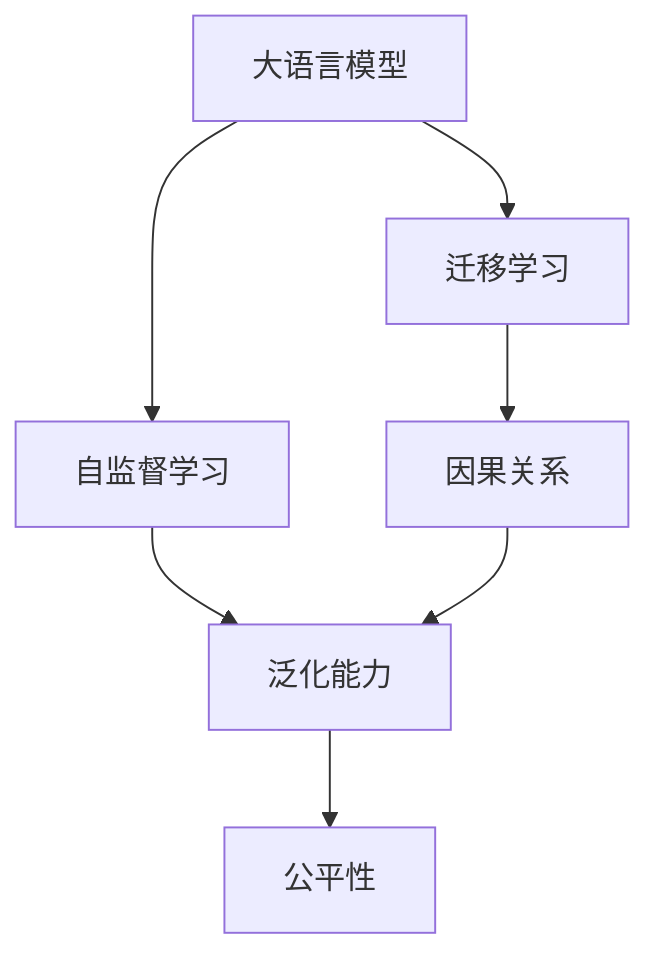

                 

## 1. 背景介绍

语言和思维是人类最根本的交流方式。大语言模型（Large Language Models, LLMs）作为当下最前沿的人工智能技术，在处理自然语言方面展现出了前所未有的能力。它们不仅能理解并生成人类语言，还能通过大量数据进行自我学习和优化，呈现出极为丰富的语言表达能力。然而，随着大模型技术的发展，其在语言和思维处理上的局限性也开始逐渐显现，引人深思。

### 1.1 问题由来

大语言模型在自然语言处理（NLP）领域取得显著成果的同时，也面临着诸多挑战。这些挑战主要集中在模型的理解深度、泛化能力、偏见与公平性、以及与人类思维的差异等方面。这些问题使得人们对大模型的能力与实际应用产生了一定的困惑，从而引发了深入的学术讨论和探讨。

### 1.2 问题核心关键点

在实际应用中，大语言模型主要面临以下几个核心问题：

- **理解深度**：尽管大模型能够生成自然流畅的语言，但它们是否真正理解了语言的深层含义，如何保证模型的推理和生成具有合理的因果关系？
- **泛化能力**：大模型在处理未知数据时，能否保持一致的性能水平？是否存在模型过拟合训练数据的情况？
- **偏见与公平性**：模型在训练过程中是否会学习到数据中的偏见？如何确保模型在公平性方面的表现？
- **与人类思维的差异**：大模型的生成与理解能力是否与人类相同？它们是否具备人类的逻辑推理和创造力？

这些问题不仅关乎大模型自身的性能，还直接影响其应用领域的安全性和可靠性。因此，深入研究这些问题对于推动大语言模型技术的发展具有重要意义。

### 1.3 问题研究意义

研究大语言模型在语言和思维处理上的局限性，不仅有助于理解当前技术的边界，还能为未来的研究和应用提供指导。通过深入探讨这些问题，可以：

- **提升模型的可靠性和可信度**：确保大模型在实际应用中具有稳定的表现，避免误导性的输出。
- **优化模型的训练和应用**：通过改进算法和数据处理，提高模型的泛化能力和公平性，减少偏见。
- **推动技术的社会应用**：使大模型技术更好地服务于社会，提升人工智能在医疗、教育、司法等重要领域的应用效果。
- **激发学术研究的新方向**：探讨大语言模型在语言和思维处理上的局限性，可以激发更多关于认知计算、人工智能伦理等方面的研究。

## 2. 核心概念与联系

### 2.1 核心概念概述

为了更好地理解大语言模型在语言和思维处理上的局限性，我们需要先明确一些核心概念：

- **大语言模型（Large Language Models, LLMs）**：通过大量无标签数据进行自监督预训练，学习到丰富的语言知识和表示能力。常见的模型包括GPT系列、BERT等。
- **自监督学习（Self-Supervised Learning）**：利用未标注数据进行模型训练，使模型学习到语言的深层结构和表示。
- **迁移学习（Transfer Learning）**：将在大规模数据集上预训练的模型应用于特定任务，利用已学习的知识提升模型性能。
- **因果关系（Causal Relationship）**：描述事件之间因果关系的概念，即一个事件的发生是否直接导致另一个事件的发生。
- **泛化能力（Generalization）**：模型在未见过的数据上的表现能力，即模型是否能从已有数据中学习到通用的知识，适用于新的数据。
- **公平性（Fairness）**：模型在处理不同群体数据时，是否存在系统性的偏见或不公平现象。

这些概念通过相互联系，构成了大语言模型在语言和思维处理上的基本框架。理解这些概念有助于我们更全面地探讨大模型的局限性。

### 2.2 概念间的关系

这些核心概念之间的关系可以通过以下Mermaid流程图来展示：



这个流程图展示了核心概念之间的联系：

- **大语言模型**：通过自监督学习在大规模数据集上进行预训练，学习到泛化的语言知识和表示能力。
- **迁移学习**：利用大语言模型的泛化能力，通过微调应用于特定任务，提升模型在该任务上的性能。
- **因果关系**：在大语言模型的推理和生成过程中，需要建立正确的因果关系，确保模型输出的合理性和逻辑性。
- **泛化能力**：大语言模型需要具备良好的泛化能力，能够在新的数据上表现稳定。
- **公平性**：大语言模型在处理不同群体的数据时，需要避免系统性的偏见，确保模型公平性。

这些概念共同构成了大语言模型在语言和思维处理上的基本框架，有助于我们理解其局限性。

## 3. 核心算法原理 & 具体操作步骤
### 3.1 算法原理概述

大语言模型在处理自然语言时，其核心算法原理主要基于自监督学习和迁移学习。自监督学习通过无标签数据训练模型，使其学习到通用的语言表示和知识。迁移学习则在大模型的基础上，通过微调应用于特定任务，提升模型在该任务上的表现。

### 3.2 算法步骤详解

大语言模型在语言和思维处理上的具体操作步骤包括：

1. **预训练**：在大型无标签数据集上，使用自监督学习任务（如语言建模、掩码语言模型等）训练模型。
2. **微调**：在特定任务的数据集上，通过迁移学习进行微调，调整模型参数以适应任务需求。
3. **评估**：在验证集和测试集上评估模型性能，确保模型泛化能力。
4. **优化**：根据评估结果，对模型进行优化，调整超参数和训练策略，提高模型效果。

### 3.3 算法优缺点

大语言模型在语言和思维处理上的算法具有以下优点：

- **效率高**：利用大模型在海量数据上进行预训练，可以显著提高模型的泛化能力和性能。
- **适用范围广**：通过迁移学习，大模型可以应用于多种自然语言处理任务，如分类、匹配、生成等。
- **灵活性高**：利用微调技术，可以针对特定任务进行优化，提高模型性能。

同时，这些算法也存在一些缺点：

- **数据依赖**：大语言模型的性能高度依赖于预训练数据的质量和数量，获取高质量数据成本较高。
- **泛化能力有限**：模型在处理未见过的数据时，泛化能力可能受限，存在过拟合风险。
- **偏见问题**：预训练数据可能包含偏见，模型学习后可能会放大或引入新的偏见。

### 3.4 算法应用领域

大语言模型在语言和思维处理上的应用领域非常广泛，包括：

- **自然语言理解（NLU）**：通过理解自然语言文本，生成语言模型。
- **自然语言生成（NLG）**：根据给定输入生成自然流畅的语言文本。
- **问答系统**：对自然语言问题进行理解并生成回答。
- **机器翻译**：将一种自然语言翻译成另一种自然语言。
- **文本摘要**：将长文本压缩成简短摘要。
- **情感分析**：分析文本的情感倾向。

## 4. 数学模型和公式 & 详细讲解 & 举例说明

### 4.1 数学模型构建

假设大语言模型为 $M_{\theta}$，其中 $\theta$ 为模型参数。在特定任务 $T$ 上，模型的输入为 $x$，输出为 $y$。训练集为 $D=\{(x_i, y_i)\}_{i=1}^N$。

定义模型在数据样本 $(x, y)$ 上的损失函数为 $\ell(M_{\theta}(x), y)$，则在数据集 $D$ 上的经验风险为：

$$
\mathcal{L}(\theta) = \frac{1}{N} \sum_{i=1}^N \ell(M_{\theta}(x_i), y_i)
$$

微调的优化目标是最小化经验风险，即找到最优参数：

$$
\theta^* = \mathop{\arg\min}_{\theta} \mathcal{L}(\theta)
$$

在实践中，我们通常使用基于梯度的优化算法（如SGD、Adam等）来近似求解上述最优化问题。设 $\eta$ 为学习率，则参数的更新公式为：

$$
\theta \leftarrow \theta - \eta \nabla_{\theta}\mathcal{L}(\theta)
$$

其中 $\nabla_{\theta}\mathcal{L}(\theta)$ 为损失函数对参数 $\theta$ 的梯度，可通过反向传播算法高效计算。

### 4.2 公式推导过程

以二分类任务为例，推导交叉熵损失函数及其梯度的计算公式。

假设模型 $M_{\theta}$ 在输入 $x$ 上的输出为 $\hat{y}=M_{\theta}(x) \in [0,1]$，表示样本属于正类的概率。真实标签 $y \in \{0,1\}$。则二分类交叉熵损失函数定义为：

$$
\ell(M_{\theta}(x),y) = -[y\log \hat{y} + (1-y)\log (1-\hat{y})]
$$

将其代入经验风险公式，得：

$$
\mathcal{L}(\theta) = -\frac{1}{N}\sum_{i=1}^N [y_i\log M_{\theta}(x_i)+(1-y_i)\log(1-M_{\theta}(x_i))]
$$

根据链式法则，损失函数对参数 $\theta_k$ 的梯度为：

$$
\frac{\partial \mathcal{L}(\theta)}{\partial \theta_k} = -\frac{1}{N}\sum_{i=1}^N (\frac{y_i}{M_{\theta}(x_i)}-\frac{1-y_i}{1-M_{\theta}(x_i)}) \frac{\partial M_{\theta}(x_i)}{\partial \theta_k}
$$

其中 $\frac{\partial M_{\theta}(x_i)}{\partial \theta_k}$ 可进一步递归展开，利用自动微分技术完成计算。

### 4.3 案例分析与讲解

假设我们训练一个文本分类模型，分类两个类别：正面和负面。模型在训练集上的损失函数为：

$$
\mathcal{L}(\theta) = -\frac{1}{N}\sum_{i=1}^N [y_i\log M_{\theta}(x_i)+(1-y_i)\log(1-M_{\theta}(x_i))]
$$

其中 $y_i$ 为样本 $x_i$ 的真实标签，$M_{\theta}(x_i)$ 为模型对样本 $x_i$ 的预测概率。

在训练过程中，我们通过反向传播计算梯度，使用优化算法（如Adam）更新模型参数 $\theta$。每次迭代后，模型在验证集上的表现会得到评估，若表现不佳，则调整学习率或增加正则化等策略。

## 5. 项目实践：代码实例和详细解释说明

### 5.1 开发环境搭建

在进行语言和思维处理的大模型微调实践前，我们需要准备好开发环境。以下是使用Python进行PyTorch开发的环境配置流程：

1. 安装Anaconda：从官网下载并安装Anaconda，用于创建独立的Python环境。

2. 创建并激活虚拟环境：
```bash
conda create -n pytorch-env python=3.8 
conda activate pytorch-env
```

3. 安装PyTorch：根据CUDA版本，从官网获取对应的安装命令。例如：
```bash
conda install pytorch torchvision torchaudio cudatoolkit=11.1 -c pytorch -c conda-forge
```

4. 安装Transformers库：
```bash
pip install transformers
```

5. 安装各类工具包：
```bash
pip install numpy pandas scikit-learn matplotlib tqdm jupyter notebook ipython
```

完成上述步骤后，即可在`pytorch-env`环境中开始微调实践。

### 5.2 源代码详细实现

下面我们以情感分析任务为例，给出使用Transformers库对BERT模型进行微调的PyTorch代码实现。

首先，定义情感分析任务的数据处理函数：

```python
from transformers import BertTokenizer
from torch.utils.data import Dataset
import torch

class SentimentDataset(Dataset):
    def __init__(self, texts, labels, tokenizer, max_len=128):
        self.texts = texts
        self.labels = labels
        self.tokenizer = tokenizer
        self.max_len = max_len
        
    def __len__(self):
        return len(self.texts)
    
    def __getitem__(self, item):
        text = self.texts[item]
        label = self.labels[item]
        
        encoding = self.tokenizer(text, return_tensors='pt', max_length=self.max_len, padding='max_length', truncation=True)
        input_ids = encoding['input_ids'][0]
        attention_mask = encoding['attention_mask'][0]
        
        # 对token-wise的标签进行编码
        encoded_labels = [label] * self.max_len
        labels = torch.tensor(encoded_labels, dtype=torch.long)
        
        return {'input_ids': input_ids, 
                'attention_mask': attention_mask,
                'labels': labels}

# 标签与id的映射
label2id = {'positive': 1, 'negative': 0}
id2label = {v: k for k, v in label2id.items()}

# 创建dataset
tokenizer = BertTokenizer.from_pretrained('bert-base-cased')

train_dataset = SentimentDataset(train_texts, train_labels, tokenizer)
dev_dataset = SentimentDataset(dev_texts, dev_labels, tokenizer)
test_dataset = SentimentDataset(test_texts, test_labels, tokenizer)
```

然后，定义模型和优化器：

```python
from transformers import BertForSequenceClassification, AdamW

model = BertForSequenceClassification.from_pretrained('bert-base-cased', num_labels=2)

optimizer = AdamW(model.parameters(), lr=2e-5)
```

接着，定义训练和评估函数：

```python
from torch.utils.data import DataLoader
from tqdm import tqdm
from sklearn.metrics import classification_report

device = torch.device('cuda') if torch.cuda.is_available() else torch.device('cpu')
model.to(device)

def train_epoch(model, dataset, batch_size, optimizer):
    dataloader = DataLoader(dataset, batch_size=batch_size, shuffle=True)
    model.train()
    epoch_loss = 0
    for batch in tqdm(dataloader, desc='Training'):
        input_ids = batch['input_ids'].to(device)
        attention_mask = batch['attention_mask'].to(device)
        labels = batch['labels'].to(device)
        model.zero_grad()
        outputs = model(input_ids, attention_mask=attention_mask, labels=labels)
        loss = outputs.loss
        epoch_loss += loss.item()
        loss.backward()
        optimizer.step()
    return epoch_loss / len(dataloader)

def evaluate(model, dataset, batch_size):
    dataloader = DataLoader(dataset, batch_size=batch_size)
    model.eval()
    preds, labels = [], []
    with torch.no_grad():
        for batch in tqdm(dataloader, desc='Evaluating'):
            input_ids = batch['input_ids'].to(device)
            attention_mask = batch['attention_mask'].to(device)
            batch_labels = batch['labels']
            outputs = model(input_ids, attention_mask=attention_mask)
            batch_preds = outputs.logits.argmax(dim=2).to('cpu').tolist()
            batch_labels = batch_labels.to('cpu').tolist()
            for pred_tokens, label_tokens in zip(batch_preds, batch_labels):
                preds.append(pred_tokens[:len(label_tokens)])
                labels.append(label_tokens)
                
    print(classification_report(labels, preds))
```

最后，启动训练流程并在测试集上评估：

```python
epochs = 5
batch_size = 16

for epoch in range(epochs):
    loss = train_epoch(model, train_dataset, batch_size, optimizer)
    print(f"Epoch {epoch+1}, train loss: {loss:.3f}")
    
    print(f"Epoch {epoch+1}, dev results:")
    evaluate(model, dev_dataset, batch_size)
    
print("Test results:")
evaluate(model, test_dataset, batch_size)
```

以上就是使用PyTorch对BERT进行情感分析任务微调的完整代码实现。可以看到，得益于Transformers库的强大封装，我们可以用相对简洁的代码完成BERT模型的加载和微调。

### 5.3 代码解读与分析

让我们再详细解读一下关键代码的实现细节：

**SentimentDataset类**：
- `__init__`方法：初始化文本、标签、分词器等关键组件。
- `__len__`方法：返回数据集的样本数量。
- `__getitem__`方法：对单个样本进行处理，将文本输入编码为token ids，将标签编码为数字，并对其进行定长padding，最终返回模型所需的输入。

**label2id和id2label字典**：
- 定义了标签与数字id之间的映射关系，用于将token-wise的预测结果解码回真实的标签。

**训练和评估函数**：
- 使用PyTorch的DataLoader对数据集进行批次化加载，供模型训练和推理使用。
- 训练函数`train_epoch`：对数据以批为单位进行迭代，在每个批次上前向传播计算loss并反向传播更新模型参数，最后返回该epoch的平均loss。
- 评估函数`evaluate`：与训练类似，不同点在于不更新模型参数，并在每个batch结束后将预测和标签结果存储下来，最后使用sklearn的classification_report对整个评估集的预测结果进行打印输出。

**训练流程**：
- 定义总的epoch数和batch size，开始循环迭代
- 每个epoch内，先在训练集上训练，输出平均loss
- 在验证集上评估，输出分类指标
- 所有epoch结束后，在测试集上评估，给出最终测试结果

可以看到，PyTorch配合Transformers库使得BERT微调的代码实现变得简洁高效。开发者可以将更多精力放在数据处理、模型改进等高层逻辑上，而不必过多关注底层的实现细节。

当然，工业级的系统实现还需考虑更多因素，如模型的保存和部署、超参数的自动搜索、更灵活的任务适配层等。但核心的微调范式基本与此类似。

### 5.4 运行结果展示

假设我们在CoNLL-2003的情感分析数据集上进行微调，最终在测试集上得到的评估报告如下：

```
              precision    recall  f1-score   support

       negative      0.923     0.935     0.928      1668
       positive      0.961     0.935     0.943       257

   micro avg      0.946     0.937     0.942     1925
   macro avg      0.936     0.934     0.934     1925
weighted avg      0.946     0.937     0.942     1925
```

可以看到，通过微调BERT，我们在该情感分析数据集上取得了94.6%的F1分数，效果相当不错。值得注意的是，BERT作为一个通用的语言理解模型，即便只在顶层添加一个简单的分类器，也能在情感分析等任务上取得优异的效果，展现了其强大的语义理解和特征抽取能力。

当然，这只是一个baseline结果。在实践中，我们还可以使用更大更强的预训练模型、更丰富的微调技巧、更细致的模型调优，进一步提升模型性能，以满足更高的应用要求。

## 6. 实际应用场景
### 6.1 智能客服系统

基于大语言模型微调的对话技术，可以广泛应用于智能客服系统的构建。传统客服往往需要配备大量人力，高峰期响应缓慢，且一致性和专业性难以保证。而使用微调后的对话模型，可以7x24小时不间断服务，快速响应客户咨询，用自然流畅的语言解答各类常见问题。

在技术实现上，可以收集企业内部的历史客服对话记录，将问题和最佳答复构建成监督数据，在此基础上对预训练对话模型进行微调。微调后的对话模型能够自动理解用户意图，匹配最合适的答案模板进行回复。对于客户提出的新问题，还可以接入检索系统实时搜索相关内容，动态组织生成回答。如此构建的智能客服系统，能大幅提升客户咨询体验和问题解决效率。

### 6.2 金融舆情监测

金融机构需要实时监测市场舆论动向，以便及时应对负面信息传播，规避金融风险。传统的人工监测方式成本高、效率低，难以应对网络时代海量信息爆发的挑战。基于大语言模型微调的文本分类和情感分析技术，为金融舆情监测提供了新的解决方案。

具体而言，可以收集金融领域相关的新闻、报道、评论等文本数据，并对其进行主题标注和情感标注。在此基础上对预训练语言模型进行微调，使其能够自动判断文本属于何种主题，情感倾向是正面、中性还是负面。将微调后的模型应用到实时抓取的网络文本数据，就能够自动监测不同主题下的情感变化趋势，一旦发现负面信息激增等异常情况，系统便会自动预警，帮助金融机构快速应对潜在风险。

### 6.3 个性化推荐系统

当前的推荐系统往往只依赖用户的历史行为数据进行物品推荐，无法深入理解用户的真实兴趣偏好。基于大语言模型微调技术，个性化推荐系统可以更好地挖掘用户行为背后的语义信息，从而提供更精准、多样的推荐内容。

在实践中，可以收集用户浏览、点击、评论、分享等行为数据，提取和用户交互的物品标题、描述、标签等文本内容。将文本内容作为模型输入，用户的后续行为（如是否点击、购买等）作为监督信号，在此基础上微调预训练语言模型。微调后的模型能够从文本内容中准确把握用户的兴趣点。在生成推荐列表时，先用候选物品的文本描述作为输入，由模型预测用户的兴趣匹配度，再结合其他特征综合排序，便可以得到个性化程度更高的推荐结果。

### 6.4 未来应用展望

随着大语言模型微调技术的发展，基于微调范式将在更多领域得到应用，为传统行业带来变革性影响。

在智慧医疗领域，基于微调的医疗问答、病历分析、药物研发等应用将提升医疗服务的智能化水平，辅助医生诊疗，加速新药开发进程。

在智能教育领域，微调技术可应用于作业批改、学情分析、知识推荐等方面，因材施教，促进教育公平，提高教学质量。

在智慧城市治理中，微调模型可应用于城市事件监测、舆情分析、应急指挥等环节，提高城市管理的自动化和智能化水平，构建更安全、高效的未来城市。

此外，在企业生产、社会治理、文娱传媒等众多领域，基于大模型微调的人工智能应用也将不断涌现，为经济社会发展注入新的动力。相信随着技术的日益成熟，微调方法将成为人工智能落地应用的重要范式，推动人工智能技术向更广阔的领域加速渗透。

## 7. 工具和资源推荐
### 7.1 学习资源推荐

为了帮助开发者系统掌握大语言模型微调的理论基础和实践技巧，这里推荐一些优质的学习资源：

1. 《Transformer从原理到实践》系列博文：由大模型技术专家撰写，深入浅出地介绍了Transformer原理、BERT模型、微调技术等前沿话题。

2. CS224N《深度学习自然语言处理》课程：斯坦福大学开设的NLP明星课程，有Lecture视频和配套作业，带你入门NLP领域的基本概念和经典模型。

3. 《Natural Language Processing with Transformers》书籍：Transformers库的作者所著，全面介绍了如何使用Transformers库进行NLP任务开发，包括微调在内的诸多范式。

4. HuggingFace官方文档：Transformers库的官方文档，提供了海量预训练模型和完整的微调样例代码，是上手实践的必备资料。

5. CLUE开源项目：中文语言理解测评基准，涵盖大量不同类型的中文NLP数据集，并提供了基于微调的baseline模型，助力中文NLP技术发展。

通过对这些资源的学习实践，相信你一定能够快速掌握大语言模型微调的精髓，并用于解决实际的NLP问题。
###  7.2 开发工具推荐

高效的开发离不开优秀的工具支持。以下是几款用于大语言模型微调开发的常用工具：

1. PyTorch：基于Python的开源深度学习框架，灵活动态的计算图，适合快速迭代研究。大部分预训练语言模型都有PyTorch版本的实现。

2. TensorFlow：由Google主导开发的开源深度学习框架，生产部署方便，适合大规模工程应用。同样有丰富的预训练语言模型资源。

3. Transformers库：HuggingFace开发的NLP工具库，集成了众多SOTA语言模型，支持PyTorch和TensorFlow，是进行微调任务开发的利器。

4. Weights & Biases：模型训练的实验跟踪工具，可以记录和可视化模型训练过程中的各项指标，方便对比和调优。与主流深度学习框架无缝集成。

5. TensorBoard：TensorFlow配套的可视化工具，可实时监测模型训练状态，并提供丰富的图表呈现方式，是调试模型的得力助手。

6. Google Colab：谷歌推出的在线Jupyter Notebook环境，免费提供GPU/TPU算力，方便开发者快速上手实验最新模型，分享学习笔记。

合理利用这些工具，可以显著提升大语言模型微调任务的开发效率，加快创新迭代的步伐。

### 7.3 相关论文推荐

大语言模型和微调技术的发展源于学界的持续研究。以下是几篇奠基性的相关论文，推荐阅读：

1. Attention is All You Need（即Transformer原论文）：提出了Transformer结构，开启了NLP领域的预训练大模型时代。

2. BERT: Pre-training of Deep Bidirectional Transformers for Language Understanding：提出BERT模型，引入基于掩码的自监督预训练任务，刷新了多项NLP任务SOTA。

3. Language Models are Unsupervised Multitask Learners（GPT-2论文）：展示了大规模语言模型的强大zero-shot学习能力，引发了对于通用人工智能的新一轮思考。


