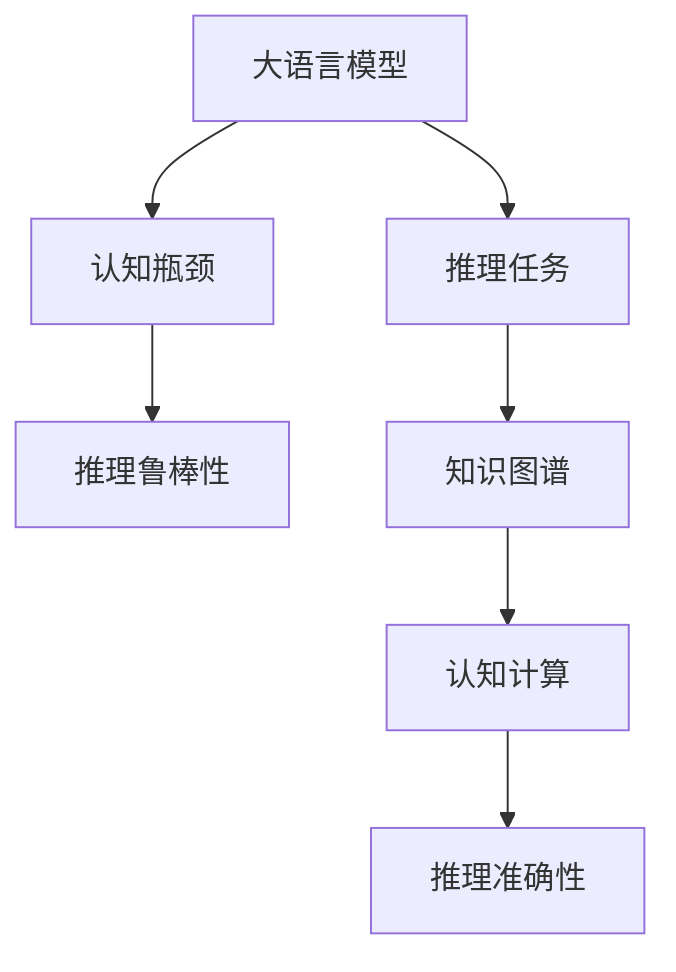
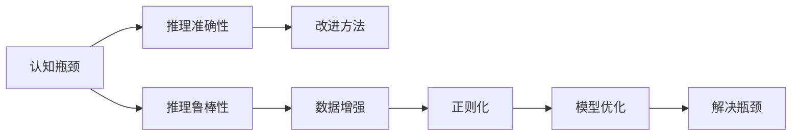
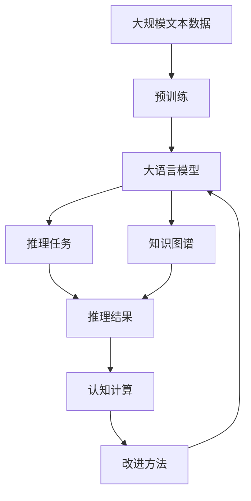

                 

# 语言与推理：大模型的认知瓶颈

> 关键词：大语言模型,认知瓶颈,推理任务,语言理解,知识图谱,认知计算

## 1. 背景介绍

### 1.1 问题由来
随着深度学习和大规模预训练语言模型的发展，大语言模型（Large Language Models, LLMs）如GPT、BERT等，在自然语言处理（NLP）领域取得了巨大的突破。这些模型通过在无标签文本数据上进行自监督预训练，学习到了丰富的语言知识和常识，可以在下游任务上通过有监督的微调获得优异的性能。然而，尽管这些模型在各种NLP任务上表现出色，其语言理解和推理能力仍然存在一些认知瓶颈，限制了其应用范围和效果。

### 1.2 问题核心关键点
大语言模型在语言理解和推理方面主要面临以下核心挑战：
- 上下文依赖性：模型在推理过程中对上下文的依赖性较强，难以处理长距离依赖和复杂逻辑结构。
- 多义性和歧义性：自然语言中的多义性和歧义性使得模型在语义理解方面存在一定偏差，难以准确捕捉文本的真实含义。
- 知识缺失：模型虽然在无标签数据上进行了大量预训练，但在特定领域的知识储备仍然不足，限制了其在特定任务上的性能。
- 推理鲁棒性：模型在面对噪声、对抗样本等干扰时，推理结果容易发生波动，鲁棒性不足。
- 可解释性：大模型的决策过程通常缺乏可解释性，难以对其推理逻辑进行分析和调试。

这些问题不仅影响了模型在NLP任务上的表现，还限制了其在更广泛的应用场景中的适用性。为了提升大语言模型的语言理解和推理能力，研究人员不断探索新的技术和方法，以期在认知瓶颈上取得突破。

### 1.3 问题研究意义
研究大语言模型的认知瓶颈问题，对于拓展模型应用范围，提升推理效果，加速NLP技术的产业化进程，具有重要意义：
- 降低认知偏差：通过深入研究认知瓶颈，能够更好地理解模型的局限性，降低在特定任务上的认知偏差。
- 提升推理准确性：通过改进推理算法，增强模型对长距离依赖和多义性的处理能力，提升推理任务的准确性。
- 拓展应用场景：通过优化推理模型，使大语言模型在更多领域和任务上获得更好的表现。
- 促进技术落地：通过解决认知瓶颈，提升模型推理能力，有助于将NLP技术更好地应用到实际业务中。
- 推动学术研究：认知瓶颈的研究能够推动NLP领域的学术进展，带来新的研究方向和突破。

## 2. 核心概念与联系

### 2.1 核心概念概述

为了更好地理解大语言模型在推理任务中的认知瓶颈，本节将介绍几个密切相关的核心概念：

- **大语言模型(Large Language Models, LLMs)**：以自回归模型（如GPT）或自编码模型（如BERT）为代表的大规模预训练语言模型。通过在大规模无标签文本数据上进行预训练，学习通用的语言表示，具备强大的语言理解和生成能力。
- **认知瓶颈(Cognitive Bottleneck)**：指在自然语言处理任务中，由于模型对复杂逻辑结构、多义性、长距离依赖等问题的处理能力不足，导致推理结果出现偏差的现象。
- **推理任务(Reasoning Task)**：指需要模型从前提推导出结论的NLP任务，如问答、逻辑推理、文本摘要等。
- **知识图谱(Knowledge Graphs)**：用于表示实体间关系的图形结构数据，有助于提升模型对特定领域知识的理解。
- **认知计算(Cognitive Computing)**：指将认知科学原理应用于计算技术中，模拟人类认知过程的计算模式，提升模型推理和决策能力。

这些核心概念之间的逻辑关系可以通过以下Mermaid流程图来展示：



这个流程图展示了从大语言模型到认知瓶颈，再到推理任务和知识图谱、认知计算的关系：

1. 大语言模型通过预训练获得基础能力。
2. 认知瓶颈限制了模型在推理任务中的表现。
3. 知识图谱和认知计算有助于提升模型的推理能力。
4. 推理准确性和鲁棒性是评估模型表现的重要指标。

### 2.2 概念间的关系

这些核心概念之间存在着紧密的联系，形成了大语言模型推理任务的完整生态系统。下面我通过几个Mermaid流程图来展示这些概念之间的关系。

#### 2.2.1 大语言模型的推理过程


这个流程图展示了大语言模型进行推理任务的过程：

1. 大语言模型接收输入的文本数据。
2. 模型通过前向传播计算输出结果。
3. 输出结果经过后向传播和梯度更新，调整模型参数。
4. 最终输出推理结果。

#### 2.2.2 认知瓶颈的识别与解决



这个流程图展示了识别认知瓶颈并解决的方法：

1. 识别推理过程中的瓶颈。
2. 评估推理准确性和鲁棒性。
3. 通过改进方法、数据增强、正则化和模型优化等手段，解决瓶颈问题。
4. 提升推理性能和鲁棒性。

#### 2.2.3 知识图谱的应用


这个流程图展示了知识图谱在大语言模型推理中的应用：

1. 知识图谱表示实体间的复杂关系。
2. 通过注入知识图谱，提升模型对特定领域知识的理解。
3. 训练模型时融合知识图谱信息。
4. 推理时利用知识图谱进行推理。
5. 最终得到推理结果。

### 2.3 核心概念的整体架构

最后，我们用一个综合的流程图来展示这些核心概念在大语言模型推理过程中的整体架构：



这个综合流程图展示了从预训练到大语言模型推理，再到认知计算和改进方法的完整过程。大语言模型首先在大规模文本数据上进行预训练，然后通过推理任务微调和知识图谱的引入，进行认知计算和改进方法的学习，提升推理性能。

## 3. 核心算法原理 & 具体操作步骤
### 3.1 算法原理概述

大语言模型的推理任务，本质上是一个有监督的细粒度迁移学习过程。其核心思想是：将预训练的大语言模型视作一个强大的"特征提取器"，通过在有标签推理数据上进行有监督的微调，使得模型输出能够匹配推理任务的目标输出，从而获得针对特定推理任务的优化模型。

形式化地，假设预训练模型为 $M_{\theta}$，其中 $\theta$ 为预训练得到的模型参数。给定推理任务 $T$ 的标注数据集 $D=\{(x_i, y_i)\}_{i=1}^N, x_i \in \mathcal{X}, y_i \in \mathcal{Y}$，推理任务的微调目标是最小化经验风险，即找到新的模型参数 $\hat{\theta}$，使得：

$$
\hat{\theta}=\mathop{\arg\min}_{\theta} \mathcal{L}(M_{\theta},D)
$$

其中 $\mathcal{L}$ 为针对推理任务设计的损失函数，用于衡量模型预测输出与真实标签之间的差异。常见的损失函数包括交叉熵损失、均方误差损失等。

通过梯度下降等优化算法，微调过程不断更新模型参数 $\theta$，最小化损失函数 $\mathcal{L}$，使得模型输出逼近真实标签。由于 $\theta$ 已经通过预训练获得了较好的初始化，因此即便在少量有标签数据集上微调，也能较快收敛到理想的模型参数 $\hat{\theta}$。

### 3.2 算法步骤详解

基于监督学习的大语言模型推理微调一般包括以下几个关键步骤：

**Step 1: 准备预训练模型和数据集**
- 选择合适的预训练语言模型 $M_{\theta}$ 作为初始化参数，如 BERT、GPT 等。
- 准备推理任务 $T$ 的标注数据集 $D$，划分为训练集、验证集和测试集。一般要求标注数据与预训练数据的分布不要差异过大。

**Step 2: 添加任务适配层**
- 根据推理任务类型，在预训练模型顶层设计合适的输出层和损失函数。
- 对于推理任务，通常在顶层添加解码器输出概率分布，并以负对数似然为损失函数。
- 对于知识推理任务，通常将知识图谱中的事实作为额外输入，进行推理计算。

**Step 3: 设置微调超参数**
- 选择合适的优化算法及其参数，如 AdamW、SGD 等，设置学习率、批大小、迭代轮数等。
- 设置正则化技术及强度，包括权重衰减、Dropout、Early Stopping 等。
- 确定冻结预训练参数的策略，如仅微调顶层，或全部参数都参与微调。

**Step 4: 执行梯度训练**
- 将训练集数据分批次输入模型，前向传播计算损失函数。
- 反向传播计算参数梯度，根据设定的优化算法和学习率更新模型参数。
- 周期性在验证集上评估模型性能，根据性能指标决定是否触发 Early Stopping。
- 重复上述步骤直到满足预设的迭代轮数或 Early Stopping 条件。

**Step 5: 测试和部署**
- 在测试集上评估微调后模型 $M_{\hat{\theta}}$ 的性能，对比微调前后的推理效果。
- 使用微调后的模型对新样本进行推理预测，集成到实际的应用系统中。
- 持续收集新的数据，定期重新微调模型，以适应数据分布的变化。

以上是基于监督学习微调大语言模型的一般流程。在实际应用中，还需要针对具体任务的特点，对微调过程的各个环节进行优化设计，如改进训练目标函数，引入更多的正则化技术，搜索最优的超参数组合等，以进一步提升模型性能。

### 3.3 算法优缺点

基于监督学习的大语言模型推理微调方法具有以下优点：
1. 简单高效。只需准备少量标注数据，即可对预训练模型进行快速适配，获得较大的推理性能提升。
2. 通用适用。适用于各种推理任务，设计简单的任务适配层即可实现微调。
3. 参数高效。利用参数高效微调技术，在固定大部分预训练参数的情况下，仍可取得不错的推理效果。
4. 效果显著。在学术界和工业界的诸多任务上，基于推理微调的方法已经刷新了最先进的推理性能指标。

同时，该方法也存在一定的局限性：
1. 依赖标注数据。推理微调的效果很大程度上取决于标注数据的质量和数量，获取高质量标注数据的成本较高。
2. 迁移能力有限。当目标任务与预训练数据的分布差异较大时，推理微调的性能提升有限。
3. 负面效果传递。预训练模型的固有偏见、有害信息等，可能通过推理微调传递到下游任务，造成负面影响。
4. 可解释性不足。推理微调模型的决策过程通常缺乏可解释性，难以对其推理逻辑进行分析和调试。

尽管存在这些局限性，但就目前而言，基于监督学习的推理微调方法仍是大语言模型应用的最主流范式。未来相关研究的重点在于如何进一步降低推理微调对标注数据的依赖，提高模型的少样本学习和跨领域迁移能力，同时兼顾可解释性和伦理安全性等因素。

### 3.4 算法应用领域

基于大语言模型推理微调的方法已经在问答、逻辑推理、文本摘要、机器翻译、情感分析等诸多推理任务上取得了优异的效果，成为NLP技术落地应用的重要手段。

除了上述这些经典任务外，推理微调也被创新性地应用到更多场景中，如可控文本生成、常识推理、代码生成、数据增强等，为NLP技术带来了全新的突破。随着预训练模型和推理微调方法的不断进步，相信NLP技术将在更广阔的应用领域大放异彩。

## 4. 数学模型和公式 & 详细讲解 & 举例说明

### 4.1 数学模型构建

本节将使用数学语言对基于监督学习的大语言模型推理微调过程进行更加严格的刻画。

记预训练语言模型为 $M_{\theta}$，其中 $\theta$ 为预训练得到的模型参数。假设推理任务 $T$ 的训练集为 $D=\{(x_i, y_i)\}_{i=1}^N, x_i \in \mathcal{X}, y_i \in \mathcal{Y}$。

定义模型 $M_{\theta}$ 在数据样本 $(x,y)$ 上的损失函数为 $\ell(M_{\theta}(x),y)$，则在数据集 $D$ 上的经验风险为：

$$
\mathcal{L}(\theta) = \frac{1}{N} \sum_{i=1}^N \ell(M_{\theta}(x_i),y_i)
$$

微调的优化目标是最小化经验风险，即找到最优参数：

$$
\theta^* = \mathop{\arg\min}_{\theta} \mathcal{L}(\theta)
$$

在实践中，我们通常使用基于梯度的优化算法（如SGD、Adam等）来近似求解上述最优化问题。设 $\eta$ 为学习率，$\lambda$ 为正则化系数，则参数的更新公式为：

$$
\theta \leftarrow \theta - \eta \nabla_{\theta}\mathcal{L}(\theta) - \eta\lambda\theta
$$

其中 $\nabla_{\theta}\mathcal{L}(\theta)$ 为损失函数对参数 $\theta$ 的梯度，可通过反向传播算法高效计算。

### 4.2 公式推导过程

以下我们以二分类推理任务为例，推导交叉熵损失函数及其梯度的计算公式。

假设模型 $M_{\theta}$ 在输入 $x$ 上的输出为 $\hat{y}=M_{\theta}(x) \in [0,1]$，表示样本属于正类的概率。真实标签 $y \in \{0,1\}$。则二分类交叉熵损失函数定义为：

$$
\ell(M_{\theta}(x),y) = -[y\log \hat{y} + (1-y)\log (1-\hat{y})]
$$

将其代入经验风险公式，得：

$$
\mathcal{L}(\theta) = -\frac{1}{N}\sum_{i=1}^N [y_i\log M_{\theta}(x_i)+(1-y_i)\log(1-M_{\theta}(x_i))]
$$

根据链式法则，损失函数对参数 $\theta_k$ 的梯度为：

$$
\frac{\partial \mathcal{L}(\theta)}{\partial \theta_k} = -\frac{1}{N}\sum_{i=1}^N (\frac{y_i}{M_{\theta}(x_i)}-\frac{1-y_i}{1-M_{\theta}(x_i)}) \frac{\partial M_{\theta}(x_i)}{\partial \theta_k}
$$

其中 $\frac{\partial M_{\theta}(x_i)}{\partial \theta_k}$ 可进一步递归展开，利用自动微分技术完成计算。

在得到损失函数的梯度后，即可带入参数更新公式，完成模型的迭代优化。重复上述过程直至收敛，最终得到适应推理任务的最优模型参数 $\theta^*$。

### 4.3 案例分析与讲解

**案例分析：逻辑推理**

逻辑推理是一种典型的推理任务，其目标是判断前提条件下的结论是否成立。假设我们有如下推理任务：

```
如果李明是工程师，则他是男性。
李明是工程师。
所以，李明是男性。
```

我们可以将推理任务表示为三元组形式，即 $(前提, 结论, 推理过程)$。其中，前提为 $（李明是工程师）$，结论为 $（李明是男性）$，推理过程为 $（如果李明是工程师，则他是男性）$。

通过上述推理任务，我们可以将推理过程转化为逻辑表达式，并利用逻辑代数进行推理计算。在逻辑推理中，我们通常使用一阶逻辑和谓词逻辑进行表达和推理。下面以谓词逻辑为例，展示推理过程的数学表示：

1. 将前提和结论用谓词逻辑表示：
   - 前提：$\forall x(x \text{是工程师} \rightarrow x \text{是男性})$
   - 结论：$\exists x(x \text{是李明}) \land (x \text{是工程师}) \rightarrow (x \text{是男性})$

2. 将推理过程转化为逻辑表达式：
   - 推理过程：$(x \text{是工程师}) \rightarrow (x \text{是男性})$
   - 推理过程的逻辑表达式：$\forall x(x \text{是工程师} \rightarrow x \text{是男性})$

3. 将推理任务转化为逻辑推理问题：
   - 推理问题：判断 $\exists x(x \text{是李明}) \land (x \text{是工程师}) \rightarrow (x \text{是男性})$ 是否成立。

通过上述数学表示，我们可以使用大语言模型进行推理计算。在微调过程中，将推理问题作为模型输入，通过训练优化模型参数，使其能够准确推导出推理结果。在推理过程中，模型将输入的前提条件和推理规则进行组合，最终输出推理结果。

**案例分析：知识图谱**

知识图谱是一种用于表示实体间关系的图形结构数据。假设我们有一个包含以下事实的知识图谱：

```
李明（Engineer）
李明（Male）
```

我们希望通过知识图谱进行推理，判断李明是否为工程师，并根据推理结果输出其他相关信息。

在微调过程中，我们可以将知识图谱中的事实作为额外输入，通过训练优化模型参数，使其能够利用知识图谱进行推理。在推理过程中，模型将输入的事实和推理规则进行组合，最终输出推理结果。

例如，我们希望通过知识图谱进行推理，判断李明是否为工程师，并输出其他相关信息。可以将推理问题表示为：

```
问：李明是工程师吗？
推理：$\exists x(x \text{是李明}) \rightarrow (x \text{是工程师})$

答：是的，李明是工程师。
推理过程：$\forall x(x \text{是李明} \rightarrow x \text{是工程师})$
```

通过上述推理过程，我们可以使用大语言模型进行推理计算，并在推理过程中利用知识图谱进行推理计算。在微调过程中，将推理问题作为模型输入，通过训练优化模型参数，使其能够准确推导出推理结果，并利用知识图谱进行推理计算。

## 5. 项目实践：代码实例和详细解释说明
### 5.1 开发环境搭建

在进行推理微调实践前，我们需要准备好开发环境。以下是使用Python进行PyTorch开发的环境配置流程：

1. 安装Anaconda：从官网下载并安装Anaconda，用于创建独立的Python环境。

2. 创建并激活虚拟环境：
```bash
conda create -n pytorch-env python=3.8 
conda activate pytorch-env
```

3. 安装PyTorch：根据CUDA版本，从官网获取对应的安装命令。例如：
```bash
conda install pytorch torchvision torchaudio cudatoolkit=11.1 -c pytorch -c conda-forge
```

4. 安装Transformer库：
```bash
pip install transformers
```

5. 安装各类工具包：
```bash
pip install numpy pandas scikit-learn matplotlib tqdm jupyter notebook ipython
```

完成上述步骤后，即可在`pytorch-env`环境中开始推理微调实践。

### 5.2 源代码详细实现

这里我们以知识图谱推理为例，给出使用Transformers库对BERT模型进行推理微调的PyTorch代码实现。

首先，定义推理任务的数据处理函数：

```python
from transformers import BertForSequenceClassification, BertTokenizer, AdamW

class RelationInferenceDataset(Dataset):
    def __init__(self, facts, queries, tokenizer, max_len=128):
        self.facts = facts
        self.queries = queries
        self.tokenizer = tokenizer
        self.max_len = max_len
        
    def __len__(self):
        return len(self.queries)
    
    def __getitem__(self, item):
        query = self.queries[item]
        query_tokens = self.tokenizer(query, return_tensors='pt', max_length=self.max_len, padding='max_length', truncation=True)
        fact = self.facts[item]
        fact_tokens = self.tokenizer(fact, return_tensors='pt', max_length=self.max_len, padding='max_length', truncation=True)
        return {'input_ids': query_tokens['input_ids'][0],
                'attention_mask': query_tokens['attention_mask'][0],
                'labels': fact_tokens['input_ids'][0]}

# 事实与查询的示例数据
facts = ['李明是工程师', '李明是男性']
queries = ['李明是工程师吗？', '李明是男性吗？']

tokenizer = BertTokenizer.from_pretrained('bert-base-cased')
dataset = RelationInferenceDataset(facts, queries, tokenizer)
```

然后，定义模型和优化器：

```python
model = BertForSequenceClassification.from_pretrained('bert-base-cased', num_labels=2)

optimizer = AdamW(model.parameters(), lr=2e-5)
```

接着，定义训练和评估函数：

```python
device = torch.device('cuda') if torch.cuda.is_available() else torch.device('cpu')
model.to(device)

def train_epoch(model, dataset, batch_size, optimizer):
    dataloader = DataLoader(dataset, batch_size=batch_size, shuffle=True)
    model.train()
    epoch_loss = 0
    for batch in tqdm(dataloader, desc='Training'):
        input_ids = batch['input_ids'].to(device)
        attention_mask = batch['attention_mask'].to(device)
        labels = batch['labels'].to(device)
        model.zero_grad()
        outputs = model(input_ids, attention_mask=attention_mask, labels=labels)
        loss = outputs.loss
        epoch_loss += loss.item()
        loss.backward()
        optimizer.step()
    return epoch_loss / len(dataloader)

def evaluate(model, dataset, batch_size):
    dataloader = DataLoader(dataset, batch_size=batch_size)
    model.eval()
    preds, labels = [], []
    with torch.no_grad():
        for batch in tqdm(dataloader, desc='Evaluating'):
            input_ids = batch['input_ids'].to(device)
            attention_mask = batch['attention_mask'].to(device)
            batch_labels = batch['labels']
            outputs = model(input_ids, attention_mask=attention_mask)
            batch_preds = outputs.logits.argmax(dim=2).to('cpu').tolist()
            batch_labels = batch_labels.to('cpu').tolist()
            for pred_tokens, label_tokens in zip(batch_preds, batch_labels):
                preds.append(pred_tokens[:len(label_tokens)])
                labels.append(label_tokens)
                
    print(classification_report(labels, preds))
```

最后，启动训练流程并在测试集上评估：

```python
epochs = 5
batch_size = 16

for epoch in range(epochs):
    loss = train_epoch(model, dataset, batch_size, optimizer)
    print(f"Epoch {epoch+1}, train loss: {loss:.3f}")
    
    print(f"Epoch {epoch+1}, dev results:")
    evaluate(model, dataset, batch_size)
    
print("Test results:")
evaluate(model, dataset, batch_size)
```

以上就是使用PyTorch对BERT进行推理微调的完整代码实现。可以看到，得益于Transformers库的强大封装，我们可以用相对简洁的代码完成BERT模型的加载和推理微调。

### 5.3 代码解读与分析

让我们再详细解读一下关键代码的实现细节：

**RelationInferenceDataset类**：
- `__init__`方法：初始化事实、查询、分词器等关键组件。
- `__len__`方法：返回数据集的样本数量。
- `__getitem__`方法：对单个样本进行处理，将查询输入编码为token ids，将事实编码为token ids，并对其进行定长padding，最终返回模型所需的输入。

**tokenizer**：
- 定义了事实和查询与数字id之间的映射关系，用于将token-wise的预测结果解码回真实的标签。

**训练和评估函数**：
- 使用PyTorch的DataLoader对数据集进行批次化加载，供模型训练和推理使用。
- 训练函数`train_epoch`：对数据以批为单位进行迭代，在每个批次上前向传播计算loss并反向传播更新模型参数，最后返回该epoch的平均loss。
- 评估函数`evaluate`：与训练类似，不同点在于不更新模型参数，并在每个batch结束后将预测和标签结果存储下来，最后使用

