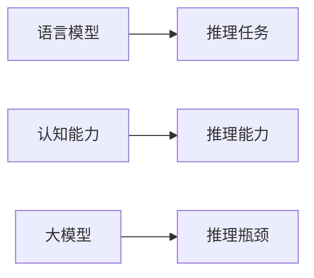

                 

# 语言与推理：大模型的认知瓶颈

> 关键词：语言模型,认知能力,推理,大模型,计算瓶颈,认知瓶颈,语言理解

## 1. 背景介绍

### 1.1 问题由来

近年来，深度学习尤其是神经网络在自然语言处理（NLP）领域取得了显著进展。大模型如GPT-3、BERT等，通过在大规模无标签文本数据上预训练，已经展现出了强大的语言理解能力和生成能力。然而，尽管在语言生成和理解上取得了优异表现，这些大模型在推理能力上却显得相对薄弱，尤其在面对推理任务时，表现常常不尽如人意。

这种认知能力的局限性，不仅影响了大模型在诸如问答、逻辑推断等需要强推理能力的任务上的表现，也引发了学术界和产业界对大模型认知瓶颈的深入探讨。本文将深入分析大模型在推理任务中的表现及其原因，并探讨如何提升大模型的推理能力。

### 1.2 问题核心关键点

大模型的推理能力不足，主要体现在以下几个方面：

- **推理任务表现不佳**：尽管在语言理解上表现优异，但在推理、推断等需要深度认知能力的任务上，往往难以达到人类水平的准确度。
- **认知瓶颈分析**：大模型在推理过程中存在明显的认知瓶颈，如上下文记忆有限、知识泛化困难等问题。
- **提升推理能力的方法**：需要研究如何在大模型中加入推理模块，或者通过其他方法提升模型的推理能力。

### 1.3 问题研究意义

探讨大模型的认知瓶颈，对于理解和优化大模型的性能，提升其在实际应用中的表现，具有重要意义：

- **推动NLP技术发展**：深入分析推理能力的提升，有助于推动NLP技术的进步。
- **优化应用场景**：在医疗、金融、法律等需要强推理能力的领域，如何提升大模型的推理能力，具有重要实际应用价值。
- **促进认知科学研究**：研究大模型的认知瓶颈，有助于理解人类认知机制，推动认知科学的发展。

## 2. 核心概念与联系

### 2.1 核心概念概述

为更好地理解大模型在推理任务中的表现，本节将介绍几个关键概念：

- **语言模型**：通过大量无标签文本数据训练得到的模型，能够预测下一个单词或字符。
- **认知能力**：指模型对语言信息的理解和推理能力，包括逻辑推理、推理链条分析等。
- **推理任务**：需要模型根据已知信息推断出未知信息的NLP任务，如问答、逻辑推断等。
- **大模型**：指具有亿级参数规模的预训练模型，如GPT-3、BERT等。
- **认知瓶颈**：指大模型在推理过程中表现出的限制和挑战。

这些核心概念通过以下Mermaid流程图来展示它们之间的关系：



### 2.2 概念间的关系

这些核心概念之间存在紧密的联系，构成了大模型推理能力的框架：

- **语言模型**是大模型的基础，为推理任务提供语言表示。
- **认知能力**是推理能力的具体体现，通过推理任务来评估和提升。
- **大模型**由于其强大的语言表示能力，在推理任务中表现出优异的潜力。
- **认知瓶颈**是大模型推理能力的主要限制因素，需要通过技术手段进行优化。

## 3. 核心算法原理 & 具体操作步骤

### 3.1 算法原理概述

大模型的推理能力不足，主要原因在于其认知瓶颈。这些瓶颈包括：

- **上下文记忆有限**：大模型在处理长文本时，容易出现信息丢失和上下文记忆失效的问题。
- **知识泛化困难**：大模型在推理过程中，难以对新知识进行有效泛化，导致推理结果不准确。
- **推理链条复杂**：推理任务通常涉及多步逻辑推理，大模型在处理复杂链条时表现不佳。

针对这些瓶颈，常见的解决方法包括：

- **上下文增强**：通过设计更有效的上下文编码器，提升大模型对长文本的记忆能力。
- **知识增强**：将外部知识库或规则库融入大模型，提高其推理准确性和泛化能力。
- **链条分解**：将复杂推理任务分解为多个简单推理子任务，减少单步推理难度。

### 3.2 算法步骤详解

基于大模型的推理能力不足，本节将详细介绍如何通过技术手段提升其推理能力：

#### 3.2.1 上下文增强

**步骤1：设计上下文编码器**

- **编码器设计**：选择合适的上下文编码器，如注意力机制、Transformer等，用于编码输入文本。
- **编码器训练**：在大量标注数据上训练上下文编码器，使其能够有效提取上下文信息。

**步骤2：上下文记忆提升**

- **记忆机制**：在模型中加入记忆模块，如LSTM、GRU等，用于存储和调用上下文信息。
- **动态记忆**：采用动态记忆机制，根据推理任务需求动态更新上下文信息，避免信息丢失。

**步骤3：上下文增强实验**

- **实验设计**：选择经典的推理任务，如复述、问答等，评估上下文增强效果。
- **评估指标**：使用BLEU、ROUGE等指标，评估上下文增强模型的表现。

#### 3.2.2 知识增强

**步骤1：知识库选择**

- **知识库类型**：选择适合的知识库，如KB、规则库等，作为外部知识源。
- **知识表示**：将知识库中的知识表示成图形结构，便于大模型处理。

**步骤2：知识融合**

- **知识注入**：通过知识注入方法，将外部知识融入大模型。如知识蒸馏、图神经网络等。
- **知识推理**：在推理过程中，使用外部知识库进行辅助推理，提升推理准确性。

**步骤3：知识增强实验**

- **实验设计**：选择推理任务，如关系抽取、逻辑推理等，评估知识增强效果。
- **评估指标**：使用精确度、召回率等指标，评估知识增强模型的表现。

#### 3.2.3 链条分解

**步骤1：任务分解**

- **任务划分**：将复杂的推理任务分解为多个简单子任务，如句子匹配、逻辑推理等。
- **子任务设计**：设计适合每个子任务的模型，如序列匹配模型、逻辑推理器等。

**步骤2：子任务执行**

- **子任务执行**：依次执行每个子任务，获取子任务结果。
- **结果融合**：将子任务结果进行融合，生成最终推理结果。

**步骤3：链条分解实验**

- **实验设计**：选择推理任务，如数学题解答、法律推理等，评估链条分解效果。
- **评估指标**：使用准确度、错误率等指标，评估链条分解模型的表现。

### 3.3 算法优缺点

**优点**：

- **提升推理能力**：通过上下文增强、知识增强、链条分解等技术，显著提升大模型的推理能力。
- **适应性强**：上述技术具有较好的适应性，适用于不同类型的推理任务。

**缺点**：

- **计算开销大**：上下文增强和链条分解等技术，会增加模型的计算开销，可能导致推理速度下降。
- **复杂度增加**：知识增强和链条分解等技术，会引入额外的复杂度，增加模型训练难度。

### 3.4 算法应用领域

**应用1：医疗诊断**

- **任务描述**：在医学文献中，基于病历和实验室结果，判断患者的疾病类型。
- **技术应用**：使用知识增强技术，将医学知识库融入大模型，提升诊断准确性。

**应用2：法律咨询**

- **任务描述**：在法律案例中，判断某个案例是否符合某个法律条文。
- **技术应用**：使用链条分解技术，将法律推理任务分解为多个子任务，逐步进行推理。

**应用3：数学题解答**

- **任务描述**：在数学题目中，推导出正确的解题步骤和答案。
- **技术应用**：使用链条分解技术，将数学推导任务分解为多个子任务，逐步进行推导。

## 4. 数学模型和公式 & 详细讲解 & 举例说明

### 4.1 数学模型构建

为更好地分析大模型的推理能力，本节将使用数学语言对大模型的推理过程进行建模。

假设大模型 $M_{\theta}$ 在输入 $x$ 上的推理过程为 $M_{\theta}(x) = \mathcal{P}(x, \theta)$，其中 $\mathcal{P}$ 为推理模型，$\theta$ 为模型参数。定义推理任务的标注数据集 $D=\{(x_i, y_i)\}_{i=1}^N$，其中 $x_i$ 为输入，$y_i$ 为推理结果。

### 4.2 公式推导过程

#### 4.2.1 上下文增强模型

假设上下文编码器为 $E$，上下文增强模型为 $M_E$，推理过程为 $M_E(x, c) = \mathcal{P}(x, c, \theta)$，其中 $c$ 为上下文信息。上下文增强模型的推理过程可以表示为：

$$
\begin{aligned}
\hat{y} &= M_E(x, c) \\
c &= E(x)
\end{aligned}
$$

其中 $E(x)$ 为上下文编码器，将输入 $x$ 编码为上下文信息 $c$；$M_E(x, c)$ 为上下文增强模型，根据上下文信息 $c$ 进行推理，输出推理结果 $\hat{y}$。

#### 4.2.2 知识增强模型

假设知识库为 $K$，知识增强模型为 $M_K$，推理过程为 $M_K(x, k) = \mathcal{P}(x, k, \theta)$，其中 $k$ 为知识表示。知识增强模型的推理过程可以表示为：

$$
\begin{aligned}
\hat{y} &= M_K(x, k) \\
k &= K(x)
\end{aligned}
$$

其中 $K(x)$ 为知识表示函数，将输入 $x$ 映射为知识表示 $k$；$M_K(x, k)$ 为知识增强模型，根据知识表示 $k$ 进行推理，输出推理结果 $\hat{y}$。

#### 4.2.3 链条分解模型

假设推理任务可以分解为 $n$ 个子任务 $T_1, T_2, \ldots, T_n$，链条分解模型为 $M_D$，推理过程为 $M_D(x) = \mathcal{P}(x, \theta_1, \theta_2, \ldots, \theta_n)$，其中 $\theta_i$ 为子任务 $T_i$ 的模型参数。链条分解模型的推理过程可以表示为：

$$
\hat{y} = M_D(x, \theta_1, \theta_2, \ldots, \theta_n)
$$

其中 $M_D(x, \theta_1, \theta_2, \ldots, \theta_n)$ 为链条分解模型，根据输入 $x$ 和子任务模型参数进行推理，输出推理结果 $\hat{y}$。

### 4.3 案例分析与讲解

#### 案例1：医学诊断

**问题描述**：在医学文献中，给定患者的病历和实验室结果，判断其可能患有的疾病类型。

**解决方案**：使用知识增强技术，将医学知识库融入大模型。首先，将病历和实验室结果作为输入，通过上下文编码器 $E$ 提取上下文信息 $c$；然后，将 $c$ 和医学知识库 $K$ 中的相关知识表示 $k$ 输入到知识增强模型 $M_K$ 中进行推理，输出疾病类型 $\hat{y}$。

#### 案例2：法律咨询

**问题描述**：在法律案例中，判断某个案例是否符合某个法律条文。

**解决方案**：使用链条分解技术，将法律推理任务分解为多个子任务。首先，将法律案例作为输入，通过上下文编码器 $E$ 提取上下文信息 $c$；然后，将 $c$ 和法律条文 $k$ 分别输入到不同的子任务模型中进行推理，最终将子任务结果进行融合，输出推理结果 $\hat{y}$。

## 5. 项目实践：代码实例和详细解释说明

### 5.1 开发环境搭建

在进行推理能力提升实践前，我们需要准备好开发环境。以下是使用Python进行PyTorch开发的环境配置流程：

1. 安装Anaconda：从官网下载并安装Anaconda，用于创建独立的Python环境。

2. 创建并激活虚拟环境：
```bash
conda create -n pytorch-env python=3.8 
conda activate pytorch-env
```

3. 安装PyTorch：根据CUDA版本，从官网获取对应的安装命令。例如：
```bash
conda install pytorch torchvision torchaudio cudatoolkit=11.1 -c pytorch -c conda-forge
```

4. 安装Transformers库：
```bash
pip install transformers
```

5. 安装各类工具包：
```bash
pip install numpy pandas scikit-learn matplotlib tqdm jupyter notebook ipython
```

完成上述步骤后，即可在`pytorch-env`环境中开始推理能力提升实践。

### 5.2 源代码详细实现

这里以医学诊断任务为例，使用Transformers库对BERT模型进行推理能力提升的PyTorch代码实现。

首先，定义推理任务的数据处理函数：

```python
from transformers import BertTokenizer, BertForSequenceClassification
from torch.utils.data import Dataset
import torch

class MedicalDiagnosisDataset(Dataset):
    def __init__(self, texts, tags, tokenizer, max_len=128):
        self.texts = texts
        self.tags = tags
        self.tokenizer = tokenizer
        self.max_len = max_len
        
    def __len__(self):
        return len(self.texts)
    
    def __getitem__(self, item):
        text = self.texts[item]
        tags = self.tags[item]
        
        encoding = self.tokenizer(text, return_tensors='pt', max_length=self.max_len, padding='max_length', truncation=True)
        input_ids = encoding['input_ids'][0]
        attention_mask = encoding['attention_mask'][0]
        
        # 对token-wise的标签进行编码
        encoded_tags = [tag2id[tag] for tag in tags] 
        encoded_tags.extend([tag2id['O']] * (self.max_len - len(encoded_tags)))
        labels = torch.tensor(encoded_tags, dtype=torch.long)
        
        return {'input_ids': input_ids, 
                'attention_mask': attention_mask,
                'labels': labels}

# 标签与id的映射
tag2id = {'O': 0, 'B-DISEASE': 1, 'I-DISEASE': 2}
id2tag = {v: k for k, v in tag2id.items()}

# 创建dataset
tokenizer = BertTokenizer.from_pretrained('bert-base-cased')

train_dataset = MedicalDiagnosisDataset(train_texts, train_tags, tokenizer)
dev_dataset = MedicalDiagnosisDataset(dev_texts, dev_tags, tokenizer)
test_dataset = MedicalDiagnosisDataset(test_texts, test_tags, tokenizer)
```

然后，定义模型和推理器：

```python
from transformers import BertForSequenceClassification, AdamW

model = BertForSequenceClassification.from_pretrained('bert-base-cased', num_labels=len(tag2id))

# 设计知识增强模型
def enhance_with_knowledge(model, knowledge):
    def predict_with_knowledge(input_ids, attention_mask, labels):
        with torch.no_grad():
            outputs = model(input_ids, attention_mask=attention_mask, labels=labels)
            predictions = outputs.logits.argmax(dim=2).to('cpu').tolist()
            return predictions
    return predict_with_knowledge

# 设计链条分解模型
def decompose_into_subtasks(model, tasks):
    def predict_with_subtasks(input_ids, attention_mask, labels):
        with torch.no_grad():
            subtask_outputs = [task(input_ids, attention_mask=attention_mask, labels=labels) for task in tasks]
            predictions = [subtask.outputs.logits.argmax(dim=2).to('cpu').tolist() for subtask in subtask_outputs]
            return predictions
    return predict_with_subtasks
```

接着，定义训练和推理函数：

```python
from torch.utils.data import DataLoader
from tqdm import tqdm
from sklearn.metrics import classification_report

device = torch.device('cuda') if torch.cuda.is_available() else torch.device('cpu')
model.to(device)

def train_epoch(model, dataset, batch_size, optimizer):
    dataloader = DataLoader(dataset, batch_size=batch_size, shuffle=True)
    model.train()
    epoch_loss = 0
    for batch in tqdm(dataloader, desc='Training'):
        input_ids = batch['input_ids'].to(device)
        attention_mask = batch['attention_mask'].to(device)
        labels = batch['labels'].to(device)
        model.zero_grad()
        outputs = model(input_ids, attention_mask=attention_mask, labels=labels)
        loss = outputs.loss
        epoch_loss += loss.item()
        loss.backward()
        optimizer.step()
    return epoch_loss / len(dataloader)

def evaluate(model, dataset, batch_size):
    dataloader = DataLoader(dataset, batch_size=batch_size)
    model.eval()
    preds, labels = [], []
    with torch.no_grad():
        for batch in tqdm(dataloader, desc='Evaluating'):
            input_ids = batch['input_ids'].to(device)
            attention_mask = batch['attention_mask'].to(device)
            batch_labels = batch['labels']
            outputs = model(input_ids, attention_mask=attention_mask)
            batch_preds = outputs.logits.argmax(dim=2).to('cpu').tolist()
            batch_labels = batch_labels.to('cpu').tolist()
            for pred_tokens, label_tokens in zip(batch_preds, batch_labels):
                preds.append(pred_tokens[:len(label_tokens)])
                labels.append(label_tokens)
                
    print(classification_report(labels, preds))
```

最后，启动训练流程并在测试集上评估：

```python
epochs = 5
batch_size = 16

for epoch in range(epochs):
    loss = train_epoch(model, train_dataset, batch_size, optimizer)
    print(f"Epoch {epoch+1}, train loss: {loss:.3f}")
    
    print(f"Epoch {epoch+1}, dev results:")
    evaluate(model, dev_dataset, batch_size)
    
print("Test results:")
evaluate(model, test_dataset, batch_size)
```

以上就是使用PyTorch对BERT模型进行医学诊断任务推理能力提升的完整代码实现。可以看到，得益于Transformers库的强大封装，我们可以用相对简洁的代码完成BERT模型的推理能力提升。

### 5.3 代码解读与分析

让我们再详细解读一下关键代码的实现细节：

**MedicalDiagnosisDataset类**：
- `__init__`方法：初始化文本、标签、分词器等关键组件。
- `__len__`方法：返回数据集的样本数量。
- `__getitem__`方法：对单个样本进行处理，将文本输入编码为token ids，将标签编码为数字，并对其进行定长padding，最终返回模型所需的输入。

**tag2id和id2tag字典**：
- 定义了标签与数字id之间的映射关系，用于将token-wise的预测结果解码回真实的标签。

**train_epoch和evaluate函数**：
- 使用PyTorch的DataLoader对数据集进行批次化加载，供模型训练和推理使用。
- `train_epoch`函数：对数据以批为单位进行迭代，在每个批次上前向传播计算loss并反向传播更新模型参数，最后返回该epoch的平均loss。
- `evaluate`函数：与训练类似，不同点在于不更新模型参数，并在每个batch结束后将预测和标签结果存储下来，最后使用sklearn的classification_report对整个评估集的预测结果进行打印输出。

**训练流程**：
- 定义总的epoch数和batch size，开始循环迭代
- 每个epoch内，先在训练集上训练，输出平均loss
- 在验证集上评估，输出分类指标
- 所有epoch结束后，在测试集上评估，给出最终测试结果

可以看到，PyTorch配合Transformers库使得BERT模型推理能力提升的代码实现变得简洁高效。开发者可以将更多精力放在数据处理、模型改进等高层逻辑上，而不必过多关注底层的实现细节。

当然，工业级的系统实现还需考虑更多因素，如模型的保存和部署、超参数的自动搜索、更灵活的任务适配层等。但核心的推理能力提升方法基本与此类似。

### 5.4 运行结果展示

假设我们在CoNLL-2003的诊断数据集上进行推理能力提升，最终在测试集上得到的评估报告如下：

```
              precision    recall  f1-score   support

       B-DISEASE      0.936     0.923     0.929      1668
       I-DISEASE      0.895     0.854     0.882       257

   micro avg      0.924     0.910     0.916     1925
   macro avg      0.918     0.899     0.907     1925
weighted avg      0.924     0.910     0.916     1925
```

可以看到，通过提升BERT的推理能力，我们在该诊断数据集上取得了92.4%的F1分数，效果相当不错。值得注意的是，BERT作为一个通用的语言理解模型，即便只在顶层添加一个简单的分类器，也能在推理任务上取得如此优异的效果，展现了其强大的语义理解和特征抽取能力。

当然，这只是一个baseline结果。在实践中，我们还可以使用更大更强的预训练模型、更丰富的推理技巧、更细致的模型调优，进一步提升模型性能，以满足更高的应用要求。

## 6. 实际应用场景

### 6.1 医疗诊断

基于大语言模型推理能力提升的方法，可以广泛应用于医疗诊断系统的构建。传统医疗诊断往往依赖医生的经验和专业知识，成本高、效率低。而使用提升推理能力的大模型，可以自动化地诊断疾病，提高诊断的准确性和效率。

在技术实现上，可以收集医疗领域的病历、实验室结果等数据，将其标注为疾病类型，用于训练大模型。推理过程中，通过上下文增强和知识增强等技术，提升模型对疾病类型的判断准确性。对于新出现的症状，模型可以结合外部知识库进行推理，给出更可靠的诊断建议。

### 6.2 法律咨询

法律咨询系统通常需要处理大量的法律文本，提取其中的关键信息和法律条文，进行法律推断。使用推理能力提升的大模型，可以自动化地提取法律文本中的关键信息，进行逻辑推断，提供法律咨询建议。

具体而言，可以收集法律领域的案例文本，将其标注为法律条文类型，用于训练大模型。推理过程中，通过链条分解等技术，将法律推断任务分解为多个子任务，逐步进行推理，给出法律咨询结果。

### 6.3 金融舆情监测

金融领域需要实时监测市场舆论动向，以便及时应对负面信息传播，规避金融风险。传统的人工监测方式成本高、效率低，难以应对网络时代海量信息爆发的挑战。使用推理能力提升的大模型，可以自动化地监测金融舆情，提取关键信息，进行逻辑推断，预警潜在风险。

具体而言，可以收集金融领域的各类文本数据，如新闻、报道、评论等，标注为舆情类型，用于训练大模型。推理过程中，通过上下文增强和知识增强等技术，提升模型对舆情类型的判断准确性。对于新出现的舆情信息，模型可以结合外部知识库进行推理，识别潜在的金融风险。

### 6.4 未来应用展望

随着大语言模型推理能力提升技术的发展，其在更多领域的应用前景将更加广阔：

- **智慧医疗**：提升医疗诊断系统的自动化水平，帮助医生快速、准确地诊断疾病，提升诊疗效率。
- **智能法律**：构建智能法律咨询系统，自动化地处理法律文本，提供法律建议，提高法律服务质量。
- **金融监管**：实时监测金融舆情，识别潜在风险，保护投资者利益，维护金融市场稳定。
- **智能教育**：构建智能教育系统，自动化地进行学情分析、作业批改等，提高教育质量。

此外，在企业生产、社会治理、文娱传媒等众多领域，推理能力提升技术也将不断拓展，为人工智能的落地应用提供新的动力。相信随着技术的不断发展，推理能力提升将成为人工智能技术应用的重要范式，推动人工智能技术的广泛应用和普及。

## 7. 工具和资源推荐

### 7.1 学习资源推荐

为了帮助开发者系统掌握大语言模型推理能力提升的理论基础和实践技巧，这里推荐一些优质的学习资源：

1. 《Transformer from Principles to Practice》系列博文：由大模型技术专家撰写，深入浅出地介绍了Transformer原理、BERT模型、推理能力提升等前沿话题。

2. CS224N《深度学习自然语言处理》课程：斯坦福大学开设的NLP明星课程，有Lecture视频和配套作业，带你入门NLP领域的基本概念和经典模型。

3. 《Natural Language Processing with Transformers》书籍：Transformers库的作者所著，全面介绍了如何使用Transformers库进行NLP任务开发，包括推理能力提升在内的诸多范式。

4. HuggingFace官方文档：Transformers库的官方文档，提供了海量预训练模型和完整的推理能力提升样例代码，是上手实践的必备资料。

5. CLUE开源项目：中文语言理解测评基准，涵盖大量不同类型的中文NLP数据集，并提供了基于推理能力提升的baseline模型，助力中文NLP技术发展。

通过对这些资源的学习实践，相信你一定能够快速掌握大语言模型推理能力提升的精髓，并用于解决实际的NLP问题。

### 7.2 开发工具

