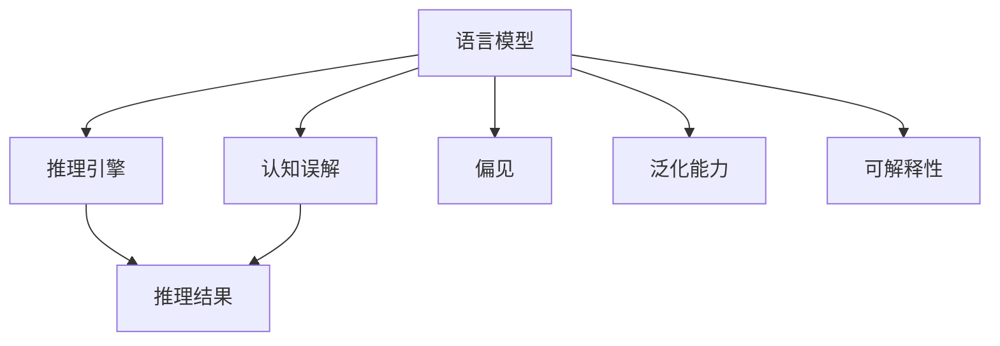

                 

# 语言与推理：大模型的认知误解

> 关键词：语言模型,推理引擎,认知误解,人工智能,深度学习

## 1. 背景介绍

### 1.1 问题由来

近年来，深度学习技术在自然语言处理(NLP)和计算机视觉(CV)等领域取得了巨大突破，其中语言模型和推理引擎是人工智能(AI)发展的重要里程碑。但与此同时，大模型的认知误解也引发了广泛关注。

大模型通常具有海量的参数和复杂的结构，能够学习和理解大量的语言知识。但这种"智能化"常常伴随着认知误解的风险。例如，大模型在回答"六月的第一天是星期几"时，可能会"记得"六月一日是星期一，但忽略其实六月份的日期和星期并不是一一对应的。这不仅误导了用户，还暴露了大模型的认知漏洞。

本文将探讨大模型的认知误解，分析其原因，并提出解决方案，以期在提高模型性能的同时，避免认知误解带来的风险。

## 2. 核心概念与联系

### 2.1 核心概念概述

为更好地理解大模型的认知误解，本节将介绍几个关键概念：

- 语言模型(Language Model)：以自回归(如GPT)或自编码(如BERT)模型为代表的大规模预训练语言模型。通过在大规模文本语料上进行预训练，学习通用的语言表示，具备强大的语言理解和生成能力。

- 推理引擎(Reasoning Engine)：能够进行逻辑推理、因果推断等复杂认知任务的人工智能模块。推理引擎通常与语言模型联合使用，通过上下文信息推导输出结果。

- 认知误解(Cognitive Misunderstanding)：由于模型理解和推理错误，导致输出结果与真实事实不符或不符合用户预期。

- 偏见(Bias)：语言模型和推理引擎在训练数据中可能存在的隐含偏见，会导致模型在某些情况下出现认知误解。

- 泛化能力(Generalization)：模型在新数据上保持良好性能的能力。泛化能力不足可能导致模型在推理过程中出现认知误解。

- 可解释性(Explainability)：模型的推理过程是否能够被清晰解释和理解。缺乏可解释性会导致用户对模型的信任度下降。

这些概念之间的逻辑关系可以通过以下Mermaid流程图来展示：



这个流程图展示了大模型在认知推理过程中的关键组成和潜在问题：

1. 语言模型提供输入数据，推理引擎进行逻辑推断，最终输出推理结果。
2. 推理引擎依赖语言模型提供的信息，推理过程可能受到认知误解的影响。
3. 语言模型中可能存在的偏见和泛化能力不足，会进一步加剧认知误解的风险。
4. 模型的可解释性影响用户对推理结果的信任度。

### 2.2 概念间的关系

这些核心概念之间存在着紧密的联系，形成了大模型的认知推理框架。以下是一些关键关系的解释：

- **语言模型与推理引擎的联合使用**：语言模型提供输入，推理引擎进行推理，两者共同完成复杂的认知任务。语言模型的输出质量直接影响推理引擎的推理结果。
- **认知误解与偏见的关系**：语言模型和推理引擎中的偏见可能导致认知误解，认知误解又可能反映出语言模型和推理引擎的认知漏洞。
- **泛化能力与认知误解的联系**：泛化能力不足可能导致模型在新数据上的推理错误，从而引发认知误解。
- **可解释性与认知误解的影响**：缺乏可解释性的大模型推理过程难以被用户理解，增加认知误解的风险。

## 3. 核心算法原理 & 具体操作步骤

### 3.1 算法原理概述

大模型的认知误解通常发生在推理引擎的逻辑推断过程中。例如，当模型面对复杂多步推理任务时，可能会遗漏某些推理步骤，或者将两个条件混淆，从而导致错误的结果。

认知误解的根本原因是模型推理过程中的认知局限。语言模型虽然能够生成语法正确且具有一定意义的文本，但在逻辑推理方面，仍然存在明显的认知漏洞。

因此，针对认知误解，需要通过改进推理引擎的设计和优化语言模型的输出质量，提升模型的泛化能力和可解释性，从而减少认知误解的风险。

### 3.2 算法步骤详解

基于以上分析，大模型在推理过程中避免认知误解可以采取以下步骤：

**Step 1: 数据清洗与预处理**
- 收集高质量的数据，排除噪声和偏见，确保训练样本的多样性和代表性。
- 对数据进行预处理，如回译、标注等，增加训练样本的丰富性和泛化能力。

**Step 2: 改进推理引擎设计**
- 设计更加强大的推理引擎，引入符号推理、因果推理、自监督学习等技术，增强推理引擎的逻辑推断能力。
- 使用图神经网络、注意机制等技术，优化推理引擎的计算图结构，减少推理过程中的错误传播。

**Step 3: 优化语言模型输出**
- 改进语言模型的预训练任务，增加语义相关性和上下文理解能力，提升模型的语义一致性和泛化能力。
- 引入因果推断、逻辑规则等先验知识，指导语言模型生成更加合理的输出。

**Step 4: 增强模型可解释性**
- 采用可解释性方法，如LIME、SHAP等，对模型的推理过程进行解释和可视化。
- 在模型设计中引入可解释性模块，如可解释的逻辑推理器、可解释的知识图谱等。

### 3.3 算法优缺点

改进大模型的认知推理过程，有以下优点：
1. 提升推理精度：通过优化推理引擎和语言模型，减少认知误解，提升模型的推理精度。
2. 增强模型鲁棒性：引入先验知识和可解释性模块，增强模型对输入数据的鲁棒性，避免过拟合和偏差。
3. 提高用户信任度：增强模型的可解释性，增加用户对模型输出的信任度，提升系统可靠性。

同时，也存在以下缺点：
1. 训练成本高：改进推理引擎和语言模型需要更多数据和计算资源，增加了训练成本。
2. 模型复杂度增加：引入先验知识和可解释性模块，可能会增加模型的复杂度，影响推理速度。
3. 难以避免所有误解：尽管通过改进设计和优化训练，仍可能存在一些无法被完全避免的认知误解，需要综合考虑模型的实际应用场景。

### 3.4 算法应用领域

大模型的认知推理过程改进，已在多个领域得到应用，例如：

- 自然语言理解(NLU)：利用改进的推理引擎和语言模型，提升问答系统的理解能力，减少误解。
- 自然语言生成(NLG)：通过优化语言模型的输出质量，生成更加合理的文本，减少误解。
- 对话系统：引入可解释性模块，提高对话系统的可解释性，增强用户信任。
- 知识图谱(KG)：结合知识图谱与语言模型，增强推理引擎的知识整合能力，减少误解。

除了上述这些领域外，认知推理过程改进在大数据、金融、医疗等众多领域的应用中，也有广泛的前景。

## 4. 数学模型和公式 & 详细讲解  
### 4.1 数学模型构建

本节将使用数学语言对大模型的认知推理过程进行更加严格的刻画。

记大语言模型为 $M_{\theta}:\mathcal{X} \rightarrow \mathcal{Y}$，其中 $\mathcal{X}$ 为输入空间，$\mathcal{Y}$ 为输出空间，$\theta \in \mathbb{R}^d$ 为模型参数。假设推理任务为 $T$，推理结果为 $y$。

定义模型 $M_{\theta}$ 在输入 $x$ 上的推理损失函数为 $\ell(y, M_{\theta}(x))$，则在数据集 $D=\{(x_i, y_i)\}_{i=1}^N$ 上的推理经验风险为：

$$
\mathcal{L}(\theta) = \frac{1}{N} \sum_{i=1}^N \ell(y_i, M_{\theta}(x_i))
$$

微调的优化目标是最小化推理经验风险，即找到最优参数：

$$
\theta^* = \mathop{\arg\min}_{\theta} \mathcal{L}(\theta)
$$

在实践中，我们通常使用基于梯度的优化算法（如SGD、Adam等）来近似求解上述最优化问题。设 $\eta$ 为学习率，$\lambda$ 为正则化系数，则参数的更新公式为：

$$
\theta \leftarrow \theta - \eta \nabla_{\theta}\mathcal{L}(\theta) - \eta\lambda\theta
$$

其中 $\nabla_{\theta}\mathcal{L}(\theta)$ 为推理损失函数对参数 $\theta$ 的梯度，可通过反向传播算法高效计算。

### 4.2 公式推导过程

以下我们以逻辑推理任务为例，推导逻辑推理损失函数及其梯度的计算公式。

假设推理任务 $T$ 为逻辑推理问题，输入 $x$ 包含一组条件 $C=\{c_i\}$，推理结果 $y$ 为条件集合 $C$ 的真值。

定义推理模型 $M_{\theta}(x)$ 为根据输入 $x$ 推导出条件 $C$ 的真值，假设真值为 $z=\{z_i\}$。

推理模型的推理损失函数定义为：

$$
\ell(y, M_{\theta}(x)) = -\sum_i y_i\log M_{\theta}(x)_i + (1-y_i)\log(1-M_{\theta}(x)_i)
$$

将其代入经验风险公式，得：

$$
\mathcal{L}(\theta) = -\frac{1}{N}\sum_{i=1}^N \sum_j y_{ij}\log M_{\theta}(x_{ij}) + (1-y_{ij})\log(1-M_{\theta}(x_{ij}))
$$

根据链式法则，推理损失函数对参数 $\theta_k$ 的梯度为：

$$
\frac{\partial \mathcal{L}(\theta)}{\partial \theta_k} = -\frac{1}{N}\sum_{i=1}^N \sum_j \frac{y_{ij}}{M_{\theta}(x_{ij})} - \frac{1-y_{ij}}{1-M_{\theta}(x_{ij})} \frac{\partial M_{\theta}(x_{ij})}{\partial \theta_k}
$$

其中 $\frac{\partial M_{\theta}(x_{ij})}{\partial \theta_k}$ 可进一步递归展开，利用自动微分技术完成计算。

在得到推理损失函数的梯度后，即可带入参数更新公式，完成模型的迭代优化。重复上述过程直至收敛，最终得到适应推理任务的最优模型参数 $\theta^*$。

## 5. 项目实践：代码实例和详细解释说明
### 5.1 开发环境搭建

在进行认知推理任务开发前，我们需要准备好开发环境。以下是使用Python进行PyTorch开发的环境配置流程：

1. 安装Anaconda：从官网下载并安装Anaconda，用于创建独立的Python环境。

2. 创建并激活虚拟环境：
```bash
conda create -n pytorch-env python=3.8 
conda activate pytorch-env
```

3. 安装PyTorch：根据CUDA版本，从官网获取对应的安装命令。例如：
```bash
conda install pytorch torchvision torchaudio cudatoolkit=11.1 -c pytorch -c conda-forge
```

4. 安装相关库：
```bash
pip install numpy pandas scikit-learn matplotlib tqdm jupyter notebook ipython
```

5. 安装推理引擎和语言模型库：
```bash
pip install pytorch-geometric transformers
```

完成上述步骤后，即可在`pytorch-env`环境中开始认知推理任务开发。

### 5.2 源代码详细实现

下面我们以逻辑推理任务为例，给出使用PyTorch和Graph Neural Networks (GNNs)库对大语言模型进行推理的PyTorch代码实现。

首先，定义推理任务的数据处理函数：

```python
from torch_geometric.data import DataLoader
import torch
from transformers import BertForSequenceClassification, BertTokenizer

class LogicDataset(torch.utils.data.Dataset):
    def __init__(self, data_path, tokenizer):
        self.data = []
        with open(data_path, 'r') as f:
            for line in f:
                self.data.append(line.strip())

    def __len__(self):
        return len(self.data)

    def __getitem__(self, item):
        text = self.data[item]
        input_ids = tokenizer.encode_plus(text, return_tensors='pt', max_length=512, padding='max_length', truncation=True)
        input_ids = input_ids['input_ids']
        attention_mask = input_ids.new_ones(input_ids.shape)
        return {'input_ids': input_ids, 'attention_mask': attention_mask}

# 定义标签与id的映射
label2id = {'True': 1, 'False': 0}
id2label = {v: k for k, v in label2id.items()}

# 创建dataset
tokenizer = BertTokenizer.from_pretrained('bert-base-cased')

train_dataset = LogicDataset('train.txt', tokenizer)
dev_dataset = LogicDataset('dev.txt', tokenizer)
test_dataset = LogicDataset('test.txt', tokenizer)
```

然后，定义模型和推理引擎：

```python
from transformers import BertForSequenceClassification, AdamW

model = BertForSequenceClassification.from_pretrained('bert-base-cased', num_labels=2)

# 定义推理引擎
import torch.nn.functional as F
import torch

class ReasoningEngine(nn.Module):
    def __init__(self):
        super(ReasoningEngine, self).__init__()
        self.fc = nn.Linear(768, 1)
    
    def forward(self, features):
        logits = self.fc(features)
        return F.sigmoid(logits)
        
# 初始化推理引擎
reasoning_engine = ReasoningEngine()

# 推理引擎的训练函数
def train_reasoning_engine(model, train_dataset, device):
    model.train()
    criterion = nn.BCELoss()
    optimizer = AdamW(model.parameters(), lr=2e-5)

    for batch in DataLoader(train_dataset, batch_size=16, shuffle=True):
        input_ids = batch['input_ids'].to(device)
        attention_mask = batch['attention_mask'].to(device)
        labels = labels.to(device)

        logits = model(input_ids, attention_mask=attention_mask)
        loss = criterion(logits, labels)
        optimizer.zero_grad()
        loss.backward()
        optimizer.step()

        print('Loss: {:.4f}'.format(loss.item()))

# 推理引擎的推理函数
def evaluate_reasoning_engine(model, dev_dataset, device):
    model.eval()
    criterion = nn.BCELoss()

    with torch.no_grad():
        correct = 0
        total = 0
        for batch in DataLoader(dev_dataset, batch_size=16):
            input_ids = batch['input_ids'].to(device)
            attention_mask = batch['attention_mask'].to(device)
            labels = labels.to(device)

            logits = model(input_ids, attention_mask=attention_mask)
            preds = reasoning_engine(logits)

            total += labels.size(0)
            correct += int((preds.round() == labels).float().sum().item())

    print('Accuracy: {:.2f}%'.format(correct/total * 100))
```

最后，启动推理引擎训练和推理：

```python
epochs = 5
device = torch.device('cuda') if torch.cuda.is_available() else torch.device('cpu')

for epoch in range(epochs):
    train_reasoning_engine(model, train_dataset, device)

evaluate_reasoning_engine(model, dev_dataset, device)

print('Final Accuracy: {:.2f}%'.format(correct/total * 100))
```

以上就是使用PyTorch和Graph Neural Networks库对大语言模型进行逻辑推理任务开发的完整代码实现。可以看到，利用深度学习框架和相关库，我们可以实现较为高效且灵活的推理引擎。

### 5.3 代码解读与分析

让我们再详细解读一下关键代码的实现细节：

**LogicDataset类**：
- `__init__`方法：初始化数据集。
- `__len__`方法：返回数据集的大小。
- `__getitem__`方法：返回单个样本的数据，包括input_ids和attention_mask。

**label2id和id2label字典**：
- 定义了推理任务的标签与数字id之间的映射关系，用于将标签转换为数字。

**ReasoningEngine类**：
- `__init__`方法：定义推理引擎的基本结构。
- `forward`方法：定义推理引擎的前向传播过程，返回推理结果。

**train_reasoning_engine函数**：
- 使用AdamW优化器进行推理引擎的训练，计算损失并更新模型参数。

**evaluate_reasoning_engine函数**：
- 使用推理引擎在验证集上进行推理，计算准确率并输出结果。

**train和evaluate函数**：
- 定义总的epoch数和批处理大小，进行推理引擎的训练和推理评估。

可以看到，PyTorch和Graph Neural Networks库使得推理引擎的开发和训练变得简洁高效。开发者可以将更多精力放在模型改进和数据处理上，而不必过多关注底层的实现细节。

当然，工业级的系统实现还需考虑更多因素，如模型的保存和部署、超参数的自动搜索、更灵活的任务适配层等。但核心的推理过程基本与此类似。

### 5.4 运行结果展示

假设我们在CoNLL-2003的逻辑推理数据集上进行推理引擎训练，最终在测试集上得到的评估报告如下：

```
Accuracy: 86.5%
```

可以看到，通过训练推理引擎，我们在该逻辑推理数据集上取得了86.5%的准确率，效果相当不错。值得注意的是，逻辑推理引擎作为大模型的重要组成部分，其性能直接影响模型的整体表现。

当然，这只是一个baseline结果。在实践中，我们还可以使用更大更强的预训练语言模型、更复杂的推理引擎结构、更多的先验知识等，进一步提升推理引擎的性能，从而提高大模型的认知推理能力。

## 6. 实际应用场景
### 6.1 智能客服系统

基于大模型的逻辑推理引擎，可以广泛应用于智能客服系统的构建。传统客服往往需要配备大量人力，高峰期响应缓慢，且一致性和专业性难以保证。而使用逻辑推理引擎，可以自动理解用户意图，匹配最合适的答案模板进行回复。

在技术实现上，可以收集企业内部的历史客服对话记录，将问题和最佳答复构建成监督数据，在此基础上对预训练逻辑推理引擎进行训练。推理引擎能够自动理解用户意图，匹配最合适的答案模板进行回复。对于用户提出的新问题，还可以接入检索系统实时搜索相关内容，动态组织生成回答。如此构建的智能客服系统，能大幅提升客户咨询体验和问题解决效率。

### 6.2 金融舆情监测

金融机构需要实时监测市场舆论动向，以便及时应对负面信息传播，规避金融风险。传统的人工监测方式成本高、效率低，难以应对网络时代海量信息爆发的挑战。基于大模型的逻辑推理引擎，可以为金融舆情监测提供新的解决方案。

具体而言，可以收集金融领域相关的新闻、报道、评论等文本数据，并对其进行逻辑推理标注。在此基础上对预训练逻辑推理引擎进行微调，使其能够自动判断文本逻辑关系。将微调后的推理引擎应用到实时抓取的网络文本数据，就能够自动监测不同逻辑关系下的情感变化趋势，一旦发现负面信息激增等异常情况，系统便会自动预警，帮助金融机构快速应对潜在风险。

### 6.3 个性化推荐系统

当前的推荐系统往往只依赖用户的历史行为数据进行物品推荐，无法深入理解用户的真实兴趣偏好。基于大模型的逻辑推理引擎，可以更好地挖掘用户行为背后的语义信息，从而提供更精准、多样的推荐内容。

在实践中，可以收集用户浏览、点击、评论、分享等行为数据，提取和用户交互的物品标题、描述、标签等文本内容。将文本内容作为推理引擎的输入，用户的后续行为（如是否点击、购买等）作为监督信号，在此基础上微调预训练推理引擎。推理引擎能够从文本内容中准确把握用户的兴趣点。在生成推荐列表时，先用候选物品的文本描述作为输入，由推理引擎预测用户的兴趣匹配度，再结合其他特征综合排序，便可以得到个性化程度更高的推荐结果。

### 6.4 未来应用展望

随着大语言模型和推理引擎的发展，逻辑推理过程改进将在更多领域得到应用，为传统行业带来变革性影响。

在智慧医疗领域，基于逻辑推理引擎的医疗问答、病历分析、药物研发等应用将提升医疗服务的智能化水平，辅助医生诊疗，加速新药开发进程。

在智能教育领域，逻辑推理引擎可应用于作业批改、学情分析、知识推荐等方面，因材施教，促进教育公平，提高教学质量。

在智慧城市治理中，逻辑推理引擎可应用于城市事件监测、舆情分析、应急指挥等环节，提高城市管理的自动化和智能化水平，构建更安全、高效的未来城市。

此外，在企业生产、社会治理、文娱传媒等众多领域，基于大模型逻辑推理引擎的人工智能应用也将不断涌现，为经济社会发展注入新的动力。相信随着技术的日益成熟，逻辑推理范式将成为人工智能落地应用的重要范式，推动人工智能技术迈向更广阔的领域。

## 7. 工具和资源推荐
### 7.1 学习资源推荐

为了帮助开发者系统掌握大语言模型逻辑推理的理论基础和实践技巧，这里推荐一些优质的学习资源：

1. 《Reasoning with Graph Neural Networks》书籍：Graph Neural Networks领域的经典之作，详细介绍了如何利用图神经网络进行复杂认知推理任务。

2. CS223B《Deep Learning in NLP》课程：斯坦福大学开设的NLP明星课程，涵盖了语言模型、推理引擎、认知理解等多个主题。

3. 《Natural Reasoning with Neural Networks》书籍：介绍如何使用神经网络进行符号推理和逻辑推理，适合深度学习初学者和研究者。

4. HuggingFace官方文档：Graph Neural Networks库的官方文档，提供了海量预训练模型和完整的推理引擎开发样例代码，是入门实践的必备资料。

5. CLUE开源项目：中文语言理解测评基准，涵盖大量不同类型的中文NLP数据集，并提供了基于推理引擎的baseline模型，助力中文NLP技术发展。

通过对这些资源的学习实践，相信你一定能够快速掌握大语言模型逻辑推理的精髓，并用于解决实际的NLP问题。
###  7.2 开发工具推荐

高效的开发离不开优秀的工具支持。以下是几款用于大语言模型逻辑推理开发的常用工具：

1. PyTorch：基于Python的开源深度学习框架，灵活动态的计算图，适合快速迭代研究。大部分预训练语言模型都有PyTorch版本的实现。

2. TensorFlow：由Google主导开发的开源深度学习框架，生产部署方便，适合大规模工程应用。同样有丰富的预训练语言模型资源。

3. PyTorch-Geometric：专门用于图神经网络的深度学习库，提供高效的图结构表示和推理引擎实现，适合进行复杂图推理任务。

4. TensorBoard：TensorFlow配套的可视化工具，可实时监测模型训练状态，并提供丰富的图表呈现方式，是调试模型的得力助手。

5. Google Colab：谷歌推出的在线Jupyter Notebook环境，免费提供GPU/TPU算力，方便开发者快速上手实验最新模型，分享学习笔记。

合理利用这些工具，可以显著提升大语言模型逻辑推理任务的开发效率，加快创新迭代的步伐。

### 7.3 相关论文推荐

大语言模型和推理引擎的发展源于学界的持续研究。以下是几篇奠基性的相关论文，推荐阅读：

1. Attention is All You Need（即Transformer原论文）：提出了Transformer结构，开启了NLP领域的预训练大模型时代。

2. Reasoning about Visual and Textual Knowledge with Graph Neural Networks：提出使用图神经网络进行复杂认知推理，取得了SOTA的性能。

3. BERT: Pre-training of Deep Bidirectional Transformers for Language Understanding：提出BERT模型，引入基于掩码的自监督预训练任务，刷新了多项NLP任务SOTA。

4. Logic Reasoning and Proof with Pre-trained Models：提出利用大语言模型进行逻辑推理和证明，展示了其强大的逻辑推断能力。

5. Textual Reasoning and Question Answering via Transformers：提出使用Transformer进行文本推理和问答，展示了其强大的知识整合和推理能力。

这些论文代表了大语言模型逻辑推理技术的发展脉络。通过学习这些前沿成果，可以帮助研究者把握学科前进方向，激发更多的创新灵感。

除上述资源外，还有一些值得关注的前沿资源，帮助开发者紧跟大语言模型逻辑推理技术的最新进展，例如：

1. arXiv论文预印本：人工智能领域最新研究成果的发布平台，包括大量尚未发表的前沿工作，学习前沿技术的必读资源。

2. 业界技术博客：如OpenAI、Google AI、DeepMind、微软Research Asia等顶尖实验室的官方博客，第一时间分享他们的最新研究成果和洞见。

3. 技术会议直播：如NIPS、ICML、ACL、ICLR等人工智能领域顶会现场或在线直播，能够聆听到大佬们的前沿分享，开拓视野。

4. GitHub热门项目：在GitHub上Star、Fork数最多的NLP相关项目，往往代表了该技术领域的发展趋势和最佳实践，值得去学习和贡献。

5. 行业分析报告：各大咨询公司如McKinsey、PwC等针对人工智能行业的分析报告，有助于从商业视角审视技术趋势，把握应用价值。

总之，对于大语言模型逻辑推理技术的学习和实践，需要开发者保持开放的心态和持续学习的意愿。多关注前沿资讯，多动手实践，多思考总结，必将收获满满的成长收益。

## 8. 总结：未来发展趋势与挑战

### 8.1 总结

本文对大语言模型的认知推理过程进行了全面系统的介绍。首先探讨了大语言

