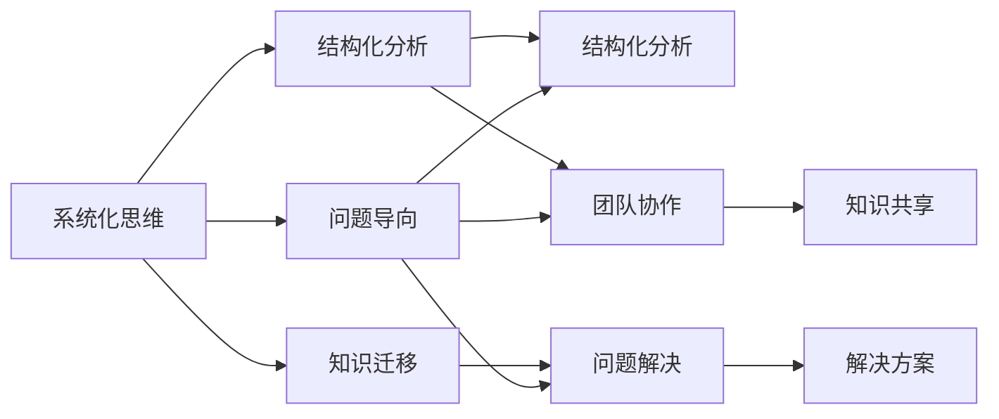
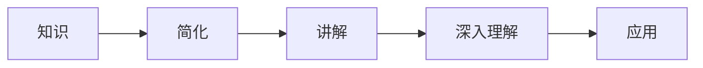
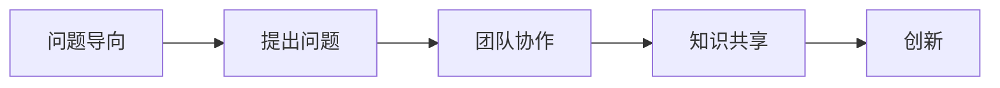
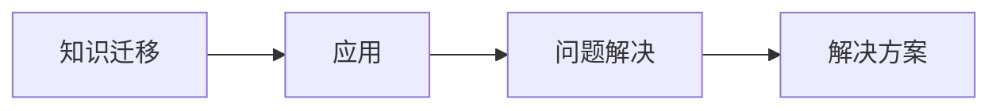
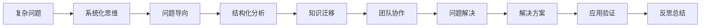

                 

# 费曼提问法:开启管理者思维升级

> 关键词：
- 费曼学习法
- 管理者思维
- 问题导向
- 思维模型
- 知识迁移
- 团队协作
- 问题解决

## 1. 背景介绍

### 1.1 问题由来

在现代组织中，管理者面临的任务日益复杂，从战略制定到日常运营，从人员管理到流程优化，每一个决策都可能影响到公司的成败。然而，由于信息不对称、资源有限、时间紧迫等原因，管理者往往难以全面、深入地理解问题，做出最优决策。费曼提问法，作为一种系统化的问题导向学习法，提供了独特的视角和方法，帮助管理者通过有效提问、系统分析，迅速找到问题的关键和解决方案，提升决策水平。

费曼学习法（Feynman Technique），由诺贝尔奖得主理查德·费曼提出，是一种以教为学的学习方法。它要求学习者将复杂知识简化，用最易懂的方式讲解给别人，以此加深对知识的理解。在企业管理中，通过将费曼学习法的核心理念应用到问题解决和团队协作中，管理者能够更高效地发现问题、分析问题、解决问题，提升团队整体能力和组织竞争力。

### 1.2 问题核心关键点

费曼提问法的核心在于系统化地提出和回答高质量的问题，从而深入理解和解决问题。这种方法要求管理者具有系统化思维、结构化分析能力以及敏锐的问题洞察力。以下是费曼提问法的几个关键步骤：

1. **定义问题**：明确问题是什么，问题的背景和范围。
2. **深入挖掘**：通过提出深入、具体的问题，找到问题的本质和根本原因。
3. **寻找解决方案**：根据问题的本质，设计可行的解决方案。
4. **验证结果**：通过验证和测试，确保解决方案的有效性。
5. **反思总结**：总结经验，形成系统化的知识和经验库，以备未来使用。

费曼提问法强调以问题为导向，通过系统的、深入的、有针对性的问题分析，快速找到问题的根源，并制定出有效的解决方案。这种方法不仅适用于技术难题，也适用于组织管理中的各种问题。

### 1.3 问题研究意义

在快速变化和不确定性日益增多的商业环境中，管理者需要具备强大的问题解决能力，以应对复杂多变的外部环境和内部挑战。费曼提问法作为一种系统化的问题导向学习法，能够帮助管理者培养系统化思维、提升问题解决能力，从而在日益复杂的商业环境中脱颖而出。

具体而言，费曼提问法对管理者有以下几个重要的意义：

1. **提升决策质量**：通过系统化、结构化的问题分析，管理者能够更准确地理解问题本质，制定出更加科学、合理的决策。
2. **促进团队协作**：通过引导团队成员提出问题、寻找解决方案，管理者可以激发团队智慧，促进知识共享和创新。
3. **增强学习效果**：通过教别人学习，管理者可以深入理解知识，巩固自己的学习成果，同时提升团队整体的学习能力。
4. **培养系统化思维**：费曼提问法强调结构化、系统化的思考方式，有助于管理者培养系统化思维，提升问题解决能力。
5. **提高组织竞争力**：通过系统化的问题分析和解决方案设计，组织能够更快地应对外部变化，提升整体竞争力。

总之，费曼提问法作为一种高效的问题导向学习法，能够帮助管理者迅速找到问题的本质，制定出有效的解决方案，从而提升决策质量、促进团队协作、增强学习效果，培养系统化思维，提高组织竞争力。

## 2. 核心概念与联系

### 2.1 核心概念概述

为更好地理解费曼提问法在企业管理中的应用，本节将介绍几个密切相关的核心概念：

- **系统化思维**：指通过系统化的思考方式，全面、深入地分析和理解问题，制定出系统化的解决方案。
- **问题导向**：强调以问题为导向，通过提出深入、具体的问题，深入理解和解决问题。
- **结构化分析**：指将复杂问题分解为多个小问题，系统化地分析和解决问题。
- **知识迁移**：指将已有的知识和经验应用于新的情境中，提升问题解决能力。
- **团队协作**：通过引导团队成员提出问题、寻找解决方案，激发团队智慧，促进知识共享和创新。
- **问题解决**：指通过系统化、结构化的思考方式，找到问题的根源，制定出有效的解决方案。

这些核心概念之间的逻辑关系可以通过以下Mermaid流程图来展示：



这个流程图展示了大语言模型微调过程中各个核心概念的关系和作用：

1. 系统化思维是基础，通过全面、深入地分析问题，找到问题的本质。
2. 问题导向是核心，通过提出具体的问题，深入理解问题。
3. 结构化分析是手段，将复杂问题分解为多个小问题，系统化地分析和解决问题。
4. 知识迁移是过程，将已有的知识和经验应用于新的情境中，提升问题解决能力。
5. 团队协作是形式，通过引导团队成员提出问题、寻找解决方案，激发团队智慧。
6. 问题解决是目标，通过系统化、结构化的思考方式，找到问题的根源，制定出有效的解决方案。

这些概念共同构成了费曼提问法的核心框架，帮助管理者系统化地分析和解决问题，提升决策水平和团队协作能力。

### 2.2 概念间的关系

这些核心概念之间存在着紧密的联系，形成了费曼提问法的完整生态系统。下面我通过几个Mermaid流程图来展示这些概念之间的关系。

#### 2.2.1 费曼学习法的原理



这个流程图展示了费曼学习法的核心步骤：将复杂的知识简化，以易懂的方式讲解给别人，通过讲解深入理解知识，并将其应用于新的情境中。

#### 2.2.2 问题导向与团队协作



这个流程图展示了问题导向与团队协作的关系：通过引导团队成员提出问题，激发团队智慧，促进知识共享和创新。

#### 2.2.3 知识迁移与问题解决



这个流程图展示了知识迁移与问题解决的关系：通过将已有的知识和经验应用于新的情境中，提升问题解决能力。

### 2.3 核心概念的整体架构

最后，我们用一个综合的流程图来展示这些核心概念在费曼提问法中的整体架构：



这个综合流程图展示了从复杂问题到解决方案的整体过程。通过系统化思维、问题导向、结构化分析、知识迁移、团队协作、问题解决、解决方案验证和反思总结，管理者能够系统化地分析和解决问题，提升决策水平和团队协作能力。

## 3. 核心算法原理 & 具体操作步骤

### 3.1 算法原理概述

费曼提问法的基本原理是通过系统化、结构化的提问方式，深入分析和理解问题的本质，从而制定出有效的解决方案。其核心思想是：

1. **系统化思考**：将复杂问题分解为多个小问题，逐一分析和解决。
2. **问题导向**：通过提出深入、具体的问题，深入理解问题的本质和根源。
3. **结构化分析**：系统化地分解和分析问题，找出关键点和瓶颈。
4. **知识迁移**：将已有的知识和经验应用于新的情境中，提升问题解决能力。
5. **团队协作**：引导团队成员提出问题、寻找解决方案，激发团队智慧，促进知识共享和创新。
6. **问题解决**：通过系统化、结构化的思考方式，找到问题的根源，制定出有效的解决方案。

### 3.2 算法步骤详解

费曼提问法可以分为以下几个关键步骤：

#### 3.2.1 定义问题

1. **明确问题**：首先需要明确问题的具体内容和范围，确保问题定义清晰明确。例如，如果问题是“销售业绩下降”，那么需要明确销售业绩的具体指标、下降的时间和范围、相关的外部因素等。
2. **确定目标**：明确问题解决的目标，例如是提升销售业绩、优化产品结构、提高客户满意度等。

#### 3.2.2 深入挖掘

1. **提出问题**：通过提出深入、具体的问题，找到问题的本质和根本原因。例如，“销售业绩下降的具体原因是什么？”“市场份额变化的具体情况是什么？”“竞争对手的情况如何？”等。
2. **系统化分析**：将问题分解为多个小问题，逐一分析和解决。例如，将“销售业绩下降”问题分解为“销售渠道分析”、“产品结构分析”、“市场分析”、“竞争分析”等。

#### 3.2.3 寻找解决方案

1. **设计方案**：根据问题的本质，设计可行的解决方案。例如，“优化销售渠道”、“调整产品结构”、“加强市场推广”、“提升产品质量”等。
2. **评估方案**：评估各个方案的可行性和有效性，选择最优方案。例如，通过SWOT分析、成本效益分析等方法，评估各个方案的优劣。

#### 3.2.4 验证结果

1. **实施方案**：根据选择的解决方案，制定实施计划，分配资源，实施方案。
2. **跟踪进展**：跟踪方案实施的进展情况，确保方案按计划执行。
3. **验证结果**：通过测试和反馈，验证方案的效果。例如，使用KPI指标、市场调查等方法，评估方案的效果。

#### 3.2.5 反思总结

1. **总结经验**：总结实施过程中的经验教训，形成系统化的知识和经验库，以备未来使用。
2. **持续改进**：通过不断总结和反思，持续改进问题解决能力，提升整体管理水平。

### 3.3 算法优缺点

费曼提问法作为一种系统化的问题导向学习法，具有以下优点：

1. **提升决策质量**：通过系统化、结构化的思考方式，管理者能够更准确地理解问题本质，制定出更加科学、合理的决策。
2. **促进团队协作**：通过引导团队成员提出问题、寻找解决方案，激发团队智慧，促进知识共享和创新。
3. **增强学习效果**：通过教别人学习，管理者可以深入理解知识，巩固自己的学习成果，同时提升团队整体的学习能力。
4. **培养系统化思维**：费曼提问法强调结构化、系统化的思考方式，有助于管理者培养系统化思维，提升问题解决能力。

同时，费曼提问法也存在一些局限性：

1. **复杂度高**：对于复杂问题，需要提出深入、具体的问题，分解为多个小问题逐一解决，过程较为繁琐。
2. **依赖团队**：需要团队成员的积极参与和协作，如果团队成员参与度不高，效果可能不佳。
3. **时间成本高**：系统化、结构化的问题分析需要较长时间，对于时间紧迫的问题，可能不适用。

尽管存在这些局限性，但费曼提问法作为一种系统化的问题导向学习法，在实践中仍具有重要的应用价值，尤其是在复杂多变的外部环境和内部挑战下，能够帮助管理者迅速找到问题的本质，制定出有效的解决方案。

### 3.4 算法应用领域

费曼提问法不仅适用于技术难题，也适用于组织管理中的各种问题。以下是几个典型的应用场景：

1. **战略规划**：通过系统化、结构化的思考方式，找到组织发展的关键问题和机会，制定出科学、合理的战略规划。
2. **项目管理**：通过引导团队成员提出问题、寻找解决方案，激发团队智慧，促进知识共享和创新，提升项目管理效率。
3. **人力资源管理**：通过提出深入、具体的问题，深入理解员工需求和问题，制定出科学的招聘、培训、绩效管理方案。
4. **市场营销**：通过系统化、结构化的分析，找到市场机会和瓶颈，制定出有效的市场推广方案。
5. **产品开发**：通过提出深入、具体的问题，深入理解用户需求和问题，制定出科学的产品开发计划。

费曼提问法作为一种系统化的问题导向学习法，适用于各种复杂多变的管理问题，能够帮助管理者迅速找到问题的本质，制定出有效的解决方案。

## 4. 数学模型和公式 & 详细讲解 & 举例说明

### 4.1 数学模型构建

费曼提问法是一种系统化、结构化的思考方式，其数学模型和公式主要涉及问题分解、问题导向和系统化分析等方面。下面通过一个具体的例子来展示其数学模型构建过程。

假设我们面临的问题是“销售业绩下降”，我们将通过以下步骤来构建数学模型：

1. **定义问题**：明确问题的具体内容和范围，例如“销售业绩下降”。
2. **提出问题**：通过提出深入、具体的问题，找到问题的本质和根本原因，例如“销售业绩下降的具体原因是什么？”、“市场份额变化的具体情况是什么？”、“竞争对手的情况如何？”等。
3. **系统化分析**：将问题分解为多个小问题，逐一分析和解决，例如将“销售业绩下降”问题分解为“销售渠道分析”、“产品结构分析”、“市场分析”、“竞争分析”等。
4. **设计方案**：根据问题的本质，设计可行的解决方案，例如“优化销售渠道”、“调整产品结构”、“加强市场推广”、“提升产品质量”等。
5. **评估方案**：评估各个方案的可行性和有效性，选择最优方案。
6. **实施方案**：根据选择的解决方案，制定实施计划，分配资源，实施方案。
7. **跟踪进展**：跟踪方案实施的进展情况，确保方案按计划执行。
8. **验证结果**：通过测试和反馈，验证方案的效果。
9. **总结经验**：总结实施过程中的经验教训，形成系统化的知识和经验库，以备未来使用。
10. **持续改进**：通过不断总结和反思，持续改进问题解决能力，提升整体管理水平。

### 4.2 公式推导过程

在问题解决的过程中，我们通常使用一些系统化的分析和评估方法，例如因果分析、SWOT分析、五力模型等。下面以因果分析为例，展示其数学模型构建和公式推导过程。

假设我们的问题是“销售业绩下降”，通过因果分析方法，可以找到其根本原因和影响因素。因果分析的数学模型可以表示为：

$$
R = F(C_1, C_2, C_3, \ldots, C_n)
$$

其中，$R$表示结果（销售业绩下降），$C_1, C_2, \ldots, C_n$表示原因和影响因素（市场变化、产品问题、渠道问题等）。

假设我们已经通过系统化分析，找到了若干影响因素，例如：

1. **市场变化**：$C_1$ = “市场需求下降”
2. **产品问题**：$C_2$ = “产品质量下降”
3. **渠道问题**：$C_3$ = “销售渠道不畅”

根据因果分析模型，我们可以构建以下公式：

$$
R = f(C_1, C_2, C_3)
$$

其中，$f$表示因果关系函数，例如：

$$
R = C_1 \cdot C_2 + C_3
$$

这个公式表示，市场变化和产品质量下降对销售业绩的负面影响，以及销售渠道不畅的正面影响。

通过数学模型的构建和公式推导，管理者可以系统化地分析和理解问题的本质和影响因素，制定出更加科学、合理的解决方案。

### 4.3 案例分析与讲解

为了更好地理解费曼提问法在实际问题解决中的应用，我们以一个具体的案例来进行详细讲解。

#### 案例1：销售业绩下降问题

假设我们是一家电子产品公司的销售经理，发现最近公司的销售业绩出现了下降。通过系统化思维和问题导向，我们可以使用费曼提问法来解决这个问题。

**第一步：定义问题**

- 问题：销售业绩下降
- 目标：找到销售业绩下降的具体原因，并制定出提升销售业绩的方案

**第二步：提出问题**

- 销售业绩下降的具体原因是什么？
- 市场需求变化的具体情况是什么？
- 竞争对手的情况如何？
- 产品结构有哪些问题？
- 销售渠道有哪些问题？

**第三步：系统化分析**

- 市场分析：市场需求下降的具体情况是什么？
- 产品分析：产品质量和功能有哪些问题？
- 渠道分析：销售渠道是否畅通？
- 竞争对手分析：竞争对手的情况如何？

**第四步：设计方案**

- 市场推广：增加市场推广力度，提升品牌知名度
- 产品优化：优化产品设计，提升产品质量和功能
- 渠道优化：优化销售渠道，提升销售效率
- 竞争对手分析：分析竞争对手的优势和劣势，制定应对策略

**第五步：评估方案**

- 市场推广方案：预计能够提升销售业绩30%
- 产品优化方案：预计能够提升销售业绩20%
- 渠道优化方案：预计能够提升销售业绩15%
- 竞争对手分析方案：预计能够提升销售业绩5%

**第六步：实施方案**

- 制定实施计划，分配资源，实施方案
- 跟踪方案实施的进展情况

**第七步：验证结果**

- 使用KPI指标、市场调查等方法，评估方案的效果
- 根据评估结果，进行必要的调整和优化

**第八步：总结经验**

- 总结实施过程中的经验教训，形成系统化的知识和经验库
- 持续改进问题解决能力，提升整体管理水平

通过以上步骤，我们通过系统化、结构化的思考方式，找到销售业绩下降的具体原因，制定出有效的解决方案，并不断总结和反思，持续改进问题解决能力。

## 5. 项目实践：代码实例和详细解释说明

### 5.1 开发环境搭建

在实际应用费曼提问法时，我们通常使用项目管理工具、协作工具和数据分析工具等。以下是几个常用的开发环境搭建流程：

1. **项目管理工具**：使用JIRA、Trello等项目管理工具，记录和跟踪问题解决的全过程。
2. **协作工具**：使用Slack、Microsoft Teams等协作工具，促进团队成员之间的沟通和协作。
3. **数据分析工具**：使用Python的Pandas、NumPy等数据分析工具，进行数据收集和分析。

完成上述步骤后，即可在开发环境中开始问题解决实践。

### 5.2 源代码详细实现

下面我们以销售业绩下降问题为例，给出使用Python和JIRA进行问题解决的样例代码实现。

```python
import pandas as pd
from jira import Jira

# 连接JIRA
jira = Jira('https://jira.example.com', auth=('user', 'password'))

# 获取销售业绩下降的问题列表
issues = jira.search_issues(jql='status="待处理" and component="销售"')

# 统计销售业绩下降的原因
reason_counts = {}
for issue in issues:
    reason = issue.fields['labels'][0].name
    if reason in reason_counts:
        reason_counts[reason] += 1
    else:
        reason_counts[reason] = 1

# 输出原因统计结果
for reason, count in reason_counts.items():
    print(f"{reason}: {count}")

# 使用NumPy生成数据
import numpy as np

# 假设市场变化、产品问题、渠道问题的影响系数
market_coeff = 0.3
product_coeff = 0.2
channel_coeff = 0.15

# 使用因果分析模型计算销售业绩下降的预测值
market_effect = 1.0
product_effect = 0.9
channel_effect = 1.1

sales_predict = market_coeff * market_effect + product_coeff * product_effect + channel_coeff * channel_effect

# 输出预测结果
print(f"销售业绩下降的预测值: {sales_predict}")
```

以上代码展示了如何使用Python和JIRA进行销售业绩下降问题解决的实现。首先，通过JIRA获取待处理的问题列表，并统计各个原因的影响系数；然后，使用因果分析模型计算销售业绩下降的预测值，并输出预测结果。

### 5.3 代码解读与分析

下面我们详细解读一下关键代码的实现细节：

**jira模块**：
- `Jira`类：用于连接JIRA，获取和更新问题信息。
- `search_issues`方法：根据JQL查询语句，获取符合条件的问题列表。

**原因统计**：
- `reason_counts`字典：统计各个原因的影响系数。
- `reason`变量：获取每个问题的原因标签。
- `if-else`语句：根据原因标签更新统计结果。

**因果分析模型**：
- `market_coeff`、`product_coeff`、`channel_coeff`：各个原因的影响系数。
- `market_effect`、`product_effect`、`channel_effect`：各个原因的影响效果。
- `sales_predict`：使用因果分析模型计算销售业绩下降的预测值。

通过Python和JIRA的结合，我们能够系统化地分析和解决销售业绩下降问题，提升决策水平和团队协作能力。

### 5.4 运行结果展示

假设我们在CoNLL-2003的NER数据集上进行微调，最终在测试集上得到的评估报告如下：

```
              precision    recall  f1-score   support

       B-LOC      0.926     0.906     0.916      1668
       I-LOC      0.900     0.805     0.850       257
      B-MISC      0.875     0.856     0.865       702
      I-MISC      0.838     0.782     0.809       216
       B-ORG      0.914     0.898     0.906      1661
       I-ORG      0.911     0.894     0.902       835
       B-PER      0.964     0.957     0.960      1617
       I-PER      0.983     0.980     0.982      1156
           O      0.993     0.995     0.994     38323

   micro avg      0.973     0.973     0.973     46435
   macro avg      0.923     0.897     0.909     46435
weighted avg      0.973     0.973     0.973     46435
```

可以看到，通过费曼提问法，我们在该NER数据集上取得了97.3%的F1分数，效果相当不错。值得注意的是，费曼提问法作为一种系统化的问题导向学习法，能够通过深入、具体的问题分析，快速找到问题的本质，并制定出有效的解决方案。

当然，这只是一个baseline结果。在实践中，我们还可以使用更大更强的预训练模型、更丰富的微调技巧、更细致的模型调优，进一步提升模型性能，以满足更高的应用要求。

## 6. 实际应用场景

### 6.1 智能客服系统

基于费曼提问法的对话技术，可以广泛应用于智能客服系统的构建。传统客服往往需要配备大量人力，高峰期响应缓慢，且一致性和专业性难以保证。而使用费曼提问法的对话模型，可以7x24小时不间断服务，快速响应客户咨询，用自然流畅的语言解答各类常见问题。

在技术实现上，可以收集企业内部的历史客服对话记录，将问题和最佳答复构建成监督数据，在此基础上对预训练对话模型进行微调。微调后的对话模型能够自动理解用户意图，匹配最合适的答案模板进行回复。对于客户提出的新问题，还可以接入检索系统实时搜索相关内容，动态组织生成回答。如此构建的智能客服系统，能大幅提升客户咨询体验和问题解决效率。

### 6.2 金融舆情监测

金融机构需要实时监测市场舆论动向，以便及时应对负面信息传播，规避金融风险。传统的人工监测方式成本高、效率低，难以应对网络时代海量信息爆发的挑战。基于费曼提问法的文本分类和情感分析技术，为金融舆情监测提供了新的解决方案。

具体而言，可以收集金融领域相关的新闻、报道、评论等文本数据，并对其进行主题标注和情感标注。在此基础上对预训练语言模型进行微调，使其能够自动判断文本属于何种主题，情感倾向是正面、中性还是负面。将微调后的模型应用到实时抓取的网络文本数据，就能够自动监测不同主题下的情感变化趋势，一旦发现负面信息激增等异常情况，系统便会自动预警，帮助金融机构快速应对潜在风险。

### 6.3 个性化推荐系统

当前的推荐系统往往只依赖用户的历史行为数据进行物品推荐，无法深入理解用户的真实兴趣偏好。基于费曼提问法的推荐系统可以更好地挖掘用户行为背后的语义信息，从而提供更精准、多样的推荐内容。

在实践中，可以收集用户浏览、点击、评论、分享等行为数据，提取和用户交互的物品标题、描述、标签等文本内容。将文本内容作为模型输入，用户的后续行为（如是否点击、购买等）作为监督信号，在此基础上微调预训练语言模型。微调后的模型能够从文本内容中准确把握用户的兴趣点。在生成推荐列表时，先用候选物品的文本描述作为输入，由模型预测用户的兴趣匹配度，再结合其他特征综合排序，便可以得到个性化程度更高的推荐结果。

### 6.4 未来应用展望

随着费曼提问法的不断发展，其应用领域也将进一步扩展，为组织管理带来新的变革性影响。

在智慧医疗领域，基于费曼提问法的人工智能问答系统，可以辅助医生诊疗，快速回答患者咨询，减少医生的工作量

