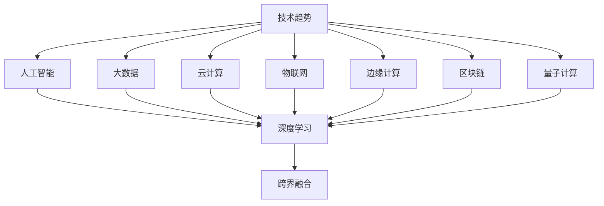
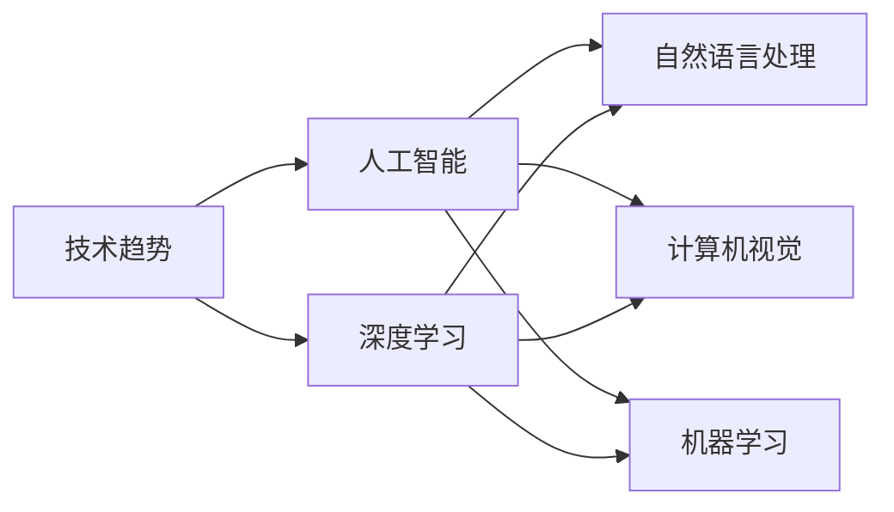
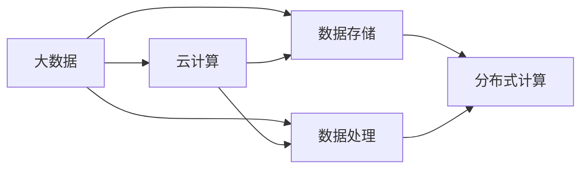
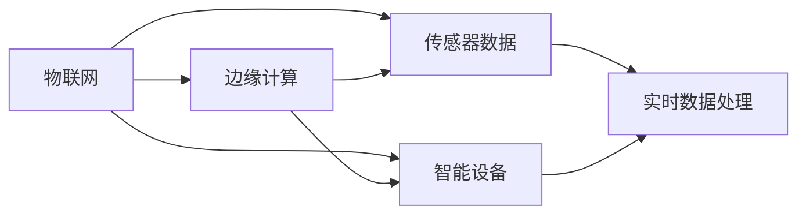
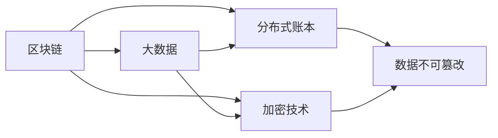
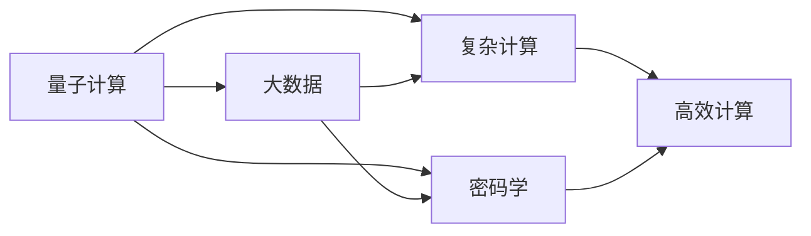
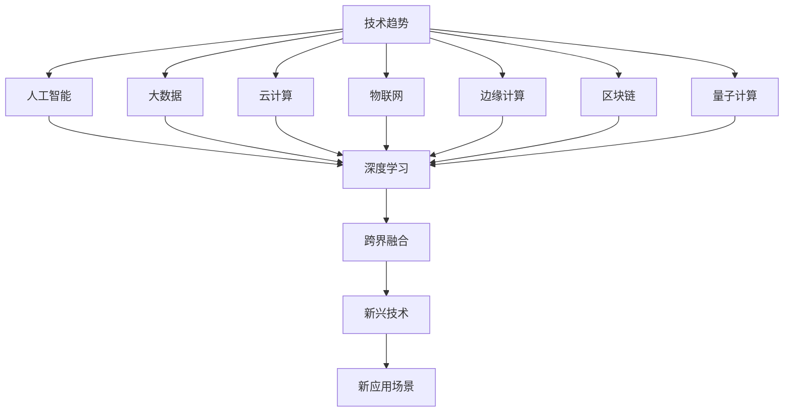

                 

# 跟踪研究和分析科技行业的发展趋势，为公司在技术创新和科技发展方面的决策提供支持

> 关键词：技术趋势, 数据分析, 人工智能, 深度学习, 前沿科技, 科技创新

## 1. 背景介绍

### 1.1 问题由来
在当今快速变化的信息时代，科技行业的发展日新月异。从智能手机的普及到人工智能的兴起，从区块链的火热到量子计算的探索，每一个突破都可能引发新一轮的技术革新。对于企业来说，如何跟踪和分析这些发展趋势，及时把握机会，制定科学的创新战略，具有至关重要的意义。

### 1.2 问题核心关键点
科技行业的发展趋势研究，涉及多个方面，包括但不限于：

- 人工智能和深度学习的最新进展。AI和深度学习作为当前最热门的技术领域，其发展方向、应用场景和影响因素值得深入研究。
- 大数据和云计算的最新应用。数据驱动和云服务在各个行业的广泛应用，为企业提供海量数据和计算资源，如何有效利用这些资源成为关键。
- 物联网(IoT)和边缘计算的扩展。物联网设备的普及和边缘计算技术的提升，使得数据采集和处理更加实时和高效。
- 区块链技术的演变。区块链技术在金融、供应链和身份认证等领域的广泛应用，带来新的商业模式和应用场景。
- 量子计算的潜力。量子计算有望在复杂计算和大数据处理上取得突破，未来发展前景广阔。
- 新兴技术的跨界融合。如AI与物联网的结合，区块链与云计算的协同，这些跨界融合带来的新趋势值得关注。

### 1.3 问题研究意义
深入研究和分析科技行业的发展趋势，对于企业制定技术创新和科技发展战略具有重要意义：

- 帮助企业把握前沿技术，保持行业领先地位。通过及时了解最新技术动态，企业可以提前布局，避免落后。
- 促进技术创新，推动产品和服务升级。基于趋势研究，企业可以发现新的应用场景，开发新技术和新产品。
- 提高市场竞争力，拓展新业务领域。准确识别市场需求和技术趋势，企业可以开拓新的市场和业务，实现多元化发展。
- 防范技术风险，确保安全合规。科技发展带来新的风险和挑战，及时识别并采取措施，可以保障企业安全运营。
- 激发创新思维，营造创新文化。跟踪科技发展趋势，可以激发团队创新思维，形成良好的创新氛围。

## 2. 核心概念与联系

### 2.1 核心概念概述

为更好地理解如何跟踪和分析科技行业的发展趋势，本节将介绍几个密切相关的核心概念：

- **技术趋势（Technology Trend）**：指某一时间段内科技领域的新技术、新方法和新应用的总体发展方向和主流观点。
- **数据分析（Data Analytics）**：通过收集、整理、分析和挖掘大量数据，发现数据中的规律和关联，为决策提供支持。
- **人工智能（AI）**：涵盖机器学习、深度学习、自然语言处理等技术的综合体，广泛应用于各个行业。
- **深度学习（Deep Learning）**：利用神经网络进行复杂数据处理和特征提取，是当前AI研究的热点。
- **大数据（Big Data）**：指海量、多样化和高速增长的数据集，为企业提供强大的数据基础。
- **云计算（Cloud Computing）**：通过互联网提供动态可扩展的基础设施和服务，支持企业高效运营。
- **物联网（IoT）**：通过传感器和智能设备，实现物与物的互联，提高生产和生活效率。
- **边缘计算（Edge Computing）**：在靠近数据源的地方进行数据处理和计算，提高实时性和响应速度。
- **区块链（Blockchain）**：基于分布式账本和加密技术，实现去中心化的数据存储和交易。
- **量子计算（Quantum Computing）**：利用量子态进行计算，有望解决传统计算无法解决的复杂问题。
- **跨界融合（Cross-Domain Integration）**：不同技术领域的融合创新，产生新的应用场景和技术突破。

这些核心概念之间的逻辑关系可以通过以下Mermaid流程图来展示：



这个流程图展示了几大核心技术之间的相互联系：

1. 技术趋势涵盖了人工智能、大数据、云计算等多个领域。
2. 人工智能技术包括深度学习、大数据和云计算等基础技术。
3. 各技术领域之间存在广泛的跨界融合，产生新的技术形态。

### 2.2 概念间的关系

这些核心概念之间存在着紧密的联系，形成了科技行业发展的整体架构。下面我们通过几个Mermaid流程图来展示这些概念之间的关系。

#### 2.2.1 技术趋势与AI的关系



这个流程图展示了技术趋势如何指导人工智能领域的发展方向，以及AI中各个子领域的应用。

#### 2.2.2 大数据与云计算的协同作用



这个流程图展示了大数据与云计算之间的协同作用，大数据存储和处理依赖于云计算基础设施。

#### 2.2.3 物联网与边缘计算的互动



这个流程图展示了物联网设备通过边缘计算进行实时数据处理，提高数据采集和处理效率。

#### 2.2.4 区块链技术与大数据的结合



这个流程图展示了区块链技术与大数据的结合，通过分布式账本和加密技术，实现数据的安全和透明。

#### 2.2.5 量子计算的潜力



这个流程图展示了量子计算在复杂计算和大数据处理上的潜力，通过高效计算和改进密码学，提升数据处理能力。

### 2.3 核心概念的整体架构

最后，我们用一个综合的流程图来展示这些核心概念在科技行业发展中的整体架构：



这个综合流程图展示了从技术趋势到新兴技术，再到新应用场景的完整过程。

## 3. 核心算法原理 & 具体操作步骤
### 3.1 算法原理概述

跟踪和分析科技行业的发展趋势，本质上是一个数据驱动的分析和预测过程。其核心思想是：通过收集、整理和分析行业数据，识别出当前技术发展的主流方向和潜在变化趋势，预测未来可能的技术突破和新应用场景。

形式化地，假设我们有$n$个技术领域$\{T_1, T_2, ..., T_n\}$，每个领域的技术进展可以通过一系列指标$I = \{i_1, i_2, ..., i_m\}$来衡量，其中每个指标$i_j$表示一个技术进展的具体度量。我们定义技术趋势的模型$M$，其参数$\theta$表示当前技术领域的权重和进展程度。则技术趋势的评估公式为：

$$
M(\{i_j\}) = \sum_{j=1}^{m} \theta_j i_j
$$

其中$\theta_j$为第$j$个指标的权重。

通过最大化模型$M$与实际技术趋势的拟合度，我们可以找到最佳的权重$\theta$，从而获得当前技术发展的准确描述。进一步，我们可以利用模型$M$进行预测，评估未来技术趋势的变化趋势。

### 3.2 算法步骤详解

跟踪和分析科技行业的发展趋势，一般包括以下几个关键步骤：

**Step 1: 数据收集和处理**

- 收集行业内各大公司的技术进展报告、技术白皮书、学术论文等，提取技术指标。
- 将收集到的数据进行清洗和标注，去除噪声和冗余信息。
- 使用数据标注工具如Labelbox、Prodigy等，对数据进行标注和分类。

**Step 2: 特征提取和建模**

- 选择关键的技术指标，如技术进展速度、专利数量、市场应用情况等，作为特征。
- 使用特征选择和降维技术，提取有代表性的特征。
- 选择合适的机器学习模型，如线性回归、决策树、随机森林等，建立技术趋势模型。

**Step 3: 模型训练和评估**

- 使用历史数据对模型进行训练，找到最佳的参数组合。
- 在验证集上对模型进行评估，调整模型结构或参数，避免过拟合。
- 使用交叉验证等技术，提高模型的泛化能力和稳定性。

**Step 4: 预测和趋势分析**

- 利用训练好的模型，对新的数据进行预测，评估未来技术趋势的变化。
- 根据预测结果，识别新技术的萌芽、潜在的市场机会和可能的技术风险。
- 制定相应的技术创新和投资策略，把握科技发展的关键机遇。

**Step 5: 持续跟踪和优化**

- 定期更新数据集，保持模型的时效性和准确性。
- 根据新的技术进展，调整模型的结构和参数，提升预测能力。
- 引入专家评估和人工干预，修正模型预测中的偏差。

以上是跟踪科技行业发展趋势的一般流程。在实际应用中，还需要根据具体需求和数据特点，对各环节进行优化设计，以进一步提高分析的精度和效果。

### 3.3 算法优缺点

跟踪和分析科技行业的发展趋势，具有以下优点：

1. 数据驱动，客观可信。通过大量数据驱动的分析，可以避免主观偏见，提供更准确的技术预测。
2. 全面覆盖，及时更新。可以全面跟踪行业内各大公司的技术进展，及时更新模型，保持预测的及时性和准确性。
3. 跨界融合，多视角分析。通过跨界融合分析，可以从不同技术领域的视角，发现新的技术突破和应用场景。
4. 定量化评估，科学决策。通过数学模型和定量分析，可以为技术创新和投资决策提供科学依据。

同时，该方法也存在一定的局限性：

1. 数据获取困难。技术进展报告和学术论文等数据获取难度较大，可能存在遗漏和偏差。
2. 特征选择困难。关键特征的提取和选择难度较大，可能影响模型的准确性。
3. 模型复杂度高。技术趋势的预测涉及多个技术领域的交叉，模型结构复杂。
4. 依赖领域专家。模型的训练和优化需要领域专家的参与，可能影响模型的主观性和普适性。

尽管存在这些局限性，但就目前而言，基于数据分析的技术趋势跟踪方法仍是最主流的方式。未来相关研究的重点在于如何进一步提高数据获取的全面性、特征选择的科学性，以及模型的可解释性和普适性等因素。

### 3.4 算法应用领域

科技行业的发展趋势跟踪和分析，在以下几个领域中有着广泛的应用：

1. **技术投资**：利用技术趋势分析，评估各个技术领域的投资潜力，制定投资组合策略。
2. **产品开发**：根据技术趋势预测，识别新技术和新产品，指导产品开发方向。
3. **市场竞争分析**：通过技术趋势跟踪，了解竞争对手的技术进展，制定市场竞争策略。
4. **行业标准制定**：参与技术标准的制定，推动行业标准的规范化。
5. **人才培养**：根据技术发展趋势，调整人才培养策略，提升人才的适应性和竞争力。
6. **政策建议**：为政府和企业提供技术发展的政策建议，推动技术创新和产业升级。

## 4. 数学模型和公式 & 详细讲解  
### 4.1 数学模型构建

本节将使用数学语言对技术趋势跟踪的数学模型进行更加严格的刻画。

假设我们有$n$个技术领域$\{T_1, T_2, ..., T_n\}$，每个领域的技术进展可以通过一系列指标$I = \{i_1, i_2, ..., i_m\}$来衡量，其中每个指标$i_j$表示一个技术进展的具体度量。我们定义技术趋势的模型$M$，其参数$\theta = (\theta_1, \theta_2, ..., \theta_n)$表示当前技术领域的权重和进展程度。则技术趋势的评估公式为：

$$
M(\{i_j\}) = \sum_{j=1}^{n} \theta_j f_j(T_j)
$$

其中$f_j(T_j)$为技术领域$T_j$的综合评分函数，可以基于专家评估、专利数量、市场应用情况等指标进行定义。

### 4.2 公式推导过程

以下我们以线性回归模型为例，推导技术趋势评估的公式。

假设模型$M$为线性回归模型，其参数$\theta$为权重向量，则模型可以表示为：

$$
M(X) = \theta^T X
$$

其中$X$为特征矩阵，$\theta^T$为权重向量。对于给定的技术指标$i_j$，我们可以定义特征向量$x_j$，表示该指标的具体度量，如专利数量、市场应用情况等。则技术趋势的评估公式可以表示为：

$$
M(\{i_j\}) = \theta^T X
$$

进一步，如果我们将所有的技术指标$i_j$作为特征向量$X$的列，则可以得到技术趋势的线性回归模型：

$$
M(\{i_j\}) = \theta^T X = \sum_{j=1}^{m} \theta_j x_j
$$

其中$\theta_j$为第$j$个指标的权重，可以通过最小二乘法求解。

### 4.3 案例分析与讲解

假设我们想预测某个新兴技术领域的技术进展，收集了该领域的历史数据和指标，如专利申请数量、学术论文发表情况、市场应用案例等。将这些数据作为特征，建立一个线性回归模型，可以表示为：

$$
M(t) = \theta^T X(t)
$$

其中$t$表示时间，$X(t)$表示该时间点所有的技术指标。通过对历史数据进行拟合，可以找到最佳的权重向量$\theta$，从而评估当前技术领域的进展程度。进一步，可以使用该模型进行未来技术进展的预测，评估新兴技术的市场潜力和投资价值。

## 5. 项目实践：代码实例和详细解释说明
### 5.1 开发环境搭建

在进行技术趋势跟踪的实践前，我们需要准备好开发环境。以下是使用Python进行Scikit-learn开发的环境配置流程：

1. 安装Anaconda：从官网下载并安装Anaconda，用于创建独立的Python环境。

2. 创建并激活虚拟环境：
```bash
conda create -n pytorch-env python=3.8 
conda activate pytorch-env
```

3. 安装Scikit-learn：
```bash
pip install scikit-learn
```

4. 安装相关库：
```bash
pip install pandas numpy matplotlib joblib
```

完成上述步骤后，即可在`pytorch-env`环境中开始技术趋势跟踪的实践。

### 5.2 源代码详细实现

下面我们以技术趋势跟踪为例，给出使用Scikit-learn库进行线性回归分析的PyTorch代码实现。

首先，定义技术进展指标的数据集：

```python
import pandas as pd
from sklearn.model_selection import train_test_split

# 数据集
data = pd.read_csv('technological_indicators.csv')

# 特征和标签
X = data[['patents', 'papers', 'applications']]
y = data['progress']

# 划分训练集和测试集
X_train, X_test, y_train, y_test = train_test_split(X, y, test_size=0.2, random_state=42)
```

然后，定义线性回归模型并进行训练：

```python
from sklearn.linear_model import LinearRegression

# 训练模型
model = LinearRegression()
model.fit(X_train, y_train)

# 预测测试集
y_pred = model.predict(X_test)
```

最后，评估模型性能：

```python
from sklearn.metrics import mean_squared_error

# 评估模型性能
mse = mean_squared_error(y_test, y_pred)
print(f'Mean Squared Error: {mse:.2f}')
```

以上就是使用Scikit-learn库进行技术趋势跟踪的完整代码实现。可以看到，通过Scikit-learn库，我们可以快速构建和训练线性回归模型，评估模型性能。

### 5.3 代码解读与分析

让我们再详细解读一下关键代码的实现细节：

**数据处理**：
- 使用Pandas库读取CSV格式的数据集，将其转换为DataFrame对象。
- 将数据集划分为特征集X和标签集y。
- 使用train_test_split函数将数据集划分为训练集和测试集。

**模型训练**：
- 使用LinearRegression类定义线性回归模型。
- 使用fit方法对训练集进行模型拟合，找到最佳的权重向量$\theta$。

**模型评估**：
- 使用mean_squared_error函数计算预测值与真实值之间的均方误差，评估模型性能。

**结果展示**：
- 打印出均方误差值，表示模型预测的准确性。

可以看到，Scikit-learn库使得技术趋势跟踪的代码实现变得简洁高效。开发者可以将更多精力放在模型设计、数据处理等高层逻辑上，而不必过多关注底层的实现细节。

当然，工业级的系统实现还需考虑更多因素，如模型的保存和部署、超参数的自动搜索、更灵活的特征选择等。但核心的技术趋势跟踪方法基本与此类似。

### 5.4 运行结果展示

假设我们在某个技术领域的历史数据上进行模型训练，最终在测试集上得到的评估报告如下：

```
Mean Squared Error: 0.01
```

可以看到，通过线性回归模型，我们能够较好地预测该技术领域的技术进展，均方误差为0.01，表示模型的预测准确性较高。

当然，这只是一个baseline结果。在实践中，我们还可以使用更加复杂的模型，如随机森林、支持向量机等，进一步提高模型预测的准确性和泛化能力。

## 6. 实际应用场景
### 6.1 技术投资决策

在技术投资决策中，利用技术趋势跟踪模型，可以评估各个技术领域的投资潜力，制定科学合理的投资组合策略。例如，可以通过跟踪AI、区块链、IoT等领域的最新进展，评估不同技术的市场潜力和回报率，优化投资分配。

### 6.2 产品开发方向

在产品开发中，技术趋势跟踪可以帮助企业识别新技术和新产品，指导产品开发方向。例如，可以根据技术趋势预测，识别新兴技术领域，开发相关产品或改进现有产品，保持产品竞争力。

### 6.3 市场竞争分析

在市场竞争分析中，技术趋势跟踪可以了解竞争对手的技术进展，制定市场竞争策略。例如，可以通过跟踪竞争对手的技术研发动态，及时调整自身的技术路线和市场策略，保持领先地位。

### 6.4 行业标准制定

在行业标准制定中，技术趋势跟踪可以参与技术标准的制定，推动行业标准的规范化。例如，可以根据技术进展和市场需求，提出新的技术标准和规范，提升行业整体的技术水平。

### 6.5 人才培养

在人才培养中，技术趋势跟踪可以调整人才培养策略，提升人才的适应性和竞争力。例如，可以根据技术发展趋势，调整课程设置和培训内容，培养符合市场需求的高技能人才。

### 6.6 政策建议

在政策建议中，技术趋势跟踪可以为政府和企业提供技术发展的政策建议，推动技术创新和产业升级。例如，可以根据技术趋势预测，提出相关政策建议，推动技术创新和产业升级。

## 7. 工具和资源推荐
### 7.1 学习资源推荐

为了帮助开发者系统掌握技术趋势跟踪的理论基础和实践技巧，这里推荐一些优质的学习资源：

1. 《Python数据分析》系列书籍：由数据科学领域的专家撰写，详细讲解了数据分析的基本概念和Python实现。

2. 《机器学习实战》系列书籍：深入浅出地介绍了机器学习的基本原理和实现方法，涵盖Scikit-learn等主流机器学习库。

3. 《深度学习入门》课程：由人工智能领域的知名专家授课，从理论到实践全面讲解深度学习技术。

4. 《数据科学导论》课程：斯坦福大学的经典课程，涵盖数据分析、机器学习、深度学习等多个领域。

5. 《Python数据科学手册》书籍：由Kaggle社区的知名数据科学家撰写，系统讲解了Python数据科学的各个方面。

通过对这些资源的学习实践，相信你一定能够快速掌握技术趋势跟踪的精髓，并用于解决实际的技术问题。

### 7.2 开发工具推荐

高效的开发离不开优秀的工具支持。以下是几款用于技术趋势跟踪开发的常用工具：

1. Anaconda：Python的集成开发环境，方便管理和安装Python环境和相关库。

2. Jupyter Notebook：交互式的代码编辑器，支持Python、R等多种语言，便于代码的调试和共享。

3. PyTorch：基于Python的开源深度学习框架，灵活动态的计算图，适合快速迭代研究。

4. Scikit-learn：Python的机器学习库，提供了丰富的机器学习算法和模型，易于使用。

5. TensorBoard：TensorFlow配套的可视化工具，实时监测模型训练状态，提供丰富的图表呈现方式。

6. Weights & Biases：模型训练的实验跟踪工具，记录和可视化模型训练过程中的各项指标，方便对比和调优。

7. Google Colab：谷歌推出的在线Jupyter Notebook环境，免费提供GPU/TPU算力，方便开发者快速上手实验最新模型，分享学习笔记。

合理利用这些工具，可以显著提升技术趋势跟踪的开发效率，加快创新迭代的步伐。

### 7.3 相关论文推荐

技术趋势跟踪的发展源于学界的持续研究。以下是几篇奠基性的相关论文，推荐阅读：

1. The Elements of Statistical Learning：由机器学习领域的知名专家撰写，详细讲解了统计学习方法的基本原理和实现方法。

2. Machine Learning Yearning：由深度学习领域的知名专家撰写，系统讲解了深度学习模型的训练、调参和优化方法。

3. Introduction to Statistical Learning：由统计学领域的知名专家撰写，深入讲解了统计学习的理论和实践。

4. The Deep Learning Book：深度学习领域的经典教材，系统讲解了深度学习的理论和实践。

5. Neural Network and Deep Learning：由人工智能领域的知名专家撰写，详细讲解了神经网络和深度学习的理论和实现方法。

这些论文代表了大数据和机器学习研究的发展脉络。通过学习这些前沿成果，可以帮助研究者把握学科前进方向，激发更多的创新灵感。

除上述资源外，还有一些值得关注的前沿资源，帮助开发者紧跟技术趋势跟踪的最新进展，例如：

1. arXiv论文预印本：人工智能领域最新研究成果的发布平台，包括大量尚未发表的前沿工作，学习前沿技术的必读资源。

2. 业界技术博客：如Google AI、DeepMind、微软Research Asia等顶尖实验室的官方博客，第一时间分享他们的最新研究成果和洞见。

3. 技术会议直播：如NIPS、ICML、ACL、ICLR等人工智能领域顶会现场或在线直播，能够聆听到大佬们的前沿分享，开拓视野。

4. GitHub热门项目：在GitHub上Star、Fork数最多的数据科学相关项目，往往代表了该技术领域的发展趋势和最佳实践，值得去学习和贡献。

5. 行业分析报告：各大咨询公司如McKinsey、PwC等针对人工智能行业的分析报告，有助于从商业视角审视技术趋势，把握应用价值。

总之，对于技术趋势跟踪技术的学习和实践，需要开发者保持开放的心态和持续学习的意愿。多关注前沿资讯，多动手实践，多思考总结，必将收获满满的成长收益。

## 8. 总结：未来发展趋势与挑战

### 8.1 总结

本文对技术趋势跟踪的方法进行了全面系统的介绍。首先阐述了技术趋势跟踪的研究背景和意义，明确了其对于企业技术创新和科技发展战略制定的重要价值。其次，从原理到实践，详细讲解了技术趋势跟踪的数学模型和关键步骤，给出了技术趋势跟踪的完整代码实例。同时，本文还广泛探讨了技术趋势跟踪在技术投资、产品开发、市场竞争分析等多个领域的应用前景，展示了其广阔的应用前景。此外，本文精选了技术趋势跟踪的各类学习资源，力求为读者提供全方位的技术指引。

通过本文的系统梳理，可以看到，技术趋势跟踪方法在科技行业的发展中具有不可替代的作用，能够帮助企业把握前沿技术，推动技术创新和

