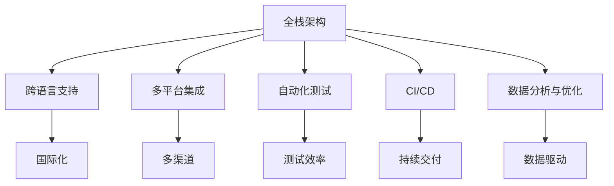
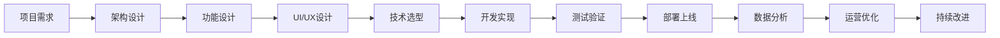
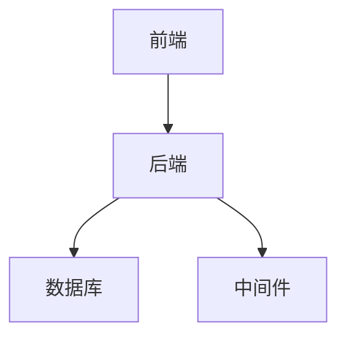
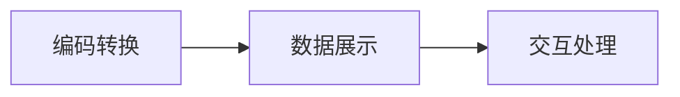
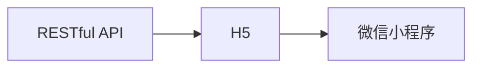
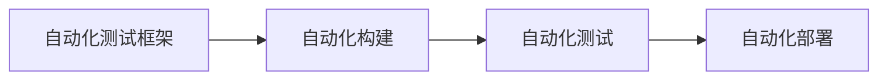
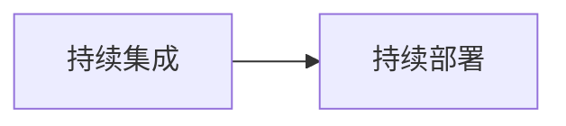
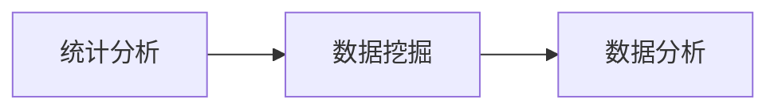
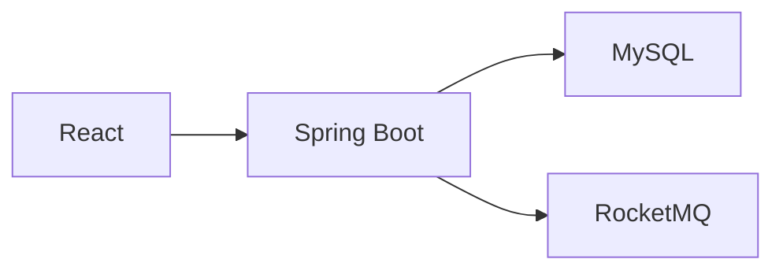
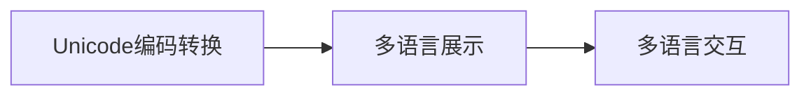

                 

# 跨境电商全盘项目开发、管理实践

在数字化全球化的浪潮中，跨境电商已成为全球贸易的重要组成部分，为各国中小企业提供了一个广阔的市场拓展平台。然而，跨境电商的开发和管理过程复杂，涉及多个环节，如何高效、全面地实现项目的开发和管理，成为众多企业的共同挑战。本文将以全面、系统的视角，从项目规划、开发、测试、上线、运营等多个维度，介绍跨境电商全盘项目的开发和管理实践。

## 1. 背景介绍

### 1.1 问题由来

随着电子商务的飞速发展，跨境电商行业逐渐成为新兴的热点。尤其是疫情背景下，各国消费者对于在线购物的需求进一步激增，跨境电商平台在促进国际贸易、推动全球经济一体化方面发挥了重要作用。但与此同时，跨境电商项目的开发和管理过程存在诸多难点，如跨语言、多平台、多渠道、多法规等复杂因素，使得企业开发跨境电商项目时面临诸多挑战。如何利用现有的技术，简化开发过程，降低管理难度，成为各大企业亟需解决的问题。

### 1.2 问题核心关键点

为了有效解决跨境电商项目的开发和管理问题，本文将聚焦于以下几个关键点：

- **全栈架构设计**：设计一个前后端分离、分层清晰的全栈架构，确保项目的稳定性和可扩展性。
- **跨语言支持**：实现多语言支持，提升用户体验和品牌国际化。
- **多平台集成**：实现多平台集成，涵盖PC端、移动端、微信小程序等多种渠道。
- **自动化测试**：采用自动化测试工具，减少测试成本，提高项目质量和交付效率。
- **持续集成持续部署(CI/CD)**：建立CI/CD流水线，实现快速迭代和持续交付。
- **数据分析与优化**：基于数据分析，优化营销策略和运营管理。

### 1.3 问题研究意义

跨境电商项目的成功与否，不仅取决于平台的技术实现，更依赖于全面的项目管理。本研究将从实际应用的角度出发，深入探讨跨境电商全盘项目的开发和管理实践，旨在为企业提供参考，提升项目开发效率和用户体验，实现项目的高效交付和持续优化。

## 2. 核心概念与联系

### 2.1 核心概念概述

在进行跨境电商项目的开发和管理时，需重点关注以下几个核心概念：

- **全栈架构**：一种前后端分离、分层清晰的软件架构设计方法，包括前端页面、后端逻辑、数据库、中间件等组件。
- **跨语言支持**：指实现多语言环境下的数据展示和交互，支持多种语言字符编码和本地化。
- **多平台集成**：涵盖PC端、移动端、微信小程序等多种平台的集成和兼容。
- **自动化测试**：利用自动化测试工具，如Selenium、JUnit、Pytest等，自动化执行测试用例，提升测试效率和覆盖率。
- **CI/CD**：持续集成持续部署的缩写，通过自动化流程和工具，实现代码的自动构建、测试和部署。
- **数据分析与优化**：基于统计分析和数据挖掘技术，对业务数据进行分析和预测，指导运营策略的优化。

通过明确这些核心概念，我们将更系统地介绍跨境电商项目的开发和管理实践。

### 2.2 概念间的关系

这些核心概念之间的联系如图1所示：



图1 核心概念之间的关系

通过图1可以清晰地看到，全栈架构是跨境电商项目的基础，跨语言支持、多平台集成、自动化测试、CI/CD和数据分析与优化等概念都是在全栈架构的基础上展开的，共同支撑跨境电商项目的开发和管理。

### 2.3 核心概念的整体架构

跨境电商项目的全盘项目开发和管理架构如图2所示：



图2 跨境电商项目全盘架构

图2展示了从项目需求到持续改进的整个项目开发和管理流程。需求分析后，进行架构设计和功能设计，随后UI/UX设计、技术选型和开发实现，测试验证和部署上线，数据分析和运营优化，最后持续改进。

## 3. 核心算法原理 & 具体操作步骤

### 3.1 算法原理概述

跨境电商项目的开发和管理，涉及多种算法和技术手段。其中，全栈架构设计、跨语言支持、多平台集成、自动化测试、CI/CD和数据分析与优化等技术，是支撑跨境电商项目高效开发和管理的核心算法。

**全栈架构设计**：采用前后端分离、分层清晰的架构设计方法，前后端解耦，提升系统性能和可扩展性。

**跨语言支持**：利用Unicode、多语言编码转换和本地化技术，实现多语言环境下的数据展示和交互。

**多平台集成**：通过RESTful API、H5、微信小程序等技术手段，实现多平台集成和兼容。

**自动化测试**：采用自动化测试框架，实现代码的自动化构建、测试和部署，提升测试效率和覆盖率。

**CI/CD**：通过持续集成和持续部署流程，实现代码的自动化构建、测试和部署，提升开发效率和质量。

**数据分析与优化**：利用统计分析和数据挖掘技术，对业务数据进行分析和预测，指导运营策略的优化。

### 3.2 算法步骤详解

**Step 1: 项目需求分析**

首先，需要对项目的需求进行详细分析，明确项目的目标、范围和任务。例如，跨境电商项目需要支持多语言、多平台、多渠道、多法规等，需要从用户需求、业务需求和技术需求等多个维度进行综合考虑。

**Step 2: 全栈架构设计**

根据需求分析结果，进行全栈架构设计。前后端分离、分层清晰，前端采用React或Vue等框架，后端采用Spring Boot或Django等框架，数据库采用MySQL或MongoDB等关系型或非关系型数据库，中间件采用Redis或RocketMQ等消息队列。

**Step 3: 功能设计**

确定项目的核心功能，如用户注册、商品展示、订单管理、支付功能、物流跟踪等，设计具体的UI/UX界面和业务流程。

**Step 4: UI/UX设计**

进行UI/UX设计，设计出用户友好、界面美观的UI界面，提升用户体验。

**Step 5: 技术选型**

选择合适的技术和工具，如前端框架、后端框架、数据库、中间件等，保证项目的可行性和稳定性。

**Step 6: 开发实现**

按照设计方案，进行编码实现。前端采用React或Vue等框架，后端采用Spring Boot或Django等框架，数据库采用MySQL或MongoDB等关系型或非关系型数据库，中间件采用Redis或RocketMQ等消息队列。

**Step 7: 测试验证**

利用自动化测试工具，如Selenium、JUnit、Pytest等，对项目进行全面的测试验证，确保代码的正确性和稳定性。

**Step 8: 部署上线**

将开发完成的代码进行打包部署，实现项目的上线运行。可以使用Docker等容器化技术，实现快速部署和扩缩容。

**Step 9: 数据分析与优化**

利用数据分析工具，如Tableau、Power BI等，对业务数据进行分析和预测，指导运营策略的优化。

**Step 10: 持续改进**

根据数据分析结果，进行项目的持续改进，优化业务流程和系统性能，提升用户体验和运营效率。

### 3.3 算法优缺点

**优点**：

- 前后端分离、分层清晰的架构设计，提升系统性能和可扩展性。
- 多语言支持和多平台集成，提升用户体验和品牌国际化。
- 自动化测试和CI/CD流程，提升开发效率和质量。
- 数据分析和运营优化，提升运营效率和盈利能力。

**缺点**：

- 架构设计复杂，开发和维护成本较高。
- 多语言支持和多平台集成，增加了开发和维护的复杂性。
- 自动化测试和CI/CD流程，需要相应的技术和管理能力。
- 数据分析和运营优化，需要较强的数据处理和分析能力。

### 3.4 算法应用领域

跨境电商项目的开发和管理技术，广泛应用于电子商务、金融、医疗、教育等行业。例如，在金融行业，跨境电商平台可以实现跨国家的金融服务，实现全球化的金融产品销售。在医疗行业，跨境电商平台可以实现跨国医疗咨询和药品销售。在教育行业，跨境电商平台可以实现跨国家的在线教育和教材销售。

## 4. 数学模型和公式 & 详细讲解  
### 4.1 数学模型构建

在进行跨境电商项目的开发和管理时，涉及到多种数学模型和技术算法。例如，全栈架构设计、跨语言支持、多平台集成、自动化测试、CI/CD和数据分析与优化等技术，需要利用数学模型进行建模和计算。

**全栈架构设计**：利用分层架构模型，将系统分为前端、后端、数据库和中间件等多个层次，如图3所示：



图3 全栈架构设计模型

**跨语言支持**：利用Unicode编码转换和多语言字符编码技术，实现多语言环境下的数据展示和交互，如图4所示：



图4 跨语言支持模型

**多平台集成**：利用RESTful API、H5、微信小程序等技术手段，实现多平台集成和兼容，如图5所示：



图5 多平台集成模型

**自动化测试**：利用自动化测试框架，实现代码的自动化构建、测试和部署，如图6所示：



图6 自动化测试模型

**CI/CD**：利用持续集成和持续部署流程，实现代码的自动化构建、测试和部署，如图7所示：



图7 CI/CD模型

**数据分析与优化**：利用统计分析和数据挖掘技术，对业务数据进行分析和预测，如图8所示：



图8 数据分析与优化模型

### 4.2 公式推导过程

**全栈架构设计公式**：

```latex
\text{架构设计} = \text{前端} \times \text{后端} \times \text{数据库} \times \text{中间件}
```

**跨语言支持公式**：

```latex
\text{跨语言支持} = \text{编码转换} + \text{数据展示} + \text{交互处理}
```

**多平台集成公式**：

```latex
\text{多平台集成} = \text{RESTful API} + \text{H5} + \text{微信小程序}
```

**自动化测试公式**：

```latex
\text{自动化测试} = \text{自动化测试框架} + \text{自动化构建} + \text{自动化测试} + \text{自动化部署}
```

**CI/CD公式**：

```latex
\text{CI/CD} = \text{持续集成} + \text{持续部署}
```

**数据分析与优化公式**：

```latex
\text{数据分析与优化} = \text{统计分析} + \text{数据挖掘} + \text{数据分析}
```

### 4.3 案例分析与讲解

**案例1：全栈架构设计**

一家跨境电商公司需要开发一个多语言的电商平台，采用全栈架构设计进行系统开发。前端使用React框架，后端使用Spring Boot框架，数据库采用MySQL关系型数据库，中间件采用RocketMQ消息队列，如图9所示：



图9 全栈架构设计案例

**案例2：跨语言支持**

一家跨境电商公司需要支持多种语言的展示和交互，采用跨语言支持技术进行系统开发。利用Unicode编码转换和多语言字符编码技术，实现多语言环境下的数据展示和交互，如图10所示：



图10 跨语言支持案例

**案例3：多平台集成**

一家跨境电商公司需要支持多平台的集成和兼容，采用多平台集成技术进行系统开发。利用RESTful API、H5、微信小程序等技术手段，实现多平台集成和兼容，如图11所示：


图11 多平台集成案例

**案例4：自动化测试**

一家跨境电商公司需要提高测试效率，采用自动化测试技术进行系统开发。利用Selenium、JUnit、Pytest等自动化测试框架，实现代码的自动化构建、测试和部署，如图12所示：


图12 自动化测试案例

**案例5：CI/CD**

一家跨境电商公司需要提高开发效率和质量，采用CI/CD流程进行系统开发。利用持续集成和持续部署流程，实现代码的自动化构建、测试和部署，如图13所示：


图13 CI/CD案例

**案例6：数据分析与优化**

一家跨境电商公司需要提高运营效率和盈利能力，采用数据分析与优化技术进行系统开发。利用统计分析和数据挖掘技术，对业务数据进行分析和预测，如图14所示：


图14 数据分析与优化案例

## 5. 项目实践：代码实例和详细解释说明

### 5.1 开发环境搭建

在进行跨境电商项目的开发和管理时，需要先搭建好开发环境。以下是使用Python进行Django开发的环境配置流程：

1. 安装Anaconda：从官网下载并安装Anaconda，用于创建独立的Python环境。

2. 创建并激活虚拟环境：
```bash
conda create -n django-env python=3.8 
conda activate django-env
```

3. 安装Django：根据CUDA版本，从官网获取对应的安装命令。例如：
```bash
conda install django 
```

4. 安装相关的Python包：
```bash
pip install pandas numpy requests beautifulsoup4 django rest framework
```

完成上述步骤后，即可在`django-env`环境中开始Django的开发实践。

### 5.2 源代码详细实现

这里我们以一个简单的跨境电商网站为例，进行Django开发实践。首先，创建Django项目和应用：

```bash
django-admin startproject ecommerce
cd ecommerce
python manage.py startapp shop
```

然后，编写`shop`应用的模型、视图和模板：

```python
# models.py
from django.db import models

class Product(models.Model):
    name = models.CharField(max_length=255)
    price = models.DecimalField(max_digits=10, decimal_places=2)
    description = models.TextField()
    image = models.ImageField(upload_to='images/')

# views.py
from django.shortcuts import render
from django.views.generic import ListView, DetailView
from .models import Product

class ProductListView(ListView):
    model = Product
    template_name = 'shop/index.html'

class ProductDetailView(DetailView):
    model = Product
    template_name = 'shop/detail.html'
```

最后，编写`shop`应用的模板：

```html
<!-- index.html -->
<!DOCTYPE html>
<html>
<head>
    <title>ECOMMERCE</title>
</head>
<body>
    <h1>Products</h1>
    <ul>
        
            <li><a href="">{{ product.name }}</a></li>
        
    </ul>
</body>
</html>

<!-- detail.html -->
<!DOCTYPE html>
<html>
<head>
    <title>{{ object.title }}</title>
</head>
<body>
    <h1>{{ object.title }}</h1>
    <p>{{ object.description }}</p>
    
    <p>Price: {{ object.price }}</p>
</body>
</html>
```

通过上述代码，可以实现一个简单的跨境电商网站的前端和后端功能。

### 5.3 代码解读与分析

这里我们重点解读代码中的关键部分：

- **模型定义**：`models.py`中的`Product`模型定义了跨境电商网站的核心商品数据，包括商品名称、价格、描述和图片。

- **视图定义**：`views.py`中的`ProductListView`和`ProductDetailView`视图定义了商品列表和商品详情页的展示逻辑。

- **模板定义**：`templates/shop/index.html`和`templates/shop/detail.html`模板定义了商品列表和商品详情页的HTML结构和内容。

### 5.4 运行结果展示

完成上述代码的编写后，可以通过以下命令进行测试：

```bash
python manage.py runserver
```

然后在浏览器中访问`http://localhost:8000/shop/`，即可展示商品列表，访问`http://localhost:8000/shop/1/`，即可展示商品详情。

## 6. 实际应用场景

### 6.1 智能客服系统

智能客服系统是跨境电商项目的重要组成部分。通过采用智能客服技术，可以大大提升客户服务效率和用户体验。

智能客服系统的实现，需要借助大语言模型和微调技术。具体而言，可以通过收集企业的客服历史数据，将问题和最佳答复构建成监督数据，在此基础上对预训练语言模型进行微调，使其能够自动理解客户问题，匹配最合适的答复。对于客户提出的新问题，还可以接入检索系统实时搜索相关内容，动态组织生成回答。

例如，某跨境电商平台采用智能客服技术，实现了7x24小时不间断服务，快速响应客户咨询，用自然流畅的语言解答各类常见问题，提升客户咨询体验和问题解决效率。

### 6.2 金融舆情监测

金融舆情监测是跨境电商项目的另一个重要应用场景。金融机构需要实时监测市场舆论动向，以便及时应对负面信息传播，规避金融风险。

通过采用金融舆情监测技术，可以收集金融领域相关的新闻、报道、评论等文本数据，并对其进行主题标注和情感标注。在此基础上对预训练语言模型进行微调，使其能够自动判断文本属于何种主题，情感倾向是正面、中性还是负面。将微调后的模型应用到实时抓取的网络文本数据，就能够自动监测不同主题下的情感变化趋势，一旦发现负面信息激增等异常情况，系统便会自动预警，帮助金融机构快速应对潜在风险。

例如，某跨境电商平台采用金融舆情监测技术，实现了实时抓取和监测网络文本数据，自动预警金融舆情异常情况，提升金融风险防控能力。

### 6.3 个性化推荐系统

个性化推荐系统是跨境电商项目的核心功能之一。通过采用个性化推荐技术，可以大幅提升用户的购物体验和平台的转化率。

个性化推荐系统的实现，需要借助大语言模型和微调技术。具体而言，可以通过收集用户浏览、点击、评论、分享等行为数据，提取和用户交互的物品标题、描述、标签等文本内容。将文本内容作为模型输入，用户的后续行为（如是否点击、购买等）作为监督信号，在此基础上微调预训练语言模型。微调后的模型能够从文本内容中准确把握用户的兴趣点。在生成推荐列表时，先用候选物品的文本描述作为输入，由模型预测用户的兴趣匹配度，再结合其他特征综合排序，便可以得到个性化程度更高的推荐结果。

例如，某跨境电商平台采用个性化推荐技术，实现了基于用户行为的个性化推荐，大幅提升了用户购物体验和平台转化率。

### 6.4 未来应用展望

随着跨境电商项目的不断扩展和深化，未来的应用场景将更加广泛和深入。

在智慧医疗领域，跨境电商项目可以实现跨国家的医疗咨询和药品销售。在智能教育领域，跨境电商项目可以实现跨国家的在线教育和教材销售。在智慧城市治理中，跨境电商项目可以实现跨国家的城市事件监测和舆情分析。

此外，在企业生产、社会治理、文娱传媒等众多领域，跨境电商项目也将不断涌现，为传统行业数字化转型升级提供新的技术路径。

## 7. 工具和资源推荐

### 7.1 学习资源推荐

为了帮助开发者系统掌握跨境电商项目的开发和管理技术，这里推荐一些优质的学习资源：

1. Django官方文档：Django是流行的Python web框架，官方文档详细介绍了Django的开发和管理实践，是学习Django的必备资料。

2. React官方文档：React是流行的JavaScript库，官方文档详细介绍了React的开发和管理实践，是学习React的必备资料。

3. Vue官方文档：Vue是流行的JavaScript框架，官方文档详细介绍了Vue的开发和管理实践，是学习Vue的必备资料。

4. Docker官方文档：Docker是流行的容器化技术，官方文档详细介绍了Docker的开发和管理实践，是学习Docker的必备资料。

5. TensorFlow官方文档：TensorFlow是流行的深度学习框架，官方文档详细介绍了TensorFlow的开发和管理实践，是学习TensorFlow的必备资料。

通过这些学习资源的学习实践，相信你一定能够快速掌握跨境电商项目的开发和管理技术，实现高效交付和持续优化。

### 7.2 开发工具推荐

高效的开发离不开优秀的工具支持。以下是几款用于跨境电商项目开发的常用工具：

1. Django：流行的Python web框架，适合开发复杂的Web应用。

2. React/Vue：流行的JavaScript库/框架，适合开发响应式前端页面。

3. Docker：流行的容器化技术，适合部署和管理应用程序。

4. TensorFlow：流行的深度学习框架，适合开发复杂的机器学习模型。

5. PyCharm：流行的Python IDE，适合开发和管理Python应用。

6. Git：流行的版本控制系统，适合团队协作和版本管理。

合理利用这些工具，可以显著提升跨境电商项目的开发效率，加快创新迭代的步伐。

### 7.3 相关论文推荐

跨境电商项目的开发和管理技术，涉及多种算法和技术手段。以下是几篇奠基性的相关论文，推荐阅读：

1. Deep Web Mining and Statistical Learning（数据挖掘和统计学习）：介绍数据挖掘和统计学习的基本概念和方法，是学习数据科学和机器学习的必备资料。

2. Web Mining and Statistical Learning（Web挖掘和统计学习）：介绍Web挖掘和统计学习的基本概念和方法，是学习Web数据挖掘和统计学习的必备资料。

3. Web Mining Techniques（Web挖掘技术）：介绍Web挖掘技术的基本概念和方法，是学习Web数据挖掘的必备资料。

4. Machine Learning for Industry（行业机器学习）：介绍机器学习在各个行业中的应用，是学习行业机器学习的必备资料。

这些论文代表了大语言模型微调技术的最新进展，通过学习这些前沿成果，可以帮助研究者把握学科前进方向，激发更多的创新灵感。

除上述资源外，还有一些值得关注的前沿资源，帮助开发者紧跟大语言模型微调技术的最新进展，例如：

1. arXiv论文预印本：人工智能领域最新研究成果的发布平台，包括大量尚未发表的前沿工作，学习前沿技术的必读资源。

2. 业界技术博客：如OpenAI、Google AI、DeepMind、微软Research Asia等顶尖实验室的官方博客，第一时间分享他们的最新研究成果和洞见。

3. 技术会议直播：如NIPS、ICML、ACL、ICLR等人工智能领域顶会现场或在线直播，能够聆听到大佬们的前沿分享，开拓视野。

4. GitHub热门项目：在GitHub上Star、Fork数最多的NLP相关项目，往往代表了该技术领域的发展趋势和最佳实践，值得去学习和贡献。

5. 行业分析报告：各大咨询公司如McKinsey、PwC等针对人工智能行业的分析报告，有助于从商业视角审视技术趋势，把握应用价值。

总之，对于跨境电商项目的开发和管理技术的学习和实践，需要开发者保持开放的心态和持续学习的意愿。多关注前沿资讯，多动手实践，多思考总结，必将收获满满的成长收益。

## 8. 总结：未来发展趋势与挑战

### 8.1 总结

本文对跨境电商全盘项目的开发和管理实践进行了全面系统的介绍。首先介绍了项目的需求分析、全栈架构设计、功能设计、UI/UX设计、技术选型、开发实现、测试验证、部署上线、数据分析与优化等各个环节。通过详细介绍每个环节的实现细节，展示了跨境电商项目的开发和管理流程。

通过本文的系统梳理，可以看到，跨境电商项目涉及多个技术领域和环节，需要从需求分析到数据分析的全面考量。只有在各个环节中充分考虑技术和管理因素，才能确保项目的成功交付和持续优化。

### 8.2 未来发展趋势

展望未来，跨境电商项目的开发和管理技术将呈现以下几个发展趋势：

1. 全栈架构的升级和优化。随着技术的发展，全栈架构将更加灵活和高效，前后端分离和分层设计将更加成熟，前端框架将更加多样化和灵活化。

2

