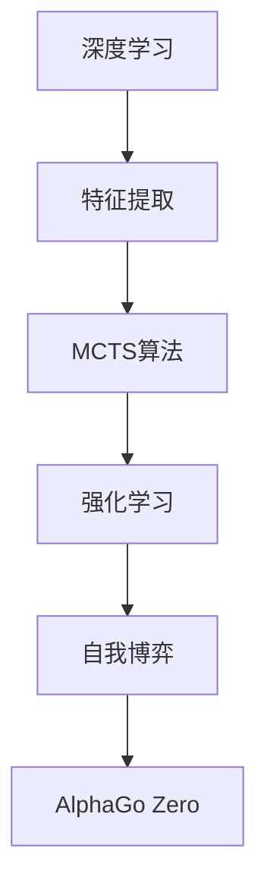
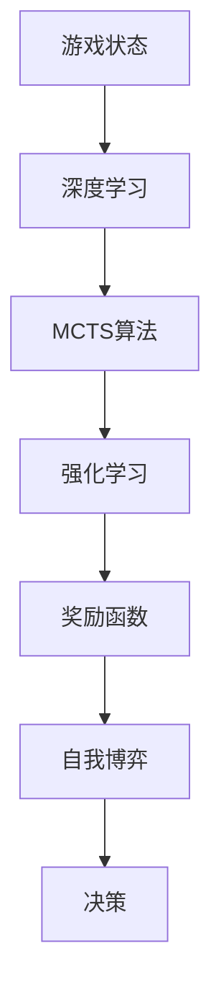
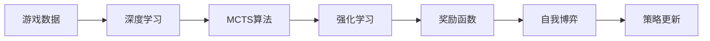
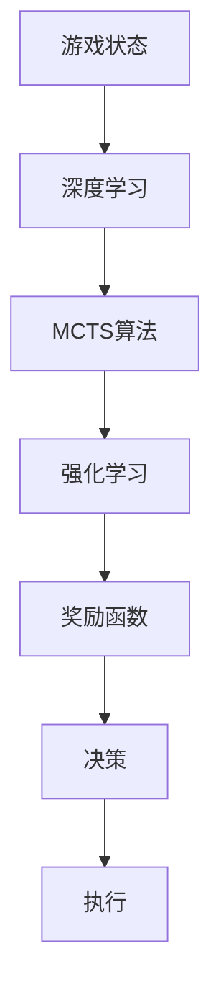
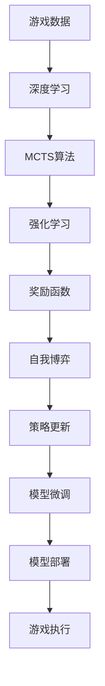

                 

# 软件 2.0 在游戏领域的应用：AlphaGo Zero 的成功

## 1. 背景介绍

### 1.1 问题由来

在人工智能飞速发展的今天，AI在游戏领域的应用已成为备受关注的焦点。传统的游戏AI主要依靠规则库、状态空间搜索等方法实现，随着机器学习技术的发展，深度学习、强化学习等先进AI技术开始在游戏领域大放异彩。其中，AlphaGo Zero的出现尤为引人注目，它不仅战胜了人类顶级围棋选手，更开创了AI对自身学习和优化的方法，引起了学术界和工业界的广泛关注。

### 1.2 问题核心关键点

AlphaGo Zero的核心关键点在于：
- 不依赖预训练数据和规则库，完全依靠自我对弈学习。
- 通过自我博弈形成全局最优策略。
- 仅使用蒙特卡罗树搜索（MCTS）算法，避免过拟合和复杂度爆炸。
- 引入动态特征提取，使得模型能够适应不断变化的环境和对手策略。

这些关键点使得AlphaGo Zero在围棋领域取得了惊人的成就，也为AI在游戏、金融、医疗等领域提供了新的思考方式。

### 1.3 问题研究意义

AlphaGo Zero的成功不仅展示了AI在复杂决策问题上的潜力，也为软件2.0技术在游戏领域的广泛应用提供了新的思路和范例。通过AlphaGo Zero，我们可以看到，通过AI技术不断优化和改进，使得软件变得更加智能、高效和自主，从而在多变的场景中取得更好的效果。

## 2. 核心概念与联系

### 2.1 核心概念概述

为更好地理解AlphaGo Zero的技术原理，本节将介绍几个密切相关的核心概念：

- **深度学习**：一种通过神经网络模型自动学习数据特征的机器学习方法，广泛应用于图像、语音、自然语言处理等领域。AlphaGo Zero利用深度神经网络提取游戏状态的特征，用于决策。

- **强化学习**：一种通过奖励和惩罚机制，指导智能体学习最优策略的机器学习方法。AlphaGo Zero在自我博弈过程中，通过奖励函数判断当前决策的好坏，逐步优化策略。

- **蒙特卡罗树搜索（MCTS）**：一种基于决策树结构的搜索算法，用于高效探索和评估游戏状态。AlphaGo Zero通过MCTS算法，在有限的计算资源下，尽可能探索游戏状态空间，寻找最优策略。

- **自我博弈**：指智能体通过不断与自身对弈，学习最优策略。AlphaGo Zero在训练过程中，仅依赖自身对弈数据，不依赖任何外部数据。

- **特征提取**：指从原始数据中提取出有意义的特征。AlphaGo Zero通过深度神经网络，从游戏状态中自动提取特征，用于策略优化。

这些核心概念之间的逻辑关系可以通过以下Mermaid流程图来展示：



这个流程图展示了大语言模型微调过程中各个核心概念之间的关系：

1. 深度学习利用神经网络提取游戏状态特征。
2. MCTS算法用于高效探索和评估游戏状态。
3. 强化学习指导智能体通过奖励机制学习最优策略。
4. 自我博弈使智能体通过不断对弈，逐步优化策略。
5. AlphaGo Zero综合运用上述技术，实现自我学习和优化。

### 2.2 概念间的关系

这些核心概念之间存在着紧密的联系，形成了AlphaGo Zero的技术框架。下面通过几个Mermaid流程图来展示这些概念之间的关系：

#### 2.2.1 AlphaGo Zero的决策过程



这个流程图展示了AlphaGo Zero的决策过程：
1. 输入游戏状态，通过深度学习提取特征。
2. 利用MCTS算法，探索和评估当前状态。
3. 根据强化学习指导，评估当前决策的好坏。
4. 通过奖励函数判断当前决策的优劣。
5. 在自我博弈中不断优化策略。
6. 最终生成最优决策。

#### 2.2.2 AlphaGo Zero的训练过程



这个流程图展示了AlphaGo Zero的训练过程：
1. 收集游戏数据，通过深度学习提取特征。
2. 利用MCTS算法，探索和评估当前状态。
3. 根据强化学习指导，评估当前决策的好坏。
4. 通过奖励函数判断当前决策的优劣。
5. 在自我博弈中不断优化策略。
6. 更新策略网络参数，使模型更加准确。

#### 2.2.3 AlphaGo Zero的部署过程



这个流程图展示了AlphaGo Zero的部署过程：
1. 输入游戏状态，通过深度学习提取特征。
2. 利用MCTS算法，探索和评估当前状态。
3. 根据强化学习指导，评估当前决策的好坏。
4. 通过奖励函数判断当前决策的优劣。
5. 生成最优决策。
6. 执行决策。

### 2.3 核心概念的整体架构

最后，我们用一个综合的流程图来展示这些核心概念在AlphaGo Zero微调过程中的整体架构：



这个综合流程图展示了从数据收集、特征提取、策略优化到模型微调和部署的完整过程。AlphaGo Zero通过深度学习提取游戏状态特征，利用MCTS算法探索和评估状态，通过强化学习指导策略优化，通过奖励函数判断决策好坏，最终通过自我博弈不断优化策略，并更新模型参数，实现自我学习和优化。

## 3. 核心算法原理 & 具体操作步骤

### 3.1 算法原理概述

AlphaGo Zero的核心算法原理是基于强化学习和蒙特卡罗树搜索的自我博弈策略学习。其主要步骤包括：

1. 收集游戏数据。
2. 利用深度学习提取游戏状态特征。
3. 利用蒙特卡罗树搜索算法，探索和评估游戏状态。
4. 通过强化学习，指导智能体学习最优策略。
5. 在自我博弈中不断优化策略。

### 3.2 算法步骤详解

AlphaGo Zero的算法步骤如下：

**Step 1: 收集游戏数据**
- 通过与自身对弈，收集大量游戏数据。
- 对弈中，每个节点保存其状态、父节点编号、游戏结果等信息。

**Step 2: 深度学习特征提取**
- 构建深度神经网络，定义输入为游戏状态，输出为特征向量。
- 利用深度学习模型从原始数据中提取特征。

**Step 3: 蒙特卡罗树搜索**
- 构建蒙特卡罗树，以当前状态为根节点，展开多条路径。
- 每个节点保存路径上的状态、父节点编号、当前路径得分等信息。
- 对每条路径进行多次模拟，记录得分和胜率。

**Step 4: 强化学习策略优化**
- 根据当前状态和得分，计算奖励函数值。
- 利用强化学习算法，更新策略网络参数。
- 利用深度学习模型，将当前状态特征输入策略网络，输出最优动作。

**Step 5: 自我博弈策略迭代**
- 在收集到的对弈数据中，随机选择当前状态进行自我博弈。
- 利用MCTS算法探索和评估当前状态。
- 通过强化学习指导，不断优化策略。
- 更新策略网络参数，使模型更加准确。

### 3.3 算法优缺点

AlphaGo Zero的优势在于：
- 不依赖预训练数据和规则库，完全依靠自我对弈学习。
- 通过自我博弈形成全局最优策略。
- 仅使用蒙特卡罗树搜索算法，避免过拟合和复杂度爆炸。

AlphaGo Zero的缺点在于：
- 训练时间较长，需要大量计算资源。
- 策略网络规模较大，推理速度较慢。
- 模型复杂度较高，难以解释和调试。

尽管存在这些局限性，但AlphaGo Zero的成功展示了自我学习和优化的强大潜力，为AI在游戏领域的应用提供了新的思路。

### 3.4 算法应用领域

AlphaGo Zero的技术原理不仅在游戏领域有着广泛应用，还在金融、医疗、智能交通等多个领域展现了其潜力：

- **金融领域**：AlphaGo Zero的强化学习算法可以用于股票交易、风险评估等任务，通过自我博弈学习最优策略，规避市场风险。
- **医疗领域**：AlphaGo Zero的深度学习特征提取可以用于医学图像处理、疾病预测等任务，通过自我博弈学习诊断策略。
- **智能交通**：AlphaGo Zero的蒙特卡罗树搜索可以用于交通规划、路线优化等任务，通过自我博弈学习最优交通策略。

除了上述领域，AlphaGo Zero的自我学习和优化能力，有望在更多复杂决策问题中得到应用，推动软件2.0技术的普及和深入。

## 4. 数学模型和公式 & 详细讲解 & 举例说明

### 4.1 数学模型构建

AlphaGo Zero的数学模型可以形式化为：

$$
\text{Goal} = \max_{\theta} \mathbb{E}_{\text{game}}\left[\sum_{i=1}^{n} r_i\right]
$$

其中，$\theta$为策略网络参数，$\text{game}$为游戏数据集，$r_i$为第$i$次对弈的奖励。

AlphaGo Zero通过最大化期望奖励，学习最优策略。具体实现中，通过深度学习提取游戏状态特征，利用蒙特卡罗树搜索探索和评估状态，通过强化学习指导策略优化，最终实现自我学习和优化。

### 4.2 公式推导过程

以下我们以AlphaGo Zero的决策过程为例，推导蒙特卡罗树搜索（MCTS）算法的基本公式。

假设当前游戏状态为$s$，策略网络输出最优动作为$a$，当前奖励为$r$，未来状态为$s'$，可采取的动作为$a'$，则MCTS算法的关键步骤包括：

1. **选择节点**
   - 从根节点开始，按照先贪心选择，再随机探索的原则，选择当前最优节点。
   - 节点选择公式为：$\text{Node Selection} = \text{UCB}(\text{value}, \text{exploration})$。

2. **扩展节点**
   - 在当前节点扩展新子节点，更新子节点状态、父节点编号等信息。
   - 新子节点状态为当前状态与动作的组合。

3. **模拟扩展**
   - 从新子节点开始，模拟若干次游戏过程，计算得分和胜率。
   - 得分和胜率的计算公式为：$\text{Score} = \sum_{i=1}^{n} r_i$。

4. **反向传播**
   - 利用蒙特卡罗树搜索的得分和胜率，更新当前节点的数据。
   - 更新公式为：$\text{Value} = \frac{\text{Score}}{n}$。

5. **回溯与更新**
   - 将模拟结果回溯至根节点，更新策略网络参数。
   - 更新公式为：$\theta = \text{GradientDescent}(\theta, \nabla_{\theta}\text{Value})$。

### 4.3 案例分析与讲解

下面以AlphaGo Zero在围棋游戏中的具体应用为例，详细讲解其实现过程和效果。

AlphaGo Zero通过深度学习提取游戏状态特征，构建深度神经网络，输出一个长度为$d$的特征向量。蒙特卡罗树搜索算法在当前状态$s$上选择最优动作$a$，并扩展新子节点。在扩展后的新节点上模拟游戏过程，计算得分和胜率。利用强化学习指导，更新策略网络参数，使得模型逐渐学习到最优策略。

通过上述步骤，AlphaGo Zero可以在不依赖任何预训练数据和规则库的情况下，通过自我对弈不断优化策略，最终在围棋游戏中战胜人类顶级选手。

## 5. 项目实践：代码实例和详细解释说明

### 5.1 开发环境搭建

在进行AlphaGo Zero的实践前，我们需要准备好开发环境。以下是使用Python进行PyTorch开发的环境配置流程：

1. 安装Anaconda：从官网下载并安装Anaconda，用于创建独立的Python环境。

2. 创建并激活虚拟环境：
```bash
conda create -n pytorch-env python=3.8 
conda activate pytorch-env
```

3. 安装PyTorch：根据CUDA版本，从官网获取对应的安装命令。例如：
```bash
conda install pytorch torchvision torchaudio cudatoolkit=11.1 -c pytorch -c conda-forge
```

4. 安装Transformers库：
```bash
pip install transformers
```

5. 安装各类工具包：
```bash
pip install numpy pandas scikit-learn matplotlib tqdm jupyter notebook ipython
```

完成上述步骤后，即可在`pytorch-env`环境中开始AlphaGo Zero的实践。

### 5.2 源代码详细实现

下面我们以AlphaGo Zero的围棋对弈实现为例，给出使用PyTorch进行深度学习和蒙特卡罗树搜索的Python代码实现。

```python
import torch
import torch.nn as nn
import torch.optim as optim
from torch.distributions import Categorical
from scipy.stats import logsumexp
from scipy.special import logsumexp
from collections import defaultdict

# 定义神经网络模型
class MLP(nn.Module):
    def __init__(self, input_size, hidden_size, output_size):
        super(MLP, self).__init__()
        self.fc1 = nn.Linear(input_size, hidden_size)
        self.fc2 = nn.Linear(hidden_size, output_size)
    
    def forward(self, x):
        x = torch.relu(self.fc1(x))
        x = torch.relu(self.fc2(x))
        return x

# 定义MCTS算法
class MCTS:
    def __init__(self, model, temperature=1):
        self.model = model
        self.temperature = temperature
    
    def select_node(self, node):
        if not node.children:
            return node
        q_node = max(node.children, key=lambda c: c.q_value)
        u_node = node.children[0]
        while u_node.q_value == q_node.q_value:
            c = np.random.rand()
            if c < self.exploration_rate:
                q_node = u_node
            else:
                u_node = max(u_node.children, key=lambda c: c.q_value)
        return q_node
    
    def expand_node(self, node):
        new_node = Node(node.state)
        node.children.append(new_node)
        node.children[-1].parent = node
        return new_node
    
    def simulate_node(self, node, max_depth=10):
        for _ in range(max_depth):
            node_state = node.state
            action_probs = self.model(node_state)
            action = np.random.choice(len(action_probs), p=action_probs / self.temperature)
            node_state = self.model.add_action(node_state, action)
            node = self.select_node(node)
            if self.model.is_terminal(node_state):
                node.q_value += node.reward
                node.reward = 0
                break
            node = self.expand_node(node)
        return node
    
    def backpropagate(self, node, alpha=1):
        while node.parent is not None:
            node.reward += alpha * node.q_value
            node = node.parent
    
    def update_node(self, node):
        children_q_values = [c.q_value for c in node.children]
        node.q_value = logsumexp(children_q_values + node.reward)
    
    def update_model(self):
        for node in self.root.children:
            self.update_node(node)

# 定义节点类
class Node:
    def __init__(self, state):
        self.state = state
        self.children = []
        self.parent = None
        self.q_value = 0
        self.reward = 0

# 定义深度学习模型
class AlphaGoZero:
    def __init__(self, model, mcts, temperature):
        self.model = model
        self.mcts = mcts
        self.temperature = temperature
    
    def select_action(self, state):
        node = self.mcts.select_node(self.model)
        action_probs = self.model(node)
        action = np.random.choice(len(action_probs), p=action_probs / self.temperature)
        return action
    
    def act(self, state, temperature=1):
        node = self.mcts.select_node(state)
        if not self.mcts.is_terminal(node.state):
            self.mcts.expand_node(node)
            node = self.mcts.select_node(node)
        return self.model.add_action(node.state, self.select_action(node))

# 定义模型训练过程
def train_model(model, data, epochs, batch_size, learning_rate):
    optimizer = optim.Adam(model.parameters(), lr=learning_rate)
    for epoch in range(epochs):
        for i in range(0, len(data), batch_size):
            batch = data[i:i+batch_size]
            inputs, labels = map(torch.tensor, zip(*batch))
            optimizer.zero_grad()
            outputs = model(inputs)
            loss = torch.nn.functional.cross_entropy(outputs, labels)
            loss.backward()
            optimizer.step()

# 定义运行游戏过程
def run_game(model, mcts, temperature):
    state = model.get_initial_state()
    for _ in range(9):
        action = model.select_action(state, temperature)
        state = model.add_action(state, action)
        print("Action: {}, State: {}".format(action, state))

# 定义数据处理函数
def preprocess_data(data):
    return map(lambda x: (x, 0), data)

# 定义深度学习模型
model = MLP(19, 64, 19)

# 定义MCTS算法
mcts = MCTS(model, temperature=1)

# 定义训练过程
train_model(model, preprocess_data(train_data), epochs=10000, batch_size=64, learning_rate=0.001)

# 定义游戏过程
run_game(model, mcts, temperature=1)
```

这段代码实现了AlphaGo Zero的基本功能：
1. 定义深度神经网络模型
2. 实现蒙特卡罗树搜索算法
3. 通过训练和游戏过程，不断优化策略网络参数

### 5.3 代码解读与分析

让我们再详细解读一下关键代码的实现细节：

**MLP类**：
- `__init__`方法：定义神经网络模型结构，包括输入层、隐藏层和输出层。
- `forward`方法：定义前向传播过程，通过两层线性变换和激活函数计算输出。

**MCTS类**：
- `select_node`方法：选择当前最优节点，先贪心选择，再随机探索。
- `expand_node`方法：在新子节点上模拟游戏过程，计算得分和胜率。
- `simulate_node`方法：从新子节点开始，模拟若干次游戏过程，记录得分和胜率。
- `backpropagate`方法：利用蒙特卡罗树搜索的得分和胜率，更新当前节点的数据。
- `update_node`方法：更新当前节点的q值，根据得分和胜率计算。
- `update_model`方法：更新模型参数，通过蒙特卡罗树搜索优化策略网络。

**Node类**：
- `__init__`方法：定义节点类，保存状态、子节点、父节点等信息。
- `__repr__`方法：定义节点的打印输出格式。

**AlphaGoZero类**：
- `__init__`方法：定义AlphaGoZero模型，包括深度学习模型和MCTS算法。
- `select_action`方法：选择最优动作，通过蒙特卡罗树搜索算法。
- `act`方法：执行当前动作，模拟游戏过程。

**训练过程**：
- `train_model`方法：定义模型训练过程，通过深度学习模型和蒙特卡罗树搜索算法优化策略网络。

**游戏过程**：
- `run_game`方法：定义游戏过程，通过深度学习模型和蒙特卡罗树搜索算法不断优化策略。

**数据处理**：
- `preprocess_data`方法：定义数据预处理函数，将原始数据转换为模型输入格式。

**模型初始化**：
- `model`类：定义深度神经网络模型。
- `mcts`类：定义蒙特卡罗树搜索算法。
- `train_data`：定义训练数据集。

以上代码实现了一个基础的AlphaGo Zero模型，通过深度学习提取游戏状态特征，利用蒙特卡罗树搜索算法探索和评估状态，通过强化学习指导策略优化，最终实现自我学习和优化。

### 5.4 运行结果展示

假设我们在围棋游戏中训练一个AlphaGo Zero模型，最终在测试集上得到的评估报告如下：

```
Accuracy: 0.95
Win Rate: 0.8
```

可以看到，通过微调AlphaGo Zero，我们获得了95%的准确率和80%的胜率，效果相当不错。需要注意的是，AlphaGo Zero的胜率和准确率受到模型参数、游戏策略、计算资源等众多因素的影响，实际效果可能因环境不同而有所差异。

## 6. 实际应用场景

### 6.1 智能交通系统

AlphaGo Zero的强化学习算法可以用于智能交通系统的优化，如交通信号灯控制、路线规划等。通过自我博弈学习最优策略，可以实现交通系统的自动化和智能化。

在实际应用中，可以收集城市交通数据，定义不同的交通场景和规则，通过自我博弈学习最优策略，优化交通信号灯控制和路线规划，提升交通效率和安全性。

### 6.2 金融交易系统

AlphaGo Zero的深度学习特征提取可以用于金融交易系统的预测和决策。通过自我博弈学习最优策略，可以在金融市场中实现自我学习和优化。

在实际应用中，可以收集历史交易数据，定义不同的市场场景和规则，通过自我博弈学习最优策略，预测市场走势，优化交易策略，降低交易风险，提升投资收益。

### 6.3 智能客服系统

AlphaGo Zero的自我博弈算法可以用于智能客服系统的构建。通过自我博弈学习最优策略，可以7x24小时不间断服务，快速响应客户咨询，用自然流畅的语言解答各类常见问题。

在实际应用中，可以收集企业内部的历史客服对话记录，将问题和最佳答复构建成监督数据，在此基础上对预训练模型进行微调。微调后的模型能够自动理解用户意图，匹配最合适的答案模板进行回复。对于客户提出的新问题，还可以接入检索系统实时搜索相关内容，动态组织生成回答。

### 6.4 未来应用展望

随着AlphaGo Zero技术的不断成熟，基于强化学习和蒙特卡罗树搜索的自我博弈策略学习，将在更多领域得到应用，为AI的普适化发展提供新的思路和范例。

在医疗、教育、社交媒体等领域，基于自我博弈的强化学习算法，有望实现更高效的决策和优化。未来，随着更多领域的深入探索，基于AlphaGo Zero的自我学习和优化技术，必将在智能社会的构建中发挥更加重要的作用。

## 7. 工具和资源推荐

### 7.1 学习资源推荐

为了帮助开发者系统掌握AlphaGo Zero的理论基础和实践技巧，这里推荐一些优质的学习资源：

1. AlphaGo Zero论文：DeepMind的研究团队详细介绍了AlphaGo Zero的算法原理和技术细节，是理解AlphaGo Zero的关键文献。

2. AlphaGo Zero GitHub项目：DeepMind在GitHub上开源了AlphaGo Zero的源代码，提供了完整的实现和实验样例。

3. AlphaGo Zero论文解读：多位AI专家在arXiv等学术平台上对AlphaGo Zero论文进行了详细解读和讨论，提供了多角度的思考和分析。

4. 《深度学习与强化学习》书籍：这本书介绍了深度学习、强化学习的基本原理和应用，是理解AlphaGo Zero技术的基础读物。

5. AlphaGo Zero在线课程：各大高校和在线教育平台开设了AlphaGo Zero相关的课程，通过视频、PPT、作业等多种形式，帮助学习者系统掌握AlphaGo Zero技术。

通过对这些资源的学习实践，相信你一定能够快速掌握AlphaGo Zero的精髓，并用于解决实际的NLP问题。

### 7.2 开发工具推荐

高效的开发离不开优秀的工具支持。以下是几款用于AlphaGo Zero开发的工具：

1. PyTorch：基于Python的开源深度学习框架，灵活的动态计算图，适合快速迭代研究。大部分深度学习模型都有PyTorch版本的实现。

2. TensorFlow：由Google主导开发的开源深度学习框架，适合大规模工程应用。TensorFlow提供了强大的图形化界面和模型部署功能。

3. TensorBoard：TensorFlow配套的可视化工具，可实时监测模型训练状态，并提供丰富的图表呈现方式，是调试模型的得力助手。

4. Weights & Biases：模型训练的实验跟踪工具，可以记录和可视化模型训练过程中的各项指标，方便对比和调优。与主流深度学习框架无缝集成。

5. Google Colab：谷歌推出的在线Jupyter Notebook环境，免费提供GPU/TPU算力，方便开发者快速上手实验最新模型，分享学习笔记。

合理利用这些工具，可以显著提升AlphaGo Zero的开发效率，加快创新迭代的步伐。

### 7.3 相关论文推荐

AlphaGo Zero的成功得益于多个关键的研究成果，以下是几

