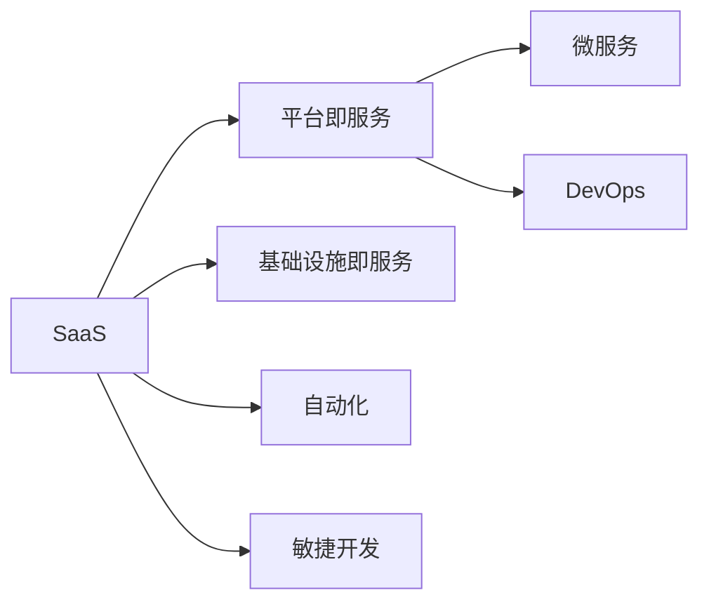
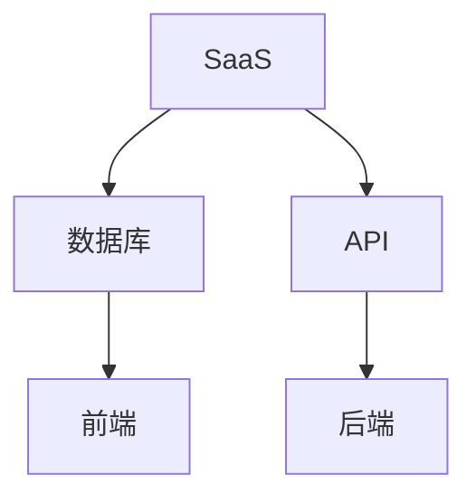
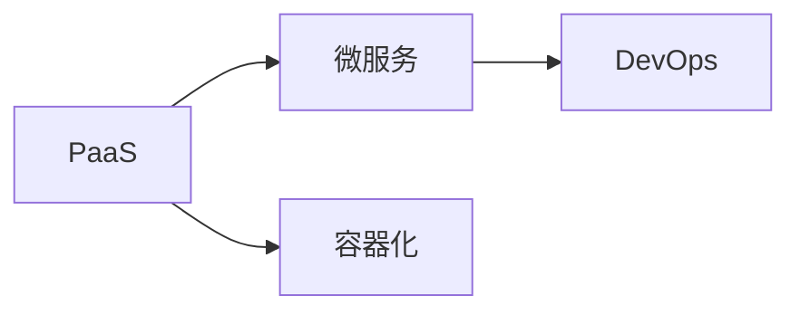
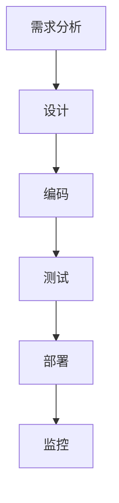
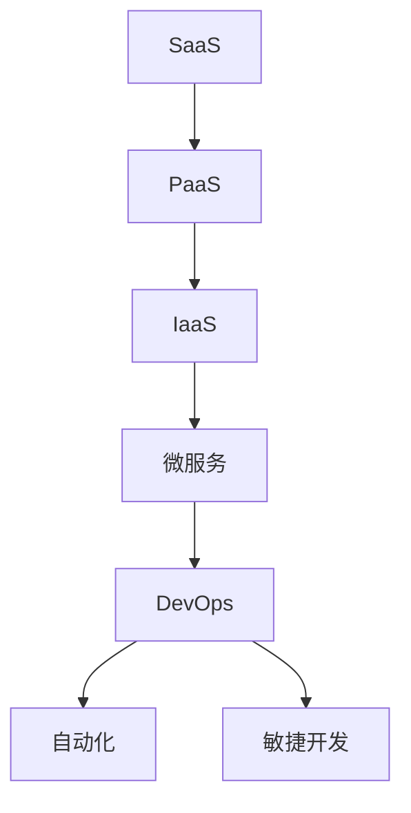

                 

# 软件 2.0 的价值：提升效率、创造价值

## 1. 背景介绍

在信息技术飞速发展的今天，软件正成为各行各业的核心竞争力。从金融到医疗，从制造业到服务业，软件无处不在，深度影响着企业的创新能力和运营效率。随着云计算、大数据、人工智能等技术的不断演进，软件的功能和性能也在不断提升，逐步向软件 2.0 迈进。软件 2.0 不仅是技术的革新，更是理念的变革，其价值在于提升效率、创造价值，助力企业在数字化转型中脱颖而出。

### 1.1 软件 2.0 的兴起

软件 2.0 的概念最早由 Gartner 提出，指的是基于云计算、大数据、人工智能等技术的软件解决方案，能够提供更加高效、智能的服务，支持企业快速响应市场需求，实现业务的创新和优化。与传统软件相比，软件 2.0 强调服务的可定制化、高度自动化和智能化，能够动态调整资源配置，优化业务流程，提升整体效率。

近年来，随着开源社区的快速发展、云计算基础设施的成熟以及人工智能技术的突破，软件 2.0 正在成为企业数字化转型的重要驱动力。软件 2.0 通过将软件技术与业务深度融合，帮助企业实现业务的全面数字化，提升企业的竞争力。

### 1.2 软件 2.0 的价值

软件 2.0 的价值主要体现在以下几个方面：

- **效率提升**：通过自动化和智能化手段，软件 2.0 能够大大提高企业的运营效率，减少人工干预，降低成本。
- **数据驱动**：基于大数据分析，软件 2.0 可以提供更为精准的决策支持，帮助企业更好地理解市场和用户需求。
- **业务优化**：通过智能化的业务流程优化，软件 2.0 能够提升企业的业务效率和质量，优化资源配置。
- **创新驱动**：软件 2.0 支持企业快速迭代产品和服务，适应不断变化的市场环境，保持竞争力。

## 2. 核心概念与联系

### 2.1 核心概念概述

为更好地理解软件 2.0 的价值，本节将介绍几个关键概念：

- **软件即服务 (SaaS)**：基于云计算技术，软件即服务能够提供弹性、按需使用的服务，适用于中小型企业。
- **平台即服务 (PaaS)**：提供基础软件平台和开发环境，支持企业快速开发和部署应用。
- **基础设施即服务 (IaaS)**：提供计算、存储、网络等基础资源，支持企业高效运行应用。
- **微服务**：将复杂的应用拆分成多个小型服务，提升应用的灵活性和可扩展性。
- **DevOps**：通过持续集成、持续交付和持续监控等技术，实现软件的快速交付和优化。

这些概念构成了软件 2.0 的核心框架，其间的联系可以通过以下 Mermaid 流程图来展示：



这个流程图展示了大规模软件架构中各概念之间的相互关系：

1. SaaS 作为软件架构的顶层，提供直接使用的服务。
2. PaaS 和 IaaS 作为基础设施层，提供资源支持。
3. 微服务将应用拆分为小型服务，提升灵活性和可扩展性。
4. DevOps 支持自动化、敏捷开发等技术，提升软件开发效率。

### 2.2 概念间的关系

这些核心概念之间存在着紧密的联系，形成了软件 2.0 的完整生态系统。下面我们通过几个 Mermaid 流程图来展示这些概念之间的关系。

#### 2.2.1 SaaS 的架构



这个流程图展示了 SaaS 架构的基本框架，包括数据库、API、前端和后端：

1. SaaS 通过 API 提供服务接口，连接数据库和后端。
2. 数据库存储用户数据，API 负责数据交互，后端负责逻辑处理。
3. 前端提供用户界面，实现人机交互。

#### 2.2.2 PaaS 与微服务



这个流程图展示了 PaaS 与微服务的关系，以及容器化和 DevOps 对微服务的支持：

1. PaaS 提供基础软件平台和开发环境，支持微服务的创建和部署。
2. 微服务将应用拆分为小型服务，提高灵活性和可扩展性。
3. 容器化技术支持微服务的打包和部署，DevOps 支持自动化和敏捷开发。

#### 2.2.3 DevOps 的流程



这个流程图展示了 DevOps 的主要流程：

1. 需求分析定义项目目标和需求。
2. 设计确定系统架构和功能模块。
3. 编码实现系统功能。
4. 测试验证系统功能和性能。
5. 部署上线系统。
6. 监控收集系统运行数据，持续优化系统性能。

### 2.3 核心概念的整体架构

最后，我们用一个综合的流程图来展示这些核心概念在大规模软件架构中的整体架构：



这个综合流程图展示了从 SaaS 到 IaaS，再到微服务和 DevOps 的整体架构，各概念相互配合，共同支持软件 2.0 的构建和运行。通过理解这些核心概念及其相互关系，我们可以更好地把握软件 2.0 的架构和设计原则。

## 3. 核心算法原理 & 具体操作步骤
### 3.1 算法原理概述

软件 2.0 的核心算法原理主要体现在以下几个方面：

- **云计算技术**：通过分布式计算和资源池化，支持大规模、高可扩展的计算和存储需求。
- **容器技术**：通过容器化技术，支持微服务的快速部署和扩展，提高应用的灵活性和可维护性。
- **DevOps 流程**：通过自动化和持续集成，支持软件的快速交付和迭代优化。
- **大数据分析**：通过数据挖掘和机器学习，支持业务的智能化决策和优化。
- **人工智能技术**：通过自然语言处理、计算机视觉等技术，支持业务的智能处理和优化。

### 3.2 算法步骤详解

下面详细介绍软件 2.0 的关键算法步骤和具体操作步骤：

**Step 1: 需求分析**

- 分析业务需求和目标，明确软件系统的功能和性能要求。
- 确定系统的架构和模块划分，设计数据模型和 API 接口。

**Step 2: 系统设计**

- 根据需求分析，设计系统架构，选择技术栈和开发工具。
- 定义系统的开发流程和工具链，明确 DevOps 流程和自动化工具。

**Step 3: 系统开发**

- 根据设计文档，编写代码，实现系统功能。
- 进行单元测试和集成测试，确保系统功能和性能稳定。

**Step 4: 部署上线**

- 将代码打包部署到云平台或容器环境中。
- 配置自动化运维工具，监控系统运行状态和性能指标。

**Step 5: 持续优化**

- 根据用户反馈和系统运行数据，持续优化系统功能和性能。
- 引入新技术和新工具，提升系统的稳定性和可扩展性。

### 3.3 算法优缺点

软件 2.0 的算法具有以下优点：

- **灵活性高**：通过微服务和容器化技术，支持系统的快速部署和扩展。
- **自动化程度高**：通过 DevOps 流程，支持自动化和持续集成，提高开发效率。
- **可扩展性强**：通过云计算和大数据技术，支持大规模、高可扩展的计算和存储需求。
- **智能化水平高**：通过大数据分析和人工智能技术，支持业务的智能化决策和优化。

同时，软件 2.0 的算法也存在以下缺点：

- **成本较高**：云计算和大数据技术需要较高的硬件和运维成本。
- **学习曲线陡**：DevOps 和容器化技术需要一定的学习曲线，上手难度较大。
- **数据隐私风险**：大数据分析和云计算技术涉及大量的数据处理，存在数据隐私风险。

### 3.4 算法应用领域

软件 2.0 的算法已经广泛应用于各个领域，以下是一些典型的应用场景：

- **金融科技**：通过云计算和大数据技术，支持高频交易、风险控制、智能投顾等业务。
- **电商行业**：通过自然语言处理和计算机视觉技术，支持智能客服、个性化推荐、智能物流等业务。
- **医疗健康**：通过人工智能和大数据分析技术，支持医疗影像分析、疾病预测、智能诊断等业务。
- **制造业**：通过工业互联网和大数据技术，支持智能制造、供应链优化、设备运维等业务。
- **智慧城市**：通过物联网和大数据分析技术，支持城市管理、交通监控、智能安防等业务。

## 4. 数学模型和公式 & 详细讲解 & 举例说明

### 4.1 数学模型构建

在软件 2.0 中，数学模型通常用于描述系统的行为和性能。以下是一个典型的软件 2.0 系统设计的数学模型：

- **数据模型**：描述系统数据的结构和关系，如用户信息、订单信息等。
- **业务模型**：描述系统业务的逻辑和流程，如订单管理、库存管理等。
- **性能模型**：描述系统性能的指标和影响因素，如响应时间、吞吐量等。

### 4.2 公式推导过程

下面以订单管理系统的性能模型为例，推导一个简单的公式：

假设订单管理系统有 $N$ 个订单，每个订单的处理时间为 $t$，系统每秒能够处理 $k$ 个订单。则系统的平均响应时间为：

$$
T = \frac{Nt}{k}
$$

其中 $N$ 为订单数量，$t$ 为订单处理时间，$k$ 为系统每秒处理的订单数量。这个公式描述了订单处理时间和系统处理能力的平衡关系。

### 4.3 案例分析与讲解

假设一个电商平台每天需要处理 10,000 个订单，每个订单的处理时间为 2 秒，系统每秒能够处理 100 个订单。则系统的平均响应时间为：

$$
T = \frac{10,000 \times 2}{100} = 200\text{秒}
$$

即订单系统需要 200 秒才能完成所有订单的处理。如果系统每秒处理订单数量提升到 1,000 个，则平均响应时间将降低到 20 秒，系统性能提升显著。

## 5. 项目实践：代码实例和详细解释说明
### 5.1 开发环境搭建

在进行软件 2.0 开发实践前，我们需要准备好开发环境。以下是使用 Python 进行 Django 开发的环境配置流程：

1. 安装 Python：从官网下载并安装 Python，确保版本为 3.8 及以上。
2. 安装 Django：通过命令行安装 Django，命令为 `pip install Django`。
3. 安装 MySQL：安装 MySQL 数据库，配置 Django 配置文件，指定数据库连接信息。
4. 安装 Flask：安装 Flask 框架，配置 Django 配置文件，指定 Flask 应用路径。
5. 安装 Git：安装 Git 版本控制系统，配置 Django 配置文件，指定 Git 仓库地址。

完成上述步骤后，即可在开发环境中启动 Django 应用。

### 5.2 源代码详细实现

下面以订单管理系统为例，给出使用 Django 框架进行开发的 PyTorch代码实现。

首先，定义订单模型的数据模型：

```python
from django.db import models
from django.contrib.auth.models import User

class Order(models.Model):
    user = models.ForeignKey(User, on_delete=models.CASCADE)
    order_number = models.CharField(max_length=20, unique=True)
    order_time = models.DateTimeField(auto_now_add=True)
    order_total = models.DecimalField(max_digits=10, decimal_places=2)
```

然后，定义订单管理的视图函数：

```python
from django.shortcuts import render, redirect
from django.http import HttpResponse
from django.views.decorators.csrf import csrf_exempt

@csrf_exempt
def order_list(request):
    if request.method == 'POST':
        order_number = request.POST.get('order_number')
        order_total = request.POST.get('order_total')
        user = request.user
        order = Order.objects.create(order_number=order_number, order_total=order_total, user=user)
        return redirect('order_detail', order_number=order_number)
    else:
        orders = Order.objects.all()
        return render(request, 'order_list.html', {'orders': orders})
```

接着，定义订单详情的页面模板：

```html
<!DOCTYPE html>
<html>
<head>
    <title>Order Detail</title>
</head>
<body>
    <h1>Order Detail</h1>
    <p>Order Number: {{ order.order_number }}<p>
    <p>Order Total: {{ order.order_total }}</p>
    <a href="">Return to List</a>
</body>
</html>
```

最后，启动 Django 应用，进行前端调试：

```python
from django.core.management import execute_from_command_line

def run():
    execute_from_command_line(['manage.py', 'runserver', '0.0.0.0:8000'])

run()
```

执行上述命令，启动 Django 应用，在浏览器中输入 `http://127.0.0.1:8000/` 即可访问订单列表页面。

### 5.3 代码解读与分析

让我们再详细解读一下关键代码的实现细节：

**Order 模型**：
- 定义了订单的基本信息，包括用户、订单号、订单时间和订单总额。

**order_list 视图函数**：
- 处理 POST 请求时，从表单中获取订单号和订单总额，创建新订单并重定向到订单详情页面。
- 处理 GET 请求时，查询所有订单并渲染页面模板。

**order_detail 页面模板**：
- 展示订单详情，包含订单号和订单总额。
- 通过模板标签调用 URL 路径，实现返回订单列表的链接。

### 5.4 运行结果展示

执行上述代码后，订单管理系统将正常启动，用户可以通过表单提交订单，查看订单详情。在浏览器中访问 `http://127.0.0.1:8000/` 即可看到订单列表页面。

## 6. 实际应用场景

### 6.1 智能制造

软件 2.0 在智能制造中的应用主要体现在以下几个方面：

- **设备监控**：通过物联网技术，实时监控生产设备的运行状态，及时发现和处理异常。
- **质量控制**：通过机器视觉和大数据分析技术，检测产品的质量缺陷，提升产品质量。
- **生产调度**：通过优化算法和调度系统，实现生产线的最优运行和资源配置。
- **预测维护**：通过预测模型，预测设备故障和维护需求，提前进行维护，减少停机时间。

### 6.2 智慧医疗

软件 2.0 在智慧医疗中的应用主要体现在以下几个方面：

- **医疗影像分析**：通过深度学习和计算机视觉技术，自动分析医疗影像，辅助医生进行诊断和治疗。
- **健康监测**：通过物联网设备和传感器，实时监测患者的健康数据，提供个性化的健康管理方案。
- **智能诊断**：通过自然语言处理和大数据分析技术，辅助医生进行病历分析和诊断。
- **药物研发**：通过计算机模拟和大数据分析技术，加速药物研发进程，降低研发成本。

### 6.3 金融科技

软件 2.0 在金融科技中的应用主要体现在以下几个方面：

- **高频交易**：通过算法交易和大数据分析技术，实现高频交易，优化投资组合。
- **风险控制**：通过机器学习和数据分析技术，预测和控制金融风险，保障金融安全。
- **智能投顾**：通过自然语言处理和大数据分析技术，提供个性化的投资建议和理财方案。
- **反欺诈检测**：通过机器学习和数据分析技术，检测和防范金融欺诈行为，保障用户资金安全。

### 6.4 未来应用展望

未来，软件 2.0 将在更多领域得到应用，为各行各业带来变革性影响。

在智慧农业领域，软件 2.0 可以通过物联网技术，实时监测农田环境和作物生长情况，实现精准农业和智能灌溉。

在智慧教育领域，软件 2.0 可以通过自然语言处理和大数据分析技术，提供个性化的学习方案和智能答疑系统，提高教育质量。

在智慧城市领域，软件 2.0 可以通过物联网技术和数据分析技术，实现城市交通管理、环境监测和公共安全管理，提升城市管理效率。

总之，随着软件 2.0 技术的不断演进，其应用场景将不断拓展，成为各行各业数字化转型的重要驱动力。

## 7. 工具和资源推荐
### 7.1 学习资源推荐

为了帮助开发者系统掌握软件 2.0 的理论基础和实践技巧，这里推荐一些优质的学习资源：

1. **《软件即服务：SaaS 发展战略与成功案例》**：介绍 SaaS 的发展历程、成功案例以及 SaaS 的商业模式。
2. **《平台即服务：PaaS 开发指南》**：介绍 PaaS 的架构、开发流程以及 PaaS 的开发工具和最佳实践。
3. **《微服务架构设计》**：介绍微服务的设计原则、实现技术和最佳实践，帮助开发者构建高效、可扩展的系统。
4. **《DevOps 实践指南》**：介绍 DevOps 的流程、工具和技术，帮助开发者实现软件的快速交付和优化。
5. **《大数据分析与机器学习》**：介绍大数据分析和机器学习的基本概念和实现技术，帮助开发者构建智能化的业务系统。

通过对这些资源的学习实践，相信你一定能够快速掌握软件 2.0 的核心概念和实践技巧，实现业务的数字化转型。

### 7.2 开发工具推荐

高效的开发离不开优秀的工具支持。以下是几款用于软件 2.0 开发常用的工具：

1. **Django**：一个强大的 Python Web 框架，支持快速开发 Web 应用。
2. **Flask**：一个轻量级的 Python Web 框架，适合小型项目和快速原型开发。
3. **MySQL**：一个高性能的关系型数据库，支持大并发和大数据量的存储。
4. **Git**：一个流行的版本控制系统，支持代码的分布式管理和协作开发。
5. **Jenkins**：一个开源的自动化服务器，支持持续集成和持续交付。

合理利用这些工具，可以显著提升软件 2.0 开发的效率和质量，缩短开发周期。

### 7.3 相关论文推荐

软件 2.0 的发展得益于学界的持续研究。以下是几篇奠基性的相关论文，推荐阅读：

1. **《云计算：概念、技术与应用》**：介绍云计算的基本概念、技术架构和应用场景。
2. **《微服务架构：设计原则与实践》**：介绍微服务架构的设计原则、实现技术和最佳实践。
3. **《DevOps 实践指南》**：介绍 DevOps 的流程、工具和技术，帮助开发者实现软件的快速交付和优化。
4. **《大数据分析与机器学习》**：介绍大数据分析和机器学习的基本概念和实现技术，帮助开发者构建智能化的业务系统。

这些论文代表了大规模软件架构的发展脉络。通过学习这些前沿成果，可以帮助研究者把握学科前进方向，激发更多的创新灵感。

除上述资源外，还有一些值得关注的前沿资源，帮助开发者紧跟软件 2.0 技术的最新进展，例如：

1. **arXiv 论文预印本**：人工智能领域最新研究成果的发布平台，包括大量尚未发表的前沿工作，学习前沿技术的必读资源。
2. **开源社区**：如 GitHub、Apache 等，提供丰富的开源项目和社区资源，助力开发者实现快速迭代和创新。
3. **技术会议直播**：如 Gartner、AWS re:Invent 等顶级技术会议，分享最新的技术进展和行业趋势。

4. **Google 开发者大会**：分享 Google 最新的技术创新和应用实践，带来最新的技术进展和应用案例。

5. **微软 Developer Connect**：分享微软最新的技术创新和应用实践，带来最新的技术进展和应用案例。

总之，对于软件 2.0 技术的学习和实践，需要开发者保持开放的心态和持续学习的意愿。多关注前沿资讯，多动手实践，多思考总结，必将收获满满的成长收益。

## 8. 总结：未来发展趋势与挑战
### 8.1 研究成果总结

软件 2.0 技术的不断发展，使得软件架构向更加灵活、智能、可扩展的方向演进。通过云计算、大数据、人工智能等技术的应用，软件 2.0 提升了企业数字化转型的效率和效果，驱动了各行各业的创新和发展。

### 8.2 未来发展趋势

展望未来，软件 2.0 的发展趋势将呈现以下几个方面：

1. **云计算技术的普及**：随着云计算基础设施的不断完善，更多的企业和组织将采用云服务，实现更加灵活和可扩展的应用架构。
2. **大数据分析的深入应用**：随着数据量的不断增加，大数据分析将更加深入地应用于各个领域，提升业务的智能化水平。
3. **人工智能技术的突破**：随着深度学习、自然语言处理等技术的不断突破，人工智能技术将更加普及，驱动软件 2.0 应用的智能化和自动化。
4. **微服务架构的普及**：随着微服务技术的发展，更多的企业将采用微服务架构，提升应用的灵活性和可扩展性。
5. **DevOps 的普及**：随着 DevOps 技术的发展，软件开发将更加自动化和敏捷化，提升软件的交付效率和质量。

### 8.3 面临的挑战

尽管软件 2.0 技术已经取得了显著进展，但在迈向更加智能化、普适化应用的过程中，它仍面临诸多挑战：

1. **数据隐私和安全**：随着数据量的不断增加，数据隐私和安全问题将更加突出，如何保护用户数据隐私，防范数据泄露和滥用，将是重要的研究方向。
2. **技术复杂度**：随着技术栈和架构的复杂度不断增加，如何降低技术门槛，提升开发效率，将是重要的挑战。
3. **系统可扩展性**：随着业务规模的不断扩大，如何构建高可扩展、高性能的系统，将是重要的研究方向。
4. **系统可靠性**：随着系统的复杂度不断增加，如何保证系统的稳定性和可靠性，将是重要的挑战。
5. **模型可解释性**：随着人工智能技术的广泛应用，如何提高模型的可解释性，确保算法的透明和可控，将是重要的研究方向。

### 8.4 研究展望

面对软件 2.0 面临的这些挑战，未来的研究需要在以下几个方面寻求新的突破：

1. **数据隐私保护**：采用先进的加密技术和隐私保护算法，保护用户数据隐私。
2. **技术简化**：通过技术栈整合和工具链优化，降低技术门槛，提升开发效率。
3. **系统可扩展性**：采用分布式计算和大数据技术，构建高可扩展、高性能的系统。
4. **系统可靠性**：采用自动化运维和故障检测技术，保障系统的稳定性和可靠性。
5. **模型可解释性**：采用可解释性算法和工具，提高模型的透明性和可控性。

这些研究方向的探索，必将引领软件 2.0 技术迈向更高的台阶，为构建安全、可靠、可解释、可控的智能系统铺平道路。面向未来，软件 2.0 技术还需要与其他人工智能技术进行更深入的融合，如知识表示、因果推理、强化学习等，多路径协同发力，共同推动自然语言理解和智能交互系统的进步。只有勇于创新、敢于突破，才能不断拓展软件 2.0 的边界，让智能技术更好地造福人类社会。

## 9. 附录：常见问题与解答

**Q1：软件 2.0 的实际应用效果如何？**

A: 软件 2.0 在各个领域的应用效果显著。例如，在电商领域，智能客服系统可以大幅提升用户满意度，智能推荐系统可以提升销售转化率；在金融领域，高频交易系统可以优化投资组合，风险控制系统可以防范金融风险；在医疗领域，智能诊断系统可以提升诊断准确率，健康监测系统可以改善患者管理。

**Q2：如何选择合适的开发工具？**

A: 选择合适的开发工具需要考虑以下几个方面：
- **技术栈和语言**：根据业务需求和团队技术栈，选择适合的开发语言和技术栈。
- **开发效率**：选择开发效率高、工具链完善的开发框架和工具。
- **运维成本**：考虑运维成本和资源需求，选择适合的云平台和容器技术。
- **社区支持**：选择有活跃社区和技术支持的平台和工具。

**Q3：如何提高软件的可扩展性和可维护性？**

A: 提高软件的可扩展性和可维护性需要以下几个方面的措施：
- **微服务架构**：采用微服务架构，将应用拆分为小型服务，提升灵活性和可扩展性。
- **容器技术**：采用容器技术，支持微服务的快速部署和扩展。
- **DevOps 流程**：采用 DevOps 流程，实现持续集成、持续交付和持续监控，提升开发效率和系统稳定性。
- **自动化运维**：采用自动化运维工具，实现系统监控和故障处理，提升运维效率。


