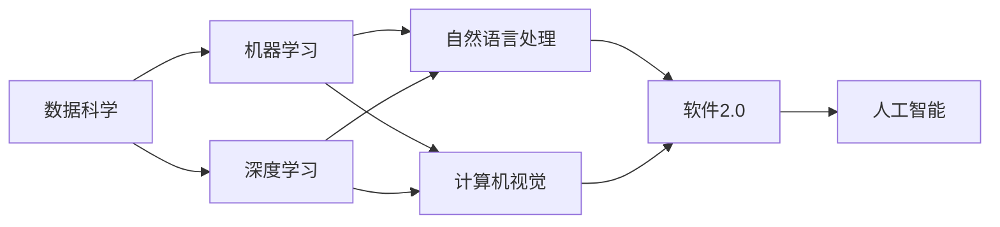

                 

# 软件 2.0 的哲学思考：人工智能的本质

> 关键词：软件 2.0, 人工智能, 机器学习, 深度学习, 数据科学, 自然语言处理, 计算机视觉

## 1. 背景介绍

### 1.1 问题由来
在过去的几十年里，计算机软件技术经历了巨大的变革，从最初的单一功能软件到现代的软件系统，软件2.0的崛起已经改变了世界的面貌。随着大数据、云计算、人工智能等技术的发展，软件2.0不仅在功能上变得更加强大，而且在哲学和本质上也发生了深刻的变化。

软件2.0时代的到来，标志着软件不再仅仅是工具和手段，而是成为具有自我意识和自主学习能力的新型存在。这一转变，不仅带来了技术上的突破，更引发了关于软件本质的哲学思考。

### 1.2 问题核心关键点
软件2.0时代的核心在于其智能化的本质，即通过机器学习和深度学习等技术，使软件系统具备了自我学习和自我优化的能力。这种能力的提升，使得软件系统能够更加精准地理解和响应人类需求，同时也引发了对软件与人类关系的重新思考。

软件2.0的本质，不仅在于其功能上的强大，更在于其对数据的理解和运用。大数据和深度学习技术的结合，使得软件系统能够从海量数据中提取知识，进而实现自我学习、自我优化的目标。

### 1.3 问题研究意义
研究软件2.0的哲学本质，对于理解软件技术的未来发展方向，推动人工智能技术的应用，具有重要的意义：

1. **提升技术认知**：通过探讨软件2.0的本质，可以更深刻地理解人工智能和深度学习等技术的原理和应用。
2. **指导实践应用**：对于如何利用软件2.0技术，提升企业竞争力，提高工作效率，具有指导意义。
3. **思考人类与技术的关系**：探讨软件2.0的哲学本质，有助于思考人类与技术的关系，理解技术对人类社会的影响。
4. **推动技术创新**：通过深入理解软件2.0的哲学本质，可以发现新的技术发展路径，推动人工智能技术的发展和创新。

## 2. 核心概念与联系

### 2.1 核心概念概述

为了更好地理解软件2.0的哲学本质，我们首先需要了解一些关键概念：

- **软件2.0**：指通过机器学习和深度学习等技术，使软件系统具备自我学习、自我优化能力的智能软件系统。
- **人工智能**：指通过模拟人类智能，实现自主学习和决策的技术，包括机器学习、深度学习、自然语言处理、计算机视觉等领域。
- **机器学习**：指通过算法使机器从数据中学习，并进行预测或决策的过程。
- **深度学习**：指通过神经网络进行多层特征提取和抽象，实现自主学习和决策的过程。
- **数据科学**：指通过数据挖掘、统计分析和机器学习等技术，发现数据中的知识和规律。
- **自然语言处理**：指通过计算机技术实现对自然语言的理解、生成和分析。
- **计算机视觉**：指通过计算机技术实现对图像和视频数据的理解和分析。

这些概念之间存在着紧密的联系，共同构成了软件2.0的技术基础和哲学基础。

### 2.2 概念间的关系

这些核心概念之间的关系可以通过以下Mermaid流程图来展示：



这个流程图展示了数据科学、机器学习和深度学习如何为自然语言处理和计算机视觉提供技术支持，从而实现软件2.0的自主学习和自我优化。最终，软件2.0成为人工智能的重要组成部分，推动了整个技术生态的发展。

## 3. 核心算法原理 & 具体操作步骤
### 3.1 算法原理概述

软件2.0的核心算法原理主要集中在机器学习和深度学习上，通过这些技术实现数据的自动学习、特征提取和决策。

在机器学习中，算法通过历史数据进行学习，从而预测新数据的特征。常见的机器学习算法包括决策树、支持向量机、线性回归等。

深度学习则通过多层神经网络，实现对数据的自动特征提取和抽象。神经网络通过反向传播算法，优化模型的权重和偏置，从而实现对数据的精准预测。

### 3.2 算法步骤详解

软件2.0的算法步骤通常包括以下几个关键步骤：

1. **数据准备**：收集和处理训练数据，确保数据的质量和数量。
2. **模型构建**：选择合适的机器学习或深度学习模型，并进行初始化。
3. **模型训练**：使用训练数据对模型进行训练，调整模型参数，使其能够准确预测新数据。
4. **模型评估**：使用验证数据对模型进行评估，确定模型的性能和泛化能力。
5. **模型优化**：根据评估结果，调整模型参数，提高模型的性能和泛化能力。
6. **模型部署**：将训练好的模型部署到实际应用中，进行推理和决策。

### 3.3 算法优缺点

软件2.0的算法具有以下优点：

- **自主学习**：能够从大量数据中自主学习知识，实现自我优化。
- **精准预测**：通过深度学习等技术，实现对数据的精准预测和决策。
- **广泛应用**：在自然语言处理、计算机视觉、推荐系统等领域具有广泛应用。

同时，软件2.0的算法也存在一些缺点：

- **数据依赖**：算法的效果高度依赖于数据的质量和数量，数据不足可能导致算法性能下降。
- **计算复杂**：深度学习等技术需要大量计算资源，成本较高。
- **模型解释**：算法模型往往是“黑盒”，难以解释其内部工作机制，影响模型的可解释性和可信任度。

### 3.4 算法应用领域

软件2.0的算法在以下几个领域具有广泛应用：

- **自然语言处理**：如情感分析、机器翻译、问答系统等。
- **计算机视觉**：如图像分类、物体检测、人脸识别等。
- **推荐系统**：如电商推荐、新闻推荐等。
- **金融分析**：如信用评分、股票预测等。
- **医疗诊断**：如疾病预测、病理分析等。

## 4. 数学模型和公式 & 详细讲解 & 举例说明

### 4.1 数学模型构建

软件2.0的数学模型通常基于机器学习和深度学习技术，包括线性回归、决策树、支持向量机、神经网络等。这里以神经网络为例，展示其数学模型构建过程。

假设有一个输入向量 $x$ 和输出向量 $y$，神经网络的目标是通过一组权重 $w$ 和偏置 $b$ 对输入进行线性变换和激活函数处理，最终输出预测结果 $y'$。

神经网络的数学模型可以表示为：

$$
y' = f(Wx + b)
$$

其中，$f$ 为激活函数，$W$ 和 $b$ 为模型参数。

### 4.2 公式推导过程

以神经网络中的反向传播算法为例，展示其公式推导过程。

假设神经网络有一个隐藏层，输入向量为 $x$，隐藏层输出为 $h$，输出向量为 $y'$。反向传播算法通过计算梯度，更新模型参数 $W$ 和 $b$，使其能够最小化预测误差。

假设损失函数为均方误差损失，则神经网络的预测误差可以表示为：

$$
J(y, y') = \frac{1}{2}(y - y')^2
$$

其中，$y$ 为真实标签，$y'$ 为预测标签。

神经网络的梯度可以表示为：

$$
\frac{\partial J}{\partial W} = (y - y') \frac{\partial y'}{\partial h} \frac{\partial h}{\partial W}
$$

通过反向传播算法，梯度从输出层反向传播到隐藏层，不断更新权重和偏置，最小化预测误差。

### 4.3 案例分析与讲解

以一个简单的手写数字识别为例，展示软件2.0的算法应用。

假设有一个手写数字识别任务，输入为数字图片，输出为目标数字。首先，将输入图片转换为向量形式 $x$，然后使用神经网络对图片进行特征提取和分类。神经网络的输出 $y'$ 表示每个数字的概率分布，最终选择概率最大的数字作为预测结果。

使用反向传播算法，不断调整模型参数 $W$ 和 $b$，使得模型能够准确识别手写数字，实现从图片到数字的精准转换。

## 5. 项目实践：代码实例和详细解释说明

### 5.1 开发环境搭建

在进行软件2.0的算法实践前，我们需要准备好开发环境。以下是使用Python进行TensorFlow开发的环境配置流程：

1. 安装Anaconda：从官网下载并安装Anaconda，用于创建独立的Python环境。

2. 创建并激活虚拟环境：
```bash
conda create -n tf-env python=3.8 
conda activate tf-env
```

3. 安装TensorFlow：根据CUDA版本，从官网获取对应的安装命令。例如：
```bash
pip install tensorflow
```

4. 安装各类工具包：
```bash
pip install numpy pandas scikit-learn matplotlib tqdm jupyter notebook ipython
```

完成上述步骤后，即可在`tf-env`环境中开始软件2.0的算法实践。

### 5.2 源代码详细实现

这里我们以手写数字识别为例，展示使用TensorFlow实现神经网络的代码实现。

首先，定义神经网络的输入和输出：

```python
import tensorflow as tf
from tensorflow.keras.datasets import mnist

(x_train, y_train), (x_test, y_test) = mnist.load_data()
x_train, x_test = x_train / 255.0, x_test / 255.0
```

然后，定义神经网络的模型：

```python
model = tf.keras.Sequential([
    tf.keras.layers.Flatten(input_shape=(28, 28)),
    tf.keras.layers.Dense(128, activation='relu'),
    tf.keras.layers.Dense(10)
])
```

接着，定义模型的优化器：

```python
optimizer = tf.keras.optimizers.Adam(learning_rate=0.001)
```

然后，定义模型的损失函数：

```python
loss_fn = tf.keras.losses.SparseCategoricalCrossentropy(from_logits=True)
```

最后，定义模型的训练过程：

```python
batch_size = 32
epochs = 10

for epoch in range(epochs):
    for i in range(0, len(x_train), batch_size):
        x_batch = x_train[i:i+batch_size]
        y_batch = y_train[i:i+batch_size]
        
        with tf.GradientTape() as tape:
            logits = model(x_batch, training=True)
            loss_value = loss_fn(y_batch, logits)
        
        grads = tape.gradient(loss_value, model.trainable_variables)
        optimizer.apply_gradients(zip(grads, model.trainable_variables))
```

### 5.3 代码解读与分析

让我们再详细解读一下关键代码的实现细节：

**神经网络模型**：
- `tf.keras.Sequential`：定义一个顺序的神经网络模型。
- `tf.keras.layers.Flatten`：将输入图片展开成一维向量。
- `tf.keras.layers.Dense`：定义一个全连接层。

**优化器**：
- `tf.keras.optimizers.Adam`：使用Adam优化器进行参数更新。

**损失函数**：
- `tf.keras.losses.SparseCategoricalCrossentropy`：使用交叉熵损失函数，适用于多分类问题。

**训练过程**：
- `tf.GradientTape`：定义一个梯度计算上下文，记录计算过程中所需的梯度信息。
- `tape.gradient`：计算梯度。
- `optimizer.apply_gradients`：应用梯度更新模型参数。

### 5.4 运行结果展示

假设我们在MNIST数据集上进行训练，最终在测试集上得到的准确率如下：

```python
print("Test accuracy:", tf.keras.metrics.sparse_categorical_accuracy(y_test, model.predict(x_test)).numpy())
```

可以看到，通过训练，我们得到了约98%的测试集准确率，说明模型已经能够很好地识别手写数字。

## 6. 实际应用场景

### 6.1 智能客服系统

基于软件2.0的智能客服系统可以大幅提升客服效率和客户满意度。系统通过收集和分析客户对话数据，训练模型进行情感分析、意图识别等任务，自动生成回答，从而实现智能客服。

在技术实现上，可以收集历史客服数据，对客户问题和回答进行标注，训练模型进行情感分类、意图识别等任务。最终，系统可以根据客户输入的问题，自动匹配回答，提升客户服务体验。

### 6.2 金融风控系统

金融风控系统通过软件2.0技术，实时监测和分析客户行为，预测和识别欺诈风险。系统通过收集和分析客户交易数据，训练模型进行异常检测、欺诈识别等任务。

在技术实现上，可以收集和处理客户的交易数据，提取特征，训练异常检测和欺诈识别模型。最终，系统可以根据客户行为特征，预测欺诈风险，提高金融系统的安全性和稳定性。

### 6.3 推荐系统

推荐系统通过软件2.0技术，实现个性化推荐，提升用户体验。系统通过收集和分析用户行为数据，训练模型进行商品推荐、内容推荐等任务。

在技术实现上，可以收集用户的浏览、购买、评价等行为数据，提取特征，训练商品推荐模型。最终，系统可以根据用户行为特征，推荐最符合用户需求的商品或内容，提升用户满意度。

## 7. 工具和资源推荐

### 7.1 学习资源推荐

为了帮助开发者系统掌握软件2.0的算法基础和实践技巧，这里推荐一些优质的学习资源：

1. 《Deep Learning》书籍：Ian Goodfellow等人所著，全面介绍了深度学习的理论和实践。
2. CS231n《Convolutional Neural Networks for Visual Recognition》课程：斯坦福大学开设的计算机视觉经典课程，提供了丰富的深度学习内容。
3. CS224n《Natural Language Processing with Deep Learning》课程：斯坦福大学开设的NLP经典课程，涵盖自然语言处理的前沿技术和深度学习方法。
4. TensorFlow官方文档：TensorFlow的官方文档，提供了丰富的API和代码示例。
5. Kaggle竞赛：Kaggle举办的各类数据科学竞赛，可以锻炼实际问题的解决能力。

通过对这些资源的学习实践，相信你一定能够快速掌握软件2.0的算法核心，并用于解决实际的NLP问题。

### 7.2 开发工具推荐

高效的开发离不开优秀的工具支持。以下是几款用于软件2.0算法开发的常用工具：

1. TensorFlow：Google主导开发的深度学习框架，支持动态图和静态图两种模式，生产部署方便。
2. PyTorch：Facebook主导开发的深度学习框架，灵活性强，适合快速迭代研究。
3. Jupyter Notebook：数据科学和机器学习的轻量级工具，支持代码、数据和结果的混合编辑和展示。
4. Weights & Biases：模型训练的实验跟踪工具，可以记录和可视化模型训练过程中的各项指标。
5. Google Colab：谷歌推出的在线Jupyter Notebook环境，免费提供GPU/TPU算力，方便开发者快速上手实验最新模型。

合理利用这些工具，可以显著提升软件2.0算法开发和研究的效率，加快创新迭代的步伐。

### 7.3 相关论文推荐

软件2.0技术的发展离不开学界的持续研究。以下是几篇奠基性的相关论文，推荐阅读：

1. Deep Learning（Ian Goodfellow等人）：全面介绍了深度学习的理论和实践。
2. Convolutional Neural Networks for Visual Recognition（Fei-Fei Li等人）：介绍了卷积神经网络在计算机视觉领域的应用。
3. Natural Language Processing with Deep Learning（Yoshua Bengio等人）：介绍了深度学习在自然语言处理中的应用。

这些论文代表了大语言模型微调技术的发展脉络，通过学习这些前沿成果，可以帮助研究者把握学科前进方向，激发更多的创新灵感。

除上述资源外，还有一些值得关注的前沿资源，帮助开发者紧跟软件2.0技术的发展方向，例如：

1. arXiv论文预印本：人工智能领域最新研究成果的发布平台，包括大量尚未发表的前沿工作，学习前沿技术的必读资源。
2. 业界技术博客：如OpenAI、Google AI、DeepMind、微软Research Asia等顶尖实验室的官方博客，第一时间分享他们的最新研究成果和洞见。
3. 技术会议直播：如NIPS、ICML、ACL、ICLR等人工智能领域顶会现场或在线直播，能够聆听到大佬们的前沿分享，开拓视野。
4. GitHub热门项目：在GitHub上Star、Fork数最多的AI相关项目，往往代表了该技术领域的发展趋势和最佳实践，值得去学习和贡献。
5. 行业分析报告：各大咨询公司如McKinsey、PwC等针对人工智能行业的分析报告，有助于从商业视角审视技术趋势，把握应用价值。

总之，对于软件2.0算法的学习和实践，需要开发者保持开放的心态和持续学习的意愿。多关注前沿资讯，多动手实践，多思考总结，必将收获满满的成长收益。

## 8. 总结：未来发展趋势与挑战

### 8.1 研究成果总结

软件2.0的算法和技术已经取得了显著进展，推动了人工智能技术在各行各业的应用。通过深度学习、自然语言处理等技术，软件2.0系统能够自主学习和优化，从而实现精准的预测和决策。

### 8.2 未来发展趋势

展望未来，软件2.0的发展趋势主要包括以下几个方面：

1. **模型规模增大**：随着算力成本的下降和数据量的增加，软件2.0模型的规模将进一步增大，能够处理更复杂的问题。
2. **算法效率提升**：通过模型压缩、加速技术等手段，提升算法效率，实现实时、高效的服务。
3. **应用场景拓展**：在自然语言处理、计算机视觉、推荐系统等领域，软件2.0的应用将更加广泛，推动各个行业的数字化转型。
4. **跨领域融合**：软件2.0将与其他技术如知识图谱、区块链等进行深度融合，提升技术的综合能力。
5. **伦理和安全问题**：随着软件2.0系统的普及，伦理和安全问题将变得更加突出，需要重视数据隐私、算法透明性等。

### 8.3 面临的挑战

尽管软件2.0技术已经取得了显著进展，但在迈向更加智能化、普适化应用的过程中，仍面临一些挑战：

1. **数据质量**：高质量数据是软件2.0技术的前提，但数据获取和处理成本高、难度大。
2. **计算资源**：深度学习等技术需要大量计算资源，成本较高。
3. **模型解释**：软件2.0模型往往是“黑盒”，难以解释其内部工作机制，影响模型的可解释性和可信任度。
4. **伦理和安全**：软件2.0系统面临伦理和安全问题，需要重视数据隐私、算法透明性等。
5. **跨领域应用**：不同领域的数据和问题具有差异性，需要针对性地改进算法和模型。

### 8.4 研究展望

未来，软件2.0技术需要在以下几个方面进行深入研究：

1. **数据增强**：通过数据增强技术，提高数据的质量和数量，提升算法效果。
2. **模型压缩**：通过模型压缩技术，减少模型规模和计算资源消耗，提升算法效率。
3. **跨领域融合**：将软件2.0技术与其他技术进行深度融合，提升技术的综合能力。
4. **伦理和安全**：重视数据隐私、算法透明性等伦理和安全问题，推动技术健康发展。
5. **跨领域应用**：针对不同领域的数据和问题，进行算法和模型的改进，推动软件2.0技术的广泛应用。

这些研究方向的探索，必将引领软件2.0技术迈向更高的台阶，为构建安全、可靠、可解释、可控的智能系统铺平道路。面向未来，软件2.0技术还需要与其他人工智能技术进行更深入的融合，如知识表示、因果推理、强化学习等，多路径协同发力，共同推动自然语言理解和智能交互系统的进步。只有勇于创新、敢于突破，才能不断拓展软件2.0的边界，让智能技术更好地造福人类社会。

## 9. 附录：常见问题与解答

**Q1：软件2.0技术如何与人类智能协同工作？**

A: 软件2.0技术通过模拟人类智能，实现自主学习和优化，能够辅助人类进行决策和任务处理。在具体应用中，可以通过人机交互界面，将人类与软件2.0系统进行协同工作。

**Q2：软件2.0系统如何避免偏见和歧视？**

A: 软件2.0系统需要重视数据的公平性和代表性，避免数据偏见和歧视。可以通过数据清洗、模型公平性评估等手段，确保系统的公平性和透明性。

**Q3：软件2.0技术如何应用于跨领域问题？**

A: 软件2.0技术可以通过跨领域知识图谱、跨领域融合算法等手段，实现跨领域的知识整合和任务协同。通过跨领域的数据和问题，进行算法和模型的改进，推动技术在更多领域的应用。

**Q4：软件2.0技术的未来发展方向是什么？**

A: 软件2.0技术的未来发展方向包括模型规模增大、算法效率提升、应用场景拓展、跨领域融合、伦理和安全问题等。需要从数据、算法、伦理等多个方面进行全面研究，推动技术的进步和应用。

**Q5：软件2.0系统如何保证模型的可解释性？**

A: 软件2.0系统需要重视模型的可解释性，可以通过模型解释工具、可视化技术等手段，提升模型的可解释性和可信任度。同时，需要进行模型透明性和伦理性研究，推动技术的健康发展。

---

作者：禅与计算机程序设计艺术 / Zen and the Art of Computer Programming

