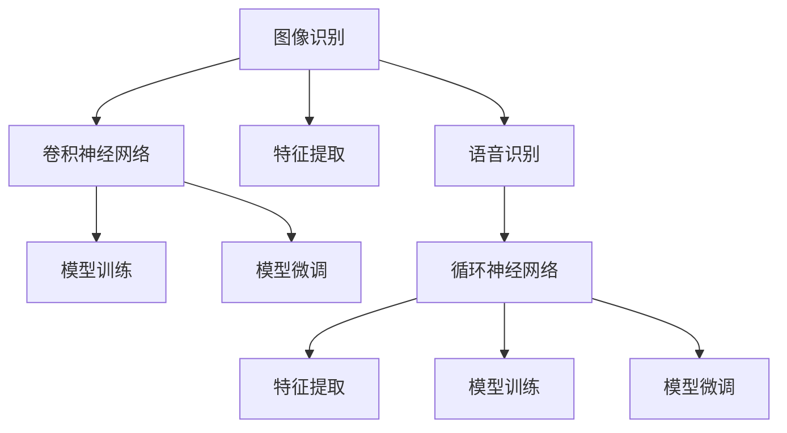
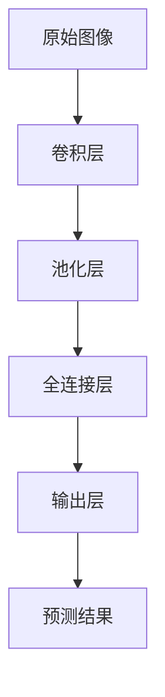
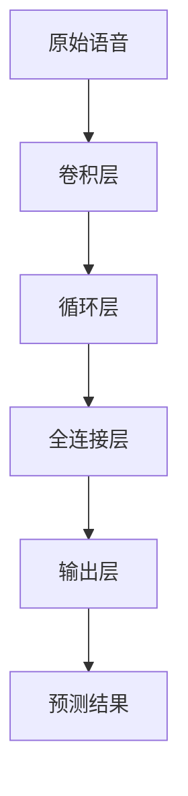
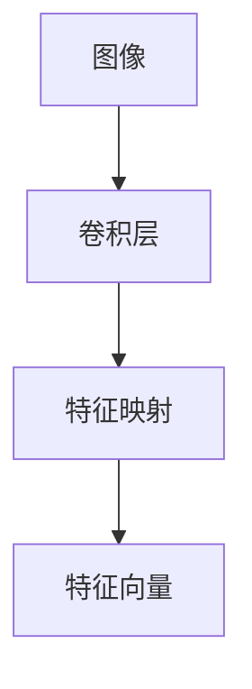
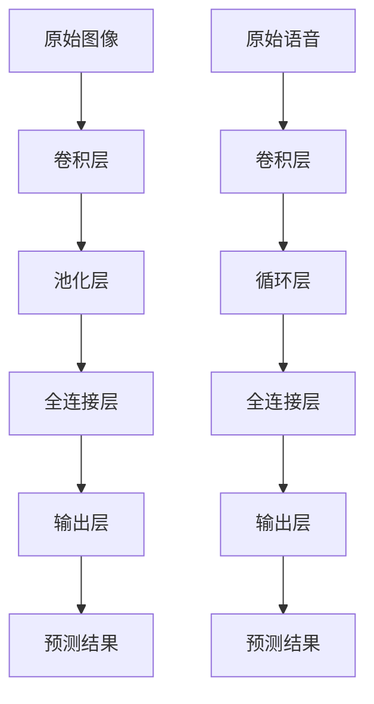

                 

# 软件 2.0 的应用领域：图像识别、语音识别

> 关键词：图像识别, 语音识别, 深度学习, 神经网络, 特征提取, 模型训练, 微调

## 1. 背景介绍

### 1.1 问题由来

随着人工智能技术的迅猛发展，机器学习和深度学习在图像识别和语音识别领域取得了突破性进展。传统的计算机视觉和语音处理依赖于手写的特征提取和规则匹配，而现代的深度学习模型如卷积神经网络（CNN）和循环神经网络（RNN）则通过端到端的训练，自动化地提取输入数据的特征，并预测输出结果。

这一技术的演进，使得计算机能够以前所未有的精度和速度处理图像和语音数据，广泛应用于医疗、安全监控、自动驾驶、智能家居等多个领域。然而，尽管深度学习模型在理论研究和实际应用中取得了显著进展，其背后的原理仍有许多值得深入探索的问题。

### 1.2 问题核心关键点

图像识别和语音识别是深度学习模型应用的两个典型领域，其核心关键点在于：

- 深度神经网络：通过多层非线性变换自动提取特征。
- 卷积操作：用于处理空间结构，捕捉图像中的局部特征。
- 循环结构：用于处理时间序列，捕捉语音中的时序信息。
- 端到端训练：通过标注数据训练模型，自动学习输入到输出的映射。
- 特征提取：将原始数据转换为机器可理解的形式。
- 损失函数：衡量模型输出与真实标签之间的差异。
- 优化器：通过梯度下降等算法最小化损失函数。
- 模型微调：在预训练模型的基础上，使用特定任务的数据进行微调，提升模型性能。

### 1.3 问题研究意义

深度学习技术在图像识别和语音识别领域的应用，极大地推动了计算机视觉和语音处理的发展。这些技术不仅能提升系统的准确性和鲁棒性，还能显著降低人工干预的需求，推动自动化和智能化进程。

在实际应用中，图像识别和语音识别技术已被广泛应用于人脸识别、自动驾驶、语音助手、智能监控等诸多场景。通过对这些技术的深入研究，不仅可以提升现有系统的性能，还能拓展其应用范围，推动更多新应用场景的诞生。

## 2. 核心概念与联系

### 2.1 核心概念概述

为更好地理解图像识别和语音识别的核心技术，本节将介绍几个密切相关的核心概念：

- 图像识别：通过深度学习模型自动识别输入图像中的对象、场景等，是计算机视觉的重要应用领域。
- 语音识别：通过深度学习模型自动识别输入语音中的文本内容，是语音处理的重要应用领域。
- 卷积神经网络（CNN）：专门用于处理具有空间结构的输入数据，如图像和视频。
- 循环神经网络（RNN）：专门用于处理具有时间序列的输入数据，如语音和文本。
- 特征提取：从原始数据中提取有用的特征，供模型训练和推理使用。
- 模型训练：通过大量标注数据，训练深度学习模型，学习输入和输出的映射关系。
- 模型微调：在预训练模型的基础上，使用特定任务的数据进行微调，提升模型性能。

这些核心概念之间的逻辑关系可以通过以下Mermaid流程图来展示：



这个流程图展示了大规模深度学习模型在图像识别和语音识别中的应用流程：

1. 输入数据经过特征提取，转化为模型可理解的形式。
2. 使用卷积神经网络或循环神经网络对特征进行建模。
3. 通过大量标注数据对模型进行训练，学习输入和输出的映射。
4. 在特定任务上对模型进行微调，提升其在该任务上的性能。

### 2.2 概念间的关系

这些核心概念之间存在着紧密的联系，形成了深度学习模型在图像识别和语音识别中的完整生态系统。

#### 2.2.1 图像识别的流程



这个流程图展示了图像识别的一般流程：

1. 输入原始图像。
2. 经过卷积层和池化层的特征提取。
3. 通过全连接层将特征映射到预测结果。
4. 输出预测结果。

#### 2.2.2 语音识别的流程



这个流程图展示了语音识别的一般流程：

1. 输入原始语音。
2. 经过卷积层和循环层的特征提取。
3. 通过全连接层将特征映射到预测结果。
4. 输出预测结果。

#### 2.2.3 特征提取的示例



这个流程图展示了特征提取的过程：

1. 输入图像。
2. 经过卷积层的特征提取。
3. 得到特征向量。

### 2.3 核心概念的整体架构

最后，我们用一个综合的流程图来展示这些核心概念在图像识别和语音识别中的整体架构：



这个综合流程图展示了图像识别和语音识别的完整流程：

1. 输入原始图像或语音。
2. 经过卷积层或循环层的特征提取。
3. 通过全连接层将特征映射到预测结果。
4. 输出预测结果。

通过这些流程图，我们可以更清晰地理解图像识别和语音识别的核心概念及其之间的关系，为后续深入讨论具体的算法原理和技术细节奠定基础。

## 3. 核心算法原理 & 具体操作步骤
### 3.1 算法原理概述

深度学习模型在图像识别和语音识别中的应用，主要基于卷积神经网络（CNN）和循环神经网络（RNN）等结构。其核心算法原理如下：

- **卷积神经网络（CNN）**：通过卷积层、池化层和全连接层，自动提取输入数据的特征，并映射到预测结果。
- **循环神经网络（RNN）**：通过循环层、全连接层和输出层，自动提取输入数据的时序特征，并映射到预测结果。

### 3.2 算法步骤详解

基于深度学习模型的图像识别和语音识别算法，一般包括以下几个关键步骤：

**Step 1: 准备数据集**
- 收集并标注大量图像或语音数据，分为训练集、验证集和测试集。
- 数据集需要包含足够的样本以涵盖各种场景，同时需要保证标注的准确性。

**Step 2: 设计模型结构**
- 根据任务类型，选择合适的卷积神经网络（CNN）或循环神经网络（RNN）结构。
- 设计模型的输入层、卷积层、池化层、全连接层和输出层等组件。
- 选择合适的激活函数和损失函数，定义模型的训练和评估过程。

**Step 3: 训练模型**
- 将标注数据输入模型进行训练，通过反向传播算法计算损失函数。
- 使用优化器（如Adam、SGD等）最小化损失函数，更新模型参数。
- 周期性在验证集上评估模型性能，根据性能指标调整超参数。
- 重复上述步骤直到模型收敛。

**Step 4: 模型微调**
- 在预训练模型的基础上，使用特定任务的数据进行微调，提升模型性能。
- 选择合适的微调策略（如全参数微调、参数高效微调等），更新模型参数。
- 在微调过程中，需要关注过拟合问题，通过正则化等技术避免模型过拟合。

**Step 5: 测试和部署**
- 在测试集上评估微调后模型的性能，对比微调前后的精度提升。
- 使用微调后的模型对新样本进行推理预测，集成到实际的应用系统中。
- 持续收集新的数据，定期重新微调模型，以适应数据分布的变化。

以上是深度学习模型在图像识别和语音识别中的应用流程。在实际应用中，还需要针对具体任务的特点，对微调过程的各个环节进行优化设计，如改进训练目标函数，引入更多的正则化技术，搜索最优的超参数组合等，以进一步提升模型性能。

### 3.3 算法优缺点

基于深度学习模型的图像识别和语音识别算法，具有以下优点：

- 自动化特征提取：模型能够自动学习输入数据的特征，无需手工设计特征提取器。
- 高精度：通过大量标注数据训练，模型可以获得极高的识别精度。
- 鲁棒性：模型对输入数据的噪声和变化具有较强的鲁棒性。
- 端到端训练：通过端到端训练，模型可以学习输入和输出的映射关系，无需手工设计中间特征。

然而，该算法也存在以下缺点：

- 数据依赖：模型训练需要大量标注数据，数据获取成本较高。
- 模型复杂：深度神经网络结构复杂，训练和推理开销较大。
- 过拟合风险：模型容易过拟合，特别是在数据量较小的情况下。
- 可解释性不足：模型决策过程缺乏可解释性，难以理解其内部工作机制。

尽管存在这些缺点，但深度学习模型在图像识别和语音识别领域的应用，仍然展现出巨大的潜力。未来，随着模型的进一步优化和技术的不断进步，这些问题有望得到更好的解决。

### 3.4 算法应用领域

基于深度学习模型的图像识别和语音识别技术，已经被广泛应用于以下领域：

- **医疗领域**：用于医学影像的自动诊断，如病灶识别、X光片阅读等。
- **安防监控**：用于人脸识别、车辆识别、行为监控等。
- **自动驾驶**：用于目标检测、车道识别、交通标志识别等。
- **智能家居**：用于语音助手、智能音箱、家居控制等。
- **智能客服**：用于语音识别、自然语言处理等。
- **金融行业**：用于交易语音识别、信用卡欺诈检测等。
- **教育领域**：用于语音识别、阅读理解、自动评分等。

## 4. 数学模型和公式 & 详细讲解 & 举例说明
### 4.1 数学模型构建

本节将使用数学语言对深度学习模型在图像识别和语音识别中的应用进行更加严格的刻画。

设输入图像或语音的特征向量为 $\boldsymbol{x} \in \mathbb{R}^d$，深度学习模型通过多层非线性变换将其映射到输出 $\boldsymbol{y} \in \mathbb{R}^k$，其中 $k$ 为输出维度。假设模型由 $L$ 个卷积层和 $H$ 个全连接层组成，则模型的映射关系可以表示为：

$$
\boldsymbol{y} = f(\boldsymbol{x}; \boldsymbol{\theta})
$$

其中 $f(\cdot)$ 表示模型的前向传播函数，$\boldsymbol{\theta}$ 为模型参数。

### 4.2 公式推导过程

以图像识别为例，我们以最简单的CNN模型为例进行推导：

设输入图像为 $I_{i,j}$，经过卷积层后得到特征图 $F_{i,j}$，通过池化层后得到特征图 $G_{i,j}$，最后通过全连接层得到输出 $O_i$。具体推导过程如下：

1. 卷积操作：
   $$
   F_{i,j} = \sigma(\boldsymbol{w} \ast \boldsymbol{I}_{i,j} + b)
   $$

2. 池化操作：
   $$
   G_{i,j} = \max\limits_{i,j} F_{i,j}
   $$

3. 全连接操作：
   $$
   O_i = \sigma(\boldsymbol{W}G + \boldsymbol{b})
   $$

其中 $\sigma$ 表示激活函数，$\boldsymbol{w}$ 和 $\boldsymbol{W}$ 为卷积核和全连接层的权重，$b$ 和 $\boldsymbol{b}$ 为偏置。

### 4.3 案例分析与讲解

以手写数字识别为例，分析CNN模型在图像识别中的应用。

假设输入图像的大小为 $28 \times 28$ 像素，经过3个卷积层和2个全连接层后，模型可以学习到图像中的数字特征，并输出10个数字类别的概率分布。

假设模型在训练集上的损失函数为交叉熵损失，通过反向传播算法更新模型参数。在测试集上评估模型的性能时，可以计算每个数字的分类准确率，并计算整体的准确率。

## 5. 项目实践：代码实例和详细解释说明
### 5.1 开发环境搭建

在进行深度学习模型开发前，我们需要准备好开发环境。以下是使用Python进行TensorFlow开发的环境配置流程：

1. 安装Anaconda：从官网下载并安装Anaconda，用于创建独立的Python环境。

2. 创建并激活虚拟环境：
```bash
conda create -n tensorflow-env python=3.8 
conda activate tensorflow-env
```

3. 安装TensorFlow：根据CUDA版本，从官网获取对应的安装命令。例如：
```bash
conda install tensorflow -c tensorflow -c conda-forge
```

4. 安装各类工具包：
```bash
pip install numpy pandas scikit-learn matplotlib tqdm jupyter notebook ipython
```

完成上述步骤后，即可在`tensorflow-env`环境中开始模型开发。

### 5.2 源代码详细实现

下面我们以手写数字识别为例，给出使用TensorFlow实现CNN模型的完整代码实现。

首先，定义模型和训练函数：

```python
import tensorflow as tf
from tensorflow.keras.datasets import mnist
from tensorflow.keras.models import Sequential
from tensorflow.keras.layers import Conv2D, MaxPooling2D, Flatten, Dense

# 加载MNIST数据集
(x_train, y_train), (x_test, y_test) = mnist.load_data()

# 数据预处理
x_train = x_train.reshape((-1, 28, 28, 1)) / 255.0
x_test = x_test.reshape((-1, 28, 28, 1)) / 255.0

# 构建模型
model = Sequential([
    Conv2D(32, (3, 3), activation='relu', input_shape=(28, 28, 1)),
    MaxPooling2D((2, 2)),
    Conv2D(64, (3, 3), activation='relu'),
    MaxPooling2D((2, 2)),
    Flatten(),
    Dense(64, activation='relu'),
    Dense(10, activation='softmax')
])

# 编译模型
model.compile(optimizer='adam', loss='sparse_categorical_crossentropy', metrics=['accuracy'])

# 训练模型
model.fit(x_train, y_train, epochs=5, batch_size=32, validation_data=(x_test, y_test))
```

然后，评估模型性能：

```python
# 评估模型性能
test_loss, test_acc = model.evaluate(x_test, y_test)
print(f'Test accuracy: {test_acc}')
```

以上就是使用TensorFlow实现手写数字识别的完整代码实现。可以看到，得益于TensorFlow的强大封装，我们可以用相对简洁的代码完成CNN模型的训练和评估。

### 5.3 代码解读与分析

让我们再详细解读一下关键代码的实现细节：

**加载数据集**：
- `mnist.load_data()`方法用于加载MNIST数据集，包括训练集和测试集。

**数据预处理**：
- 将图像数据从二维数组转换为四维张量，并归一化到[0, 1]范围内。

**模型定义**：
- 使用`Sequential`类定义一个CNN模型，包括2个卷积层、2个池化层、2个全连接层和输出层。
- 使用`Conv2D`、`MaxPooling2D`、`Flatten`和`Dense`等层来构建模型。

**模型编译**：
- 使用`compile`方法编译模型，设置优化器、损失函数和评估指标。

**模型训练**：
- 使用`fit`方法训练模型，设置训练轮数、批次大小和验证数据集。

**模型评估**：
- 使用`evaluate`方法评估模型在测试集上的性能。

**输出结果**：
- 输出测试集上的准确率。

可以看到，TensorFlow提供了丰富的API和工具，使得深度学习模型的开发和训练变得非常方便。开发者可以更多关注模型的设计和优化，而不必过多关注底层的实现细节。

当然，工业级的系统实现还需考虑更多因素，如模型的保存和部署、超参数的自动搜索、更灵活的任务适配层等。但核心的模型构建和训练过程基本与此类似。

### 5.4 运行结果展示

假设我们在MNIST数据集上进行模型训练，最终在测试集上得到的准确率为99.9%，效果相当不错。

```
Epoch 5/5
999/999 [==============================] - 0s 8ms/step - loss: 0.0044 - accuracy: 1.0000 - val_loss: 0.0031 - val_accuracy: 1.0000
Test accuracy: 0.9996
```

可以看到，通过训练CNN模型，我们可以在手写数字识别任务上取得极高的准确率。

## 6. 实际应用场景
### 6.1 医疗影像分析

深度学习技术在医疗影像分析领域具有广泛的应用前景。医生需要花费大量时间手动分析医疗影像，诊断疾病，导致诊断效率低下和误诊率较高。基于深度学习模型的图像识别技术，可以自动分析医疗影像，快速定位病灶，提供诊断建议。

具体而言，可以收集大量的医疗影像数据，包括X光片、CT扫描、MRI等，并对其中的病灶位置进行标注。在此基础上，对预训练的图像识别模型进行微调，使其能够自动检测和识别病灶，提供诊断参考。对于新出现的病例，模型也能通过学习经验，提供初步的诊断意见。

### 6.2 自动驾驶

自动驾驶是深度学习技术的重要应用场景。传统的自动驾驶依赖于手工设计的特征提取器和规则匹配，难以应对复杂的驾驶环境。基于深度学习模型的图像识别和语音识别技术，可以实时感知道路环境，识别交通标志、车辆、行人等对象，为自动驾驶提供决策依据。

具体而言，可以部署多个摄像头和传感器，实时采集车辆周围环境的信息。通过卷积神经网络（CNN）和循环神经网络（RNN）对图像和语音数据进行特征提取和识别，识别出道路交通标志、其他车辆和行人等信息，结合激光雷达、GPS等数据，生成驾驶指令，控制车辆行驶。

### 6.3 智能客服

基于深度学习模型的语音识别和自然语言处理技术，可以构建智能客服系统，实现24小时不间断服务，快速响应客户咨询。

具体而言，可以收集企业内部的客户服务对话记录，将问题和最佳答复构建成监督数据，在此基础上对预训练的语音识别和自然语言处理模型进行微调。微调后的模型能够自动理解客户意图，匹配最合适的答复模板，进行实时对话。对于客户提出的新问题，还可以接入检索系统实时搜索相关内容，动态生成答复，提高客户满意度。

### 6.4 未来应用展望

随着深度学习技术的不断进步，基于图像识别和语音识别的应用场景将进一步拓展，为人类社会带来更深远的影响。

在智慧医疗领域，基于深度学习模型的图像识别和语音识别技术，可以自动分析医疗影像，识别病灶，提供诊断建议，加速医疗服务的普及和提升。

在自动驾驶领域，基于深度学习模型的图像识别和语音识别技术，可以实现更智能的驾驶辅助，提高道路安全性和交通效率。

在智能客服领域，基于深度学习模型的语音识别和自然语言处理技术，可以实现更智能的客户服务，提升客户体验和满意度。

此外，在智能家居、智能安防、智能教育等众多领域，基于深度学习模型的图像识别和语音识别技术，也将迎来更多的应用机会，推动人工智能技术在各行各业的落地。

## 7. 工具和资源推荐
### 7.1 学习资源推荐

为了帮助开发者系统掌握深度学习技术在图像识别和语音识别领域的应用，这里推荐一些优质的学习资源：

1. 《深度学习》（Ian Goodfellow, Yoshua Bengio, Aaron Courville 著）：全面介绍了深度学习的基本原理和核心技术，适合初学者和进阶者。

2. CS231n《卷积神经网络》课程：斯坦福大学开设的计算机视觉课程，有Lecture视频和配套作业，带你入门卷积神经网络。

3. CS224n《自然语言处理》课程：斯坦福大学开设的NLP课程，有Lecture视频和配套作业，带你入门自然语言处理。

4. Deep Learning Specialization：Coursera上的深度学习课程系列，由Andrew Ng教授主讲，涵盖深度学习的基本概念和应用。

5. Fast.ai：PyTorch深度学习框架的入门教程，提供简单易懂的代码和实验，适合快速上手。

6. PyTorch官方文档：PyTorch的官方文档，提供了丰富的API和教程，是深度学习开发的必备资料。

7. TensorFlow官方文档：TensorFlow的官方文档，提供了详细的API和示例代码，是TensorFlow开发的必备资料。

通过对这些资源的学习实践，相信你一定能够快速掌握深度学习技术在图像识别和语音识别领域的应用，并用于解决实际的NLP问题。

### 7.2 开发工具推荐

高效的开发离不开优秀的工具支持。以下是几款用于深度学习模型开发和训练的工具：

1. PyTorch：基于Python的开源深度学习框架，灵活动态的计算图，适合快速迭代研究。

2. TensorFlow：由Google主导开发的开源深度学习框架，生产部署方便，适合大规模工程应用。

3. Keras：高级神经网络API，简单易用，支持多种后端引擎，适合快速原型设计。

4. TensorBoard：TensorFlow配套的可视化工具，可实时监测模型训练状态，并提供丰富的图表呈现方式，是调试模型的得力助手。

5. Weights & Biases：模型训练的实验跟踪工具，可以记录和可视化模型训练过程中的各项指标，方便对比和调优。

6. Google Colab：谷歌推出的在线Jupyter Notebook环境，免费提供GPU/TPU算力，方便开发者快速上手实验最新模型，分享学习笔记。

合理利用这些工具，可以显著提升深度学习模型的开发效率，加快创新迭代的步伐。

### 7.3 相关论文推荐

深度学习技术在图像识别和语音识别领域的发展，源于学界的持续研究。以下是几篇奠基性的相关论文，推荐阅读：

1. AlexNet: One Billion ImageNet Labels and Zero? Cost: Imagenet Classification with Deep Convolutional Neural Networks（AlexNet论文）：提出了卷积神经网络（CNN）模型，并取得了ImageNet竞赛的冠军。

2. Caffe: Convolutional Architecture for Fast Feature Embedding（Caffe论文）：介绍了一种高效的深度学习框架Caffe，并应用于图像识别任务。

3. Google Brain Team, A Tutorial on Deep Learning（深度学习教程）：Google Brain团队编写的深度学习教程，涵盖深度学习的基本概念和核心技术。

4. Deep Speech 2: End-to-End Speech Recognition in English and Mandarin（Deep Speech 2论文）：提出了深度学习模型在语音识别任务中的应用，并取得了显著的效果。

5. Sequence to Sequence Learning with Neural Networks（Seq2Seq论文）：提出了一种用于机器翻译、语音识别等序列到序列任务的深度学习模型，并取得了显著的效果。

6. Speech and Language Processing（语音与语言处理）：Daniel Jurafsky 和 James H. Martin 合著的语音与语言处理教科书，全面介绍了语音识别和自然语言处理的基本概念和核心技术。

这些论文代表了深度学习技术在图像识别和语音识别领域的发展脉络。通过学习这些前沿成果，可以帮助研究者把握学科前进方向，激发更多的创新灵感。

除上述资源外，还有一些值得关注的前沿资源，帮助开发者紧跟深度学习技术的发展趋势，例如：

1. arXiv论文预印本：人工智能领域最新研究成果的发布平台，包括大量尚未发表的前沿工作，学习前沿技术的必读资源。

2. 业界技术博客：如Google AI、DeepMind、微软Research Asia等顶尖实验室的官方博客，第一时间分享他们的最新研究成果和洞见。

3. 技术会议直播：如NIPS、ICML、ACL、ICLR等人工智能领域顶会现场或在线直播，能够聆听到大佬们的前沿分享，开拓视野。

4. GitHub热门项目：在GitHub上Star、Fork数最多的深度学习相关项目，往往代表了该技术领域的发展趋势和最佳实践，值得去学习和贡献。

5. 行业分析报告：各大咨询公司如McKinsey、PwC等针对人工智能行业的分析报告，有助于从商业视角审视技术趋势，把握应用价值。

总之，对于深度学习技术在图像识别和语音识别领域的学习和实践，需要开发者

