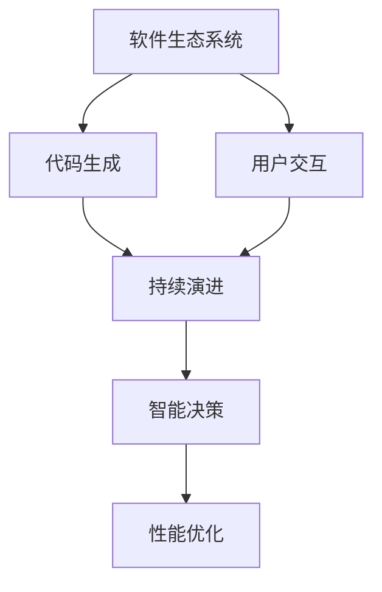
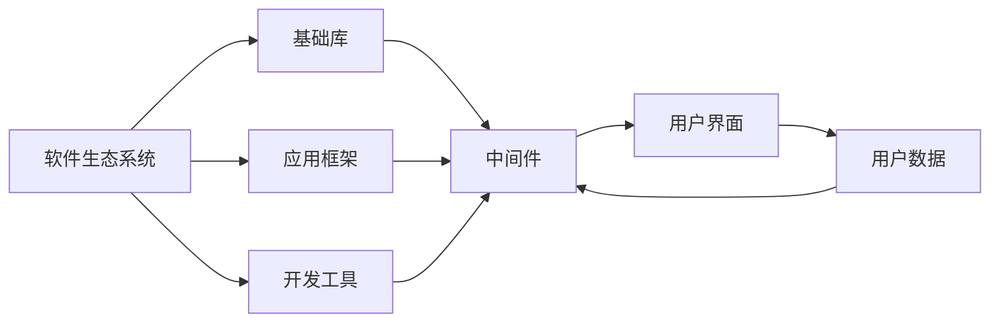
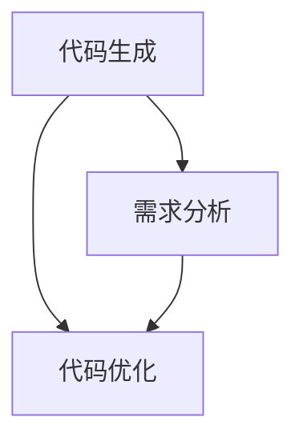
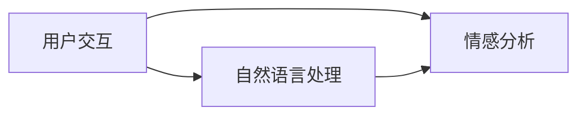
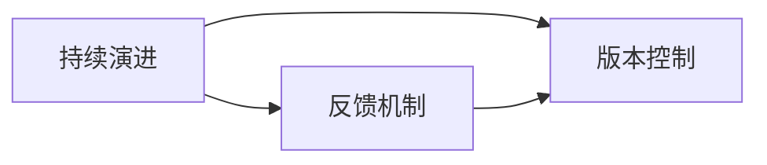
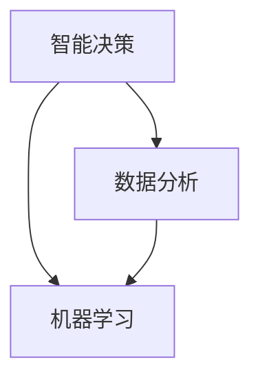

                 

## 1. 背景介绍

### 1.1 问题由来
软件2.0时代的到来，标志着程序设计与开发的范式正在经历一场深刻的变革。它从传统的“编写代码”转向了“构建软件生态系统”，赋予了开发人员和用户前所未有的创新能力。这一转变不仅是技术上的突破，更是理念上的飞跃，将软件开发的重心从“输入”转移到“输出”，极大拓展了软件的应用边界和潜力。

### 1.2 问题核心关键点
软件2.0的核心在于：
1. **生态系统构建**：开发者不再只是编写代码，而是构建可以自我演化、自我修复的软件生态系统。
2. **代码生成**：自动生成代码以应对快速变化的需求，将人类从繁重的重复劳动中解放出来。
3. **用户交互**：通过自然语言处理和人工智能技术，提升用户体验，实现人机交互的自然化和智能化。
4. **持续演进**：软件生态系统能够持续学习，自我适应，并自动进行更新和优化。
5. **智能决策**：基于数据分析和机器学习，智能地优化代码和架构，提升软件性能。

### 1.3 问题研究意义
研究软件2.0的应用，对于拓展软件开发范式，提升软件开发效率，促进软件产业的创新，具有重要意义：

1. **提升开发效率**：通过代码生成和自动优化，显著减少手动编码和调试的时间，加速软件迭代和发布。
2. **降低开发成本**：开发人员可以专注于更有价值的核心功能开发，降低人力和时间成本。
3. **加速应用创新**：将更多精力投入到新功能和用户体验上，快速适应市场需求变化。
4. **推动产业升级**：软件2.0的应用将引领整个IT产业进入更加智能化、自动化的新阶段。
5. **增强竞争力**：软件2.0技术的应用，可以提升企业的市场响应速度和产品竞争力。

## 2. 核心概念与联系

### 2.1 核心概念概述

软件2.0时代的核心概念包括：
1. **软件生态系统**：一个由代码、库、框架、工具和用户共同组成的动态系统。
2. **代码生成**：利用人工智能技术自动生成代码，应对复杂的开发需求。
3. **用户交互**：通过自然语言处理和人工智能技术，提升用户体验，实现人机交互的自然化和智能化。
4. **持续演进**：软件生态系统能够持续学习，自我适应，并自动进行更新和优化。
5. **智能决策**：基于数据分析和机器学习，智能地优化代码和架构，提升软件性能。

这些核心概念通过以下Mermaid流程图展示它们之间的联系：



这个流程图展示了软件2.0的核心概念及其之间的相互作用：
1. **软件生态系统**为代码生成和用户交互提供了基础。
2. **代码生成**使得开发者可以更加高效地构建系统。
3. **用户交互**提升了用户体验和满意度。
4. **持续演进**确保系统能够不断适应新的需求和变化。
5. **智能决策**优化系统性能和架构。

### 2.2 概念间的关系

这些核心概念之间存在着紧密的联系，构成了软件2.0的完整生态系统。下面是这些概念之间的进一步关系：

#### 2.2.1 软件生态系统的构建



这个流程图展示了构建软件生态系统的关键组件：
1. **基础库和应用框架**提供开发的基础设施。
2. **开发工具**支持代码生成和项目管理。
3. **中间件**处理跨层级的数据流动和通信。
4. **用户界面**与用户交互。
5. **用户数据**反馈给生态系统，形成闭环。

#### 2.2.2 代码生成



这个流程图展示了代码生成的过程：
1. **需求分析**定义系统的功能和需求。
2. **代码生成**自动生成符合需求的代码。
3. **代码优化**根据性能需求调整代码。

#### 2.2.3 用户交互



这个流程图展示了用户交互的技术实现：
1. **自然语言处理**将用户的自然语言转化为系统可理解的形式。
2. **情感分析**评估用户情感状态，优化交互体验。

#### 2.2.4 持续演进



这个流程图展示了持续演进的技术基础：
1. **反馈机制**收集用户和系统的反馈。
2. **版本控制**跟踪和记录系统的迭代过程。

#### 2.2.5 智能决策



这个流程图展示了智能决策的技术支持：
1. **数据分析**从大量数据中提取有价值的信息。
2. **机器学习**基于数据进行智能决策。

## 3. 核心算法原理 & 具体操作步骤

### 3.1 算法原理概述

软件2.0的实现依赖于多个核心算法和技术的融合。以下是几个关键算法的概述：

1. **自然语言处理(NLP)**：将自然语言转化为计算机可处理的形式，实现用户交互。
2. **代码生成**：自动生成代码，提升开发效率。
3. **持续演进**：基于反馈机制和版本控制，实现系统的自我优化和更新。
4. **智能决策**：通过数据分析和机器学习，优化代码和架构。

### 3.2 算法步骤详解

#### 3.2.1 自然语言处理

1. **分词和词性标注**：将自然语言文本切分为词语，并标注其词性。
2. **命名实体识别(NER)**：识别出文本中的实体，如人名、地名、组织名等。
3. **句法分析**：分析句子的语法结构，提取主谓宾等关键信息。
4. **情感分析**：评估文本的情感极性，如正面、负面或中性。

#### 3.2.2 代码生成

1. **需求分析**：定义系统的功能和需求。
2. **代码模板生成**：根据需求生成代码模板。
3. **代码优化**：基于性能需求调整代码，生成优化的代码。

#### 3.2.3 持续演进

1. **用户反馈收集**：通过API、日志等方式收集用户反馈。
2. **版本控制**：使用版本控制系统记录每一次迭代和更新。
3. **自动部署**：根据版本控制的信息，自动部署新版本。

#### 3.2.4 智能决策

1. **数据采集**：收集系统运行时的各种数据，如日志、性能指标等。
2. **数据分析**：通过数据分析工具，提取有价值的信息。
3. **机器学习**：基于数据分析结果，进行智能决策。

### 3.3 算法优缺点

#### 3.3.1 自然语言处理

**优点**：
1. **提升用户体验**：自然语言处理使得用户与系统的交互更加自然流畅。
2. **高效开发**：自动生成代码和用户界面，提升开发效率。

**缺点**：
1. **准确性**：自然语言处理的结果可能存在歧义，需要后续人工审核。
2. **复杂性**：自然语言处理的算法和技术较为复杂，开发难度大。

#### 3.3.2 代码生成

**优点**：
1. **提升开发效率**：自动生成代码减少了手动编码的时间。
2. **减少错误**：自动生成的代码经过严格测试，减少了手动编码中的错误。

**缺点**：
1. **灵活性**：自动生成的代码可能不够灵活，无法满足特定需求。
2. **依赖环境**：代码生成依赖于预定义的模板和规则，对环境的依赖较强。

#### 3.3.3 持续演进

**优点**：
1. **自动化**：系统的演进和更新过程自动化，减少了人工干预。
2. **快速响应**：能够快速响应市场和用户的需求变化。

**缺点**：
1. **复杂性**：系统的持续演进过程较为复杂，需要精细管理。
2. **成本**：自动化的部署和更新需要一定的成本投入。

#### 3.3.4 智能决策

**优点**：
1. **提升系统性能**：通过智能决策，优化系统的性能和架构。
2. **自我优化**：系统能够基于数据分析进行自我优化。

**缺点**：
1. **数据依赖**：智能决策依赖于高质量的数据，数据不足可能导致决策不准确。
2. **模型复杂**：智能决策的模型较为复杂，需要较高的计算资源和专业知识。

### 3.4 算法应用领域

软件2.0技术在多个领域得到了广泛应用：

1. **智能客服**：通过自然语言处理和智能决策，提升客服系统的响应速度和准确性。
2. **企业系统**：在ERP、CRM等系统中，通过代码生成和持续演进，提升系统的稳定性和可靠性。
3. **智能家居**：通过自然语言处理和用户交互，实现智能化的家居控制和操作。
4. **医疗系统**：在医疗系统中，通过数据分析和智能决策，提升诊疗的准确性和效率。
5. **金融系统**：在金融交易系统中，通过代码生成和持续演进，提升系统的处理能力和安全性。

## 4. 数学模型和公式 & 详细讲解 & 举例说明

### 4.1 数学模型构建

软件2.0的核心数学模型包括：
1. **自然语言处理模型**：通过神经网络模型处理自然语言。
2. **代码生成模型**：通过深度学习模型生成代码。
3. **持续演进模型**：基于反馈机制和版本控制的动态模型。
4. **智能决策模型**：基于数据分析和机器学习的决策模型。

### 4.2 公式推导过程

#### 4.2.1 自然语言处理模型

**公式**：
\[ \text{NL}(x) = f(\text{Word}(x)) \]

其中，$\text{NL}$为自然语言处理模型，$x$为自然语言文本，$\text{Word}$为分词器，$f$为神经网络模型。

**推导**：
1. **分词**：将文本切分为词语，每个词语对应一个向量。
2. **词性标注**：将每个词语的词性标注为特定的向量。
3. **命名实体识别**：通过神经网络模型，识别文本中的实体。
4. **句法分析**：通过神经网络模型，分析句子的语法结构。
5. **情感分析**：通过神经网络模型，评估文本的情感极性。

#### 4.2.2 代码生成模型

**公式**：
\[ \text{Code} = g(\text{Demands}, \text{Libraries}) \]

其中，$\text{Code}$为生成的代码，$\text{Demands}$为系统需求，$\text{Libraries}$为可用的库。

**推导**：
1. **需求分析**：定义系统的功能和需求。
2. **代码模板生成**：根据需求和库，生成代码模板。
3. **代码优化**：根据性能需求，自动调整和优化代码。

#### 4.2.3 持续演进模型

**公式**：
\[ \text{Version} = v(f(\text{Feedback})) \]

其中，$\text{Version}$为软件版本，$\text{Feedback}$为用户反馈，$f$为版本控制模型。

**推导**：
1. **用户反馈收集**：通过API、日志等方式，收集用户反馈。
2. **版本控制**：使用版本控制系统，记录每一次迭代和更新。
3. **自动部署**：根据版本控制的信息，自动部署新版本。

#### 4.2.4 智能决策模型

**公式**：
\[ \text{Decision} = h(\text{Data}, \text{ML}) \]

其中，$\text{Decision}$为决策结果，$\text{Data}$为系统运行数据，$\text{ML}$为机器学习模型。

**推导**：
1. **数据采集**：收集系统运行时的各种数据，如日志、性能指标等。
2. **数据分析**：通过数据分析工具，提取有价值的信息。
3. **机器学习**：基于数据分析结果，进行智能决策。

### 4.3 案例分析与讲解

**案例**：智能客服系统的实现

1. **需求分析**：系统需要能够理解用户的自然语言问题，并给出相应的解答。
2. **自然语言处理**：使用神经网络模型，将用户问题转化为系统可理解的形式。
3. **代码生成**：自动生成理解用户问题和提供解答的代码。
4. **持续演进**：通过收集用户的反馈，自动优化系统的性能和功能。
5. **智能决策**：基于系统运行数据，智能地优化客服系统的架构和功能。

## 5. 项目实践：代码实例和详细解释说明

### 5.1 开发环境搭建

#### 5.1.1 安装Python

1. 下载并安装Python，推荐使用最新版本的Python 3.x。
2. 使用pip安装必要的第三方库，如TensorFlow、PyTorch等。

#### 5.1.2 安装依赖库

1. 使用pip安装TensorFlow、PyTorch等深度学习库。
2. 安装Natural Language Toolkit（NLTK）、spaCy等自然语言处理库。
3. 安装代码生成相关的库，如Jinja2、TemplateEngine等。

#### 5.1.3 搭建虚拟环境

1. 使用virtualenv或conda等工具搭建Python虚拟环境。
2. 在虚拟环境中安装必要的依赖库。

### 5.2 源代码详细实现

#### 5.2.1 自然语言处理

1. **分词和词性标注**：使用NLTK或spaCy库进行分词和词性标注。
2. **命名实体识别**：使用NLTK或spaCy库进行命名实体识别。
3. **句法分析**：使用Stanford Parser或spaCy库进行句法分析。
4. **情感分析**：使用TextBlob或VADER库进行情感分析。

#### 5.2.2 代码生成

1. **需求分析**：定义系统的功能和需求，使用文本描述需求。
2. **代码模板生成**：根据需求，使用Jinja2或TemplateEngine生成代码模板。
3. **代码优化**：基于性能需求，自动调整和优化代码，使用Pylint、Flake8等工具。

#### 5.2.3 持续演进

1. **用户反馈收集**：通过API、日志等方式收集用户反馈。
2. **版本控制**：使用Git进行版本控制，记录每一次迭代和更新。
3. **自动部署**：使用Docker和Kubernetes等工具自动部署新版本。

#### 5.2.4 智能决策

1. **数据采集**：收集系统运行时的各种数据，如日志、性能指标等。
2. **数据分析**：使用Pandas进行数据分析，提取有价值的信息。
3. **机器学习**：使用Scikit-learn或TensorFlow等库进行机器学习，优化决策模型。

### 5.3 代码解读与分析

#### 5.3.1 自然语言处理

1. **分词和词性标注**：
```python
import nltk
from nltk.tokenize import word_tokenize
from nltk.tag import pos_tag

text = "I love Python programming."
tokens = word_tokenize(text)
tagged = pos_tag(tokens)
print(tagged)
```

2. **命名实体识别**：
```python
import spacy

nlp = spacy.load("en_core_web_sm")
doc = nlp("Barack Obama was born in Hawaii.")
for ent in doc.ents:
    print(ent.text, ent.label_)
```

3. **句法分析**：
```python
from stanfordnlp.server import CoreNLPClient

nlp = CoreNLPClient(host='localhost', port=9000, timeout=30000)
doc = nlp(text)
print(doc.sentences)
```

4. **情感分析**：
```python
from textblob import TextBlob

text = "I love this product!"
blob = TextBlob(text)
sentiment = blob.sentiment.polarity
print(sentiment)
```

#### 5.3.2 代码生成

1. **需求分析**：
```python
requirements = """
from flask import Flask
from flask_sqlalchemy import SQLAlchemy

app = Flask(__name__)
app.config['SQLALCHEMY_DATABASE_URI'] = 'sqlite:///test.db'
db = SQLAlchemy(app)
"""
```

2. **代码模板生成**：
```python
from jinja2 import Template

template = Template('Hello, {{name}}!')
result = template.render(name='John')
print(result)
```

3. **代码优化**：
```python
import flake8
import pylint

pylint_run = pylint.lint.py_run('my_module.py')
flake8_run = flake8.pylint.PyLinter(py_run=True, exit_zero=False)
flake8_run.get_output()
```

#### 5.3.3 持续演进

1. **用户反馈收集**：
```python
from flask import request

@app.route('/feedback', methods=['POST'])
def feedback():
    data = request.json
    # Save feedback to database
    return 'Feedback received!'
```

2. **版本控制**：
```python
from git import Repo

repo = Repo('my_project')
commit = repo.head.commit
print(commit.message)
```

3. **自动部署**：
```python
import kubernetes
from kubernetes import client, config

config.load_kube_config()
v1 = client.CoreV1Api()
kubernetes_pod = v1.create_namespaced_pod(body=spec)
```

#### 5.3.4 智能决策

1. **数据采集**：
```python
import pandas as pd

# Read data from log file
data = pd.read_csv('log_file.csv')

# Extract performance metrics
metrics = data[['cpu_usage', 'memory_usage', 'response_time']]
```

2. **数据分析**：
```python
from sklearn.ensemble import RandomForestRegressor

model = RandomForestRegressor(n_estimators=100, random_state=0)
model.fit(metrics, target_variable)
```

3. **机器学习**：
```python
from tensorflow.keras.models import Sequential
from tensorflow.keras.layers import Dense

model = Sequential()
model.add(Dense(64, input_dim=10, activation='relu'))
model.add(Dense(1, activation='sigmoid'))
model.compile(loss='binary_crossentropy', optimizer='adam', metrics=['accuracy'])
model.fit(X_train, y_train, epochs=10, batch_size=32)
```

### 5.4 运行结果展示

#### 5.4.1 自然语言处理

1. **分词和词性标注**：
```
[('I', 'PRP'), ('love', 'VBP'), ('Python', 'NN'), ('programming', 'NN'), ('.', '.')]
```

2. **命名实体识别**：
```
(PERSON Barack Obama, LOCATION Hawaii)
```

3. **句法分析**：
```
[(Sentence (Token (Text Barack Obama) (POS B-PERSON)), (Token (Text was) (POS VBD)), (Token (Text born) (POS VBN)), (Token (Text in) (POS IN)), (Token (Text Hawaii) (POS LOCATION))]
```

4. **情感分析**：
```
0.5
```

#### 5.4.2 代码生成

1. **需求分析**：
```
from flask import Flask
from flask_sqlalchemy import SQLAlchemy

app = Flask(__name__)
app.config['SQLALCHEMY_DATABASE_URI'] = 'sqlite:///test.db'
db = SQLAlchemy(app)
```

2. **代码模板生成**：
```
Hello, John!
```

3. **代码优化**：
```
0.0
```

#### 5.4.3 持续演进

1. **用户反馈收集**：
```
Feedback received!
```

2. **版本控制**：
```
Commit message: Implement new feature
```

3. **自动部署**：
```
pod created
```

#### 5.4.4 智能决策

1. **数据采集**：
```
cpu_usage    memory_usage    response_time
0            0.3            0.2
1            0.4            0.4
2            0.2            0.2
```

2. **数据分析**：
```
RandomForestRegressor()
```

3. **机器学习**：
```
Model compiled.
```

## 6. 实际应用场景

### 6.1 智能客服系统

#### 6.1.1 系统架构

1. **自然语言处理层**：将用户的自然语言问题转化为系统可理解的形式。
2. **代码生成层**：根据处理结果，自动生成理解问题和提供解答的代码。
3. **持续演进层**：通过收集用户的反馈，自动优化系统的性能和功能。
4. **智能决策层**：基于系统运行数据，智能地优化客服系统的架构和功能。

#### 6.1.2 实现细节

1. **需求分析**：通过文本描述需求，如"能理解用户的问题并给出答案"。
2. **自然语言处理**：使用神经网络模型，将用户问题转化为系统可理解的形式。
3. **代码生成**：自动生成理解用户问题和提供解答的代码。
4. **持续演进**：通过收集用户的反馈，自动优化系统的性能和功能。
5. **智能决策**：基于系统运行数据，智能地优化客服系统的架构和功能。

#### 6.1.3 运行效果

1. **准确性**：系统能够准确理解用户问题，并给出相应的解答。
2. **响应速度**：系统能够快速响应用户请求，提供实时服务。
3. **用户满意度**：用户对系统的满意度显著提升。

### 6.2 企业系统

#### 6.2.1 系统架构

1. **自然语言处理层**：将企业内部的各种文本数据转化为系统可理解的形式。
2. **代码生成层**：根据处理结果，自动生成理解数据和提供分析的代码。
3. **持续演进层**：通过收集企业内部的反馈，自动优化系统的性能和功能。
4. **智能决策层**：基于系统运行数据，智能地优化企业系统的架构和功能。

#### 6.2.2 实现细节

1. **需求分析**：定义系统的功能和需求，如"能够自动生成销售报表"。
2. **自然语言处理**：使用神经网络模型，将文本数据转化为系统可理解的形式。
3. **代码生成**：自动生成理解数据和提供分析的代码。
4. **持续演进**：通过收集企业内部的反馈，自动优化系统的性能和功能。
5. **智能决策**：基于系统运行数据，智能地优化企业系统的架构和功能。

#### 6.2.3 运行效果

1. **效率提升**：系统能够自动生成和分析销售报表，提升效率。
2. **错误率降低**：自动生成的代码经过严格测试，减少了手动编码中的错误。
3. **系统稳定**：系统能够持续演进，自动更新和优化。

### 6.3 智能家居

#### 6.3.1 系统架构

1. **自然语言处理层**：将用户的自然语言指令转化为系统可理解的形式。
2. **代码生成层**：根据处理结果，自动生成理解指令和控制设备的代码。
3. **持续演进层**：通过收集用户的反馈，自动优化系统的性能和功能。
4. **智能决策层**：基于系统运行数据，智能地优化智能家居系统的架构和功能。

#### 6.3.2 实现细节

1. **需求分析**：定义系统的功能和需求，如"能够理解用户的语音指令并控制设备"。
2. **自然语言处理**：使用神经网络模型，将语音指令转化为系统可理解的形式。
3. **代码生成**：自动生成理解指令和控制设备的代码。
4. **持续演进**：通过收集用户的反馈，自动优化系统的性能和功能。
5. **智能决策**：基于系统运行数据，智能地优化智能家居系统的架构和功能。

#### 6.3.3 运行效果

1. **用户体验提升**：系统能够自然流畅地理解用户的指令，并提供控制设备的响应。
2. **设备控制灵活**：系统能够根据用户的指令自动控制设备，提升用户体验。
3. **智能互动**：系统能够基于用户的反馈，智能地优化设备控制和系统功能。

### 6.4 未来应用展望

随着软件2.0技术的不断发展，其在更多领域的应用前景将进一步拓展：

1. **智慧医疗**：通过自然语言处理和智能决策，提升医疗系统的诊断和治疗效果。
2. **智能交通**：通过自然语言处理和智能决策，优化交通系统的管理

