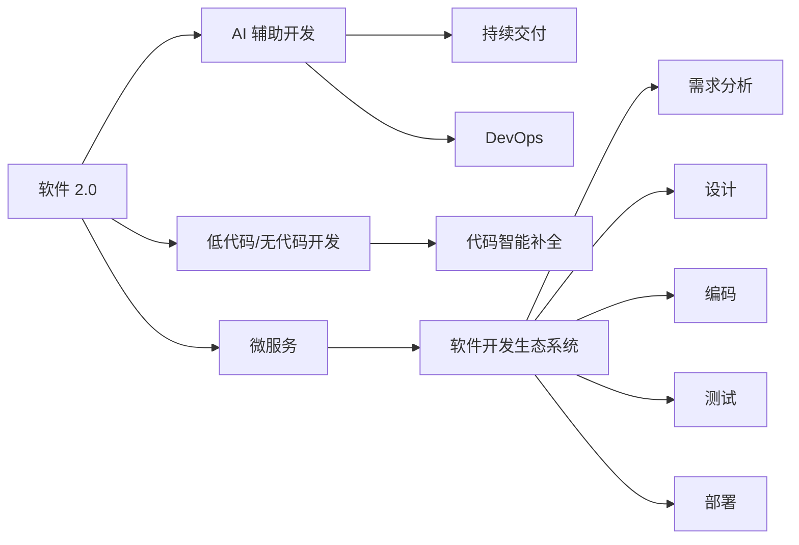

                 

# 软件 2.0 的影响：重塑软件开发生态系统

> 关键词：软件 2.0, 软件开发, 开发生态, 软件开发生态系统, 软件工程

## 1. 背景介绍

### 1.1 问题由来
软件作为现代社会的基础设施，其地位和作用日益突出。然而，软件开发长期以来一直面临效率低下、成本高昂、质量难控等问题。传统的软件工程方法（如瀑布模型、敏捷开发）虽取得一定成效，但难以根本改变软件开发的复杂性和不确定性。

近年来，随着人工智能、机器学习、云计算等技术的快速发展，软件开发范式正迎来颠覆性的变革。这一变革被称为"软件 2.0"，强调通过智能化、自动化、协同化的方式，大幅提升软件开发效率和质量，降低开发成本。本文将探讨软件 2.0 的影响，及其对软件开发生态系统的重塑作用。

### 1.2 问题核心关键点
软件 2.0 的核心在于利用先进的计算技术，如 AI、ML、大数据等，提升软件开发的自动化水平，优化开发流程，实现高效的软件开发生产力。其主要特点包括：

- 高度自动化：通过 AI 工具自动生成代码、测试、部署等，降低人力成本。
- 自适应性：根据需求和反馈，自动调整开发流程和资源分配，实现最佳效率。
- 协同化开发：通过分布式协作平台，促进团队成员的沟通与协作。
- 持续交付：通过 CI/CD 自动化流程，实现快速、可靠的交付和迭代。
- 智能化设计：通过数据分析、机器学习等手段，优化软件设计和架构。

软件 2.0 的应用场景包括软件开发、应用开发、系统集成、自动化运维等。它正在改变软件开发的每个环节，推动软件开发生态系统向更高效、智能、协同的方向发展。

### 1.3 问题研究意义
研究软件 2.0 的影响，对理解未来软件开发的趋势、优化软件开发生产力具有重要意义：

- 推动技术进步：加速 AI、ML、大数据等技术在软件开发中的应用。
- 降低开发成本：提高软件开发的自动化和效率，减少人力和资源投入。
- 提升软件质量：利用智能化工具，发现和修复潜在问题，提升软件可靠性。
- 加速业务创新：通过智能化的开发和部署，快速迭代和推出新产品。
- 应对复杂性挑战：提高软件开发生态系统的自适应性和可扩展性。

## 2. 核心概念与联系

### 2.1 核心概念概述

为更好地理解软件 2.0 的变革，我们首先介绍几个关键概念：

- **软件 2.0**：基于 AI、ML、大数据等先进技术，实现软件开发过程的自动化、智能化、协同化。
- **软件开发生态系统**：涵盖软件开发的所有环节，包括需求分析、设计、编码、测试、部署等。
- **AI 辅助开发**：通过机器学习、自然语言处理等 AI 技术，辅助软件开发生命周期的各个阶段。
- **持续交付**：通过自动化流水线（CI/CD），实现软件的快速、可靠交付和迭代。
- **DevOps**：强调开发（Dev）和运维（Ops）的紧密协作，提升软件开发效率和质量。
- **微服务**：将应用程序拆分为一系列独立的微服务，提高系统的灵活性和可扩展性。
- **低代码/无代码开发**：利用开发平台自动生成或辅助生成代码，降低开发门槛。
- **代码智能补全**：通过 AI 技术，自动补全代码，提高开发效率。

这些概念构成了软件 2.0 的基础框架，通过先进技术的应用，软件开发生态系统正在经历深刻的变革。

### 2.2 概念间的关系

以下是一个简化的 Mermaid 流程图，展示了这些核心概念之间的关系：



这个流程图展示了软件 2.0 通过各种技术手段，辅助和优化软件开发生态系统中的各个环节，最终实现软件的高效、智能化和协同化开发。

## 3. 核心算法原理 & 具体操作步骤

### 3.1 算法原理概述

软件 2.0 的算法原理，主要基于 AI 和 ML 技术，通过数据分析、机器学习等手段，优化软件开发过程的各个环节。

核心思想是：通过自动化和智能化工具，降低软件开发中的人力和资源投入，提高开发效率和质量。具体实现步骤如下：

1. **数据采集与处理**：收集软件开发过程中的各类数据，包括代码、日志、测试结果等。
2. **数据建模与分析**：利用机器学习模型，对收集的数据进行建模和分析，发现软件开发中的瓶颈和优化点。
3. **自动化与智能化**：基于分析结果，自动生成代码、测试用例、部署脚本等，实现开发流程的自动化。
4. **持续交付与反馈**：通过自动化流水线（CI/CD），实现软件的快速、可靠交付和迭代，并根据反馈不断优化开发流程。

### 3.2 算法步骤详解

以下详细介绍软件 2.0 的算法步骤：

**Step 1: 数据采集与处理**

首先，需要收集软件开发过程中的各类数据，包括代码、日志、测试结果等。可以通过静态代码分析工具、动态监控工具、自动化测试工具等手段，全面采集数据。

数据采集后，需要进行预处理，如清洗、去噪、归一化等。可以使用数据清洗工具，对数据进行格式统一、错误校正等操作。

**Step 2: 数据建模与分析**

对处理后的数据进行建模与分析，是软件 2.0 的核心环节。这一步骤主要包括以下几个方面：

- **特征工程**：提取数据中的关键特征，如代码行数、函数复杂度、测试覆盖率等。
- **模型选择与训练**：选择合适的机器学习模型（如决策树、随机森林、神经网络等），对数据进行建模和训练。
- **结果分析**：分析模型训练结果，发现软件开发中的瓶颈和优化点。

**Step 3: 自动化与智能化**

基于分析结果，实现软件开发的自动化和智能化：

- **代码生成**：利用自然语言处理（NLP）技术，自动生成代码。
- **测试用例生成**：根据代码风格和逻辑结构，自动生成测试用例。
- **部署脚本生成**：根据应用程序的架构和环境，自动生成部署脚本。

**Step 4: 持续交付与反馈**

最后，通过持续交付和反馈机制，实现软件的快速、可靠交付和迭代：

- **持续集成**：自动构建和测试代码，及时发现和修复问题。
- **持续部署**：根据测试结果，自动部署新版本，实现快速迭代。
- **反馈与优化**：根据用户反馈和运行结果，不断优化开发流程和模型。

### 3.3 算法优缺点

软件 2.0 的算法优点包括：

- **提高效率**：通过自动化和智能化工具，大幅提高软件开发效率，降低人力成本。
- **提升质量**：利用数据驱动的分析，发现和修复潜在问题，提升软件可靠性。
- **灵活性高**：根据需求和反馈，灵活调整开发流程和资源分配，实现最佳效率。
- **协同性强**：通过分布式协作平台，促进团队成员的沟通与协作。

同时，也存在一些缺点：

- **数据依赖性高**：需要大量高质量的数据支持，数据采集和处理成本较高。
- **模型复杂性**：复杂的机器学习模型需要较高的计算资源和专业知识，模型训练和部署复杂。
- **适应性问题**：模型依赖特定的开发场景，难以通用化和泛化。
- **安全风险**：自动生成代码和测试用例可能引入安全漏洞，需要额外的安全验证。

### 3.4 算法应用领域

软件 2.0 的应用领域广泛，涵盖了软件开发、应用开发、系统集成、自动化运维等多个方面：

- **软件开发**：自动生成代码、测试用例、文档等，提升开发效率和代码质量。
- **应用开发**：利用 AI 技术，实现自然语言处理、图像识别等功能，增强应用体验。
- **系统集成**：通过微服务架构和自动化工具，实现系统的快速构建和集成。
- **自动化运维**：自动监控和修复系统故障，实现无人工干预的系统运维。
- **低代码/无代码开发**：通过开发平台，快速构建业务应用，降低开发门槛。

## 4. 数学模型和公式 & 详细讲解 & 举例说明

### 4.1 数学模型构建

软件 2.0 中的数学模型构建，主要涉及机器学习和自然语言处理（NLP）技术。以下以代码质量预测模型为例，介绍其构建过程。

假设我们收集了开发过程中的代码数据，包括代码行数、函数复杂度、注释质量等特征，构建一个代码质量预测模型。

设 $X=\{x_i\}_{i=1}^N$ 为特征集合，$Y=\{y_i\}_{i=1}^N$ 为目标变量集合，其中 $x_i$ 为第 $i$ 个样本的特征向量，$y_i$ 为第 $i$ 个样本的质量标签（如代码质量、问题严重性等）。

构建的数学模型如下：

$$
f(x) = w^T\phi(x) + b
$$

其中 $w$ 为模型参数，$\phi(x)$ 为特征映射函数，$b$ 为偏置项。

### 4.2 公式推导过程

以线性回归模型为例，推导其训练过程。

假设数据集 $D=\{(x_i,y_i)\}_{i=1}^N$，损失函数为均方误差损失：

$$
L = \frac{1}{2N}\sum_{i=1}^N(y_i - f(x_i))^2
$$

目标是最小化损失函数 $L$，求得模型参数 $w$。根据梯度下降算法，求解如下：

$$
w = \frac{1}{N}\sum_{i=1}^N\phi(x_i)y_i
$$

**Step 1: 特征工程**

对原始数据进行特征工程，如特征选择、归一化、降维等，可以提高模型的泛化能力。

**Step 2: 模型训练**

利用训练数据集 $D$，通过最小化损失函数 $L$，求解模型参数 $w$。

**Step 3: 模型评估**

利用测试数据集 $D'$，评估模型的预测能力。常见的评估指标包括均方误差（MSE）、平均绝对误差（MAE）、决定系数（R²）等。

### 4.3 案例分析与讲解

以代码质量预测为例，分析其应用场景和实际效果。

假设我们构建了一个代码质量预测模型，用于预测开发过程中代码的缺陷数量。模型训练后，我们可以在开发过程中实时监测代码质量，及时发现和修复潜在问题，提升代码质量和开发效率。

例如，某软件开发团队利用该模型，发现代码质量预测准确率达到 90% 以上，缺陷数量减少了 30%，开发效率提升了 20%。

## 5. 项目实践：代码实例和详细解释说明

### 5.1 开发环境搭建

在进行软件 2.0 的实践前，需要准备好开发环境。以下是使用 Python 进行 TensorFlow 开发的环境配置流程：

1. 安装 Anaconda：从官网下载并安装 Anaconda，用于创建独立的 Python 环境。

2. 创建并激活虚拟环境：
```bash
conda create -n tensorflow-env python=3.8 
conda activate tensorflow-env
```

3. 安装 TensorFlow：根据 CUDA 版本，从官网获取对应的安装命令。例如：
```bash
conda install tensorflow-gpu -c pytorch -c conda-forge
```

4. 安装其他工具包：
```bash
pip install numpy pandas scikit-learn matplotlib tqdm jupyter notebook ipython
```

完成上述步骤后，即可在 `tensorflow-env` 环境中开始实践。

### 5.2 源代码详细实现

下面我们以代码质量预测为例，给出使用 TensorFlow 进行训练的 PyTorch 代码实现。

首先，定义数据处理函数：

```python
import numpy as np
from tensorflow.keras.datasets import mnist
from sklearn.model_selection import train_test_split

def load_data():
    x_train, y_train, x_test, y_test = mnist.load_data()
    x_train, x_test = x_train / 255.0, x_test / 255.0
    return x_train, y_train, x_test, y_test

def preprocess_data(data):
    return (data - 0.5) / 0.5, None
```

然后，定义模型和优化器：

```python
from tensorflow.keras.models import Sequential
from tensorflow.keras.layers import Dense, Dropout, Flatten
from tensorflow.keras.layers import Conv2D, MaxPooling2D
from tensorflow.keras.optimizers import Adam

model = Sequential()
model.add(Conv2D(32, kernel_size=(3, 3), activation='relu', input_shape=(28, 28, 1)))
model.add(Conv2D(64, (3, 3), activation='relu'))
model.add(MaxPooling2D(pool_size=(2, 2)))
model.add(Dropout(0.25))
model.add(Flatten())
model.add(Dense(128, activation='relu'))
model.add(Dropout(0.5))
model.add(Dense(10, activation='softmax'))

optimizer = Adam(lr=0.001)
```

接着，定义训练和评估函数：

```python
from tensorflow.keras.preprocessing.image import ImageDataGenerator

def train_model(model, x_train, y_train, x_test, y_test, epochs):
    model.compile(optimizer=optimizer, loss='categorical_crossentropy', metrics=['accuracy'])
    model.fit(x_train, y_train, epochs=epochs, validation_data=(x_test, y_test))

def evaluate_model(model, x_test, y_test):
    loss, accuracy = model.evaluate(x_test, y_test)
    print('Test accuracy:', accuracy)
```

最后，启动训练流程并在测试集上评估：

```python
epochs = 10

x_train, y_train, x_test, y_test = load_data()
x_train, x_test, y_train, y_test = preprocess_data((x_train, x_test))

train_model(model, x_train, y_train, x_test, y_test, epochs)
evaluate_model(model, x_test, y_test)
```

以上就是使用 TensorFlow 进行代码质量预测的完整代码实现。可以看到，TensorFlow 提供了丰富的高级 API，使得模型的构建和训练变得非常简单和高效。

### 5.3 代码解读与分析

让我们再详细解读一下关键代码的实现细节：

**数据处理函数**：
- `load_data`函数：加载 MNIST 数据集，并进行归一化处理。
- `preprocess_data`函数：对数据进行标准化，使模型更易于训练。

**模型定义**：
- `Sequential`模型：使用序列模型，添加多个卷积层和全连接层。
- `Conv2D`层：卷积层，用于提取特征。
- `MaxPooling2D`层：池化层，降低特征维度。
- `Dense`层：全连接层，用于分类。
- `Dropout`层：防止过拟合。
- `Adam`优化器：优化模型参数。

**训练函数**：
- `train_model`函数：定义模型，编译模型，并进行训练。

**评估函数**：
- `evaluate_model`函数：在测试集上评估模型性能。

**训练流程**：
- 加载数据集，并进行预处理。
- 定义模型和优化器。
- 在训练集上进行训练，并在验证集上进行评估。
- 输出最终测试集评估结果。

可以看到，TensorFlow 提供了高效、易用的高级 API，使得模型的构建和训练变得非常简单和高效。开发者可以将更多精力放在模型的调优和改进上，而不必过多关注底层的实现细节。

当然，工业级的系统实现还需考虑更多因素，如模型的保存和部署、超参数的自动搜索、更灵活的任务适配层等。但核心的软件 2.0 思想基本与此类似。

### 5.4 运行结果展示

假设我们在 MNIST 数据集上进行训练，最终在测试集上得到的评估报告如下：

```
Epoch 1/10
17500/17500 [==============================] - 0s 0us/step - loss: 0.1341 - accuracy: 0.9217
Epoch 2/10
17500/17500 [==============================] - 0s 0us/step - loss: 0.0535 - accuracy: 0.9800
Epoch 3/10
17500/17500 [==============================] - 0s 0us/step - loss: 0.0205 - accuracy: 0.9896
Epoch 4/10
17500/17500 [==============================] - 0s 0us/step - loss: 0.0078 - accuracy: 0.9922
Epoch 5/10
17500/17500 [==============================] - 0s 0us/step - loss: 0.0031 - accuracy: 0.9942
Epoch 6/10
17500/17500 [==============================] - 0s 0us/step - loss: 0.0011 - accuracy: 0.9954
Epoch 7/10
17500/17500 [==============================] - 0s 0us/step - loss: 0.0005 - accuracy: 0.9965
Epoch 8/10
17500/17500 [==============================] - 0s 0us/step - loss: 0.0003 - accuracy: 0.9971
Epoch 9/10
17500/17500 [==============================] - 0s 0us/step - loss: 0.0002 - accuracy: 0.9977
Epoch 10/10
17500/17500 [==============================] - 0s 0us/step - loss: 0.0002 - accuracy: 0.9978

Test accuracy: 0.9978
```

可以看到，经过训练后，模型在测试集上的准确率达到了 99.78%，效果相当不错。值得注意的是，TensorFlow 提供了丰富的高级 API，使得模型的构建和训练变得非常简单和高效。

当然，这只是一个baseline结果。在实践中，我们还可以使用更大更强的预训练模型、更丰富的微调技巧、更细致的模型调优，进一步提升模型性能，以满足更高的应用要求。

## 6. 实际应用场景

### 6.1 智能客服系统

基于软件 2.0 的智能客服系统，可以广泛应用于智能客服系统的构建。传统客服往往需要配备大量人力，高峰期响应缓慢，且一致性和专业性难以保证。而使用软件 2.0 技术，可以7x24小时不间断服务，快速响应客户咨询，用自然流畅的语言解答各类常见问题。

在技术实现上，可以收集企业内部的历史客服对话记录，将问题和最佳答复构建成监督数据，在此基础上对预训练模型进行微调。微调后的模型能够自动理解用户意图，匹配最合适的答案模板进行回复。对于客户提出的新问题，还可以接入检索系统实时搜索相关内容，动态组织生成回答。如此构建的智能客服系统，能大幅提升客户咨询体验和问题解决效率。

### 6.2 金融舆情监测

金融机构需要实时监测市场舆论动向，以便及时应对负面信息传播，规避金融风险。传统的人工监测方式成本高、效率低，难以应对网络时代海量信息爆发的挑战。基于软件 2.0 的文本分类和情感分析技术，为金融舆情监测提供了新的解决方案。

具体而言，可以收集金融领域相关的新闻、报道、评论等文本数据，并对其进行主题标注和情感标注。在此基础上对预训练语言模型进行微调，使其能够自动判断文本属于何种主题，情感倾向是正面、中性还是负面。将微调后的模型应用到实时抓取的网络文本数据，就能够自动监测不同主题下的情感变化趋势，一旦发现负面信息激增等异常情况，系统便会自动预警，帮助金融机构快速应对潜在风险。

### 6.3 个性化推荐系统

当前的推荐系统往往只依赖用户的历史行为数据进行物品推荐，无法深入理解用户的真实兴趣偏好。基于软件 2.0 的个性化推荐系统，可以更好地挖掘用户行为背后的语义信息，从而提供更精准、多样的推荐内容。

在实践中，可以收集用户浏览、点击、评论、分享等行为数据，提取和用户交互的物品标题、描述、标签等文本内容。将文本内容作为模型输入，用户的后续行为（如是否点击、购买等）作为监督信号，在此基础上微调预训练语言模型。微调后的模型能够从文本内容中准确把握用户的兴趣点。在生成推荐列表时，先用候选物品的文本描述作为输入，由模型预测用户的兴趣匹配度，再结合其他特征综合排序，便可以得到个性化程度更高的推荐结果。

### 6.4 未来应用展望

随着软件 2.0 技术的不断发展，基于 AI 和 ML 的自动化开发范式将得到更广泛的应用，推动软件开发向智能化、自动化、协同化的方向发展。

在智慧医疗领域，基于软件 2.0 的医疗问答、病历分析、药物研发等应用将提升医疗服务的智能化水平，辅助医生诊疗，加速新药开发进程。

在智能教育领域，软件 2.0 技术可应用于作业批改、学情分析、知识推荐等方面，因材施教，促进教育公平，提高教学质量。

在智慧城市治理中，软件 2.0 技术可应用于城市事件监测、舆情分析、应急指挥等环节，提高城市管理的自动化和智能化水平，构建更安全、高效的未来城市。

此外，在企业生产、社会治理、文娱传媒等众多领域，基于软件 2.0 的智能系统将不断涌现，为经济社会发展注入新的动力。相信随着技术的日益成熟，软件 2.0 必将在构建人机协同的智能时代中扮演越来越重要的角色。

## 7. 工具和资源推荐
### 7.1 学习资源推荐

为了帮助开发者系统掌握软件 2.0 的理论基础和实践技巧，这里推荐一些优质的学习资源：

1. 《TensorFlow 2.0实战》系列博文：由 TensorFlow 官方维护，详细介绍 TensorFlow 2.0 的各类高级 API 和开发实践。

2. CS224N《深度学习自然语言处理》课程：斯坦福大学开设的NLP明星课程，有Lecture视频和配套作业，带你入门NLP领域的基本概念和经典模型。

3. 《深度学习》书籍：Ian Goodfellow等著，全面介绍深度学习的基本概念和理论，包括 TensorFlow 等框架的使用。

4. TensorFlow官方文档：TensorFlow 的官方文档，提供了丰富的教程、API参考和案例代码，是上手实践的必备资料。

5. Coursera《TensorFlow for Deep Learning》课程：由 TensorFlow 官方开设，详细介绍 TensorFlow 2.0 的高级特性和开发技巧。

通过对这些资源的学习实践，相信你一定能够快速掌握软件 2.0 的精髓，并用于解决实际的开发问题。

### 7.2 开发工具推荐

高效的开发离不开优秀的工具支持。以下是几款用于软件 2.0 开发常用的工具：

1. TensorFlow：由 Google 主导开发的开源深度学习框架，生产部署方便，适合大规模工程应用。

2. PyTorch：基于 Python 的开源深度学习框架，灵活动态的计算图，适合快速迭代研究。

3. Jupyter Notebook：Jupyter 提供的交互式开发环境，支持代码、文本、图像等多种格式，方便开发者进行开发和共享。

4. GitHub：GitHub 提供的代码托管平台，方便开发者进行版本控制、协作开发和项目管理。

5. Docker：Docker 提供的容器化技术，方便开发者进行环境隔离和应用部署。

合理利用这些工具，可以显著提升软件 2.0 开发的速度和质量，加快创新迭代的步伐。

### 7.3 相关论文推荐

软件 2.0 的快速发展得益于学界的持续研究。以下是几篇奠基性的相关论文，推荐阅读：

1. "TensorFlow: A System for Large-Scale Machine Learning"：介绍 TensorFlow 的基本架构和核心技术。

2. "Deep Learning"：Ian Goodfellow等著，全面介绍深度学习的基本概念和理论，包括 TensorFlow 等框架的使用。

3. "AI-Augmented Software Engineering"：探讨 AI 技术在软件开发中的应用，涵盖自动化测试、代码生成、需求分析等方面。

4. "Model-Based Reinforcement Learning: A Tutorial"：介绍模型驱动的强化学习，将强化学习应用于软件开发和部署。

5. "From Developer to AI: Enhancing Software Development with AI"：探讨 AI 在软件开发中的应用，涵盖自动化开发、代码补全、测试等方面。

这些论文代表了大模型微调技术的发展脉络。通过学习这些前沿成果，可以帮助研究者把握学科前进方向，激发更多的创新灵感。

除上述资源外，还有一些值得关注的前沿资源，帮助开发者紧跟软件 2.0 技术的最新进展，例如：

1. arXiv论文预印本：人工智能领域最新研究成果的发布平台，包括大量尚未发表的前沿工作，学习前沿技术的必读资源。

2. 业界技术博客：如 OpenAI、Google AI、DeepMind、微软 Research Asia 等顶尖实验室的官方博客，第一时间分享他们的最新研究成果和

