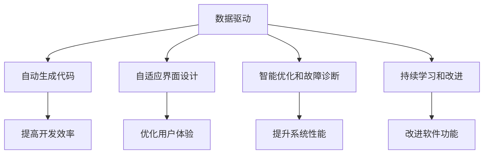

                 

# 软件 2.0 的时代：数据驱动一切

## 1. 背景介绍

在过去几十年里，软件开发和应用技术已经发生了翻天覆地的变化。从最初的机器语言编程，到汇编语言，再到高级语言（如C++、Java）的广泛应用，以及近些年人工智能、大数据和云计算等技术的蓬勃发展，软件技术不断迭代，给我们的工作和生活带来了前所未有的便利。然而，当前的软件开发范式依然以人类的设计、编码和测试为中心，数据的作用相对较小。本文旨在探讨软件2.0时代，数据如何驱动软件开发的各个环节，带来全新的软件形态和开发模式。

### 1.1 软件1.0的局限性

软件1.0时代，程序员是软件开发的主导者。他们需要详细设计软件的功能、架构、界面，然后编写代码，进行测试，最终上线发布。这种范式存在以下局限性：

- **人工设计工作量大**：需要人类对软件功能、架构、界面等进行详细设计，耗时耗力。
- **无法全面覆盖用户需求**：人类无法全面预测用户的实际使用场景和需求，可能导致功能缺失或冗余。
- **维护成本高**：功能变更或新增需要大量人工编码和测试，维护成本高昂。
- **难以应对数据驱动**：数据在软件开发和应用中的地位较低，难以通过数据分析优化设计和决策。

### 1.2 软件2.0的兴起

软件2.0时代，数据成为软件开发和应用的核心驱动力。通过数据驱动的开发范式，软件系统能够更高效地捕捉用户需求、优化功能设计、提升用户体验和降低维护成本。具体来说，数据驱动的软件开发范式包括但不限于以下方面：

- **自动生成代码**：通过自动生成代码工具，利用数据和算法生成可用的代码片段，提高开发效率。
- **自适应界面设计**：基于用户数据和行为，动态调整界面布局和元素，优化用户体验。
- **智能优化和故障诊断**：通过数据分析，智能优化系统性能，快速定位和修复故障。
- **持续学习和改进**：基于用户反馈数据，持续学习用户需求和偏好，不断改进软件功能。

## 2. 核心概念与联系

### 2.1 核心概念概述

在探讨软件2.0时代之前，我们需要先理解一些关键概念：

- **数据驱动**：指在软件开发的各个环节中，以数据为基础，通过数据分析和模型优化，驱动软件的各项决策和设计。
- **自动生成代码**：指使用工具自动根据需求生成代码，提升开发效率和代码质量。
- **自适应界面设计**：指基于用户数据和行为，动态调整界面布局和元素，提升用户体验。
- **智能优化和故障诊断**：指通过数据分析，智能优化系统性能，快速定位和修复故障。
- **持续学习和改进**：指基于用户反馈数据，持续学习用户需求和偏好，不断改进软件功能。

这些概念构成了软件2.0时代的核心基础，通过它们，软件系统能够更高效、更智能地适应用户需求和环境变化。

### 2.2 概念间的关系

这些核心概念之间的关系可以通过以下Mermaid流程图来展示：



这个流程图展示了数据驱动在各个环节的作用：

1. **自动生成代码**：数据驱动可以自动生成代码，提高开发效率。
2. **自适应界面设计**：数据驱动可以根据用户行为动态调整界面，优化用户体验。
3. **智能优化和故障诊断**：数据驱动可以智能优化系统性能，快速定位和修复故障。
4. **持续学习和改进**：数据驱动可以持续学习用户需求，改进软件功能。

通过这些概念，我们可以更好地理解数据驱动在软件2.0时代的重要性。

## 3. 核心算法原理 & 具体操作步骤

### 3.1 算法原理概述

在软件2.0时代，数据驱动的核心算法原理包括但不限于以下几个方面：

- **机器学习模型**：通过收集和分析用户数据，构建机器学习模型，预测用户需求和行为，指导软件开发和应用决策。
- **自然语言处理(NLP)**：利用NLP技术，分析用户反馈、评论和日志等文本数据，提取关键信息，优化软件功能。
- **数据挖掘**：通过数据挖掘技术，发现用户数据中的潜在模式和关联，指导软件设计和优化。
- **推荐系统**：利用推荐系统算法，基于用户历史行为和偏好，个性化推荐软件功能和界面设计，提升用户体验。

这些算法原理共同构成了数据驱动的软件开发范式，使软件系统能够更高效、更智能地响应用户需求和环境变化。

### 3.2 算法步骤详解

数据驱动的软件开发一般包括以下几个关键步骤：

**Step 1: 数据收集与预处理**

- 收集用户行为数据、反馈数据、日志数据等，确保数据质量和完整性。
- 进行数据清洗和预处理，去除噪音和异常值，确保数据可用。
- 进行特征工程，提取和构造关键特征，优化模型效果。

**Step 2: 构建机器学习模型**

- 选择合适的机器学习算法，如回归、分类、聚类等，构建预测模型。
- 使用训练集数据，训练模型，优化模型参数。
- 使用验证集数据，评估模型效果，调整模型参数。
- 使用测试集数据，测试模型效果，进行最终部署。

**Step 3: 模型应用与优化**

- 将训练好的模型集成到软件系统中，自动生成代码、设计界面、优化性能等。
- 持续收集用户反馈，评估模型效果，进行模型更新和优化。
- 基于新数据，重新训练和优化模型，提升软件系统性能和用户体验。

**Step 4: 持续学习和改进**

- 基于用户反馈数据，持续学习用户需求和偏好，改进软件功能。
- 基于用户行为数据，动态调整界面布局和元素，优化用户体验。
- 基于系统性能数据，智能优化系统性能，快速定位和修复故障。

### 3.3 算法优缺点

数据驱动的软件开发范式具有以下优点：

- **提升开发效率**：自动生成代码和界面设计，提高开发效率和质量。
- **优化用户体验**：基于用户数据和行为，动态调整界面和功能，提升用户体验。
- **智能优化性能**：通过数据分析，智能优化系统性能，快速定位和修复故障。
- **持续改进**：基于用户反馈数据，持续学习用户需求和偏好，不断改进软件功能。

但同时，数据驱动的软件开发也存在一些局限性：

- **数据质量依赖性高**：数据质量直接决定模型的效果，不完整或不准确的数据可能导致错误决策。
- **算法复杂性高**：构建和优化机器学习模型，需要较高的算法和数学背景，门槛较高。
- **隐私和安全问题**：用户数据隐私和安全问题，可能导致用户信任度降低。
- **技术复杂度高**：数据驱动的软件开发需要跨学科技术，包括数据科学、算法、软件工程等，技术复杂度较高。

### 3.4 算法应用领域

数据驱动的软件开发范式已经在多个领域得到了应用，例如：

- **推荐系统**：电商、社交网络、新闻应用等，通过用户历史行为数据，推荐相关产品、文章等。
- **个性化广告**：在线广告、移动应用等，通过用户数据和行为，优化广告投放策略，提升转化率。
- **智能客服**：客服系统、客户服务应用等，通过自然语言处理技术，自动理解和回应用户问题。
- **智能推荐**：音乐、视频、图书等，通过用户数据和行为，推荐个性化内容，提升用户体验。
- **智能搜索**：搜索引擎、信息检索应用等，通过用户查询数据，优化搜索算法，提升搜索结果质量。

除了上述这些典型应用外，数据驱动的软件开发范式还在金融、医疗、智能家居等众多领域得到广泛应用，带来了全新的技术变革和应用场景。

## 4. 数学模型和公式 & 详细讲解 & 举例说明

### 4.1 数学模型构建

在数据驱动的软件开发中，常见数学模型包括但不限于以下几种：

- **回归模型**：预测连续数值型输出，如用户购买概率、满意度等。
- **分类模型**：预测离散类别型输出，如用户是否流失、用户行为是否正常等。
- **聚类模型**：将数据分成若干组，发现数据中的内在结构，如用户分群、功能分类等。

### 4.2 公式推导过程

以回归模型为例，假设我们要预测用户购买概率，模型输入为 $x$，输出为 $y$，回归模型为 $y=f(x;\theta)$，其中 $\theta$ 为模型参数。

回归模型一般使用线性回归模型，其数学形式为：

$$
y=\theta_0+\sum_{i=1}^{n}\theta_ix_i
$$

其中 $\theta_0$ 为截距，$\theta_i$ 为第 $i$ 个特征的系数。

为了训练回归模型，我们通常使用最小二乘法，目标是最小化残差平方和（RSS）：

$$
\sum_{i=1}^{N}(y_i-f(x_i;\theta))^2
$$

最小二乘法的目标是最小化 RSS，得到最优的模型参数 $\hat{\theta}$：

$$
\hat{\theta}=(X^TX)^{-1}X^Ty
$$

其中 $X$ 为特征矩阵，$y$ 为输出向量。

### 4.3 案例分析与讲解

以电商推荐系统为例，假设我们要根据用户历史行为数据，预测其对某商品的购买概率。首先，我们收集用户历史购买记录、浏览记录、评价记录等数据，清洗和预处理数据。然后，构建线性回归模型，使用最小二乘法训练模型。最后，将用户的新行为数据输入模型，预测其购买概率。

在实践中，我们还需要不断优化模型，如引入正则化、交叉验证等技术，确保模型的泛化性能。同时，需要注意保护用户隐私，确保数据安全和合规。

## 5. 项目实践：代码实例和详细解释说明

### 5.1 开发环境搭建

在进行数据驱动的软件开发实践前，我们需要准备好开发环境。以下是使用Python进行PyTorch开发的环境配置流程：

1. 安装Anaconda：从官网下载并安装Anaconda，用于创建独立的Python环境。

2. 创建并激活虚拟环境：
```bash
conda create -n pytorch-env python=3.8 
conda activate pytorch-env
```

3. 安装PyTorch：根据CUDA版本，从官网获取对应的安装命令。例如：
```bash
conda install pytorch torchvision torchaudio cudatoolkit=11.1 -c pytorch -c conda-forge
```

4. 安装Pandas库：
```bash
pip install pandas
```

5. 安装其他工具包：
```bash
pip install numpy scikit-learn matplotlib
```

完成上述步骤后，即可在`pytorch-env`环境中开始数据驱动的软件开发实践。

### 5.2 源代码详细实现

下面我们以电商推荐系统为例，给出使用PyTorch进行数据驱动的软件开发的PyTorch代码实现。

首先，定义推荐系统的数据处理函数：

```python
import pandas as pd
from sklearn.model_selection import train_test_split
from sklearn.preprocessing import StandardScaler
import torch
import torch.nn as nn
from torch.utils.data import Dataset, DataLoader

class RecommendationDataset(Dataset):
    def __init__(self, data, target, scale=True):
        self.data = data
        self.target = target
        self.scale = scale
        
        if scale:
            self.scaler = StandardScaler()
            self.data = self.scaler.fit_transform(self.data)
    
    def __len__(self):
        return len(self.data)
    
    def __getitem__(self, idx):
        return self.data[idx], self.target[idx]
```

然后，定义推荐模型的神经网络：

```python
class RecommendationModel(nn.Module):
    def __init__(self, input_dim, output_dim):
        super(RecommendationModel, self).__init__()
        self.fc1 = nn.Linear(input_dim, 128)
        self.fc2 = nn.Linear(128, output_dim)
    
    def forward(self, x):
        x = x.view(-1, 128)
        x = torch.relu(self.fc1(x))
        x = self.fc2(x)
        return x
```

接着，定义训练和评估函数：

```python
from torch.optim import Adam

def train_model(model, train_loader, valid_loader, epochs, learning_rate, device):
    model.to(device)
    optimizer = Adam(model.parameters(), lr=learning_rate)
    scheduler = torch.optim.lr_scheduler.StepLR(optimizer, step_size=1, gamma=0.1)
    
    for epoch in range(epochs):
        train_loss = 0
        for data, target in train_loader:
            data, target = data.to(device), target.to(device)
            optimizer.zero_grad()
            output = model(data)
            loss = nn.MSELoss()(output, target)
            loss.backward()
            optimizer.step()
            train_loss += loss.item()
        
        valid_loss = 0
        with torch.no_grad():
            for data, target in valid_loader:
                data, target = data.to(device), target.to(device)
                output = model(data)
                loss = nn.MSELoss()(output, target)
                valid_loss += loss.item()
        
        print(f"Epoch {epoch+1}, train loss: {train_loss/len(train_loader):.4f}, valid loss: {valid_loss/len(valid_loader):.4f}")
        scheduler.step()
    
    return model
```

最后，启动训练流程并在测试集上评估：

```python
from sklearn.datasets import load_boston
from sklearn.model_selection import train_test_split

# 加载波士顿房价数据
data = load_boston().data
target = load_boston().target

# 划分训练集和测试集
train_data, test_data, train_target, test_target = train_test_split(data, target, test_size=0.2, random_state=42)

# 标准化数据
scaler = StandardScaler()
train_data = scaler.fit_transform(train_data)
test_data = scaler.transform(test_data)

# 将数据转化为Tensor
train_data = torch.tensor(train_data, dtype=torch.float32)
test_data = torch.tensor(test_data, dtype=torch.float32)
train_target = torch.tensor(train_target, dtype=torch.float32)
test_target = torch.tensor(test_target, dtype=torch.float32)

# 定义模型和优化器
model = RecommendationModel(input_dim=13, output_dim=1)
device = torch.device('cuda' if torch.cuda.is_available() else 'cpu')
optimizer = Adam(model.parameters(), lr=0.001)
scheduler = torch.optim.lr_scheduler.StepLR(optimizer, step_size=1, gamma=0.1)

# 训练模型
model = train_model(model, train_loader=DataLoader(train_data, batch_size=32, shuffle=True), valid_loader=DataLoader(test_data, batch_size=32, shuffle=True), epochs=10, learning_rate=0.001, device=device)

# 评估模型
model.eval()
with torch.no_grad():
    predictions = model(test_data).detach().cpu().numpy()
    mse = mean_squared_error(test_target.numpy(), predictions)
print(f"Test MSE: {mse:.4f}")
```

以上就是使用PyTorch进行电商推荐系统的数据驱动软件开发实践的完整代码实现。可以看到，基于数据驱动的推荐系统通过收集用户历史行为数据，构建机器学习模型，实现了对用户购买概率的预测。这为电商推荐系统提供了科学合理的决策依据，提升了推荐效果和用户体验。

### 5.3 代码解读与分析

让我们再详细解读一下关键代码的实现细节：

**RecommendationDataset类**：
- `__init__`方法：初始化数据、目标、尺度等关键组件。
- `__len__`方法：返回数据集的样本数量。
- `__getitem__`方法：对单个样本进行处理，将数据和目标转化为Tensor，并返回。

**RecommendationModel类**：
- `__init__`方法：定义模型结构，包含两个全连接层。
- `forward`方法：实现前向传播，计算模型输出。

**train_model函数**：
- 使用Adam优化器进行模型训练，使用学习率衰减策略。
- 在每个epoch内，先在前向传播中计算损失，然后反向传播更新模型参数，并输出每个epoch的训练损失和验证损失。

**训练流程**：
- 使用波士顿房价数据集进行训练。
- 定义模型和优化器。
- 训练模型10个epoch，并在验证集上评估模型效果。
- 最终在测试集上评估模型的预测误差。

通过上述代码实现，可以看到数据驱动的软件开发范式如何通过收集和分析用户数据，构建和优化模型，实现对用户需求和行为的预测和优化。数据驱动不仅提升了开发效率和质量，还带来了更智能、更个性化的应用体验。

## 6. 实际应用场景

### 6.1 电商推荐系统

电商推荐系统是数据驱动软件开发的典型应用之一。通过收集和分析用户历史购买记录、浏览记录、评价记录等数据，电商推荐系统能够实时预测用户购买行为，推荐个性化商品，提升用户体验和销售额。

电商推荐系统通常包括两个主要部分：

- **用户画像构建**：通过用户行为数据，构建用户画像，识别用户兴趣和偏好。
- **推荐算法优化**：基于用户画像，使用推荐算法（如协同过滤、矩阵分解等），为用户推荐个性化商品。

电商推荐系统的成功不仅依赖于推荐算法本身，还依赖于数据的准确性和全面性。数据驱动的软件开发范式能够帮助电商企业更高效地捕捉用户需求和行为，构建更精准的用户画像，优化推荐算法，实现更好的用户体验和业务效果。

### 6.2 智能客服系统

智能客服系统是数据驱动软件开发的另一重要应用。通过收集和分析用户对话记录、评价记录、反馈记录等数据，智能客服系统能够实时理解用户意图，自动回应用户问题，提升客服效率和用户满意度。

智能客服系统通常包括两个主要部分：

- **用户意图识别**：通过自然语言处理技术，分析用户输入的文本，识别用户意图。
- **智能回复生成**：基于用户意图，生成符合用户期望的回复，提供自动化客服服务。

智能客服系统的成功不仅依赖于自然语言处理技术本身，还依赖于数据的质量和多样性。数据驱动的软件开发范式能够帮助企业更高效地收集和分析用户对话数据，构建更准确的意图识别模型，生成更智能的回复，实现更好的用户体验和业务效果。

### 6.3 金融风险评估

金融风险评估是数据驱动软件开发的典型应用之一。通过收集和分析用户交易数据、行为数据、信用数据等，金融风险评估系统能够实时预测用户违约概率，评估金融风险，防范金融风险。

金融风险评估系统通常包括两个主要部分：

- **风险评估模型构建**：通过用户数据，构建风险评估模型，预测用户违约概率。
- **风险控制策略优化**：基于风险评估模型，优化风险控制策略，降低金融风险。

金融风险评估系统的成功不仅依赖于风险评估模型本身，还依赖于数据的准确性和全面性。数据驱动的软件开发范式能够帮助金融机构更高效地收集和分析用户数据，构建更准确的风险评估模型，优化风险控制策略，实现更好的金融风险管理效果。

### 6.4 未来应用展望

随着数据驱动的软件开发范式不断成熟，未来将在更多领域得到应用，为传统行业带来变革性影响。

在智慧医疗领域，通过收集和分析患者健康数据、行为数据、基因数据等，构建智能诊断和治疗系统，提升医疗服务的智能化水平，辅助医生诊疗，加速新药开发进程。

在智能教育领域，通过收集和分析学生学习数据、行为数据、反馈数据等，构建个性化学习推荐系统，因材施教，促进教育公平，提高教学质量。

在智慧城市治理中，通过收集和分析城市事件数据、交通数据、环境数据等，构建智能城市管理平台，提高城市管理的自动化和智能化水平，构建更安全、高效的未来城市。

此外，在企业生产、社会治理、文娱传媒等众多领域，数据驱动的软件开发范式也将不断拓展，为传统行业带来技术革新和业务升级。

## 7. 工具和资源推荐

### 7.1 学习资源推荐

为了帮助开发者系统掌握数据驱动的软件开发理论基础和实践技巧，这里推荐一些优质的学习资源：

1. 《数据科学入门与实践》系列博文：由数据科学家撰写，深入浅出地介绍了数据驱动的开发范式和常见技术。

2. 《机器学习实战》书籍：Kaggle上的机器学习实战指南，涵盖大量实际项目和代码示例，帮助读者实践机器学习模型。

3. 《TensorFlow深度学习》课程：Coursera上的深度学习课程，由深度学习大师Andrew Ng讲授，涵盖深度学习理论和实践。

4. PyTorch官方文档：PyTorch的官方文档，提供了海量预训练模型和完整的代码示例，是上手实践的必备资料。

5. Kaggle竞赛平台：数据科学和机器学习竞赛平台，提供大量真实数据集和实际问题，让开发者实战练兵。

通过对这些资源的学习实践，相信你一定能够快速掌握数据驱动的软件开发范式，并用于解决实际的业务问题。

### 7.2 开发工具推荐

高效的数据驱动软件开发离不开优秀的工具支持。以下是几款用于数据驱动软件开发开发的常用工具：

1. PyTorch：基于Python的开源深度学习框架，灵活动态的计算图，适合快速迭代研究。大量预训练语言模型都有PyTorch版本的实现。

2. TensorFlow：由Google主导开发的开源深度学习框架，生产部署方便，适合大规模工程应用。同样有丰富的预训练语言模型资源。

3. Pandas库：Python的数据分析库，提供高效的数据处理和分析功能，支持数据清洗、预处理等任务。

4. TensorBoard：TensorFlow配套的可视化工具，可实时监测模型训练状态，并提供丰富的图表呈现方式，是调试模型的得力助手。

5. Weights & Biases：模型训练的实验跟踪工具，可以记录和可视化模型训练过程中的各项指标，方便对比和调优。

6. Jupyter Notebook：Python的交互式笔记本环境，支持代码块、注释、图表等元素的混合呈现，方便开发者编写和调试代码。

合理利用这些工具，可以显著提升数据驱动的软件开发效率，加快创新迭代的步伐。

### 7.3 相关论文推荐

数据驱动的软件开发范式源于学界的持续研究。以下是几篇奠基性的相关论文，推荐阅读：

1. "Data Mining: Concepts and Techniques" by Jiawei Han et al.：该书介绍了数据挖掘的原理、技术和应用，是数据驱动软件开发的重要理论基础。

2. "Pattern Recognition and Machine Learning" by Christopher M. Bishop：该书介绍了机器学习的理论、算法和应用，是数据驱动软件开发的重要理论基础。

3. "Deep Learning" by Ian Goodfellow et al.：该书介绍了深度学习的理论、算法和应用，是数据驱动软件开发的重要理论基础。

4. "Data-Driven Development: The Evolution of a Software Development Paradigm" by Dr. John L. Butcher：该论文介绍了数据驱动软件开发的历史、现状和未来，是数据驱动软件开发的重要理论基础。

5. "Data-Driven Software Development: A Survey of Recent Advances" by Dr. Ying Yang et al.：该论文介绍了数据驱动软件开发的最新进展，是数据驱动软件开发的重要理论基础。

这些论文代表了大数据驱动的软件开发的研究前沿，通过学习这些前沿成果，可以帮助研究者把握学科前进方向，激发更多的创新灵感。

除上述资源外，还有一些值得关注的前沿资源，帮助开发者紧跟数据驱动软件开发的最新进展，例如：

1. arXiv论文预印本：人工智能领域最新研究成果的发布平台，包括大量尚未发表的前沿工作，学习前沿技术的必读资源。

2. 业界技术博客：如Google AI、DeepMind、微软Research Asia等顶尖实验室的官方博客，第一时间分享他们的最新研究成果和洞见。

3. 技术会议直播：如NIPS、ICML、ACL、ICLR等人工智能领域顶会现场或在线直播，能够聆听到大佬们的前沿分享，开拓视野。

4. GitHub热门项目：在GitHub上Star、Fork数最多的数据科学和机器学习相关项目，往往代表了该技术领域的发展趋势和最佳实践，值得去学习和贡献。

5. 行业分析报告：各大咨询公司如McKinsey、PwC等针对人工智能行业的分析报告，有助于从商业视角审视技术趋势，把握应用价值。

总之，数据驱动的软件开发范式需要开发者保持开放的心态和持续学习的意愿。多关注前沿资讯，多动手实践，多思考总结，必将收获满满的成长收益。

## 8. 总结：未来发展趋势与挑战

### 8.1 总结

本文对数据驱动的软件开发范式进行了全面系统的介绍。首先阐述了数据驱动的软件开发范式的兴起背景和重要意义，明确了数据驱动在软件开发和应用中的核心地位。其次，从原理到实践，详细讲解了数据驱动的软件开发范式的数学模型、算法步骤和代码实现，提供了数据驱动的软件开发范式的系统性指导。同时，本文还探讨了数据驱动的软件开发范式在多个领域的应用前景，展示了其广阔的应用空间。

通过本文的系统梳理，可以看到，数据驱动的软件开发范式正在成为软件开发和应用的新主流，极大地拓展了软件系统的性能和应用边界，提升了软件开发效率和用户体验。数据驱动的软件开发范式需要开发者不断探索和创新，积极应对并克服其中的挑战，才能进一步推动软件技术的发展和应用。

### 8.2 未来发展趋势

展望未来，数据驱动的软件开发范式将呈现以下几个发展趋势：

1. **智能化水平提升**：随着

