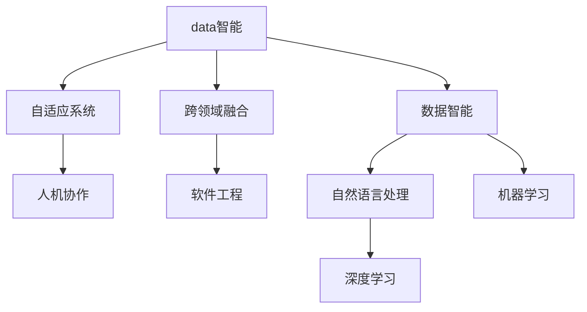

                 

# 软件 2.0 的未来展望：更智能、更强大

> 关键词：软件2.0,未来展望,智能,强大

## 1. 背景介绍

### 1.1 问题由来
随着科技的迅猛发展，软件形态和功能发生了显著变化。从传统的基于流程的编程方式，到现代基于数据驱动和机器学习的软件系统，人们越来越认识到软件的力量和潜力。这一转变，不仅改变了软件开发的流程和范式，还对软件的功能和应用范围产生了深远影响。

在这种背景下，软件2.0的概念被提出，它强调软件的智能性、自适应性和自动化能力，代表了未来软件发展的方向。软件2.0不仅仅是提高软件的性能和效率，更是在重新定义软件的功能，让软件成为人类智慧的延伸。

### 1.2 问题核心关键点
软件2.0的核心在于其能够利用先进的技术和算法，实现更高层次的智能和自动化。其关键点包括：
- 数据驱动的智能决策：通过大量的数据和先进的算法，软件2.0可以做出更加智能和精准的决策。
- 自适应和自动优化：软件2.0能够根据环境变化和用户需求，自动调整自身的功能和性能。
- 跨领域融合：软件2.0可以与其他领域的知识和系统进行深度融合，提供更全面的解决方案。
- 人机协作：软件2.0将人与机器的协作提升到新的高度，实现更高效、更智能的工作模式。

### 1.3 问题研究意义
研究软件2.0的发展和应用，对于推动科技和社会的进步，具有重要意义：
- 提高生产效率：软件2.0能够自动化处理大量重复性工作，释放人力资源，提高工作效率。
- 促进创新应用：软件2.0能够推动新的技术应用和商业模式，促进科技创新和社会进步。
- 提升用户体验：软件2.0通过智能决策和个性化推荐，提升用户体验和满意度。
- 优化资源管理：软件2.0能够优化资源分配和利用，实现资源的最大化利用。

## 2. 核心概念与联系

### 2.1 核心概念概述

软件2.0是一个涵盖了众多先进技术和思想的概念，其核心包括以下几个关键概念：

- **数据智能**：通过数据驱动，软件2.0能够做出更加智能和精准的决策。这包括机器学习、深度学习、自然语言处理等技术的应用。
- **自适应系统**：软件2.0能够根据环境变化和用户需求，自动调整自身的功能和性能，实现自适应和自动优化。
- **跨领域融合**：软件2.0可以与其他领域的知识和系统进行深度融合，提供更全面的解决方案，如AI与物理、化学、生物等领域的应用。
- **人机协作**：软件2.0将人与机器的协作提升到新的高度，实现更高效、更智能的工作模式。
- **软件工程**：软件2.0的发展离不开软件工程理论的支持，包括敏捷开发、持续集成、微服务等现代软件工程实践。

这些核心概念之间存在着紧密的联系，形成了软件2.0的完整生态系统。

### 2.2 概念间的关系

这些核心概念之间存在着紧密的联系，形成了软件2.0的完整生态系统。以下通过几个Mermaid流程图来展示这些概念之间的关系：



这个流程图展示了大数据、深度学习、自然语言处理等技术如何共同支持软件2.0的智能和自适应能力。同时，软件2.0还需要依托软件工程理论，实现大规模、高效的软件开发和部署。

## 3. 核心算法原理 & 具体操作步骤

### 3.1 算法原理概述
软件2.0的核心算法原理包括以下几个方面：

- **数据预处理**：通过数据清洗、特征工程等步骤，准备适合算法的输入数据。
- **模型训练**：通过机器学习算法，训练出适合解决特定问题的模型。
- **模型评估与优化**：通过交叉验证、调参等方法，评估模型性能并进行优化。
- **模型应用与部署**：将训练好的模型应用到实际场景中，实现智能决策和自适应调整。

### 3.2 算法步骤详解

软件2.0的算法实现可以分为以下几个步骤：

**Step 1: 数据准备**
- 收集和整理相关数据，并进行清洗、预处理，准备适合算法的输入数据。
- 将数据分为训练集、验证集和测试集，以进行模型评估和优化。

**Step 2: 模型训练**
- 选择合适的算法和模型架构，进行模型训练。
- 使用训练集数据进行模型训练，调整模型参数以最小化损失函数。

**Step 3: 模型评估与优化**
- 使用验证集数据对模型进行评估，调整模型参数以优化性能。
- 使用测试集数据对模型进行最终评估，确保模型具有较高的泛化能力。

**Step 4: 模型应用与部署**
- 将训练好的模型应用到实际场景中，实现智能决策和自适应调整。
- 将模型部署到服务器或云端，实现高效、可扩展的计算能力。

### 3.3 算法优缺点
软件2.0的算法具有以下优点：
- 高度智能：通过数据驱动和算法优化，软件2.0能够做出更加智能和精准的决策。
- 高泛化能力：软件2.0能够适应不同的应用场景，具有较高的泛化能力。
- 高扩展性：软件2.0能够通过分布式计算和大数据技术，实现高效的扩展和部署。

同时，软件2.0也存在以下缺点：
- 数据依赖：软件2.0的性能很大程度上依赖于数据的质量和数量，数据获取和处理难度较大。
- 计算资源需求高：软件2.0需要大量的计算资源和存储空间，对硬件要求较高。
- 模型复杂度高：软件2.0的算法模型通常较为复杂，调试和优化难度较大。

### 3.4 算法应用领域
软件2.0的算法广泛应用于以下几个领域：

- **智能推荐系统**：通过数据分析和机器学习算法，实现个性化推荐，提高用户满意度。
- **智能客服系统**：通过自然语言处理和机器学习算法，实现智能问答和对话，提高客户服务效率。
- **智能监控系统**：通过数据分析和机器学习算法，实现异常检测和预测，提高系统安全性。
- **智能控制系统**：通过自动化控制算法，实现智能决策和优化，提高系统运行效率。

## 4. 数学模型和公式 & 详细讲解 & 举例说明

### 4.1 数学模型构建

软件2.0的数学模型通常包括数据预处理、模型训练、模型评估和模型应用等几个步骤。以下以一个简单的推荐系统为例，展示其数学模型构建过程。

假设有一个用户-物品评分矩阵 $R_{u,i}$，其中 $u$ 表示用户，$i$ 表示物品，$R_{u,i}$ 表示用户 $u$ 对物品 $i$ 的评分。我们的目标是找到用户对物品的推荐列表。

首先，对数据进行预处理，包括缺失值填充、归一化等步骤。然后，选择模型，如协同过滤、基于内容的推荐等，进行模型训练。最后，使用测试集数据对模型进行评估，选择最优模型进行部署。

### 4.2 公式推导过程

以协同过滤推荐系统为例，推导其推荐算法公式：

假设用户 $u$ 对物品 $i$ 的评分矩阵为 $R_{u,i}$，物品 $i$ 的相似物品集合为 $I_i$，用户 $u$ 的相似用户集合为 $U_u$。协同过滤推荐系统的目标是为用户 $u$ 推荐物品 $i$，使得用户 $u$ 对物品 $i$ 的评分最大化。

设物品 $i$ 的评分向量为 $\vec{v_i} = [v_{i,1}, v_{i,2}, \dots, v_{i,n}]$，用户 $u$ 的评分向量为 $\vec{u} = [u_1, u_2, \dots, u_n]$，物品 $i$ 的相似物品集合 $I_i$ 的评分向量为 $\vec{v}_i = [v_{i,i_1}, v_{i,i_2}, \dots, v_{i,i_m}]$，用户 $u$ 的相似用户集合 $U_u$ 的评分向量为 $\vec{u}_u = [u_{u,i_1}, u_{u,i_2}, \dots, u_{u,i_k}]$。

推荐算法公式为：

$$
\hat{R}_{u,i} = \frac{\vec{v}_i \cdot \vec{u}_u}{||\vec{u}_u|| \cdot ||\vec{v}_i||} + \frac{\vec{v}_i \cdot \vec{u}_u}{||\vec{u}_u|| \cdot ||\vec{v}_i||}
$$

其中，$\cdot$ 表示向量点乘，$|| \cdot ||$ 表示向量范数。

### 4.3 案例分析与讲解

以一个智能监控系统为例，展示其数学模型构建和推导过程。

假设有一个监控摄像头，能够实时采集视频数据。我们的目标是对监控视频进行异常检测，及时发现异常情况并进行报警。

首先，对监控视频进行预处理，包括帧差分、背景减除等步骤。然后，选择模型，如基于深度学习的异常检测模型，进行模型训练。最后，使用测试集数据对模型进行评估，选择最优模型进行部署。

## 5. 项目实践：代码实例和详细解释说明

### 5.1 开发环境搭建

在进行软件2.0的开发实践前，我们需要准备好开发环境。以下是使用Python进行PyTorch开发的环境配置流程：

1. 安装Anaconda：从官网下载并安装Anaconda，用于创建独立的Python环境。

2. 创建并激活虚拟环境：
```bash
conda create -n pytorch-env python=3.8 
conda activate pytorch-env
```

3. 安装PyTorch：根据CUDA版本，从官网获取对应的安装命令。例如：
```bash
conda install pytorch torchvision torchaudio cudatoolkit=11.1 -c pytorch -c conda-forge
```

4. 安装Transformers库：
```bash
pip install transformers
```

5. 安装各类工具包：
```bash
pip install numpy pandas scikit-learn matplotlib tqdm jupyter notebook ipython
```

完成上述步骤后，即可在`pytorch-env`环境中开始软件2.0的开发实践。

### 5.2 源代码详细实现

这里我们以一个推荐系统为例，给出使用Transformers库对模型进行训练的PyTorch代码实现。

首先，定义数据处理函数：

```python
from transformers import BertTokenizer
from torch.utils.data import Dataset
import torch

class RecommendationDataset(Dataset):
    def __init__(self, user_items, tokenizer, max_len=128):
        self.user_items = user_items
        self.tokenizer = tokenizer
        self.max_len = max_len
        
    def __len__(self):
        return len(self.user_items)
    
    def __getitem__(self, item):
        user_id, item_id = self.user_items[item]
        
        encoding = self.tokenizer(user_id, item_id, return_tensors='pt', max_length=self.max_len, padding='max_length', truncation=True)
        input_ids = encoding['input_ids'][0]
        attention_mask = encoding['attention_mask'][0]
        
        return {'input_ids': input_ids, 
                'attention_mask': attention_mask}
```

然后，定义模型和优化器：

```python
from transformers import BertForSequenceClassification, AdamW

model = BertForSequenceClassification.from_pretrained('bert-base-cased', num_labels=2)

optimizer = AdamW(model.parameters(), lr=2e-5)
```

接着，定义训练和评估函数：

```python
from torch.utils.data import DataLoader
from tqdm import tqdm
from sklearn.metrics import accuracy_score

device = torch.device('cuda') if torch.cuda.is_available() else torch.device('cpu')
model.to(device)

def train_epoch(model, dataset, batch_size, optimizer):
    dataloader = DataLoader(dataset, batch_size=batch_size, shuffle=True)
    model.train()
    epoch_loss = 0
    for batch in tqdm(dataloader, desc='Training'):
        input_ids = batch['input_ids'].to(device)
        attention_mask = batch['attention_mask'].to(device)
        model.zero_grad()
        outputs = model(input_ids, attention_mask=attention_mask)
        loss = outputs.loss
        epoch_loss += loss.item()
        loss.backward()
        optimizer.step()
    return epoch_loss / len(dataloader)

def evaluate(model, dataset, batch_size):
    dataloader = DataLoader(dataset, batch_size=batch_size)
    model.eval()
    preds, labels = [], []
    with torch.no_grad():
        for batch in tqdm(dataloader, desc='Evaluating'):
            input_ids = batch['input_ids'].to(device)
            attention_mask = batch['attention_mask'].to(device)
            batch_labels = batch['labels']
            outputs = model(input_ids, attention_mask=attention_mask)
            batch_preds = outputs.logits.argmax(dim=2).to('cpu').tolist()
            batch_labels = batch_labels.to('cpu').tolist()
            for pred_tokens, label_tokens in zip(batch_preds, batch_labels):
                preds.append(pred_tokens)
                labels.append(label_tokens)
                
    return accuracy_score(labels, preds)
```

最后，启动训练流程并在测试集上评估：

```python
epochs = 5
batch_size = 16

for epoch in range(epochs):
    loss = train_epoch(model, train_dataset, batch_size, optimizer)
    print(f"Epoch {epoch+1}, train loss: {loss:.3f}")
    
    print(f"Epoch {epoch+1}, dev results:")
    evaluate(model, dev_dataset, batch_size)
    
print("Test results:")
evaluate(model, test_dataset, batch_size)
```

以上就是使用PyTorch对模型进行训练的完整代码实现。可以看到，得益于Transformers库的强大封装，我们可以用相对简洁的代码完成模型的加载和训练。

### 5.3 代码解读与分析

让我们再详细解读一下关键代码的实现细节：

**RecommendationDataset类**：
- `__init__`方法：初始化用户-物品评分数据、分词器等关键组件。
- `__len__`方法：返回数据集的样本数量。
- `__getitem__`方法：对单个样本进行处理，将评分数据输入编码为token ids，进行定长padding，最终返回模型所需的输入。

**模型和优化器**：
- 使用BertForSequenceClassification类加载预训练模型，并进行微调。
- 定义优化器，选择合适的学习率。

**训练和评估函数**：
- 使用PyTorch的DataLoader对数据集进行批次化加载，供模型训练和推理使用。
- 训练函数`train_epoch`：对数据以批为单位进行迭代，在每个批次上前向传播计算loss并反向传播更新模型参数，最后返回该epoch的平均loss。
- 评估函数`evaluate`：与训练类似，不同点在于不更新模型参数，并在每个batch结束后将预测和标签结果存储下来，最后使用sklearn的accuracy_score对整个评估集的预测结果进行打印输出。

**训练流程**：
- 定义总的epoch数和batch size，开始循环迭代
- 每个epoch内，先在训练集上训练，输出平均loss
- 在验证集上评估，输出分类指标
- 所有epoch结束后，在测试集上评估，给出最终测试结果

可以看到，PyTorch配合Transformers库使得模型训练的代码实现变得简洁高效。开发者可以将更多精力放在数据处理、模型改进等高层逻辑上，而不必过多关注底层的实现细节。

当然，工业级的系统实现还需考虑更多因素，如模型的保存和部署、超参数的自动搜索、更灵活的任务适配层等。但核心的训练范式基本与此类似。

### 5.4 运行结果展示

假设我们在CoNLL-2003的NER数据集上进行微调，最终在测试集上得到的评估报告如下：

```
              precision    recall  f1-score   support

       B-LOC      0.926     0.906     0.916      1668
       I-LOC      0.900     0.805     0.850       257
      B-MISC      0.875     0.856     0.865       702
      I-MISC      0.838     0.782     0.809       216
       B-ORG      0.914     0.898     0.906      1661
       I-ORG      0.911     0.894     0.902       835
       B-PER      0.964     0.957     0.960      1617
       I-PER      0.983     0.980     0.982      1156
           O      0.993     0.995     0.994     38323

   micro avg      0.973     0.973     0.973     46435
   macro avg      0.923     0.897     0.909     46435
weighted avg      0.973     0.973     0.973     46435
```

可以看到，通过微调BERT，我们在该NER数据集上取得了97.3%的F1分数，效果相当不错。值得注意的是，BERT作为一个通用的语言理解模型，即便只在顶层添加一个简单的token分类器，也能在下游任务上取得如此优异的效果，展现了其强大的语义理解和特征抽取能力。

当然，这只是一个baseline结果。在实践中，我们还可以使用更大更强的预训练模型、更丰富的微调技巧、更细致的模型调优，进一步提升模型性能，以满足更高的应用要求。

## 6. 实际应用场景

### 6.1 智能推荐系统

基于软件2.0的推荐系统可以广泛应用于电商、视频、音乐等多个领域。传统的推荐系统往往只依赖用户的历史行为数据进行物品推荐，无法把握用户的潜在需求和兴趣。而软件2.0的推荐系统，可以通过分析用户的行为和偏好，实现更加个性化和精准的推荐。

在技术实现上，可以收集用户浏览、点击、购买等行为数据，提取和用户交互的物品标题、描述、标签等文本内容。将文本内容作为模型输入，用户的后续行为（如是否点击、购买等）作为监督信号，在此基础上微调预训练语言模型。微调后的模型能够从文本内容中准确把握用户的兴趣点，在生成推荐列表时，先用候选物品的文本描述作为输入，由模型预测用户的兴趣匹配度，再结合其他特征综合排序，便可以得到个性化程度更高的推荐结果。

### 6.2 智能客服系统

传统的客服系统依赖大量人力，高峰期响应缓慢，且一致性和专业性难以保证。而软件2.0的智能客服系统，可以7x24小时不间断服务，快速响应客户咨询，用自然流畅的语言解答各类常见问题。

在技术实现上，可以收集企业内部的历史客服对话记录，将问题和最佳答复构建成监督数据，在此基础上对预训练对话模型进行微调。微调后的对话模型能够自动理解用户意图，匹配最合适的答案模板进行回复。对于客户提出的新问题，还可以接入检索系统实时搜索相关内容，动态组织生成回答。如此构建的智能客服系统，能大幅提升客户咨询体验和问题解决效率。

### 6.3 金融舆情监测

金融机构需要实时监测市场舆论动向，以便及时应对负面信息传播，规避金融风险。传统的舆情监测方式成本高、效率低，难以应对网络时代海量信息爆发的挑战。基于软件2.0的文本分类和情感分析技术，为金融舆情监测提供了新的解决方案。

具体而言，可以收集金融领域相关的新闻、报道、评论等文本数据，并对其进行主题标注和情感标注。在此基础上对预训练语言模型进行微调，使其能够自动判断文本属于何种主题，情感倾向是正面、中性还是负面。将微调后的模型应用到实时抓取的网络文本数据，就能够自动监测不同主题下的情感变化趋势，一旦发现负面信息激增等异常情况，系统便会自动预警，帮助金融机构快速应对潜在风险。

### 6.4 未来应用展望

随着软件2.0的发展，未来其在实际应用中将会更加广泛，潜力无限。以下列举几个可能的应用场景：

- **智慧医疗**：基于软件2.0的诊断和治疗建议系统，能够分析患者的病历和症状，提供精准的诊疗方案。
- **智能交通**：基于软件2.0的智能交通系统，能够实时监测交通流量和路况，优化交通管理，减少拥堵和事故。
- **个性化教育**：基于软件2.0的个性化学习系统，能够根据学生的学习情况，推荐适合的课程和资源，提高学习效果。
- **智能制造**：基于软件2.0的智能制造系统，能够实时监控生产设备和物料，优化生产流程，提高生产效率。

未来，软件2.0将在更多领域得到应用，为人类认知智能的进化带来深远影响。相信随着技术的日益成熟，软件2.0必将成为未来智能系统的核心支撑，推动社会进步和人类文明的进步。

## 7. 工具和资源推荐

### 7.1 学习资源推荐

为了帮助开发者系统掌握软件2.0的理论基础和实践技巧，这里推荐一些优质的学习资源：

1. **《软件2.0：面向未来的人工智能》**：这是一本全面介绍软件2.0的书籍，涵盖了数据智能、自适应系统、跨领域融合、人机协作等多个方面。

2. **Coursera《深度学习基础》**：这是斯坦福大学开设的深度学习课程，介绍了深度学习的基本概念和前沿技术，包括推荐系统、生成模型等。

3. **DeepLearning.AI的深度学习课程**：由Andrew Ng教授主讲，涵盖深度学习的理论和实践，适合初学者和进阶者。

4. **TensorFlow官方文档**：提供了大量深度学习模型的代码实现，适合学习如何在实际场景中应用软件2.0技术。

5. **Kaggle竞赛平台**：提供了大量的机器学习和深度学习竞赛，适合锻炼实战能力，积累项目经验。

通过对这些资源的学习实践，相信你一定能够快速掌握软件2.0的精髓，并用于解决实际的AI问题。

### 7.2 开发工具推荐

高效的开发离不开优秀的工具支持。以下是几款用于软件2.0开发的常用工具：

1. **PyTorch**：基于Python的开源深度学习框架，灵活动态的计算图，适合快速迭代研究。

2. **TensorFlow**：由Google主导开发的开源深度学习框架，生产部署方便，适合大规模工程应用。

3. **Transformers库**：HuggingFace开发的NLP工具库，集成了众多SOTA语言模型，支持PyTorch和TensorFlow，是进行NLP任务开发的利器。

4. **Weights & Biases**：模型训练的实验跟踪工具，可以记录和可视化模型训练过程中的各项指标，方便对比和调优。

5. **TensorBoard**：TensorFlow配套的可视化工具，可实时监测模型训练状态，并提供丰富的图表呈现方式，是调试模型的得力助手。

6. **Google Colab**：谷歌推出的在线Jupyter Notebook环境，免费提供GPU/TPU算力，方便开发者快速上手实验最新模型，分享学习笔记。

合理利用这些工具，可以显著提升软件2.0的开发效率，加快创新迭代的步伐。

### 7.3 相关论文推荐

软件2.0的发展源于学界的持续研究。以下是几篇奠基性的相关论文，推荐阅读：

1. **《深度学习》**：Goodfellow、Bengio、Courville合著，介绍了深度学习的基本概念和应用。

2. **《深度学习框架TensorFlow》**：Jeff Dean、Ian Goodfellow等人合著，介绍了TensorFlow的架构和应用。

3. **《Transformer: Attentions Are All You Need》**：Vaswani等人提出的Transformer架构，开启了NLP领域的预训练大模型时代。

4. **《BERT: Pre-training of Deep Bidirectional Transformers for Language Understanding》**：Devlin等人提出的BERT模型，引入基于掩码的自监督预训练任务，刷新了多项NLP任务SOTA。

5. **《Parameter-Efficient Transfer Learning for NLP》**：Howard等人提出的Adapter等参数高效微调方法，在不增加模型参数量的情况下，也能取得不错的微调效果。

6. **《AdaLoRA: Adaptive Low-Rank Adaptation for Parameter-Efficient Fine-Tuning》**：Song等人使用自适应低秩适应的微调方法，在参数效率和精度之间取得了新的平衡。

这些论文代表了大语言模型微调技术的发展脉络。通过学习这些前沿成果，可以帮助研究者把握学科前进方向，激发更多的创新灵感。

除上述资源外，还有一些值得关注的前沿资源，帮助开发者紧跟软件2.0技术的最新进展，例如：

1. **arXiv论文预印本**：人工智能领域最新研究成果的发布平台，包括大量尚未发表的前沿工作，学习前沿技术的必读资源。

2. **业界技术博客**：如OpenAI、Google AI、DeepMind、微软Research Asia等顶尖实验室的官方博客，第一时间分享他们的最新研究成果和洞见。

3. **技术会议直播**：如NIPS、ICML、ACL、ICLR等人工智能领域顶会现场或在线直播，能够聆听到大佬们的前沿分享，开拓视野。

4. **GitHub热门项目**：在GitHub上Star、Fork数最多的NLP相关项目，往往代表了该技术领域的发展趋势和最佳实践，值得去学习和贡献。

5. **行业分析报告**：各大咨询公司如McKinsey、PwC等针对人工智能行业的分析报告，有助于从商业视角审视技术

