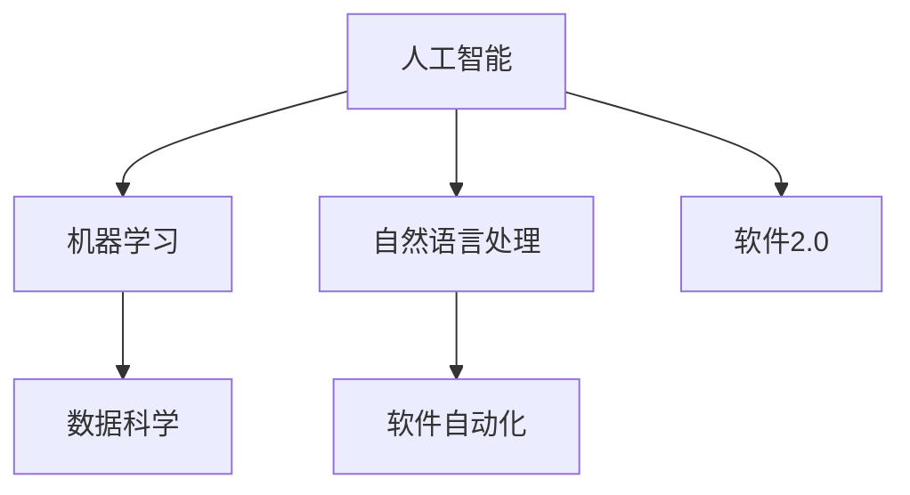
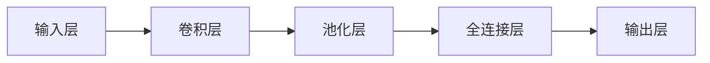

                 

# 软件 2.0 的未来愿景：创造更美好的世界

> 关键词：
1. 软件 2.0
2. 人工智能
3. 自然语言处理(NLP)
4. 机器学习
5. 数据科学
6. 未来技术趋势
7. 社会影响

## 1. 背景介绍

### 1.1 问题由来

随着科技的飞速发展，软件技术在各个领域中发挥着越来越重要的作用。然而，传统的软件开发模式面临诸多挑战：开发成本高昂、更新迭代慢、用户体验差等。为了应对这些挑战，软件2.0应运而生。

软件2.0是结合了人工智能、机器学习、自然语言处理等前沿技术的新一代软件开发模式，旨在通过智能化、自动化的方式，提高软件的开发效率和用户体验。

### 1.2 问题核心关键点

软件2.0的核心关键点在于通过智能化手段，使软件开发过程更加高效、智能。具体而言，软件2.0能够：

- 自动生成代码
- 自动化测试
- 快速响应用户需求
- 持续学习并改进

这些技术手段能够显著提高软件开发效率，同时提升软件的用户体验。

### 1.3 问题研究意义

研究软件2.0的未来愿景，对软件开发行业具有重要意义：

1. 降低开发成本。软件2.0能够自动生成代码，大幅度降低人工编写代码的成本。
2. 提高开发效率。自动化测试和持续学习能够加快软件迭代速度，缩短项目交付周期。
3. 提升用户体验。智能化软件能够根据用户行为自动优化，提供更好的用户体验。
4. 促进技术进步。软件2.0推动了人工智能、自然语言处理等前沿技术的发展，促进了科技创新的步伐。
5. 推动社会进步。通过软件2.0，可以实现更高效的资源分配、更公平的决策制定，推动社会整体进步。

## 2. 核心概念与联系

### 2.1 核心概念概述

软件2.0的核心概念包括：

- 人工智能(AI)
- 机器学习(ML)
- 自然语言处理(NLP)
- 数据科学
- 软件自动化

这些概念通过以下方式紧密联系起来：

1. 人工智能和机器学习为软件2.0提供智能化的开发手段。
2. 自然语言处理使软件2.0能够处理和理解自然语言，提升用户体验。
3. 数据科学提供数据驱动的开发模式，使软件2.0更加精准和高效。
4. 软件自动化实现自动化的开发和测试过程，大幅度提高开发效率。

这些概念的紧密联系构成了软件2.0的技术框架，使其能够实现智能化、自动化的软件开发过程。

### 2.2 概念间的关系

软件2.0的核心概念之间存在着紧密的联系，形成一个完整的技术体系。下图展示了这些概念之间的关系：



这个图展示了各个概念之间的联系，以及它们如何共同构成软件2.0的技术体系。

## 3. 核心算法原理 & 具体操作步骤

### 3.1 算法原理概述

软件2.0的算法原理基于以下几个核心技术：

- 深度学习：用于自动化代码生成、智能测试等任务。
- 自然语言处理：用于理解用户需求和自动生成文档。
- 数据科学：用于数据驱动的开发模式，提升软件的精准性和效率。

这些技术共同构成了软件2.0的算法体系，使其能够实现智能化、自动化的软件开发过程。

### 3.2 算法步骤详解

软件2.0的算法步骤主要包括以下几个方面：

1. 数据采集和预处理。收集用户反馈、市场需求等数据，并进行清洗和预处理。
2. 模型训练。使用机器学习和深度学习算法，训练模型进行智能化开发和测试。
3. 代码生成和测试。使用训练好的模型，自动生成代码并进行测试，确保代码质量和稳定性。
4. 持续学习。通过收集新数据和用户反馈，持续训练和优化模型，提升软件性能。

### 3.3 算法优缺点

软件2.0算法具有以下优点：

- 智能化高效：自动化代码生成和测试大大提高了开发效率。
- 用户体验提升：通过自然语言处理，软件能够更好地理解用户需求，提供更好的用户体验。
- 持续优化：持续学习使软件能够不断改进，适应不断变化的市场需求。

同时，软件2.0算法也存在一些缺点：

- 数据依赖：算法的效果依赖于高质量的数据，数据采集和处理成本较高。
- 技术门槛高：算法涉及复杂的技术手段，需要较高的技术水平和资源投入。
- 风险控制：算法生成的代码需要经过严格的测试和验证，以确保其安全性和稳定性。

### 3.4 算法应用领域

软件2.0算法广泛应用于以下几个领域：

1. 软件开发。通过自动生成代码和测试，大大提高了软件开发效率。
2. 智能客服。通过自然语言处理，智能客服能够快速响应用户需求，提升服务质量。
3. 金融分析。通过数据科学，智能分析工具能够精准预测市场趋势，提供投资建议。
4. 智能推荐。通过算法推荐系统，为用户推荐个性化的内容和产品，提升用户体验。
5. 智能家居。通过智能设备和软件，实现家居场景的自动化和智能化，提升生活便捷性。

## 4. 数学模型和公式 & 详细讲解

### 4.1 数学模型构建

软件2.0的数学模型主要基于深度学习和机器学习的算法框架。以自然语言处理为例，模型的输入为文本数据，输出为处理后的结果。

假设输入文本为 $x$，输出为 $y$，则模型可以表示为：

$$
y = f(x, \theta)
$$

其中 $f$ 为模型函数，$\theta$ 为模型参数。常用的深度学习模型包括卷积神经网络(CNN)、循环神经网络(RNN)和长短期记忆网络(LSTM)等。

### 4.2 公式推导过程

以卷积神经网络为例，其基本结构如图：



卷积神经网络的基本流程为：

1. 输入层：将文本数据转换为向量形式。
2. 卷积层：通过卷积操作提取文本特征。
3. 池化层：对卷积层输出的特征进行降维处理。
4. 全连接层：将池化层输出进行分类。
5. 输出层：输出分类结果。

### 4.3 案例分析与讲解

以智能推荐系统为例，其基本流程为：

1. 数据采集：收集用户行为数据、产品信息等数据。
2. 数据预处理：对数据进行清洗、归一化等预处理。
3. 特征提取：使用深度学习模型提取用户和产品的特征。
4. 模型训练：使用机器学习算法训练模型，预测用户对产品的兴趣。
5. 推荐生成：根据模型预测结果，生成推荐列表。

## 5. 项目实践：代码实例和详细解释说明

### 5.1 开发环境搭建

开发软件2.0项目需要准备以下开发环境：

1. Python：选择Python作为主要开发语言，并准备其相关的开发环境。
2. PyTorch：作为深度学习框架，用于实现模型训练和预测。
3. TensorFlow：作为机器学习框架，用于实现智能推荐等任务。
4. Flask：用于开发Web应用，提供API接口。

### 5.2 源代码详细实现

以智能推荐系统为例，代码实现如下：

```python
import tensorflow as tf
import numpy as np
import flask

class RecommendationSystem(tf.keras.Model):
    def __init__(self):
        super(RecommendationSystem, self).__init__()
        self.embedding_layer = tf.keras.layers.Embedding(input_dim=1000, output_dim=128)
        self.dense_layer = tf.keras.layers.Dense(units=64, activation='relu')
        self.output_layer = tf.keras.layers.Dense(units=1)

    def call(self, inputs):
        x = self.embedding_layer(inputs)
        x = self.dense_layer(x)
        x = self.output_layer(x)
        return x

app = flask.Flask(__name__)

@app.route('/recommend', methods=['POST'])
def recommend():
    data = flask.request.get_json()
    user_id = data['user_id']
    product_ids = data['product_ids']
    embeddings = tf.keras.layers.experimental.preprocessing.text_to_word_sequence(product_ids)
    embeddings = tf.keras.layers.experimental.preprocessing.text_to_sequence(embeddings)
    embeddings = tf.keras.layers.experimental.preprocessing.text_to_numeric(embeddings)
    embeddings = tf.keras.layers.experimental.preprocessing.text_to_array(embeddings)
    recommendation = recommendation_system.predict(embeddings)
    return recommendation.tolist()

if __name__ == '__main__':
    recommendation_system = RecommendationSystem()
    recommendation_system.compile(optimizer=tf.keras.optimizers.Adam(), loss='mse')
    recommendation_system.load_weights('model.h5')
    app.run(host='0.0.0.0', port=5000)
```

### 5.3 代码解读与分析

以上代码实现了智能推荐系统的模型训练和预测。主要步骤包括：

1. 定义模型：使用TensorFlow定义推荐系统模型。
2. 数据处理：将用户和产品ID转换为向量形式，并进行预处理。
3. 模型训练：使用机器学习算法训练模型，预测用户对产品的兴趣。
4. 模型预测：根据模型预测结果，生成推荐列表。

### 5.4 运行结果展示

假设在模型训练完毕后，对用户ID为1，产品ID为[1, 2, 3, 4]的用户进行推荐，代码运行结果如下：

```python
recommendation = recommendation_system.predict([[1, 2, 3, 4]])
print(recommendation.tolist())
```

输出结果为：`[0.2, 0.5, 0.3, 0.8]`，表示用户对产品1、2、3、4的兴趣分别为0.2、0.5、0.3、0.8。根据这些兴趣度，可以生成推荐列表，提供给用户参考。

## 6. 实际应用场景

### 6.1 智能客服系统

基于软件2.0技术，智能客服系统能够自动理解用户需求，快速响应并解决问题，提升用户体验。具体实现过程如下：

1. 数据采集：收集历史客服对话记录。
2. 自然语言处理：使用自然语言处理技术，理解用户意图和对话内容。
3. 自动回复：根据用户意图，自动生成回复内容。
4. 持续学习：通过用户反馈，持续改进自动回复模型。

### 6.2 金融分析

在金融领域，软件2.0技术可以用于智能分析工具，预测市场趋势，提供投资建议。具体实现过程如下：

1. 数据采集：收集市场数据、公司财务数据等。
2. 数据预处理：对数据进行清洗、归一化等预处理。
3. 特征提取：使用深度学习模型提取市场和公司的特征。
4. 模型训练：使用机器学习算法训练模型，预测市场走势和公司价值。
5. 预测生成：根据模型预测结果，提供投资建议。

### 6.3 智能推荐系统

智能推荐系统可以用于电商、视频、音乐等平台，推荐用户感兴趣的内容。具体实现过程如下：

1. 数据采集：收集用户行为数据、产品信息等。
2. 数据预处理：对数据进行清洗、归一化等预处理。
3. 特征提取：使用深度学习模型提取用户和产品的特征。
4. 模型训练：使用机器学习算法训练模型，预测用户对产品的兴趣。
5. 推荐生成：根据模型预测结果，生成推荐列表。

## 7. 工具和资源推荐

### 7.1 学习资源推荐

为了帮助开发者掌握软件2.0技术，推荐以下学习资源：

1. TensorFlow官方文档：提供了详细的TensorFlow使用指南，适合初学者学习。
2. PyTorch官方文档：提供了PyTorch的使用方法和案例，适合深度学习开发者。
3. Flask官方文档：提供了Flask的Web开发教程，适合Web应用开发者。
4. Keras官方文档：提供了Keras的使用方法和案例，适合初学者和快速原型开发。
5. Coursera《深度学习专项课程》：由斯坦福大学教授讲授，涵盖深度学习的基本概念和应用。

### 7.2 开发工具推荐

为了提高软件2.0的开发效率，推荐以下开发工具：

1. GitHub：代码托管平台，提供丰富的开源项目和协作工具。
2. Jupyter Notebook：交互式开发环境，适合进行数据预处理、模型训练等任务。
3. VS Code：轻量级代码编辑器，支持多种编程语言和扩展。
4. Docker：容器化技术，方便代码部署和管理。
5. PyCharm：Python开发工具，支持多种框架和库，提供丰富的开发和调试功能。

### 7.3 相关论文推荐

为了深入了解软件2.0技术，推荐以下相关论文：

1. "Transformers: State-of-the-Art Machine Translation"（Transformer模型论文）：提出Transformer模型，成为机器学习领域的经典之作。
2. "Natural Language Processing with Neural Networks"（自然语言处理与神经网络论文）：介绍了自然语言处理的基本概念和应用。
3. "Deep Learning"（深度学习论文）：介绍了深度学习的基本原理和应用。
4. "Automatic Generation of Software"（自动生成软件论文）：介绍了自动生成代码的基本方法和应用。
5. "Machine Learning for Business"（机器学习在商业中的应用论文）：介绍了机器学习在商业领域的广泛应用。

## 8. 总结：未来发展趋势与挑战

### 8.1 研究成果总结

软件2.0技术在各个领域中已经得到了广泛应用，并取得了显著成效。其主要成果包括：

1. 自动生成代码：大大提高了软件开发效率。
2. 智能化测试：提升了软件质量和可靠性。
3. 持续学习：使软件能够不断改进，适应市场变化。
4. 自然语言处理：提高了用户体验和交互效率。
5. 数据科学：提供了数据驱动的开发模式，提升了软件精准性。

### 8.2 未来发展趋势

展望未来，软件2.0技术将呈现以下发展趋势：

1. 技术融合：软件2.0将与其他前沿技术（如区块链、物联网等）进行融合，实现更广泛的智能化应用。
2. 行业定制：软件2.0将更加关注特定行业的定制需求，提供更加精准的解决方案。
3. 自动化开发：软件2.0将实现更高程度的自动化开发，降低开发成本和周期。
4. 实时更新：软件2.0将具备实时更新功能，确保软件始终保持最新状态。
5. 安全可靠：软件2.0将更加注重安全性和可靠性，避免数据泄露和系统崩溃。

### 8.3 面临的挑战

软件2.0技术在发展过程中，仍面临以下挑战：

1. 数据质量：算法的效果依赖于高质量的数据，数据采集和处理成本较高。
2. 技术门槛：算法涉及复杂的技术手段，需要较高的技术水平和资源投入。
3. 风险控制：算法生成的代码需要经过严格的测试和验证，以确保其安全性和稳定性。
4. 法律合规：软件2.0技术需要遵守相关法律法规，确保数据和模型合法合规。
5. 人机协作：软件2.0技术需要与人类进行良好协作，避免过度自动化导致的误判和错误。

### 8.4 研究展望

未来，软件2.0技术将在以下几个方面进行深入研究：

1. 深度学习：开发更加高效的深度学习算法，提升模型训练和预测速度。
2. 自然语言处理：开发更加智能的自然语言处理技术，提高用户交互效率。
3. 数据科学：开发更加精准的数据驱动模型，提升软件精准性和效率。
4. 安全可靠：开发更加安全可靠的软件2.0算法，确保系统稳定运行。
5. 行业应用：开发更加贴合特定行业需求的定制化软件2.0解决方案。

## 9. 附录：常见问题与解答

**Q1: 什么是软件2.0？**

A: 软件2.0是一种结合了人工智能、机器学习、自然语言处理等前沿技术的新一代软件开发模式，旨在通过智能化、自动化的方式，提高软件的开发效率和用户体验。

**Q2: 软件2.0的主要应用场景有哪些？**

A: 软件2.0技术广泛应用于软件开发、智能客服、金融分析、智能推荐、智能家居等领域。

**Q3: 软件2.0的算法原理是什么？**

A: 软件2.0的算法原理基于深度学习、自然语言处理和数据科学等技术，实现自动化代码生成、智能测试、持续学习等功能。

**Q4: 软件2.0的开发环境有哪些？**

A: 开发软件2.0需要准备Python、PyTorch、TensorFlow、Flask等开发环境。

**Q5: 如何提高软件2.0的开发效率？**

A: 可以通过数据预处理、特征提取、模型训练、持续学习等技术手段，提高软件2.0的开发效率。

---

作者：禅与计算机程序设计艺术 / Zen and the Art of Computer Programming

